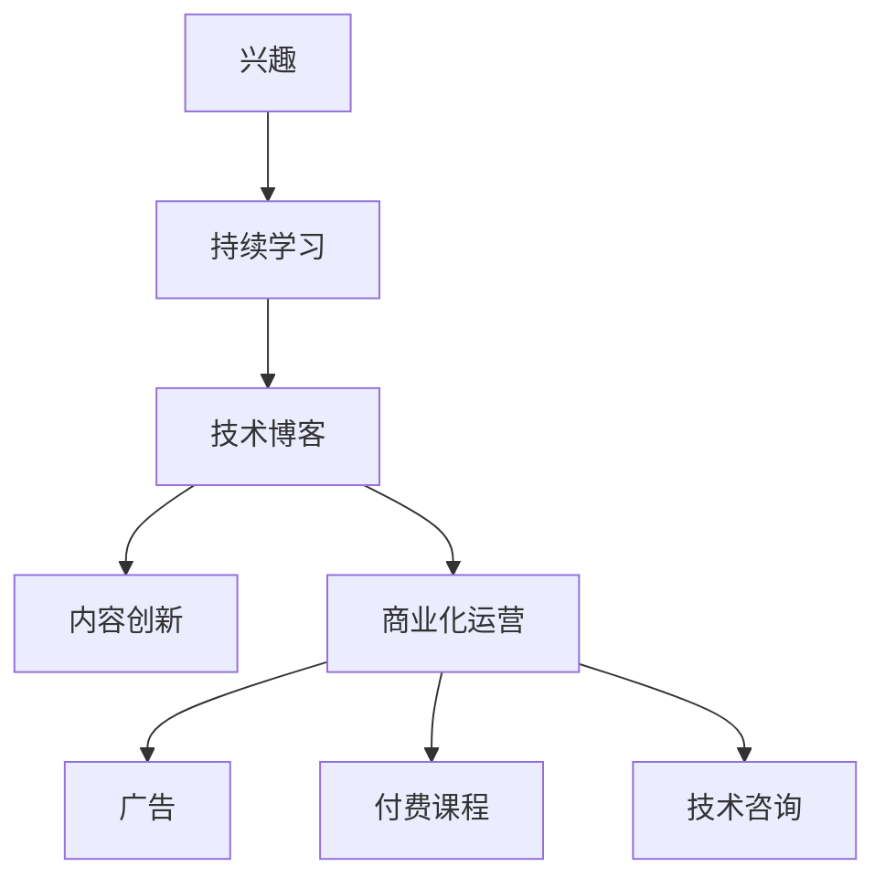

                 

# 技术博客：从兴趣到主要收入来源

> 关键词：人工智能,兴趣驱动,技术博客,编程,收入来源

## 1. 背景介绍

### 1.1 问题由来
在当今信息化时代，人工智能（AI）已经逐渐成为一种不可或缺的技术。随着AI技术的普及，越来越多的人开始对这一领域产生了浓厚的兴趣。但真正将这种兴趣转化为主要收入来源的却少之又少。本文将从个人兴趣、技术博客到主要收入来源这一过程出发，探讨如何在AI领域通过技术博客实现这一转变。

### 1.2 问题核心关键点
对于技术博主而言，从兴趣到收入来源的转变，关键在于以下三个方面：
- 持续学习与实践：保持对AI领域的持续学习和实践，积累丰富的技术经验和知识。
- 内容创新与深度：持续输出具有深度和创新性的技术博客内容，吸引大量读者和粉丝。
- 商业化运营：将技术博客商业化，通过广告、课程、咨询等形式实现收入。

## 2. 核心概念与联系

### 2.1 核心概念概述
技术博客是一个集中展示个人技术经验和思考的平台，其核心概念包括：
- 内容：技术博客的主要组成部分，涵盖编程语言、AI算法、系统架构、项目实践等。
- 读者：技术博客的受众，通常为技术人员、学生或AI领域爱好者。
- 收入来源：技术博主通过广告、付费课程、技术咨询等方式实现收入。

### 2.2 核心概念原理和架构的 Mermaid 流程图



这个流程图展示了从兴趣到技术博客，再到收入来源的过程。

1. 兴趣是启动点，持续学习是基础，技术博客是平台，内容创新是关键，商业化运营是实现收入的路径。
2. 内容创新和商业化运营相互作用，形成良性循环，进一步提升技术博客的影响力和收入水平。

## 3. 核心算法原理 & 具体操作步骤
### 3.1 算法原理概述

技术博客的核心算法原理主要涉及两个方面：内容生成和收入来源获取。

1. **内容生成**：
   - **选题与素材收集**：根据个人兴趣和市场需求，确定博客主题，收集相关素材和资料。
   - **内容创作与编辑**：撰写博客内容，并对其进行编辑和优化，确保内容的准确性和可读性。
   - **发布与推广**：将博客内容发布到博客平台或社交媒体，并通过各种渠道进行推广。

2. **收入来源获取**：
   - **广告收入**：通过博客页面展示广告，根据展示次数或点击率获取收入。
   - **付费课程**：提供技术课程或在线讲座，通过付费方式获取收入。
   - **技术咨询**：为其他企业或个人提供技术咨询和解决方案，收取咨询费。

### 3.2 算法步骤详解

#### 内容生成步骤
1. **选题与素材收集**
   - 根据个人兴趣和市场需求，确定博客主题，如深度学习、自然语言处理、计算机视觉等。
   - 收集相关的学术论文、技术报告、开源项目等素材，确保内容的权威性和可信度。

2. **内容创作与编辑**
   - 撰写博客文章，确保内容的逻辑性和连贯性，避免冗余和错误。
   - 使用Markdown格式编写博客，使其易于排版和编辑。
   - 对博客内容进行编辑和校对，确保语言表达准确、流畅。

3. **发布与推广**
   - 将博客内容发布到博客平台，如Medium、CSDN等。
   - 利用社交媒体平台，如Twitter、LinkedIn等，推广博客内容，吸引更多读者。

#### 收入来源获取步骤
1. **广告收入**
   - 在博客页面展示广告，如Google AdSense、Baidu LME等，获取展示收入。
   - 根据广告点击率或展示次数，按点击量或展示次数计费，实现收入。

2. **付费课程**
   - 在博客平台上提供付费课程或在线讲座，如Udemy、Coursera等。
   - 设置课程价格，吸引学员购买和参与，并通过课程销售获取收入。

3. **技术咨询**
   - 为其他企业或个人提供技术咨询和解决方案，如技术方案设计、系统架构优化等。
   - 收取咨询费，获取收入。

### 3.3 算法优缺点

**内容生成的优缺点**：
- **优点**：
  - 内容创新性强，能够吸引大量读者和粉丝。
  - 形式多样，包括文字、图片、视频等，易于阅读和理解。
- **缺点**：
  - 创作耗时耗力，需要大量时间投入。
  - 内容质量难以保证，存在出错或重复的风险。

**收入来源获取的优缺点**：
- **优点**：
  - 多样化的收入渠道，如广告、付费课程、技术咨询等。
  - 收入来源稳定，能够实现持续收入。
- **缺点**：
  - 需要大量的资源和精力进行推广和维护。
  - 市场竞争激烈，需要持续创新和优化。

### 3.4 算法应用领域
技术博客的应用领域非常广泛，涵盖了各种技术领域和行业，如：
- **IT与软件工程**：提供编程语言、软件开发工具、系统架构等内容。
- **数据科学与人工智能**：提供机器学习、深度学习、自然语言处理等内容。
- **网络安全**：提供网络安全技术、渗透测试等内容。
- **游戏开发**：提供游戏开发技术、引擎使用等内容。

## 4. 数学模型和公式 & 详细讲解 & 举例说明
### 4.1 数学模型构建

技术博客的数学模型可以简单表示为：
$$
\text{收入} = \text{读者数} \times \text{点击率} \times \text{广告收入} + \text{付费学员数} \times \text{课程价格} + \text{咨询客户数} \times \text{咨询费率}
$$

### 4.2 公式推导过程

假设每篇博客的读者数为 $N$，点击率为 $p$，广告收入为 $A$，每篇博客的付费学员数为 $M$，每名学员的课程价格为 $C$，每名客户的咨询费率为 $R$，则总收入 $I$ 可以表示为：
$$
I = N \times p \times A + M \times C + \text{咨询客户数} \times R
$$

### 4.3 案例分析与讲解

以一篇深度学习相关的技术博客为例：
- **选题与素材收集**：主题为“TensorFlow 2.0深度学习框架详解”。
- **内容创作与编辑**：撰写一篇详细介绍TensorFlow 2.0的教程，并使用Markdown格式编写。
- **发布与推广**：发布到CSDN和Medium，并通过Twitter和LinkedIn进行推广。
- **广告收入**：在博客页面展示Google AdSense广告。
- **付费课程**：在Udemy上提供付费课程，教授TensorFlow 2.0的使用。
- **技术咨询**：提供针对TensorFlow 2.0的个性化咨询和解决方案。

## 5. 项目实践：代码实例和详细解释说明
### 5.1 开发环境搭建

- **工具和环境**：
  - 开发工具：VSCode、PyCharm等
  - 平台：Windows、Linux、MacOS等
  - 依赖：Python、Markdown、Git等

- **环境配置**：
  - 安装Python环境，配置虚拟环境
  - 安装Markdown编辑器
  - 配置Git仓库，进行版本控制

### 5.2 源代码详细实现

以下是一个简单的Markdown格式博客内容的示例：

```markdown
# 深度学习入门教程

深度学习是当前最热门的人工智能技术之一，本文将介绍深度学习的基本概念、常见算法和应用场景。

## 一、深度学习基础

深度学习是一种基于神经网络的机器学习方法，其核心在于构建多层神经网络，通过反向传播算法进行训练。深度学习在图像识别、语音识别、自然语言处理等领域取得了显著的成果。

## 二、常见算法

深度学习中常用的算法包括：

- **卷积神经网络（CNN）**：广泛应用于图像处理和计算机视觉领域。
- **循环神经网络（RNN）**：常用于序列数据处理，如文本生成和语音识别。
- **长短期记忆网络（LSTM）**：一种特殊的RNN，用于处理长期依赖关系。

## 三、应用场景

深度学习在以下领域有广泛应用：

- **图像识别**：如图像分类、目标检测、人脸识别等。
- **语音识别**：如语音转文本、自动语音识别等。
- **自然语言处理**：如机器翻译、情感分析、文本摘要等。

## 四、总结

深度学习作为一种强大的机器学习方法，在多个领域展示了其强大的应用潜力。随着技术的不断进步，深度学习将在更多领域发挥重要作用。

```

### 5.3 代码解读与分析

在代码实现中，需要考虑以下几个方面：
- **Markdown语法**：熟悉Markdown语法，包括标题、列表、代码块、链接等。
- **文件格式**：使用MD文件格式，方便进行版本控制和代码管理。
- **工具集成**：使用VSCode等编辑器，通过插件集成Markdown支持。

### 5.4 运行结果展示

博客发布后，可以通过以下方式展示和推广：
- **博客平台**：CSDN、Medium等平台
- **社交媒体**：Twitter、LinkedIn等社交媒体平台
- **广告展示**：Google AdSense等广告平台

## 6. 实际应用场景

### 6.1 技术博客的影响力

技术博客在以下方面具有重要影响力：
- **知识共享**：提供丰富的技术知识和经验，帮助技术人员学习进步。
- **行业交流**：促进技术爱好者和从业者之间的交流与合作。
- **社区建设**：建立技术社区，形成用户之间的互动和讨论。

### 6.2 技术博客的商业价值

技术博客的商业价值主要体现在以下几个方面：
- **广告收入**：通过展示广告获取收入。
- **付费课程**：提供技术课程，收取课程费用。
- **技术咨询**：提供技术咨询服务，收取咨询费。
- **赞助和合作**：与技术公司合作，获取赞助和技术支持。

### 6.3 未来应用展望

未来技术博客的发展趋势包括：
- **多媒体化**：结合图片、视频等形式，丰富博客内容。
- **互动化**：引入评论区、在线问答等互动功能，增强用户粘性。
- **个性化**：根据用户偏好推荐内容，提供个性化阅读体验。
- **社交化**：通过社交媒体推广，扩大影响力。

## 7. 工具和资源推荐
### 7.1 学习资源推荐

- **技术博客平台**：Medium、CSDN等
- **编程语言和工具**：Python、Markdown、Git等
- **在线学习平台**：Coursera、Udemy等
- **技术社区**：Stack Overflow、GitHub等

### 7.2 开发工具推荐

- **编辑器**：VSCode、PyCharm等
- **代码托管**：GitHub、GitLab等
- **Markdown编辑器**：Typora、Dillinger等
- **广告平台**：Google AdSense、Baidu LME等

### 7.3 相关论文推荐

- **深度学习基础**：《深度学习》（Ian Goodfellow）
- **神经网络**：《神经网络与深度学习》（Michael Nielsen）
- **计算机视觉**：《计算机视觉：模型、学习和推理》（Simon J. D. Prince）
- **自然语言处理**：《自然语言处理综论》（Daniel Jurafsky、James H. Martin）

## 8. 总结：未来发展趋势与挑战

### 8.1 研究成果总结

技术博客从兴趣到主要收入来源的转变是一个循序渐进的过程，需要持续学习和实践。通过不断的技术积累和内容创新，技术博主可以实现从个人兴趣到职业发展的转变。

### 8.2 未来发展趋势

未来技术博客的发展趋势包括以下几个方面：
- **技术深度化**：深入探讨前沿技术，提供高质量的技术内容。
- **内容多样化**：结合多媒体形式，丰富博客内容。
- **社区化**：建立技术社区，形成用户互动和讨论。
- **商业化**：实现多种收入渠道，扩大影响力。

### 8.3 面临的挑战

技术博客面临的挑战主要包括：
- **内容质量**：确保博客内容的质量和准确性。
- **商业化运营**：实现稳定的商业化收入。
- **市场竞争**：在激烈的市场竞争中脱颖而出。
- **用户粘性**：增强用户粘性，保持稳定的流量和收入。

### 8.4 研究展望

未来技术博客的研究展望包括以下几个方面：
- **内容创新**：不断创新内容形式和内容主题，吸引更多读者。
- **技术深入**：深入研究前沿技术，提供高质量的技术内容。
- **社区建设**：建立技术社区，增强用户互动和讨论。
- **商业化路径**：探索多种商业化路径，实现稳定的收入。

## 9. 附录：常见问题与解答

### Q1: 如何选择合适的技术博客主题？
A: 选择合适的技术博客主题应考虑以下几个方面：
- **兴趣和专长**：选择自己感兴趣且擅长的技术领域。
- **市场需求**：选择市场需求较大的技术主题，如深度学习、人工智能等。
- **创新性**：选择具有创新性的技术主题，吸引更多读者。

### Q2: 如何提升技术博客的流量和影响力？
A: 提升技术博客的流量和影响力需要以下几个方面的努力：
- **优质内容**：提供高质量、深度、创新的技术内容。
- **多渠道推广**：通过博客平台、社交媒体、广告等渠道进行推广。
- **互动功能**：增加评论区、在线问答等互动功能，增强用户粘性。
- **持续更新**：持续更新博客内容，保持新鲜感和吸引力。

### Q3: 如何通过技术博客实现商业化收入？
A: 通过技术博客实现商业化收入需要以下几个方面的努力：
- **广告收入**：通过博客页面展示广告，获取展示收入。
- **付费课程**：提供技术课程或在线讲座，收取课程费用。
- **技术咨询**：提供技术咨询服务，收取咨询费。
- **赞助和合作**：与技术公司合作，获取赞助和技术支持。

### Q4: 技术博客的维护和运营需要注意哪些问题？
A: 技术博客的维护和运营需要注意以下几个问题：
- **内容质量**：确保博客内容的质量和准确性，避免出错和重复。
- **商业化运营**：实现稳定的商业化收入，避免过度依赖广告收入。
- **用户粘性**：增强用户粘性，保持稳定的流量和收入。
- **市场竞争**：在激烈的市场竞争中脱颖而出，保持竞争力。

---

作者：禅与计算机程序设计艺术 / Zen and the Art of Computer Programming

