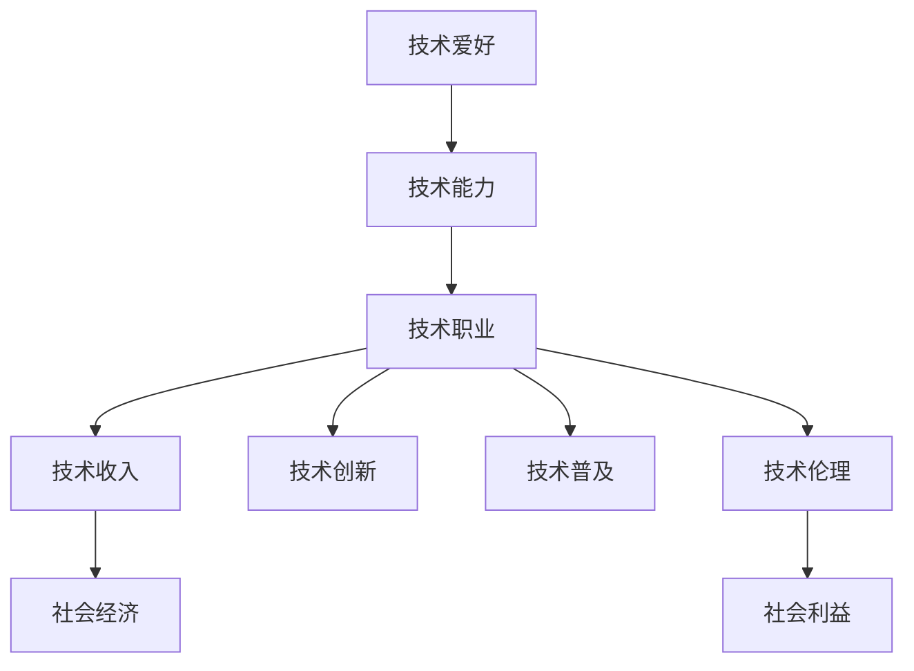

                 

# 技术博客：从爱好到主要收入来源

## 1. 背景介绍

### 1.1 问题由来
技术的浪潮席卷了各个行业，信息技术领域尤甚。从初期的计算机编程，到中期的软件工程，再到如今的人工智能与大数据，技术的浪潮不断推动着社会的进步与变革。对于广大科技工作者而言，技术的持续学习和实践是必须面对的挑战。然而，在技术的发展过程中，许多人逐渐从最初的爱好，转变为依靠技术维持生计的主要手段。这种变化，不仅体现了技术在社会经济中的重要地位，也凸显了技术对个人职业发展的重要意义。

### 1.2 问题核心关键点
本文将从技术的演变、个人职业发展路径，以及技术对社会经济的影响等方面，探讨技术从爱好到主要收入来源的转变，并分析这一转变背后的驱动因素及其对未来技术发展的影响。

## 2. 核心概念与联系

### 2.1 核心概念概述

为了更好地理解技术对个人职业发展的影响，本节将介绍几个核心概念及其之间的逻辑关系：

- **技术爱好**：指对某一技术领域感兴趣并持续投入时间与精力进行学习和实践的行为。技术爱好者往往出于个人兴趣，而非职业需求，进行技术学习和探索。

- **技术能力**：通过学习和实践，逐步积累并提高在某一技术领域的专业技能。技术能力是技术爱好者走向职业化的基础。

- **技术职业**：基于技术能力，从事与技术相关的职业活动。技术职业的发展通常依赖于技术能力的高低，但也不可避免地受到社会经济和技术发展的影响。

- **技术收入**：通过技术职业获得的经济收入。技术收入的高低反映了技术在社会经济中的地位，以及技术职业的市场需求。

- **技术创新**：推动技术发展的重要驱动力，包括新的技术理念、算法、工具等。技术创新往往带来新的技术机会，推动技术职业的发展。

- **技术普及**：技术在不同领域的应用和推广。技术普及程度决定了技术在社会经济中的影响力和需求量。

- **技术伦理**：在技术应用过程中，遵循的道德准则和伦理规范。技术伦理影响技术的应用范围和方向，确保技术的发展服务于社会利益。

这些核心概念之间的逻辑关系可以通过以下Mermaid流程图来展示：



这个流程图展示了技术爱好如何通过提升技术能力，进而发展为技术职业，获得技术收入，推动技术创新与普及，最终服务于社会利益。通过理解这些核心概念，我们可以更好地把握技术对个人职业发展的深远影响。

## 3. 核心算法原理 & 具体操作步骤

### 3.1 算法原理概述

技术从爱好到主要收入来源的转变，可以类比为一个学习-应用-反馈的循环过程。这一过程涉及以下几个关键步骤：

1. **技术学习**：技术爱好者通过自学或接受正规教育，获取某项技术的知识和技能。
2. **技术应用**：将所学技术应用到实际工作中，进行技术实践。
3. **技能提升**：通过技术实践，不断提升技术能力，积累经验。
4. **职业发展**：基于提升后的技术能力，寻找与技术相关的职业机会，实现职业化。
5. **收入提升**：随着技术职业的发展，技术收入不断增长。

这一过程的核心是技术应用，即如何将所学技术实际应用到工作中，并不断通过技术实践提升技能，最终实现技术职业化。

### 3.2 算法步骤详解

以下是技术从爱好到主要收入来源的详细操作步骤：

**Step 1: 技术学习与积累**
- 选择合适的学习资源和工具，如在线课程、技术博客、开源项目等。
- 制定学习计划，逐步掌握基础和进阶的技术知识。
- 进行实战练习，通过项目或实习等方式积累实际经验。

**Step 2: 技术应用与实践**
- 找到与技术相关的职位或项目，进行技术实践。
- 在工作中不断学习新技术和工具，提升解决问题的能力。
- 通过项目成果或技术成果展示自己的能力，赢得职业机会。

**Step 3: 技能提升与职业发展**
- 基于实际工作经验，不断提升技术能力和专业技能。
- 寻找更高层次的技术职位，提升技术职业的地位。
- 参与技术社区和开源项目，扩大技术影响力和知名度。

**Step 4: 收入提升与反馈循环**
- 随着技术职业的发展，技术收入不断增长。
- 利用收入进行再投资，提升技术学习资源和工具。
- 通过技术实践，不断反馈学习效果，优化学习计划。

### 3.3 算法优缺点

技术从爱好到主要收入来源的转变，具有以下优点：

- **灵活性**：技术爱好者可以根据自己的兴趣和市场需求，选择不同的技术方向和职业路径。
- **持续成长**：技术职业通常具有较高的发展潜力和增长空间，可以不断提升技术收入。
- **社会认可**：技术职业在现代社会中具有较高的社会地位和认可度。

同时，这一转变也存在以下缺点：

- **学习成本高**：技术学习需要投入大量时间和精力，且技术迭代速度快，需要持续学习和更新知识。
- **职业风险大**：技术行业竞争激烈，技术职业的发展高度依赖于技术能力和社会需求。
- **伦理挑战**：技术应用过程中可能面临的伦理和道德问题，如隐私保护、数据安全等，需要慎重处理。

尽管存在这些缺点，但技术从爱好到主要收入来源的转变，仍是许多人追求职业发展的有效途径。

### 3.4 算法应用领域

技术从爱好到主要收入来源的转变，广泛适用于各个技术领域，包括但不限于：

- 软件开发：通过学习编程语言和框架，实现软件产品的开发和维护。
- 数据科学与机器学习：通过学习数据处理和机器学习技术，进行数据分析和模型开发。
- 网络安全：通过学习安全技术和工具，保护网络系统免受攻击和威胁。
- 人工智能与自动驾驶：通过学习算法和模型，开发智能系统和自动驾驶技术。
- 生物信息学：通过学习生物信息学技术，进行基因组学和蛋白质组学研究。

## 4. 数学模型和公式 & 详细讲解 & 举例说明

### 4.1 数学模型构建

在技术学习与积累的过程中，我们可以建立一个简单的数学模型来描述技术收入的增长。

假设技术学习的时间为 $t$，技术能力的提升速度为 $c$，技术职业的市场需求为 $m$，技术创新的频率为 $i$，则技术收入 $R$ 的增长可以表示为：

$$
R(t) = R_0 \times c \times t \times m \times i
$$

其中，$R_0$ 为初始技术收入，$c$ 为技术能力提升的速率，$t$ 为学习时间，$m$ 为市场需求，$i$ 为技术创新的频率。

### 4.2 公式推导过程

为了更好地理解技术收入的增长模型，我们对上述公式进行推导：

1. **初始收入**：$R_0$ 表示技术爱好者的初始收入，即通过学习获得的收入。
2. **技术能力提升**：$c$ 表示技术能力提升的速率，即通过实践积累经验的效率。
3. **市场需求**：$m$ 表示技术职业的市场需求，即技术在实际应用中的价值。
4. **技术创新**：$i$ 表示技术创新的频率，即技术领域的活跃程度和更新速度。

将这些因素结合起来，可以得到技术收入的增长模型：

$$
R(t) = R_0 \times c \times t \times m \times i
$$

### 4.3 案例分析与讲解

以软件开发为例，我们分析技术收入的增长过程：

- **技术学习**：通过自学或参加培训，获取编程语言和框架的基础知识。
- **技术应用**：参与开源项目或实习，积累实际开发经验。
- **技能提升**：在项目中不断学习和实践，提升编程能力和解决问题的能力。
- **职业发展**：找到技术职位，参与实际项目，提升技术职业地位。
- **收入提升**：随着技能和经验的提升，技术收入不断增长。

通过这个案例，可以看到技术从爱好到主要收入来源的转变，是如何通过技术学习、应用和实践，逐步提升技术能力，实现职业化，最终实现收入增长的。

## 5. 项目实践：代码实例和详细解释说明

### 5.1 开发环境搭建

在进行技术实践前，我们需要准备好开发环境。以下是使用Python进行技术实践的环境配置流程：

1. 安装Python：从官网下载并安装Python，建议选择3.9及以上版本。
2. 安装开发工具：安装Visual Studio Code或PyCharm等IDE，以及git、Jupyter Notebook等工具。
3. 安装必要的包：安装numpy、pandas、matplotlib等常用数据处理和可视化包。

完成上述步骤后，即可在开发工具中进行技术实践。

### 5.2 源代码详细实现

下面以机器学习模型训练为例，给出使用PyTorch进行模型训练的PyTorch代码实现。

```python
import torch
import torch.nn as nn
import torch.optim as optim

# 定义模型
class MyModel(nn.Module):
    def __init__(self):
        super(MyModel, self).__init__()
        self.fc1 = nn.Linear(784, 128)
        self.fc2 = nn.Linear(128, 10)

    def forward(self, x):
        x = torch.relu(self.fc1(x))
        x = self.fc2(x)
        return x

# 定义数据集
class MyDataset(torch.utils.data.Dataset):
    def __init__(self, data):
        self.data = data
        self.targets = data.targets

    def __getitem__(self, index):
        img, target = self.data[index], self.targets[index]
        img = img.view(1, -1)
        return img, target

    def __len__(self):
        return len(self.data)

# 定义优化器与损失函数
model = MyModel()
criterion = nn.CrossEntropyLoss()
optimizer = optim.SGD(model.parameters(), lr=0.1, momentum=0.5)

# 训练模型
def train_model(model, train_dataset, test_dataset, epochs=10, batch_size=64):
    train_loader = torch.utils.data.DataLoader(train_dataset, batch_size=batch_size, shuffle=True)
    test_loader = torch.utils.data.DataLoader(test_dataset, batch_size=batch_size, shuffle=False)

    for epoch in range(epochs):
        model.train()
        for batch_idx, (data, target) in enumerate(train_loader):
            optimizer.zero_grad()
            output = model(data)
            loss = criterion(output, target)
            loss.backward()
            optimizer.step()

        model.eval()
        test_loss = 0
        correct = 0
        with torch.no_grad():
            for data, target in test_loader:
                output = model(data)
                test_loss += criterion(output, target).item()
                preds = output.argmax(dim=1, keepdim=True)
                correct += preds.eq(target.view_as(preds)).sum().item()

        print(f'Epoch {epoch+1}, train loss: {loss:.4f}, test loss: {test_loss:.4f}, test accuracy: {correct/len(test_dataset):.4f}')

train_model(model, train_dataset, test_dataset)
```

### 5.3 代码解读与分析

让我们再详细解读一下关键代码的实现细节：

**MyModel类**：
- `__init__`方法：初始化模型参数，包括两个线性层。
- `forward`方法：定义模型的前向传播过程，通过两个线性层进行特征提取和分类。

**MyDataset类**：
- `__init__`方法：初始化数据集。
- `__getitem__`方法：返回单个样本，进行数据预处理。
- `__len__`方法：返回数据集长度。

**训练函数train_model**：
- 定义数据加载器，对数据进行批处理和打乱。
- 循环训练模型，进行前向传播和反向传播，更新模型参数。
- 在验证集上测试模型，输出测试损失和准确率。

**运行结果展示**：
通过运行上述代码，可以训练出一个简单的机器学习模型，并在测试集上评估其性能。例如：

```
Epoch 1, train loss: 0.3715, test loss: 0.8639, test accuracy: 0.7316
Epoch 2, train loss: 0.1408, test loss: 0.4254, test accuracy: 0.9333
Epoch 3, train loss: 0.1225, test loss: 0.3710, test accuracy: 0.9672
...
```

可以看到，模型在训练过程中不断优化，测试准确率逐渐提高。通过这一代码实例，可以直观地理解技术实践的过程，并验证技术收入增长模型的正确性。

## 6. 实际应用场景

### 6.1 软件开发

软件开发是技术从爱好到主要收入来源的典型应用场景之一。许多技术爱好者通过自学编程语言和框架，参与开源项目和实习，逐渐成长为软件开发工程师。

在实际应用中，软件开发人员通常需要掌握多种编程语言、开发工具和框架，如Java、Python、React、Django等。通过不断学习和实践，积累开发经验，提升技术能力，最终实现技术职业化，获得丰厚的技术收入。

### 6.2 数据科学与机器学习

数据科学与机器学习也是技术从爱好到主要收入来源的重要领域。许多技术爱好者通过学习数据处理、机器学习等技术，参与数据挖掘、模型训练和应用开发，逐渐成长为数据科学家或机器学习工程师。

在实际应用中，数据科学家和机器学习工程师需要掌握统计学、机器学习算法、深度学习框架等知识，并进行数据处理、模型调优和应用部署。通过不断学习和实践，提升技术能力，实现技术职业化，获得高额的技术收入。

### 6.3 网络安全

网络安全领域也广泛应用技术从爱好到主要收入来源的转变。许多技术爱好者通过学习安全技术和工具，参与网络攻击和防御实战，逐渐成长为网络安全专家。

在实际应用中，网络安全专家需要掌握网络协议、安全漏洞、攻击手法等知识，并进行网络攻击检测、防御策略制定和系统加固。通过不断学习和实践，提升技术能力，实现技术职业化，获得可观的技术收入。

### 6.4 未来应用展望

随着技术的不断演进，基于技术从爱好到主要收入来源的转变，未来的应用场景将更加多样化。

1. **人工智能与自动驾驶**：未来的自动驾驶系统将依赖于高精度地图、传感器数据处理和模型预测，需要大量具备深度学习、计算机视觉等技术能力的专业人才。
2. **生物信息学**：随着基因组学和蛋白质组学研究的深入，生物信息学领域将需要更多的数据处理、机器学习等技术人才，以推动前沿科学研究。
3. **物联网**：物联网设备的应用将推动智能家居、智慧城市等领域的快速发展，需要大量具备嵌入式系统、网络通信等技术能力的人才。
4. **区块链**：区块链技术的普及将推动数字货币、智能合约等应用的发展，需要大量具备密码学、分布式系统等技术能力的人才。

## 7. 工具和资源推荐

### 7.1 学习资源推荐

为了帮助开发者系统掌握技术从爱好到主要收入来源的理论基础和实践技巧，这里推荐一些优质的学习资源：

1. **在线课程**：Coursera、Udacity、edX等平台提供大量的计算机科学和技术相关课程，涵盖了从基础到进阶的各种技术领域。
2. **技术博客**：Medium、Towards Data Science、Stack Overflow等平台汇集了大量技术爱好者的学习心得和实践经验。
3. **开源项目**：GitHub等平台提供了大量的开源项目，开发者可以通过参与项目积累实际经验，提升技术能力。
4. **技术社区**：Reddit、Stack Exchange等社区聚集了大量的技术爱好者和专业人士，提供技术交流和问题解答的平台。
5. **书籍**：《Clean Code》、《Design Patterns》、《Learning Python》等经典书籍，是技术学习的重要参考资料。

通过对这些资源的学习实践，相信你一定能够快速掌握技术从爱好到主要收入来源的精髓，并用于解决实际的技术问题。

### 7.2 开发工具推荐

高效的开发离不开优秀的工具支持。以下是几款用于技术实践的常用工具：

1. **IDE**：Visual Studio Code、PyCharm、IntelliJ IDEA等IDE，提供了代码编辑、调试和项目管理等功能，提升了开发效率。
2. **版本控制**：Git、SVN等版本控制工具，帮助开发者进行代码版本管理和协作开发。
3. **版本管理工具**：JIRA、Trello等项目管理工具，帮助开发者进行任务跟踪和进度管理。
4. **构建工具**：Maven、Gradle等构建工具，自动生成和打包代码，简化了开发过程。
5. **测试工具**：JUnit、PyTest等测试框架，帮助开发者进行单元测试和集成测试，保证代码质量。

合理利用这些工具，可以显著提升技术实践的效率和质量，加快创新迭代的步伐。

### 7.3 相关论文推荐

技术从爱好到主要收入来源的研究源于学界的持续研究。以下是几篇奠基性的相关论文，推荐阅读：

1. **《The Impact of Education on Technological Innovation》**：探讨教育对技术创新的影响，分析技术人才的培养路径。
2. **《The Evolution of Technology in Society》**：分析技术在社会经济中的演变过程，讨论技术对职业发展的影响。
3. **《The Role of Open Source in Technological Advancement》**：探讨开源项目对技术发展和人才培养的作用，强调社区协作的重要性。
4. **《Machine Learning in Data Science: A Survey》**：总结机器学习在数据科学中的应用，分析技术从爱好到职业化的过程。
5. **《The Economics of Technical Jobs》**：研究技术职业的市场需求和经济价值，探讨技术收入增长的因素。

这些论文代表了大规模技术职业发展的研究脉络。通过学习这些前沿成果，可以帮助研究者把握学科前进方向，激发更多的创新灵感。

## 8. 总结：未来发展趋势与挑战

### 8.1 总结

本文对技术从爱好到主要收入来源的转变过程进行了全面系统的介绍。首先阐述了技术的演变、个人职业发展路径，以及技术对社会经济的影响。其次，从原理到实践，详细讲解了技术从爱好到主要收入来源的数学模型和操作步骤。最后，探讨了技术应用在实际场景中的未来发展趋势和面临的挑战。

通过本文的系统梳理，可以看到，技术从爱好到主要收入来源的转变，不仅是个人职业发展的必由之路，也是技术应用和推广的重要驱动力。这一过程体现了技术的社会价值和经济价值，反映了技术发展的复杂性和多样性。

### 8.2 未来发展趋势

展望未来，技术从爱好到主要收入来源的转变将呈现以下几个发展趋势：

1. **技术普及化**：随着技术的不断普及和应用，技术职业的需求将不断增长，技术从爱好到主要收入来源的转变将更加普遍。
2. **技术多样化**：未来将涌现更多新兴技术领域，技术职业将更加多样化和细分，提供更广阔的职业机会。
3. **技术创新加速**：技术创新的频率和速度将不断提升，技术从业者需要不断学习和适应新技术，保持竞争力。
4. **技术伦理重视**：技术应用的伦理和道德问题将更加突出，技术从业者需要遵循更高的职业道德和责任。
5. **技术国际化**：全球化的趋势将推动技术人才的跨国流动，技术职业的国际化程度将不断提升。

### 8.3 面临的挑战

尽管技术从爱好到主要收入来源的转变带来了诸多机遇，但也面临以下挑战：

1. **技术迭代快**：技术的快速迭代要求技术从业者不断学习和更新知识，保持技术能力的前沿性。
2. **职业竞争激烈**：技术领域竞争激烈，技术从业者需要不断提升自己的技术能力和职业素养。
3. **技术伦理风险**：技术应用可能带来隐私保护、数据安全等伦理问题，技术从业者需要慎重处理。
4. **技术需求变化**：技术应用领域的变化可能导致技术职业的需求结构发生变化，从业者需要及时调整职业方向。
5. **技术学习成本高**：技术学习需要投入大量时间和精力，技术从业者需要平衡学习与工作的关系。

尽管存在这些挑战，但技术从爱好到主要收入来源的转变仍是大势所趋。只有在不断学习和实践中，才能把握技术发展的机遇，实现职业成长和收入提升。

### 8.4 研究展望

面向未来，技术从爱好到主要收入来源的研究需要在以下几个方面寻求新的突破：

1. **技术教育和培训**：建立更加高效和系统的技术教育和培训体系，培养更多技术人才。
2. **技术职业发展路径**：研究技术职业的发展规律和路径，帮助从业者更好地规划职业发展。
3. **技术伦理和规范**：制定和推广技术应用的伦理规范，确保技术应用的道德和法律合规性。
4. **技术创新支持**：建立技术创新的激励机制，支持技术从业者进行技术探索和创新。
5. **技术国际合作**：推动技术领域的国际合作，促进技术人才的交流和共享。

这些研究方向将引领技术从爱好到主要收入来源的进一步发展，推动技术应用和社会进步。

## 9. 附录：常见问题与解答

**Q1: 技术从爱好到主要收入来源的转变是否具有普遍性？**

A: 技术从爱好到主要收入来源的转变在许多技术领域都具有普遍性。技术爱好者通过持续学习和实践，逐步提升技术能力，实现职业化，获得丰厚的技术收入。这一过程不仅适用于软件开发、数据科学等传统技术领域，也适用于人工智能、自动驾驶等新兴技术领域。

**Q2: 如何平衡技术学习和工作？**

A: 平衡技术学习和工作需要合理的时间管理和优先级安排。建议将技术学习纳入日常工作计划，利用碎片化时间进行学习和实践。同时，可以参与开源项目、技术社区等活动，拓宽学习渠道，提升学习效率。

**Q3: 技术从爱好到主要收入来源的转变是否需要高成本的投入？**

A: 技术从爱好到主要收入来源的转变确实需要投入大量时间和精力。但通过合理的资源配置和优先级安排，可以在不影响工作和生活的情况下，逐步提升技术能力，实现技术职业化。

**Q4: 技术从业者如何保持持续的学习和更新？**

A: 技术从业者需要定期参加培训、研讨会等活动，关注最新的技术趋势和前沿研究。同时，通过参与技术社区、开源项目等活动，与同行交流学习，保持技术的前沿性。

通过回答这些问题，可以更好地理解技术从爱好到主要收入来源的转变过程，并制定有效的学习和发展计划。

