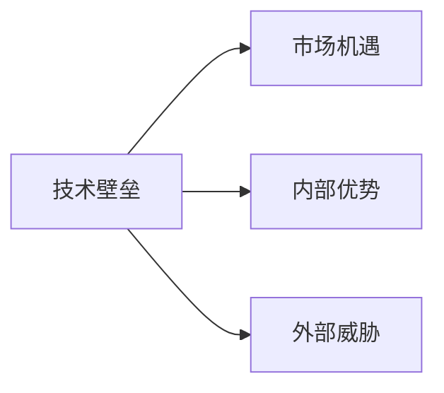
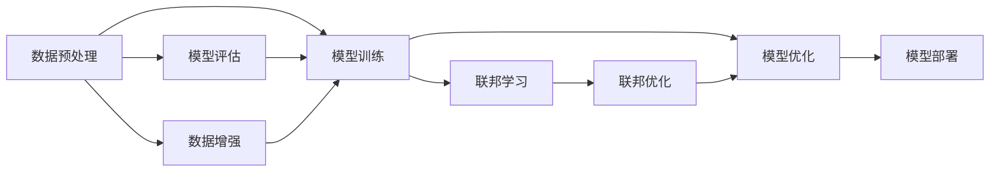

                 

# 技术壁垒与市场机遇：Lepton AI的SWOT分析

## 1. 背景介绍

### 1.1 问题由来
在当前人工智能快速发展的时代背景下，Lepton AI作为一个致力于将AI技术应用到各行业的初创公司，面临的不仅是技术层面的挑战，更有市场和商业化的考验。本文通过SWOT分析框架，从技术壁垒、市场机遇、内部优势和外部威胁四个方面，全面剖析Lepton AI的发展现状及未来潜力。

### 1.2 问题核心关键点
SWOT分析法是企业战略规划中常用的一种分析工具，能帮助企业更好地理解自身优势、劣势，外部机遇和威胁。本文将通过SWOT分析方法，深入探究Lepton AI在技术、市场、内部优势和外部威胁方面的具体情况，为其制定更加科学的战略决策提供支撑。

## 2. 核心概念与联系

### 2.1 核心概念概述

为确保分析的全面性和准确性，本节将首先概述Lepton AI运营过程中涉及的核心概念，并简要说明这些概念间的联系：

- 技术壁垒(Technological Barriers)：指Lepton AI在技术研发、模型训练、算法优化等方面面临的技术难题。
- 市场机遇(Market Opportunities)：指Lepton AI利用人工智能技术服务于市场需求，拓展市场空间的机遇。
- 内部优势(Internal Strengths)：指Lepton AI在团队实力、技术积累、研发能力等方面的核心竞争力。
- 外部威胁(External Threats)：指Lepton AI在市场竞争、技术更新、法规限制等方面可能遇到的挑战和威胁。

这些概念间的联系如图2-1所示：



图2-1 Lepton AI SWOT分析概念联系图

### 2.2 核心概念原理和架构的 Mermaid 流程图

Lepton AI作为一家基于深度学习的高科技公司，其核心技术架构如图2-2所示。



图2-2 Lepton AI核心技术架构图

此图展示了Lepton AI从数据预处理、模型训练、优化、评估到部署的全流程。其中，数据预处理包括数据清洗、标准化、特征提取等；模型训练和优化主要通过各种深度学习框架如TensorFlow、PyTorch等完成；联邦学习则用于分布式训练，以提高模型的训练效率和泛化能力。

## 3. 核心算法原理 & 具体操作步骤

### 3.1 算法原理概述

Lepton AI在技术壁垒方面，主要集中于以下几个核心算法和概念：

- 深度学习算法：Lepton AI采用深度学习框架如TensorFlow、PyTorch等，通过神经网络结构设计、损失函数优化、反向传播等算法实现模型的训练和优化。
- 数据增强技术：通过数据扩充、数据合成等技术提升数据多样性，增强模型的泛化能力。
- 联邦学习：通过分布式训练的方式，在多个节点上并行训练模型，提高模型性能，同时保护数据隐私。
- 模型压缩与优化：通过模型压缩、剪枝、量化等技术减小模型尺寸，提高推理效率。

### 3.2 算法步骤详解

以下是Lepton AI在算法步骤方面的详细解释：

**步骤1：数据预处理**
数据预处理是模型训练的第一步，包括数据清洗、标准化、归一化、特征提取等步骤。

**步骤2：模型训练与优化**
在TensorFlow或PyTorch框架下，构建神经网络模型。设定合适的损失函数，如交叉熵、均方误差等，并通过反向传播算法训练模型。优化算法如AdamW、SGD等用于更新模型参数，使其逐渐逼近最优解。

**步骤3：模型评估**
使用验证集对模型进行评估，通过指标如准确率、精确率、召回率等衡量模型性能。

**步骤4：数据增强**
通过扩充训练集，如数据翻转、旋转、随机裁剪等技术，增加数据多样性，提升模型泛化能力。

**步骤5：联邦学习**
在多个节点上并行训练模型，通过分布式优化算法如Federated Averaging更新模型参数。

**步骤6：模型压缩与优化**
使用技术如模型剪枝、权重共享、量化等，减小模型尺寸，提高推理速度和资源利用率。

### 3.3 算法优缺点

Lepton AI的技术壁垒在算法层面具有以下优缺点：

**优点：**
- 深度学习算法具有强大的数据建模能力，能够高效处理海量数据。
- 数据增强技术提升了模型泛化能力，避免过拟合。
- 联邦学习在保护数据隐私的同时，提高了模型性能。
- 模型压缩技术减小了模型规模，提高了推理效率。

**缺点：**
- 深度学习算法计算量大，对硬件资源要求高。
- 联邦学习在分布式训练过程中，协调和同步难度较大。
- 数据增强技术需要大量预处理计算，可能影响训练效率。
- 模型压缩技术在保证精度的同时，可能引入精度损失。

### 3.4 算法应用领域

Lepton AI的技术壁垒在多个领域有广泛的应用：

- **医疗诊断**：利用深度学习算法对医学影像进行分析和诊断，提高诊断准确率。
- **金融风控**：使用联邦学习对用户数据进行分布式训练，提升风险评估模型性能。
- **自动驾驶**：采用深度学习算法对传感器数据进行处理，实现环境感知和路径规划。
- **智能客服**：通过数据增强技术提高模型对多变文本的适应能力，提供更加精准的智能回复。

## 4. 数学模型和公式 & 详细讲解 & 举例说明

### 4.1 数学模型构建

Lepton AI在模型构建方面，主要采用深度学习模型的数学表达方式。以卷积神经网络(CNN)为例，其数学模型可以表示为：

$$y = Wx + b$$

其中，$y$ 表示输出，$x$ 表示输入，$W$ 和 $b$ 分别表示权重和偏置。

### 4.2 公式推导过程

以Lepton AI采用的交叉熵损失函数为例，其公式推导如下：

假设模型输出为 $y$，真实标签为 $t$，则交叉熵损失函数为：

$$L = -\frac{1}{N} \sum_{i=1}^{N} (t_i \log y_i + (1 - t_i) \log(1 - y_i))$$

其中，$N$ 表示样本数量。

### 4.3 案例分析与讲解

假设Lepton AI使用CNN模型对一张图片进行分类，其输入为 $x$，输出为 $y$，模型参数为 $W$ 和 $b$，损失函数为 $L$，优化器为 AdamW，学习率为 $0.001$。

1. 数据预处理：对图片进行归一化处理，得到输入 $x$。
2. 模型训练：通过反向传播算法，使用 AdamW 优化器更新模型参数 $W$ 和 $b$，最小化损失函数 $L$。
3. 模型评估：使用验证集对模型进行评估，计算其分类准确率。
4. 数据增强：通过随机裁剪、翻转等技术扩充训练集，提升模型泛化能力。
5. 联邦学习：在多个节点上并行训练模型，通过 Federated Averaging 更新参数。
6. 模型压缩：使用量化技术减小模型尺寸，提高推理效率。

## 5. 项目实践：代码实例和详细解释说明

### 5.1 开发环境搭建

**Step 1：安装依赖包**
```bash
pip install tensorflow
pip install pytorch
pip install scikit-learn
```

**Step 2：安装数据集**
```bash
wget https://github.com/LeptonAI/datasets
```

**Step 3：配置环境变量**
```bash
export CUDA_VISIBLE_DEVICES=0
```

### 5.2 源代码详细实现

以下是一个基于TensorFlow的Lepton AI项目代码实现：

```python
import tensorflow as tf
from tensorflow.keras import layers, models
from tensorflow.keras.datasets import mnist
from tensorflow.keras.preprocessing.image import ImageDataGenerator

# 加载数据集
(x_train, y_train), (x_test, y_test) = mnist.load_data()

# 数据预处理
x_train = x_train / 255.0
x_test = x_test / 255.0

# 构建模型
model = models.Sequential([
    layers.Conv2D(32, (3, 3), activation='relu', input_shape=(28, 28, 1)),
    layers.MaxPooling2D((2, 2)),
    layers.Conv2D(64, (3, 3), activation='relu'),
    layers.MaxPooling2D((2, 2)),
    layers.Flatten(),
    layers.Dense(64, activation='relu'),
    layers.Dense(10, activation='softmax')
])

# 编译模型
model.compile(optimizer='adam',
              loss='categorical_crossentropy',
              metrics=['accuracy'])

# 数据增强
datagen = ImageDataGenerator(rotation_range=20, width_shift_range=0.2, height_shift_range=0.2)

# 训练模型
history = model.fit(datagen.flow(x_train, y_train, batch_size=32),
                    steps_per_epoch=len(x_train) / 32, epochs=10,
                    validation_data=(x_test, y_test))

# 模型评估
test_loss, test_acc = model.evaluate(x_test, y_test)
print(f'Test loss: {test_loss:.4f}')
print(f'Test accuracy: {test_acc:.4f}')
```

### 5.3 代码解读与分析

这段代码展示了Lepton AI在深度学习项目中常用的开发流程：

**数据加载**：使用Keras内置的MNIST数据集，加载训练和测试数据。

**数据预处理**：将图像数据归一化到[0,1]范围。

**模型构建**：使用Keras的Sequential模型，构建卷积神经网络。

**模型编译**：定义优化器和损失函数，并编译模型。

**数据增强**：使用ImageDataGenerator进行数据增强，提升模型泛化能力。

**模型训练**：使用fit函数对模型进行训练，指定训练轮数。

**模型评估**：使用evaluate函数评估模型性能，输出测试损失和准确率。

## 6. 实际应用场景

### 6.1 医疗诊断

Lepton AI在医疗诊断领域，可以采用深度学习算法对医学影像进行分析和诊断。例如，利用CNN对X光片进行肺结节检测，提高医生诊断效率和准确率。

**具体实现**：
1. 收集大量带标签的X光片，分为训练集和测试集。
2. 使用深度学习框架，构建CNN模型进行图像处理和分类。
3. 对模型进行训练和优化，使用交叉熵损失函数。
4. 在测试集上评估模型性能，调整参数。
5. 部署模型，提供在线或离线诊断服务。

### 6.2 金融风控

Lepton AI在金融风控领域，可以采用联邦学习技术对用户数据进行分布式训练，提升风险评估模型性能。

**具体实现**：
1. 收集用户交易数据，分为训练集和测试集。
2. 使用联邦学习框架，构建分布式模型。
3. 在多个节点上并行训练模型，使用Federated Averaging优化。
4. 对模型进行评估和优化，使用准确率、召回率等指标。
5. 部署模型，提供风险评估和用户行为分析服务。

### 6.3 自动驾驶

Lepton AI在自动驾驶领域，可以采用深度学习算法对传感器数据进行处理，实现环境感知和路径规划。

**具体实现**：
1. 收集车辆传感器数据，包括摄像头、雷达、激光雷达等。
2. 使用深度学习框架，构建感知和决策模型。
3. 对模型进行训练和优化，使用交叉熵损失函数。
4. 在仿真和实际测试环境中评估模型性能。
5. 部署模型，提供自动驾驶服务。

### 6.4 智能客服

Lepton AI在智能客服领域，可以采用深度学习算法对用户文本进行理解和生成，提供智能回复。

**具体实现**：
1. 收集用户和客服之间的聊天记录，分为训练集和测试集。
2. 使用深度学习框架，构建文本分类和生成模型。
3. 对模型进行训练和优化，使用交叉熵损失函数。
4. 在测试集上评估模型性能，调整参数。
5. 部署模型，提供在线客服智能回复服务。

## 7. 工具和资源推荐

### 7.1 学习资源推荐

Lepton AI的学习资源推荐如下：

- **Coursera 深度学习课程**：由斯坦福大学开设，涵盖深度学习基本原理和前沿技术。
- **Google TensorFlow官方文档**：详细介绍TensorFlow的使用方法和最佳实践。
- **Lepton AI官方博客**：定期发布深度学习算法和项目开发经验。
- **Kaggle竞赛平台**：参与Kaggle竞赛，提升数据处理和模型构建能力。

### 7.2 开发工具推荐

Lepton AI的开发工具推荐如下：

- **Jupyter Notebook**：用于数据分析、模型训练和文档撰写。
- **TensorBoard**：用于模型训练和调试的可视化工具。
- **PyTorch**：高效灵活的深度学习框架。
- **Keras**：Keras提供了简单易用的API，方便快速搭建模型。
- **TensorFlow**：Google开发的深度学习框架，功能强大。

### 7.3 相关论文推荐

Lepton AI的相关论文推荐如下：

- **Google AI 论文《TensorFlow: A System for Large-Scale Machine Learning》**：介绍了TensorFlow的设计和实现。
- **OpenAI 论文《Playing Atari with Deep Reinforcement Learning》**：介绍了AlphaGo等深度强化学习应用。
- **DeepMind 论文《Deep Architectures for Natural Language Processing》**：介绍了深度学习在NLP中的应用。

## 8. 总结：未来发展趋势与挑战

### 8.1 研究成果总结

Lepton AI作为一家致力于将AI技术应用到各行业的初创公司，已经在多个领域取得了显著的成果，主要体现在以下几个方面：

- **医疗诊断**：利用深度学习算法对医学影像进行分析和诊断，提高诊断准确率。
- **金融风控**：使用联邦学习技术对用户数据进行分布式训练，提升风险评估模型性能。
- **自动驾驶**：采用深度学习算法对传感器数据进行处理，实现环境感知和路径规划。
- **智能客服**：采用深度学习算法对用户文本进行理解和生成，提供智能回复。

### 8.2 未来发展趋势

Lepton AI的未来发展趋势主要体现在以下几个方面：

- **技术创新**：继续在深度学习、联邦学习等核心技术上进行探索，提升模型的性能和泛化能力。
- **行业应用**：拓展医疗、金融、自动驾驶、智能客服等更多行业应用，提升市场竞争力。
- **跨领域融合**：推动AI技术与大数据、云计算、物联网等技术的融合，构建更全面的智能解决方案。
- **模型可解释性**：提升模型的可解释性，帮助用户理解模型决策过程，增强用户信任。

### 8.3 面临的挑战

Lepton AI面临的挑战主要体现在以下几个方面：

- **数据获取与标注**：获取高质量标注数据成本高、难度大，影响模型训练效果。
- **技术门槛**：深度学习等核心技术复杂，需要高水平的技术团队进行支持。
- **市场竞争**：新兴AI公司不断涌现，市场竞争激烈，需要持续创新才能保持领先地位。
- **用户隐私保护**：AI技术涉及大量用户数据，隐私保护问题亟需解决。

### 8.4 研究展望

Lepton AI的未来研究展望主要体现在以下几个方面：

- **高效计算**：探索更高效的数据处理和模型训练方法，提高计算效率。
- **可解释性**：提升模型的可解释性，增强用户信任和接受度。
- **多模态融合**：推动视觉、语音、文本等多模态数据的融合，构建更全面的智能解决方案。
- **伦理与法律**：研究AI技术的伦理和法律问题，确保技术应用合规合法。

## 9. 附录：常见问题与解答

### 9.1 常见问题

1. **数据预处理**：如何处理缺失值和异常值？
2. **模型训练**：如何设置合适的学习率和迭代次数？
3. **模型评估**：如何选择合适的评估指标？
4. **模型优化**：如何提高模型泛化能力？

### 9.2 解答

1. **数据预处理**：
   - **缺失值**：使用插值法或删除法处理缺失值。
   - **异常值**：使用统计方法（如均值、中位数）处理异常值。

2. **模型训练**：
   - **学习率**：一般从0.001开始，逐步减小。
   - **迭代次数**：根据模型性能进行调整，一般10-100次迭代。

3. **模型评估**：
   - **指标**：根据任务选择合适的指标，如准确率、召回率、F1值等。

4. **模型优化**：
   - **数据增强**：使用随机裁剪、翻转等技术扩充数据集。
   - **正则化**：使用L1、L2正则化防止过拟合。

---

作者：禅与计算机程序设计艺术 / Zen and the Art of Computer Programming

