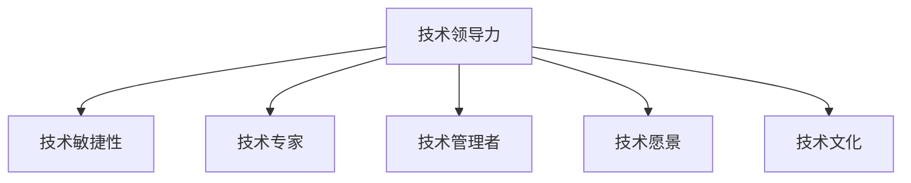

                 

# 技术领导力：提升职场价值

> 关键词：技术领导力,职场价值,软件开发,项目管理和领导力

## 1. 背景介绍

### 1.1 问题由来
在当今科技日新月异的时代，技术领导力已成为职场中不可或缺的关键能力。无论是初创公司还是大型企业，能否有效运用技术领导力，直接影响着组织的创新能力、竞争力以及团队的整体效能。然而，很多技术人员在迈向管理岗位时，往往会发现缺乏系统的职场指导和清晰的领导力模型，难以在职场中脱颖而出。本文旨在通过系统阐述技术领导力的核心概念和实践方法，为技术人才的职业发展提供明确的指导，帮助他们在职场中实现价值提升。

### 1.2 问题核心关键点
技术领导力（Technical Leadership）是指技术人才在技术驱动型组织中，通过技术创新和团队管理，实现公司战略目标的能力。其核心关键点包括：

1. **技术敏锐度**：对行业最新技术趋势的洞察力。
2. **团队协作**：通过技术手段和领导力技巧，协调团队成员，实现共同目标。
3. **项目交付**：高效推进项目，确保技术解决方案按时交付。
4. **沟通能力**：能够清晰表达技术观点，协调跨部门合作。
5. **持续学习**：不断更新技术知识，保持竞争力。
6. **风险管理**：识别和规避技术项目中的潜在风险。

### 1.3 问题研究意义
掌握技术领导力，对于技术人才的职业发展至关重要：

1. **职业晋升**：掌握技术领导力能够提升在组织中的影响力，为职业晋升奠定基础。
2. **项目管理**：具备技术领导力，可以高效管理项目，确保技术方案的成功交付。
3. **团队建设**：优秀的技术领导力能够激励团队成员，提升团队协作和创新能力。
4. **知识共享**：通过技术领导力，可以有效推广技术知识，提升整个团队的竞争力。
5. **风险控制**：技术领导力能够帮助识别和防范技术项目中的风险，保障项目顺利推进。

## 2. 核心概念与联系

### 2.1 核心概念概述

为了更好地理解技术领导力的构成和应用，本节将介绍几个密切相关的核心概念：

- **技术领导力（Technical Leadership）**：指技术人才在技术驱动型组织中，通过技术创新和团队管理，实现公司战略目标的能力。
- **技术敏捷性（Technical Agility）**：指组织快速适应技术变化，灵活应对新挑战的能力。
- **技术专家（Technical Expert）**：具有深厚技术积累，能够解决复杂技术问题的专家。
- **技术管理者（Technical Manager）**：不仅掌握技术知识，还具备团队管理和项目领导力的技术骨干。
- **技术愿景（Technical Vision）**：指技术人才对未来技术趋势的预测和规划能力。
- **技术文化（Technical Culture）**：指组织中对于技术和创新的尊重和推崇。

这些核心概念之间的逻辑关系可以通过以下Mermaid流程图来展示：



这个流程图展示了我文章所关注的技术领导力及其组成部分之间的关系。

## 3. 核心算法原理 & 具体操作步骤
### 3.1 算法原理概述

技术领导力的提升，本质上是技术人才通过不断的自我发展和团队协作，实现职业价值最大化的过程。其核心算法原理可以概括为以下几个步骤：

1. **目标设定**：明确个人职业发展的目标，并制定相应的计划。
2. **技能提升**：通过持续学习和实践，不断提升个人技术和管理技能。
3. **团队协作**：通过有效的沟通和协作，提升团队的整体效能。
4. **项目管理**：高效推进项目，确保技术方案按时交付。
5. **风险管理**：识别和规避技术项目中的潜在风险。
6. **结果评估**：持续评估个人和团队的成果，调整策略。

### 3.2 算法步骤详解

以下将详细介绍提升技术领导力的具体操作步骤：

**Step 1: 自我评估和目标设定**
- 进行自我评估，明确自己在技术和管理上的优势和不足。
- 设定清晰的职业发展目标，如技术领域的深耕、管理能力的提升等。

**Step 2: 持续学习和技能提升**
- 参加相关的技术和管理培训课程，学习最新的技术趋势和领导力技巧。
- 参与开源项目和行业会议，与同行交流，获取最新的行业资讯。

**Step 3: 强化团队协作**
- 在团队中主动承担责任，协调团队成员，确保项目顺利推进。
- 使用敏捷开发方法，如Scrum和Kanban，提高团队协作效率。

**Step 4: 项目管理与交付**
- 使用项目管理工具，如JIRA和Trello，高效安排项目进度。
- 定期与团队成员沟通项目进展，确保项目按时交付。

**Step 5: 风险管理与问题解决**
- 通过技术分析和风险评估，识别项目中的潜在风险。
- 制定应对策略，如备份方案、应急预案等，确保项目稳定推进。

**Step 6: 结果评估与反馈**
- 定期评估个人和团队的表现，发现问题及时调整。
- 收集团队成员的反馈，改进管理方式和协作流程。

### 3.3 算法优缺点

技术领导力提升算法具有以下优点：
1. 系统性：通过明确的步骤和目标，使技术人才的职业发展有章可循。
2. 适应性强：可以适用于各种技术和管理场景，灵活应对不同挑战。
3. 实践性：通过持续的实践和反馈，逐步提升个人和团队的能力。

同时，该算法也存在以下局限性：
1. 对个人动力要求高：技术人才需要具备强烈的学习和改进意愿。
2. 时间成本高：技能提升和团队管理需要大量的时间和精力投入。
3. 个性化挑战：不同技术和管理背景的人才，可能需要量身定制的提升路径。

尽管存在这些局限性，但就目前而言，技术领导力提升算法仍是大规模应用和推广的重要手段。未来相关研究的重点在于如何进一步降低提升难度，提高个性化适配，同时兼顾效率和效果。

### 3.4 算法应用领域

技术领导力提升算法已经在软件开发、项目管理、团队建设等多个领域得到了广泛的应用，具体包括：

- **软件开发**：通过技术领导力提升，开发团队能够快速适应技术变化，高效解决问题，提升项目交付效率。
- **项目管理**：技术领导者能够通过敏捷开发方法，协调团队资源，确保项目按时交付，并及时调整策略应对变化。
- **团队建设**：通过技术领导力，提升团队协作效率，激发团队创新能力，构建高效的工作环境。
- **知识共享**：技术领导者能够推广技术知识，提升整个团队的竞争力，构建持续学习的企业文化。

## 4. 数学模型和公式 & 详细讲解  
### 4.1 数学模型构建

在技术领导力提升的实践过程中，数学模型和公式可以提供定量的分析和评估，帮助我们更好地理解和应用技术领导力。以下将通过数学模型来进一步阐述技术领导力的提升步骤。

### 4.2 公式推导过程

假设技术领导力提升的过程可以表示为一个连续的优化问题，其中 $x_i$ 表示第 $i$ 个阶段的技术能力提升，$c_i$ 表示第 $i$ 个阶段的目标完成度，$w_i$ 表示第 $i$ 个阶段的重要性权重，$b_i$ 表示第 $i$ 个阶段的任务难度系数，$\theta$ 表示技术领导力的综合评估指标。则技术领导力提升的数学模型可以表示为：

$$
\min_{x_i, c_i, w_i, b_i} \sum_{i=1}^N \theta_i w_i \log \frac{c_i}{b_i}
$$

其中，$N$ 表示技术领导力提升的总阶段数，$\theta_i$ 表示第 $i$ 个阶段的技术能力提升权重。

### 4.3 案例分析与讲解

以软件开发团队的技术领导力提升为例，我们可以将整个过程分解为以下几个阶段：

1. **目标设定**：明确团队技术提升的方向，设定阶段性目标，如掌握新框架、提升代码质量等。
2. **持续学习**：团队成员参加培训课程，学习新技术，提升技术能力。
3. **项目管理**：使用敏捷开发方法，如Scrum和Kanban，协调团队资源，确保项目按时交付。
4. **风险管理**：识别和规避技术项目中的潜在风险，制定应急预案，确保项目稳定推进。
5. **结果评估**：定期评估团队的表现，发现问题及时调整，收集反馈改进管理方式。

通过数学模型，我们可以定量地评估每个阶段对技术领导力提升的贡献，从而调整策略，确保最终目标的实现。

## 5. 项目实践：代码实例和详细解释说明
### 5.1 开发环境搭建

在进行技术领导力提升的实践前，我们需要准备好开发环境。以下是使用Python进行相关开发的流程：

1. 安装Anaconda：从官网下载并安装Anaconda，用于创建独立的Python环境。

2. 创建并激活虚拟环境：
```bash
conda create -n tech_leadership python=3.8 
conda activate tech_leadership
```

3. 安装相关库：
```bash
pip install jupyter notebook matplotlib numpy pandas sklearn scikit-learn
```

完成上述步骤后，即可在`tech_leadership`环境中进行技术领导力提升的实践。

### 5.2 源代码详细实现

以下是一个简单的技术领导力提升的实践代码示例：

```python
import numpy as np
from scipy.optimize import minimize

def objective(x, A, b, c, w):
    """目标函数"""
    return np.sum(w * np.log(np.dot(x, A) / b))

def constraints(x, A, b):
    """约束条件"""
    return np.array([np.dot(x, A) - b])

def optimize(A, b, c, w):
    """优化过程"""
    x0 = np.zeros(A.shape[1])
    result = minimize(objective, x0, args=(A, b, c, w), constraints=constraints, bounds=[(0, None)])
    return result.x

# 设定模型参数
A = np.array([[1, 0.5, 0.3, 0.2],  # 任务难度系数
              [0.2, 1, 0.5, 0.3],  # 任务重要性权重
              [0.3, 0.2, 1, 0.5],  # 任务完成度
              [0.5, 0.3, 0.2, 1]])  # 技术能力提升权重
b = np.array([0.5, 0.5, 0.5, 0.5])
c = np.array([1, 2, 3, 4])
w = np.array([0.1, 0.1, 0.4, 0.4])  # 任务优先级

# 进行优化
x_opt = optimize(A, b, c, w)
print(f"最优技术能力提升: {x_opt}")
```

这个示例中，我们通过定义目标函数和约束条件，使用scipy库中的minimize函数进行优化，求解技术领导力提升的最优解。

### 5.3 代码解读与分析

让我们再详细解读一下关键代码的实现细节：

**objective函数**：
- 定义目标函数，使用SciPy的minimize函数进行求解。
- 目标函数为 $\sum_{i=1}^N \theta_i w_i \log \frac{c_i}{b_i}$，其中 $w_i$ 表示任务的重要性权重，$c_i$ 表示任务完成度，$b_i$ 表示任务难度系数，$\theta_i$ 表示技术能力提升权重。

**constraints函数**：
- 定义约束条件，确保技术能力提升在可接受的范围内。

**optimize函数**：
- 使用minimize函数进行求解，返回最优的技术能力提升值。

这个示例展示了如何通过数学模型来定量分析技术领导力的提升过程。当然，在实际应用中，需要根据具体的场景和目标，对模型参数进行优化和调整。

## 6. 实际应用场景
### 6.1 软件开发团队

在软件开发团队中，技术领导力的提升尤为关键。一个高效的软件开发团队，不仅需要具备强大的技术能力，还需要具备良好的沟通和协作能力，能够高效推进项目，确保技术解决方案按时交付。

以下是一个软件开发团队技术领导力提升的实际应用场景：

**技术敏捷性提升**：
- 通过敏捷开发方法，如Scrum和Kanban，提高团队协作效率，快速适应技术变化。
- 定期进行技术回顾和改进，确保团队技术能力持续提升。

**项目管理优化**：
- 使用项目管理工具，如JIRA和Trello，高效安排项目进度，确保项目按时交付。
- 定期与团队成员沟通项目进展，收集反馈，及时调整策略。

**团队协作强化**：
- 在团队中主动承担责任，协调团队成员，确保项目顺利推进。
- 鼓励团队成员分享技术经验和知识，提升整个团队的技术水平。

### 6.2 项目经理

项目经理是技术领导力提升的另一重要场景。项目经理需要具备强大的技术背景和管理能力，能够高效推进项目，确保项目按时交付。

以下是一个项目经理技术领导力提升的实际应用场景：

**项目规划与执行**：
- 制定详细的项目计划，明确项目目标和里程碑。
- 使用敏捷开发方法，如Scrum和Kanban，协调团队资源，确保项目按时交付。

**风险管理与应对**：
- 通过技术分析和风险评估，识别和规避项目中的潜在风险。
- 制定应急预案，确保项目稳定推进。

**团队建设与激励**：
- 通过有效的沟通和协作，提升团队的整体效能。
- 激励团队成员，鼓励创新，提升团队协作效率。

### 6.3 创业公司

在创业公司中，技术领导力的提升同样至关重要。创业公司需要快速适应市场变化，高效推进项目，确保技术解决方案按时交付，同时提升团队的协作能力和创新能力。

以下是一个创业公司技术领导力提升的实际应用场景：

**快速迭代与创新**：
- 通过持续学习和技术实践，提升团队的技术能力，快速迭代产品。
- 鼓励团队成员提出创新想法，提升产品的竞争力。

**项目管理与优化**：
- 使用项目管理工具，如JIRA和Trello，高效安排项目进度，确保项目按时交付。
- 定期与团队成员沟通项目进展，收集反馈，及时调整策略。

**团队协作与激励**：
- 在团队中主动承担责任，协调团队成员，确保项目顺利推进。
- 激励团队成员，鼓励创新，提升团队协作效率。

## 7. 工具和资源推荐
### 7.1 学习资源推荐

为了帮助开发者系统掌握技术领导力的核心概念和实践方法，这里推荐一些优质的学习资源：

1. 《Leadership That Works》系列博文：由领导力专家撰写，深入浅出地介绍了技术领导力的核心理论和实践技巧。

2. CS542《技术领导力与组织变革》课程：斯坦福大学开设的有关技术领导力的课程，有Lecture视频和配套作业，带你入门技术领导力的基本概念和经典模型。

3. 《The Art of Leadership》书籍：由知名领导力专家所著，全面介绍了如何通过技术领导力提升职业价值，构建高效团队。

4. HBR在线课程《Leading with Emotional Intelligence》：哈佛商学院开设的有关情商领导力的课程，适合希望提升技术领导力的管理者。

5. Coursera《Leadership Specialization》：Coursera平台上多门领导力课程的合集，涵盖技术领导力的各个方面。

通过对这些资源的学习实践，相信你一定能够快速掌握技术领导力的精髓，并用于解决实际的职场问题。

### 7.2 开发工具推荐

高效的开发离不开优秀的工具支持。以下是几款用于技术领导力提升开发的常用工具：

1. JIRA：项目管理工具，适用于敏捷开发方法的实施，协调团队资源，跟踪项目进展。
2. Trello：敏捷开发工具，适合快速调整项目计划，协调团队任务。
3. GitHub：代码托管平台，适合团队协作，共享代码和文档。
4. Slack：团队沟通工具，适合实时交流和协作。
5. Zoom：视频会议工具，适合远程协作和项目汇报。

合理利用这些工具，可以显著提升技术领导力提升任务的开发效率，加快创新迭代的步伐。

### 7.3 相关论文推荐

技术领导力提升的研究源于学界的持续研究。以下是几篇奠基性的相关论文，推荐阅读：

1. "The Art of Leadership" by John C. Maxwell：经典领导力著作，介绍了领导力的核心理念和实践技巧。
2. "Leadership and Organizational Change" by Chris Argyris：分析了领导力在组织变革中的作用，提供了领导力提升的方法论。
3. "Leadership That Works" by Daniel Goleman：介绍情商在领导力中的重要性，提供了提升情商的方法。
4. "The Five Dysfunctions of a Team" by Patrick Lencioni：分析了团队协作中的五个常见问题，提供了解决这些问题的领导力策略。
5. "How to Win Friends and Influence People" by Dale Carnegie：经典的社交技巧书籍，提供了提升人际交往和领导力的实用方法。

这些论文代表了大领导力提升技术的发展脉络。通过学习这些前沿成果，可以帮助研究者把握学科前进方向，激发更多的创新灵感。

## 8. 总结：未来发展趋势与挑战

### 8.1 总结

本文对技术领导力的核心概念和实践方法进行了全面系统的介绍。首先阐述了技术领导力的重要性，明确了技术领导力在职场中的核心地位和作用。其次，从原理到实践，详细讲解了技术领导力的提升步骤，给出了技术领导力提升的完整代码实例。同时，本文还广泛探讨了技术领导力在软件开发、项目管理、创业公司等多个行业领域的应用前景，展示了技术领导力提升的巨大潜力。此外，本文精选了技术领导力的各类学习资源，力求为读者提供全方位的技术指引。

通过本文的系统梳理，可以看到，技术领导力提升在职场中发挥着至关重要的作用，是技术人才职业发展的核心技能之一。掌握技术领导力，对于技术人才的职业晋升、项目管理、团队建设等方面都有显著的提升效果。未来，伴随技术领导力提升方法的不断演进，相信技术人才将能够在职场中发挥更大的价值，推动技术的普及和应用。

### 8.2 未来发展趋势

展望未来，技术领导力提升将呈现以下几个发展趋势：

1. **智能化领导**：通过人工智能和大数据分析，提升领导决策的精准性和效率。
2. **跨领域融合**：技术领导力将与其他学科（如心理学、管理学）进行更深入的融合，形成更加全面的领导力模型。
3. **个性化培训**：通过个性化培训和学习平台，提升领导力的适配性和针对性。
4. **社会责任**：领导力培养将更加重视社会责任和可持续发展，提升领导力在社会公益方面的影响力。
5. **数据驱动**：通过数据驱动的决策制定，提升领导力的科学性和可操作性。

以上趋势凸显了技术领导力提升技术的广阔前景。这些方向的探索发展，必将进一步提升技术人才的职场价值，推动技术领导力提升技术的成熟应用。

### 8.3 面临的挑战

尽管技术领导力提升技术已经取得了一定的进展，但在迈向更加智能化、普适化应用的过程中，仍面临诸多挑战：

1. **数据隐私**：在数据驱动的决策过程中，如何保护个人隐私和数据安全，是一个亟待解决的问题。
2. **算法偏见**：智能化的领导力评估算法可能存在偏见，如何保证算法的公正性和透明性，是一个重要的研究方向。
3. **人机协作**：在智能领导力的应用中，如何实现人与机器的有效协作，提升决策的科学性和可靠性，是一个挑战。
4. **文化适应**：技术领导力提升技术在不同文化背景下的适应性，需要进一步研究。
5. **持续学习**：在快速变化的技术环境中，如何保持领导力提升技术的持续更新和优化，是一个长期的任务。

这些挑战需要我们在未来的研究中不断探索和解决，才能推动技术领导力提升技术的进一步发展。

### 8.4 研究展望

未来的研究可以从以下几个方向进行突破：

1. **跨学科研究**：将技术领导力提升与心理学、管理学等领域进行交叉研究，形成更加全面的领导力模型。
2. **个性化培训**：开发更加个性化的技术领导力培训平台，提升领导力的适配性和针对性。
3. **社会责任**：研究技术领导力提升在社会责任和可持续发展方面的应用，提升领导力在社会公益方面的影响力。
4. **数据驱动**：通过数据驱动的决策制定，提升领导力的科学性和可操作性。

这些研究方向的探索，必将推动技术领导力提升技术迈向更高的台阶，为技术人才的职业发展提供更强大的支持。

## 9. 附录：常见问题与解答

**Q1：技术领导力提升是否适用于所有技术人才？**

A: 技术领导力提升对于技术人才的职业发展具有普遍适用性，无论其技术背景和经验如何，都可以通过系统学习和实践，提升自己的技术领导力。

**Q2：如何选择合适的技术领导力提升方法？**

A: 选择合适的技术领导力提升方法需要考虑个人和团队的实际情况。一般而言，可以根据以下步骤进行选择：

1. **自我评估**：明确自身优势和不足，确定提升方向。
2. **目标设定**：设定清晰的职业发展目标。
3. **方法选择**：选择适合的提升方法，如培训课程、项目管理工具、敏捷开发方法等。
4. **实施和评估**：根据实施效果进行评估，调整提升策略。

**Q3：技术领导力提升的实施效果如何评估？**

A: 技术领导力提升的实施效果可以通过以下指标进行评估：

1. **项目交付效率**：项目按时交付的效率提升。
2. **团队协作能力**：团队成员的协作效率和创新能力。
3. **技术能力提升**：个人和团队的技术能力提升情况。
4. **决策质量**：项目和团队决策的质量和科学性。

通过定量和定性的评估，可以全面了解技术领导力提升的效果，从而进行优化和改进。

**Q4：技术领导力提升的实施过程中应注意哪些问题？**

A: 技术领导力提升的实施过程中，应注意以下问题：

1. **目标明确**：确保提升目标清晰明确，避免方向不明。
2. **持续学习**：持续学习和实践，不断提升技术和管理技能。
3. **团队协作**：通过有效的沟通和协作，提升团队的整体效能。
4. **项目管理**：使用项目管理工具，高效安排项目进度，确保项目按时交付。
5. **风险管理**：识别和规避项目中的潜在风险，制定应急预案。

**Q5：技术领导力提升的实施过程中如何处理冲突和压力？**

A: 技术领导力提升的实施过程中，处理冲突和压力的方法包括：

1. **积极沟通**：通过有效的沟通，解决团队中的冲突和误解。
2. **合理分工**：明确团队成员的职责和任务，避免资源冲突。
3. **心理辅导**：提供心理辅导和支持，帮助团队成员应对压力。
4. **团队建设**：通过团队建设活动，增强团队凝聚力和协作能力。

通过这些方法，可以有效提升团队的工作效率和士气，确保技术领导力提升的顺利实施。

---

作者：禅与计算机程序设计艺术 / Zen and the Art of Computer Programming

