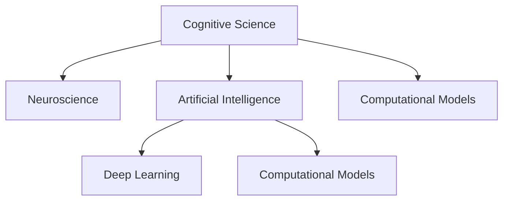

                 

# 探索人类认知的边界：人类计算的科学意义

> 关键词：认知科学,人类计算,科学意义,人工智能,深度学习,神经科学,计算模型

## 1. 背景介绍

### 1.1 问题由来
在过去的几十年里，人类对于计算的认知已经经历了多次翻天覆地的变化。从早期的机械计算到电子计算机的发明，再到量子计算的初步探索，计算技术的进步推动了人类社会从信息时代走向智能时代。特别是人工智能（AI）和深度学习（DL）的兴起，使得机器可以在越来越复杂的任务上模仿甚至超越人类智能。然而，我们对于人类计算的本质的理解仍然不够深入，这使得我们在开发智能系统时，难以真正理解其背后的科学原理，也难以在实际应用中发挥其最大潜力。

### 1.2 问题核心关键点
要深入理解人类计算的科学意义，我们需要从多个角度来探讨：

1. **认知科学（Cognitive Science）**：研究人类如何思考、学习和决策，以及这些过程如何被计算模型所模拟。
2. **神经科学（Neuroscience）**：研究大脑如何处理信息，以及这些处理机制如何被计算模型所映射。
3. **人工智能（AI）**：研究如何让机器具备人类智能的某些特性，以及这些特性的实现需要哪些计算资源。
4. **深度学习（DL）**：一种基于神经网络模型的人工智能技术，其能够通过大量数据自动学习特征，并在任务中表现出色。
5. **计算模型（Computational Models）**：用于研究计算问题的数学模型，从经典算法到现代的复杂网络模型，它们都试图模拟人类的思考过程。

这些关键点构成了一个多学科的交叉领域，它们共同作用于理解人类计算的科学意义。本文将深入探讨这些关键点，并通过数学模型和代码实例来加深理解。

### 1.3 问题研究意义
理解人类计算的科学意义，对于推动人工智能技术的进一步发展，构建更加智能化的计算模型，以及更好地应用于实际问题，具有重要意义：

1. **加速AI技术发展**：通过对人类计算过程的深入理解，可以更好地指导AI模型的设计和优化，加速新技术的开发。
2. **提升智能系统性能**：通过理解人类认知的机制，可以构建更加高效、准确、鲁棒的智能系统。
3. **促进跨学科合作**：理解和研究人类计算，需要跨学科合作，从而推动更多领域知识的应用和整合。
4. **解决实际问题**：智能系统在实际应用中，如医疗、金融、教育等领域，其科学原理的理解将帮助解决实际问题。

## 2. 核心概念与联系

### 2.1 核心概念概述

为更好地理解人类计算的科学意义，本节将介绍几个密切相关的核心概念：

- **认知科学（Cognitive Science）**：研究人类思维、学习、记忆和决策的科学，旨在揭示人类认知过程的机制。
- **神经科学（Neuroscience）**：研究大脑如何处理信息，以及这些处理机制如何影响行为和认知。
- **人工智能（AI）**：构建能够执行人类智能任务的系统，如视觉识别、语言理解、决策等。
- **深度学习（DL）**：一种基于多层神经网络的机器学习方法，能够自动从数据中学习特征，并用于解决复杂任务。
- **计算模型（Computational Models）**：用于研究计算问题的数学模型，从经典算法到现代的复杂网络模型，它们都试图模拟人类的思考过程。

这些核心概念之间的逻辑关系可以通过以下Mermaid流程图来展示：



这个流程图展示了这个交叉领域的核心概念及其之间的关系：

1. 认知科学通过研究人类认知过程，揭示其机制。
2. 神经科学研究大脑的物理和功能机制。
3. AI旨在构建能够执行智能任务的系统。
4. DL是AI中的一种技术，通过多层神经网络自动学习特征。
5. 计算模型是研究计算问题的数学工具，试图模拟人类思考。

## 3. 核心算法原理 & 具体操作步骤

### 3.1 算法原理概述

人类计算的科学意义，主要体现在认知科学、神经科学和AI技术中，这些技术通过模拟人类认知过程，实现了对复杂问题的理解和解决。深度学习作为AI的一个重要分支，通过多层神经网络的自动学习机制，可以在大规模数据上构建复杂的计算模型。

### 3.2 算法步骤详解

以下是人类计算科学意义的算法步骤详解：

**Step 1: 数据收集与预处理**
- 收集大规模的数据集，用于训练深度学习模型。
- 对数据进行预处理，如清洗、标注、归一化等，以便于模型的训练和推理。

**Step 2: 模型设计**
- 根据任务需求，设计深度学习模型架构，如卷积神经网络（CNN）、递归神经网络（RNN）、Transformer等。
- 确定模型的超参数，如学习率、批大小、迭代轮数等。

**Step 3: 模型训练**
- 使用收集到的数据集对模型进行训练，通过反向传播算法更新模型参数。
- 在训练过程中，使用正则化技术（如L2正则、Dropout）避免过拟合。
- 通过调整超参数和优化算法，提高模型的泛化能力和性能。

**Step 4: 模型评估与验证**
- 在验证集上评估模型性能，使用评估指标（如准确率、召回率、F1值）衡量模型效果。
- 根据评估结果调整模型参数，优化模型性能。

**Step 5: 模型部署与应用**
- 将训练好的模型部署到实际应用场景中，进行推理和预测。
- 在实际应用中，根据反馈数据不断优化模型，提升系统性能。

### 3.3 算法优缺点

人类计算科学意义的算法具有以下优点：
1. 高效性：深度学习模型可以在大规模数据上高效地学习特征，解决复杂任务。
2. 可扩展性：深度学习模型可以通过增加层数和参数量，提高模型性能。
3. 自适应性：深度学习模型可以通过训练，自动适应新数据和新任务。

同时，该算法也存在一些局限性：
1. 数据依赖性：深度学习模型依赖高质量的数据，数据偏差可能导致模型性能不佳。
2. 计算资源消耗大：大规模深度学习模型需要大量的计算资源和时间，难以在小规模设备上运行。
3. 黑箱特性：深度学习模型通常难以解释其内部机制，难以进行透明化的调试和优化。

尽管存在这些局限性，但就目前而言，深度学习在处理复杂计算任务中仍然是最有效的技术之一。未来相关研究的方向在于如何更好地理解和应用深度学习，以及如何在保持性能的同时，提高模型的可解释性和计算效率。

### 3.4 算法应用领域

人类计算科学意义的应用领域十分广泛，涉及医学、金融、教育、智能家居等多个领域。以下是几个具体的应用场景：

**医疗领域**
- 医学影像分析：使用深度学习模型对医学影像进行自动分析，辅助医生诊断。
- 基因组学：通过深度学习模型分析基因序列数据，寻找基因与疾病之间的关系。

**金融领域**
- 风险评估：使用深度学习模型对金融数据进行风险评估，预测股票市场趋势。
- 信用评分：利用深度学习模型对客户数据进行信用评分，提高贷款审批效率。

**教育领域**
- 智能辅导系统：使用深度学习模型分析学生学习行为，提供个性化辅导。
- 语言学习：通过深度学习模型分析学生学习进度，推荐个性化学习资源。

**智能家居**
- 语音识别：使用深度学习模型对语音进行识别，实现智能家居控制。
- 环境监测：利用深度学习模型对家居环境进行监测，提供健康建议。

## 4. 数学模型和公式 & 详细讲解 & 举例说明

### 4.1 数学模型构建

深度学习模型的数学模型可以表示为：

$$
f(x; \theta) = \sum_{i=1}^{n} w_i g_i(x) + b
$$

其中，$f(x; \theta)$ 表示模型在输入 $x$ 上的输出，$w_i$ 和 $b$ 为模型的权重和偏置，$g_i$ 为第 $i$ 层的激活函数。

### 4.2 公式推导过程

深度学习模型的推导过程包括前向传播和反向传播。以一个简单的单层神经网络为例，其前向传播过程可以表示为：

$$
a_1 = w_1 x + b_1
$$

$$
z_1 = f_1(a_1)
$$

其中，$a_1$ 为输入 $x$ 经过第一层线性变换后的结果，$z_1$ 为输入 $x$ 经过第一层激活函数 $f_1$ 后的结果。

反向传播过程的推导如下：

$$
\frac{\partial L}{\partial w_1} = \frac{\partial L}{\partial z_1} \frac{\partial z_1}{\partial a_1} \frac{\partial a_1}{\partial w_1}
$$

其中，$L$ 为损失函数，$\frac{\partial L}{\partial z_1}$ 表示损失函数对激活函数输出 $z_1$ 的导数，$\frac{\partial z_1}{\partial a_1}$ 表示激活函数 $f_1$ 对输入 $a_1$ 的导数，$\frac{\partial a_1}{\partial w_1}$ 表示线性变换对权重 $w_1$ 的导数。

### 4.3 案例分析与讲解

以一个简单的文本分类任务为例，说明深度学习模型的构建和训练过程：

- **数据准备**：收集文本数据，并进行标注，如将文本分为不同的类别。
- **模型设计**：使用一个简单的卷积神经网络（CNN）模型，用于提取文本特征。
- **模型训练**：在训练集上对模型进行训练，通过反向传播算法更新权重和偏置。
- **模型评估**：在验证集上评估模型性能，使用混淆矩阵等指标衡量模型效果。
- **模型部署**：将训练好的模型部署到实际应用中，进行文本分类任务。

## 5. 项目实践：代码实例和详细解释说明

### 5.1 开发环境搭建

在进行深度学习项目实践前，我们需要准备好开发环境。以下是使用Python进行TensorFlow开发的环境配置流程：

1. 安装Anaconda：从官网下载并安装Anaconda，用于创建独立的Python环境。

2. 创建并激活虚拟环境：
```bash
conda create -n tf-env python=3.8 
conda activate tf-env
```

3. 安装TensorFlow：根据CUDA版本，从官网获取对应的安装命令。例如：
```bash
conda install tensorflow -c conda-forge -c pytorch
```

4. 安装各类工具包：
```bash
pip install numpy pandas scikit-learn matplotlib tqdm jupyter notebook ipython
```

完成上述步骤后，即可在`tf-env`环境中开始深度学习项目实践。

### 5.2 源代码详细实现

这里我们以文本分类任务为例，给出使用TensorFlow进行CNN模型训练的Python代码实现。

```python
import tensorflow as tf
from tensorflow.keras import layers

# 定义CNN模型
def build_model(input_shape):
    model = tf.keras.Sequential([
        layers.Embedding(input_dim=vocab_size, output_dim=embedding_dim, input_length=input_shape),
        layers.Conv1D(32, 3, activation='relu'),
        layers.GlobalMaxPooling1D(),
        layers.Dense(2, activation='softmax')
    ])
    return model

# 数据准备
train_data = ...
test_data = ...

# 定义超参数
vocab_size = ...
embedding_dim = ...
learning_rate = ...

# 构建模型
model = build_model(input_shape)

# 编译模型
model.compile(optimizer=tf.keras.optimizers.Adam(learning_rate=learning_rate),
              loss='sparse_categorical_crossentropy',
              metrics=['accuracy'])

# 训练模型
model.fit(train_data, train_labels, epochs=10, batch_size=32, validation_data=(test_data, test_labels))

# 评估模型
model.evaluate(test_data, test_labels)
```

### 5.3 代码解读与分析

让我们再详细解读一下关键代码的实现细节：

**模型定义**：
- 使用`tf.keras.Sequential`构建一个简单的CNN模型，包括嵌入层、卷积层、全局池化层和全连接层。
- 嵌入层将文本转换为向量表示。
- 卷积层和全局池化层用于提取文本特征。
- 全连接层进行分类预测。

**数据准备**：
- 使用`train_data`和`test_data`作为训练和测试数据集。

**超参数定义**：
- `vocab_size`为词汇表大小。
- `embedding_dim`为嵌入层的维度。
- `learning_rate`为学习率。

**模型编译**：
- 使用`tf.keras.optimizers.Adam`优化器。
- 设置损失函数为`sparse_categorical_crossentropy`。
- 设置评估指标为`accuracy`。

**模型训练**：
- 使用`fit`方法进行模型训练。
- 设置迭代轮数为10，批次大小为32。

**模型评估**：
- 使用`evaluate`方法在测试集上评估模型性能。

## 6. 实际应用场景

### 6.1 医疗领域

深度学习在医疗领域的应用场景十分广泛，可以用于医学影像分析、基因组学研究等。以下是几个具体的例子：

**医学影像分析**：使用深度学习模型对医学影像进行自动分析，辅助医生诊断。例如，使用卷积神经网络（CNN）对肺部CT影像进行分析和诊断，可以大大提高医生的诊断效率和准确性。

**基因组学研究**：利用深度学习模型分析基因序列数据，寻找基因与疾病之间的关系。例如，使用循环神经网络（RNN）对基因序列进行建模，预测基因突变与疾病的关系。

### 6.2 金融领域

深度学习在金融领域的应用场景包括风险评估、信用评分等。以下是几个具体的例子：

**风险评估**：使用深度学习模型对金融数据进行风险评估，预测股票市场趋势。例如，使用递归神经网络（RNN）对股票价格序列进行建模，预测股票市场的未来走势。

**信用评分**：利用深度学习模型对客户数据进行信用评分，提高贷款审批效率。例如，使用多层感知器（MLP）对客户历史交易数据进行建模，预测客户的信用风险。

### 6.3 教育领域

深度学习在教育领域的应用场景包括智能辅导系统、语言学习等。以下是几个具体的例子：

**智能辅导系统**：使用深度学习模型分析学生学习行为，提供个性化辅导。例如，使用循环神经网络（RNN）对学生的学习数据进行分析，预测学生的学习进度和需求。

**语言学习**：通过深度学习模型分析学生学习进度，推荐个性化学习资源。例如，使用注意力机制（Attention Mechanism）对学生学习数据进行分析，推荐适合学生的学习资源。

### 6.4 智能家居

深度学习在智能家居领域的应用场景包括语音识别、环境监测等。以下是几个具体的例子：

**语音识别**：使用深度学习模型对语音进行识别，实现智能家居控制。例如，使用卷积神经网络（CNN）对语音信号进行建模，实现语音识别。

**环境监测**：利用深度学习模型对家居环境进行监测，提供健康建议。例如，使用循环神经网络（RNN）对家居环境数据进行分析，预测室内空气质量。

## 7. 工具和资源推荐

### 7.1 学习资源推荐

为了帮助开发者系统掌握深度学习技术的理论基础和实践技巧，这里推荐一些优质的学习资源：

1. 《深度学习》（Ian Goodfellow等著）：全面介绍深度学习的理论基础和应用实例，是深度学习领域的经典之作。
2. Coursera《深度学习专项课程》：由Andrew Ng教授主讲，深入浅出地介绍了深度学习的基本概念和实现方法。
3. PyTorch官方文档：PyTorch的官方文档，提供了丰富的代码示例和教程，适合初学者入门。
4. TensorFlow官方文档：TensorFlow的官方文档，提供了详细的API文档和代码示例，适合进阶学习。
5. HuggingFace Transformers库：提供了多种预训练模型和微调框架，适合快速实现深度学习任务。

通过对这些资源的学习实践，相信你一定能够快速掌握深度学习技术的精髓，并用于解决实际的计算问题。

### 7.2 开发工具推荐

高效的开发离不开优秀的工具支持。以下是几款用于深度学习项目开发的常用工具：

1. PyTorch：基于Python的开源深度学习框架，灵活动态的计算图，适合快速迭代研究。
2. TensorFlow：由Google主导开发的开源深度学习框架，生产部署方便，适合大规模工程应用。
3. HuggingFace Transformers库：提供了多种预训练模型和微调框架，适合快速实现深度学习任务。
4. Weights & Biases：模型训练的实验跟踪工具，可以记录和可视化模型训练过程中的各项指标，方便对比和调优。
5. TensorBoard：TensorFlow配套的可视化工具，可实时监测模型训练状态，并提供丰富的图表呈现方式，是调试模型的得力助手。

合理利用这些工具，可以显著提升深度学习项目开发的效率，加快创新迭代的步伐。

### 7.3 相关论文推荐

深度学习的发展源于学界的持续研究。以下是几篇奠基性的相关论文，推荐阅读：

1. Deep Learning（Ian Goodfellow等著）：深度学习领域的经典之作，全面介绍了深度学习的基本原理和应用实例。
2. AlexNet（论文链接）：Hinton等人提出的卷积神经网络（CNN）模型，开创了深度学习在图像识别领域的应用。
3. LSTM（论文链接）：Hochreiter等人提出的循环神经网络（RNN）模型，为自然语言处理（NLP）任务提供了新的解决思路。
4. Attention Mechanism（论文链接）：Bahdanau等人提出的注意力机制（Attention Mechanism），用于提升序列建模的效果。
5. Generative Adversarial Networks（GANs）（论文链接）：Goodfellow等人提出的生成对抗网络（GANs），为图像生成和数据增强提供了新的方法。

这些论文代表了大深度学习的发展脉络。通过学习这些前沿成果，可以帮助研究者把握学科前进方向，激发更多的创新灵感。

## 8. 总结：未来发展趋势与挑战

### 8.1 研究成果总结

本文对深度学习技术进行了全面系统的介绍。首先，阐述了深度学习技术在处理复杂计算任务中的高效性，以及其在多个实际领域中的应用。其次，从原理到实践，详细讲解了深度学习模型的构建和训练过程，给出了具体的代码实现。同时，本文还探讨了深度学习技术在医疗、金融、教育、智能家居等多个领域的应用前景。最后，本文推荐了一些优质的学习资源和开发工具，力求为读者提供全方位的技术指引。

通过本文的系统梳理，可以看到，深度学习技术在处理复杂计算任务中已经取得了显著成效，并在多个实际领域中得到应用。未来，随着深度学习技术的进一步发展，其应用范围和性能将得到更大的拓展。

### 8.2 未来发展趋势

展望未来，深度学习技术将呈现以下几个发展趋势：

1. **模型复杂度提升**：随着算力资源的增长，深度学习模型的复杂度将进一步提升，可以处理更加复杂的计算任务。
2. **自监督学习的发展**：自监督学习技术可以在大规模无标签数据上进行训练，减少对标注数据的依赖。
3. **多模态学习的应用**：多模态学习技术可以将视觉、语音、文本等多种模态数据融合，提高系统的全面性和鲁棒性。
4. **模型的可解释性增强**：通过模型可视化、可解释性生成等技术，使得深度学习模型更具可解释性。
5. **边缘计算和嵌入式设备的应用**：深度学习技术将更多地应用于边缘计算和嵌入式设备，提升计算效率和实时性。
6. **联邦学习的应用**：联邦学习技术可以在不共享数据的情况下，实现多个设备或系统之间的模型协作。

这些趋势将推动深度学习技术的进一步发展，使得其更加智能、高效和可解释。

### 8.3 面临的挑战

尽管深度学习技术已经取得了显著进展，但在迈向更加智能化、普适化应用的过程中，仍然面临诸多挑战：

1. **数据隐私和安全**：深度学习模型通常需要大量数据进行训练，如何在保护数据隐私和隐私安全的同时，提高模型性能，是一个重要的问题。
2. **计算资源消耗大**：深度学习模型的复杂度不断提升，对计算资源的需求也在增加，如何在保持性能的同时，降低计算成本，是一个重要的问题。
3. **模型泛化能力不足**：深度学习模型在处理新数据时，泛化能力仍然存在不足，如何在保持泛化能力的同时，提高模型性能，是一个重要的问题。
4. **模型的可解释性不足**：深度学习模型通常具有"黑箱"特性，难以解释其内部机制，如何在提高模型性能的同时，增强模型的可解释性，是一个重要的问题。
5. **模型的鲁棒性不足**：深度学习模型在处理对抗样本时，鲁棒性仍然不足，如何在提高模型鲁棒性的同时，保持模型性能，是一个重要的问题。

这些挑战需要未来的研究进行深入探索，以推动深度学习技术的进一步发展。

### 8.4 研究展望

未来，深度学习技术将在以下几个方向进行深入研究：

1. **自监督学习技术**：研究如何在大规模无标签数据上进行自监督学习，减少对标注数据的依赖，提高模型的泛化能力。
2. **多模态学习技术**：研究如何将视觉、语音、文本等多种模态数据融合，提高系统的全面性和鲁棒性。
3. **模型压缩和加速技术**：研究如何在保持模型性能的同时，降低计算成本，提高模型的实时性和效率。
4. **可解释性生成技术**：研究如何增强深度学习模型的可解释性，使其更具透明性和可解释性。
5. **联邦学习技术**：研究如何在不共享数据的情况下，实现多个设备或系统之间的模型协作。

这些研究方向将推动深度学习技术的进一步发展，使其更加智能、高效和可解释。通过这些研究，深度学习技术将更好地应用于实际问题，提升人类的认知能力和计算能力。

## 9. 附录：常见问题与解答

**Q1：深度学习技术是否适用于所有计算任务？**

A: 深度学习技术适用于处理复杂的计算任务，但对于一些简单或线性的计算问题，可能不如传统的机器学习算法或手工设计算法高效。

**Q2：深度学习模型的超参数如何设置？**

A: 深度学习模型的超参数设置通常需要通过试验和调参来确定，一般采用网格搜索或随机搜索等方法，选择最优的超参数组合。

**Q3：深度学习模型如何避免过拟合？**

A: 深度学习模型可以通过数据增强、正则化、早停等方法避免过拟合，这些方法可以在模型训练过程中进行调整。

**Q4：深度学习模型在实际应用中如何部署？**

A: 深度学习模型在实际应用中，通常需要进行模型压缩、量化加速等优化，并部署到服务器或嵌入式设备中进行推理。

**Q5：深度学习技术在医疗领域的应用有哪些？**

A: 深度学习技术在医疗领域的应用包括医学影像分析、基因组学研究等，可以提高医疗诊断的准确性和效率。

---

作者：禅与计算机程序设计艺术 / Zen and the Art of Computer Programming

