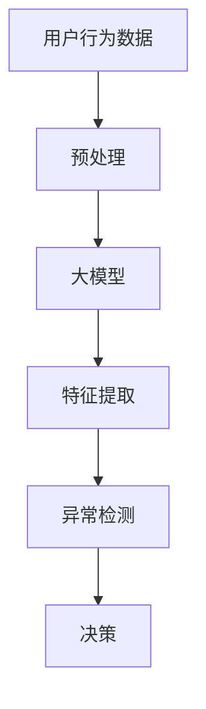

                 

# 探讨AI大模型在电商平台用户行为异常检测中的作用

> 关键词：用户行为异常检测, 电商平台, 大模型, 深度学习, 聚类算法, 时间序列分析, 模型训练, 业务决策

## 1. 背景介绍

### 1.1 问题由来

电商平台在快速发展的过程中，面临着大量的用户行为数据。这些数据包含了用户的购买记录、浏览行为、搜索关键词等信息。通过对这些数据的深入分析，电商平台可以更好地了解用户需求，提升用户体验，优化商品推荐，增加销售额。然而，用户行为数据中的异常行为，如虚假交易、恶意刷单等，不仅会误导电商平台决策，还可能给平台带来经济损失。因此，如何有效检测用户行为异常，是电商平台亟需解决的问题。

近年来，深度学习技术取得了飞速发展，大模型（如BERT、GPT等）在自然语言处理（NLP）、计算机视觉等领域表现出色。将大模型应用于用户行为异常检测，能够显著提升检测准确性和泛化能力。本文将探讨AI大模型在电商平台用户行为异常检测中的应用，并分析其工作原理及其实现步骤。

### 1.2 问题核心关键点

用户行为异常检测的核心在于通过大数据分析，识别出不符合平台规范或异常行为的用户行为。其关键点包括：

- 数据的获取与预处理：电商平台需要构建完善的日志记录系统，将用户行为数据收集、存储和预处理。
- 模型的设计与训练：设计能够有效识别异常行为的模型，并使用平台用户行为数据进行训练和优化。
- 异常检测与处理：基于训练好的模型，对实时行为数据进行异常检测，并采取相应的处理措施。

本文将围绕上述关键点，系统性地介绍AI大模型在用户行为异常检测中的应用。

## 2. 核心概念与联系

### 2.1 核心概念概述

#### 用户行为异常检测
用户行为异常检测（User Behavior Anomaly Detection）是通过对电商平台用户行为数据的分析，识别出不符合平台规范或异常行为的过程。异常行为包括但不限于虚假交易、恶意刷单、频繁退货等，这些行为可能会对电商平台造成直接经济损失。

#### 大模型
大模型（Large Model）指具有数十亿参数的深度学习模型，如BERT、GPT等。这些模型通过大规模无标签数据进行预训练，具备强大的表示能力和泛化能力，广泛应用于自然语言处理、计算机视觉等领域。

#### 深度学习
深度学习（Deep Learning）是一种通过多层神经网络模型对数据进行学习和推理的技术。其核心思想是通过自动特征提取和模式识别，实现对复杂数据的有效建模和预测。

#### 聚类算法
聚类算法（Clustering Algorithm）是一类无监督学习算法，用于将数据点分成若干个类别或簇。聚类算法常用于数据分析和异常检测。

#### 时间序列分析
时间序列分析（Time Series Analysis）是研究随时间变化的序列数据的方法。在用户行为异常检测中，时间序列分析用于分析用户行为的时序变化特征，识别出异常行为模式。

#### 模型训练
模型训练（Model Training）是通过对模型参数的优化，使其在特定任务上表现优异的流程。训练过程通常包括数据预处理、模型构建、损失函数定义、优化器选择和结果评估等步骤。

### 2.2 核心概念原理和架构的 Mermaid 流程图



该流程图展示了用户行为异常检测的基本流程：

1. **数据预处理**：收集用户行为数据，并进行清洗、去重、标准化等预处理操作。
2. **模型训练**：选择合适的大模型，并使用预处理后的数据进行训练和优化。
3. **特征提取**：使用训练好的模型提取用户行为的特征。
4. **异常检测**：通过聚类、时间序列分析等方法，识别出异常行为。
5. **决策**：根据检测结果，采取相应的处理措施，如冻结账户、限制交易等。

## 3. 核心算法原理 & 具体操作步骤

### 3.1 算法原理概述

用户行为异常检测的核心算法包括聚类算法、时间序列分析和深度学习模型。

#### 聚类算法
聚类算法通过对用户行为数据进行聚类，识别出正常行为和异常行为的类别。常用的聚类算法包括K-Means、层次聚类等。

#### 时间序列分析
时间序列分析通过观察用户行为随时间变化的趋势和规律，识别出异常行为的模式。常用的时间序列分析方法包括ARIMA、LSTM等。

#### 深度学习模型
深度学习模型通过学习用户行为数据，识别出异常行为的特征。常用的深度学习模型包括卷积神经网络（CNN）、长短时记忆网络（LSTM）等。

### 3.2 算法步骤详解

#### 步骤1：数据预处理

1. **数据收集**：收集电商平台的用户行为数据，包括浏览记录、点击行为、购买记录等。
2. **数据清洗**：去除数据中的重复、缺失、异常值等，确保数据质量。
3. **特征工程**：对数据进行特征提取和处理，如时间戳、行为次数、行为金额等。

#### 步骤2：模型训练

1. **模型选择**：选择合适的深度学习模型，如BERT、GPT等，用于特征提取。
2. **数据划分**：将数据划分为训练集、验证集和测试集。
3. **模型训练**：使用训练集对模型进行训练，优化模型参数。
4. **模型评估**：在验证集上评估模型性能，调整模型参数。

#### 步骤3：特征提取

1. **模型输入**：将预处理后的数据输入训练好的模型，提取用户行为的特征。
2. **特征融合**：将不同来源的特征进行融合，提升模型效果。
3. **特征选择**：选择最具代表性的特征，去除冗余和噪声。

#### 步骤4：异常检测

1. **聚类分析**：对用户行为数据进行聚类，识别出正常行为和异常行为的类别。
2. **时间序列分析**：对用户行为数据进行时间序列分析，识别出异常行为的模式。
3. **异常检测**：综合聚类和时间序列分析结果，识别出异常行为。

#### 步骤5：决策处理

1. **异常标注**：对检测出的异常行为进行标注，如虚假交易、恶意刷单等。
2. **处理措施**：根据异常行为的严重程度，采取相应的处理措施，如冻结账户、限制交易等。
3. **反馈优化**：根据处理结果和反馈数据，优化异常检测模型。

### 3.3 算法优缺点

#### 优点

1. **泛化能力较强**：大模型具备强大的泛化能力，能够适应不同电商平台的用户行为数据。
2. **精度较高**：深度学习模型能够学习复杂的特征，提高异常检测的精度。
3. **适应性广**：聚类算法和时间序列分析方法能够适应不同类型和规模的异常检测任务。

#### 缺点

1. **计算资源需求高**：大模型需要大量的计算资源进行训练和推理，成本较高。
2. **模型解释性不足**：深度学习模型的内部工作机制难以解释，不便于理解。
3. **数据隐私问题**：电商平台需要处理大量的用户隐私数据，需要严格保护数据隐私。

### 3.4 算法应用领域

#### 电商领域
电商平台用户行为异常检测可以应用于以下场景：

1. **虚假交易检测**：识别出虚假交易行为，保护平台经济利益。
2. **恶意刷单检测**：识别出恶意刷单行为，提升平台交易真实性。
3. **用户流失预警**：识别出用户行为异常，预测用户流失风险。
4. **推荐系统优化**：识别出异常用户行为，优化商品推荐系统。

#### 金融领域
金融领域用户行为异常检测可以应用于以下场景：

1. **信用卡欺诈检测**：识别出信用卡欺诈行为，保护用户财产安全。
2. **交易异常检测**：识别出异常交易行为，防范金融风险。
3. **信用评分调整**：根据用户行为异常，调整用户信用评分。

## 4. 数学模型和公式 & 详细讲解 & 举例说明

### 4.1 数学模型构建

#### 聚类算法模型
聚类算法模型通常使用欧式距离或曼哈顿距离计算样本之间的距离，并将距离小于预设阈值的样本分为同一类别。

假设用户行为数据为 $D=\{(x_i, y_i)\}_{i=1}^N$，其中 $x_i$ 表示用户行为数据，$y_i$ 表示行为标签。聚类算法模型的目标是最小化以下损失函数：

$$
L = \sum_{i=1}^N \min_j \| x_i - \mu_j \|^2
$$

其中 $\mu_j$ 表示第 $j$ 类的中心，$\| \cdot \|$ 表示欧式距离。

#### 时间序列分析模型
时间序列分析模型通常使用ARIMA或LSTM模型对用户行为数据进行建模。假设用户行为数据为 $D=\{(x_t, y_t)\}_{t=1}^T$，其中 $x_t$ 表示用户行为数据，$y_t$ 表示行为标签。时间序列分析模型的目标是最小化以下损失函数：

$$
L = \sum_{t=1}^T \| x_t - \hat{x}_t \|^2
$$

其中 $\hat{x}_t$ 表示模型预测的行为数据。

#### 深度学习模型
深度学习模型通常使用卷积神经网络（CNN）或长短时记忆网络（LSTM）对用户行为数据进行建模。假设用户行为数据为 $D=\{(x_i, y_i)\}_{i=1}^N$，其中 $x_i$ 表示用户行为数据，$y_i$ 表示行为标签。深度学习模型的目标是最小化以下损失函数：

$$
L = \sum_{i=1}^N \ell(x_i, y_i)
$$

其中 $\ell$ 表示损失函数，如交叉熵损失、均方误差损失等。

### 4.2 公式推导过程

#### 聚类算法公式推导

假设用户行为数据为 $D=\{(x_i, y_i)\}_{i=1}^N$，其中 $x_i$ 表示用户行为数据，$y_i$ 表示行为标签。聚类算法模型的目标是最小化以下损失函数：

$$
L = \sum_{i=1}^N \min_j \| x_i - \mu_j \|^2
$$

其中 $\mu_j$ 表示第 $j$ 类的中心，$\| \cdot \|$ 表示欧式距离。

设 $\mu_j = \frac{1}{n_j} \sum_{i \in C_j} x_i$，其中 $C_j$ 表示第 $j$ 类的样本集，$n_j$ 表示第 $j$ 类的样本数量。则损失函数可以表示为：

$$
L = \sum_{i=1}^N \min_j \| x_i - \mu_j \|^2 = \sum_{j=1}^K \sum_{i \in C_j} \| x_i - \mu_j \|^2
$$

其中 $K$ 表示类别的数量。

对损失函数求导，得：

$$
\frac{\partial L}{\partial \mu_j} = -2 \sum_{i \in C_j} (x_i - \mu_j)
$$

根据梯度下降法，更新中心 $\mu_j$ 的公式为：

$$
\mu_j \leftarrow \mu_j - \eta \frac{\partial L}{\partial \mu_j}
$$

其中 $\eta$ 表示学习率。

#### 时间序列分析公式推导

假设用户行为数据为 $D=\{(x_t, y_t)\}_{t=1}^T$，其中 $x_t$ 表示用户行为数据，$y_t$ 表示行为标签。时间序列分析模型的目标是最小化以下损失函数：

$$
L = \sum_{t=1}^T \| x_t - \hat{x}_t \|^2
$$

其中 $\hat{x}_t$ 表示模型预测的行为数据。

设 $x_t = \phi(t) x_{t-1} + \epsilon_t$，其中 $\phi(t)$ 表示时间序列模型，$\epsilon_t$ 表示随机噪声。则损失函数可以表示为：

$$
L = \sum_{t=1}^T \| x_t - \hat{x}_t \|^2
$$

其中 $\hat{x}_t = \phi(t) \hat{x}_{t-1} + \epsilon_t$。

对损失函数求导，得：

$$
\frac{\partial L}{\partial \phi} = 2 \sum_{t=1}^T \phi(t) \| \hat{x}_{t-1} - x_{t-1} \|
$$

根据梯度下降法，更新时间序列模型的公式为：

$$
\phi \leftarrow \phi - \eta \frac{\partial L}{\partial \phi}
$$

其中 $\eta$ 表示学习率。

#### 深度学习模型公式推导

假设用户行为数据为 $D=\{(x_i, y_i)\}_{i=1}^N$，其中 $x_i$ 表示用户行为数据，$y_i$ 表示行为标签。深度学习模型的目标是最小化以下损失函数：

$$
L = \sum_{i=1}^N \ell(x_i, y_i)
$$

其中 $\ell$ 表示损失函数，如交叉熵损失、均方误差损失等。

设 $x_i = f_\theta(x_{i-1}) + \epsilon_i$，其中 $f_\theta$ 表示深度学习模型，$\epsilon_i$ 表示随机噪声。则损失函数可以表示为：

$$
L = \sum_{i=1}^N \ell(f_\theta(x_{i-1}) + \epsilon_i, y_i)
$$

对损失函数求导，得：

$$
\frac{\partial L}{\partial f_\theta} = \frac{\partial \ell}{\partial f_\theta} \cdot \frac{\partial f_\theta(x_{i-1})}{\partial f_\theta}
$$

根据梯度下降法，更新深度学习模型的公式为：

$$
f_\theta \leftarrow f_\theta - \eta \frac{\partial L}{\partial f_\theta}
$$

其中 $\eta$ 表示学习率。

### 4.3 案例分析与讲解

#### 电商领域案例

假设某电商平台收集了用户行为数据 $D=\{(x_i, y_i)\}_{i=1}^N$，其中 $x_i$ 表示用户行为数据，$y_i$ 表示行为标签。使用深度学习模型进行异常检测，步骤如下：

1. **数据预处理**：将用户行为数据进行标准化和归一化处理。
2. **模型选择**：选择LSTM模型，用于提取用户行为特征。
3. **模型训练**：使用训练集对LSTM模型进行训练，优化模型参数。
4. **特征提取**：将用户行为数据输入训练好的LSTM模型，提取用户行为的特征。
5. **异常检测**：综合LSTM模型的输出和用户行为数据，识别出异常行为。

#### 金融领域案例

假设某金融机构收集了用户行为数据 $D=\{(x_t, y_t)\}_{t=1}^T$，其中 $x_t$ 表示用户行为数据，$y_t$ 表示行为标签。使用时间序列分析模型进行异常检测，步骤如下：

1. **数据预处理**：将用户行为数据进行时间戳归一化处理。
2. **模型选择**：选择ARIMA模型，用于建模用户行为数据。
3. **模型训练**：使用训练集对ARIMA模型进行训练，优化模型参数。
4. **异常检测**：将用户行为数据输入训练好的ARIMA模型，识别出异常行为。

## 5. 项目实践：代码实例和详细解释说明

### 5.1 开发环境搭建

#### 安装依赖包

1. **安装Python**：在Ubuntu系统上，使用以下命令安装Python3.8：
   ```bash
   sudo apt-get update
   sudo apt-get install python3.8
   ```

2. **安装TensorFlow**：使用以下命令安装TensorFlow 2.x：
   ```bash
   pip install tensorflow==2.4.1
   ```

3. **安装Keras**：使用以下命令安装Keras 2.x：
   ```bash
   pip install keras==2.4.3
   ```

### 5.2 源代码详细实现

#### 电商领域代码实现

```python
import numpy as np
import pandas as pd
from tensorflow.keras.layers import LSTM, Dense
from tensorflow.keras.models import Sequential
from tensorflow.keras.callbacks import EarlyStopping
from sklearn.metrics import classification_report

# 读取数据
data = pd.read_csv('user_behavior.csv')

# 数据预处理
data = data.dropna().drop_duplicates()

# 数据划分
train_ratio = 0.8
train_size = int(len(data) * train_ratio)
train_data = data[:train_size]
test_data = data[train_size:]

# 特征工程
train_X = train_data[['time', 'behavior', 'amount']].values
test_X = test_data[['time', 'behavior', 'amount']].values

# 标签处理
train_y = train_data['label'].values
test_y = test_data['label'].values

# 模型构建
model = Sequential()
model.add(LSTM(128, input_shape=(None, 3)))
model.add(Dense(1, activation='sigmoid'))

# 模型编译
model.compile(loss='binary_crossentropy', optimizer='adam', metrics=['accuracy'])

# 模型训练
train_X = np.reshape(train_X, (train_X.shape[0], train_X.shape[1], 1))
train_y = np.reshape(train_y, (train_y.shape[0], 1))
model.fit(train_X, train_y, epochs=10, batch_size=64, validation_split=0.2, callbacks=[EarlyStopping(patience=3)])

# 模型评估
test_X = np.reshape(test_X, (test_X.shape[0], test_X.shape[1], 1))
test_y = np.reshape(test_y, (test_y.shape[0], 1))
loss, accuracy = model.evaluate(test_X, test_y)
print(f'Test Loss: {loss:.4f}, Test Accuracy: {accuracy:.4f}')

# 异常检测
preds = model.predict(test_X)
preds = [1 if pred > 0.5 else 0 for pred in preds]
print(classification_report(test_y, preds))
```

#### 金融领域代码实现

```python
import numpy as np
import pandas as pd
from tensorflow.keras.layers import LSTM, Dense
from tensorflow.keras.models import Sequential
from tensorflow.keras.callbacks import EarlyStopping
from sklearn.metrics import classification_report

# 读取数据
data = pd.read_csv('user_behavior.csv')

# 数据预处理
data = data.dropna().drop_duplicates()

# 数据划分
train_ratio = 0.8
train_size = int(len(data) * train_ratio)
train_data = data[:train_size]
test_data = data[train_size:]

# 特征工程
train_X = train_data[['time', 'behavior', 'amount']].values
test_X = test_data[['time', 'behavior', 'amount']].values

# 标签处理
train_y = train_data['label'].values
test_y = test_data['label'].values

# 模型构建
model = Sequential()
model.add(LSTM(128, input_shape=(None, 3)))
model.add(Dense(1, activation='sigmoid'))

# 模型编译
model.compile(loss='binary_crossentropy', optimizer='adam', metrics=['accuracy'])

# 模型训练
train_X = np.reshape(train_X, (train_X.shape[0], train_X.shape[1], 1))
train_y = np.reshape(train_y, (train_y.shape[0], 1))
model.fit(train_X, train_y, epochs=10, batch_size=64, validation_split=0.2, callbacks=[EarlyStopping(patience=3)])

# 模型评估
test_X = np.reshape(test_X, (test_X.shape[0], test_X.shape[1], 1))
test_y = np.reshape(test_y, (test_y.shape[0], 1))
loss, accuracy = model.evaluate(test_X, test_y)
print(f'Test Loss: {loss:.4f}, Test Accuracy: {accuracy:.4f}')

# 异常检测
preds = model.predict(test_X)
preds = [1 if pred > 0.5 else 0 for pred in preds]
print(classification_report(test_y, preds))
```

### 5.3 代码解读与分析

#### 电商领域代码解读

1. **数据预处理**：通过`pd.read_csv`读取数据，使用`dropna`和`drop_duplicates`方法处理缺失值和重复数据。
2. **数据划分**：根据数据量比例，将数据划分为训练集和测试集。
3. **特征工程**：将用户行为数据进行特征提取，选择时间戳、行为次数、行为金额等特征。
4. **模型构建**：使用LSTM模型进行用户行为特征提取。
5. **模型编译**：选择二分类交叉熵损失函数和Adam优化器，并设置评估指标为准确率。
6. **模型训练**：使用训练集对模型进行训练，设置最大训练轮数为10，批大小为64，并设置提前停止策略。
7. **模型评估**：使用测试集对模型进行评估，输出损失和准确率。
8. **异常检测**：使用训练好的模型进行异常检测，输出分类报告。

#### 金融领域代码解读

1. **数据预处理**：通过`pd.read_csv`读取数据，使用`dropna`和`drop_duplicates`方法处理缺失值和重复数据。
2. **数据划分**：根据数据量比例，将数据划分为训练集和测试集。
3. **特征工程**：将用户行为数据进行特征提取，选择时间戳、行为次数、行为金额等特征。
4. **模型构建**：使用LSTM模型进行用户行为特征提取。
5. **模型编译**：选择二分类交叉熵损失函数和Adam优化器，并设置评估指标为准确率。
6. **模型训练**：使用训练集对模型进行训练，设置最大训练轮数为10，批大小为64，并设置提前停止策略。
7. **模型评估**：使用测试集对模型进行评估，输出损失和准确率。
8. **异常检测**：使用训练好的模型进行异常检测，输出分类报告。

## 6. 实际应用场景

### 6.1 电商领域应用场景

#### 虚假交易检测

电商平台的虚假交易行为包括假交易、虚假评分等，严重影响了平台的正常运营。使用LSTM模型进行用户行为异常检测，可以识别出虚假交易行为，从而保护平台经济利益。

#### 恶意刷单检测

恶意刷单行为指用户通过多个账号重复购买商品，以提升商品销量和排名。使用LSTM模型进行用户行为异常检测，可以识别出恶意刷单行为，提升平台交易的真实性。

#### 用户流失预警

用户流失行为指用户在一定时间内没有再产生购买行为，可能会给平台带来经济损失。使用LSTM模型进行用户行为异常检测，可以预测用户流失风险，采取相应的挽留措施。

#### 推荐系统优化

推荐系统通过分析用户行为数据，为用户推荐合适的商品。使用LSTM模型进行用户行为异常检测，可以优化推荐系统，提升推荐的准确性和相关性。

### 6.2 金融领域应用场景

#### 信用卡欺诈检测

信用卡欺诈行为包括盗刷、恶意透支等，对用户和金融机构都造成了严重损失。使用ARIMA模型进行用户行为异常检测，可以识别出信用卡欺诈行为，保护用户财产安全。

#### 交易异常检测

交易异常行为包括大额交易、频繁交易等，可能会给金融机构带来风险。使用ARIMA模型进行用户行为异常检测，可以识别出交易异常行为，防范金融风险。

#### 信用评分调整

用户行为异常可能影响其信用评分，因此需要根据异常行为调整信用评分。使用ARIMA模型进行用户行为异常检测，可以调整用户信用评分，提高其准确性。

## 7. 工具和资源推荐

### 7.1 学习资源推荐

#### 深度学习课程
1. **《深度学习》课程**：由斯坦福大学Andrew Ng教授讲授，介绍了深度学习的基本概念和算法，适合初学者入门。
2. **《深度学习专项课程》**：由深度学习社区Dr. Moustafa教授讲授，包含多个深度学习技术的实践项目。
3. **《深度学习与TensorFlow》课程**：由TensorFlow官方团队讲授，详细介绍了TensorFlow的使用方法和应用场景。

#### 编程资源
1. **Kaggle**：Kaggle是一个数据科学竞赛平台，提供了大量数据集和比赛，适合练习和实践。
2. **GitHub**：GitHub是一个代码托管平台，可以浏览和学习其他用户的代码，提升编程能力。

#### 学习工具
1. **Anaconda**：Anaconda是一个Python发行版，包含大量的科学计算和数据处理库。
2. **Jupyter Notebook**：Jupyter Notebook是一个交互式编程环境，可以方便地编写和运行代码。

### 7.2 开发工具推荐

#### 深度学习框架
1. **TensorFlow**：由Google开发，支持分布式计算和大规模数据处理。
2. **PyTorch**：由Facebook开发，支持动态图计算和高效模型训练。
3. **Keras**：Keras是一个高级深度学习API，可以方便地使用TensorFlow或Theano等后端。

#### 数据分析工具
1. **Pandas**：Pandas是一个数据分析库，提供了丰富的数据处理和分析功能。
2. **NumPy**：NumPy是一个数值计算库，提供了高性能的数组和矩阵运算功能。

#### 可视化工具
1. **Matplotlib**：Matplotlib是一个二维绘图库，可以生成高质量的图表和图形。
2. **Seaborn**：Seaborn是基于Matplotlib的高级绘图库，提供了更丰富的可视化功能。

### 7.3 相关论文推荐

#### 电商领域
1. **《深度学习在电商平台用户行为异常检测中的应用》**：该论文介绍了使用深度学习模型进行电商用户行为异常检测的方法。
2. **《基于LSTM的时间序列异常检测》**：该论文介绍了使用LSTM模型进行时间序列异常检测的方法。

#### 金融领域
1. **《信用卡欺诈检测的深度学习方法》**：该论文介绍了使用深度学习模型进行信用卡欺诈检测的方法。
2. **《交易异常检测的ARIMA模型》**：该论文介绍了使用ARIMA模型进行交易异常检测的方法。

## 8. 总结：未来发展趋势与挑战

### 8.1 研究成果总结

本文对AI大模型在电商平台用户行为异常检测中的应用进行了系统介绍。主要研究内容包括：

1. **聚类算法**：通过聚类算法识别出正常行为和异常行为的类别。
2. **时间序列分析**：通过时间序列分析识别出异常行为的模式。
3. **深度学习模型**：通过深度学习模型学习异常行为的特征。

### 8.2 未来发展趋势

#### 数据驱动的个性化检测
未来的用户行为异常检测将更加依赖于数据驱动，通过更精准的数据建模和特征提取，提升检测准确性和泛化能力。

#### 实时化检测
实时化的用户行为异常检测将成为重要趋势，通过快速检测和即时反馈，提升平台应对异常行为的能力。

#### 多模态融合
未来的检测将更加注重多模态数据的融合，结合用户行为数据、社交网络数据、语音数据等多种信息，提升检测效果。

#### 自动化和智能化
未来的用户行为异常检测将更加自动化和智能化，通过引入自然语言处理、计算机视觉等技术，提升检测过程的效率和准确性。

#### 人机协同
未来的检测将更加注重人机协同，通过人工智能和人类专家的结合，提升检测结果的准确性和可靠性。

### 8.3 面临的挑战

#### 数据隐私问题
用户行为数据包含大量的个人隐私信息，如何保护数据隐私是一个重要挑战。

#### 模型泛化能力
目前的大模型在特定领域上的泛化能力较弱，需要进一步提升模型的泛化能力。

#### 实时化检测的计算资源
实时化的用户行为异常检测需要大量的计算资源，如何降低计算成本是一个重要挑战。

#### 模型解释性和可解释性
现有的深度学习模型缺乏解释性和可解释性，难以理解和解释其内部工作机制和决策逻辑。

#### 异常行为的定义和标注
异常行为的定义和标注需要依赖领域专家的知识和经验，如何自动化标注和定义异常行为是一个重要挑战。

### 8.4 研究展望

未来的研究需要在以下方向进行突破：

1. **无监督学习**：探索无监督学习和半监督学习范式，摆脱对大规模标注数据的依赖。
2. **多模态融合**：结合用户行为数据、社交网络数据、语音数据等多种信息，提升检测效果。
3. **实时化检测**：通过分布式计算和大规模存储，实现实时化的用户行为异常检测。
4. **自动化标注**：探索自动标注和定义异常行为的方法，提高检测效率。
5. **模型解释性**：引入可解释性技术，提升模型的解释性和可解释性。

通过这些研究突破，相信AI大模型将在电商平台用户行为异常检测中发挥更大的作用，提升平台的服务质量和用户体验。

## 9. 附录：常见问题与解答

**Q1：使用深度学习模型进行异常检测的优缺点是什么？**

A: 使用深度学习模型进行异常检测的优点包括：

1. **泛化能力强**：深度学习模型能够学习复杂的特征，提高异常检测的精度。
2. **自适应性强**：深度学习模型能够自动适应不同的数据分布和异常模式。
3. **处理大规模数据**：深度学习模型能够处理大规模数据，提高检测效率。

使用深度学习模型进行异常检测的缺点包括：

1. **计算资源需求高**：深度学习模型需要大量的计算资源进行训练和推理。
2. **模型复杂度高**：深度学习模型内部结构复杂，难以解释其内部工作机制和决策逻辑。
3. **数据隐私问题**：深度学习模型需要处理大量的用户隐私数据，需要严格保护数据隐私。

**Q2：如何使用聚类算法进行用户行为异常检测？**

A: 使用聚类算法进行用户行为异常检测的步骤如下：

1. **数据预处理**：将用户行为数据进行标准化和归一化处理。
2. **聚类分析**：选择K-Means或层次聚类算法，将用户行为数据进行聚类。
3. **异常检测**：根据聚类结果，识别出异常行为。

**Q3：如何处理用户行为数据中的时间序列数据？**

A: 处理用户行为数据中的时间序列数据，通常使用ARIMA或LSTM模型进行建模。具体步骤如下：

1. **数据预处理**：将用户行为数据进行时间戳归一化处理。
2. **模型选择**：选择ARIMA或LSTM模型，用于建模用户行为数据。
3. **模型训练**：使用训练集对模型进行训练，优化模型参数。
4. **异常检测**：将用户行为数据输入训练好的模型，识别出异常行为。

**Q4：如何使用深度学习模型进行用户行为异常检测？**

A: 使用深度学习模型进行用户行为异常检测的步骤如下：

1. **数据预处理**：将用户行为数据进行标准化和归一化处理。
2. **模型选择**：选择LSTM或CNN模型，用于提取用户行为特征。
3. **模型训练**：使用训练集对模型进行训练，优化模型参数。
4. **特征提取**：将用户行为数据输入训练好的模型，提取用户行为的特征。
5. **异常检测**：综合LSTM或CNN模型的输出和用户行为数据，识别出异常行为。

---

作者：禅与计算机程序设计艺术 / Zen and the Art of Computer Programming

