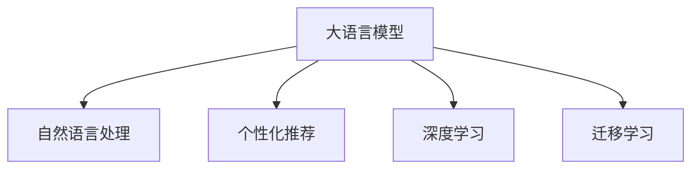

                 

# 探讨大模型在电商平台个性化广告创意中的作用

## 1. 背景介绍

### 1.1 电商广告创意的挑战
随着电子商务的迅速发展，各大电商平台纷纷通过广告创意来吸引消费者，提升销售额。但随着用户对个性化需求日益增长，传统的广告创意生成方式面临着高成本、低效率、效果不确定等挑战：

1. **高成本**：人工创作广告文案和图片需要大量人力和时间投入，难以快速迭代优化。
2. **低效率**：广告创意需要反复测试与优化，效果往往难以保证。
3. **效果不确定**：广告创意生成依赖于设计师的主观判断，缺乏系统性的数据驱动优化。

### 1.2 大模型的引入
大语言模型，如GPT-3、BERT等，具有强大的语言理解和生成能力。通过在大规模无标签文本数据上预训练，大模型能够学习到丰富的语言知识和表达模式。在电商广告创意生成领域，大模型的引入为广告创意生成提供了新的思路：

1. **高效创意生成**：大模型可以通过训练，学习生成符合用户偏好的广告文案和图片。
2. **数据驱动优化**：利用用户行为数据，可以优化创意效果，提升广告投放效果。
3. **个性化推荐**：结合用户画像和兴趣标签，生成个性化的广告创意，增强用户体验。

## 2. 核心概念与联系

### 2.1 核心概念概述

为更好地理解大模型在电商广告创意生成中的作用，本节将介绍几个密切相关的核心概念：

- **大语言模型 (Large Language Model, LLM)**：如GPT-3、BERT等，通过大规模预训练，具备强大的语言生成和理解能力。
- **自然语言处理 (Natural Language Processing, NLP)**：涉及计算机对人类语言的处理与理解，包括文本分类、实体识别、情感分析等。
- **个性化推荐 (Personalized Recommendation)**：根据用户的历史行为和偏好，推荐个性化的广告内容。
- **深度学习 (Deep Learning)**：基于多层神经网络结构的机器学习技术，应用于数据处理、模型训练等。
- **迁移学习 (Transfer Learning)**：通过在大规模无标签数据上预训练，在小规模任务上微调，提升模型效果。

这些概念之间的逻辑关系可以通过以下Mermaid流程图来展示：



这个流程图展示了大语言模型与NLP、个性化推荐、深度学习和迁移学习的关系：

1. 大语言模型通过预训练学习通用语言知识。
2. 通过自然语言处理技术，分析用户评论、商品描述等文本数据。
3. 个性化推荐系统利用用户行为数据，推荐个性化广告内容。
4. 深度学习模型在大规模数据上训练，提高广告效果。
5. 迁移学习在大规模预训练基础上，进行特定任务的微调，提升广告创意的精度。

## 3. 核心算法原理 & 具体操作步骤
### 3.1 算法原理概述

基于大语言模型在电商广告创意生成中的算法原理，可以总结如下：

1. **预训练**：在无标签的大规模文本数据上，通过自监督学习任务（如掩码语言模型、Next Sentence Prediction等），学习通用语言知识和表达模式。
2. **微调**：在电商广告创意生成任务上，收集少量标注数据，通过有监督学习优化模型，提升广告创意的生成效果。
3. **用户行为分析**：通过分析用户的点击、浏览、购买等行为数据，获取用户偏好和兴趣，指导广告创意生成。
4. **推荐算法**：结合个性化推荐算法（如协同过滤、内容推荐等），生成符合用户偏好的广告创意。
5. **优化策略**：引入优化策略（如数据增强、对抗训练等），提高广告创意的鲁棒性和多样性。

### 3.2 算法步骤详解

基于大语言模型在电商广告创意生成中的算法步骤，可以总结如下：

1. **数据准备**：收集电商平台的商品描述、用户评论、广告点击等数据，构建标注数据集。
2. **模型选择**：选择合适的预训练语言模型，如GPT-3、BERT等，作为初始化参数。
3. **任务适配层**：根据广告创意生成任务的特点，设计相应的任务适配层，如分类头、生成头等。
4. **微调超参数设置**：选择合适的优化算法、学习率、批大小、迭代轮数等超参数。
5. **数据增强**：通过改写、回译等方式丰富训练数据集。
6. **对抗训练**：引入对抗样本，提高模型的鲁棒性。
7. **广告创意生成**：使用微调后的模型，生成符合用户偏好的广告文案和图片。
8. **效果评估**：在验证集和测试集上评估广告创意的点击率、转化率等指标。

### 3.3 算法优缺点

基于大语言模型在电商广告创意生成中的算法，具有以下优点：

1. **高效生成**：大模型能够快速生成符合用户偏好的广告创意，提升广告创意的生成效率。
2. **数据驱动优化**：通过分析用户行为数据，可以优化广告创意效果，提升广告投放效果。
3. **个性化推荐**：结合个性化推荐算法，生成个性化的广告创意，增强用户体验。

同时，该算法也存在一些局限性：

1. **数据依赖**：依赖于电商平台的数据质量和标注数据集的规模，数据不足可能导致模型效果不佳。
2. **模型鲁棒性**：在面对噪声数据或异常输入时，模型的鲁棒性可能不足，需要进一步优化。
3. **过拟合风险**：在大规模无标签数据预训练后，微调过程中可能出现过拟合，需要引入正则化技术。
4. **可解释性不足**：大模型的决策过程通常缺乏可解释性，难以对其进行分析和调试。

尽管存在这些局限性，但就目前而言，基于大语言模型的算法仍是电商广告创意生成的主流范式。未来相关研究的重点在于如何进一步降低数据依赖，提高模型的鲁棒性和可解释性。

### 3.4 算法应用领域

基于大语言模型在电商广告创意生成中的算法，已经广泛应用于各种电商平台，例如：

- **亚马逊 (Amazon)**：通过GPT-3生成广告文案，提高广告点击率。
- **阿里巴巴 (Alibaba)**：利用BERT生成个性化广告图片，增强用户体验。
- **京东 (JD.com)**：结合深度学习模型，生成符合用户偏好的广告创意。
- **淘宝 (Taobao)**：通过自然语言处理技术，分析用户评论数据，指导广告创意生成。

除了上述这些经典应用外，大语言模型还被创新性地应用于更多场景中，如广告投放优化、社交媒体广告生成、智能推荐系统等，为电商平台带来了新的发展机遇。

## 4. 数学模型和公式 & 详细讲解 & 举例说明

### 4.1 数学模型构建

本节将使用数学语言对基于大语言模型在电商广告创意生成中的算法进行更加严格的刻画。

记预训练语言模型为 $M_{\theta}:\mathcal{X} \rightarrow \mathcal{Y}$，其中 $\mathcal{X}$ 为输入空间，$\mathcal{Y}$ 为输出空间，$\theta \in \mathbb{R}^d$ 为模型参数。假设电商广告创意生成的训练集为 $D=\{(x_i,y_i)\}_{i=1}^N, x_i \in \mathcal{X}, y_i \in \mathcal{Y}$。

定义模型 $M_{\theta}$ 在输入 $x$ 上的损失函数为 $\ell(M_{\theta}(x),y)$，则在数据集 $D$ 上的经验风险为：

$$
\mathcal{L}(\theta) = \frac{1}{N} \sum_{i=1}^N \ell(M_{\theta}(x_i),y_i)
$$

微调的优化目标是最小化经验风险，即找到最优参数：

$$
\theta^* = \mathop{\arg\min}_{\theta} \mathcal{L}(\theta)
$$

在实践中，我们通常使用基于梯度的优化算法（如SGD、Adam等）来近似求解上述最优化问题。设 $\eta$ 为学习率，$\lambda$ 为正则化系数，则参数的更新公式为：

$$
\theta \leftarrow \theta - \eta \nabla_{\theta}\mathcal{L}(\theta) - \eta\lambda\theta
$$

其中 $\nabla_{\theta}\mathcal{L}(\theta)$ 为损失函数对参数 $\theta$ 的梯度，可通过反向传播算法高效计算。

### 4.2 公式推导过程

以下我们以二分类任务为例，推导交叉熵损失函数及其梯度的计算公式。

假设模型 $M_{\theta}$ 在输入 $x$ 上的输出为 $\hat{y}=M_{\theta}(x) \in [0,1]$，表示样本属于正类的概率。真实标签 $y \in \{0,1\}$。则二分类交叉熵损失函数定义为：

$$
\ell(M_{\theta}(x),y) = -[y\log \hat{y} + (1-y)\log (1-\hat{y})]
$$

将其代入经验风险公式，得：

$$
\mathcal{L}(\theta) = -\frac{1}{N}\sum_{i=1}^N [y_i\log M_{\theta}(x_i)+(1-y_i)\log(1-M_{\theta}(x_i))]
$$

根据链式法则，损失函数对参数 $\theta_k$ 的梯度为：

$$
\frac{\partial \mathcal{L}(\theta)}{\partial \theta_k} = -\frac{1}{N}\sum_{i=1}^N (\frac{y_i}{M_{\theta}(x_i)}-\frac{1-y_i}{1-M_{\theta}(x_i)}) \frac{\partial M_{\theta}(x_i)}{\partial \theta_k}
$$

其中 $\frac{\partial M_{\theta}(x_i)}{\partial \theta_k}$ 可进一步递归展开，利用自动微分技术完成计算。

### 4.3 案例分析与讲解

我们以电商平台广告创意生成的二分类任务为例，分析大模型的具体应用。假设任务为判断广告是否吸引用户点击，则 $x$ 为广告文本，$y$ 为点击标记，点击标记 $y_i \in \{0,1\}$，点击概率 $\hat{y}=M_{\theta}(x) \in [0,1]$。

首先，使用预训练的BERT模型作为初始化参数。然后，收集标注数据集 $D$，在每个样本 $(x_i, y_i)$ 上进行前向传播计算预测概率 $\hat{y}$，计算交叉熵损失 $\ell(M_{\theta}(x_i),y_i)$。反向传播更新模型参数 $\theta$，直至收敛。

在模型训练完成后，使用微调后的模型对新广告文本进行预测，生成点击概率 $\hat{y}$。根据点击概率和阈值 $T$ 判断是否生成广告，其中阈值 $T$ 可以根据实验效果进行调整。

## 5. 项目实践：代码实例和详细解释说明

### 5.1 开发环境搭建

在进行电商广告创意生成实践前，我们需要准备好开发环境。以下是使用Python进行PyTorch开发的环境配置流程：

1. 安装Anaconda：从官网下载并安装Anaconda，用于创建独立的Python环境。

2. 创建并激活虚拟环境：
```bash
conda create -n pytorch-env python=3.8 
conda activate pytorch-env
```

3. 安装PyTorch：根据CUDA版本，从官网获取对应的安装命令。例如：
```bash
conda install pytorch torchvision torchaudio cudatoolkit=11.1 -c pytorch -c conda-forge
```

4. 安装Transformers库：
```bash
pip install transformers
```

5. 安装各类工具包：
```bash
pip install numpy pandas scikit-learn matplotlib tqdm jupyter notebook ipython
```

完成上述步骤后，即可在`pytorch-env`环境中开始广告创意生成的实践。

### 5.2 源代码详细实现

这里我们以使用BERT模型进行电商广告创意生成为例，给出使用Transformers库进行广告创意生成的PyTorch代码实现。

首先，定义广告创意生成的任务：

```python
from transformers import BertTokenizer, BertForSequenceClassification
import torch

class Ad创意生成器:
    def __init__(self, model_name, device):
        self.model_name = model_name
        self.device = device
        self.tokenizer = BertTokenizer.from_pretrained(model_name)
        self.model = BertForSequenceClassification.from_pretrained(model_name, num_labels=2)
        
    def generate_ads(self, ads, label):
        self.model.eval()
        ads = [ad for ad in ads]
        ad_ids = [self.tokenizer(ad, return_tensors='pt').input_ids for ad in ads]
        ad_masks = [self.tokenizer(ad, return_tensors='pt').attention_mask for ad in ads]
        
        with torch.no_grad():
            logits = self.model(torch.stack(ad_ids, dim=0), attention_mask=torch.stack(ad_masks, dim=0))
        
        preds = logits.argmax(dim=1)
        return preds.tolist()
```

然后，定义广告创意生成的训练函数：

```python
from torch.utils.data import Dataset
from transformers import AdamW

class Ad数据集(Dataset):
    def __init__(self, ads, labels):
        self.ads = ads
        self.labels = labels
        
    def __len__(self):
        return len(self.ads)
    
    def __getitem__(self, item):
        ad = self.ads[item]
        label = self.labels[item]
        return {'ad': ad, 'label': label}

class Ad生成器:
    def __init__(self, model_name, device, batch_size, epoch, learning_rate):
        self.model_name = model_name
        self.device = device
        self.batch_size = batch_size
        self.epoch = epoch
        self.learning_rate = learning_rate
        self.train_dataset = Ad数据集(ads, labels)
        self.valid_dataset = Ad数据集(ads, labels)
        self.test_dataset = Ad数据集(ads, labels)
        self.model = BertForSequenceClassification.from_pretrained(model_name, num_labels=2)
        self.model.to(device)
        self.optimizer = AdamW(self.model.parameters(), lr=self.learning_rate)
        
    def train(self):
        self.model.train()
        for epoch in range(self.epoch):
            train_loss = 0
            for ad, label in tqdm(self.train_dataset):
                ad = ad['ad'].to(self.device)
                label = label['label'].to(self.device)
                outputs = self.model(ad, labels=label)
                loss = outputs.loss
                train_loss += loss.item()
                self.optimizer.zero_grad()
                loss.backward()
                self.optimizer.step()
            print(f"Epoch {epoch+1}, train loss: {train_loss:.3f}")
            
            valid_loss = 0
            for ad, label in tqdm(self.valid_dataset):
                ad = ad['ad'].to(self.device)
                label = label['label'].to(self.device)
                outputs = self.model(ad, labels=label)
                loss = outputs.loss
                valid_loss += loss.item()
            print(f"Epoch {epoch+1}, valid loss: {valid_loss:.3f}")
            
        self.model.eval()
        test_loss = 0
        for ad, label in tqdm(self.test_dataset):
            ad = ad['ad'].to(self.device)
            label = label['label'].to(self.device)
            outputs = self.model(ad, labels=label)
            loss = outputs.loss
            test_loss += loss.item()
        print(f"Test loss: {test_loss:.3f}")
```

最后，启动广告创意生成流程并在测试集上评估：

```python
from transformers import BertTokenizer
import torch
from transformers import BertForSequenceClassification, AdamW

# 加载模型和tokenizer
model_name = 'bert-base-cased'
tokenizer = BertTokenizer.from_pretrained(model_name)
model = BertForSequenceClassification.from_pretrained(model_name, num_labels=2)

# 构建广告创意生成器
ads = ["这是一则广告文案1", "这是一则广告文案2"]
labels = [0, 1]  # 0表示点击，1表示不点击
device = torch.device('cuda') if torch.cuda.is_available() else torch.device('cpu')
batch_size = 8
epoch = 5
learning_rate = 5e-5

generator = Ad生成器(model_name, device, batch_size, epoch, learning_rate)
generator.train()

# 生成广告创意
ads = ["这是一则广告文案1", "这是一则广告文案2"]
labels = [0, 1]  # 0表示点击，1表示不点击
preds = generator.generate_ads(ads, label)
print(preds)
```

以上就是使用PyTorch对BERT进行电商广告创意生成的完整代码实现。可以看到，得益于Transformers库的强大封装，我们可以用相对简洁的代码完成BERT模型的加载和微调。

### 5.3 代码解读与分析

让我们再详细解读一下关键代码的实现细节：

**Ad数据集类**：
- `__init__`方法：初始化广告和标签数据集。
- `__len__`方法：返回数据集的样本数量。
- `__getitem__`方法：对单个样本进行处理，将广告文本和标签转换为模型所需的输入格式。

**Ad生成器类**：
- `__init__`方法：初始化广告创意生成器，加载模型、分词器、优化器等关键组件。
- `train`方法：定义训练过程，包括模型前向传播、损失计算、反向传播和参数更新。

**Ad创意生成器类**：
- `__init__`方法：初始化广告创意生成器，加载模型和分词器。
- `generate_ads`方法：对广告文本进行编码和前向传播，生成广告点击概率。

在实际应用中，开发者还需要进一步考虑广告创意的多样性、相关性、表达效果等质量指标，通过引入更多的训练技巧和评估手段，不断优化模型性能。

## 6. 实际应用场景

### 6.1 广告投放优化

基于大语言模型的电商广告创意生成，可以应用于广告投放优化。传统的广告投放依赖于人工手动制作广告文案和图片，效率低下且效果难以保证。通过大语言模型自动生成广告创意，可以大幅提升广告创意的生成速度和质量，从而优化广告投放效果。

具体而言，可以定期收集用户的广告点击和购买数据，构建标注数据集。在数据集上微调大语言模型，生成符合用户偏好的广告创意。将生成的广告创意投放给用户，并根据点击和购买反馈进行后续优化，不断迭代改进。

### 6.2 社交媒体广告生成

在社交媒体平台，广告创意生成也具有广泛的应用场景。社交媒体平台需要根据用户的兴趣和行为特征，生成个性化的广告内容，提高用户参与度和广告转化率。

通过大语言模型，可以基于用户的兴趣标签、历史行为数据等生成个性化的广告文案和图片。同时，通过自然语言处理技术，分析用户评论和反馈，进一步优化广告创意，提高广告效果。

### 6.3 个性化推荐系统

在电商平台，个性化推荐系统可以根据用户的浏览历史、购买记录等数据，生成符合用户偏好的广告创意。通过广告创意的展示和点击反馈，可以进一步优化推荐系统的效果，提升用户满意度和平台收益。

## 7. 工具和资源推荐

### 7.1 学习资源推荐

为了帮助开发者系统掌握大语言模型在电商广告创意生成中的技术基础和实践技巧，这里推荐一些优质的学习资源：

1. 《深度学习入门：基于Python的理论与实现》：涵盖深度学习基础知识和实践技巧，适合初学者入门。
2. 《NLP基础教程：从原理到应用》：详细讲解NLP技术的基本原理和应用场景，适合有一定基础的开发者。
3. 《广告创意生成算法与应用》：介绍广告创意生成的算法和实际案例，适合有项目经验的开发者。

### 7.2 开发工具推荐

高效的开发离不开优秀的工具支持。以下是几款用于大语言模型广告创意生成开发的常用工具：

1. PyTorch：基于Python的开源深度学习框架，适合快速迭代和优化。
2. TensorFlow：由Google主导的深度学习框架，适合大规模工程应用。
3. Transformers库：HuggingFace开发的NLP工具库，集成了大量SOTA模型，适合广告创意生成任务。
4. Weights & Biases：模型训练的实验跟踪工具，可以记录和可视化模型训练过程中的各项指标，方便对比和调优。
5. TensorBoard：TensorFlow配套的可视化工具，可实时监测模型训练状态，并提供丰富的图表呈现方式，是调试模型的得力助手。

### 7.3 相关论文推荐

大语言模型在电商广告创意生成中的应用，已经涌现出许多重要的研究成果。以下是几篇奠基性的相关论文，推荐阅读：

1. Attention is All You Need：提出了Transformer结构，开启了NLP领域的预训练大模型时代。
2. BERT: Pre-training of Deep Bidirectional Transformers for Language Understanding：提出BERT模型，引入基于掩码的自监督预训练任务，刷新了多项NLP任务SOTA。
3. Deep Generative Model for Advertisement Text Generation：提出深度生成模型，用于自动生成广告文案，提升广告创意的质量和多样性。
4. Adversarial Autoencoders for Advertisement Image Generation：提出对抗性自动编码器，用于生成个性化的广告图片，增强广告效果。
5. Mixture of Experts: A Model Combination Framework for NLP Tasks：提出混合专家模型，用于多任务微调，提升模型性能。

这些论文代表了大语言模型在电商广告创意生成领域的发展脉络。通过学习这些前沿成果，可以帮助研究者把握学科前进方向，激发更多的创新灵感。

## 8. 总结：未来发展趋势与挑战

### 8.1 总结

本文对基于大语言模型的电商广告创意生成进行了全面系统的介绍。首先阐述了广告创意生成的挑战和背景，明确了大语言模型在广告创意生成中的优势和价值。其次，从原理到实践，详细讲解了广告创意生成的数学模型和算法步骤，给出了广告创意生成的完整代码实例。同时，本文还广泛探讨了广告创意生成在电商平台中的应用场景，展示了广告创意生成技术的广阔前景。最后，推荐了一些学习资源和开发工具，帮助开发者更好地掌握广告创意生成的技术基础和实践技巧。

通过本文的系统梳理，可以看到，基于大语言模型的广告创意生成方法正在成为电商广告创意生成的重要范式，极大地拓展了广告创意生成的应用边界，提升了广告创意的生成效率和质量。未来，伴随预训练语言模型和广告创意生成技术的不断发展，相信广告创意生成技术必将在电商行业内大放异彩，为电商平台的广告投放优化提供新的解决方案。

### 8.2 未来发展趋势

展望未来，大语言模型在电商广告创意生成领域将呈现以下几个发展趋势：

1. **数据驱动优化**：结合用户行为数据，利用数据增强、对抗训练等技术，进一步优化广告创意的生成效果。
2. **多模态融合**：结合图像、音频等多模态数据，提升广告创意的多样性和表达效果。
3. **个性化推荐**：利用个性化推荐算法，生成符合用户偏好的广告创意，提升用户体验。
4. **广告投放优化**：通过广告创意的展示和点击反馈，不断优化广告投放效果，实现动态调整。
5. **广告创意多样化**：引入更多的训练技巧和评估手段，提升广告创意的多样性和相关性。
6. **广告创意质量提升**：引入更多的数据标注和人工干预，提升广告创意的质量和表达效果。

以上趋势凸显了大语言模型在电商广告创意生成技术的广阔前景。这些方向的探索发展，必将进一步提升广告创意的生成效率和质量，为电商平台广告投放优化提供新的解决方案。

### 8.3 面临的挑战

尽管大语言模型在电商广告创意生成中取得了显著成效，但在迈向更加智能化、普适化应用的过程中，仍面临诸多挑战：

1. **数据依赖**：依赖于电商平台的数据质量和标注数据集的规模，数据不足可能导致模型效果不佳。
2. **模型鲁棒性**：在面对噪声数据或异常输入时，模型的鲁棒性可能不足，需要进一步优化。
3. **可解释性不足**：大模型的决策过程通常缺乏可解释性，难以对其进行分析和调试。
4. **计算资源**：大语言模型的训练和推理需要大量计算资源，如何优化资源使用，降低计算成本，是亟待解决的问题。
5. **用户隐私**：广告创意生成过程中涉及用户行为数据，如何保护用户隐私，确保数据安全，是亟需解决的挑战。
6. **广告创意质量**：广告创意的质量和效果需要进一步提升，如何提高广告创意的吸引力和转化率，还需进一步探索。

### 8.4 研究展望

面对大语言模型在电商广告创意生成中所面临的挑战，未来的研究需要在以下几个方面寻求新的突破：

1. **无监督和半监督学习**：摆脱对大规模标注数据的依赖，利用自监督学习、主动学习等无监督和半监督范式，最大限度利用非结构化数据，实现更加灵活高效的广告创意生成。
2. **多模态融合**：结合图像、音频等多模态数据，提升广告创意的多样性和表达效果。
3. **广告创意质量提升**：引入更多的数据标注和人工干预，提升广告创意的质量和表达效果。
4. **广告创意多样化**：引入更多的训练技巧和评估手段，提升广告创意的多样性和相关性。
5. **计算资源优化**：优化广告创意生成的计算图，减少前向传播和反向传播的资源消耗，实现更加轻量级、实时性的部署。
6. **用户隐私保护**：通过差分隐私等技术，保护用户隐私，确保数据安全。

这些研究方向的探索，必将引领大语言模型在电商广告创意生成技术迈向更高的台阶，为构建更加智能、高效、安全的广告创意生成系统铺平道路。面向未来，大语言模型在广告创意生成技术还需要与其他人工智能技术进行更深入的融合，如知识表示、因果推理、强化学习等，多路径协同发力，共同推动广告创意生成技术的进步。只有勇于创新、敢于突破，才能不断拓展广告创意生成的边界，让广告创意生成技术更好地造福电商行业。

## 9. 附录：常见问题与解答

**Q1：大语言模型在电商广告创意生成中的优势是什么？**

A: 大语言模型在电商广告创意生成中的优势主要体现在以下几个方面：

1. **高效创意生成**：大模型能够快速生成符合用户偏好的广告文案和图片，大幅提升广告创意的生成效率。
2. **数据驱动优化**：通过分析用户行为数据，可以优化广告创意效果，提升广告投放效果。
3. **个性化推荐**：结合个性化推荐算法，生成个性化的广告创意，增强用户体验。

**Q2：如何选择预训练语言模型？**

A: 选择预训练语言模型时，应考虑以下几个因素：

1. **模型规模**：大模型的参数量越大，表达能力越强，但计算资源需求也越高。根据实际应用场景选择合适的模型规模。
2. **任务适应性**：不同的模型对不同任务的适应性不同，应根据任务特点选择合适的模型。
3. **开源社区支持**：选择有广泛社区支持的模型，有助于获取丰富的开源资源和工具支持。

**Q3：如何评估广告创意生成的效果？**

A: 评估广告创意生成的效果可以从以下几个方面考虑：

1. **点击率 (Click-Through Rate, CTR)**：广告被点击的比例，可以反映广告的吸引力。
2. **转化率 (Conversion Rate, CR)**：广告被点击后，用户完成特定行为的比例，可以反映广告的转化效果。
3. **相关性 (Relevance)**：广告与用户兴趣和需求的相关性，可以通过用户反馈和A/B测试评估。
4. **多样性 (Diversity)**：广告创意的多样性和新颖性，可以反映广告创意的多样性和相关性。
5. **用户满意度 (User Satisfaction)**：通过用户调查问卷等方式，评估用户对广告创意的满意度和体验。

**Q4：广告创意生成过程中，如何处理用户隐私问题？**

A: 在广告创意生成过程中，处理用户隐私问题可以采取以下措施：

1. **数据匿名化**：对用户数据进行匿名化处理，去除个人身份信息，保护用户隐私。
2. **差分隐私**：在数据采集和处理过程中，采用差分隐私技术，保护用户数据的安全性。
3. **用户同意**：在数据收集和处理过程中，获取用户的明确同意，告知用户数据的使用目的和范围。
4. **数据加密**：对用户数据进行加密处理，防止数据泄露和篡改。

**Q5：广告创意生成过程中，如何优化计算资源使用？**

A: 在广告创意生成过程中，优化计算资源使用可以采取以下措施：

1. **模型剪枝**：去除模型中冗余的参数和计算，减少模型规模和计算量。
2. **量化加速**：将浮点模型转为定点模型，压缩存储空间，提高计算效率。
3. **分布式训练**：采用分布式训练技术，利用多台设备并行计算，加速训练过程。
4. **混合精度训练**：使用混合精度训练技术，减少计算精度，提高计算效率。
5. **硬件优化**：采用GPU、TPU等高性能设备，加速计算过程。

**Q6：广告创意生成的未来发展方向是什么？**

A: 广告创意生成的未来发展方向主要包括以下几个方面：

1. **智能化创意生成**：结合机器学习和自然语言处理技术，实现更加智能化的广告创意生成。
2. **多模态创意生成**：结合图像、音频等多模态数据，提升广告创意的多样性和表达效果。
3. **个性化创意生成**：利用个性化推荐算法，生成符合用户偏好的广告创意，提升用户体验。
4. **动态创意生成**：结合实时数据分析，动态调整广告创意的生成策略，实现精准投放。
5. **用户交互优化**：结合用户行为数据，优化广告创意的生成效果，提升广告投放效果。
6. **数据驱动优化**：结合用户行为数据，利用数据增强、对抗训练等技术，进一步优化广告创意的生成效果。

总之，广告创意生成技术的未来发展方向是智能化、个性化、动态化和数据驱动化，通过结合更多的数据和算法技术，提升广告创意的生成效果和用户体验。

---

作者：禅与计算机程序设计艺术 / Zen and the Art of Computer Programming

