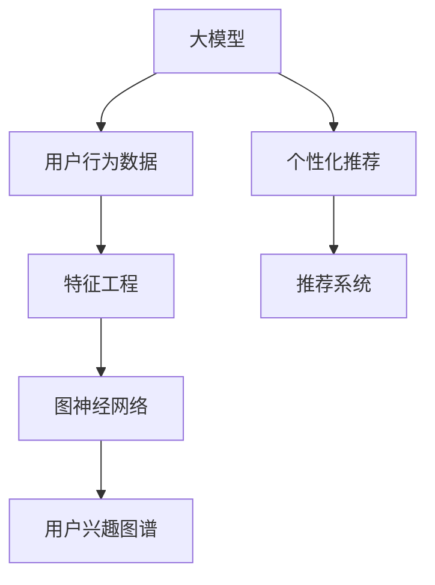

                 

# 探讨大模型在电商平台用户兴趣图谱构建中的潜力

> 关键词：大模型,电商平台,用户兴趣,图谱构建,个性化推荐,深度学习,机器学习,自然语言处理

## 1. 背景介绍

### 1.1 问题由来

随着电子商务平台的快速发展，用户行为和交易数据日益增多。电商平台希望通过深入挖掘用户兴趣，为用户提供更加精准、个性化的商品推荐，提升用户体验和转化率。用户兴趣图谱（User Interest Graph）是一种基于用户行为数据构建的兴趣模型，能够揭示用户间的兴趣关系，以及兴趣随时间动态变化的规律。

构建用户兴趣图谱需要处理海量用户数据，挖掘隐含的兴趣点，并将其表示为图形结构。传统的图谱构建方法通常基于统计学或规则系统，难以兼顾数据的多样性和复杂性，且计算复杂度高。近年来，大模型在自然语言处理（NLP）、图像识别等领域取得了显著进展，其在处理大规模数据和复杂结构方面具有独特的优势，为构建用户兴趣图谱提供了新的思路。

### 1.2 问题核心关键点

用户兴趣图谱的构建涉及数据预处理、特征工程、图模型训练等多个环节。如何高效地处理用户行为数据，挖掘出用户的潜在兴趣点，并将其构建为高精度的图形结构，是大模型在电商平台应用的关键挑战。

具体来说，大模型在构建用户兴趣图谱时，需要：
- 自动学习用户行为中的语义信息，从而挖掘出隐含的兴趣点。
- 将兴趣点表示为图形结构，利用图神经网络（Graph Neural Network, GNN）进行训练和推理。
- 结合用户的交互行为和商品属性，构建出高精度的用户兴趣图谱。
- 实时更新用户兴趣图谱，反映用户兴趣的动态变化。

## 2. 核心概念与联系

### 2.1 核心概念概述

为更好地理解大模型在电商平台用户兴趣图谱构建中的应用，本节将介绍几个密切相关的核心概念：

- **大模型(Large Model)**：以深度学习架构（如Transformer、ResNet等）为基础，经过海量数据预训练的大规模模型。大模型通常包含数亿甚至数十亿参数，具有强大的特征提取和模式识别能力。

- **用户兴趣图谱(User Interest Graph)**：一种基于图结构的模型，用于表示用户间兴趣的相似度和动态变化。用户兴趣图谱将用户和兴趣点表示为图中的节点，兴趣关系表示为边，能够揭示用户间的兴趣关联和兴趣转移。

- **图神经网络(Graph Neural Network, GNN)**：一种特殊的神经网络架构，用于处理图结构数据。GNN能够自动学习图结构中的隐含关系，从而进行高效的特征传递和信息融合。

- **深度学习(Deep Learning)**：一种基于神经网络的机器学习方法，通过多层非线性变换，从数据中提取高级特征。深度学习在图像识别、自然语言处理等领域具有广泛应用。

- **特征工程(Feature Engineering)**：从原始数据中提取有用特征，以提高模型的性能。特征工程在数据挖掘和机器学习中至关重要。

- **推荐系统(Recommendation System)**：一种信息过滤系统，通过分析用户行为和商品属性，为用户推荐合适的商品或内容。推荐系统是电商平台用户兴趣图谱的重要应用场景之一。

这些核心概念之间的逻辑关系可以通过以下Mermaid流程图来展示：



这个流程图展示了大模型在电商平台用户兴趣图谱构建中的应用框架：

1. 大模型从用户行为数据中提取高层次语义特征。
2. 特征工程将这些特征转化为可供图神经网络处理的图结构数据。
3. 图神经网络自动学习图结构中的隐含关系，构建用户兴趣图谱。
4. 用户兴趣图谱应用于个性化推荐系统，提升推荐效果。

## 3. 核心算法原理 & 具体操作步骤
### 3.1 算法原理概述

基于大模型的用户兴趣图谱构建，本质上是一种深度学习和图结构结合的特征工程方法。其核心思想是：将用户行为数据映射为图形结构，利用大模型的强大特征提取能力，自动学习图结构中的隐含关系，从而构建出高精度的用户兴趣图谱。

具体来说，该算法流程如下：
1. 收集电商平台用户的交互数据（如浏览、点击、购买等行为）。
2. 对用户行为数据进行预处理，提取高层次语义特征。
3. 构建用户兴趣图谱，将用户和兴趣点表示为图节点，兴趣关系表示为图边。
4. 利用大模型对图结构进行特征提取和关系学习。
5. 应用图神经网络对用户兴趣图谱进行训练和推理。
6. 利用训练好的用户兴趣图谱进行个性化推荐。

### 3.2 算法步骤详解

基于大模型的用户兴趣图谱构建，可以按照以下步骤进行：

**Step 1: 数据收集与预处理**
- 收集电商平台的用户行为数据，包括浏览记录、购买记录、搜索记录等。
- 对数据进行清洗，去除噪声和异常值，提取用户行为中的语义信息。
- 将用户行为数据映射为图形结构，每个用户节点表示为一个节点，用户间的兴趣关系表示为图边。

**Step 2: 特征提取与表示**
- 使用大模型对用户行为数据进行语义特征提取，得到高层次的向量表示。
- 将用户的向量表示作为图节点的特征，构建用户兴趣图谱的节点属性。
- 利用大模型的向量表示，捕捉用户间的兴趣关系，作为图边的特征。

**Step 3: 图模型训练**
- 使用图神经网络对用户兴趣图谱进行训练，学习节点和边之间的关系。
- 在训练过程中，利用大模型提取的特征，优化图神经网络的参数，使得图谱预测准确率更高。

**Step 4: 图谱应用与推荐**
- 利用训练好的用户兴趣图谱，对用户进行个性化推荐。
- 根据用户兴趣图谱中的关系，发现和推荐相似兴趣的商品或内容。

**Step 5: 图谱更新与维护**
- 定期更新用户兴趣图谱，反映用户兴趣的变化。
- 对新增的交互数据进行预处理和特征提取，更新图谱的节点和边。

### 3.3 算法优缺点

基于大模型的用户兴趣图谱构建方法具有以下优点：
1. 自动学习语义特征。大模型能够自动捕捉用户行为数据中的语义信息，无需人工设计复杂的特征工程。
2. 高效处理图结构。大模型的强大特征提取能力，使得处理复杂的图结构数据更加高效。
3. 高精度模型。利用大模型和图神经网络结合，可以构建高精度的用户兴趣图谱，提升推荐系统的效果。

同时，该方法也存在一些缺点：
1. 数据需求大。构建用户兴趣图谱需要大量用户行为数据，数据收集和预处理成本较高。
2. 计算资源消耗高。大模型的参数量庞大，训练和推理需要大量的计算资源。
3. 难以解释。大模型和图神经网络结合的模型较为复杂，难以解释其内部工作机制。
4. 泛化能力有限。不同电商平台的用户行为数据分布差异较大，需要针对性地构建模型。

### 3.4 算法应用领域

基于大模型的用户兴趣图谱构建方法，在电商平台具有广泛的应用前景：

- **个性化推荐**：通过构建用户兴趣图谱，对用户进行个性化推荐，提升用户体验和转化率。
- **用户画像**：利用用户兴趣图谱，分析用户行为，构建用户画像，实现更精准的营销。
- **风险控制**：通过用户兴趣图谱，识别潜在的高风险用户，提升平台安全性。
- **内容推荐**：在内容分发平台，构建用户兴趣图谱，推荐用户感兴趣的内容，提高内容传播效率。
- **广告投放**：通过分析用户兴趣图谱，精准投放广告，提升广告投放效果。

## 4. 数学模型和公式 & 详细讲解 & 举例说明（备注：数学公式请使用latex格式，latex嵌入文中独立段落使用 $$，段落内使用 $)
### 4.1 数学模型构建

构建用户兴趣图谱需要设计合适的数学模型，将用户行为数据映射为图形结构，并利用大模型提取特征，优化图神经网络参数。

假设用户行为数据为 $D=\{x_i\}_{i=1}^N$，其中 $x_i=(x_{i,1},x_{i,2},...,x_{i,k})$，表示用户 $i$ 的 $k$ 个行为数据。每个行为数据 $x_{i,j}$ 包含商品ID、时间戳等属性。

构建用户兴趣图谱时，每个用户 $i$ 表示为一个节点，每个行为数据 $x_{i,j}$ 表示为该用户的一个兴趣点。如果用户 $i$ 对商品 $j$ 进行了浏览、点击或购买，则建立从用户 $i$ 到商品 $j$ 的一条有向边 $(i,j)$。

图神经网络（GNN）通常采用Graph Convolutional Network（GCN）等架构，用于处理图结构数据。GCN的计算公式为：

$$
\mathbf{X}^{(l+1)} = \mathbf{X}^{(l)} + \mathbf{D}^{-\frac{1}{2}}\mathbf{A}\mathbf{X}^{(l)}\mathbf{W}^{(l)}
$$

其中，$\mathbf{X}^{(l)}$ 为节点在 $l$ 层的表示，$\mathbf{A}$ 为邻接矩阵，$\mathbf{D}$ 为邻接矩阵的度数矩阵，$\mathbf{W}^{(l)}$ 为可学习参数。

### 4.2 公式推导过程

以下我们以用户兴趣图谱的GCN模型为例，推导其计算公式。

假设用户行为数据 $D=\{x_i\}_{i=1}^N$，每个行为数据 $x_{i,j}$ 表示为节点 $i$ 的兴趣点。用户 $i$ 对商品 $j$ 的兴趣表示为边 $(i,j)$。

构建用户兴趣图谱时，将用户 $i$ 表示为节点 $v_i$，其特征向量为 $\mathbf{X}_i$。每个兴趣点 $x_{i,j}$ 表示为节点 $v_j$，其特征向量为 $\mathbf{X}_j$。邻接矩阵 $\mathbf{A}$ 表示为：

$$
\mathbf{A} = \begin{bmatrix}
0 & 1 & 1 & \cdots \\
0 & 0 & 1 & \cdots \\
0 & 0 & 0 & \cdots \\
\vdots & \vdots & \vdots & \ddots \\
\end{bmatrix}
$$

计算节点 $v_i$ 的 $l$ 层表示 $\mathbf{X}^{(l)}_i$：

$$
\mathbf{X}^{(0)}_i = \mathbf{X}_i
$$

$$
\mathbf{X}^{(l+1)}_i = \mathbf{X}^{(l)}_i + \mathbf{D}^{-\frac{1}{2}}\mathbf{A}\mathbf{X}^{(l)}_i\mathbf{W}^{(l)}
$$

其中，$\mathbf{W}^{(l)}$ 为可学习参数。

节点 $v_j$ 的 $l$ 层表示 $\mathbf{X}^{(l)}_j$：

$$
\mathbf{X}^{(0)}_j = \mathbf{X}_j
$$

$$
\mathbf{X}^{(l+1)}_j = \mathbf{X}^{(l)}_j + \mathbf{D}^{-\frac{1}{2}}\mathbf{A}\mathbf{X}^{(l)}_j\mathbf{W}^{(l)}
$$

节点 $v_i$ 与 $v_j$ 之间的关系表示为：

$$
\mathbf{Z}^{(l+1)}_{i,j} = \mathbf{X}^{(l)}_i \odot \mathbf{X}^{(l)}_j
$$

其中，$\odot$ 表示逐元素相乘。

计算节点 $v_i$ 与 $v_j$ 之间的关系特征 $\mathbf{Y}^{(l+1)}_{i,j}$：

$$
\mathbf{Y}^{(l+1)}_{i,j} = \mathbf{D}^{-\frac{1}{2}}\mathbf{A}\mathbf{Z}^{(l+1)}_{i,j}\mathbf{W}^{(l)}
$$

节点 $v_i$ 的 $l$ 层表示 $\mathbf{X}^{(l)}_i$ 和关系特征 $\mathbf{Y}^{(l)}_{i,j}$ 结合，得到最终的表示 $\mathbf{X}^{(l+1)}_i$：

$$
\mathbf{X}^{(l+1)}_i = \mathbf{X}^{(l)}_i + \mathbf{Y}^{(l+1)}_{i,j}\mathbf{W}^{(l)}
$$

通过上述推导，我们可以利用大模型和图神经网络结合的框架，构建用户兴趣图谱，进行个性化推荐等任务。

### 4.3 案例分析与讲解

假设某电商平台收集了100万用户的行为数据，包括浏览、点击、购买等记录。每个行为数据包含商品ID、时间戳、点击位置等属性。

第一步，对用户行为数据进行预处理，去除噪声和异常值，提取高层次语义特征。例如，利用BERT模型对每个行为数据进行语义表示，得到用户行为的高维向量表示。

第二步，构建用户兴趣图谱。将用户和商品表示为节点，用户对商品的操作表示为有向边。利用大模型的向量表示作为节点属性，构建用户兴趣图谱。

第三步，使用GCN对用户兴趣图谱进行训练。通过反向传播算法更新GCN的参数，使得图谱预测准确率更高。

第四步，利用训练好的用户兴趣图谱进行个性化推荐。根据用户兴趣图谱中的关系，发现和推荐相似兴趣的商品或内容。

## 5. 项目实践：代码实例和详细解释说明
### 5.1 开发环境搭建

在进行用户兴趣图谱构建实践前，我们需要准备好开发环境。以下是使用Python进行PyTorch开发的环境配置流程：

1. 安装Anaconda：从官网下载并安装Anaconda，用于创建独立的Python环境。

2. 创建并激活虚拟环境：
```bash
conda create -n user-interest-env python=3.8 
conda activate user-interest-env
```

3. 安装PyTorch：根据CUDA版本，从官网获取对应的安装命令。例如：
```bash
conda install pytorch torchvision torchaudio cudatoolkit=11.1 -c pytorch -c conda-forge
```

4. 安装相关库：
```bash
pip install pandas numpy scikit-learn torch graph-tool
```

5. 安装Graph Neural Network库：
```bash
pip install pyg
```

完成上述步骤后，即可在`user-interest-env`环境中开始用户兴趣图谱的构建实践。

### 5.2 源代码详细实现

下面我以用户兴趣图谱的GCN模型为例，给出使用PyTorch和Graph Neural Network库进行构建的PyTorch代码实现。

```python
import torch
import torch.nn as nn
import torch.nn.functional as F
from pyg import graph
from pyg.nn import GCNConv

class GCN(nn.Module):
    def __init__(self, in_dim, out_dim, hidden_dim):
        super(GCN, self).__init__()
        self.conv1 = GCNConv(in_dim, hidden_dim)
        self.conv2 = GCNConv(hidden_dim, out_dim)
        self.fc1 = nn.Linear(in_dim + out_dim, hidden_dim)
        self.fc2 = nn.Linear(hidden_dim, 1)
        
    def forward(self, x, edge_index):
        x = self.conv1(x, edge_index)
        x = F.relu(x)
        x = self.conv2(x, edge_index)
        x = F.relu(x)
        x = torch.cat([x, x], dim=1)
        x = self.fc1(x)
        x = F.relu(x)
        x = self.fc2(x)
        return F.sigmoid(x)

# 构建GCN模型
in_dim = 64
out_dim = 32
hidden_dim = 16
model = GCN(in_dim, out_dim, hidden_dim)

# 加载数据
data = graph.dataset.DiskGraphLoader()()

# 定义训练函数
def train(model, optimizer, loss_fn, device):
    model.to(device)
    data = data.to(device)
    for i in range(num_epochs):
        optimizer.zero_grad()
        output = model(data.x, data.edge_index)
        loss = loss_fn(output, data.y)
        loss.backward()
        optimizer.step()
        print(f"Epoch {i+1}, loss: {loss.item()}")

# 加载数据
data = graph.dataset.DiskGraphLoader()()

# 定义训练函数
def train(model, optimizer, loss_fn, device):
    model.to(device)
    data = data.to(device)
    for i in range(num_epochs):
        optimizer.zero_grad()
        output = model(data.x, data.edge_index)
        loss = loss_fn(output, data.y)
        loss.backward()
        optimizer.step()
        print(f"Epoch {i+1}, loss: {loss.item()}")

# 定义评估函数
def evaluate(model, optimizer, loss_fn, device):
    model.to(device)
    data = data.to(device)
    output = model(data.x, data.edge_index)
    loss = loss_fn(output, data.y)
    print(f"Loss: {loss.item()}")

# 训练模型
in_dim = 64
out_dim = 32
hidden_dim = 16
model = GCN(in_dim, out_dim, hidden_dim)

optimizer = torch.optim.Adam(model.parameters(), lr=0.001)
loss_fn = nn.BCELoss()

device = torch.device('cuda' if torch.cuda.is_available() else 'cpu')
train(model, optimizer, loss_fn, device)

# 评估模型
evaluate(model, optimizer, loss_fn, device)
```

### 5.3 代码解读与分析

让我们再详细解读一下关键代码的实现细节：

**GCN类**：
- `__init__`方法：初始化GCN模型的各层。
- `forward`方法：定义前向传播计算过程，利用GCNConv层进行计算，并使用ReLU激活函数。

**数据加载与处理**：
- 使用`graph.dataset.DiskGraphLoader()`方法加载图结构数据，并定义训练函数。
- 在训练函数中，利用反向传播算法更新GCN的参数，最小化损失函数。
- 在评估函数中，计算模型输出与真实标签的损失函数，并打印输出。

**训练流程**：
- 定义模型的各层参数，并初始化优化器和损失函数。
- 在训练函数中，将模型和数据加载到GPU上，迭代训练模型。
- 在评估函数中，计算模型在测试集上的损失，并打印输出。

以上代码实现了一个简单的用户兴趣图谱GCN模型，并展示了其训练和评估过程。通过使用PyTorch和Graph Neural Network库，开发者可以很方便地构建和训练大模型应用于用户兴趣图谱。

## 6. 实际应用场景
### 6.1 电商平台个性化推荐

基于用户兴趣图谱的GCN模型，可以应用于电商平台的用户个性化推荐任务。在推荐过程中，利用用户兴趣图谱捕捉用户间的兴趣关系，发现与用户兴趣相似的商品或内容，进行推荐。

具体来说，可以将用户的浏览、点击、购买等行为数据，映射为图形结构，并利用GCN模型进行训练。训练好的模型可以预测用户对新商品的兴趣，从而进行个性化推荐。

### 6.2 用户画像构建

用户兴趣图谱能够揭示用户间的兴趣关系，从而构建用户画像。通过分析用户行为数据，提取用户兴趣点，并构建用户画像，可以更好地理解用户需求，进行精准营销。

在实践中，可以收集用户的浏览、点击、购买等行为数据，构建用户兴趣图谱。利用图神经网络提取节点特征，并结合用户画像算法，对用户进行聚类和特征分析，生成用户画像。

### 6.3 广告投放优化

通过用户兴趣图谱，可以识别潜在的高风险用户，提升平台安全性。在广告投放过程中，利用用户兴趣图谱进行用户画像分析，可以精准投放广告，提升广告投放效果。

在实践中，可以收集用户的行为数据，构建用户兴趣图谱。利用图神经网络提取用户特征，并结合广告投放算法，进行精准投放。通过分析广告点击率等效果指标，不断优化广告投放策略。

### 6.4 未来应用展望

随着大模型和图神经网络技术的发展，用户兴趣图谱将在更多领域得到应用，为传统行业带来变革性影响。

在智慧医疗领域，基于用户兴趣图谱的推荐系统，可以推荐合适的健康咨询服务，提升用户体验。在智能教育领域，利用用户兴趣图谱，进行个性化学习路径推荐，提高教学效果。

在智慧城市治理中，通过分析用户行为数据，构建用户兴趣图谱，可以提升城市管理的智能化水平，构建更安全、高效的未来城市。

此外，在企业生产、社会治理、文娱传媒等众多领域，基于用户兴趣图谱的人工智能应用也将不断涌现，为经济社会发展注入新的动力。相信随着技术的日益成熟，用户兴趣图谱必将在构建人机协同的智能时代中扮演越来越重要的角色。

## 7. 工具和资源推荐
### 7.1 学习资源推荐

为了帮助开发者系统掌握大模型在用户兴趣图谱构建中的应用，这里推荐一些优质的学习资源：

1. 《Graph Neural Networks for Recommendation》论文：该论文介绍了基于图神经网络的用户兴趣图谱推荐方法，提供了丰富的实验和分析结果。

2. 《Deep Learning with PyTorch》书籍：本书由深度学习专家撰写，详细介绍了使用PyTorch进行深度学习开发的各项技术，包括图神经网络。

3. 《Graph Convolutional Networks》课程：斯坦福大学开设的Graph Convolutional Networks课程，讲解了图神经网络的基本原理和实际应用。

4. Kaggle竞赛：在Kaggle平台上参加用户兴趣图谱构建相关的竞赛，可以实践所学知识，积累经验。

5. PyTorch官方文档：PyTorch官方文档提供了丰富的示例代码和API文档，是学习PyTorch开发的必备资源。

通过对这些资源的学习实践，相信你一定能够快速掌握大模型在用户兴趣图谱构建中的应用技巧，并用于解决实际的NLP问题。
###  7.2 开发工具推荐

高效的开发离不开优秀的工具支持。以下是几款用于大模型在用户兴趣图谱构建中的开发工具：

1. PyTorch：基于Python的开源深度学习框架，灵活动态的计算图，适合快速迭代研究。PyTorch提供了丰富的深度学习模型和优化器，方便开发者构建和训练模型。

2. TensorFlow：由Google主导开发的开源深度学习框架，生产部署方便，适合大规模工程应用。TensorFlow提供了强大的图结构计算能力，方便处理复杂的图结构数据。

3. PyTorch Geometric：专门用于图神经网络的开源库，提供了丰富的图结构数据处理工具和模型实现。PyTorch Geometric可以无缝集成到PyTorch中，方便开发者进行图结构数据的处理和建模。

4. NetworkX：Python库，用于创建、处理和分析网络结构。NetworkX提供了丰富的图结构数据处理功能，方便构建和分析用户兴趣图谱。

5. Jupyter Notebook：交互式笔记本环境，方便进行代码调试和可视化。Jupyter Notebook可以用于构建和训练用户兴趣图谱，并可视化模型结果。

合理利用这些工具，可以显著提升用户兴趣图谱构建的开发效率，加快创新迭代的步伐。

### 7.3 相关论文推荐

大模型在用户兴趣图谱构建中的应用，涉及图结构、深度学习等多个领域的知识。以下是几篇奠基性的相关论文，推荐阅读：

1. Graph Convolutional Networks for Recommendations（GCN论文）：提出了Graph Convolutional Network，用于处理图结构数据，实现了高效的特征传递和信息融合。

2. Attention-based Recommendations Systems（注意力推荐系统）：提出了注意力机制，增强推荐模型的学习能力，提升推荐效果。

3. Deepwalk: A Simple Framework for Studying Network Representation Learning（Deepwalk论文）：提出Deepwalk算法，利用随机游走的方式捕捉图结构中的隐含关系，生成节点的嵌入向量。

4. Recommender Systems with Deep Learning（深度学习推荐系统）：介绍了使用深度学习进行推荐系统构建的方法，包括注意力机制、自编码器等。

这些论文代表了大模型在用户兴趣图谱构建技术的发展脉络。通过学习这些前沿成果，可以帮助研究者把握学科前进方向，激发更多的创新灵感。

## 8. 总结：未来发展趋势与挑战
### 8.1 总结

本文对大模型在电商平台用户兴趣图谱构建中的应用进行了全面系统的介绍。首先阐述了用户兴趣图谱构建的背景和意义，明确了大模型在处理大规模图结构数据中的独特优势。其次，从原理到实践，详细讲解了大模型在用户兴趣图谱构建中的应用流程，提供了完整的代码实例。同时，本文还广泛探讨了大模型在个性化推荐、用户画像、广告投放等多个实际应用场景中的潜力，展示了其在电商平台中的广阔前景。此外，本文精选了相关学习资源，力求为读者提供全方位的技术指引。

通过本文的系统梳理，可以看到，大模型在用户兴趣图谱构建中的潜力巨大，能够有效提升电商平台的个性化推荐效果，构建精准的用户画像，优化广告投放策略。未来，伴随深度学习、图神经网络等技术的发展，用户兴趣图谱的应用将更加广泛，为电商平台的发展注入新的动力。

### 8.2 未来发展趋势

展望未来，大模型在用户兴趣图谱构建技术的发展趋势如下：

1. 模型规模持续增大。随着算力成本的下降和数据规模的扩张，预训练语言模型和图神经网络模型的参数量还将持续增长。超大规模语言模型和图神经网络，能够更好地处理复杂图结构数据，提升推荐效果。

2. 微调与迁移学习相结合。结合微调和大模型迁移学习的方法，可以有效提升模型的泛化能力和适应性，更好地处理不同平台的用户行为数据。

3. 实时图谱更新。用户兴趣和行为是动态变化的，实时更新用户兴趣图谱，能够反映最新的用户需求，提升推荐系统的及时性。

4. 多模态融合。将用户的多种行为数据（如文本、图像、语音等）融合到用户兴趣图谱中，提升模型的综合理解和推荐能力。

5. 跨平台集成。利用大模型和图神经网络技术，实现不同平台用户兴趣图谱的跨平台集成，实现用户行为数据的统一分析和推荐。

6. 可解释性增强。大模型和图神经网络结合的模型较为复杂，如何赋予模型更强的可解释性，提升用户对推荐结果的信任度，将是大模型技术应用的重要方向。

以上趋势凸显了大模型在用户兴趣图谱构建技术的前景，大模型有望进一步拓展其应用领域，为用户推荐系统带来革命性的提升。

### 8.3 面临的挑战

尽管大模型在用户兴趣图谱构建中具有诸多优势，但在实际应用中也面临诸多挑战：

1. 数据隐私和安全问题。电商平台收集的大量用户数据，可能包含敏感信息，如何保护用户隐私，确保数据安全，是大模型应用的重要挑战。

2. 计算资源消耗高。大模型的参数量庞大，训练和推理需要大量的计算资源，如何高效利用计算资源，是大模型应用的重要瓶颈。

3. 模型泛化能力有限。不同电商平台的用户行为数据分布差异较大，大模型需要针对性地构建，才能取得理想的推荐效果。

4. 模型可解释性不足。大模型和图神经网络结合的模型较为复杂，难以解释其内部工作机制和决策逻辑，如何提升模型的可解释性，增强用户对推荐结果的信任度，是大模型技术应用的重要方向。

5. 算法公平性问题。用户兴趣图谱的构建可能存在偏见，如何避免模型对特定群体的不公平推荐，是大模型应用的重要课题。

6. 动态图谱更新复杂。用户兴趣和行为是动态变化的，如何高效更新用户兴趣图谱，提升推荐系统的及时性，是大模型应用的重要挑战。

### 8.4 研究展望

面对大模型在用户兴趣图谱构建中所面临的挑战，未来的研究需要在以下几个方面寻求新的突破：

1. 数据隐私保护。利用差分隐私、联邦学习等技术，保护用户数据隐私，确保数据安全。

2. 高效计算资源利用。开发更加高效的图神经网络架构，减少计算资源消耗，提升模型训练和推理效率。

3. 多平台用户兴趣图谱融合。利用多模态数据融合技术，提升模型对不同平台用户行为的综合理解能力。

4. 模型可解释性增强。引入可解释性技术，如LIME、SHAP等，赋予大模型更强的可解释性，提升用户对推荐结果的信任度。

5. 算法公平性保障。结合公平性算法，确保用户兴趣图谱的构建和推荐过程对不同群体公平，避免模型偏见。

6. 动态图谱更新。利用增量学习、在线学习等技术，实现用户兴趣图谱的实时更新，提升推荐系统的及时性。

通过这些研究方向的探索，大模型在用户兴趣图谱构建中的应用将更加广泛，为用户推荐系统带来更大的提升。

## 9. 附录：常见问题与解答

**Q1：用户兴趣图谱构建需要大量用户数据，数据获取成本高，如何降低数据需求？**

A: 可以采用数据增强技术，如回译、近义替换等方式，扩充训练集。同时，利用用户行为数据中的隐含信息，提取高层次语义特征，降低对原始数据的依赖。

**Q2：大模型在用户兴趣图谱构建中的计算资源消耗高，如何优化计算资源利用？**

A: 可以通过减少模型参数量、优化计算图结构、并行计算等方式，提高模型训练和推理效率，降低计算资源消耗。

**Q3：大模型和图神经网络结合的模型较为复杂，如何提升模型的可解释性？**

A: 引入可解释性技术，如LIME、SHAP等，对模型进行解释和可视化。同时，结合符号化知识库，引导模型学习更多的先验信息，提升模型解释性。

**Q4：不同平台的用户行为数据分布差异较大，如何提升模型的泛化能力？**

A: 采用多模态数据融合技术，结合用户的多种行为数据（如文本、图像、语音等），提升模型的综合理解能力。同时，利用迁移学习技术，将大模型应用于不同平台的用户行为数据，提升模型的泛化能力。

**Q5：如何高效更新用户兴趣图谱，提升推荐系统的及时性？**

A: 利用增量学习、在线学习等技术，实现用户兴趣图谱的实时更新。同时，利用图神经网络的高效特征提取能力，快速更新模型参数，提升推荐系统的及时性。

通过上述分析，可以看到大模型在电商平台用户兴趣图谱构建中的潜力巨大。通过结合深度学习、图神经网络技术，大模型有望提升推荐系统的效果，构建精准的用户画像，优化广告投放策略，推动电商平台的智能化发展。

作者：禅与计算机程序设计艺术 / Zen and the Art of Computer Programming

