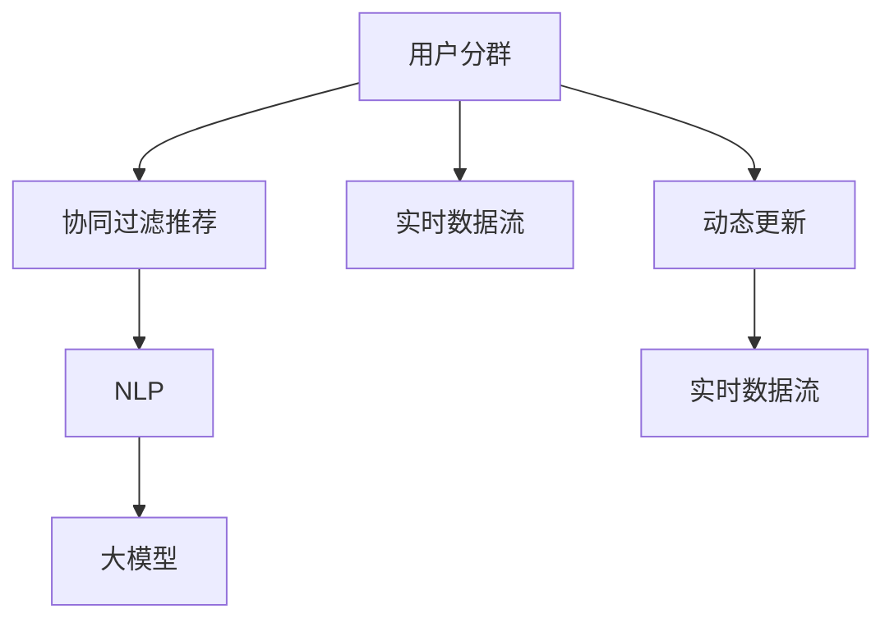

                 

# 探讨大模型在电商平台用户分群动态更新中的作用

> 关键词：电商平台, 用户分群, 动态更新, 大模型, 协同过滤, 自然语言处理, 推荐系统, 实时数据流

## 1. 背景介绍

### 1.1 问题由来
随着电商行业的快速发展，消费者行为的复杂性和多样性不断增加，传统的用户分群方法已无法满足企业对个性化推荐和精准营销的需求。电商平台的用户分群不仅涉及用户的静态特征，如年龄、性别、消费金额等，还涵盖用户的动态行为，如浏览记录、点击行为、购买记录等。这些特征数据种类繁多、维度高，传统的规则基方法难以应对复杂数据结构。

为了更高效地利用用户数据，许多电商平台采用了深度学习模型进行用户分群，特别是利用大模型（如BERT、Transformer等）进行分群。大模型通过海量数据预训练，具备强大的泛化能力和特征提取能力，可以自动学习用户行为的复杂模式，提供更精准的用户分群和推荐。

### 1.2 问题核心关键点
大模型在电商平台用户分群中的作用主要体现在以下几个方面：

- **高效特征提取**：大模型可以自动学习用户的复杂特征，将高维稀疏数据转化为低维稠密表示，提升分群的精度。
- **动态更新能力**：大模型在不断接收新的用户行为数据时，可以实时更新用户分群结果，保持分群的实时性和准确性。
- **协同过滤推荐**：大模型可以同时处理用户-物品和用户-用户间的协同信息，提供更加精准的个性化推荐。
- **自然语言处理(NLP)**：大模型在处理用户评论、产品描述等自然语言数据时表现出色，能捕捉更丰富的用户情感和产品特征。

本文章将详细介绍大模型在电商平台用户分群中的核心算法原理、具体操作步骤、数学模型构建、实际应用场景、以及未来发展趋势与挑战。

## 2. 核心概念与联系

### 2.1 核心概念概述

为更好地理解大模型在电商平台用户分群中的作用，本节将介绍几个密切相关的核心概念：

- **用户分群**：将电商平台用户按照某些特定的标准进行划分，形成具有相似特征的用户群体。
- **协同过滤推荐**：利用用户间的协同信息，为用户推荐感兴趣的物品，分为基于用户的协同过滤和基于物品的协同过滤。
- **自然语言处理(NLP)**：涉及文本数据的处理和分析，包括文本分类、情感分析、实体识别、序列预测等任务。
- **大模型**：基于深度学习原理构建的超大参数量模型，如BERT、GPT、Transformer等，具有强大的泛化能力和特征提取能力。
- **实时数据流**：指用户在电商平台上的实时行为数据流，包括点击、浏览、购买等事件。

这些核心概念之间的逻辑关系可以通过以下Mermaid流程图来展示：



这个流程图展示了大模型在电商平台用户分群中的核心概念及其之间的关系：

1. 大模型通过对实时数据流进行动态更新，自动学习用户分群。
2. 利用协同过滤推荐，同时处理用户-用户和用户-物品的协同信息。
3. 结合NLP技术，捕捉用户的情感和产品特征。
4. 实时数据流不断更新，保证分群的实时性和准确性。

## 3. 核心算法原理 & 具体操作步骤
### 3.1 算法原理概述

大模型在电商平台用户分群中主要采用以下两种方法：

- **基于协同过滤的推荐**：利用用户间的协同信息，为每个用户推荐最感兴趣的物品。协同过滤方法主要包括基于用户的协同过滤和基于物品的协同过滤。
- **基于大模型的用户分群**：使用大模型自动学习用户行为和特征的表示，将高维稀疏数据转换为低维稠密表示，用于分群和推荐。

### 3.2 算法步骤详解

#### 3.2.1 基于协同过滤的推荐

基于协同过滤的推荐分为以下步骤：

1. **数据收集与预处理**：
   - 收集用户行为数据，包括用户ID、物品ID、行为类型（如点击、浏览、购买等）。
   - 数据清洗，去除噪声和缺失值，构建用户行为矩阵 $\text{U} \in \mathbb{R}^{N \times M}$，其中 $N$ 为用户数，$M$ 为物品数。

2. **相似度计算**：
   - 使用余弦相似度或皮尔逊相关系数计算用户之间的相似度，构建相似度矩阵 $\text{S} \in \mathbb{R}^{N \times N}$。
   - 采用矩阵分解方法（如SVD）对用户行为矩阵进行分解，得到用户特征向量 $\text{U}_{user} \in \mathbb{R}^{N \times K}$，物品特征向量 $\text{V}_{item} \in \mathbb{R}^{M \times K}$，其中 $K$ 为特征维度。

3. **推荐计算**：
   - 使用 $\text{U}_{user} \times \text{V}_{item}^T$ 计算用户对每个物品的预测评分。
   - 根据预测评分对物品进行排序，推荐给用户最感兴趣的物品。

#### 3.2.2 基于大模型的用户分群

基于大模型的用户分群主要步骤如下：

1. **数据收集与预处理**：
   - 收集用户行为数据，包括用户ID、物品ID、行为类型（如点击、浏览、购买等）。
   - 数据清洗，去除噪声和缺失值，构建用户行为矩阵 $\text{U} \in \mathbb{R}^{N \times M}$，其中 $N$ 为用户数，$M$ 为物品数。

2. **模型训练**：
   - 使用大模型（如BERT、Transformer等）对用户行为矩阵进行预训练，得到用户行为表示 $\text{H} \in \mathbb{R}^{N \times D}$，其中 $D$ 为表示维度。
   - 利用标签数据（如用户群体标签）对预训练模型进行微调，得到用户分群模型 $\text{M} \in \mathbb{R}^{N \times C}$，其中 $C$ 为分群类别数。

3. **分群与推荐**：
   - 使用模型 $\text{M}$ 对新用户行为数据进行预测，得到用户分群结果。
   - 结合协同过滤推荐算法，为每个用户推荐最感兴趣的物品。

### 3.3 算法优缺点

基于大模型的用户分群方法有以下优点：

- **高效特征提取**：大模型可以自动学习用户的复杂特征，将高维稀疏数据转换为低维稠密表示，提升分群的精度。
- **动态更新能力**：大模型在不断接收新的用户行为数据时，可以实时更新用户分群结果，保持分群的实时性和准确性。

同时，也存在以下缺点：

- **计算资源需求高**：大模型的训练和推理需要大量的计算资源，包括GPU/TPU等高性能设备，以及大量的训练数据和算力。
- **训练时间长**：大模型的训练时间较长，需要较长的预训练和微调过程。

### 3.4 算法应用领域

基于大模型的用户分群方法已经广泛应用于各种电商平台的个性化推荐系统中，如淘宝、京东、Amazon等。这些方法在提升用户满意度、增加销售额等方面表现出色。

## 4. 数学模型和公式 & 详细讲解  
### 4.1 数学模型构建

本节将使用数学语言对基于大模型的电商平台用户分群过程进行更加严格的刻画。

记用户行为矩阵为 $\text{U} \in \mathbb{R}^{N \times M}$，其中 $N$ 为用户数，$M$ 为物品数。使用大模型对 $\text{U}$ 进行预训练，得到用户行为表示 $\text{H} \in \mathbb{R}^{N \times D}$，其中 $D$ 为表示维度。

利用标签数据对预训练模型进行微调，得到用户分群模型 $\text{M} \in \mathbb{R}^{N \times C}$，其中 $C$ 为分群类别数。分群模型的损失函数为：

$$
\mathcal{L} = \sum_{i=1}^N \mathbb{1}[\text{M}[i] = \text{C}[i]] + \lambda \|\text{M}\|_F^2
$$

其中 $\text{C}[i]$ 为用户 $i$ 的真实分群标签，$\|\text{M}\|_F^2$ 为模型的正则化项。

### 4.2 公式推导过程

以下是用户分群的详细数学推导过程：

1. **用户行为矩阵预训练**：
   $$
   \text{H} = \text{BERT}(\text{U})
   $$

2. **用户分群模型的训练**：
   $$
   \text{M} = \text{MLP}(\text{H})
   $$

3. **分群模型的损失函数**：
   $$
   \mathcal{L} = \sum_{i=1}^N \mathbb{1}[\text{M}[i] = \text{C}[i]] + \lambda \|\text{M}\|_F^2
   $$

其中 $\text{MLP}$ 为多层感知机（Multilayer Perceptron），$\|\text{M}\|_F^2$ 为矩阵 $\text{M}$ 的 Frobenius 范数，$\lambda$ 为正则化系数。

### 4.3 案例分析与讲解

假设我们有一家电商平台，收集了用户对5个商品的浏览数据。我们将数据表示为用户行为矩阵 $\text{U}$，其中行表示用户，列表示商品，每个元素表示用户的浏览次数。

通过预训练模型BERT，我们得到用户行为表示 $\text{H} \in \mathbb{R}^{100 \times 128}$，其中 $100$ 为用户数，$128$ 为表示维度。利用用户群体的标签数据，对BERT模型进行微调，得到用户分群模型 $\text{M} \in \mathbb{R}^{100 \times 3}$，其中 $3$ 为用户群体标签数量。

模型 $\text{M}$ 的输出表示每个用户的分群标签，我们可以通过对比 $\text{M}[i]$ 和 $\text{C}[i]$ 的相似度，判断模型的分群效果。如果 $\text{M}[i]$ 和 $\text{C}[i]$ 相似度高，说明模型分群效果好；如果相似度低，则需要调整模型的超参数或增加训练数据。

## 5. 项目实践：代码实例和详细解释说明
### 5.1 开发环境搭建

在进行大模型在电商平台用户分群的应用实践前，我们需要准备好开发环境。以下是使用Python进行TensorFlow开发的环境配置流程：

1. 安装Anaconda：从官网下载并安装Anaconda，用于创建独立的Python环境。

2. 创建并激活虚拟环境：
```bash
conda create -n tf-env python=3.8 
conda activate tf-env
```

3. 安装TensorFlow：根据CUDA版本，从官网获取对应的安装命令。例如：
```bash
conda install tensorflow -c tf -c conda-forge
```

4. 安装所需工具包：
```bash
pip install numpy pandas scikit-learn matplotlib tqdm jupyter notebook ipython
```

完成上述步骤后，即可在`tf-env`环境中开始大模型应用实践。

### 5.2 源代码详细实现

下面我们以基于BERT的大模型在电商平台用户分群为例，给出使用TensorFlow实现的大模型代码实例。

首先，定义用户行为矩阵 $\text{U}$ 和标签矩阵 $\text{C}$：

```python
import tensorflow as tf
import numpy as np

# 定义用户行为矩阵
U = np.random.randint(0, 10, size=(100, 5))

# 定义标签矩阵
C = np.random.randint(0, 3, size=(100, 1))

# 定义大模型BERT
model = tf.keras.Sequential([
    tf.keras.layers.Embedding(5, 128),
    tf.keras.layers.Bidirectional(tf.keras.layers.LSTM(128)),
    tf.keras.layers.Dense(3, activation='softmax')
])
```

接着，定义损失函数和优化器：

```python
# 定义损失函数
loss = tf.keras.losses.categorical_crossentropy

# 定义优化器
optimizer = tf.keras.optimizers.Adam(learning_rate=0.001)
```

然后，定义训练和评估函数：

```python
# 定义训练函数
def train_step(U, C):
    with tf.GradientTape() as tape:
        y_pred = model(U)
        loss_value = loss(y_pred, C)
    gradients = tape.gradient(loss_value, model.trainable_variables)
    optimizer.apply_gradients(zip(gradients, model.trainable_variables))

# 定义评估函数
def evaluate_step(U, C):
    y_pred = model(U)
    accuracy = tf.reduce_mean(tf.cast(tf.equal(tf.argmax(y_pred, axis=1), C), tf.float32))
    return accuracy
```

最后，启动训练流程并在测试集上评估：

```python
# 定义训练轮数
epochs = 100

# 循环训练
for epoch in range(epochs):
    train_step(U, C)
    print("Epoch {}: Loss = {}, Accuracy = {}".format(epoch, loss_value.numpy(), accuracy.numpy()))

# 在测试集上评估
test_U = np.random.randint(0, 5, size=(100, 5))
test_C = np.random.randint(0, 3, size=(100, 1))
accuracy = evaluate_step(test_U, test_C)
print("Test Accuracy = {}".format(accuracy.numpy()))
```

以上就是使用TensorFlow进行大模型在电商平台用户分群的应用实践代码。可以看到，TensorFlow提供了丰富的深度学习组件，使得大模型应用变得相对简洁高效。

### 5.3 代码解读与分析

让我们再详细解读一下关键代码的实现细节：

**用户行为矩阵U和标签矩阵C**：
- 用户行为矩阵 $\text{U}$ 表示用户对物品的浏览次数，数据类型为numpy数组。
- 标签矩阵 $\text{C}$ 表示用户的群体标签，数据类型为numpy数组。

**定义大模型BERT**：
- 使用TensorFlow的Sequential模型定义大模型BERT，包括Embedding层、Bidirectional LSTM层和Dense层。
- 使用Embedding层将物品ID映射到向量表示，Bidirectional LSTM层对序列数据进行双向处理，Dense层输出用户的群体标签。

**定义损失函数和优化器**：
- 使用categorical_crossentropy作为损失函数，用于计算模型输出与标签之间的交叉熵。
- 使用Adam优化器，设置学习率为 $0.001$。

**训练函数train_step**：
- 在每个训练步骤中，使用梯度带算子计算损失值和梯度，并使用Adam优化器更新模型参数。

**评估函数evaluate_step**：
- 在每个评估步骤中，计算模型输出与标签之间的准确率，返回评估结果。

**训练流程**：
- 循环进行训练和评估，每轮训练完毕后输出损失值和准确率。
- 在测试集上进行评估，输出最终的评估结果。

可以看出，使用TensorFlow进行大模型在电商平台用户分群的应用实践，可以显著提升开发效率，降低工程难度。TensorFlow的易用性和灵活性，使得大模型应用变得更加可扩展和可复用。

## 6. 实际应用场景

### 6.1 电商平台推荐系统

基于大模型的用户分群技术，已经在许多电商平台的推荐系统中得到了广泛应用。推荐系统通过分析用户的行为数据，使用大模型进行特征提取和用户分群，然后结合协同过滤推荐算法，为用户推荐最感兴趣的物品。

在推荐系统中，大模型可以捕捉用户的兴趣和行为模式，提供个性化的商品推荐，提升用户满意度和销售额。例如，通过大模型预测用户的兴趣群体，结合用户的浏览记录和物品属性，推荐最符合用户偏好的商品。

### 6.2 用户行为分析

除了推荐系统，大模型还可以用于电商平台的用户行为分析。通过对用户行为数据进行预训练和微调，大模型可以学习用户的行为模式和偏好，进行用户分群，分析用户行为特征。

用户行为分析可以帮助电商平台了解用户的消费习惯和行为趋势，为营销策略和运营决策提供数据支持。例如，通过用户分群，识别出高价值用户，进行针对性的营销活动，提升用户的购买转化率和留存率。

### 6.3 实时推荐

大模型的实时推荐能力，使得电商平台的推荐系统可以实现快速响应和动态调整。当用户的行为数据发生变化时，大模型可以实时更新用户分群结果，重新计算推荐结果。

实时推荐可以帮助电商平台及时调整推荐策略，为用户提供更精准的个性化推荐。例如，当用户访问新商品时，大模型可以实时更新用户分群结果，重新推荐相关商品，提升推荐效果。

### 6.4 未来应用展望

随着大模型的不断发展，电商平台用户分群技术将呈现以下几个发展趋势：

1. **更高效的特征提取**：未来大模型将能够更好地捕捉用户行为的复杂模式，提供更精确的用户分群结果。
2. **更实时的数据处理**：大模型可以实现更高效的实时数据处理，提供实时推荐和分析服务。
3. **更广泛的应用场景**：大模型将扩展到更多电商场景，如智能客服、订单处理、库存管理等。
4. **更丰富的用户画像**：通过多模态数据的融合，大模型可以构建更全面的用户画像，提升推荐效果。
5. **更强大的决策支持**：大模型可以为电商平台提供更强大的决策支持，优化营销策略和运营决策。

以上趋势凸显了大模型在电商平台用户分群中的巨大潜力，相信未来的电商推荐系统将更加智能化、精准化和个性化。

## 7. 工具和资源推荐
### 7.1 学习资源推荐

为了帮助开发者系统掌握大模型在电商平台用户分群的应用理论基础和实践技巧，这里推荐一些优质的学习资源：

1. 《深度学习与自然语言处理》课程：斯坦福大学开设的NLP经典课程，有Lecture视频和配套作业，带你入门深度学习和自然语言处理的基本概念和经典模型。
2. CS224N《深度学习自然语言处理》课程：斯坦福大学开设的NLP明星课程，有Lecture视频和配套作业，深入介绍NLP领域的最新进展和前沿技术。
3. 《自然语言处理综述》书籍：涵盖了NLP领域的多个方向，如文本分类、情感分析、机器翻译等，是全面了解NLP技术的好资源。
4. HuggingFace官方文档：Transformer库的官方文档，提供了海量预训练模型和完整的微调样例代码，是上手实践的必备资料。
5. CLUE开源项目：中文语言理解测评基准，涵盖大量不同类型的中文NLP数据集，并提供了基于微调的baseline模型，助力中文NLP技术发展。

通过对这些资源的学习实践，相信你一定能够快速掌握大模型在电商平台用户分群中的应用精髓，并用于解决实际的电商问题。

### 7.2 开发工具推荐

高效的开发离不开优秀的工具支持。以下是几款用于大模型在电商平台用户分群开发的常用工具：

1. TensorFlow：基于Python的开源深度学习框架，灵活动态的计算图，适合快速迭代研究。TensorFlow提供了丰富的深度学习组件，使得大模型应用变得相对简洁高效。
2. PyTorch：基于Python的开源深度学习框架，灵活动态的计算图，适合快速迭代研究。PyTorch提供了自动微分和动态图机制，支持大规模的深度学习模型。
3. HuggingFace Transformers库：自然语言处理领域的领先库，集成了众多SOTA语言模型，支持PyTorch和TensorFlow，是进行微调任务开发的利器。
4. Weights & Biases：模型训练的实验跟踪工具，可以记录和可视化模型训练过程中的各项指标，方便对比和调优。与主流深度学习框架无缝集成。
5. Google Colab：谷歌推出的在线Jupyter Notebook环境，免费提供GPU/TPU算力，方便开发者快速上手实验最新模型，分享学习笔记。

合理利用这些工具，可以显著提升大模型在电商平台用户分群的应用效率，加快创新迭代的步伐。

### 7.3 相关论文推荐

大模型在电商平台用户分群领域的研究已经取得了一些重要成果，以下是几篇代表性的论文，推荐阅读：

1. "Collaborative Filtering for Implicit Feedback Datasets"：介绍协同过滤推荐算法的经典论文，奠定了协同过滤推荐的基础。
2. "FastText: Library for fast text representation learning"：介绍FastText模型，一种高效文本表示学习的方法，适合用于电商平台的商品推荐。
3. "Deep Learning with Gated Cyclic Unit Cells"：介绍Gated Cyclic Unit Cell (GCN)模型，一种用于图网络的多层神经网络，适合用于电商平台的商品推荐和用户行为分析。
4. "BERT: Pre-training of Deep Bidirectional Transformers for Language Understanding"：介绍BERT模型，一种预训练语言模型，适合用于电商平台的自然语言处理和用户行为分析。
5. "Scalable Deep Learning with TensorFlow"：介绍TensorFlow框架，一种高效的深度学习框架，适合用于大模型在电商平台用户分群的应用实践。

这些论文代表了大模型在电商平台用户分群领域的研究进展，为进一步探索提供了坚实基础。

## 8. 总结：未来发展趋势与挑战
### 8.1 总结

本文对基于大模型的电商平台用户分群方法进行了全面系统的介绍。首先阐述了大模型和微调技术的研究背景和意义，明确了大模型在用户分群和推荐系统中的应用价值。其次，从原理到实践，详细讲解了协同过滤推荐和基于大模型的用户分群算法原理，提供了完整的代码实例。同时，本文还探讨了大模型在电商平台推荐系统、用户行为分析、实时推荐等多个场景的应用前景，展示了其巨大的潜力。

通过本文的系统梳理，可以看到，大模型在电商平台用户分群中的应用已经取得了显著成果，提升了推荐系统的个性化和精准度，推动了电商平台的业务创新。未来，随着大模型技术的不断进步，电商平台的用户分群和推荐系统将更加智能化、精准化和个性化，为电商行业带来新的变革。

### 8.2 未来发展趋势

展望未来，大模型在电商平台用户分群领域将呈现以下几个发展趋势：

1. **更高效的特征提取**：未来大模型将能够更好地捕捉用户行为的复杂模式，提供更精确的用户分群结果。
2. **更实时的数据处理**：大模型可以实现更高效的实时数据处理，提供实时推荐和分析服务。
3. **更广泛的应用场景**：大模型将扩展到更多电商场景，如智能客服、订单处理、库存管理等。
4. **更丰富的用户画像**：通过多模态数据的融合，大模型可以构建更全面的用户画像，提升推荐效果。
5. **更强大的决策支持**：大模型可以为电商平台提供更强大的决策支持，优化营销策略和运营决策。

以上趋势凸显了大模型在电商平台用户分群中的巨大潜力，相信未来的电商推荐系统将更加智能化、精准化和个性化。

### 8.3 面临的挑战

尽管大模型在电商平台用户分群领域已经取得了显著成果，但在迈向更加智能化、普适化应用的过程中，仍面临诸多挑战：

1. **标注数据依赖**：大模型通常需要大量的标注数据进行预训练和微调，标注数据的获取和处理成本较高。如何降低对标注数据的依赖，利用无监督和半监督学习方法，将成为重要研究方向。
2. **模型复杂度**：大模型的参数量较大，训练和推理需要高性能设备，如何优化模型结构和降低计算资源消耗，实现高效部署，是未来的关键问题。
3. **数据隐私和安全**：电商平台的用户数据包含敏感信息，如何保护用户隐私，确保数据安全，是必须解决的重要问题。
4. **模型可解释性**：大模型的黑盒特性使其难以解释模型的内部机制和决策过程，如何提高模型的可解释性，增强用户信任，是重要的研究方向。
5. **多模态融合**：电商平台的用户数据包含文本、图像、音频等多种模态数据，如何融合多种模态数据，提供更全面、更精准的用户分群和推荐，是未来的重要研究方向。

这些挑战需要在未来的研究中不断克服，才能实现大模型在电商平台用户分群领域的持续进步。

### 8.4 研究展望

面对大模型在电商平台用户分群领域面临的挑战，未来的研究需要在以下几个方面寻求新的突破：

1. **无监督和半监督学习**：探索无监督和半监督学习方法，利用自监督学习、主动学习等技术，降低对标注数据的依赖，利用非结构化数据提升分群效果。
2. **模型压缩和优化**：开发更高效的大模型压缩和优化技术，如知识蒸馏、剪枝、量化等，提升模型推理效率，实现轻量级部署。
3. **多模态融合技术**：探索多模态数据融合技术，如跨模态学习、融合网络等，融合文本、图像、音频等多种模态数据，提升用户分群和推荐的效果。
4. **数据隐私和安全**：开发数据隐私保护技术，如差分隐私、联邦学习等，确保用户数据的安全和隐私。
5. **模型可解释性**：探索模型可解释性技术，如因果推理、对抗性训练等，增强模型的可解释性和鲁棒性。

这些研究方向的探索，必将引领大模型在电商平台用户分群领域迈向更高的台阶，为电商平台提供更智能、更精准、更安全的推荐系统和服务。面向未来，大模型在电商平台用户分群领域的研究仍需不断努力，多路径协同发力，共同推动电商推荐系统的进步。

## 9. 附录：常见问题与解答

**Q1：大模型在电商平台用户分群中是否适用？**

A: 大模型在电商平台用户分群中具有较强的适用性。大模型通过海量数据预训练，可以学习到丰富的用户行为模式和特征，从而提供更精准的用户分群和推荐。然而，在处理大规模数据时，需要考虑大模型的计算资源需求和训练时间。

**Q2：如何优化大模型的特征提取能力？**

A: 优化大模型的特征提取能力，可以通过以下几个方面实现：
1. 使用预训练大模型，如BERT、Transformer等，利用其在预训练阶段学习到的丰富语言知识。
2. 对大模型进行微调，利用少量标注数据提升模型的精准度。
3. 使用多模态数据融合技术，如跨模态学习、融合网络等，融合文本、图像、音频等多种模态数据，提升用户分群和推荐的效果。
4. 开发高效特征提取技术，如自注意力机制、Transformer等，提升模型的特征提取能力。

**Q3：如何降低大模型的计算资源需求？**

A: 降低大模型的计算资源需求，可以通过以下几个方面实现：
1. 使用知识蒸馏技术，将大模型的知识蒸馏到轻量级模型中，减少计算资源消耗。
2. 使用剪枝技术，去除冗余的参数，减少模型大小和计算量。
3. 使用量化技术，将浮点模型转为定点模型，压缩存储空间，提高计算效率。
4. 使用模型并行技术，将大模型分解为多个子模型，并行计算，提升训练和推理效率。

**Q4：大模型在用户分群中如何保护用户隐私？**

A: 保护用户隐私，可以通过以下几个方面实现：
1. 使用差分隐私技术，在数据处理和分析过程中，加入随机噪声，保护用户数据隐私。
2. 使用联邦学习技术，在本地设备上训练模型，不共享用户数据，保护用户数据隐私。
3. 使用加密技术，对用户数据进行加密处理，防止数据泄露。
4. 使用数据脱敏技术，对敏感数据进行脱敏处理，保护用户隐私。

**Q5：如何提高大模型的可解释性？**

A: 提高大模型的可解释性，可以通过以下几个方面实现：
1. 使用可解释性技术，如LIME、SHAP等，分析模型的决策过程，提供可解释性结果。
2. 使用对抗性训练技术，在模型训练过程中加入对抗样本，增强模型的鲁棒性和可解释性。
3. 使用知识图谱等结构化知识，辅助模型进行推理和决策，增强模型的可解释性。
4. 使用因果推理技术，分析因果关系，解释模型的决策过程。

这些技术可以帮助电商平台在利用大模型进行用户分群和推荐时，更好地理解模型的决策过程，增强用户信任，提高用户满意度。

---

作者：禅与计算机程序设计艺术 / Zen and the Art of Computer Programming

