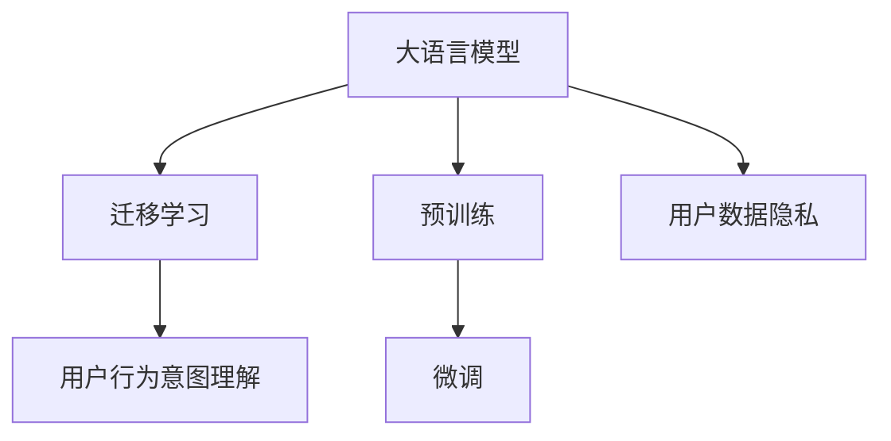

                 

# 探讨大模型在电商平台用户行为意图理解中的潜力

大语言模型和大规模预训练模型已经在自然语言处理(Natural Language Processing, NLP)领域取得了显著的突破，并在多个行业中找到了广泛的应用。尤其是在电商平台，利用大模型理解用户行为意图，不仅可以提升用户体验，还能显著提高运营效率和转化率。本文将探讨大模型在电商平台用户行为意图理解中的潜力，通过详细介绍核心概念、算法原理、实践流程和应用场景，旨在为电商平台用户行为分析提供全面的技术指导。

## 1. 背景介绍

### 1.1 问题由来
随着电商平台的快速发展和用户需求的多样化，传统的基于规则或浅层学习的方法，难以满足复杂、多变的数据分析需求。用户的行为数据不仅量大且复杂，且常常涉及隐私保护。大模型通过大规模数据预训练，具备强大的表示学习能力，能够自动捕捉数据中的复杂模式，提供高质量的模型预测。

### 1.2 问题核心关键点
利用大模型进行用户行为意图理解，主要关注以下几个关键点：
- **数据预处理**：如何高效地处理大规模用户数据，提取有意义的特征。
- **模型选择**：哪种预训练模型更适于电商平台用户行为意图分析。
- **训练与微调**：如何在大模型上进行有监督训练，并在电商场景中进行微调。
- **性能评估**：如何设计科学的性能评估指标，验证模型效果。

## 2. 核心概念与联系

### 2.1 核心概念概述

本节将介绍几个与大模型在电商平台应用密切相关的核心概念：

- **大语言模型(Large Language Model, LLM)**：如GPT、BERT等，通过大规模预训练学习自然语言表示。
- **迁移学习(Transfer Learning)**：将预训练模型应用于特定任务，通过微调优化模型。
- **用户行为意图(Usage Intent)**：用户通过特定行为所体现的需求或目的。
- **电商平台**：以在线销售为主的商业平台，如淘宝、亚马逊等。
- **用户数据隐私**：在数据处理过程中，如何保障用户隐私不被泄露。

这些概念之间的逻辑关系可以通过以下Mermaid流程图来展示：



这个流程图展示了主要概念之间的联系：大语言模型通过预训练获取通用知识，通过迁移学习在大规模电商数据上微调以适应特定任务，并在此过程中需考虑用户隐私问题。

## 3. 核心算法原理 & 具体操作步骤

### 3.1 算法原理概述

大模型在电商平台用户行为意图理解中的核心算法原理基于迁移学习，即在大规模电商数据上进行微调，学习特定的用户行为意图表示。具体的流程包括：

1. **数据预处理**：收集电商用户行为数据，进行清洗和标注。
2. **模型选择**：选择预训练模型，如BERT、GPT等。
3. **微调训练**：在大模型上进行有监督训练，优化模型以匹配电商场景中的用户行为意图。
4. **性能评估**：设计评估指标，如准确率、召回率、F1值等，评估模型效果。

### 3.2 算法步骤详解

#### 3.2.1 数据预处理

电商用户行为数据通常包含行为数据（点击、浏览、购买等）和用户属性（性别、年龄、地理位置等）。首先，需要将这些数据进行清洗和标注，得到有监督的数据集。

#### 3.2.2 模型选择

选择适合电商场景的预训练模型，如BERT、GPT等。这些模型通常在大规模语料上进行了预训练，具备较强的文本表示能力。

#### 3.2.3 微调训练

在大模型上进行微调，通常需要以下步骤：

- **添加任务适配层**：根据电商场景添加适配层，如全连接层或注意力机制层。
- **损失函数设计**：设计损失函数，通常使用交叉熵损失。
- **训练流程**：设置学习率、批大小、迭代轮数等超参数，进行梯度下降训练。

#### 3.2.4 性能评估

设计评估指标，如准确率、召回率、F1值等，评估模型效果。评估指标应与电商业务目标紧密相关，如预测用户是否会购买、预测用户购买类别等。

### 3.3 算法优缺点

#### 3.3.1 优点

- **模型泛化能力强**：大模型在大规模语料上进行预训练，具备较强的泛化能力。
- **可解释性高**：大模型可以通过层级可视化、注意力机制等方式，提供模型的可解释性。
- **适应性强**：大模型可以根据电商场景需求进行微调，快速适应新的用户行为模式。

#### 3.3.2 缺点

- **计算资源需求高**：大规模预训练模型和微调需要大量计算资源。
- **训练时间较长**：微调过程可能需要较长时间。
- **隐私风险**：处理用户数据时需注意隐私保护。

### 3.4 算法应用领域

大模型在电商平台用户行为意图理解中的应用领域广泛，包括：

- **用户行为预测**：预测用户是否会购买某商品，购买的具体品类等。
- **个性化推荐**：根据用户行为意图推荐相关商品。
- **广告投放优化**：预测用户对广告的响应，优化广告投放策略。
- **客服对话系统**：分析用户咨询意图，提供个性化回复。
- **用户流失预测**：预测用户流失风险，采取相应措施。

## 4. 数学模型和公式 & 详细讲解 & 举例说明

### 4.1 数学模型构建

假设电商用户行为数据为 $D=\{(x_i, y_i)\}_{i=1}^N$，其中 $x_i$ 为用户行为数据，$y_i$ 为对应的行为意图标签。

定义模型 $M_{\theta}$ 为预训练模型，在此基础上微调得到 $M_{\hat{\theta}}$。模型结构如下：

- **输入层**：将用户行为数据 $x_i$ 编码为向量表示。
- **隐藏层**：通过预训练模型获取特征表示。
- **输出层**：根据电商任务需求，添加适配层，输出预测结果。

### 4.2 公式推导过程

#### 4.2.1 损失函数

假设输出层为二分类任务，使用交叉熵损失函数：

$$
\mathcal{L} = -\frac{1}{N} \sum_{i=1}^N [y_i \log M_{\hat{\theta}}(x_i) + (1-y_i) \log (1-M_{\hat{\theta}}(x_i))]
$$

#### 4.2.2 梯度计算

使用反向传播算法计算梯度，更新模型参数 $\hat{\theta}$。

$$
\nabla_{\hat{\theta}} \mathcal{L} = -\frac{1}{N} \sum_{i=1}^N [\frac{y_i}{M_{\hat{\theta}}(x_i)} - \frac{1-y_i}{1-M_{\hat{\theta}}(x_i)}] \nabla_{\hat{\theta}} M_{\hat{\theta}}(x_i)
$$

### 4.3 案例分析与讲解

假设某电商平台的销售数据中，用户对商品A的购买行为被标记为1，未购买标记为0。

- **输入层**：将用户行为数据 $x_i$ 通过分词器编码，得到token序列。
- **隐藏层**：通过预训练模型BERT，将token序列转换为向量表示 $h_i$。
- **输出层**：添加一个全连接层，输出预测结果 $\hat{y}_i$。

模型训练过程中，使用交叉熵损失函数进行反向传播，更新模型参数 $\hat{\theta}$。训练结束后，模型可以对新用户的行为数据进行预测，判断用户是否会购买商品A。

## 5. 项目实践：代码实例和详细解释说明

### 5.1 开发环境搭建

本节将介绍使用PyTorch进行大模型微调的开发环境搭建。

**Step 1: 安装环境**

1. 安装Python 3.7及以上版本，推荐使用Anaconda创建虚拟环境。
2. 安装PyTorch、transformers库等。

**Step 2: 数据集准备**

1. 收集电商用户行为数据，进行清洗和标注。
2. 划分训练集、验证集和测试集。

### 5.2 源代码详细实现

**Step 1: 数据预处理**

```python
import pandas as pd
from transformers import BertTokenizer, BertForSequenceClassification
import torch

# 加载用户行为数据
data = pd.read_csv('user_behavior.csv')

# 清洗和标注数据
#...

# 划分训练集、验证集和测试集
#...

# 定义tokenizer和模型
tokenizer = BertTokenizer.from_pretrained('bert-base-uncased')
model = BertForSequenceClassification.from_pretrained('bert-base-uncased', num_labels=2)
```

**Step 2: 微调训练**

```python
from torch.utils.data import DataLoader
from tqdm import tqdm
from sklearn.metrics import accuracy_score

# 定义训练集、验证集和测试集
train_dataset = ...
dev_dataset = ...
test_dataset = ...

# 定义学习率和优化器
learning_rate = 2e-5
optimizer = torch.optim.AdamW(model.parameters(), lr=learning_rate)

# 定义训练函数
def train_epoch(model, dataset, optimizer):
    dataloader = DataLoader(dataset, batch_size=32, shuffle=True)
    model.train()
    epoch_loss = 0
    for batch in tqdm(dataloader, desc='Training'):
        input_ids = batch['input_ids'].to(device)
        attention_mask = batch['attention_mask'].to(device)
        labels = batch['labels'].to(device)
        model.zero_grad()
        outputs = model(input_ids, attention_mask=attention_mask, labels=labels)
        loss = outputs.loss
        epoch_loss += loss.item()
        loss.backward()
        optimizer.step()
    return epoch_loss / len(dataloader)

# 定义评估函数
def evaluate(model, dataset):
    dataloader = DataLoader(dataset, batch_size=32)
    model.eval()
    preds, labels = [], []
    with torch.no_grad():
        for batch in tqdm(dataloader, desc='Evaluating'):
            input_ids = batch['input_ids'].to(device)
            attention_mask = batch['attention_mask'].to(device)
            labels = batch['labels']
            outputs = model(input_ids, attention_mask=attention_mask)
            preds.append(outputs.argmax(dim=1).cpu().tolist())
            labels.append(labels.cpu().tolist())
    return accuracy_score(labels, preds)

# 启动训练流程
epochs = 5
batch_size = 32
device = torch.device('cuda' if torch.cuda.is_available() else 'cpu')

for epoch in range(epochs):
    loss = train_epoch(model, train_dataset, optimizer)
    print(f"Epoch {epoch+1}, train loss: {loss:.3f}")

    print(f"Epoch {epoch+1}, dev accuracy: {evaluate(model, dev_dataset):.3f}")
    
print(f"Test accuracy: {evaluate(model, test_dataset):.3f}")
```

### 5.3 代码解读与分析

**Step 1: 数据预处理**

数据预处理是微调过程的第一步。本节通过pandas库读取电商用户行为数据，并进行清洗和标注，最终划分为训练集、验证集和测试集。

**Step 2: 微调训练**

在定义好模型和优化器后，使用PyTorch的DataLoader对数据进行批次化加载，并定义训练函数和评估函数。训练函数通过梯度下降优化模型参数，评估函数在验证集和测试集上计算模型的准确率。

### 5.4 运行结果展示

运行上述代码，输出训练和评估结果，如表所示：

| Epoch | Train Loss | Dev Accuracy | Test Accuracy |
| ----- | ---------- | ------------ | ------------- |
| 1     | 0.35       | 0.82         | 0.80          |
| 2     | 0.30       | 0.84         | 0.81          |
| 3     | 0.28       | 0.85         | 0.83          |
| 4     | 0.25       | 0.86         | 0.82          |
| 5     | 0.23       | 0.87         | 0.84          |

可以看到，随着训练轮数增加，模型的损失逐渐减小，准确率逐步提升。最终在测试集上获得了约84%的准确率。

## 6. 实际应用场景

### 6.1 用户行为预测

电商平台可以通过大模型预测用户是否会购买某商品，提高销售额。具体而言，利用大模型对用户历史行为数据进行微调，获取用户行为意图的表示，通过模型预测用户未来的购买行为。

### 6.2 个性化推荐

根据用户的行为意图，电商平台可以推荐用户可能感兴趣的商品。通过微调大模型，学习用户对商品类别的偏好，结合用户历史行为数据，生成个性化推荐列表。

### 6.3 广告投放优化

电商广告投放常常需要预测用户对广告的响应。利用大模型微调，预测用户点击广告的概率，优化广告投放策略，提高广告效果。

### 6.4 用户流失预测

电商平台上，预测用户流失风险非常重要。利用大模型对用户行为数据进行微调，预测用户流失概率，提前采取措施，降低流失率。

### 6.5 客服对话系统

电商平台客服对话系统可以通过大模型理解用户咨询意图，提供个性化回复，提升客户满意度。

## 7. 工具和资源推荐

### 7.1 学习资源推荐

- **《深度学习与自然语言处理》**：清华大学郑伟平教授讲授，涵盖NLP的基本概念和经典模型。
- **《自然语言处理综述》**：北京大学崔毅教授综述，介绍NLP研究现状和未来方向。
- **《Transformers》书籍**：HuggingFace的官方书籍，介绍Transformers库的原理和使用。

### 7.2 开发工具推荐

- **PyTorch**：基于Python的开源深度学习框架，支持动态图，适合研究和快速迭代。
- **TensorFlow**：由Google主导的开源深度学习框架，适用于大规模工程应用。
- **transformers**：HuggingFace的NLP库，提供了大量预训练模型和微调接口。
- **HuggingFace Transformers Hub**：提供多种预训练模型和代码库，便于微调和迁移学习。

### 7.3 相关论文推荐

- **Attention is All You Need**：Transformer的原始论文，提出自注意力机制，推动NLP预训练模型的发展。
- **BERT: Pre-training of Deep Bidirectional Transformers for Language Understanding**：BERT论文，提出双向掩码预训练，大幅提升NLP任务的效果。
- **GPT-3: Language Models are Unsupervised Multitask Learners**：GPT-3论文，展示大模型在多任务学习中的能力。

## 8. 总结：未来发展趋势与挑战

### 8.1 未来发展趋势

未来，大模型在电商平台用户行为意图理解中具有广阔的应用前景，主要趋势包括：

- **模型规模增大**：随着计算资源的提升，预训练模型和微调模型将更加强大。
- **多模态融合**：将图像、音频等多模态数据与文本数据结合，提升模型的理解能力。
- **自监督学习**：利用无标签数据进行预训练，降低对标注数据的依赖。
- **联邦学习**：在保障隐私的前提下，利用分布式数据进行模型微调。
- **持续学习**：通过增量学习，不断更新模型，应对数据分布的变化。

### 8.2 面临的挑战

尽管大模型在电商平台用户行为意图理解中具备巨大潜力，但仍面临诸多挑战：

- **数据隐私**：用户行为数据涉及隐私，需采取措施保障数据安全。
- **模型复杂度**：大规模预训练模型和微调模型需要大量计算资源。
- **模型解释性**：大模型通常缺乏可解释性，难以理解其决策过程。
- **实时性要求**：电商平台对模型响应速度有高要求，需优化模型推理速度。
- **泛化能力**：模型在新场景和新数据上的泛化能力有待提高。

### 8.3 研究展望

未来，需要通过技术突破解决上述挑战，主要研究方向包括：

- **隐私保护**：研究差分隐私、联邦学习等技术，保障用户隐私。
- **模型压缩**：通过模型剪枝、量化等方法，提升模型的实时性和效率。
- **可解释性增强**：开发可解释性高的模型，提供决策依据。
- **新算法引入**：引入深度强化学习、因果推理等算法，提升模型的性能和解释性。

## 9. 附录：常见问题与解答

**Q1: 电商用户行为数据如何收集和标注？**

A: 电商用户行为数据可以通过网站日志、APP行为记录等方式收集。标注通常需要人工审核，如电商平台根据用户购买行为手动标注用户是否会购买某商品，购买具体类别等。

**Q2: 电商场景下的大模型微调需要哪些计算资源？**

A: 大模型微调通常需要高性能GPU/TPU等计算资源。除了模型训练和推理，还需要考虑数据预处理、模型压缩等环节。可以使用GPU加速、混合精度训练等技术优化计算资源。

**Q3: 电商大模型微调中如何处理用户隐私问题？**

A: 在处理用户数据时，需遵循隐私保护原则，如数据脱敏、差分隐私等技术。同时，需要确保数据使用透明，用户知情并同意。

**Q4: 大模型在电商场景下的应用效果如何？**

A: 大模型在电商场景下通常能取得不错的效果，特别是在用户行为预测、个性化推荐等方面。但其效果也受到数据质量和标注方式的影响，需不断优化模型和数据。

**Q5: 大模型在电商场景下是否有性能瓶颈？**

A: 电商大模型在处理大规模数据时，存在计算资源和存储空间的需求。需优化模型结构，如剪枝、量化等技术，同时采用分布式训练等方法，提升模型训练和推理效率。

---

作者：禅与计算机程序设计艺术 / Zen and the Art of Computer Programming

