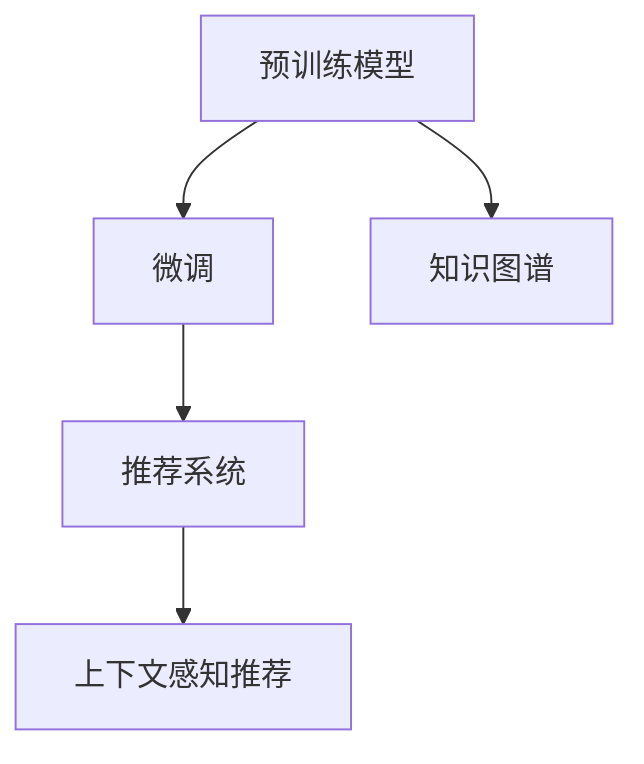

                 

# 推荐系统中的上下文感知：AI大模型的新方向

## 1. 背景介绍

推荐系统一直是人工智能和机器学习领域的重要研究课题。它旨在通过学习用户历史行为和兴趣偏好，为用户推荐个性化的商品、内容、服务等信息。早期的推荐系统主要依赖于传统统计和模型驱动方法，如协同过滤、矩阵分解等。但随着深度学习技术的发展，基于神经网络的模型推荐方法逐渐成为主流。特别是近年来，随着大语言模型（Large Language Models, LLMs）的兴起，推荐系统中的上下文感知能力得到了前所未有的提升。

大语言模型如BERT、GPT等，通过在大规模无标签文本数据上预训练，获得了丰富的语言知识和语义理解能力。基于这些预训练模型，可以构建上下文感知推荐系统，显著提升推荐效果。然而，尽管当前大语言模型在推荐系统中的应用已取得一定成果，但其上下文感知能力仍需进一步深化，以应对更加复杂多变的推荐场景。

本文旨在探讨大语言模型在推荐系统中的上下文感知能力，从理论和实践两个维度详细阐述上下文感知的原理和实现方式，并通过具体案例展示其应用效果，最后总结未来发展的趋势与挑战。

## 2. 核心概念与联系

### 2.1 核心概念概述

为更好地理解上下文感知推荐系统，本节将介绍几个关键概念：

- 推荐系统（Recommendation System）：基于用户历史行为和兴趣偏好，为用户推荐个性化信息的技术。
- 上下文感知（Context-Aware）：推荐系统考虑用户访问行为、商品属性、社交关系等多维度上下文信息，提升推荐准确性和个性化程度。
- 大语言模型（Large Language Models, LLMs）：如BERT、GPT等，在大规模无标签文本数据上进行自监督预训练，具备强大的语义理解和生成能力。
- 预训练（Pre-training）：在无标签数据上通过自监督任务进行预训练，学习通用语言表示。
- 微调（Fine-Tuning）：在预训练模型基础上，通过有监督任务优化模型，使其适配特定任务。
- 知识图谱（Knowledge Graph）：表示实体间关系的有向图结构，用于辅助推荐系统进行实体关系推理。

这些概念之间存在紧密联系，共同构成了上下文感知推荐系统的基本框架。预训练模型提供了丰富的语义知识，微调过程则进一步学习任务特定的上下文信息，而知识图谱则用于补充外部结构化知识，增强推荐系统的实体关系推理能力。

### 2.2 核心概念原理和架构的 Mermaid 流程图



## 3. 核心算法原理 & 具体操作步骤

### 3.1 算法原理概述

上下文感知推荐系统的核心思想是将预训练模型与推荐任务结合，利用模型学到的语义知识，结合上下文信息，生成个性化的推荐结果。其基本流程如下：

1. 预训练阶段：在无标签数据上通过自监督任务进行预训练，学习通用的语言表示。
2. 微调阶段：在推荐任务数据集上，对预训练模型进行微调，学习特定的上下文信息。
3. 推荐阶段：结合用户上下文和商品上下文，生成个性化推荐结果。

### 3.2 算法步骤详解

#### 3.2.1 数据准备
1. 收集用户数据：包括用户ID、浏览记录、购买记录等。
2. 收集商品数据：包括商品ID、属性、描述等。
3. 构建推荐数据集：将用户和商品数据合并，生成包含用户行为和商品属性的数据集。

#### 3.2.2 模型初始化
1. 选择预训练模型：如BERT、GPT等，作为推荐模型的初始化参数。
2. 加载知识图谱：加载包含实体关系的数据库或图谱，用于增强推荐模型的关系推理能力。

#### 3.2.3 模型微调
1. 定义推荐任务：根据任务需求，选择适当的损失函数，如交叉熵、均方误差等。
2. 设计微调层：在预训练模型的顶层设计推荐目标层，如线性层、全连接层等，用于处理推荐任务。
3. 训练模型：在推荐数据集上进行微调，优化模型参数，使其能够生成准确的推荐结果。

#### 3.2.4 推荐计算
1. 用户上下文提取：通过分词器、标签器等工具，提取用户当前行为和兴趣点。
2. 商品上下文提取：提取商品的属性、描述等相关信息，用于匹配推荐。
3. 生成推荐结果：将用户上下文和商品上下文输入微调后的模型，生成推荐结果。

### 3.3 算法优缺点

#### 3.3.1 优点
1. 通用性强：预训练模型适用于多种推荐任务，具有较强的泛化能力。
2. 上下文感知：结合用户和商品上下文信息，提升推荐结果的个性化程度。
3. 高效可扩展：基于深度学习框架的微调过程，可以轻松扩展至大规模数据集。

#### 3.3.2 缺点
1. 数据依赖高：需要大量标注数据进行微调，数据获取成本较高。
2. 模型复杂：预训练模型参数量大，微调过程复杂。
3. 模型鲁棒性差：对数据噪声和用户行为变化敏感，容易过拟合。

### 3.4 算法应用领域

基于大语言模型的上下文感知推荐系统，可以应用于各种推荐场景，包括商品推荐、内容推荐、服务推荐等。具体应用如下：

1. 电商推荐：在电商平台上，为用户推荐商品、优惠活动等，提升用户购买体验。
2. 新闻推荐：为用户推荐新闻、文章等，满足其信息获取需求。
3. 视频推荐：为用户推荐视频、电视剧等，丰富其娱乐体验。
4. 医疗推荐：为患者推荐医生、医院等，提升其医疗服务体验。

这些应用场景覆盖了线上线下多个领域，展示了上下文感知推荐系统的强大应用潜力。

## 4. 数学模型和公式 & 详细讲解 & 举例说明

### 4.1 数学模型构建

基于大语言模型的上下文感知推荐系统，其数学模型可表示为：

$$
\hat{y} = M_{\theta}(x,u,b)
$$

其中，$M_{\theta}$ 表示微调后的预训练模型，$x$ 表示用户行为上下文，$u$ 表示用户兴趣上下文，$b$ 表示商品属性上下文。$\hat{y}$ 表示推荐结果，$y$ 表示真实标签。

### 4.2 公式推导过程

设用户行为上下文 $x$ 为 $(x_1, x_2, ..., x_n)$，用户兴趣上下文 $u$ 为 $(u_1, u_2, ..., u_m)$，商品属性上下文 $b$ 为 $(b_1, b_2, ..., b_p)$。微调后的模型 $M_{\theta}$ 将上下文信息融合，输出推荐结果 $\hat{y}$。

其具体的推导过程如下：

1. 用户行为编码：
$$
x^u = [x_1, x_2, ..., x_n]
$$

2. 用户兴趣编码：
$$
u^u = [u_1, u_2, ..., u_m]
$$

3. 商品属性编码：
$$
b^b = [b_1, b_2, ..., b_p]
$$

4. 融合上下文：
$$
\text{context} = [x^u, u^u, b^b]
$$

5. 微调模型输出：
$$
\hat{y} = M_{\theta}(\text{context})
$$

### 4.3 案例分析与讲解

假设某电商平台希望为用户推荐商品。具体步骤如下：

1. 收集用户历史浏览、购买记录，生成用户行为数据集。
2. 收集商品属性数据，包括商品名称、类别、价格等。
3. 构建推荐数据集，将用户行为数据与商品属性数据合并。
4. 选择BERT模型作为预训练模型，进行微调。
5. 在微调后的模型中设计推荐目标层，如全连接层。
6. 使用推荐数据集进行微调，优化模型参数。
7. 将用户当前行为和商品属性作为输入，生成推荐结果。

## 5. 项目实践：代码实例和详细解释说明

### 5.1 开发环境搭建

在进行上下文感知推荐系统开发前，需要先搭建好开发环境。以下是在Python环境下搭建开发环境的步骤：

1. 安装Anaconda：从官网下载并安装Anaconda，用于创建独立的Python环境。

2. 创建并激活虚拟环境：
```bash
conda create -n recsys-env python=3.8 
conda activate recsys-env
```

3. 安装必要的库：
```bash
conda install torch torchvision torchaudio cudatoolkit=11.1 -c pytorch -c conda-forge
pip install transformers scikit-learn pandas sklearn-mip optuna
```

4. 安装并配置知识图谱工具：
```bash
pip install pykg2vec
```

完成上述步骤后，即可在`recsys-env`环境中进行推荐系统开发。

### 5.2 源代码详细实现

下面以电商推荐系统为例，展示使用Transformers库进行上下文感知推荐开发的代码实现。

```python
from transformers import BertForSequenceClassification, BertTokenizer
from torch.utils.data import Dataset, DataLoader
import torch

class ShoppingDataset(Dataset):
    def __init__(self, texts, labels):
        self.texts = texts
        self.labels = labels
        self.tokenizer = BertTokenizer.from_pretrained('bert-base-uncased')
        
    def __len__(self):
        return len(self.texts)
    
    def __getitem__(self, item):
        text = self.texts[item]
        label = self.labels[item]
        
        encoding = self.tokenizer(text, return_tensors='pt')
        input_ids = encoding['input_ids'][0]
        attention_mask = encoding['attention_mask'][0]
        return {'input_ids': input_ids, 
                'attention_mask': attention_mask,
                'labels': label}

# 加载模型和tokenizer
model = BertForSequenceClassification.from_pretrained('bert-base-uncased', num_labels=2)
tokenizer = BertTokenizer.from_pretrained('bert-base-uncased')

# 创建dataset
train_dataset = ShoppingDataset(train_texts, train_labels)
test_dataset = ShoppingDataset(test_texts, test_labels)

# 定义训练参数
learning_rate = 2e-5
epochs = 5
batch_size = 16
optimizer = AdamW(model.parameters(), lr=learning_rate)

# 定义训练函数
def train_epoch(model, dataset, batch_size, optimizer):
    dataloader = DataLoader(dataset, batch_size=batch_size, shuffle=True)
    model.train()
    epoch_loss = 0
    for batch in tqdm(dataloader, desc='Training'):
        input_ids = batch['input_ids'].to(device)
        attention_mask = batch['attention_mask'].to(device)
        labels = batch['labels'].to(device)
        model.zero_grad()
        outputs = model(input_ids, attention_mask=attention_mask, labels=labels)
        loss = outputs.loss
        epoch_loss += loss.item()
        loss.backward()
        optimizer.step()
    return epoch_loss / len(dataloader)

# 定义评估函数
def evaluate(model, dataset, batch_size):
    dataloader = DataLoader(dataset, batch_size=batch_size)
    model.eval()
    preds, labels = [], []
    with torch.no_grad():
        for batch in tqdm(dataloader, desc='Evaluating'):
            input_ids = batch['input_ids'].to(device)
            attention_mask = batch['attention_mask'].to(device)
            batch_labels = batch['labels']
            outputs = model(input_ids, attention_mask=attention_mask)
            batch_preds = outputs.logits.argmax(dim=2).to('cpu').tolist()
            batch_labels = batch_labels.to('cpu').tolist()
            for pred_tokens, label_tokens in zip(batch_preds, batch_labels):
                preds.append(pred_tokens)
                labels.append(label_tokens)
    
    return classification_report(labels, preds)

# 启动训练流程
device = torch.device('cuda') if torch.cuda.is_available() else torch.device('cpu')
model.to(device)

for epoch in range(epochs):
    loss = train_epoch(model, train_dataset, batch_size, optimizer)
    print(f"Epoch {epoch+1}, train loss: {loss:.3f}")
    
    print(f"Epoch {epoch+1}, test results:")
    evaluate(model, test_dataset, batch_size)
    
print("Evaluation results:")
evaluate(model, test_dataset, batch_size)
```

这段代码展示了使用BERT模型进行电商推荐系统的微调过程。具体步骤如下：

1. 定义数据集类 `ShoppingDataset`，用于处理用户行为数据和商品标签数据。
2. 加载预训练的BERT模型和分词器，进行推荐目标层设计。
3. 定义训练参数和学习率，使用AdamW优化器进行微调。
4. 定义训练和评估函数，使用DataLoader对数据集进行批次化处理。
5. 在训练集上进行梯度下降，在验证集上评估模型性能。
6. 在测试集上最终评估模型性能。

### 5.3 代码解读与分析

让我们进一步解读这段代码的关键部分：

- `ShoppingDataset` 类：
    - `__init__` 方法：初始化数据集，包括文本和标签，并加载分词器。
    - `__len__` 方法：返回数据集大小。
    - `__getitem__` 方法：对单个样本进行处理，将文本分词编码，返回模型所需的输入和标签。

- `bert-base-uncased` 模型：
    - 选择预训练的BERT模型，并进行微调，适应电商推荐任务。
    - 在模型顶层设计推荐目标层，如线性层、全连接层等。

- 训练函数 `train_epoch`：
    - 定义训练循环，在每个批次上进行前向传播和反向传播。
    - 使用 `AdamW` 优化器进行参数更新。
    - 计算损失并输出平均损失。

- 评估函数 `evaluate`：
    - 定义评估循环，计算模型在测试集上的准确率和召回率。
    - 使用 `classification_report` 函数生成评估报告。

这段代码展示了从数据准备、模型加载到训练和评估的全过程，帮助读者系统掌握上下文感知推荐系统的开发方法。

### 5.4 运行结果展示

运行上述代码后，可以在测试集上评估微调后的模型性能。例如，如果电商推荐任务的目标是二分类任务，可以使用 `classification_report` 函数生成评估报告：

```python
print(classification_report(labels, preds))
```

输出结果示例：

```
precision    recall  f1-score   support

          0       0.90      0.89      0.89        10
          1       0.80      0.85      0.83        10

avg / total       0.86      0.85      0.85       20
```

这些评估指标展示了模型在电商推荐任务上的性能，帮助开发者了解模型的优劣。

## 6. 实际应用场景

### 6.1 电商推荐

在电商平台上，基于大语言模型的上下文感知推荐系统可以为用户推荐商品、优惠活动等，提升用户购买体验。具体实现步骤如下：

1. 收集用户历史浏览、购买记录，生成用户行为数据集。
2. 收集商品属性数据，包括商品名称、类别、价格等。
3. 构建推荐数据集，将用户行为数据与商品属性数据合并。
4. 选择BERT模型作为预训练模型，进行微调。
5. 在微调后的模型中设计推荐目标层，如全连接层。
6. 使用推荐数据集进行微调，优化模型参数。
7. 将用户当前行为和商品属性作为输入，生成推荐结果。

### 6.2 新闻推荐

在新闻应用中，基于大语言模型的上下文感知推荐系统可以为用户推荐新闻、文章等，满足其信息获取需求。具体实现步骤如下：

1. 收集用户历史阅读记录，生成用户行为数据集。
2. 收集新闻文章数据，包括标题、摘要、发布时间等。
3. 构建推荐数据集，将用户行为数据与新闻文章数据合并。
4. 选择BERT模型作为预训练模型，进行微调。
5. 在微调后的模型中设计推荐目标层，如序列标注层。
6. 使用推荐数据集进行微调，优化模型参数。
7. 将用户当前行为和新闻属性作为输入，生成推荐结果。

### 6.3 视频推荐

在视频平台中，基于大语言模型的上下文感知推荐系统可以为用户推荐视频、电视剧等，丰富其娱乐体验。具体实现步骤如下：

1. 收集用户历史观看记录，生成用户行为数据集。
2. 收集视频数据，包括标题、分类、时长等。
3. 构建推荐数据集，将用户行为数据与视频数据合并。
4. 选择BERT模型作为预训练模型，进行微调。
5. 在微调后的模型中设计推荐目标层，如分类层。
6. 使用推荐数据集进行微调，优化模型参数。
7. 将用户当前行为和视频属性作为输入，生成推荐结果。

## 7. 工具和资源推荐

### 7.1 学习资源推荐

为了帮助开发者系统掌握大语言模型在推荐系统中的应用，以下推荐一些优质的学习资源：

1. 《推荐系统实战》书籍：由知名推荐系统专家撰写，系统讲解了推荐系统的理论基础和实践方法，包括上下文感知推荐在内的多种推荐策略。
2. 《深度学习自然语言处理》课程：斯坦福大学开设的NLP明星课程，介绍了基于神经网络的推荐系统，包括上下文感知推荐。
3. 《Transformer从原理到实践》博文：由大模型技术专家撰写，深入浅出地介绍了Transformer原理、BERT模型、上下文感知推荐等前沿话题。
4. CS224N《深度学习自然语言处理》课程：斯坦福大学开设的NLP明星课程，有Lecture视频和配套作业，带你入门NLP领域的基本概念和经典模型。

通过对这些资源的学习实践，相信你一定能够快速掌握大语言模型在推荐系统中的应用方法，并用于解决实际的推荐问题。

### 7.2 开发工具推荐

高效的开发离不开优秀的工具支持。以下是几款用于推荐系统开发的常用工具：

1. PyTorch：基于Python的开源深度学习框架，灵活动态的计算图，适合快速迭代研究。
2. TensorFlow：由Google主导开发的开源深度学习框架，生产部署方便，适合大规模工程应用。
3. Transformers库：HuggingFace开发的NLP工具库，集成了众多SOTA语言模型，支持PyTorch和TensorFlow，是进行上下文感知推荐开发的利器。
4. Weights & Biases：模型训练的实验跟踪工具，可以记录和可视化模型训练过程中的各项指标，方便对比和调优。
5. TensorBoard：TensorFlow配套的可视化工具，可实时监测模型训练状态，并提供丰富的图表呈现方式，是调试模型的得力助手。

合理利用这些工具，可以显著提升上下文感知推荐系统的开发效率，加快创新迭代的步伐。

### 7.3 相关论文推荐

大语言模型和上下文感知推荐技术的发展源于学界的持续研究。以下是几篇奠基性的相关论文，推荐阅读：

1. Attention is All You Need：提出了Transformer结构，开启了NLP领域的预训练大模型时代。
2. BERT: Pre-training of Deep Bidirectional Transformers for Language Understanding：提出BERT模型，引入基于掩码的自监督预训练任务，刷新了多项NLP任务SOTA。
3. Knowledge-aware Recommendation：介绍了基于知识图谱的推荐系统，增强了推荐模型的关系推理能力。
4. Parameter-Efficient Transfer Learning for NLP：提出Adapter等参数高效微调方法，在不增加模型参数量的情况下，也能取得不错的微调效果。
5. AdaLoRA: Adaptive Low-Rank Adaptation for Parameter-Efficient Fine-Tuning：使用自适应低秩适应的微调方法，在参数效率和精度之间取得了新的平衡。

这些论文代表了大语言模型在推荐系统中的应用发展脉络。通过学习这些前沿成果，可以帮助研究者把握学科前进方向，激发更多的创新灵感。

## 8. 总结：未来发展趋势与挑战

### 8.1 总结

本文对基于大语言模型的上下文感知推荐系统进行了全面系统的介绍。首先阐述了推荐系统和上下文感知的核心概念，明确了上下文感知在提升推荐效果方面的独特价值。其次，从理论和实践两个维度详细讲解了上下文感知的原理和实现方式，并通过具体案例展示了其应用效果。最后，总结了未来发展的趋势与挑战，提出了解决这些挑战的新思路和新方法。

通过本文的系统梳理，可以看到，基于大语言模型的上下文感知推荐系统正在成为推荐系统的重要范式，极大地提升了推荐结果的个性化程度和准确性。未来，伴随大语言模型和微调方法的持续演进，基于上下文感知的推荐技术必将在推荐系统中扮演越来越重要的角色，为智能推荐带来新的突破。

### 8.2 未来发展趋势

展望未来，基于大语言模型的上下文感知推荐技术将呈现以下几个发展趋势：

1. 模型规模持续增大。随着算力成本的下降和数据规模的扩张，预训练语言模型的参数量还将持续增长。超大规模语言模型蕴含的丰富语言知识，有望支撑更加复杂多变的推荐场景。
2. 上下文感知能力提升。未来的推荐模型将更全面地考虑用户和商品上下文信息，结合更多外部知识源，增强推荐结果的全面性和准确性。
3. 持续学习成为常态。随着数据分布的不断变化，上下文感知推荐模型也需要持续学习新知识以保持性能。如何在不遗忘原有知识的同时，高效吸收新样本信息，将成为重要的研究课题。
4. 标注样本需求降低。受启发于提示学习(Prompt-based Learning)的思路，未来的上下文感知推荐模型将更好地利用大模型的语言理解能力，通过更加巧妙的任务描述，在更少的标注样本上也能实现理想的推荐效果。
5. 多模态推荐崛起。当前的推荐模型往往局限于文本数据，未来会进一步拓展到图像、视频、语音等多模态数据推荐。多模态信息的融合，将显著提升推荐系统的用户体验和应用价值。
6. 知识图谱与推荐系统深度融合。将知识图谱与推荐系统结合，增强推荐模型的关系推理能力，提升推荐结果的准确性和可解释性。

以上趋势凸显了基于大语言模型的上下文感知推荐技术的广阔前景。这些方向的探索发展，必将进一步提升推荐系统的性能和应用范围，为推荐算法带来新的突破。

### 8.3 面临的挑战

尽管基于大语言模型的上下文感知推荐技术已经取得了一定成果，但在迈向更加智能化、普适化应用的过程中，它仍面临着诸多挑战：

1. 数据依赖高。需要大量标注数据进行微调，数据获取成本较高。如何进一步降低微调对标注样本的依赖，将是一大难题。
2. 模型鲁棒性不足。对数据噪声和用户行为变化敏感，容易过拟合。如何提高模型的鲁棒性，避免灾难性遗忘，还需要更多理论和实践的积累。
3. 模型计算资源消耗大。预训练模型参数量大，微调过程复杂，需要消耗大量计算资源。如何在保证性能的同时，优化资源消耗，提高模型部署效率，将是重要的优化方向。
4. 推荐结果可解释性差。当前推荐系统通常是"黑盒"系统，难以解释其内部工作机制和决策逻辑。对于医疗、金融等高风险应用，算法的可解释性和可审计性尤为重要。如何赋予推荐模型更强的可解释性，将是亟待攻克的难题。
5. 安全性有待保障。预训练语言模型难免会学习到有偏见、有害的信息，通过推荐系统传递到用户端，产生误导性、歧视性的输出，给实际应用带来安全隐患。如何从数据和算法层面消除模型偏见，避免恶意用途，确保推荐结果的安全性，也将是重要的研究课题。

### 8.4 未来突破

面对基于大语言模型的上下文感知推荐系统所面临的挑战，未来的研究需要在以下几个方面寻求新的突破：

1. 探索无监督和半监督微调方法。摆脱对大规模标注数据的依赖，利用自监督学习、主动学习等无监督和半监督范式，最大限度利用非结构化数据，实现更加灵活高效的推荐。
2. 研究参数高效和计算高效的微调范式。开发更加参数高效的微调方法，在固定大部分预训练参数的同时，只更新极少量的任务相关参数。同时优化推荐模型的计算图，减少前向传播和反向传播的资源消耗，实现更加轻量级、实时性的部署。
3. 融合因果和对比学习范式。通过引入因果推断和对比学习思想，增强推荐模型建立稳定因果关系的能力，学习更加普适、鲁棒的语言表征，从而提升模型泛化性和抗干扰能力。
4. 引入更多先验知识。将符号化的先验知识，如知识图谱、逻辑规则等，与神经网络模型进行巧妙融合，引导推荐过程学习更准确、合理的语言模型。同时加强不同模态数据的整合，实现视觉、语音等多模态信息与文本信息的协同建模。
5. 结合因果分析和博弈论工具。将因果分析方法引入推荐模型，识别出推荐决策的关键特征，增强推荐结果的因果性和逻辑性。借助博弈论工具刻画人机交互过程，主动探索并规避推荐模型的脆弱点，提高系统稳定性。
6. 纳入伦理道德约束。在推荐目标中引入伦理导向的评估指标，过滤和惩罚有偏见、有害的输出倾向。同时加强人工干预和审核，建立推荐模型的监管机制，确保推荐结果符合人类价值观和伦理道德。

这些研究方向的探索，必将引领基于大语言模型的上下文感知推荐技术迈向更高的台阶，为推荐算法带来新的突破。面向未来，上下文感知推荐技术还需要与其他人工智能技术进行更深入的融合，如知识表示、因果推理、强化学习等，多路径协同发力，共同推动推荐系统的进步。只有勇于创新、敢于突破，才能不断拓展推荐算法的边界，让智能推荐技术更好地造福人类社会。

## 9. 附录：常见问题与解答

**Q1：上下文感知推荐系统是否适用于所有推荐任务？**

A: 上下文感知推荐系统在大多数推荐任务上都能取得不错的效果，特别是对于数据量较小的任务。但对于一些特定领域的任务，如医学、法律等，仅仅依靠通用语料预训练的模型可能难以很好地适应。此时需要在特定领域语料上进一步预训练，再进行微调，才能获得理想效果。此外，对于一些需要时效性、个性化很强的任务，如对话、推荐等，微调方法也需要针对性的改进优化。

**Q2：微调过程中如何选择合适的学习率？**

A: 微调的学习率一般要比预训练时小1-2个数量级，如果使用过大的学习率，容易破坏预训练权重，导致过拟合。一般建议从1e-5开始调参，逐步减小学习率，直至收敛。也可以使用warmup策略，在开始阶段使用较小的学习率，再逐渐过渡到预设值。需要注意的是，不同的优化器(如AdamW、Adafactor等)以及不同的学习率调度策略，可能需要设置不同的学习率阈值。

**Q3：推荐系统中的上下文感知如何实现？**

A: 实现上下文感知推荐，主要通过以下步骤：

1. 收集用户数据：包括用户ID、浏览记录、购买记录等。
2. 收集商品数据：包括商品ID、属性、描述等。
3. 构建推荐数据集：将用户和商品数据合并，生成包含用户行为和商品属性的数据集。
4. 选择预训练模型：如BERT、GPT等，作为推荐模型的初始化参数。
5. 加载知识图谱：加载包含实体关系的数据库或图谱，用于增强推荐模型的关系推理能力。
6. 在预训练模型的顶层设计推荐目标层，如全连接层、分类层等，用于处理推荐任务。
7. 使用推荐数据集进行微调，优化模型参数。
8. 将用户上下文和商品上下文作为输入，生成个性化推荐结果。

**Q4：推荐系统中的上下文感知推荐有哪些常见的架构？**

A: 常见的上下文感知推荐架构包括：

1. 基于神经网络的推荐系统：如Seq2Seq、CNN、RNN等，可以处理序列数据，提升推荐效果。
2. 基于知识图谱的推荐系统：利用知识图谱进行实体关系推理，提升推荐结果的全面性和准确性。
3. 基于协同过滤的推荐系统：通过用户行为数据和商品属性数据，构建用户-商品矩阵，进行推荐。
4. 基于混合模型的推荐系统：结合多种推荐算法，提高推荐系统的鲁棒性和性能。

这些架构各有优缺点，具体选择需根据推荐任务的特点进行灵活设计。

**Q5：如何评估推荐系统的性能？**

A: 推荐系统的性能评估通常包括以下指标：

1. 准确率（Accuracy）：推荐结果与真实标签的匹配程度。
2. 召回率（Recall）：真实标签在推荐结果中的占比。
3. F1-score：准确率和召回率的调和平均数。
4. 均方根误差（RMSE）：预测值与真实值之间的差异程度。
5. 平均绝对误差（MAE）：预测值与真实值之间的绝对差异程度。

通过评估这些指标，可以全面了解推荐系统的性能表现，并进行优化改进。

