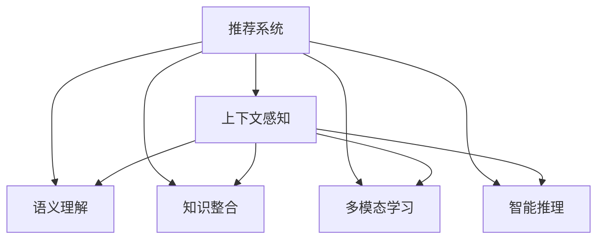

                 

# 推荐系统中的上下文感知：AI大模型的新方向

## 1. 背景介绍

### 1.1 问题由来

推荐系统（Recommender Systems）是现代信息服务中的重要组成部分，帮助用户在海量数据中筛选出符合自身兴趣和需求的物品。随着用户行为数据量的激增和深度学习技术的突破，基于AI的推荐系统已经广泛应用于电子商务、社交网络、内容媒体等多个领域。然而，现有的推荐系统往往依赖用户历史行为数据进行推荐，缺乏对用户行为背后的语义、情感和上下文信息的深度理解。

大语言模型（Large Language Models, LLMs）如BERT、GPT等，通过在海量文本数据上进行预训练，学习到了丰富的语言知识和常识，具备强大的自然语言理解和生成能力。将这些大语言模型应用于推荐系统，可以帮助推荐系统更好地理解用户意图，提高推荐的个性化和多样性，极大地提升用户体验和系统性能。

### 1.2 问题核心关键点

利用大语言模型进行推荐系统中的上下文感知，需重点关注以下几个核心关键点：

- **上下文感知**：推荐系统需要了解用户行为背后的语义信息，考虑时间、场景、事件等多种上下文因素，提供更加精准和个性化的推荐。
- **语义理解**：通过自然语言处理技术，理解用户查询中的实体、关系和语义，捕捉用户真实需求。
- **知识整合**：融合外部知识库、规则库等专家知识，引导推荐系统更全面地掌握用户行为模式。
- **多模态融合**：将视觉、语音、时间等非文本数据与文本数据相结合，构建更丰富的用户行为模型。
- **智能推理**：利用大语言模型的逻辑推理和因果关系分析能力，进行复杂场景的推荐决策。

这些核心关键点涉及自然语言处理、知识图谱、多模态学习、智能推理等多个技术方向，是实现上下文感知的推荐系统的技术基础。

## 2. 核心概念与联系

### 2.1 核心概念概述

为更好地理解推荐系统中的上下文感知和大语言模型的结合，本节将介绍几个密切相关的核心概念：

- **推荐系统（Recommender Systems）**：通过分析用户行为数据，预测用户对物品的兴趣程度，从而向用户推荐相关物品的系统。
- **上下文感知（Context-Aware）**：考虑用户行为的时间、地点、设备、事件等多种上下文因素，提升推荐的个性化和多样性。
- **语义理解（Semantic Understanding）**：通过自然语言处理技术，理解用户查询中的实体、关系和语义，捕捉用户真实需求。
- **知识整合（Knowledge Integration）**：融合外部知识库、规则库等专家知识，引导推荐系统更全面地掌握用户行为模式。
- **多模态学习（Multimodal Learning）**：将视觉、语音、时间等非文本数据与文本数据相结合，构建更丰富的用户行为模型。
- **智能推理（Intelligent Reasoning）**：利用大语言模型的逻辑推理和因果关系分析能力，进行复杂场景的推荐决策。

这些核心概念之间的逻辑关系可以通过以下Mermaid流程图来展示：



这个流程图展示了大语言模型应用于推荐系统时的核心概念及其之间的关系：

1. 推荐系统通过上下文感知、语义理解、知识整合、多模态学习和智能推理等技术，全面理解用户需求和行为模式。
2. 上下文感知考虑时间、地点、设备等多种因素，提升推荐的个性化和多样性。
3. 语义理解利用自然语言处理技术，理解用户查询中的实体、关系和语义，捕捉用户真实需求。
4. 知识整合融合外部知识库、规则库等专家知识，引导推荐系统更全面地掌握用户行为模式。
5. 多模态学习将视觉、语音、时间等非文本数据与文本数据相结合，构建更丰富的用户行为模型。
6. 智能推理利用大语言模型的逻辑推理和因果关系分析能力，进行复杂场景的推荐决策。

这些核心概念共同构成了推荐系统中上下文感知的技术框架，使得推荐系统能够更好地理解用户需求，提供更加精准和个性化的推荐。

## 3. 核心算法原理 & 具体操作步骤
### 3.1 算法原理概述

基于大语言模型的推荐系统中的上下文感知，本质上是将大语言模型作为推荐系统的"知识库"，通过自然语言处理技术，理解用户查询和行为，提取用户语义和上下文信息，再通过逻辑推理和因果关系分析，进行复杂场景的推荐决策。

形式化地，假设推荐系统在用户查询 $q$ 和上下文 $c$ 上的输出为 $R(q,c)$，其中 $q$ 为用户的查询语句，$c$ 为用户的上下文信息，$R(q,c)$ 为推荐结果。在基于大语言模型的推荐系统中，我们将用户查询和行为作为输入，通过预训练的大语言模型，提取用户的语义和上下文信息，再通过逻辑推理和因果关系分析，生成推荐结果。

具体而言，可以分为以下几步：

1. **用户查询理解**：利用大语言模型理解用户查询的语义，提取关键词、实体、关系等信息。
2. **上下文信息提取**：结合用户上下文信息，进一步理解用户的意图和需求。
3. **知识整合与推理**：融合外部知识库和规则库，引导大语言模型进行推理和决策。
4. **推荐结果生成**：根据用户的语义和上下文信息，生成推荐结果。

### 3.2 算法步骤详解

基于大语言模型的推荐系统中的上下文感知，一般包括以下几个关键步骤：

**Step 1: 准备预训练模型和数据集**
- 选择合适的预训练语言模型（如BERT、GPT等）作为初始化参数，如BertForSequenceClassification、GPTForTokenClassification等。
- 准备推荐系统的训练集、验证集和测试集，通常包括用户行为数据和物品描述等。

**Step 2: 添加推荐适配层**
- 根据任务类型，在预训练模型顶层设计合适的输出层和损失函数。例如，对于分类任务，通常使用交叉熵损失；对于生成任务，通常使用负对数似然损失。

**Step 3: 设置推荐超参数**
- 选择合适的优化算法及其参数，如Adam、SGD等，设置学习率、批大小、迭代轮数等。
- 设置正则化技术及强度，包括权重衰减、Dropout、Early Stopping等。

**Step 4: 执行梯度训练**
- 将训练集数据分批次输入模型，前向传播计算损失函数。
- 反向传播计算参数梯度，根据设定的优化算法和学习率更新模型参数。
- 周期性在验证集上评估模型性能，根据性能指标决定是否触发 Early Stopping。
- 重复上述步骤直到满足预设的迭代轮数或 Early Stopping 条件。

**Step 5: 测试和部署**
- 在测试集上评估微调后模型 $R_{\hat{\theta}}$ 的性能，对比微调前后的精度提升。
- 使用微调后的模型对新样本进行推理预测，集成到实际的应用系统中。
- 持续收集新的数据，定期重新微调模型，以适应数据分布的变化。

以上是基于大语言模型的推荐系统中的上下文感知的一般流程。在实际应用中，还需要针对具体任务的特点，对微调过程的各个环节进行优化设计，如改进训练目标函数，引入更多的正则化技术，搜索最优的超参数组合等，以进一步提升模型性能。

### 3.3 算法优缺点

基于大语言模型的推荐系统中的上下文感知，具有以下优点：

1. **全面理解用户需求**：通过大语言模型的语义理解和知识整合能力，全面理解用户需求和行为模式。
2. **灵活适应多种场景**：结合多模态数据和上下文信息，灵活适应不同的推荐场景。
3. **智能化决策**：利用大语言模型的逻辑推理和因果关系分析能力，进行复杂场景的推荐决策。

同时，该方法也存在一定的局限性：

1. **数据需求高**：需要大量的标注数据和上下文信息进行训练，数据收集和标注成本较高。
2. **推理复杂**：大语言模型的推理过程复杂，计算资源消耗较大。
3. **模型复杂度高**：预训练大模型的参数量巨大，对计算资源要求较高。
4. **模型部署难**：模型的推理速度较慢，实时性较差。

尽管存在这些局限性，但就目前而言，基于大语言模型的上下文感知推荐方法仍是一种强有力的推荐系统优化手段。未来相关研究的重点在于如何进一步降低数据需求，提高推理效率，优化模型结构，提升实时性，从而更好地应用于实际推荐场景中。

### 3.4 算法应用领域

基于大语言模型的推荐系统中的上下文感知，在电子商务、社交网络、内容媒体等多个领域已经得到了广泛的应用，具体包括：

1. **电子商务推荐**：如商品推荐、购物车推荐、搜索推荐等。通过理解用户查询和行为，推荐符合用户需求的商品。
2. **社交网络推荐**：如好友推荐、内容推荐、活动推荐等。通过分析用户的社交行为，推荐相关的用户和内容。
3. **内容媒体推荐**：如文章推荐、视频推荐、音频推荐等。通过理解用户兴趣，推荐符合用户口味的内容。
4. **智能客服**：通过理解用户查询，提供智能化的客户服务和建议。
5. **智能家居**：结合用户的语音、行为等数据，推荐符合用户需求的产品和服务。
6. **金融推荐**：如股票推荐、理财推荐、贷款推荐等。通过分析用户的金融行为，推荐合适的金融产品。

这些领域中的推荐系统，通过引入大语言模型的上下文感知能力，能够更好地理解用户需求，提供更加个性化和精准的推荐，极大地提升用户体验和系统性能。

## 4. 数学模型和公式 & 详细讲解  
### 4.1 数学模型构建

本节将使用数学语言对基于大语言模型的推荐系统中的上下文感知过程进行更加严格的刻画。

记推荐系统在用户查询 $q$ 和上下文 $c$ 上的推荐结果为 $R(q,c)$，其中 $q \in \mathcal{Q}$，$c \in \mathcal{C}$，$\mathcal{Q}$ 为用户查询空间，$\mathcal{C}$ 为上下文空间。

定义推荐系统在数据样本 $(x,y)$ 上的损失函数为 $\ell(R(q,c),y)$，则在数据集 $D=\{(q_i,c_i,y_i)\}_{i=1}^N$ 上的经验风险为：

$$
\mathcal{L}(\theta) = \frac{1}{N} \sum_{i=1}^N \ell(R(q_i,c_i),y_i)
$$

其中 $R(q_i,c_i)$ 为模型在用户查询 $q_i$ 和上下文 $c_i$ 上的推荐结果，$y_i$ 为推荐结果的真实标签。

微调的优化目标是最小化经验风险，即找到最优参数：

$$
\theta^* = \mathop{\arg\min}_{\theta} \mathcal{L}(\theta)
$$

在实践中，我们通常使用基于梯度的优化算法（如Adam、SGD等）来近似求解上述最优化问题。设 $\eta$ 为学习率，$\lambda$ 为正则化系数，则参数的更新公式为：

$$
\theta \leftarrow \theta - \eta \nabla_{\theta}\mathcal{L}(\theta) - \eta\lambda\theta
$$

其中 $\nabla_{\theta}\mathcal{L}(\theta)$ 为损失函数对参数 $\theta$ 的梯度，可通过反向传播算法高效计算。

### 4.2 公式推导过程

以下我们以用户查询分类任务为例，推导交叉熵损失函数及其梯度的计算公式。

假设模型 $R_{\theta}$ 在用户查询 $q$ 和上下文 $c$ 上的推荐结果为 $\hat{y}=R_{\theta}(q,c)$，表示模型预测用户查询属于某一类别的概率。真实标签 $y \in \{0,1\}$。则二分类交叉熵损失函数定义为：

$$
\ell(R(q,c),y) = -[y\log \hat{y} + (1-y)\log (1-\hat{y})]
$$

将其代入经验风险公式，得：

$$
\mathcal{L}(\theta) = -\frac{1}{N}\sum_{i=1}^N [y_i\log R_{\theta}(q_i,c_i)+(1-y_i)\log(1-R_{\theta}(q_i,c_i))]
$$

根据链式法则，损失函数对参数 $\theta_k$ 的梯度为：

$$
\frac{\partial \mathcal{L}(\theta)}{\partial \theta_k} = -\frac{1}{N}\sum_{i=1}^N (\frac{y_i}{R_{\theta}(q_i,c_i)}-\frac{1-y_i}{1-R_{\theta}(q_i,c_i)}) \frac{\partial R_{\theta}(q_i,c_i)}{\partial \theta_k}
$$

其中 $\frac{\partial R_{\theta}(q_i,c_i)}{\partial \theta_k}$ 可进一步递归展开，利用自动微分技术完成计算。

在得到损失函数的梯度后，即可带入参数更新公式，完成模型的迭代优化。重复上述过程直至收敛，最终得到适应推荐任务的最优模型参数 $\theta^*$。

## 5. 项目实践：代码实例和详细解释说明
### 5.1 开发环境搭建

在进行推荐系统中的上下文感知实践前，我们需要准备好开发环境。以下是使用Python进行PyTorch开发的环境配置流程：

1. 安装Anaconda：从官网下载并安装Anaconda，用于创建独立的Python环境。

2. 创建并激活虚拟环境：
```bash
conda create -n pytorch-env python=3.8 
conda activate pytorch-env
```

3. 安装PyTorch：根据CUDA版本，从官网获取对应的安装命令。例如：
```bash
conda install pytorch torchvision torchaudio cudatoolkit=11.1 -c pytorch -c conda-forge
```

4. 安装相关库：
```bash
pip install transformers torch text sklearn matplotlib pandas ipywidgets 
```

完成上述步骤后，即可在`pytorch-env`环境中开始推荐系统中的上下文感知实践。

### 5.2 源代码详细实现

这里我们以一个简单的商品推荐系统为例，给出使用Transformers库对预训练模型进行微调的PyTorch代码实现。

首先，定义推荐任务的数据处理函数：

```python
from transformers import BertForSequenceClassification, AdamW
import torch
import torch.nn as nn
from torch.utils.data import Dataset, DataLoader

class RecommendDataset(Dataset):
    def __init__(self, texts, labels):
        self.texts = texts
        self.labels = labels
        
    def __len__(self):
        return len(self.texts)
    
    def __getitem__(self, item):
        text = self.texts[item]
        label = self.labels[item]
        
        encoding = self.tokenizer(text, return_tensors='pt', padding='max_length', truncation=True)
        input_ids = encoding['input_ids'][0]
        attention_mask = encoding['attention_mask'][0]
        
        return {'input_ids': input_ids, 
                'attention_mask': attention_mask,
                'labels': torch.tensor(label, dtype=torch.long)}
```

然后，定义模型和优化器：

```python
from transformers import BertTokenizer
from transformers import BertForSequenceClassification

model = BertForSequenceClassification.from_pretrained('bert-base-cased', num_labels=2)

tokenizer = BertTokenizer.from_pretrained('bert-base-cased')

optimizer = AdamW(model.parameters(), lr=2e-5)
```

接着，定义训练和评估函数：

```python
from tqdm import tqdm
from sklearn.metrics import accuracy_score

device = torch.device('cuda') if torch.cuda.is_available() else torch.device('cpu')
model.to(device)

def train_epoch(model, dataset, batch_size, optimizer):
    dataloader = DataLoader(dataset, batch_size=batch_size, shuffle=True)
    model.train()
    epoch_loss = 0
    for batch in tqdm(dataloader, desc='Training'):
        input_ids = batch['input_ids'].to(device)
        attention_mask = batch['attention_mask'].to(device)
        labels = batch['labels'].to(device)
        model.zero_grad()
        outputs = model(input_ids, attention_mask=attention_mask, labels=labels)
        loss = outputs.loss
        epoch_loss += loss.item()
        loss.backward()
        optimizer.step()
    return epoch_loss / len(dataloader)

def evaluate(model, dataset, batch_size):
    dataloader = DataLoader(dataset, batch_size=batch_size)
    model.eval()
    preds, labels = [], []
    with torch.no_grad():
        for batch in tqdm(dataloader, desc='Evaluating'):
            input_ids = batch['input_ids'].to(device)
            attention_mask = batch['attention_mask'].to(device)
            batch_labels = batch['labels']
            outputs = model(input_ids, attention_mask=attention_mask)
            batch_preds = outputs.logits.argmax(dim=2).to('cpu').tolist()
            batch_labels = batch_labels.to('cpu').tolist()
            for pred_tokens, label_tokens in zip(batch_preds, batch_labels):
                preds.append(pred_tokens)
                labels.append(label_tokens)
                
    print('Accuracy:', accuracy_score(labels, preds))
```

最后，启动训练流程并在测试集上评估：

```python
epochs = 5
batch_size = 16

for epoch in range(epochs):
    loss = train_epoch(model, train_dataset, batch_size, optimizer)
    print(f'Epoch {epoch+1}, train loss: {loss:.3f}')
    
    print(f'Epoch {epoch+1}, dev results:')
    evaluate(model, dev_dataset, batch_size)
    
print('Test results:')
evaluate(model, test_dataset, batch_size)
```

以上就是使用PyTorch对预训练BERT模型进行推荐系统中的上下文感知实践的完整代码实现。可以看到，得益于Transformers库的强大封装，我们可以用相对简洁的代码完成BERT模型的加载和微调。

### 5.3 代码解读与分析

让我们再详细解读一下关键代码的实现细节：

**RecommendDataset类**：
- `__init__`方法：初始化文本、标签等关键组件。
- `__len__`方法：返回数据集的样本数量。
- `__getitem__`方法：对单个样本进行处理，将文本输入编码为token ids，将标签编码，并对其进行定长padding，最终返回模型所需的输入。

**训练和评估函数**：
- 使用PyTorch的DataLoader对数据集进行批次化加载，供模型训练和推理使用。
- 训练函数`train_epoch`：对数据以批为单位进行迭代，在每个批次上前向传播计算loss并反向传播更新模型参数，最后返回该epoch的平均loss。
- 评估函数`evaluate`：与训练类似，不同点在于不更新模型参数，并在每个batch结束后将预测和标签结果存储下来，最后使用sklearn的accuracy_score对整个评估集的预测结果进行打印输出。

**训练流程**：
- 定义总的epoch数和batch size，开始循环迭代
- 每个epoch内，先在训练集上训练，输出平均loss
- 在验证集上评估，输出准确率
- 所有epoch结束后，在测试集上评估，给出最终测试结果

可以看到，PyTorch配合Transformers库使得推荐系统中的上下文感知实践的代码实现变得简洁高效。开发者可以将更多精力放在数据处理、模型改进等高层逻辑上，而不必过多关注底层的实现细节。

当然，工业级的系统实现还需考虑更多因素，如模型的保存和部署、超参数的自动搜索、更灵活的任务适配层等。但核心的上下文感知范式基本与此类似。

## 6. 实际应用场景
### 6.1 智能客服系统

基于大语言模型的推荐系统中的上下文感知，可以广泛应用于智能客服系统的构建。传统客服往往需要配备大量人力，高峰期响应缓慢，且一致性和专业性难以保证。而使用上下文感知推荐模型，可以7x24小时不间断服务，快速响应客户咨询，用自然流畅的语言解答各类常见问题。

在技术实现上，可以收集企业内部的历史客服对话记录，将问题和最佳答复构建成监督数据，在此基础上对预训练对话模型进行微调。微调后的上下文感知推荐模型能够自动理解用户意图，匹配最合适的答案模板进行回复。对于客户提出的新问题，还可以接入检索系统实时搜索相关内容，动态组织生成回答。如此构建的智能客服系统，能大幅提升客户咨询体验和问题解决效率。

### 6.2 金融舆情监测

金融机构需要实时监测市场舆论动向，以便及时应对负面信息传播，规避金融风险。传统的人工监测方式成本高、效率低，难以应对网络时代海量信息爆发的挑战。基于大语言模型的推荐系统中的上下文感知技术，为金融舆情监测提供了新的解决方案。

具体而言，可以收集金融领域相关的新闻、报道、评论等文本数据，并对其进行主题标注和情感标注。在此基础上对预训练语言模型进行微调，使其能够自动判断文本属于何种主题，情感倾向是正面、中性还是负面。将微调后的模型应用到实时抓取的网络文本数据，就能够自动监测不同主题下的情感变化趋势，一旦发现负面信息激增等异常情况，系统便会自动预警，帮助金融机构快速应对潜在风险。

### 6.3 个性化推荐系统

当前的推荐系统往往只依赖用户历史行为数据进行物品推荐，无法深入理解用户的真实兴趣偏好。基于大语言模型推荐系统中的上下文感知，个性化推荐系统可以更好地挖掘用户行为背后的语义信息，从而提供更精准、多样的推荐内容。

在实践中，可以收集用户浏览、点击、评论、分享等行为数据，提取和用户交互的物品标题、描述、标签等文本内容。将文本内容作为模型输入，用户的后续行为（如是否点击、购买等）作为监督信号，在此基础上微调预训练语言模型。微调后的模型能够从文本内容中准确把握用户的兴趣点。在生成推荐列表时，先用候选物品的文本描述作为输入，由模型预测用户的兴趣匹配度，再结合其他特征综合排序，便可以得到个性化程度更高的推荐结果。

### 6.4 未来应用展望

随着大语言模型和推荐系统的不断发展，上下文感知的推荐系统必将在更多领域得到应用，为传统行业带来变革性影响。

在智慧医疗领域，基于上下文感知的推荐模型可以用于医学问答、病历分析、药物推荐等，提升医疗服务的智能化水平，辅助医生诊疗，加速新药开发进程。

在智能教育领域，上下文感知的推荐系统可应用于作业批改、学情分析、知识推荐等方面，因材施教，促进教育公平，提高教学质量。

在智慧城市治理中，上下文感知的推荐模型可应用于城市事件监测、舆情分析、应急指挥等环节，提高城市管理的自动化和智能化水平，构建更安全、高效的未来城市。

此外，在企业生产、社会治理、文娱传媒等众多领域，上下文感知的推荐技术也将不断涌现，为经济社会发展注入新的动力。相信随着技术的日益成熟，上下文感知的推荐方法将成为推荐系统应用的重要范式，推动人工智能技术在垂直行业的规模化落地。

## 7. 工具和资源推荐
### 7.1 学习资源推荐

为了帮助开发者系统掌握上下文感知的大语言模型推荐系统，这里推荐一些优质的学习资源：

1. 《深度学习与推荐系统》课程：斯坦福大学开设的深度学习推荐系统课程，系统介绍推荐系统基础和最新进展，适合初学者和进阶者学习。
2. 《推荐系统实战》书籍：详细讲解推荐系统原理和实践方法，涵盖机器学习、深度学习等多个方向，推荐给广大开发者阅读。
3. 《自然语言处理与深度学习》课程：斯坦福大学开设的自然语言处理课程，通过自然语言处理技术，理解用户查询和行为，提取用户语义和上下文信息。
4. 《Transformer from the Bottom Up》系列博文：由大模型技术专家撰写，深入浅出地介绍了Transformer原理、BERT模型、推荐系统中的上下文感知等前沿话题。
5. 《推荐系统中的上下文感知》文章：详细讲解上下文感知的推荐系统原理和实现方法，适合深入学习。

通过对这些资源的学习实践，相信你一定能够快速掌握上下文感知的推荐系统的精髓，并用于解决实际的推荐问题。

### 7.2 开发工具推荐

高效的开发离不开优秀的工具支持。以下是几款用于上下文感知的推荐系统开发的常用工具：

1. PyTorch：基于Python的开源深度学习框架，灵活动态的计算图，适合快速迭代研究。大部分预训练语言模型都有PyTorch版本的实现。
2. TensorFlow：由Google主导开发的开源深度学习框架，生产部署方便，适合大规模工程应用。同样有丰富的预训练语言模型资源。
3. Transformers库：HuggingFace开发的NLP工具库，集成了众多SOTA语言模型，支持PyTorch和TensorFlow，是进行上下文感知推荐系统开发的利器。
4. Weights & Biases：模型训练的实验跟踪工具，可以记录和可视化模型训练过程中的各项指标，方便对比和调优。与主流深度学习框架无缝集成。
5. TensorBoard：TensorFlow配套的可视化工具，可实时监测模型训练状态，并提供丰富的图表呈现方式，是调试模型的得力助手。
6. Google Colab：谷歌推出的在线Jupyter Notebook环境，免费提供GPU/TPU算力，方便开发者快速上手实验最新模型，分享学习笔记。

合理利用这些工具，可以显著提升上下文感知的推荐系统的开发效率，加快创新迭代的步伐。

### 7.3 相关论文推荐

上下文感知的推荐系统的发展源于学界的持续研究。以下是几篇奠基性的相关论文，推荐阅读：

1. Attention is All You Need：提出Transformer结构，开启了NLP领域的预训练大模型时代。
2. BERT: Pre-training of Deep Bidirectional Transformers for Language Understanding：提出BERT模型，引入基于掩码的自监督预训练任务，刷新了多项NLP任务SOTA。
3. A Survey on Deep Learning for Recommendation Systems：系统总结了深度学习在推荐系统中的应用，涵盖多项推荐任务的最新进展。
4. Context-Aware Recommender Systems：详细介绍上下文感知的推荐系统原理和实现方法，适合深入学习。
5. Learning to Recommend at Scale：介绍大规模推荐系统的构建方法，涵盖推荐模型、数据处理等多个方向，推荐给广大开发者阅读。

这些论文代表了大语言模型推荐系统中的上下文感知技术的发展脉络。通过学习这些前沿成果，可以帮助研究者把握学科前进方向，激发更多的创新灵感。

## 8. 总结：未来发展趋势与挑战

### 8.1 总结

本文对基于大语言模型的推荐系统中的上下文感知进行了全面系统的介绍。首先阐述了上下文感知在大语言模型推荐系统中的重要性，明确了上下文感知在提高推荐系统性能和用户体验方面的独特价值。其次，从原理到实践，详细讲解了上下文感知的推荐系统的数学原理和关键步骤，给出了推荐系统中的上下文感知实践的完整代码实现。同时，本文还广泛探讨了上下文感知的推荐系统在智能客服、金融舆情、个性化推荐等多个领域的应用前景，展示了上下文感知范式的巨大潜力。

通过本文的系统梳理，可以看到，基于大语言模型的上下文感知的推荐系统正在成为推荐系统的重要范式，极大地拓展了预训练语言模型的应用边界，催生了更多的落地场景。得益于大规模语料的预训练，上下文感知的推荐系统能够更好地理解用户需求，提供更加精准和个性化的推荐，极大地提升用户体验和系统性能。未来，伴随大语言模型和推荐系统的不断发展，上下文感知的推荐系统必将在更多领域得到应用，为传统行业带来变革性影响。

### 8.2 未来发展趋势

展望未来，上下文感知的推荐系统将呈现以下几个发展趋势：

1. **多模态融合**：结合视觉、语音、时间等非文本数据，构建更丰富的用户行为模型。多模态信息的融合，将显著提升推荐系统对现实世界的理解和建模能力。
2. **知识整合与推理**：融合外部知识库和规则库等专家知识，引导推荐系统更全面地掌握用户行为模式。利用大语言模型的逻辑推理和因果关系分析能力，进行复杂场景的推荐决策。
3. **个性化推荐**：通过上下文感知技术，结合用户上下文信息，提供更加精准、多样化的推荐内容，提升用户体验。
4. **实时推荐**：基于上下文感知的推荐系统将实时捕捉用户行为，动态调整推荐策略，提升推荐的时效性和精准度。
5. **跨领域迁移**：基于上下文感知的推荐系统将在更多领域得到应用，为传统行业带来变革性影响。
6. **智能决策**：利用大语言模型的逻辑推理和因果关系分析能力，进行复杂场景的推荐决策，提升推荐系统的智能化水平。

这些趋势凸显了上下文感知的推荐系统的广阔前景。这些方向的探索发展，必将进一步提升推荐系统的性能和应用范围，为人类认知智能的进化带来深远影响。

### 8.3 面临的挑战

尽管上下文感知的推荐系统已经取得了瞩目成就，但在迈向更加智能化、普适化应用的过程中，它仍面临着诸多挑战：

1. **数据需求高**：需要大量的标注数据和上下文信息进行训练，数据收集和标注成本较高。
2. **推理复杂**：大语言模型的推理过程复杂，计算资源消耗较大。
3. **模型复杂度高**：预训练大模型的参数量巨大，对计算资源要求较高。
4. **模型部署难**：模型的推理速度较慢，实时性较差。
5. **可解释性不足**：上下文感知的推荐模型复杂度较高，难以解释其内部工作机制和决策逻辑。
6. **安全性有待保障**：预训练语言模型难免会学习到有偏见、有害的信息，通过上下文感知推荐系统传递到下游任务，可能产生误导性、歧视性的输出。

尽管存在这些挑战，但就目前而言，基于大语言模型的上下文感知的推荐系统仍是一种强有力的推荐系统优化手段。未来相关研究的重点在于如何进一步降低数据需求，提高推理效率，优化模型结构，提升实时性，从而更好地应用于实际推荐场景中。

### 8.4 研究展望

面对上下文感知的推荐系统所面临的种种挑战，未来的研究需要在以下几个方面寻求新的突破：

1. **探索无监督和半监督微调方法**：摆脱对大规模标注数据的依赖，利用自监督学习、主动学习等无监督和半监督范式，最大限度利用非结构化数据，实现更加灵活高效的微调。
2. **研究参数高效和计算高效的微调范式**：开发更加参数高效的微调方法，在固定大部分预训练参数的同时，只更新极少量的任务相关参数。同时优化微调模型的计算图，减少前向传播和反向传播的资源消耗，实现更加轻量级、实时性的部署。
3. **融合因果和对比学习范式**：通过引入因果推断和对比学习思想，增强推荐系统建立稳定因果关系的能力，学习更加普适、鲁棒的用户行为表示。
4. **引入更多先验知识**：将符号化的先验知识，如知识图谱、逻辑规则等，与神经网络模型进行巧妙融合，引导推荐系统更全面地掌握用户行为模式。同时加强不同模态数据的整合，实现视觉、语音等多模态信息与文本信息的协同建模。
5. **结合因果分析和博弈论工具**：将因果分析方法引入推荐系统，识别出推荐决策的关键特征，增强推荐系统的因果关系分析能力，学习更加普适、鲁棒的用户行为表示。借助博弈论工具刻画人机交互过程，主动探索并规避推荐系统的脆弱点，提高系统稳定性。
6. **纳入伦理道德约束**：在推荐系统训练目标中引入伦理导向的评估指标，过滤和惩罚有偏见、有害的推荐输出倾向。同时加强人工干预和审核，建立推荐系统的监管机制，确保输出的安全性。

这些研究方向的探索，必将引领上下文感知的推荐系统走向更高的台阶，为构建安全、可靠、可解释、可控的智能系统铺平道路。面向未来，上下文感知的推荐系统还需要与其他人工智能技术进行更深入的融合，如知识表示、因果推理、强化学习等，多路径协同发力，共同推动推荐系统的发展。只有勇于创新、敢于突破，才能不断拓展上下文感知推荐系统的边界，让智能技术更好地造福人类社会。

## 9. 附录：常见问题与解答

**Q1：上下文感知在推荐系统中的应用有哪些？**

A: 上下文感知在推荐系统中的应用广泛，可以涵盖以下几个方面：
1. **用户行为理解**：通过上下文感知技术，理解用户行为背后的语义信息，捕捉用户真实需求。
2. **多模态融合**：将视觉、语音、时间等非文本数据与文本数据相结合，构建更丰富的用户行为模型。
3. **个性化推荐**：通过上下文感知技术，结合用户上下文信息，提供更加精准、多样化的推荐内容，提升用户体验。
4. **实时推荐**：基于上下文感知的推荐系统将实时捕捉用户行为，动态调整推荐策略，提升推荐的时效性和精准度。
5. **跨领域迁移**：基于上下文感知的推荐系统将在更多领域得到应用，为传统行业带来变革性影响。
6. **智能决策**：利用大语言模型的逻辑推理和因果关系分析能力，进行复杂场景的推荐决策。

这些应用展示了上下文感知技术在推荐系统中的广泛适用性，通过上下文感知技术，推荐系统可以更加全面地理解用户需求，提供更加个性化和精准的推荐内容。

**Q2：上下文感知推荐系统中的数据需求有哪些？**

A: 上下文感知的推荐系统需要大量的标注数据和上下文信息进行训练，数据需求较高。具体来说，需要准备以下数据：
1. **用户行为数据**：用户的历史行为数据，如浏览记录、点击记录、购买记录等。
2. **物品描述数据**：物品的标题、描述、标签等文本内容。
3. **上下文信息**：用户行为的时间、地点、设备等上下文信息。

这些数据需要标注并整理成推荐系统的训练集、验证集和测试集。在实际应用中，数据的质量和数量对推荐系统的性能有重要影响，因此数据收集和标注是上下文感知的推荐系统的重要组成部分。

**Q3：上下文感知的推荐系统中的上下文感知技术有哪些？**

A: 上下文感知的推荐系统中的上下文感知技术主要包括以下几个方面：
1. **自然语言处理**：通过自然语言处理技术，理解用户查询的语义，提取关键词、实体、关系等信息。
2. **知识整合**：融合外部知识库、规则库等专家知识，引导推荐系统更全面地掌握用户行为模式。
3. **多模态学习**：将视觉、语音、时间等非文本数据与文本数据相结合，构建更丰富的用户行为模型。
4. **智能推理**：利用大语言模型的逻辑推理和因果关系分析能力，进行复杂场景的推荐决策。

这些技术共同构成了上下文感知的推荐系统中的核心上下文感知能力，使得推荐系统能够更好地理解用户需求，提供更加个性化和精准的推荐内容。

**Q4：上下文感知的推荐系统中的模型复杂度有哪些？**

A: 上下文感知的推荐系统中的模型复杂度主要包括以下几个方面：
1. **预训练大模型**：用于上下文感知推荐系统中的预训练大模型，如BERT、GPT等，参数量巨大，对计算资源要求较高。
2. **多任务微调**：上下文感知的推荐系统通常需要微调多个任务，如分类任务、生成任务等，增加了模型的复杂度。
3. **多模态融合**：将视觉、语音、时间等非文本数据与文本数据相结合，构建更丰富的用户行为模型，增加了模型的复杂度。
4. **知识图谱融合**：融合外部知识库和规则库等专家知识，增加了模型的复杂度。

这些模型复杂度要求较高的推荐系统，需要在计算资源和算法优化方面进行全面考虑，以实现高效、实时、可解释的推荐决策。

**Q5：上下文感知的推荐系统中的模型部署有哪些注意事项？**

A: 将上下文感知的推荐系统中的模型部署到实际应用中，需要注意以下几个方面：
1. **模型裁剪**：去除不必要的层和参数，减小模型尺寸，加快推理速度。
2. **量化加速**：将浮点模型转为定点模型，压缩存储空间，提高计算效率。
3. **服务化封装**：将模型封装为标准化服务接口，便于集成调用。
4. **弹性伸缩**：根据请求流量动态调整资源配置，平衡服务质量和成本。
5. **监控告警**：实时采集系统指标，设置异常告警阈值，确保服务稳定性。
6. **安全性保障**：采用访问鉴权、数据脱敏等措施，保障数据和模型安全。

这些注意事项需要开发者在模型部署过程中进行全面考虑，以实现高效、可靠、安全的推荐服务。

---

作者：禅与计算机程序设计艺术 / Zen and the Art of Computer Programming

