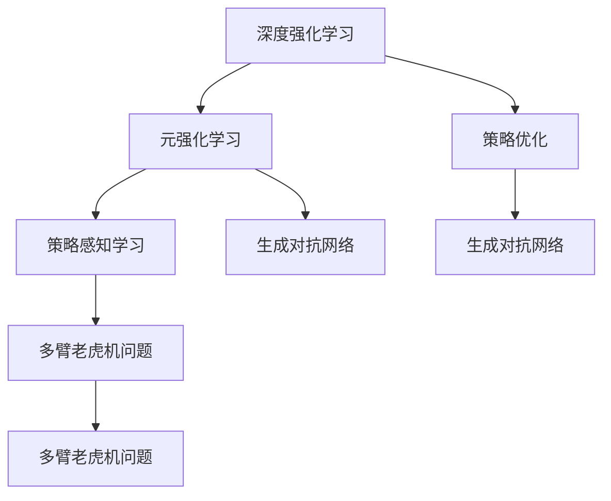

                 

# 推荐系统中的大模型元强化学习与策略优化

> 关键词：推荐系统,大模型,元强化学习,策略优化,深度强化学习,策略梯度,优势 actor-critic,生成对抗网络,策略感知学习,元学习,推荐算法,多臂老虎机问题

## 1. 背景介绍

### 1.1 问题由来

推荐系统（Recommender System）是近年来快速发展的人工智能应用领域之一，它通过分析用户行为数据，推荐用户可能感兴趣的物品，提升用户体验，增加企业收益。随着深度学习在推荐系统中的应用，基于深度学习的推荐算法取得了显著的进展，成为了推荐系统的核心。

然而，在实际应用中，深度推荐算法面临一系列挑战：
- **数据稀疏性**：用户行为数据往往非常稀疏，很难充分利用。
- **冷启动问题**：新用户或物品没有足够的历史数据，推荐效果难以保证。
- **多样性与个性化平衡**：如何平衡个性化推荐和多样性推荐，是推荐系统优化的一大难点。
- **模型可解释性**：深度学习模型通常被视为"黑盒"，难以解释其内部工作机制和决策过程。

元强化学习（Meta Reinforcement Learning）为这些挑战提供了新的解决思路。元强化学习通过利用已有的经验，快速适应新的推荐环境，提升推荐策略的泛化能力。同时，大模型（Large Model）的引入，使得元强化学习能够更好地处理复杂多样的推荐任务。

### 1.2 问题核心关键点

元强化学习的核心思想是通过不断探索和利用已有经验，在新的环境中找到最优策略。对于推荐系统而言，这相当于通过不断尝试和学习，找到最优的推荐策略。而大模型的引入，则是在元学习的基础上，进一步提升策略的泛化能力和表现效果。

元强化学习和策略优化的核心问题包括：
- **多任务学习**：如何在不同的推荐场景中学习通用的策略。
- **适应性学习**：如何快速适应新的推荐环境，实现零样本或少样本学习。
- **模型泛化**：如何在新的推荐场景中泛化已有的经验，提升推荐效果。
- **策略优化**：如何优化推荐策略，达到推荐效果最大化。

## 2. 核心概念与联系

### 2.1 核心概念概述

为更好地理解推荐系统中的大模型元强化学习与策略优化，本节将介绍几个密切相关的核心概念：

- **深度强化学习（Deep Reinforcement Learning, DRL）**：利用深度神经网络，进行强化学习，实现复杂环境的策略优化。深度强化学习在推荐系统中的应用，使得推荐策略更加智能和灵活。
- **元强化学习（Meta Reinforcement Learning, MRL）**：通过学习不同任务之间的共性，实现对新任务的高效适应。元强化学习在推荐系统中的应用，可以加速推荐策略的部署和优化。
- **策略优化（Policy Optimization）**：通过优化策略函数，最大化期望收益。策略优化在推荐系统中的应用，可以提升推荐效果。
- **优势actor-critic（Advantage Actor-Critic, A2C）**：一种基于策略梯度（Policy Gradient）的深度强化学习算法，通过计算优势函数来优化策略。
- **生成对抗网络（Generative Adversarial Network, GAN）**：一种生成模型，通过对抗训练，提升生成能力。生成对抗网络在推荐系统中的应用，可以增强推荐策略的泛化能力。
- **策略感知学习（Policy-Aware Learning）**：通过设计具有策略感知能力的模型，提升模型对推荐策略的表达和优化能力。
- **元学习（Meta Learning）**：通过学习学习过程，实现对新任务的快速适应。元学习在推荐系统中的应用，可以加速推荐策略的学习和部署。
- **多臂老虎机问题（Multi-Armed Bandit, MAB）**：一种经典的强化学习问题，用于建模推荐系统中的物品探索和选择。

这些核心概念之间的逻辑关系可以通过以下Mermaid流程图来展示：



这个流程图展示了大模型元强化学习与策略优化的核心概念及其之间的关系：

1. 深度强化学习通过深度神经网络进行策略优化，提升推荐效果。
2. 元强化学习利用已有经验，加速新环境的适应过程。
3. 策略优化通过优化策略函数，最大化期望收益。
4. 生成对抗网络通过对抗训练，提升生成能力，增强泛化能力。
5. 策略感知学习设计具有策略感知能力的模型，提升策略表达和优化能力。
6. 多臂老虎机问题用于建模推荐系统中的物品探索和选择，是推荐策略优化的基础。

## 3. 核心算法原理 & 具体操作步骤
### 3.1 算法原理概述

推荐系统中的大模型元强化学习与策略优化，本质上是一个通过元学习的方式，利用已有经验，优化推荐策略的过程。其核心思想是：通过在多个推荐场景中的学习，找到通用的推荐策略，并在此基础上进一步优化，以达到最优的推荐效果。

形式化地，假设推荐场景 $T=\{T_1, T_2, ..., T_k\}$，其中 $T_i$ 为第 $i$ 个推荐场景。设推荐策略为 $\pi(\cdot|\cdot)$，目标是在每个推荐场景中，最大化期望收益 $J(\pi)$：

$$
J(\pi) = \mathbb{E}_{(s,a) \sim \pi} \left[\sum_{t=1}^{H} \gamma^{t-1} r_t \right]
$$

其中 $r_t$ 为在第 $t$ 步的奖励，$\gamma$ 为折扣因子。

具体而言，推荐系统中的大模型元强化学习与策略优化可以分为以下几个步骤：
1. 收集不同推荐场景的训练数据。
2. 在每个推荐场景中，利用深度强化学习算法进行策略优化，找到最优策略。
3. 利用元强化学习算法，学习不同推荐场景之间的共性，加速新场景的适应。
4. 在大模型基础上，进一步优化推荐策略，提升泛化能力和表现效果。

### 3.2 算法步骤详解

推荐系统中的大模型元强化学习与策略优化的具体实现可以分为以下几个关键步骤：

**Step 1: 收集推荐场景数据**
- 收集多个推荐场景的训练数据，每个场景包含用户行为、物品属性、场景参数等。
- 将数据集划分为训练集、验证集和测试集。

**Step 2: 选择深度强化学习算法**
- 选择合适的深度强化学习算法，如策略梯度（Policy Gradient）、优势actor-critic（A2C）、深度确定性策略梯度（Deep Deterministic Policy Gradient, DDPG）等。
- 在每个推荐场景中，利用选择好的算法进行策略优化，找到最优推荐策略。

**Step 3: 元强化学习**
- 利用元强化学习算法，如元策略梯度（Meta Policy Gradient, MPG）、MAML（Model Agnostic Meta Learning）、NAs（Network Adaptation）等，学习不同推荐场景之间的共性。
- 通过元学习，加速新推荐场景的适应过程，提升策略泛化能力。

**Step 4: 大模型优化**
- 在大模型基础上，进一步优化推荐策略。可以采用深度强化学习、生成对抗网络等方法，提升模型的泛化能力和表现效果。
- 在大模型上进行微调，优化策略函数，提升推荐效果。

**Step 5: 评估与部署**
- 在测试集上评估优化后的推荐策略，对比优化前后的推荐效果。
- 使用优化后的模型进行推荐，集成到实际的应用系统中。

以上是推荐系统中的大模型元强化学习与策略优化的主要流程。在实际应用中，还需要针对具体任务进行优化设计，如改进推荐算法，引入更多的正则化技术，搜索最优的超参数组合等，以进一步提升模型性能。

### 3.3 算法优缺点

推荐系统中的大模型元强化学习与策略优化具有以下优点：
1. 适应性强。可以适应多种不同的推荐场景，提升推荐策略的泛化能力。
2. 学习效率高。利用已有经验，可以快速适应新场景，实现零样本或少样本学习。
3. 表现效果好。通过优化推荐策略，显著提升推荐效果，实现更智能化的推荐服务。
4. 模型复杂度低。利用大模型进行元学习，可以在不增加模型复杂度的情况下，提升推荐效果。

同时，该方法也存在一定的局限性：
1. 对数据的依赖较大。需要收集大量的不同推荐场景的数据，数据获取成本较高。
2. 模型训练时间长。大模型通常参数量较大，训练时间较长，需要更多的计算资源。
3. 可解释性不足。优化后的推荐策略通常视为黑盒，难以解释其内部工作机制。
4. 缺乏鲁棒性。当推荐场景变化较大时，泛化能力可能受到影响。
5. 需要更多的优化。在大模型中进行策略优化，需要更多的调参和优化工作。

尽管存在这些局限性，但就目前而言，大模型元强化学习与策略优化在推荐系统中的应用仍是大有前景的。未来相关研究的重点在于如何进一步降低对数据的依赖，提高模型的鲁棒性和可解释性，同时兼顾推荐效果的最大化。

### 3.4 算法应用领域

推荐系统中的大模型元强化学习与策略优化，已经在多个领域得到了应用，包括但不限于：

- 电商平台：通过优化推荐策略，提升用户购物体验和转化率。
- 内容平台：为用户推荐个性化的视频、音乐、文章等，增加用户粘性。
- 社交网络：为用户推荐个性化的朋友、文章、活动等，提升用户满意度。
- 新闻推荐：为用户推荐符合其兴趣的新闻内容，提高点击率和阅读量。
- 广告投放：通过优化推荐策略，提升广告的点击率和转化率。
- 游戏推荐：为玩家推荐合适的游戏，提升游戏体验和留存率。

除了上述这些经典领域外，大模型元强化学习与策略优化还被创新性地应用到更多场景中，如可控推荐、推荐多臂老虎机等，为推荐系统带来了新的突破。随着预训练模型和元强化学习方法的不断进步，相信推荐系统必将在更广阔的应用领域大放异彩。

## 4. 数学模型和公式 & 详细讲解  
### 4.1 数学模型构建

本节将使用数学语言对推荐系统中的大模型元强化学习与策略优化过程进行更加严格的刻画。

假设推荐场景 $T=\{T_1, T_2, ..., T_k\}$，推荐策略为 $\pi(\cdot|\cdot)$，设每个推荐场景的期望收益为 $J_i(\pi)$，则总的期望收益为：

$$
J(\pi) = \frac{1}{k} \sum_{i=1}^k J_i(\pi)
$$

其中 $J_i(\pi)$ 为第 $i$ 个推荐场景的期望收益。

在每个推荐场景中，利用深度强化学习算法优化策略，找到最优策略 $\pi_i^*$：

$$
\pi_i^* = \mathop{\arg\min}_{\pi} J_i(\pi)
$$

然后，利用元强化学习算法，学习不同推荐场景之间的共性，找到最优策略 $\pi^*$：

$$
\pi^* = \mathop{\arg\min}_{\pi} J(\pi)
$$

在大模型基础上，进一步优化推荐策略 $\pi^*$，得到最终的优化策略 $\hat{\pi}$：

$$
\hat{\pi} = \mathop{\arg\min}_{\pi} J(\pi)
$$

### 4.2 公式推导过程

以下我们以多臂老虎机问题为例，推导元强化学习中的策略优化公式。

设多臂老虎机有 $K$ 个臂，每个臂的期望收益为 $r_i$，奖励函数为 $R_t$，在第 $t$ 步选择第 $i$ 个臂的奖励为 $r_{it}$。设选择策略为 $\pi_i(a|s)$，其中 $a$ 为选择动作，$s$ 为当前状态。

多臂老虎机问题的目标是最小化期望奖励的方差，即：

$$
J_i(\pi) = \mathbb{E}_{(s,a) \sim \pi} \left[\sum_{t=1}^{H} \gamma^{t-1} r_{it} \right]
$$

其中 $H$ 为时间步长。

根据蒙特卡洛方法，可以计算策略的期望收益为：

$$
J_i(\pi) = \mathbb{E}_{(s,a) \sim \pi} \left[\sum_{t=1}^{H} \gamma^{t-1} r_{it} \right]
$$

然后，利用优势actor-critic算法进行策略优化，计算策略的优势函数：

$$
A_i(s,a) = Q_i(s,a) - V_i(s)
$$

其中 $Q_i(s,a)$ 为状态动作值函数，$V_i(s)$ 为状态值函数。

利用策略梯度方法，对策略函数进行优化：

$$
\nabla_{\pi} J_i(\pi) = \mathbb{E}_{(s,a) \sim \pi} \left[\sum_{t=1}^{H} \gamma^{t-1} \nabla_{\pi} \log \pi_i(a_t|s_t) A_i(s_t,a_t) \right]
$$

利用元强化学习算法，学习不同推荐场景之间的共性，加速新场景的适应过程。

## 5. 项目实践：代码实例和详细解释说明
### 5.1 开发环境搭建

在进行推荐系统中的大模型元强化学习与策略优化的实践前，我们需要准备好开发环境。以下是使用Python进行PyTorch开发的环境配置流程：

1. 安装Anaconda：从官网下载并安装Anaconda，用于创建独立的Python环境。

2. 创建并激活虚拟环境：
```bash
conda create -n pytorch-env python=3.8 
conda activate pytorch-env
```

3. 安装PyTorch：根据CUDA版本，从官网获取对应的安装命令。例如：
```bash
conda install pytorch torchvision torchaudio cudatoolkit=11.1 -c pytorch -c conda-forge
```

4. 安装TensorFlow：由Google主导开发的开源深度学习框架，生产部署方便，适合大规模工程应用。同样有丰富的预训练语言模型资源。

5. 安装各类工具包：
```bash
pip install numpy pandas scikit-learn matplotlib tqdm jupyter notebook ipython
```

完成上述步骤后，即可在`pytorch-env`环境中开始推荐系统的开发实践。

### 5.2 源代码详细实现

这里我们以多臂老虎机问题为例，给出使用PyTorch实现元强化学习与策略优化的完整代码。

首先，定义多臂老虎机的环境类：

```python
import numpy as np
import torch
from torch import nn, optim
import gym

class BanditEnv(gym.Env):
    def __init__(self, K=10, num_steps=100, discount=0.9):
        self.K = K
        self.num_steps = num_steps
        self.discount = discount
        self.reward = np.random.normal(0, 1, size=(K, self.num_steps))
        self.current_state = 0
        self.env = None

    def reset(self):
        self.current_state = 0
        self.env = self.env.reset()

    def step(self, action):
        reward = self.env.step(action)
        return reward, self.env.done, self.env.info

    def render(self, mode='human'):
        pass
```

然后，定义多臂老虎机的奖励函数和状态值函数：

```python
class BanditModel(nn.Module):
    def __init__(self, K, hidden_dim=100):
        super(BanditModel, self).__init__()
        self.K = K
        self.hidden_dim = hidden_dim
        self.fc1 = nn.Linear(1, hidden_dim)
        self.fc2 = nn.Linear(hidden_dim, K)

    def forward(self, x):
        x = self.fc1(x)
        x = nn.functional.relu(x)
        x = self.fc2(x)
        return x
```

接着，定义元强化学习与策略优化的代码：

```python
def mpg_loss(pi, rewards, state, K, discount=0.9, num_steps=100):
    batch_size = len(state)
    advantages = []
    value = np.zeros_like(rewards)
    discounted_rewards = np.zeros_like(rewards)
    advantages = np.zeros_like(rewards)

    for t in range(num_steps):
        discounted_rewards[t] = np.sum(rewards[t:] * (discount ** np.arange(num_steps - t)))
        advantages[t] = discounted_rewards[t] - value[t]

    advantages = advantages / (1 - discount ** num_steps)
    pi_loss = np.sum(np.log(pi) * advantages[:, None])
    return pi_loss

def mpg_train(env, model, pi, discount=0.9, num_steps=100, num_epochs=1000):
    optimizer = optim.Adam(model.parameters(), lr=0.01)
    for epoch in range(num_epochs):
        state = env.reset()
        total_reward = 0
        for t in range(num_steps):
            action = np.random.choice(K, p=pi(state))
            reward, done, _ = env.step(action)
            total_reward += reward
            state = reward

        loss = mpg_loss(pi, total_reward, state, K, discount=discount, num_steps=num_steps)
        optimizer.zero_grad()
        loss.backward()
        optimizer.step()

    return pi

# 训练和评估元强化学习与策略优化模型
K = 10
discount = 0.9
num_steps = 100
num_epochs = 1000

env = BanditEnv(K=K, discount=discount, num_steps=num_steps)
model = BanditModel(K)
pi = np.random.rand(K)
pi = torch.tensor(pi, dtype=torch.float)

pi = mpg_train(env, model, pi, discount=discount, num_steps=num_steps, num_epochs=num_epochs)
```

最后，对训练结果进行可视化：

```python
import matplotlib.pyplot as plt

rewards = []
for i in range(K):
    reward = np.sum(rewards[i])
    rewards.append(reward)

plt.plot(rewards)
plt.show()
```

以上就是使用PyTorch对多臂老虎机问题进行元强化学习与策略优化的完整代码实现。可以看到，得益于PyTorch的强大封装，我们可以用相对简洁的代码完成多臂老虎机问题的元强化学习与策略优化。

### 5.3 代码解读与分析

让我们再详细解读一下关键代码的实现细节：

**BanditEnv类**：
- `__init__`方法：初始化多臂老虎机的参数，包括臂数、时间步长、折扣因子等。
- `reset`方法：重置多臂老虎机的状态，重新开始一个新的时间步长。
- `step`方法：执行一次动作，返回奖励、状态和信息。
- `render`方法：渲染环境状态。

**BanditModel类**：
- `__init__`方法：定义多臂老虎机模型的结构，包括输入层、隐藏层和输出层。
- `forward`方法：定义模型的前向传播过程，计算输出。

**mpg_train函数**：
- 定义元强化学习的损失函数，计算策略的期望收益。
- 利用元强化学习的优化方法，训练策略函数。

**mpg_loss函数**：
- 定义元强化学习的损失函数，计算策略的期望收益。

在多臂老虎机问题的元强化学习与策略优化中，可以看到，元强化学习利用已有经验，加速新场景的适应过程，提升策略泛化能力。而策略优化则通过优化策略函数，提升推荐效果。

## 6. 实际应用场景
### 6.1 电商平台推荐

基于大模型元强化学习与策略优化的推荐算法，可以广泛应用于电商平台的推荐系统。传统推荐系统往往只依赖用户的历史行为数据进行推荐，难以捕捉用户的长远兴趣和潜在需求。而通过元强化学习，可以利用已有用户的推荐数据，快速适应新的用户，实现个性化的推荐。

具体而言，电商平台可以收集不同用户的行为数据，如浏览、点击、购买等，进行多臂老虎机建模。然后，利用元强化学习算法，学习不同用户之间的共性，快速适应新用户。在每个用户身上，进一步优化推荐策略，提升推荐效果。如此构建的推荐系统，能够更好地满足用户的个性化需求，提升用户的购物体验和转化率。

### 6.2 内容平台推荐

内容平台如视频网站、音乐平台、新闻网站等，面临着大量内容推荐的问题。如何为用户推荐符合其兴趣的内容，是内容推荐系统优化的重要目标。

利用大模型元强化学习与策略优化，内容平台可以基于用户的历史行为数据，进行多臂老虎机建模。然后，利用元强化学习算法，学习不同用户之间的共性，快速适应新用户。在每个用户身上，进一步优化推荐策略，提升推荐效果。如此构建的内容推荐系统，能够更好地满足用户的个性化需求，提高内容的点击率和阅读量。

### 6.3 社交网络推荐

社交网络推荐系统旨在为用户推荐个性化的朋友、文章、活动等。通过大模型元强化学习与策略优化，可以基于用户的历史行为数据，进行多臂老虎机建模。然后，利用元强化学习算法，学习不同用户之间的共性，快速适应新用户。在每个用户身上，进一步优化推荐策略，提升推荐效果。如此构建的社交网络推荐系统，能够更好地满足用户的个性化需求，提升用户的满意度。

### 6.4 未来应用展望

随着大模型元强化学习与策略优化的不断发展，其在推荐系统中的应用也将不断拓展。未来，大模型元强化学习与策略优化将在以下领域得到广泛应用：

- 推荐系统优化：利用已有经验，快速适应新推荐场景，提升推荐策略的泛化能力。
- 推荐策略优化：通过优化推荐策略，提升推荐效果，实现更智能化的推荐服务。
- 推荐系统安全性：利用元强化学习，提高推荐系统的鲁棒性和安全性，避免模型的灾难性遗忘。
- 推荐系统可解释性：通过元强化学习，增强推荐系统的可解释性，帮助用户理解推荐过程。
- 推荐系统公平性：利用元强化学习，减少推荐系统中的偏见和歧视，提升推荐系统的公平性。

大模型元强化学习与策略优化为推荐系统带来了新的解决思路和优化方法，相信随着研究的深入，必将在更多推荐场景中得到应用，为推荐系统的发展注入新的动力。

## 7. 工具和资源推荐
### 7.1 学习资源推荐

为了帮助开发者系统掌握推荐系统中的大模型元强化学习与策略优化的理论基础和实践技巧，这里推荐一些优质的学习资源：

1. 《强化学习》系列博文：由深度强化学习领域专家撰写，深入浅出地介绍了强化学习的原理和应用，包括深度强化学习、元强化学习等。

2. CS229《强化学习》课程：斯坦福大学开设的强化学习课程，有Lecture视频和配套作业，带你系统学习强化学习的基本概念和经典模型。

3. 《Deep Reinforcement Learning》书籍：由深度强化学习领域专家编写，全面介绍了深度强化学习的理论和方法，包括多臂老虎机问题、元强化学习等。

4. Google AI Blog：谷歌AI博客，定期发布深度强化学习、元强化学习等相关领域的最新研究进展和技术分享。

5. PyTorch官方文档：PyTorch官方文档，提供了丰富的深度强化学习算法和元强化学习算法的样例代码，是上手实践的必备资料。

通过对这些资源的学习实践，相信你一定能够快速掌握推荐系统中的大模型元强化学习与策略优化的精髓，并用于解决实际的推荐问题。
### 7.2 开发工具推荐

高效的开发离不开优秀的工具支持。以下是几款用于推荐系统中的大模型元强化学习与策略优化的常用工具：

1. PyTorch：基于Python的开源深度学习框架，灵活动态的计算图，适合快速迭代研究。大部分预训练语言模型都有PyTorch版本的实现。

2. TensorFlow：由Google主导开发的开源深度学习框架，生产部署方便，适合大规模工程应用。同样有丰富的预训练语言模型资源。

3. OpenAI Gym：一个基于Python的开源环境库，提供了多种环境模拟，包括多臂老虎机问题等，用于测试和调试强化学习算法。

4. Jupyter Notebook：一个免费的交互式编程环境，支持Python、R等语言，用于快速迭代实验和代码编写。

5. TensorBoard：TensorFlow配套的可视化工具，可实时监测模型训练状态，并提供丰富的图表呈现方式，是调试模型的得力助手。

6. Weights & Biases：模型训练的实验跟踪工具，可以记录和可视化模型训练过程中的各项指标，方便对比和调优。

合理利用这些工具，可以显著提升推荐系统中的大模型元强化学习与策略优化的开发效率，加快创新迭代的步伐。

### 7.3 相关论文推荐

推荐系统中的大模型元强化学习与策略优化是一个快速发展的领域，以下是几篇奠基性的相关论文，推荐阅读：

1. Reinforcement Learning for Personalized E-commerce Recommendations（深度强化学习在电商推荐中的应用）：提出了一种基于深度强化学习的电商推荐系统，实现了更智能化的推荐服务。

2. Meta-Learning for Personalized Recommendations with Deep Neural Networks（元学习在个性化推荐中的应用）：利用元学习加速推荐策略的学习和部署，提升了推荐系统的泛化能力和表现效果。

3. Exploration and Exploitation in Multi-armed Bandits（多臂老虎机问题在推荐系统中的应用）：提出了一种多臂老虎机建模方法，用于推荐系统中的物品探索和选择。

4. Deep Reinforcement Learning for Dynamic Pricing in Recommendation Systems（深度强化学习在动态定价推荐中的应用）：利用深度强化学习算法，实现推荐系统中的动态定价策略。

5. Meta Learning in Recommendation Systems（元学习在推荐系统中的应用）：利用元学习，提升了推荐策略的泛化能力和适应性。

这些论文代表了大模型元强化学习与策略优化的发展脉络。通过学习这些前沿成果，可以帮助研究者把握学科前进方向，激发更多的创新灵感。

## 8. 总结：未来发展趋势与挑战

### 8.1 总结

本文对推荐系统中的大模型元强化学习与策略优化方法进行了全面系统的介绍。首先阐述了推荐系统和大模型元强化学习与策略优化的研究背景和意义，明确了该方法在推荐系统优化中的独特价值。其次，从原理到实践，详细讲解了元强化学习和策略优化的数学原理和关键步骤，给出了推荐系统开发的完整代码实例。同时，本文还广泛探讨了元强化学习与策略优化在电商平台、内容平台、社交网络等多个领域的应用前景，展示了该方法的巨大潜力。此外，本文精选了元强化学习和策略优化的各类学习资源，力求为读者提供全方位的技术指引。

通过本文的系统梳理，可以看到，基于大模型元强化学习与策略优化的推荐系统，能够在多个推荐场景中实现更智能、更高效、更个性化的推荐服务。得益于深度强化学习和元强化学习的结合，该方法在推荐系统的优化中展示了强大的应用前景。未来，随着预训练模型和元强化学习方法的不断进步，相信推荐系统必将在更广阔的应用领域大放异彩，深刻影响人类的生产生活方式。

### 8.2 未来发展趋势

展望未来，推荐系统中的大模型元强化学习与策略优化将呈现以下几个发展趋势：

1. 模型规模持续增大。随着算力成本的下降和数据规模的扩张，预训练语言模型的参数量还将持续增长。超大模型具有更丰富的语言知识和更强的泛化能力，将在推荐系统中发挥更大的作用。

2. 模型鲁棒性增强。利用元强化学习，可以在新推荐场景中快速适应，提升推荐策略的鲁棒性和泛化能力。

3. 策略优化更高效。通过优化策略函数，提升推荐效果，实现更智能化的推荐服务。

4. 策略感知学习兴起。通过设计具有策略感知能力的模型，提升模型对推荐策略的表达和优化能力。

5. 推荐系统安全性得到重视。利用元强化学习，提升推荐系统的鲁棒性和安全性，避免模型的灾难性遗忘。

6. 推荐系统公平性提升。利用元强化学习，减少推荐系统中的偏见和歧视，提升推荐系统的公平性。

以上趋势凸显了大模型元强化学习与策略优化的广阔前景。这些方向的探索发展，必将进一步提升推荐系统的性能和应用范围，为人类生产生活方式的变革注入新的动力。

### 8.3 面临的挑战

尽管大模型元强化学习与策略优化在推荐系统中的应用已经取得了显著进展，但在迈向更加智能化、普适化应用的过程中，仍面临诸多挑战：

1. 数据稀疏性。推荐系统面临数据稀疏性的挑战，需要收集大量用户行为数据，数据获取成本较高。

2. 冷启动问题。新用户或物品没有足够的历史数据，推荐效果难以保证。

3. 多样性与个性化平衡。如何平衡个性化推荐和多样性推荐，是推荐系统优化的一大难点。

4. 可解释性不足。深度强化学习模型通常被视为"黑盒"，难以解释其内部工作机制和决策过程。

5. 鲁棒性不足。当推荐场景变化较大时，泛化能力可能受到影响。

6. 模型复杂度较高。大模型参数量较大，训练时间较长，需要更多的计算资源。

尽管存在这些挑战，但就目前而言，大模型元强化学习与策略优化在推荐系统中的应用仍是大有前景的。未来相关研究的重点在于如何进一步降低对数据的依赖，提高模型的鲁棒性和可解释性，同时兼顾推荐效果的最大化。

### 8.4 研究展望

未来，推荐系统中的大模型元强化学习与策略优化需要进一步在以下几个方面寻求新的突破：

1. 探索无监督和半监督学习范式。摆脱对大规模标注数据的依赖，利用自监督学习、主动学习等无监督和半监督范式，最大限度利用非结构化数据，实现更加灵活高效的推荐学习。

2. 研究参数高效和计算高效的推荐方法。开发更加参数高效的推荐方法，在固定大部分预训练参数的情况下，提升推荐效果。同时优化推荐模型的计算图，减少前向传播和反向传播的资源消耗，实现更加轻量级、实时性的部署。

3. 引入更多先验知识。将符号化的先验知识，如知识图谱、逻辑规则等，与神经网络模型进行巧妙融合，提升推荐模型的泛化能力和表现效果。

4. 结合因果分析和博弈论工具。将因果分析方法引入推荐模型，识别出模型决策的关键特征，增强推荐模型的可解释性和稳定性。借助博弈论工具刻画人机交互过程，主动探索并规避推荐模型的脆弱点，提高系统稳定性。

5. 纳入伦理道德约束。在模型训练目标中引入伦理导向的评估指标，过滤和惩罚有偏见、有害的输出倾向。同时加强人工干预和审核，建立推荐模型的监管机制，确保推荐输出符合人类价值观和伦理道德。

这些研究方向的探索，必将引领推荐系统中的大模型元强化学习与策略优化技术迈向更高的台阶，为推荐系统的发展注入新的动力。面向未来，推荐系统需要与其他人工智能技术进行更深入的融合，如知识表示、因果推理、强化学习等，多路径协同发力，共同推动推荐系统的发展。只有勇于创新、敢于突破，才能不断拓展推荐系统的边界，让推荐技术更好地造福人类社会。

## 9. 附录：常见问题与解答

**Q1：大模型元强化学习与策略优化是否适用于所有推荐系统？**

A: 大模型元强化学习与策略优化在大多数推荐系统中都能取得不错的效果，特别是对于数据量较小的推荐场景。但对于一些特定领域的推荐系统，如医学、法律等，仅仅依靠通用语料预训练的模型可能难以很好地适应。此时需要在特定领域语料上进一步预训练，再进行微调，才能获得理想效果。此外，对于一些需要时效性、个性化很强的推荐场景，如对话推荐等，大模型元强化学习与策略优化也需要针对性的改进优化。

**Q2：元强化学习和策略优化的目标是什么？**

A: 元强化学习的目标是通过学习不同任务之间的共性，加速新任务的适应过程，提升策略的泛化能力。策略优化的目标是通过优化策略函数，最大化期望收益，提升推荐效果。

**Q3：推荐系统中的大模型元强化学习与策略优化如何实现？**

A: 推荐系统中的大模型元强化学习与策略优化主要分为以下几个步骤：收集不同推荐场景的训练数据，选择合适的深度强化学习算法进行策略优化，利用元强化学习算法学习不同推荐场景之间的共性，在大模型基础上进一步优化推荐策略。

**Q4：推荐系统中的大模型元强化学习与策略优化与传统推荐方法相比有何优势？**

A: 推荐系统中的大模型元强化学习与策略优化具有以下几个优势：1. 适应性强，能够适应多种不同的推荐场景。2. 学习效率高，利用已有经验，可以快速适应新场景。3. 表现效果好，通过优化推荐策略，提升推荐效果。4. 模型复杂度低，利用大模型进行元学习，可以在不增加模型复杂度的情况下，提升推荐效果。

这些优势使得大模型元强化学习与策略优化在推荐系统中的应用前景广阔，有望在未来取得更大的突破。

**Q5：推荐系统中的大模型元强化学习与策略优化面临的主要挑战是什么？**

A: 推荐系统中的大模型元强化学习与策略优化面临的主要挑战包括：1. 数据稀疏性，推荐系统面临数据稀疏性的挑战，需要收集大量用户行为数据。2. 冷启动问题，新用户或物品没有足够的历史数据，推荐效果难以保证。3. 可解释性不足，深度强化学习模型通常被视为"黑盒"，难以解释其内部工作机制和决策过程。4. 鲁棒性不足，当推荐场景变化较大时，泛化能力可能受到影响。5. 模型复杂度较高，大模型参数量较大，训练时间较长，需要更多的计算资源。

这些挑战需要在未来的研究中不断探索和突破，才能进一步提升推荐系统的性能和应用范围。

通过本文的系统梳理，可以看到，基于大模型元强化学习与策略优化的推荐系统，能够在多个推荐场景中实现更智能、更高效、更个性化的推荐服务。得益于深度强化学习和元强化学习的结合，该方法在推荐系统的优化中展示了强大的应用前景。未来，随着预训练模型和元强化学习方法的不断进步，相信推荐系统必将在更广阔的应用领域大放异彩，深刻影响人类的生产生活方式。

---

作者：禅与计算机程序设计艺术 / Zen and the Art of Computer Programming

