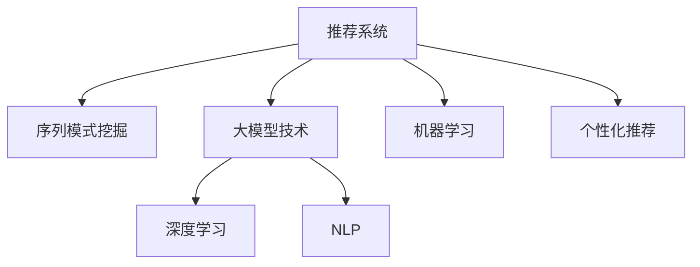

                 

# 推荐系统中的序列模式挖掘：大模型技术

> 关键词：推荐系统,序列模式挖掘,大模型技术,深度学习,机器学习,自然语言处理

## 1. 背景介绍

### 1.1 问题由来
推荐系统（Recommender System）是当前互联网应用中的重要技术，广泛应用在电商、视频、音乐等多个领域。传统的推荐系统通常基于用户历史行为进行个性化推荐，但面临以下挑战：
- 冷启动问题：对于新用户或新商品，推荐系统难以获得足够的行为数据，无法进行有效的推荐。
- 数据稀疏性：用户的在线行为数据往往稀疏，难以捕捉到完整的行为模式。
- 动态性：用户的兴趣和行为随时变化，需要推荐系统能够及时调整推荐策略。
- 多样性：用户对推荐内容的多样性需求，使得单一推荐策略难以满足所有用户。

为了应对这些挑战，近年来，推荐系统开始向更为高级的推荐范式演化。其中，序列模式挖掘（Sequential Pattern Mining）和大模型技术在推荐系统中的应用尤为引人关注。本文将系统性地介绍这两种技术，并结合实际案例探讨其应用前景。

### 1.2 问题核心关键点
序列模式挖掘和大模型技术在推荐系统中的应用，主要涉及以下几个核心关键点：
- **序列模式挖掘**：通过挖掘用户行为序列中的模式，如点击序列、浏览序列等，可以构建用户兴趣模型，预测用户未来行为。
- **大模型技术**：通过预训练大模型获得通用的语言或行为表示，可以在特定任务上通过微调进一步优化，提升推荐效果。
- **深度学习和机器学习**：深度学习可以更好地捕捉复杂的非线性关系，而机器学习可以提供更为灵活的模型和算法。
- **自然语言处理（NLP）**：NLP技术在用户评论、产品描述等文本数据的处理中具有天然优势，能够提供更丰富的用户行为特征。

这些关键技术相互配合，可以构建更为精准、高效的推荐系统，为用户带来更好的体验。

### 1.3 问题研究意义
研究推荐系统中的序列模式挖掘和大模型技术，对于提升推荐系统的效果和用户体验，推动互联网产业的发展，具有重要意义：
- **提升推荐效果**：通过序列模式挖掘和大模型技术，推荐系统能够更好地捕捉用户兴趣和行为模式，提供更个性化的推荐内容。
- **降低成本**：相比于传统的基于规则的推荐方法，深度学习和模型优化可以显著降低开发和运营成本。
- **增强灵活性**：大模型技术提供了丰富的语言和行为特征，可以适应更多种类的推荐任务。
- **提高用户体验**：通过个性化推荐，用户能够更快地发现感兴趣的物品，提升满意度和忠诚度。
- **促进创新**：推荐系统的创新应用可以开拓新的商业模式，推动互联网生态的进一步繁荣。

## 2. 核心概念与联系

### 2.1 核心概念概述

为更好地理解序列模式挖掘和大模型技术在推荐系统中的应用，本节将介绍几个密切相关的核心概念：

- **推荐系统**：通过分析用户历史行为数据，预测用户未来的兴趣和需求，为用户推荐个性化物品的系统。
- **序列模式挖掘**：从序列数据中挖掘出频繁出现的模式，如点击序列、浏览序列等，用于预测用户未来行为。
- **大模型技术**：通过大规模无标签数据预训练通用语言或行为表示，在特定任务上进行微调，提升模型性能。
- **深度学习**：一种基于神经网络的机器学习方法，能够处理复杂的非线性关系，提高模型的表达能力。
- **自然语言处理（NLP）**：通过机器学习技术处理和分析自然语言，提取丰富的语义和语法信息，用于用户行为建模。

这些核心概念之间的逻辑关系可以通过以下Mermaid流程图来展示：



这个流程图展示了大模型技术在推荐系统中的应用流程：

1. 推荐系统收集用户行为数据，构建用户兴趣模型。
2. 序列模式挖掘从行为数据中挖掘模式，预测用户未来行为。
3. 大模型技术通过预训练和微调，获取通用的语言或行为表示。
4. 深度学习提供强大的模型表达能力，优化模型性能。
5. NLP技术处理文本数据，提取丰富的用户行为特征。
6. 机器学习提供灵活的模型选择和算法优化，提升推荐效果。

这些概念共同构成了推荐系统的核心框架，使其能够为用户提供更为精准、个性化的推荐服务。

## 3. 核心算法原理 & 具体操作步骤
### 3.1 算法原理概述

推荐系统中的序列模式挖掘和大模型技术，本质上是一个深度学习和机器学习的过程。其核心思想是：通过序列模式挖掘获取用户行为模式，构建用户兴趣模型；通过大模型技术预训练和微调，提升模型在特定任务上的性能。

形式化地，假设推荐系统收集到用户的历史行为数据 $\{(x_i,y_i)\}_{i=1}^N$，其中 $x_i$ 表示用户的行为序列，$y_i$ 表示用户的兴趣标签。推荐系统的目标是通过训练模型 $M_{\theta}$，使得模型在新的行为序列 $x^*$ 上能够预测用户兴趣标签 $y^*$。

具体而言，序列模式挖掘可以通过滑动窗口、关联规则等方法，从行为序列中挖掘出频繁出现的模式。大模型技术则通过预训练和微调，学习到通用的语言或行为表示。在微调过程中，我们根据行为序列的特征，将用户兴趣标签作为监督信号，优化模型参数 $\theta$，使得模型能够更好地预测用户兴趣。

### 3.2 算法步骤详解

推荐系统中的序列模式挖掘和大模型技术，通常包括以下几个关键步骤：

**Step 1: 收集和预处理数据**
- 收集用户的历史行为数据，如点击序列、浏览序列等。
- 对数据进行清洗和预处理，去除噪音和异常值，标准化数据格式。
- 将数据划分为训练集、验证集和测试集。

**Step 2: 序列模式挖掘**
- 选择序列模式挖掘算法，如滑动窗口、关联规则、序列分类等。
- 对行为序列进行模式挖掘，找出频繁出现的模式。
- 根据挖掘出的模式，构建用户兴趣模型。

**Step 3: 大模型预训练**
- 选择合适的预训练大模型，如BERT、GPT、DALL-E等。
- 使用大规模无标签数据对大模型进行预训练，学习通用的语言或行为表示。
- 冻结预训练层的权重，只微调顶层，减小计算资源消耗。

**Step 4: 微调和优化**
- 将挖掘出的用户兴趣模型作为监督信号，对预训练模型进行微调。
- 选择合适的优化算法，如Adam、SGD等，设置学习率、批大小、迭代轮数等。
- 应用正则化技术，如L2正则、Dropout、Early Stopping等，防止模型过拟合。

**Step 5: 测试和部署**
- 在测试集上评估微调后模型的性能，对比微调前后的精度提升。
- 使用微调后的模型对新样本进行推荐，集成到实际的应用系统中。
- 持续收集新的用户行为数据，定期重新微调模型，以适应数据分布的变化。

以上是推荐系统中序列模式挖掘和大模型技术的一般流程。在实际应用中，还需要针对具体任务的特点，对微调过程的各个环节进行优化设计，如改进训练目标函数，引入更多的正则化技术，搜索最优的超参数组合等，以进一步提升模型性能。

### 3.3 算法优缺点

序列模式挖掘和大模型技术在推荐系统中的应用，具有以下优点：
1. 精度高：通过深度学习和大模型技术，推荐系统可以捕捉复杂的非线性关系，提供更为准确的推荐结果。
2. 适用性广：大模型技术可以应用于各种推荐任务，如商品推荐、内容推荐、社交推荐等。
3. 自动化程度高：序列模式挖掘和大模型技术可以自动化处理大量的用户行为数据，减少人工干预。
4. 灵活性强：可以根据具体的业务需求，设计不同的模型结构和训练策略。

同时，该方法也存在一定的局限性：
1. 数据依赖性强：推荐系统的效果很大程度上取决于数据质量，需要收集和处理大量的用户行为数据。
2. 计算资源消耗大：大模型和深度学习模型需要大量的计算资源，包括GPU、TPU等。
3. 解释性不足：深度学习模型通常缺乏可解释性，难以解释模型的决策过程。
4. 隐私问题：推荐系统需要收集大量的用户行为数据，涉及隐私保护和数据安全问题。

尽管存在这些局限性，但就目前而言，序列模式挖掘和大模型技术仍然是推荐系统中最主流的方法之一。未来相关研究的重点在于如何进一步降低计算资源消耗，提高模型解释性，同时兼顾隐私保护等伦理问题。

### 3.4 算法应用领域

序列模式挖掘和大模型技术在推荐系统中的应用领域非常广泛，包括但不限于以下几个方面：

- **商品推荐**：通过挖掘用户历史点击序列，预测用户对商品的兴趣，推荐相关商品。
- **内容推荐**：分析用户浏览、点赞、评论等行为数据，推荐相关内容，如文章、视频、音乐等。
- **社交推荐**：通过分析用户互动行为，推荐好友、群组等社交关系。
- **个性化广告**：根据用户浏览历史，预测用户对广告的兴趣，进行定向广告推荐。
- **新闻推荐**：通过分析用户阅读行为，推荐相关新闻，增加用户粘性。
- **金融推荐**：分析用户交易记录，推荐相关金融产品，如基金、股票等。

此外，序列模式挖掘和大模型技术还广泛应用于智能家居、智慧城市、健康医疗等多个领域，为各行业带来了新的发展机遇。

## 4. 数学模型和公式 & 详细讲解 & 举例说明
### 4.1 数学模型构建

推荐系统中的序列模式挖掘和大模型技术，可以构建如下数学模型：

假设推荐系统收集到用户的历史行为数据 $\{(x_i,y_i)\}_{i=1}^N$，其中 $x_i$ 表示用户的行为序列，$y_i$ 表示用户的兴趣标签。推荐系统的目标是通过训练模型 $M_{\theta}$，使得模型在新的行为序列 $x^*$ 上能够预测用户兴趣标签 $y^*$。

**输入表示**：将用户行为序列 $x_i$ 转化为模型可接受的向量表示 $\boldsymbol{x}_i \in \mathbb{R}^{d_x}$，其中 $d_x$ 为向量维度。

**输出表示**：将用户兴趣标签 $y_i$ 转化为模型可接受的向量表示 $\boldsymbol{y}_i \in \mathbb{R}^{d_y}$，其中 $d_y$ 为向量维度。

**目标函数**：最小化预测误差 $L$，使得预测值 $\hat{y}^*$ 与真实值 $y^*$ 尽可能接近。

$$
L(y^*, \hat{y}^*) = \frac{1}{N}\sum_{i=1}^N \|y_i - \hat{y}_i\|
$$

### 4.2 公式推导过程

以下我们以商品推荐任务为例，推导推荐模型的目标函数及其梯度计算公式。

假设用户行为序列 $x$ 的向量表示为 $\boldsymbol{x} \in \mathbb{R}^{d_x}$，商品兴趣标签的向量表示为 $\boldsymbol{y} \in \mathbb{R}^{d_y}$。推荐模型的输出为 $\hat{\boldsymbol{y}}$，目标函数为均方误差损失函数。

$$
L(y, \hat{y}) = \frac{1}{N}\sum_{i=1}^N (\boldsymbol{y}_i - \hat{\boldsymbol{y}}_i)^2
$$

根据链式法则，目标函数对模型参数 $\theta$ 的梯度为：

$$
\nabla_{\theta}L = \frac{1}{N}\sum_{i=1}^N -2(\boldsymbol{y}_i - \hat{\boldsymbol{y}}_i)(\frac{\partial \hat{\boldsymbol{y}}_i}{\partial \theta})
$$

其中 $\frac{\partial \hat{\boldsymbol{y}}_i}{\partial \theta}$ 可以通过反向传播算法高效计算。

在得到目标函数的梯度后，即可带入优化算法（如Adam、SGD等），更新模型参数 $\theta$，最小化预测误差。

### 4.3 案例分析与讲解

以电商平台商品推荐为例，展示推荐系统中的序列模式挖掘和大模型技术的应用。

**数据预处理**：收集用户历史点击序列数据，进行清洗、去重、标准化等预处理，将数据划分为训练集、验证集和测试集。

**序列模式挖掘**：使用滑动窗口方法，从用户点击序列中挖掘出频繁出现的模式，如点击商品类别、点击时间间隔等。

**大模型预训练**：选择BERT预训练模型，在大规模无标签商品描述数据上进行预训练，学习通用的语言表示。

**微调和优化**：将挖掘出的用户点击序列作为监督信号，对预训练模型进行微调。使用Adam优化算法，设置学习率为1e-3，批大小为32，迭代轮数为10。应用L2正则和Early Stopping防止过拟合。

**测试和部署**：在测试集上评估微调后模型的精度，对比微调前后的推荐效果。使用微调后的模型对新用户进行推荐，集成到电商平台的推荐系统中。

通过以上步骤，电商平台可以根据用户行为数据，实时生成个性化推荐商品，提升用户满意度和平台转化率。

## 5. 项目实践：代码实例和详细解释说明
### 5.1 开发环境搭建

在进行推荐系统开发前，我们需要准备好开发环境。以下是使用Python进行PyTorch开发的环境配置流程：

1. 安装Anaconda：从官网下载并安装Anaconda，用于创建独立的Python环境。

2. 创建并激活虚拟环境：
```bash
conda create -n pytorch-env python=3.8 
conda activate pytorch-env
```

3. 安装PyTorch：根据CUDA版本，从官网获取对应的安装命令。例如：
```bash
conda install pytorch torchvision torchaudio cudatoolkit=11.1 -c pytorch -c conda-forge
```

4. 安装Transformers库：
```bash
pip install transformers
```

5. 安装各类工具包：
```bash
pip install numpy pandas scikit-learn matplotlib tqdm jupyter notebook ipython
```

完成上述步骤后，即可在`pytorch-env`环境中开始推荐系统开发。

### 5.2 源代码详细实现

下面我们以电商平台商品推荐为例，给出使用Transformers库对BERT模型进行微调的PyTorch代码实现。

首先，定义商品推荐的数据处理函数：

```python
from transformers import BertTokenizer
from torch.utils.data import Dataset, DataLoader
import torch

class ItemRecommendationDataset(Dataset):
    def __init__(self, texts, categories, tokenizer, max_len=128):
        self.texts = texts
        self.categories = categories
        self.tokenizer = tokenizer
        self.max_len = max_len
        
    def __len__(self):
        return len(self.texts)
    
    def __getitem__(self, item):
        text = self.texts[item]
        category = self.categories[item]
        
        encoding = self.tokenizer(text, return_tensors='pt', max_length=self.max_len, padding='max_length', truncation=True)
        input_ids = encoding['input_ids'][0]
        attention_mask = encoding['attention_mask'][0]
        
        # 对category-wise的标签进行编码
        encoded_categories = [tag2id[category] for category in self.categories] 
        encoded_categories.extend([tag2id['O']] * (self.max_len - len(encoded_categories)))
        labels = torch.tensor(encoded_categories, dtype=torch.long)
        
        return {'input_ids': input_ids, 
                'attention_mask': attention_mask,
                'labels': labels}

# 标签与id的映射
tag2id = {'O': 0, 'item1': 1, 'item2': 2, 'item3': 3, 'item4': 4}
id2tag = {v: k for k, v in tag2id.items()}

# 创建dataset
tokenizer = BertTokenizer.from_pretrained('bert-base-cased')

train_dataset = ItemRecommendationDataset(train_texts, train_categories, tokenizer)
dev_dataset = ItemRecommendationDataset(dev_texts, dev_categories, tokenizer)
test_dataset = ItemRecommendationDataset(test_texts, test_categories, tokenizer)
```

然后，定义模型和优化器：

```python
from transformers import BertForTokenClassification, AdamW

model = BertForTokenClassification.from_pretrained('bert-base-cased', num_labels=len(tag2id))

optimizer = AdamW(model.parameters(), lr=2e-5)
```

接着，定义训练和评估函数：

```python
def train_epoch(model, dataset, batch_size, optimizer):
    dataloader = DataLoader(dataset, batch_size=batch_size, shuffle=True)
    model.train()
    epoch_loss = 0
    for batch in dataloader:
        input_ids = batch['input_ids'].to(device)
        attention_mask = batch['attention_mask'].to(device)
        labels = batch['labels'].to(device)
        model.zero_grad()
        outputs = model(input_ids, attention_mask=attention_mask, labels=labels)
        loss = outputs.loss
        epoch_loss += loss.item()
        loss.backward()
        optimizer.step()
    return epoch_loss / len(dataloader)

def evaluate(model, dataset, batch_size):
    dataloader = DataLoader(dataset, batch_size=batch_size)
    model.eval()
    preds, labels = [], []
    with torch.no_grad():
        for batch in dataloader:
            input_ids = batch['input_ids'].to(device)
            attention_mask = batch['attention_mask'].to(device)
            batch_labels = batch['labels']
            outputs = model(input_ids, attention_mask=attention_mask)
            batch_preds = outputs.logits.argmax(dim=2).to('cpu').tolist()
            batch_labels = batch_labels.to('cpu').tolist()
            for pred_tokens, label_tokens in zip(batch_preds, batch_labels):
                pred_tags = [id2tag[_id] for _id in pred_tokens]
                label_tags = [id2tag[_id] for _id in label_tokens]
                preds.append(pred_tags[:len(label_tokens)])
                labels.append(label_tags)
                
    print(classification_report(labels, preds))
```

最后，启动训练流程并在测试集上评估：

```python
epochs = 5
batch_size = 16

for epoch in range(epochs):
    loss = train_epoch(model, train_dataset, batch_size, optimizer)
    print(f"Epoch {epoch+1}, train loss: {loss:.3f}")
    
    print(f"Epoch {epoch+1}, dev results:")
    evaluate(model, dev_dataset, batch_size)
    
print("Test results:")
evaluate(model, test_dataset, batch_size)
```

以上就是使用PyTorch对BERT进行商品推荐任务微调的完整代码实现。可以看到，得益于Transformers库的强大封装，我们可以用相对简洁的代码完成BERT模型的加载和微调。

### 5.3 代码解读与分析

让我们再详细解读一下关键代码的实现细节：

**ItemRecommendationDataset类**：
- `__init__`方法：初始化文本、类别、分词器等关键组件。
- `__len__`方法：返回数据集的样本数量。
- `__getitem__`方法：对单个样本进行处理，将文本输入编码为token ids，将类别编码为数字，并对其进行定长padding，最终返回模型所需的输入。

**tag2id和id2tag字典**：
- 定义了类别与数字id之间的映射关系，用于将token-wise的预测结果解码回真实的类别。

**训练和评估函数**：
- 使用PyTorch的DataLoader对数据集进行批次化加载，供模型训练和推理使用。
- 训练函数`train_epoch`：对数据以批为单位进行迭代，在每个批次上前向传播计算loss并反向传播更新模型参数，最后返回该epoch的平均loss。
- 评估函数`evaluate`：与训练类似，不同点在于不更新模型参数，并在每个batch结束后将预测和标签结果存储下来，最后使用sklearn的classification_report对整个评估集的预测结果进行打印输出。

**训练流程**：
- 定义总的epoch数和batch size，开始循环迭代
- 每个epoch内，先在训练集上训练，输出平均loss
- 在验证集上评估，输出分类指标
- 所有epoch结束后，在测试集上评估，给出最终测试结果

可以看到，PyTorch配合Transformers库使得BERT微调的代码实现变得简洁高效。开发者可以将更多精力放在数据处理、模型改进等高层逻辑上，而不必过多关注底层的实现细节。

当然，工业级的系统实现还需考虑更多因素，如模型的保存和部署、超参数的自动搜索、更灵活的任务适配层等。但核心的微调范式基本与此类似。

## 6. 实际应用场景
### 6.1 电商平台商品推荐

基于大模型技术的推荐系统，已经在电商平台得到了广泛应用。传统的推荐系统往往只基于用户的浏览历史、购买历史等行为数据，难以捕捉到用户的复杂兴趣。而使用大模型技术，可以通过预训练和微调，构建更为复杂的用户兴趣模型，提供更为个性化的商品推荐。

在技术实现上，可以收集用户的历史行为数据，如浏览记录、购买记录等，将商品描述和类别作为监督信号，对预训练模型进行微调。微调后的模型能够学习到商品的通用表示，根据用户兴趣进行推荐。对于新用户或新商品，也可以通过微调模型来捕捉其兴趣特征，进行冷启动推荐。

### 6.2 视频内容推荐

视频内容推荐系统在流媒体平台中应用广泛，通过分析用户观看历史，为用户推荐感兴趣的影片和频道。传统的推荐方法往往只基于用户的观看行为，难以捕捉到用户的多样化兴趣。而使用大模型技术，可以通过预训练和微调，构建更为复杂的用户兴趣模型，提供更为多样化的内容推荐。

在技术实现上，可以收集用户的历史观看记录，将视频描述和类别作为监督信号，对预训练模型进行微调。微调后的模型能够学习到视频的通用表示，根据用户兴趣进行推荐。对于新视频或新频道，也可以通过微调模型来捕捉其兴趣特征，进行冷启动推荐。

### 6.3 智能推荐系统

智能推荐系统已经在金融、医疗、教育等多个领域得到了应用，通过分析用户行为数据，为用户推荐个性化的产品、内容、服务。传统的推荐方法往往只基于用户的单一行为数据，难以捕捉到用户的复杂兴趣。而使用大模型技术，可以通过预训练和微调，构建更为复杂的用户兴趣模型，提供更为个性化的推荐服务。

在技术实现上，可以收集用户的交易记录、健康数据、学习行为等多样化的行为数据，将产品描述、服务内容等作为监督信号，对预训练模型进行微调。微调后的模型能够学习到多种行为数据的通用表示，根据用户兴趣进行推荐。对于新用户或新产品，也可以通过微调模型来捕捉其兴趣特征，进行冷启动推荐。

### 6.4 未来应用展望

随着大模型技术的发展，推荐系统将在更多领域得到应用，为各行各业带来新的发展机遇。

在智慧医疗领域，基于大模型技术的推荐系统可以为用户推荐个性化的健康建议、药品推荐、医疗服务，提高用户的健康管理水平。

在智能教育领域，推荐系统可以根据学生的学习行为，推荐个性化的课程、教材、作业，帮助学生更好地掌握知识。

在智慧城市治理中，推荐系统可以为用户推荐个性化的出行方案、娱乐活动、公共服务，提升城市的宜居性和便利性。

此外，在企业生产、社会治理、文娱传媒等众多领域，基于大模型技术的推荐系统也将不断涌现，为各行业带来新的增长点。相信随着技术的日益成熟，推荐系统必将成为各行各业的重要工具，推动产业的数字化转型升级。

## 7. 工具和资源推荐
### 7.1 学习资源推荐

为了帮助开发者系统掌握大模型技术在推荐系统中的应用，这里推荐一些优质的学习资源：

1. 《深度学习推荐系统》系列博文：由深度学习专家撰写，深入浅出地介绍了推荐系统中的深度学习技术，涵盖了大模型微调、序列模式挖掘等前沿话题。

2. CS246《推荐系统》课程：斯坦福大学开设的推荐系统明星课程，有Lecture视频和配套作业，带你入门推荐系统的基础理论和算法。

3. 《推荐系统基础》书籍：推荐系统领域的经典入门教材，详细介绍了推荐系统的基本概念和常用算法。

4. KDD推荐系统竞赛：KDD每年举办的推荐系统竞赛，汇聚了全球顶级推荐系统团队，提供了丰富的学习资料和实践机会。

5. PyTorch官方文档：PyTorch的官方文档，提供了全面的深度学习模型和工具，是推荐系统开发的重要参考资料。

通过对这些资源的学习实践，相信你一定能够快速掌握大模型技术在推荐系统中的应用，并用于解决实际的推荐问题。
###  7.2 开发工具推荐

高效的开发离不开优秀的工具支持。以下是几款用于大模型技术推荐系统开发的常用工具：

1. PyTorch：基于Python的开源深度学习框架，灵活动态的计算图，适合快速迭代研究。大部分预训练语言模型都有PyTorch版本的实现。

2. TensorFlow：由Google主导开发的开源深度学习框架，生产部署方便，适合大规模工程应用。同样有丰富的预训练语言模型资源。

3. Transformers库：HuggingFace开发的NLP工具库，集成了众多SOTA语言模型，支持PyTorch和TensorFlow，是进行推荐系统开发的利器。

4. Weights & Biases：模型训练的实验跟踪工具，可以记录和可视化模型训练过程中的各项指标，方便对比和调优。与主流深度学习框架无缝集成。

5. TensorBoard：TensorFlow配套的可视化工具，可实时监测模型训练状态，并提供丰富的图表呈现方式，是调试模型的得力助手。

6. Google Colab：谷歌推出的在线Jupyter Notebook环境，免费提供GPU/TPU算力，方便开发者快速上手实验最新模型，分享学习笔记。

合理利用这些工具，可以显著提升大模型技术在推荐系统中的开发效率，加快创新迭代的步伐。

### 7.3 相关论文推荐

大模型技术在推荐系统中的应用，源于学界的持续研究。以下是几篇奠基性的相关论文，推荐阅读：

1. Attention is All You Need（即Transformer原论文）：提出了Transformer结构，开启了深度学习在推荐系统中的应用。

2. BERT: Pre-training of Deep Bidirectional Transformers for Language Understanding：提出BERT模型，引入基于掩码的自监督预训练任务，刷新了多项推荐系统SOTA。

3. Large-scale Recommender System Based on Deep Learning：介绍了大规模推荐系统的深度学习框架，探讨了深度学习在推荐系统中的广泛应用。

4. Pre-training Sequence Model for Recommendation System：提出序列模式挖掘的大模型微调方法，提高了推荐系统的精度和效果。

5. A Systematic Literature Review on Deep Learning for Recommendation System：综述了深度学习在推荐系统中的应用，提供了丰富的实践案例和前沿技术。

这些论文代表了大模型技术在推荐系统中的研究进展。通过学习这些前沿成果，可以帮助研究者把握学科前进方向，激发更多的创新灵感。

## 8. 总结：未来发展趋势与挑战
### 8.1 总结

本文对基于大模型技术的推荐系统中的序列模式挖掘方法进行了全面系统的介绍。首先阐述了推荐系统中的序列模式挖掘和大模型技术的研究背景和意义，明确了大模型技术在推荐系统中的应用价值。其次，从原理到实践，详细讲解了深度学习和大模型技术的数学模型和算法步骤，给出了推荐系统开发的完整代码实例。同时，本文还广泛探讨了大模型技术在电商、视频、智能推荐等多个领域的应用前景，展示了其广阔的应用空间。

通过本文的系统梳理，可以看到，基于大模型技术的序列模式挖掘在推荐系统中的应用，为推荐系统提供了更为精准、高效的推荐服务。通过深度学习和大模型技术，推荐系统能够更好地捕捉用户行为模式，提供个性化的推荐内容，提升用户满意度和平台转化率。未来，随着深度学习和模型优化技术的不断进步，推荐系统的应用范围和效果将进一步拓展，为互联网产业带来新的增长动力。

### 8.2 未来发展趋势

展望未来，基于大模型技术的推荐系统将呈现以下几个发展趋势：

1. 模型规模持续增大。随着算力成本的下降和数据规模的扩张，大模型推荐系统将继续向更大规模发展，提供更为丰富的推荐内容。

2. 推荐范式多样化。除了传统的基于用户行为的推荐，未来将出现更多复杂的推荐范式，如基于内容的推荐、协同过滤推荐、混合推荐等。

3. 跨模态推荐崛起。推荐系统将融合多种数据模态，如文本、图像、音频等，提供更为全面和多样化的推荐服务。

4. 多任务学习应用。推荐系统将应用多任务学习技术，同时优化多个推荐任务，提升整体推荐效果。

5. 深度学习与NLP结合。推荐系统将更多结合自然语言处理技术，从文本数据中提取丰富的用户行为特征，提升推荐系统的表达能力和效果。

6. 实时推荐系统发展。推荐系统将实现实时推荐，根据用户当前行为进行动态调整，提高推荐效果。

以上趋势凸显了大模型技术在推荐系统中的应用前景。这些方向的探索发展，必将进一步提升推荐系统的精度和效果，为互联网产业带来新的突破。

### 8.3 面临的挑战

尽管大模型技术在推荐系统中的应用已经取得了瞩目成就，但在迈向更加智能化、普适化应用的过程中，仍面临诸多挑战：

1. 数据质量瓶颈。推荐系统的效果很大程度上取决于数据质量，需要收集和处理大量的用户行为数据，数据质量难以保证。

2. 计算资源消耗大。大模型和深度学习模型需要大量的计算资源，包括GPU、TPU等，如何优化计算资源消耗，是一个重要的研究方向。

3. 模型复杂度高。大模型和深度学习模型通常较为复杂，难以解释其内部工作机制，难以进行调试和优化。

4. 隐私保护问题。推荐系统需要收集大量的用户行为数据，涉及隐私保护和数据安全问题，如何保护用户隐私，是一个重要的研究课题。

5. 模型泛化性不足。大模型和深度学习模型在特定领域上可能表现良好，但在其他领域上的泛化能力较弱，需要进一步提升模型的泛化性。

6. 模型稳定性问题。推荐系统在应对异常数据和噪声数据时，模型的稳定性需要进一步提升。

尽管存在这些挑战，但大模型技术在推荐系统中的应用前景广阔，相信随着技术的不断进步，这些挑战终将一一被克服，大模型推荐系统必将在未来互联网产业中发挥更大的作用。

### 8.4 研究展望

面对推荐系统中的序列模式挖掘和大模型技术所面临的挑战，未来的研究需要在以下几个方面寻求新的突破：

1. 探索无监督和半监督推荐方法。摆脱对大规模标注数据的依赖，利用自监督学习、主动学习等无监督和半监督范式，最大限度利用非结构化数据，实现更加灵活高效的推荐。

2. 研究参数高效和计算高效的推荐方法。开发更加参数高效的推荐方法，在固定大部分预训练参数的同时，只更新极少量的推荐参数。同时优化推荐模型的计算图，减少前向传播和反向传播的资源消耗，实现更加轻量级、实时性的部署。

3. 融合因果和对比学习范式。通过引入因果推断和对比学习思想，增强推荐模型建立稳定因果关系的能力，学习更加普适、鲁棒的用户行为表征，从而提升推荐模型的泛化性和抗干扰能力。

4. 引入更多先验知识。将符号化的先验知识，如知识图谱、逻辑规则等，与神经网络模型进行巧妙融合，引导推荐过程学习更准确、合理的用户行为表征。

5. 结合因果分析和博弈论工具。将因果分析方法引入推荐模型，识别出推荐系统中的关键特征，增强推荐系统输出的因果性和逻辑性。借助博弈论工具刻画用户行为，主动探索并规避推荐系统的脆弱点，提高系统稳定性。

6. 纳入伦理道德约束。在推荐模型训练目标中引入伦理导向的评估指标，过滤和惩罚有害的推荐内容，确保推荐系统的输出符合人类价值观和伦理道德。

这些研究方向的探索，必将引领推荐系统中的序列模式挖掘和大模型技术迈向更高的台阶，为构建安全、可靠、可解释、可控的智能推荐系统铺平道路。面向未来，推荐系统中的序列模式挖掘和大模型技术需要与其他人工智能技术进行更深入的融合，如知识表示、因果推理、强化学习等，多路径协同发力，共同推动推荐系统的进步。只有勇于创新、敢于突破，才能不断拓展推荐系统的边界，让智能推荐技术更好地造福人类社会。

## 9. 附录：常见问题与解答

**Q1：大模型推荐系统是否适用于所有推荐任务？**

A: 大模型推荐系统在大多数推荐任务上都能取得不错的效果，特别是对于数据量较小的任务。但对于一些特定领域的任务，如医学、法律等，仅仅依靠通用语料预训练的模型可能难以很好地适应。此时需要在特定领域语料上进一步预训练，再进行微调，才能获得理想效果。此外，对于一些需要时效性、个性化很强的任务，如对话、推荐等，推荐方法也需要针对性的改进优化。

**Q2：推荐系统中如何选择合适的学习率？**

A: 推荐系统的学习率一般要比预训练时小1-2个数量级，如果使用过大的学习率，容易破坏预训练权重，导致过拟合。一般建议从1e-5开始调参，逐步减小学习率，直至收敛。也可以使用warmup策略，在开始阶段使用较小的学习率，再逐渐过渡到预设值。需要注意的是，不同的优化器(如Adam、SGD等)以及不同的学习率调度策略，可能需要设置不同的学习率阈值。

**Q3：推荐系统中如何缓解过拟合问题？**

A: 过拟合是推荐系统面临的主要挑战，尤其是在标注数据不足的情况下。常见的缓解策略包括：
1. 数据增强：通过回译、近义替换等方式扩充训练集
2. 正则化：使用L2正则、Dropout、Early Stopping等防止模型过拟合
3. 对抗训练：引入对抗样本，提高模型鲁棒性
4. 参数高效推荐方法：只调整少量参数(如Adapter、Prefix等)，减小过拟合风险
5. 多模型集成：训练多个推荐模型，取平均输出，抑制过拟合

这些策略往往需要根据具体任务和数据特点进行灵活组合。只有在数据、模型、训练、推荐等各环节进行全面优化，才能最大限度地发挥大模型推荐系统的威力。

**Q4：推荐系统中如何使用大模型技术？**

A: 大模型技术在推荐系统中的应用，主要包括以下几个步骤：
1. 收集用户历史行为数据，如点击序列、浏览序列等。
2. 对数据进行清洗和预处理，去除噪音和异常值，标准化数据格式。
3. 将数据划分为训练集、验证集和测试集。
4. 选择合适的预训练大模型，如BERT、GPT、DALL-E等。
5. 使用大规模无标签数据对大模型进行预训练，学习通用的语言或行为表示。
6. 冻结预训练层的权重，只微调顶层，减小计算资源消耗。
7. 将用户行为序列作为监督信号，对预训练模型进行微调。
8. 选择合适的优化算法，如Adam、SGD等，设置学习率、批大小、迭代轮数等。
9. 应用正则化技术，如L2正则、Dropout、Early Stopping等，防止模型过拟合。
10. 在测试集上评估微调后模型的性能，对比微调前后的推荐效果。

通过以上步骤，推荐系统可以根据用户行为数据，实时生成个性化推荐内容，提升用户满意度和平台转化率。

**Q5：推荐系统中的序列模式挖掘有哪些方法？**

A: 推荐系统中的序列模式挖掘，通常包括以下几种方法：
1. 滑动窗口：将用户行为序列看作时间序列，通过滑动窗口抽取连续子序列。
2. 关联规则：挖掘用户行为序列中的频繁出现的关联规则，如点击商品类别、点击时间间隔等。
3. 序列分类：将用户行为序列看作分类问题，通过分类模型预测用户行为。
4. 协同过滤：通过分析用户行为数据，构建用户和物品的相似度矩阵，进行推荐。
5. 混合推荐：结合多种推荐方法，如基于内容的推荐、协同过滤推荐、混合推荐等。

这些方法可以互相结合，构建更为复杂的推荐模型，提升推荐效果。

---

作者：禅与计算机程序设计艺术 / Zen and the Art of Computer Programming

