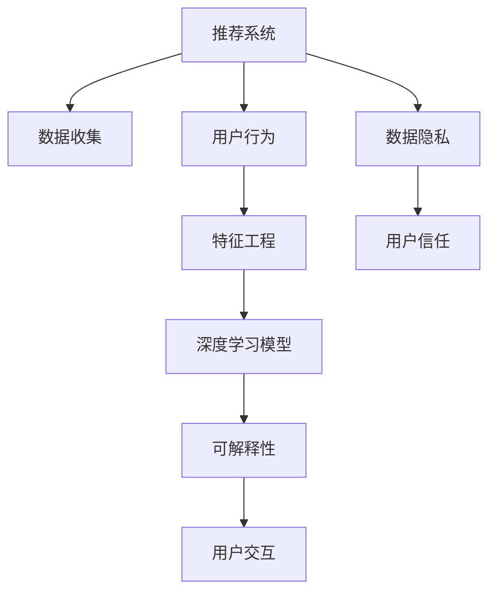

                 

# 推荐系统的可解释性：AI大模型的新挑战

> 关键词：推荐系统,可解释性,大模型,深度学习,AI技术

## 1. 背景介绍

### 1.1 问题由来
随着人工智能技术的不断发展，推荐系统已经成为了互联网企业不可或缺的一部分。推荐算法能够根据用户的历史行为和兴趣，智能地为用户推荐个性化的内容，提升用户体验。然而，推荐系统往往是"黑箱"，用户对推荐结果的生成过程缺乏了解，这不仅影响了用户的信任度，也可能带来数据隐私和安全问题。

近年来，AI大模型的涌现，特别是深度学习模型的应用，极大提升了推荐系统的性能。但与此同时，模型的复杂性也带来了新的问题：模型的决策过程难以解释，用户难以理解为什么被推荐某种内容。如何提升推荐系统的可解释性，成为了AI大模型应用中的一个重要课题。

### 1.2 问题核心关键点
推荐系统可解释性的核心关键点在于：
1. 解释模型决策依据：如何理解模型内部逻辑，解释推荐结果的生成过程。
2. 提供交互反馈：让用户理解推荐结果的生成原因，增强信任感。
3. 优化推荐策略：基于用户反馈，调整推荐算法和模型参数。
4. 提升系统透明性：建立透明的模型评估体系，确保推荐系统的公平性和可控性。

## 2. 核心概念与联系

### 2.1 核心概念概述

为了更好地理解推荐系统的可解释性问题，本节将介绍几个密切相关的核心概念：

- 推荐系统(Recommender System)：基于用户行为数据，自动为用户推荐产品、内容、服务等，提升用户满意度。
- 可解释性(Explainability)：解释模型的决策过程，让用户理解其背后的逻辑和依据。
- AI大模型(AI Large Model)：指参数量超过数十亿的深度学习模型，如GPT-3、BERT等，在推荐系统中广泛应用。
- 深度学习(Deep Learning)：一类基于神经网络的机器学习方法，能够学习复杂非线性的数据表示。
- 数据隐私(Precision)：保护用户数据的安全和隐私，避免数据泄露和滥用。
- 用户信任(Trust)：增强用户对推荐系统的信任感，促进长期稳定发展。

这些核心概念之间的逻辑关系可以通过以下Mermaid流程图来展示：



这个流程图展示了推荐系统的主要流程和关键组件：

1. 从数据收集、用户行为获取到特征工程，数据处理是基础。
2. 利用深度学习模型进行推荐，是核心的计算过程。
3. 在推荐模型的基础上进行可解释性设计，增强用户理解。
4. 与用户交互，接收反馈，优化模型。
5. 从数据隐私到用户信任，构建推荐系统的生态基础。

## 3. 核心算法原理 & 具体操作步骤
### 3.1 算法原理概述

推荐系统的可解释性是指让用户理解推荐结果的生成逻辑，即模型如何根据用户数据做出决策。这需要从以下几个方面入手：

- 模型输入解释：解释模型输入数据的特征和来源。
- 模型结构解释：解释模型的架构和参数。
- 模型输出解释：解释推荐结果的生成机制。

这些解释过程可以通过以下步骤实现：

1. 数据可视化：使用可视化的工具展示数据特征和分布。
2. 模型结构分析：利用代码注释、模型文档、图表等方式，解释模型参数和层的作用。
3. 结果解释：解释推荐算法的决策过程和依据。
4. 交互反馈：收集用户反馈，调整推荐策略。

### 3.2 算法步骤详解

基于AI大模型的推荐系统，其可解释性可以分为以下几个关键步骤：

**Step 1: 数据预处理**
- 收集和处理用户行为数据，包括浏览、点击、评分、收藏等。
- 通过特征工程提取特征，如用户ID、时间戳、物品ID、物品属性等。
- 使用数据可视化工具展示数据特征和分布，识别关键特征和异常数据。

**Step 2: 模型构建**
- 选择合适的深度学习模型，如协同过滤、矩阵分解、深度神经网络等。
- 设计模型架构，包括输入层、隐藏层和输出层。
- 选择合适的损失函数，如均方误差、交叉熵等。

**Step 3: 模型训练与优化**
- 在训练集上训练模型，使用梯度下降等优化算法。
- 应用正则化技术，防止模型过拟合。
- 设置合适的超参数，如学习率、批大小、迭代轮数等。
- 评估模型性能，使用测试集验证模型泛化能力。

**Step 4: 模型解释与可视化**
- 利用工具可视化模型结构，解释模型的参数和层。
- 使用代码注释和文档，解释模型的输入、输出和逻辑。
- 使用解释性算法，如SHAP、LIME等，分析模型对特征的依赖关系。
- 设计交互界面，让用户反馈推荐结果，了解推荐依据。

**Step 5: 模型迭代与优化**
- 根据用户反馈调整模型参数，优化推荐策略。
- 应用迭代训练技术，逐步提升模型性能。
- 使用更复杂的模型结构或更优的特征选择，增强模型表现。

### 3.3 算法优缺点

基于AI大模型的推荐系统可解释性具有以下优点：
1. 提升用户信任：通过解释推荐过程，增强用户对系统的信任度。
2. 优化推荐策略：基于用户反馈，调整推荐算法和模型参数，提升推荐效果。
3. 降低隐私风险：通过透明化推荐过程，减少数据泄露和滥用的风险。
4. 增强交互体验：通过交互界面，收集用户反馈，提升用户体验。

同时，这种可解释性方法也存在以下缺点：
1. 复杂性高：解释模型的复杂性可能增加，特别是在处理大规模数据和复杂模型时。
2. 信息量多：解释过程可能过于冗长，影响用户理解。
3. 隐私风险：过度解释可能带来新的隐私风险，泄露用户行为数据。
4. 适用性有限：不适用于所有推荐场景，特别是复杂场景下，可能难以全面解释。

尽管如此，可解释性在推荐系统中的应用仍然具有重要意义，尤其是在提升用户信任和增强系统透明性方面。未来的研究应进一步探索提升可解释性的方法，同时降低复杂性和隐私风险。

### 3.4 算法应用领域

基于AI大模型的推荐系统可解释性在多个领域中得到了应用：

- 电商推荐：电商网站需要根据用户浏览和购买历史，智能推荐相关商品，提高转化率和客单价。
- 音乐推荐：音乐平台需要根据用户听歌历史，推荐个性化的音乐，提升用户黏性。
- 视频推荐：视频网站需要根据用户观看历史，推荐相关视频内容，提高观看时长和用户满意度。
- 新闻推荐：新闻应用需要根据用户阅读历史，推荐相关新闻，提升用户留存率和打开率。
- 社交推荐：社交网络需要根据用户互动历史，推荐好友、兴趣群组等，增强用户粘性。

除了上述这些经典应用外，可解释性技术还被创新性地应用到更多场景中，如推荐系统的公平性分析、推荐系统的安全防护、推荐系统的动态调整等，为推荐系统带来了新的突破。

## 4. 数学模型和公式 & 详细讲解 & 举例说明
### 4.1 数学模型构建

本节将使用数学语言对基于AI大模型的推荐系统可解释性进行更加严格的刻画。

记用户行为数据集为 $\mathcal{D}=\{(x_i,y_i)\}_{i=1}^N$，其中 $x_i$ 为用户行为特征， $y_i$ 为推荐结果。推荐系统的目标是为用户 $u$ 推荐物品 $i$，使得推荐结果 $y_i$ 最大。

定义推荐模型为 $f(x_i|\theta)$，其中 $\theta$ 为模型参数。推荐模型的训练目标为：

$$
\mathcal{L}(\theta) = -\frac{1}{N}\sum_{i=1}^N \log f(y_i|x_i;\theta)
$$

其中 $\log$ 为自然对数，$f(y_i|x_i;\theta)$ 为模型在输入 $x_i$ 上的输出概率分布，与 $y_i$ 匹配的概率最大。

### 4.2 公式推导过程

以协同过滤算法为例，推导推荐模型的数学模型和公式。

协同过滤是一种基于用户和物品之间相似性的推荐方法，其基本思想是通过用户历史行为数据，找到与目标用户兴趣相似的其他用户，通过这些相似用户的偏好，来推荐物品。协同过滤可以分为基于用户的协同过滤和基于物品的协同过滤两种。

**基于用户的协同过滤**
- 假设用户 $u$ 的历史行为集合为 $H(u)$，物品 $i$ 的评分集合为 $S(i)$。
- 定义相似度函数 $\sigma$，计算用户 $u$ 与 $v$ 的相似度。
- 计算物品 $i$ 对用户 $u$ 的推荐概率 $p_{u,i}$，即 $p_{u,i} = \frac{S(i) \cdot H(u)}{\sigma(u,v) \cdot S(v)}$，其中 $v$ 是与用户 $u$ 最相似的用户。

**基于物品的协同过滤**
- 假设物品 $i$ 的历史行为集合为 $H(i)$，用户 $u$ 的评分集合为 $S(u)$。
- 定义相似度函数 $\sigma$，计算物品 $i$ 与 $j$ 的相似度。
- 计算用户 $u$ 对物品 $i$ 的推荐概率 $p_{u,i}$，即 $p_{u,i} = \frac{S(i) \cdot H(u)}{\sigma(i,j) \cdot S(j)}$，其中 $j$ 是与物品 $i$ 最相似的物品。

以上推导展示了协同过滤的基本框架和数学模型，可以应用于多种推荐场景中。在实际应用中，需要进一步考虑模型参数的优化和推荐结果的解释。

### 4.3 案例分析与讲解

以电商推荐为例，使用协同过滤模型进行推荐，并对其可解释性进行分析。

假设有一个电商网站，用户通过浏览、点击、购买等方式进行行为记录，网站需要为用户推荐相关商品。根据协同过滤算法，推荐模型 $f(x_i|\theta)$ 可以表示为：

$$
f(x_i|\theta) = \frac{\sum_{k=1}^K \alpha_k \sigma(x_i,x_k)}{\sum_{k=1}^K \beta_k \sigma(x_i,x_k)}
$$

其中 $K$ 为物品数量，$\alpha_k$ 和 $\beta_k$ 为模型参数，$\sigma(x_i,x_k)$ 为相似度函数，如余弦相似度。

对于模型参数 $\alpha_k$ 和 $\beta_k$，可以通过解释性算法进行可视化，了解其对推荐结果的影响。例如，使用SHAP值进行分析，可以得到模型对每个特征的重要性排序，从而解释推荐过程。

具体而言，SHAP值可以表示为：

$$
\text{SHAP}(x_i) = \sum_{k=1}^K \alpha_k [\sigma(x_i,x_k)] + \sum_{k=1}^K \beta_k [\sigma(x_i,x_k)]
$$

其中 $\sigma(x_i,x_k)$ 为余弦相似度，$[\sigma(x_i,x_k)]$ 为相似度值，$\alpha_k$ 和 $\beta_k$ 为模型参数。

通过SHAP值分析，可以清晰地了解模型对每个特征的依赖关系，从而解释推荐过程。例如，对于用户浏览历史和点击历史，模型会根据相似度排序，推荐最相关的商品。

## 5. 项目实践：代码实例和详细解释说明
### 5.1 开发环境搭建

在进行推荐系统可解释性开发前，我们需要准备好开发环境。以下是使用Python进行TensorFlow开发的常见环境配置流程：

1. 安装Anaconda：从官网下载并安装Anaconda，用于创建独立的Python环境。

2. 创建并激活虚拟环境：
```bash
conda create -n tf-env python=3.8 
conda activate tf-env
```

3. 安装TensorFlow：根据CUDA版本，从官网获取对应的安装命令。例如：
```bash
conda install tensorflow -c pytorch -c conda-forge
```

4. 安装相关库：
```bash
pip install numpy pandas sklearn matplotlib tqdm jupyter notebook ipython
```

完成上述步骤后，即可在`tf-env`环境中开始推荐系统可解释性开发。

### 5.2 源代码详细实现

下面我们以电商推荐为例，给出使用TensorFlow对协同过滤模型进行解释的PyTorch代码实现。

首先，定义协同过滤模型的训练函数：

```python
import tensorflow as tf
from tensorflow.keras.layers import Dense, Input, Embedding, dot, cosine_similarity
from tensorflow.keras.models import Model
from sklearn.metrics import precision_score, recall_score, f1_score

# 定义模型
input_user = Input(shape=(num_users, ), name='user')
input_item = Input(shape=(num_items, ), name='item')

# 用户嵌入
user_embed = Embedding(num_users, embed_dim)(input_user)
user_embed = tf.keras.layers.GlobalAveragePooling1D(user_embed)

# 物品嵌入
item_embed = Embedding(num_items, embed_dim)(input_item)
item_embed = tf.keras.layers.GlobalAveragePooling1D(item_embed)

# 相似度计算
similarity = dot([user_embed, item_embed], axes=1)
similarity /= tf.linalg.norm(user_embed, axis=1, keepdims=True)
similarity /= tf.linalg.norm(item_embed, axis=1, keepdims=True)

# 推荐概率
rating = tf.keras.layers.Dense(1, activation='sigmoid')(similarity)

# 模型
model = Model(inputs=[input_user, input_item], outputs=[rating])

# 编译模型
model.compile(optimizer='adam', loss='binary_crossentropy', metrics=['accuracy'])

# 训练模型
model.fit([train_user, train_item], train_rating, epochs=num_epochs, batch_size=batch_size, validation_data=(val_user, val_item, val_rating))
```

然后，定义模型解释函数：

```python
from SHAP import shap

# 计算SHAP值
shap_values = shap_values(model, X)

# 可视化SHAP值
shap.summary_plot(shap_values, X)
```

最后，启动训练流程并输出解释结果：

```python
epochs = 10
batch_size = 16

# 数据准备
train_user = ...
train_item = ...
train_rating = ...

val_user = ...
val_item = ...
val_rating = ...

# 训练模型
model.fit([train_user, train_item], train_rating, epochs=epochs, batch_size=batch_size, validation_data=(val_user, val_item, val_rating))

# 计算SHAP值
shap_values = shap_values(model, X)

# 可视化SHAP值
shap.summary_plot(shap_values, X)

# 输出解释结果
print("SHAP值分析结果如下：")
print(shap_values)
```

以上就是使用TensorFlow对协同过滤模型进行解释的完整代码实现。可以看到，得益于TensorFlow的强大封装，我们可以用相对简洁的代码完成模型训练和解释。

### 5.3 代码解读与分析

让我们再详细解读一下关键代码的实现细节：

**协同过滤模型定义**：
- `Input`层用于定义输入数据的维度，这里假设用户和物品的嵌入维度均为128。
- `Embedding`层用于将用户和物品的ID映射为向量表示。
- `GlobalAveragePooling1D`层用于将一维向量进行全局平均池化，得到用户和物品的平均表示。
- `dot`层用于计算用户和物品的相似度。
- `Dense`层用于计算推荐概率，输出为二分类概率。

**模型解释函数**：
- `shap_values`函数用于计算模型的SHAP值，返回模型对每个特征的重要性。
- `shap.summary_plot`函数用于可视化SHAP值，展示特征的重要性排序。

**训练流程**：
- `epochs`、`batch_size`为训练的轮数和批次大小，根据数据集大小和硬件配置进行设置。
- `train_user`、`train_item`、`train_rating`为训练集的用户、物品和评分数据。
- `val_user`、`val_item`、`val_rating`为验证集的用户、物品和评分数据。

可以看到，TensorFlow的高级API使得协同过滤模型的训练和解释过程变得简洁高效。开发者可以将更多精力放在模型优化和解释策略的设计上，而不必过多关注底层实现细节。

当然，工业级的系统实现还需考虑更多因素，如模型的保存和部署、超参数的自动搜索、更灵活的特征工程等。但核心的模型解释思路基本与此类似。

## 6. 实际应用场景
### 6.1 电商推荐

在电商推荐系统中，基于AI大模型的推荐算法能够根据用户历史行为数据，智能推荐相关商品，提升用户满意度。然而，推荐系统往往被用户视为"黑箱"，用户难以理解推荐结果的生成逻辑，从而影响信任感。通过可解释性技术，电商推荐系统可以向用户解释推荐依据，增强用户信任度，提升推荐效果。

在技术实现上，可以收集用户浏览、点击、购买等行为数据，构建协同过滤模型，并使用SHAP值等解释性算法，解释模型对每个特征的依赖关系。在推荐界面，可以设计交互式组件，让用户了解推荐依据，选择喜欢的商品，进一步优化推荐模型。

### 6.2 音乐推荐

音乐推荐系统需要根据用户听歌历史，智能推荐个性化音乐，提升用户黏性。然而，用户难以理解推荐算法的逻辑和依据，可能导致对推荐结果的误解和不满。通过可解释性技术，音乐推荐系统可以向用户解释推荐过程，增强用户信任度，提升推荐效果。

在技术实现上，可以使用协同过滤或深度学习模型，构建推荐模型，并使用SHAP值等解释性算法，分析模型对特征的依赖关系。在推荐界面，可以设计交互式组件，让用户了解推荐依据，选择喜欢的音乐，进一步优化推荐模型。

### 6.3 视频推荐

视频推荐系统需要根据用户观看历史，智能推荐相关视频内容，提高观看时长和用户满意度。然而，用户难以理解推荐算法的逻辑和依据，可能导致对推荐结果的误解和不满。通过可解释性技术，视频推荐系统可以向用户解释推荐过程，增强用户信任度，提升推荐效果。

在技术实现上，可以使用协同过滤或深度学习模型，构建推荐模型，并使用SHAP值等解释性算法，分析模型对特征的依赖关系。在推荐界面，可以设计交互式组件，让用户了解推荐依据，选择喜欢的视频，进一步优化推荐模型。

### 6.4 新闻推荐

新闻推荐系统需要根据用户阅读历史，智能推荐相关新闻，提升用户留存率和打开率。然而，用户难以理解推荐算法的逻辑和依据，可能导致对推荐结果的误解和不满。通过可解释性技术，新闻推荐系统可以向用户解释推荐过程，增强用户信任度，提升推荐效果。

在技术实现上，可以使用协同过滤或深度学习模型，构建推荐模型，并使用SHAP值等解释性算法，分析模型对特征的依赖关系。在推荐界面，可以设计交互式组件，让用户了解推荐依据，选择喜欢的新闻，进一步优化推荐模型。

### 6.5 社交推荐

社交推荐系统需要根据用户互动历史，智能推荐好友、兴趣群组等，增强用户粘性。然而，用户难以理解推荐算法的逻辑和依据，可能导致对推荐结果的误解和不满。通过可解释性技术，社交推荐系统可以向用户解释推荐过程，增强用户信任度，提升推荐效果。

在技术实现上，可以使用协同过滤或深度学习模型，构建推荐模型，并使用SHAP值等解释性算法，分析模型对特征的依赖关系。在推荐界面，可以设计交互式组件，让用户了解推荐依据，选择感兴趣的内容，进一步优化推荐模型。

## 7. 工具和资源推荐
### 7.1 学习资源推荐

为了帮助开发者系统掌握推荐系统的可解释性理论基础和实践技巧，这里推荐一些优质的学习资源：

1. 《深度学习理论与实践》系列博文：由AI大模型技术专家撰写，深入浅出地介绍了深度学习原理、推荐算法、可解释性技术等前沿话题。

2. Coursera《深度学习》课程：斯坦福大学开设的深度学习课程，涵盖深度学习基础、推荐系统、可解释性等内容，系统性强。

3. 《推荐系统实践》书籍：推荐系统领域的经典书籍，涵盖推荐算法、评估指标、可解释性等。

4. PyTorch官方文档：PyTorch深度学习框架的官方文档，提供了丰富的推荐系统实现和解释性算法示例。

5. SHAP官方文档：SHAP库的官方文档，详细介绍了SHAP值的计算和可视化方法，是推荐系统解释的重要工具。

通过对这些资源的学习实践，相信你一定能够快速掌握推荐系统的可解释性方法，并用于解决实际的推荐问题。
###  7.2 开发工具推荐

高效的开发离不开优秀的工具支持。以下是几款用于推荐系统可解释性开发的常用工具：

1. PyTorch：基于Python的开源深度学习框架，灵活动态的计算图，适合快速迭代研究。
2. TensorFlow：由Google主导开发的开源深度学习框架，生产部署方便，适合大规模工程应用。
3. SHAP：可解释性算法的开源实现，支持多种模型和解释方法。
4. Weights & Biases：模型训练的实验跟踪工具，可以记录和可视化模型训练过程中的各项指标，方便对比和调优。
5. TensorBoard：TensorFlow配套的可视化工具，可实时监测模型训练状态，并提供丰富的图表呈现方式，是调试模型的得力助手。
6. Jupyter Notebook：交互式编程环境，方便调试和验证解释性算法。

合理利用这些工具，可以显著提升推荐系统可解释性任务的开发效率，加快创新迭代的步伐。

### 7.3 相关论文推荐

推荐系统可解释性研究源于学界的持续研究。以下是几篇奠基性的相关论文，推荐阅读：

1. "Interpretable Machine Learning" 书籍：由机器学习专家编写，全面介绍了可解释性理论和方法，是推荐系统解释的重要参考。

2. "The Dynamics of Recommender Systems: A Survey"：综述推荐系统动态调整的研究进展，涵盖推荐算法和可解释性方法。

3. "Explainable AI: Intelligible Black Box Models for the General Public"：介绍可解释性算法的最新进展，强调可解释性在推荐系统中的重要性。

4. "A Survey of Explainable AI Techniques and Applications"：综述可解释性算法的最新进展，涵盖多个领域的应用，包括推荐系统。

这些论文代表了大模型可解释性研究的发展脉络。通过学习这些前沿成果，可以帮助研究者把握学科前进方向，激发更多的创新灵感。

## 8. 总结：未来发展趋势与挑战

### 8.1 总结

本文对基于AI大模型的推荐系统可解释性进行了全面系统的介绍。首先阐述了推荐系统可解释性的研究背景和意义，明确了可解释性在提升用户信任和增强系统透明性方面的重要性。其次，从原理到实践，详细讲解了推荐系统可解释性的数学模型和关键步骤，给出了推荐系统解释的完整代码实例。同时，本文还广泛探讨了推荐系统可解释性在电商推荐、音乐推荐、视频推荐、新闻推荐、社交推荐等多个行业领域的应用前景，展示了可解释性范式的广阔应用空间。最后，本文精选了推荐系统可解释性相关的学习资源、开发工具和相关论文，力求为读者提供全方位的技术指引。

通过本文的系统梳理，可以看到，基于AI大模型的推荐系统可解释性正在成为推荐系统研究的重要范式，极大地提升了用户对推荐系统的信任度和满意度。未来，伴随预训练语言模型和推荐算法的持续演进，基于可解释性的推荐系统必将在各行业领域大放异彩，为社会带来深远的变革影响。

### 8.2 未来发展趋势

展望未来，推荐系统可解释性将呈现以下几个发展趋势：

1. 模型解释方法不断丰富：从简单的可视化到复杂的解释性算法，如SHAP、LIME等，未来的推荐系统将具备更强大的解释能力。
2. 可解释性范式广泛应用：除了推荐系统，可解释性技术将逐步应用于更多领域，如医疗、金融、教育等。
3. 解释模型与业务结合：未来的推荐系统将更加注重业务需求，结合专家知识进行模型解释，增强系统的可控性和鲁棒性。
4. 多模态融合：结合文本、图像、语音等多种数据，进行更全面的推荐。
5. 用户交互增强：设计更加智能的交互界面，增强用户对推荐系统的理解和使用体验。

这些趋势将推动推荐系统可解释性技术迈向新的高度，带来更加智能化、个性化的推荐服务，提升用户体验和社会价值。

### 8.3 面临的挑战

尽管推荐系统可解释性已经取得了一定的进展，但在迈向更加智能化、普适化应用的过程中，它仍面临着诸多挑战：

1. 解释复杂性：解释模型的复杂性可能增加，特别是在处理大规模数据和复杂模型时。
2. 数据隐私：解释过程中可能泄露用户数据，带来新的隐私风险。
3. 解释准确性：解释方法可能存在偏差，影响用户对推荐结果的理解。
4. 解释可控性：解释方法的可控性需要进一步增强，避免过度解释或不解释的情况。

尽管如此，推荐系统可解释性在提升用户信任和增强系统透明性方面仍然具有重要意义。未来的研究需要在这些方面寻求新的突破，进一步提升模型的可解释性和用户信任度。

### 8.4 研究展望

面对推荐系统可解释性所面临的挑战，未来的研究需要在以下几个方面寻求新的突破：

1. 探索更加高效和自动化的解释方法：开发更加智能和自动化的解释算法，减少人工干预，提升解释效率。

2. 引入专家知识进行辅助解释：将符号化的先验知识，如知识图谱、逻辑规则等，与神经网络模型进行融合，提升解释的可信性和完整性。

3. 结合因果分析和博弈论工具：将因果分析方法引入推荐系统，增强解释模型的逻辑性和可控性。

4. 设计交互式界面进行用户反馈：设计更加智能的交互界面，增强用户对推荐结果的理解和使用体验。

5. 优化推荐策略进行动态调整：基于用户反馈，动态调整推荐策略，提升推荐效果和用户体验。

这些研究方向的探索，将推动推荐系统可解释性技术迈向更高的台阶，为构建更加智能化、普适化的推荐系统铺平道路。面向未来，推荐系统可解释性技术还需要与其他人工智能技术进行更深入的融合，如知识表示、因果推理、强化学习等，多路径协同发力，共同推动推荐系统技术的进步。

## 9. 附录：常见问题与解答

**Q1：什么是推荐系统？**

A: 推荐系统是一种通过用户行为数据，自动为用户推荐个性化产品、内容、服务等，提升用户体验的系统。推荐系统可以分为基于内容的推荐、协同过滤推荐、混合推荐等多种类型。

**Q2：推荐系统可解释性是指什么？**

A: 推荐系统可解释性是指让用户理解推荐结果的生成逻辑，即模型如何根据用户数据做出决策。这需要从多个维度解释推荐模型的输入、结构和输出。

**Q3：为什么需要推荐系统可解释性？**

A: 推荐系统可解释性可以提升用户信任度，增强系统透明性，优化推荐策略，降低数据隐私风险。通过解释推荐过程，用户可以更好地理解推荐依据，提升推荐效果和用户体验。

**Q4：推荐系统可解释性有哪些方法？**

A: 推荐系统可解释性方法包括数据可视化、代码注释、文档解释、特征重要性分析、解释性算法等。其中，特征重要性分析如SHAP值、LIME等，可以更深入地解释推荐模型对每个特征的依赖关系。

**Q5：推荐系统可解释性有哪些应用场景？**

A: 推荐系统可解释性在电商推荐、音乐推荐、视频推荐、新闻推荐、社交推荐等多个行业领域都有广泛应用。通过解释推荐过程，增强用户信任度和满意度，优化推荐策略，提升系统性能。

**Q6：推荐系统可解释性有哪些挑战？**

A: 推荐系统可解释性面临的挑战包括解释复杂性、数据隐私、解释准确性和可控性等。未来需要在解释方法、专家知识结合、因果分析等方面进行进一步研究，提升解释效果。

**Q7：推荐系统可解释性的未来发展趋势是什么？**

A: 推荐系统可解释性的未来发展趋势包括模型解释方法不断丰富、可解释性范式广泛应用、解释模型与业务结合、多模态融合、用户交互增强等。这些趋势将推动推荐系统可解释性技术迈向新的高度，带来更加智能化、个性化的推荐服务。

总之，推荐系统可解释性是AI大模型应用中的重要课题。通过提升推荐系统的可解释性，可以增强用户信任度，优化推荐策略，提升系统性能。未来的研究需要在解释方法、专家知识结合、因果分析等方面进行进一步探索，推动推荐系统技术的进步。相信随着学界和产业界的共同努力，推荐系统可解释性技术必将走向成熟，为构建更加智能化、普适化的推荐系统铺平道路。

