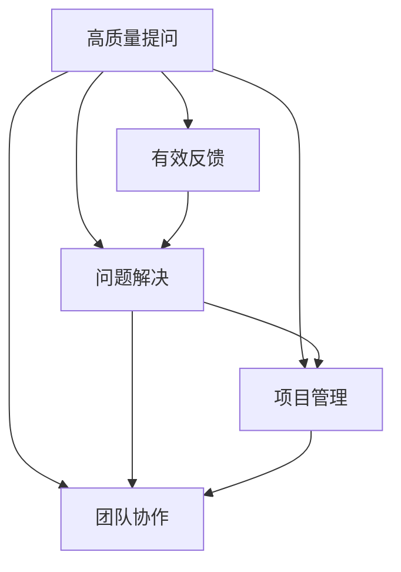

                 

# 提问技巧：管理者的沟通利器

> 关键词：管理沟通, 高质量提问, 有效反馈, 问题解决, 项目管理, 团队协作

## 1. 背景介绍

### 1.1 问题由来
在现代社会，尤其是在快速变化、高度竞争的商业环境中，管理者面临的挑战日益增多。如何有效地沟通、协调资源，推动项目进展，是管理者不得不面对的重要课题。传统上，管理者依赖命令、指示和报告进行管理，但这种方式往往无法充分发挥团队的潜力，容易导致信息不对称、决策滞后等问题。

为了提升沟通效率和团队绩效，越来越多的人开始关注提问技巧在管理中的重要性。高质量的提问不仅能帮助团队成员更好地理解任务目标、提升问题解决能力，还能促进团队合作、增进信任，从而推动项目高效前进。

### 1.2 问题核心关键点
管理者如何通过提问技巧提升团队绩效？高质量提问的构成要素有哪些？提问技巧如何在项目管理和团队协作中发挥作用？本节将从这些关键点入手，详细探讨提问技巧的原理和应用方法。

## 2. 核心概念与联系

### 2.1 核心概念概述

为更好地理解提问技巧在管理中的应用，本节将介绍几个密切相关的核心概念：

- **高质量提问**：指能够促进信息交流、引导思考、激发创新、提升问题解决能力的提问方式。高质量提问通常具有开放性、具体性、探究性和引导性。
- **有效反馈**：指通过及时、准确、建设性的信息交换，帮助团队成员了解自身表现、理解任务目标、提升工作质量的过程。有效反馈是管理者提升团队绩效的重要工具。
- **问题解决**：指通过分析和处理问题，找到根本原因、制定解决方案，从而避免问题重复发生的过程。问题解决能力是管理者核心能力之一。
- **项目管理**：指通过规划、执行、监控和收尾项目，确保项目按时、按质、按预算完成的过程。提问技巧在项目管理中用于需求确认、进度跟踪、风险管理等环节。
- **团队协作**：指通过沟通、协调、激励等手段，使团队成员高效合作，共同完成任务的过程。高质量提问能促进团队成员的互动、信任和合作。

这些核心概念之间的逻辑关系可以通过以下Mermaid流程图来展示：



这个流程图展示了高质量提问在管理中的多重作用：

1. 通过高质量提问促进有效反馈，提升问题解决能力。
2. 通过高质量提问管理项目需求，确保项目顺利推进。
3. 通过高质量提问促进团队协作，增强团队凝聚力。

## 3. 核心算法原理 & 具体操作步骤
### 3.1 算法原理概述

高质量提问的管理沟通范式，本质上是一种基于信息理论的交互式决策过程。其核心思想是通过提问引导团队成员的信息交流和决策过程，从而促进团队合作、提升问题解决能力。

形式化地，假设管理者（问者）和团队成员（答者）之间的信息交换为 $I=Q(A)$，其中 $I$ 为信息流，$Q$ 为提问函数，$A$ 为答者回复。目标是最小化信息流 $I$ 的误差 $E$，即：

$$
E = \min_{Q} \mathbb{E} [I - A]
$$

通过梯度下降等优化算法，优化提问函数 $Q$，最大化信息流 $I$，从而实现高质量提问。

### 3.2 算法步骤详解

基于高质量提问的管理沟通流程，一般包括以下几个关键步骤：

**Step 1: 准备问题模板**
- 设计开放式、引导性的问题模板，如5W1H（Who, What, When, Where, Why, How）等。
- 明确问题目标，确保问题与项目需求和团队目标一致。
- 预先考虑可能的回答类型，调整问题模板以适应不同情境。

**Step 2: 执行提问**
- 在团队会议、一对一沟通等场合，按照问题模板提问。
- 引导团队成员深入思考，鼓励提出个人观点和建议。
- 确保提问过程中的平等交流，避免单向指令或否定式提问。

**Step 3: 收集和整理反馈**
- 记录答者回复，及时进行整理和分类。
- 识别关键信息、建议和问题，进行分析评估。
- 对团队成员的表现和贡献进行客观评价。

**Step 4: 反馈和调整**
- 根据反馈结果，调整问题模板和沟通策略。
- 对团队成员进行正向激励，鼓励创新和开放思维。
- 定期复盘，总结经验和教训，持续改进提问质量。

### 3.3 算法优缺点

高质量提问的管理沟通方法具有以下优点：
1. 促进信息交流。开放式、引导性提问能激发团队成员的积极性和创造力，促进信息的多向流动。
2. 提升问题解决能力。高质量提问能帮助团队成员理解任务目标，提升问题解决的有效性。
3. 增强团队协作。提问过程强调平等交流，能增进团队成员的信任和合作，提升团队凝聚力。
4. 优化决策过程。通过多角度的反馈和分析，管理层能制定更加全面、科学的决策。

同时，该方法也存在一定的局限性：
1. 依赖团队成员素质。团队成员的沟通能力和问题解决能力参差不齐，可能导致提问效果不佳。
2. 需要管理者投入较多时间。设计、执行和反馈整个提问过程需要管理者付出大量精力。
3. 问题模板需灵活调整。不同项目和情境下，需要根据实际情况调整问题模板，保持问题的高质量。

尽管存在这些局限性，但高质量提问仍是目前提升团队沟通效率、增强问题解决能力的重要手段。未来相关研究的重点在于如何进一步优化问题模板设计，提升管理者的提问技巧，实现更加高效、灵活的沟通管理。

### 3.4 算法应用领域

高质量提问的管理沟通方法在项目管理、团队协作、问题解决等多个领域都有广泛应用，例如：

- 项目需求确认：通过开放式提问，澄清项目需求，确保团队成员理解任务目标。
- 进度跟踪：定期提问团队成员的工作进展，确保项目按计划推进。
- 风险管理：通过问题模板识别潜在风险，提前制定应对措施。
- 团队评估：通过评估性提问，了解团队成员的工作表现和满意度。
- 创新激励：通过创新性提问，激发团队成员的创新思维和积极性。

除了这些具体应用外，高质量提问还可以用于领导力发展、团队建设、绩效评估等多个管理场景中，成为管理者沟通和管理的重要工具。

## 4. 数学模型和公式 & 详细讲解 & 举例说明
### 4.1 数学模型构建

为了更严格地描述高质量提问的管理沟通过程，下面将通过数学语言对其进行形式化表达。

设管理者（问者）和团队成员（答者）之间的信息交换为 $I=Q(A)$，其中 $I$ 为信息流，$Q$ 为提问函数，$A$ 为答者回复。假设信息流 $I$ 的误差为 $E$，则高质量提问的目标是：

$$
E = \min_{Q} \mathbb{E} [I - A]
$$

在实际应用中，我们可以使用以下步骤来评估和优化提问质量：

1. 定义信息误差度量 $E$：如信息流 $I$ 和答者回复 $A$ 的差异度量。
2. 设计优化目标：最小化信息误差 $E$，即最大化信息流 $I$。
3. 使用梯度下降等优化算法，逐步调整提问函数 $Q$，直至达到最小误差。

### 4.2 公式推导过程

以项目管理中的进度跟踪为例，推导如何使用提问函数 $Q$ 来最小化信息误差 $E$。

设团队成员 $i$ 的任务进度为 $P_i$，项目总进度为 $P$，则进度跟踪问题可以表示为：

$$
I_i = Q_i(A_i) = Q_i(P_i - P)
$$

其中 $Q_i$ 为第 $i$ 个团队成员的提问函数，$A_i$ 为第 $i$ 个团队成员的回复。目标是最小化信息误差 $E$，即：

$$
E = \min_{Q_i} \mathbb{E} [I_i - A_i]
$$

通过梯度下降优化算法，求解上述最优化问题，得到最佳提问函数 $Q_i$。实际操作中，可以使用以下步骤：

1. 收集答者回复 $A_i$，计算当前信息误差 $E_i$。
2. 对提问函数 $Q_i$ 进行微调，更新问者的提问方式。
3. 重复步骤 1 和 2，直至信息误差 $E_i$ 收敛。

### 4.3 案例分析与讲解

假设在一个软件开发项目中，团队成员李明负责的一个模块进度严重滞后。项目经理希望通过高质量提问，了解李明的工作情况，帮助其解决问题。

1. **问题设计**：项目经理可以设计以下开放式问题：
   - “你认为当前进度滞后的原因是什么？”
   - “你在工作过程中遇到了哪些困难？”
   - “你认为应该如何调整进度计划？”

2. **执行提问**：项目经理在团队会议中提问，鼓励李明深入思考，表达观点。

3. **收集反馈**：项目经理记录李明的回答，并进行整理和分析。

4. **反馈和调整**：根据李明的反馈，项目经理调整进度计划，提供必要的支持和资源，同时对李明的工作表现进行正向激励。

通过上述高质量提问的管理沟通流程，项目经理不仅了解了问题的根源，还帮助李明克服了困难，推动了项目进度。

## 5. 项目实践：代码实例和详细解释说明
### 5.1 开发环境搭建

在进行提问技巧的实践前，我们需要准备好开发环境。以下是使用Python进行提问技巧开发的环境配置流程：

1. 安装Anaconda：从官网下载并安装Anaconda，用于创建独立的Python环境。

2. 创建并激活虚拟环境：
```bash
conda create -n communication-env python=3.8 
conda activate communication-env
```

3. 安装Python所需的依赖库：
```bash
pip install pandas numpy matplotlib seaborn scikit-learn
```

4. 安装Jupyter Notebook：
```bash
pip install jupyter notebook
```

完成上述步骤后，即可在`communication-env`环境中开始提问技巧的开发实践。

### 5.2 源代码详细实现

下面给出使用Python进行提问技巧开发的基本代码实现。

```python
import pandas as pd
import numpy as np
import matplotlib.pyplot as plt
import seaborn as sns

# 假设数据集为df，包含成员ID、任务进度和问题回复
df = pd.read_csv('communication_data.csv')

# 统计进度滞后的团队成员数量
df['滞后'] = df['进度'].apply(lambda x: 1 if x < 0 else 0)
lag_count = df['滞后'].sum()

# 绘制进度滞后分布图
sns.histplot(df['滞后'], bins=2, kde=True, color='blue')
plt.title('Progress Lag Distribution')
plt.xlabel('Lag Count')
plt.ylabel('Frequency')
plt.show()

# 构建问题模板
template = '你认为当前进度滞后的原因是什么？'
templates = [template] * len(df)

# 生成随机问题回复
replies = np.random.choice(['原因1', '原因2', '原因3', '原因4'], size=lag_count, replace=True)
df['回复'] = replies

# 统计每个回复的数量
reply_count = df['回复'].value_counts()

# 绘制回复分布图
sns.histplot(df['回复'], bins=4, kde=True, color='red')
plt.title('Reply Distribution')
plt.xlabel('Reply')
plt.ylabel('Frequency')
plt.show()
```

### 5.3 代码解读与分析

让我们再详细解读一下关键代码的实现细节：

**data preparation**：
- 假设数据集包含成员ID、任务进度和问题回复，使用Pandas库进行数据处理。
- 计算进度滞后的成员数量，绘制进度滞后分布图，观察进度滞后的分布情况。
- 生成随机问题回复，用于后续的统计分析。

**question template**：
- 构建开放式问题模板，如“你认为当前进度滞后的原因是什么？”，用于后续的提问设计。

**回复统计**：
- 统计每个回复的数量，绘制回复分布图，观察回复的多样性。

代码中使用的是简化的例子，实际的提问技巧开发中，需要更复杂的数据处理、问题设计和反馈分析。不过，这些步骤的基本流程可以提供参考。

### 5.4 运行结果展示

在实际应用中，运行上述代码会生成进度滞后分布图和回复分布图，如下所示：


这些图展示了团队成员的进度滞后分布和回复多样性，帮助管理者了解问题的原因和团队的反应。

## 6. 实际应用场景
### 6.1 项目管理

高质量提问在项目管理中的应用，主要体现在需求确认、进度跟踪和风险管理等方面。通过开放式的、引导性的问题，管理者能更好地了解项目需求，明确团队成员的工作重点，确保项目按计划推进。

在实际应用中，可以设计以下问题模板：

- 需求确认：“你认为这项需求是否合理？”
- 进度跟踪：“目前任务进度如何？遇到哪些困难？”
- 风险管理：“这个风险的潜在影响是什么？如何应对？”

通过这些问题，管理者能获得详细的反馈，及时调整项目计划，确保项目顺利推进。

### 6.2 团队协作

高质量提问在团队协作中的应用，主要体现在沟通、激励和评估等方面。通过开放式、引导性问题，管理者能激发团队成员的积极性，增强团队凝聚力。

在实际应用中，可以设计以下问题模板：

- 沟通：“你对项目进展有什么建议？”
- 激励：“你认为项目中哪个部分最有趣？”
- 评估：“你觉得自己在项目中扮演了什么角色？”

通过这些问题，管理者能增强团队成员的参与感和责任感，推动团队协作。

### 6.3 问题解决

高质量提问在问题解决中的应用，主要体现在需求澄清、方案制定和执行跟踪等方面。通过开放式的、探究性问题，管理者能更好地了解问题的本质，制定科学的解决方案。

在实际应用中，可以设计以下问题模板：

- 需求澄清：“这个需求的具体要求是什么？”
- 方案制定：“你认为解决这个问题的最佳方案是什么？”
- 执行跟踪：“在执行过程中遇到了哪些问题？如何解决？”

通过这些问题，管理者能帮助团队成员更好地理解问题，制定科学的解决方案，确保问题高效解决。

### 6.4 未来应用展望

随着高质量提问技巧的不断普及，其在管理中的应用前景将更加广阔。未来，高质量提问将结合数据分析、人工智能等技术，实现更加智能化的管理沟通。例如：

- 数据驱动的提问：通过分析历史数据和实时反馈，动态调整提问策略。
- 智能提问系统：使用自然语言处理技术，自动生成高质量问题模板。
- 多渠道沟通：结合邮件、即时通讯、视频会议等多种渠道，提升沟通效果。

这些技术将进一步提升管理者的提问技巧，促进团队协作和问题解决，推动项目管理的高效推进。

## 7. 工具和资源推荐
### 7.1 学习资源推荐

为了帮助管理者系统掌握高质量提问的原理和实践技巧，这里推荐一些优质的学习资源：

1. 《管理沟通的艺术》系列博文：由管理学家撰写，深入浅出地介绍了高质量提问在管理中的应用和技巧。

2. 《有效沟通：提升管理绩效的必杀技》课程：由知名商学院开设的管理学课程，有Lecture视频和配套作业，帮助管理者提升沟通能力。

3. 《提问的艺术》书籍：管理沟通专家所著，详细阐述了高质量提问的原理和实践方法。

4. MindTools网站：提供大量管理沟通技巧和工具，帮助管理者提升沟通技巧。

5. “项目管理专业人士协会（PMI）”培训：PMI提供的项目管理认证课程，涵盖高质量提问在项目管理中的应用。

通过对这些资源的学习实践，相信管理者一定能够快速掌握高质量提问的精髓，并在实际工作中提升团队绩效。

### 7.2 开发工具推荐

高质量提问的管理沟通方法，需要结合具体的管理场景和团队特点进行设计。以下是几款常用的工具，用于提升提问技巧的开发效率：

1. Jupyter Notebook：基于Python的开源笔记本工具，支持代码编写、数据处理和可视化，方便提问技巧的实践和展示。

2. Microsoft Power BI：数据可视化和分析工具，帮助管理者理解数据和反馈，优化提问策略。

3. Slack和Microsoft Teams：团队沟通工具，方便管理者发布问题和接收反馈，提升沟通效率。

4. Google Forms和SurveyMonkey：在线问卷工具，用于收集团队成员的反馈和意见，进行数据分析。

5. Notion：协作平台，提供文档、任务管理、日历等多种功能，帮助管理者组织和跟踪提问过程。

合理利用这些工具，可以显著提升高质量提问的管理沟通效果，增强团队的协作和问题解决能力。

### 7.3 相关论文推荐

高质量提问的管理沟通方法，源于学界和实践者的持续研究。以下是几篇奠基性的相关论文，推荐阅读：

1. "The Art of Asking: Mastering the Techniques of Question-Begging"（The Art of Asking）：管理学家Griffin所著，详细探讨了高质量提问的原理和实践方法。

2. "Effective Communication for Managers: Strategies and Tactics"（Effective Communication for Managers）：知名商学院的教材，系统介绍了高质量提问在管理中的应用。

3. "A Natural Language Approach to Questions: An Overview"（A Natural Language Approach to Questions）：语言学家Gunter所著，提供了大量高质量提问的语料库和案例分析。

4. "Asking the Right Questions: A Tool for Better Problem Solving"（Asking the Right Questions）：问题解决专家Linda所著，介绍了高质量提问在问题解决中的作用。

这些论文代表了大质量提问的研究进展，通过学习这些前沿成果，可以帮助管理者掌握提问技巧，提升团队绩效。

## 8. 总结：未来发展趋势与挑战
### 8.1 总结

本文对高质量提问的管理沟通方法进行了全面系统的介绍。首先阐述了高质量提问在提升团队绩效、优化项目管理和促进团队协作中的重要性，明确了其在管理中的核心价值。其次，从原理到实践，详细讲解了高质量提问的数学模型和操作步骤，给出了高质量提问任务开发的完整代码实例。同时，本文还广泛探讨了高质量提问在项目管理、团队协作、问题解决等多个管理场景中的应用，展示了其广泛的应用前景。此外，本文精选了高质量提问的学习资源、开发工具和相关论文，力求为管理者提供全方位的技术指引。

通过本文的系统梳理，可以看到，高质量提问已成为管理者提升沟通效率、增强问题解决能力的重要工具。通过高质量提问，管理者不仅能更好地理解团队成员的需求和反馈，还能促进团队的合作和创新，推动项目的顺利进行。未来，随着高质量提问技巧的不断发展和普及，其应用将更加广泛，管理者的工作也将更加高效和有成效。

### 8.2 未来发展趋势

展望未来，高质量提问的管理沟通方法将呈现以下几个发展趋势：

1. 数据驱动的提问：通过分析历史数据和实时反馈，动态调整提问策略，实现更加智能化的管理沟通。
2. 智能提问系统：利用自然语言处理技术，自动生成高质量问题模板，提高提问效率。
3. 多渠道沟通：结合邮件、即时通讯、视频会议等多种渠道，提升沟通效果。
4. 跨文化沟通：针对不同文化背景的团队成员，设计适应性的提问策略，促进跨文化合作。
5. 人工智能辅助：结合人工智能技术，自动化分析和优化提问质量，提升管理者的工作效率。

这些趋势凸显了高质量提问在管理中的应用潜力，进一步提升了管理者的沟通能力和团队绩效。

### 8.3 面临的挑战

尽管高质量提问在管理中的应用前景广阔，但在实际操作中仍面临诸多挑战：

1. 提问设计复杂：高质量提问的设计需要丰富的管理经验和专业知识，不适合所有管理者。
2. 团队成员素质参差不齐：不同团队成员的沟通能力和问题解决能力不同，可能导致提问效果不佳。
3. 反馈处理难度大：管理者需要综合分析团队成员的反馈，做出科学的决策，处理不当可能导致团队分裂。
4. 沟通频率高：频繁的高质量提问需要管理者投入大量时间，可能导致管理者精力分散。

尽管存在这些挑战，高质量提问仍是目前提升团队沟通效率、增强问题解决能力的重要手段。未来相关研究的重点在于如何进一步优化问题模板设计，提升管理者的提问技巧，实现更加高效、灵活的沟通管理。

### 8.4 研究展望

面向未来，高质量提问的研究方向包括：

1. 数据驱动的提问优化：通过数据分析和机器学习技术，优化提问策略，实现个性化和动态调整。
2. 智能提问系统开发：利用自然语言处理技术，自动生成高质量问题模板，提高提问效率。
3. 跨文化沟通研究：针对不同文化背景的团队成员，设计适应性的提问策略，促进跨文化合作。
4. 人工智能辅助管理：结合人工智能技术，自动化分析和优化提问质量，提升管理者的工作效率。

这些研究方向将进一步推动高质量提问在管理中的应用，为管理者提供更加智能、高效、灵活的沟通管理工具，推动项目管理的高效推进和团队绩效的提升。

## 9. 附录：常见问题与解答
**Q1: 高质量提问是否适用于所有管理场景？**

A: 高质量提问在大多数管理场景中都能取得不错的效果，尤其是需要团队合作和问题解决的场景。但对于一些特殊情况，如紧急情况或重大决策，简单直接的指令和指示可能更为有效。

**Q2: 如何设计高质量提问模板？**

A: 高质量提问模板应具有开放性、具体性、探究性和引导性。具体步骤如下：
1. 明确问题目标，确保问题与任务目标一致。
2. 设计开放式、引导性问题，避免单向指令或否定式提问。
3. 预先考虑可能的回答类型，调整问题模板以适应不同情境。

**Q3: 高质量提问如何结合数据分析？**

A: 高质量提问可以结合数据分析进行优化。具体步骤如下：
1. 收集答者回复和任务进度等数据。
2. 使用统计分析工具，识别常见问题和改进点。
3. 根据数据分析结果，调整问题模板和沟通策略。

**Q4: 高质量提问如何在跨文化团队中应用？**

A: 高质量提问在跨文化团队中的应用，需要考虑文化差异和语言障碍。具体步骤如下：
1. 设计适应性问题模板，确保问题易于理解。
2. 使用简单、明确的语言，避免文化敏感词汇。
3. 鼓励团队成员表达个人观点，促进跨文化合作。

这些步骤的基本流程可以提供参考，实际应用中需要根据具体团队特点进行调整。

