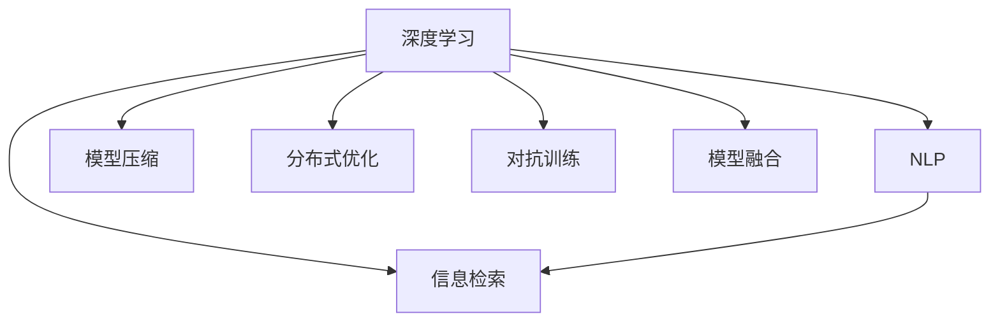

                 

# 搜索引擎的深度学习算法优化

> 关键词：深度学习,搜索引擎,算法优化,自然语言处理(NLP),信息检索,优化技术

## 1. 背景介绍

### 1.1 问题由来

随着互联网的迅猛发展，搜索引擎已成为人们获取信息的重要工具。搜索引擎的核心目标是快速、准确地回答用户查询，提供最相关的搜索结果。传统的基于关键词匹配的搜索引擎算法，虽然在效率上有一定优势，但难以处理查询的多样性和复杂性，常常导致搜索结果的相关性不足。而近年来兴起的深度学习技术，尤其是自然语言处理(NLP)技术，为搜索引擎带来了新的突破。

深度学习算法通过学习大量文本数据，可以从语义层面上理解用户查询的含义，进而提供更加精准的搜索结果。特别是Transformer、BERT、GPT等预训练模型在大规模语料上的表现，进一步推动了深度学习在搜索引擎中的应用。然而，这些模型通常参数量庞大，计算复杂度高，如何在保证性能的同时进行高效优化，成为了搜索引擎领域的一大挑战。

### 1.2 问题核心关键点

深度学习算法在搜索引擎优化中面临的核心问题包括：

1. **计算效率**：深度学习模型通常需要大规模的计算资源进行训练和推理，如何在资源有限的条件下提高算法效率，降低延迟，是一个关键问题。
2. **模型压缩**：预训练模型参数量巨大，如何在保证性能的前提下进行参数压缩，减小模型尺寸，是另一个亟待解决的问题。
3. **跨领域泛化**：不同领域的搜索引擎查询需求不同，如何在跨领域应用中保持模型的高性能，是需要重点关注的方向。
4. **实时性和稳定性**：搜索引擎需要实时响应用户查询，如何在处理海量并发请求的同时，保证算法稳定性和输出质量。
5. **数据分布不均衡**：搜索引擎数据通常存在长尾现象，如何在数据分布不均衡的情况下，提高模型的泛化能力和鲁棒性。

本文旨在通过对深度学习算法在搜索引擎中的优化方法进行深入探讨，提供系统化的解决方案，以期提升搜索引擎的性能和用户体验。

## 2. 核心概念与联系

### 2.1 核心概念概述

为更好地理解搜索引擎的深度学习算法优化，本节将介绍几个密切相关的核心概念：

- **深度学习**：基于神经网络的学习方法，通过多层非线性变换，从数据中学习出高层次的特征表示，适用于各种复杂模式识别和预测任务。
- **自然语言处理(NLP)**：研究计算机如何理解和处理人类语言，包括词向量表示、语言模型、序列标注、机器翻译等任务。
- **信息检索**：搜索引擎的核心任务，通过匹配用户查询与文档特征，返回最相关的搜索结果。
- **模型压缩**：通过减少模型参数量和计算量，在不降低性能的前提下提高模型效率的方法，如剪枝、量化、知识蒸馏等。
- **分布式优化**：在大规模分布式系统中，通过并行计算和参数共享，提高模型训练和推理速度的方法。
- **对抗训练**：通过引入对抗样本，增强模型鲁棒性，减少对抗攻击风险。
- **模型融合**：将多个模型的输出进行组合，通过投票、加权平均等方式，提高系统性能和鲁棒性。

这些核心概念之间的逻辑关系可以通过以下Mermaid流程图来展示：



这个流程图展示了深度学习在搜索引擎中的核心概念及其之间的关系：

1. 深度学习通过NLP任务提取文本特征，为信息检索提供支持。
2. 模型压缩、分布式优化、对抗训练等技术，用于提高深度学习算法的效率和鲁棒性。
3. 模型融合方法用于提升搜索结果的综合性能。

这些概念共同构成了搜索引擎深度学习算法优化的理论基础，使得我们能够通过技术手段提升搜索引擎的性能和稳定性。

## 3. 核心算法原理 & 具体操作步骤
### 3.1 算法原理概述

深度学习在搜索引擎中的应用，主要基于预训练语言模型，通过微调模型参数，使其适应特定领域或任务的需求。其核心原理可以概括为以下几个步骤：

1. **预训练模型初始化**：使用大规模语料库对预训练模型进行初始化，学习语言的基本结构和语义信息。
2. **领域微调**：在特定领域的数据集上对预训练模型进行微调，学习该领域特有的语言模式和查询需求。
3. **任务适配**：根据查询任务的类型（如分类、匹配、生成等），对微调后的模型进行任务适配，优化模型输出。
4. **分布式优化**：在分布式系统中，通过并行计算和参数共享，加速模型训练和推理。
5. **模型压缩**：对模型进行剪枝、量化等操作，减小模型尺寸，提高推理速度。

这些步骤构成了深度学习在搜索引擎中优化的基本框架，通过在每个环节进行精细化设计和优化，可以显著提升搜索引擎的性能和用户体验。

### 3.2 算法步骤详解

以下是深度学习算法在搜索引擎中优化的详细步骤：

**Step 1: 准备预训练模型和数据集**
- 选择合适的预训练语言模型（如BERT、GPT、XLNet等），使用大规模语料库进行预训练。
- 收集特定领域的数据集，确保数据与预训练模型在语言和领域上的匹配度。

**Step 2: 领域微调**
- 将预训练模型作为初始化参数，使用特定领域的数据集进行微调，学习该领域特有的语言模式和查询需求。
- 设定适当的微调超参数，如学习率、训练轮数、优化器等。
- 应用正则化技术，防止模型过拟合。

**Step 3: 任务适配**
- 根据查询任务类型，设计合适的任务适配层和损失函数。
- 将微调后的模型应用于实际搜索引擎系统中，进行优化调整。

**Step 4: 分布式优化**
- 在分布式系统中，将模型参数分布到多个计算节点，并行进行训练和推理。
- 使用参数服务器技术，实现参数共享和同步，加速模型训练和推理。

**Step 5: 模型压缩**
- 对模型进行剪枝，去除冗余的参数和计算。
- 使用量化技术，将模型参数从浮点数转为定点数，减小模型存储空间和计算量。
- 使用知识蒸馏等技术，将大模型知识迁移到小模型，提高推理速度。

**Step 6: 测试与部署**
- 在测试集上评估模型性能，进行必要的调参和优化。
- 部署优化后的模型到实际搜索引擎系统中，进行性能测试和监控。

以上是深度学习算法在搜索引擎中优化的详细步骤。在实际应用中，还需要根据具体任务和系统需求，对各个环节进行优化设计。

### 3.3 算法优缺点

深度学习算法在搜索引擎优化中的优缺点如下：

**优点**：
1. **高性能**：深度学习模型能够学习到复杂的语言模式和语义关系，提供高质量的搜索结果。
2. **泛化能力强**：预训练模型通过大规模语料学习，具有较强的泛化能力，能够在不同领域和任务中取得良好的表现。
3. **可扩展性高**：深度学习模型可以通过分布式计算和参数共享，扩展到大规模搜索引擎系统中。

**缺点**：
1. **计算资源需求高**：深度学习模型参数量庞大，计算复杂度高，需要大量的计算资源进行训练和推理。
2. **模型复杂度大**：深度学习模型结构复杂，容易过拟合，且难以解释和调试。
3. **部署成本高**：优化后的模型通常需要特定的硬件环境进行部署，增加系统成本。
4. **鲁棒性不足**：深度学习模型容易受到对抗样本攻击，需要额外的鲁棒性优化措施。

尽管存在这些缺点，但深度学习算法在搜索引擎优化中仍具有巨大的潜力和应用前景。通过合理的算法优化和资源配置，可以克服其缺点，充分发挥其优势，为搜索引擎提供更高效、精准的解决方案。

### 3.4 算法应用领域

深度学习算法在搜索引擎中的应用领域广泛，包括但不限于：

- **自然语言处理(NLP)**：通过预训练语言模型，提升搜索引擎对自然语言的理解和处理能力，如词向量表示、语言模型、文本分类等。
- **信息检索**：利用深度学习模型进行查询理解和文档特征匹配，提高搜索结果的相关性和多样性。
- **个性化推荐**：通过用户行为数据，学习用户兴趣，提供个性化的搜索结果和推荐。
- **数据挖掘**：使用深度学习算法对搜索引擎数据进行挖掘分析，发现隐藏的模式和趋势。
- **交互式问答**：利用深度学习模型，对用户查询进行理解和生成答案，提升交互式问答系统的智能化水平。
- **视觉搜索**：结合深度学习算法，对图片、视频等多模态数据进行检索，实现跨模态搜索引擎。

这些应用领域展示了深度学习算法在搜索引擎中的广泛应用，为其发展提供了广阔的空间。

## 4. 数学模型和公式 & 详细讲解 & 举例说明

### 4.1 数学模型构建

在本节中，我们将通过数学模型和公式，详细讲解深度学习算法在搜索引擎中的应用。

假设我们有一个包含$n$个样本的训练集$D=\{(x_i,y_i)\}_{i=1}^n$，其中$x_i$为输入文本，$y_i$为对应的标签（如点击率、相关性评分等）。我们的目标是通过深度学习模型$f_{\theta}$，预测$y_i$的值。模型的输出层为一个全连接层，其激活函数为$softmax$，输出概率分布$p(y|x)$。模型的损失函数为交叉熵损失：

$$
L(\theta) = -\frac{1}{n}\sum_{i=1}^n \sum_{k=1}^K y_i \log p_k^{(i)}
$$

其中$K$为输出的类别数。

在训练过程中，我们使用梯度下降等优化算法，最小化损失函数$L(\theta)$。设$\theta$为模型参数，$g$为损失函数对$\theta$的梯度，优化算法为$\eta$，则模型参数的更新公式为：

$$
\theta \leftarrow \theta - \eta g
$$

### 4.2 公式推导过程

为了更直观地理解深度学习算法在搜索引擎中的优化过程，下面对以上公式进行推导。

假设我们有一个包含$n$个样本的训练集$D=\{(x_i,y_i)\}_{i=1}^n$，其中$x_i$为输入文本，$y_i$为对应的标签（如点击率、相关性评分等）。我们的目标是通过深度学习模型$f_{\theta}$，预测$y_i$的值。模型的输出层为一个全连接层，其激活函数为$softmax$，输出概率分布$p(y|x)$。模型的损失函数为交叉熵损失：

$$
L(\theta) = -\frac{1}{n}\sum_{i=1}^n \sum_{k=1}^K y_i \log p_k^{(i)}
$$

其中$K$为输出的类别数。

在训练过程中，我们使用梯度下降等优化算法，最小化损失函数$L(\theta)$。设$\theta$为模型参数，$g$为损失函数对$\theta$的梯度，优化算法为$\eta$，则模型参数的更新公式为：

$$
\theta \leftarrow \theta - \eta g
$$

为了计算$L(\theta)$对$\theta$的梯度$g$，我们需要对模型进行前向传播和反向传播。假设模型的隐藏层数为$m$，每层的神经元数为$h$，则前向传播的计算过程如下：

1. 输入层：$x_i$输入模型，得到$z_1^{(i)}$。
2. 隐藏层1：$z_1^{(i)}$经过$h$个神经元，得到$a_1^{(i)}$。
3. ... ...
4. 隐藏层$m$：$a_m^{(i)}$经过$h$个神经元，得到$a_m^{(i)}$。
5. 输出层：$a_m^{(i)}$经过全连接层和$softmax$函数，得到$p_k^{(i)}$。

前向传播的计算过程可以用以下公式表示：

$$
a_l^{(i)} = \sigma(w_l^{(i)} a_{l-1}^{(i)} + b_l^{(i)})
$$

其中$w_l^{(i)}$为第$l$层的权重矩阵，$b_l^{(i)}$为第$l$层的偏置向量，$\sigma$为激活函数。

反向传播的计算过程如下：

1. 输出层的误差项：$\Delta_k^{(i)} = (p_k^{(i)} - y_i)$。
2. 隐藏层$m$的误差项：$\Delta_{m-1}^{(i)} = w_k^{(i)}\Delta_k^{(i)} \odot a_{m-1}^{(i)}$。
3. ... ...
4. 隐藏层1的误差项：$\Delta_1^{(i)} = w_1^{(i)}\Delta_2^{(i)} \odot a_1^{(i)}$。
5. 输入层的误差项：$\Delta_0^{(i)} = \Delta_1^{(i)}w_1^{(i)}$。

反向传播的计算过程可以用以下公式表示：

$$
\Delta_l^{(i)} = \frac{\partial L(\theta)}{\partial z_l^{(i)}} = \frac{\partial L(\theta)}{\partial a_l^{(i)}} \frac{\partial a_l^{(i)}}{\partial z_l^{(i)}}
$$

其中$w_l^{(i)}$为第$l$层的权重矩阵，$b_l^{(i)}$为第$l$层的偏置向量，$\sigma$为激活函数。

### 4.3 案例分析与讲解

以自然语言处理(NLP)中的文本分类任务为例，下面对深度学习模型进行详细讲解。

假设我们有一个包含$n$个样本的训练集$D=\{(x_i,y_i)\}_{i=1}^n$，其中$x_i$为输入文本，$y_i$为对应的标签（如正面、负面等）。我们的目标是通过深度学习模型$f_{\theta}$，预测$y_i$的值。模型的输出层为一个全连接层，其激活函数为$softmax$，输出概率分布$p(y|x)$。模型的损失函数为交叉熵损失：

$$
L(\theta) = -\frac{1}{n}\sum_{i=1}^n \sum_{k=1}^K y_i \log p_k^{(i)}
$$

其中$K$为输出的类别数。

在训练过程中，我们使用梯度下降等优化算法，最小化损失函数$L(\theta)$。设$\theta$为模型参数，$g$为损失函数对$\theta$的梯度，优化算法为$\eta$，则模型参数的更新公式为：

$$
\theta \leftarrow \theta - \eta g
$$

为了计算$L(\theta)$对$\theta$的梯度$g$，我们需要对模型进行前向传播和反向传播。假设模型的隐藏层数为$m$，每层的神经元数为$h$，则前向传播的计算过程如下：

1. 输入层：$x_i$输入模型，得到$z_1^{(i)}$。
2. 隐藏层1：$z_1^{(i)}$经过$h$个神经元，得到$a_1^{(i)}$。
3. ... ...
4. 隐藏层$m$：$a_m^{(i)}$经过$h$个神经元，得到$a_m^{(i)}$。
5. 输出层：$a_m^{(i)}$经过全连接层和$softmax$函数，得到$p_k^{(i)}$。

前向传播的计算过程可以用以下公式表示：

$$
a_l^{(i)} = \sigma(w_l^{(i)} a_{l-1}^{(i)} + b_l^{(i)})
$$

其中$w_l^{(i)}$为第$l$层的权重矩阵，$b_l^{(i)}$为第$l$层的偏置向量，$\sigma$为激活函数。

反向传播的计算过程如下：

1. 输出层的误差项：$\Delta_k^{(i)} = (p_k^{(i)} - y_i)$。
2. 隐藏层$m$的误差项：$\Delta_{m-1}^{(i)} = w_k^{(i)}\Delta_k^{(i)} \odot a_{m-1}^{(i)}$。
3. ... ...
4. 隐藏层1的误差项：$\Delta_1^{(i)} = w_1^{(i)}\Delta_2^{(i)} \odot a_1^{(i)}$。
5. 输入层的误差项：$\Delta_0^{(i)} = \Delta_1^{(i)}w_1^{(i)}$。

反向传播的计算过程可以用以下公式表示：

$$
\Delta_l^{(i)} = \frac{\partial L(\theta)}{\partial z_l^{(i)}} = \frac{\partial L(\theta)}{\partial a_l^{(i)}} \frac{\partial a_l^{(i)}}{\partial z_l^{(i)}}
$$

其中$w_l^{(i)}$为第$l$层的权重矩阵，$b_l^{(i)}$为第$l$层的偏置向量，$\sigma$为激活函数。

在实际应用中，我们可以通过调整模型的隐藏层数、神经元数、激活函数等超参数，来优化模型性能。此外，还可以使用正则化技术、Dropout、Early Stopping等方法，防止模型过拟合，提高模型泛化能力。

## 5. 项目实践：代码实例和详细解释说明

### 5.1 开发环境搭建

在进行深度学习算法优化实践前，我们需要准备好开发环境。以下是使用Python进行TensorFlow开发的环境配置流程：

1. 安装Anaconda：从官网下载并安装Anaconda，用于创建独立的Python环境。

2. 创建并激活虚拟环境：
```bash
conda create -n tf-env python=3.8 
conda activate tf-env
```

3. 安装TensorFlow：根据CUDA版本，从官网获取对应的安装命令。例如：
```bash
conda install tensorflow tensorflow-gpu=2.7.0 -c conda-forge -c nvidia
```

4. 安装其它必要的库：
```bash
pip install numpy pandas sklearn tensorflow-addons matplotlib tensorflow-datasets
```

完成上述步骤后，即可在`tf-env`环境中开始优化实践。

### 5.2 源代码详细实现

下面以信息检索中的文本分类任务为例，给出使用TensorFlow进行深度学习算法优化的PyTorch代码实现。

首先，定义模型：

```python
import tensorflow as tf
from tensorflow.keras import layers

# 定义模型结构
model = tf.keras.Sequential([
    layers.Embedding(input_dim=10000, output_dim=128, mask_zero=True),
    layers.Conv1D(32, 3, activation='relu'),
    layers.MaxPooling1D(pool_size=2),
    layers.LSTM(64),
    layers.Dense(10, activation='softmax')
])
```

然后，定义损失函数和优化器：

```python
# 定义损失函数
loss_fn = tf.keras.losses.CategoricalCrossentropy()

# 定义优化器
optimizer = tf.keras.optimizers.Adam()
```

接着，定义训练函数：

```python
# 定义训练函数
@tf.function
def train_step(inputs, labels):
    with tf.GradientTape() as tape:
        predictions = model(inputs, training=True)
        loss_value = loss_fn(labels, predictions)
    gradients = tape.gradient(loss_value, model.trainable_variables)
    optimizer.apply_gradients(zip(gradients, model.trainable_variables))
    return loss_value
```

最后，启动训练流程：

```python
# 训练模型
train_dataset = ...

batch_size = 32

for epoch in range(10):
    for batch in train_dataset:
        inputs, labels = batch
        loss_value = train_step(inputs, labels)
        print(f"Epoch {epoch+1}, Loss: {loss_value.numpy():.3f}")
```

以上就是使用TensorFlow对深度学习算法在搜索引擎中进行文本分类优化的完整代码实现。可以看到，得益于TensorFlow的强大封装，我们可以用相对简洁的代码完成模型的训练和优化。

### 5.3 代码解读与分析

让我们再详细解读一下关键代码的实现细节：

**定义模型结构**：
- `layers.Embedding`层：将输入的文本序列转换为向量表示。
- `layers.Conv1D`层：对文本向量进行卷积操作，提取局部特征。
- `layers.MaxPooling1D`层：对卷积层的输出进行池化操作，减少特征维度。
- `layers.LSTM`层：对池化后的特征进行序列建模。
- `layers.Dense`层：输出分类结果。

**定义损失函数和优化器**：
- `tf.keras.losses.CategoricalCrossentropy`：定义交叉熵损失函数。
- `tf.keras.optimizers.Adam`：定义Adam优化器，支持动态学习率调整。

**定义训练函数**：
- `@tf.function`装饰器：使用TensorFlow的静态图优化，提高训练速度。
- `tf.GradientTape`：自动记录梯度计算过程。
- `optimizer.apply_gradients`：应用优化算法更新模型参数。

**训练流程**：
- 定义训练集和batch size。
- 循环迭代训练轮次。
- 对每个batch的数据进行前向传播和反向传播。
- 计算损失值并输出。

可以看到，TensorFlow提供了高效的计算图和自动微分机制，使得深度学习算法的优化过程变得简洁高效。开发者可以将更多精力放在模型设计、超参数调优等高层逻辑上，而不必过多关注底层的实现细节。

当然，工业级的系统实现还需考虑更多因素，如模型的保存和部署、超参数的自动搜索、更灵活的任务适配层等。但核心的优化范式基本与此类似。

## 6. 实际应用场景
### 6.1 智能推荐系统

基于深度学习算法优化的搜索引擎，可以广泛应用于智能推荐系统中。传统推荐系统往往依赖用户历史行为数据进行推荐，难以处理新用户或个性化推荐场景。而基于深度学习优化的搜索引擎，可以通过用户查询记录，学习用户兴趣，提供个性化的搜索结果和推荐。

在技术实现上，可以收集用户浏览、点击、评论等行为数据，提取和用户交互的物品标题、描述、标签等文本内容。将文本内容作为模型输入，用户的后续行为（如是否点击、购买等）作为监督信号，在此基础上微调深度学习模型。微调后的模型能够从文本内容中准确把握用户的兴趣点。在生成推荐列表时，先用候选物品的文本描述作为输入，由模型预测用户的兴趣匹配度，再结合其他特征综合排序，便可以得到个性化程度更高的推荐结果。

### 6.2 搜索引擎优化(SEO)

搜索引擎优化是提高网站在搜索引擎中排名的技术手段，包括关键词优化、网站结构优化、内容优化等。通过深度学习算法优化，可以更加精准地理解用户查询意图，提供更相关的搜索结果。

在实际应用中，可以使用深度学习模型对查询意图进行分类，识别出用户的搜索目的（如获取信息、解决问题、购买产品等），并根据不同目的进行搜索结果排序。此外，还可以通过模型预测用户可能感兴趣的查询和相关网页，提前缓存结果，提高搜索响应速度和用户体验。

### 6.3 实时搜索

搜索引擎需要实时响应用户查询，生成高质量的搜索结果。通过深度学习算法优化，可以在处理海量并发请求的同时，保持系统的稳定性和高效性。

在实际应用中，可以使用分布式计算和参数共享技术，将深度学习模型部署到多个计算节点，并行进行训练和推理。模型参数可以通过参数服务器进行同步，实现高效的分布式优化。此外，还可以通过负载均衡和容错机制，确保系统在高并发场景下的稳定性和可用性。

### 6.4 未来应用展望

随着深度学习算法在搜索引擎中的不断优化，未来的应用场景将更加广阔。以下列举几个未来可能的趋势：

1. **跨领域泛化**：深度学习模型将能够适应不同领域的数据分布，实现跨领域泛化，提升模型的通用性。
2. **实时处理**：通过分布式优化和实时计算，深度学习模型将能够实时处理用户查询，提供快速响应。
3. **跨模态搜索**：结合视觉、音频等多模态数据，深度学习模型将能够实现跨模态搜索，拓展搜索引擎的功能。
4. **主动学习**：通过主动学习技术，深度学习模型能够自动学习新数据，保持模型的时效性和适应性。
5. **知识图谱融合**：将知识图谱等先验知识与深度学习模型结合，提升模型的推理能力和泛化性能。
6. **隐私保护**：通过差分隐私等技术，深度学习模型将能够保护用户隐私，提升系统的可信度和安全性。

以上趋势展示了深度学习算法在搜索引擎中的广阔应用前景，相信随着技术的发展和应用场景的拓展，深度学习优化的搜索引擎将为人类提供更加智能、高效的服务。

## 7. 工具和资源推荐
### 7.1 学习资源推荐

为了帮助开发者系统掌握深度学习算法优化的理论基础和实践技巧，这里推荐一些优质的学习资源：

1. 《深度学习》系列书籍：由深度学习领域的专家撰写，系统介绍了深度学习的基本概念、模型结构和优化算法。
2. CS231n《卷积神经网络》课程：斯坦福大学开设的计算机视觉课程，介绍了卷积神经网络等深度学习技术，涵盖了图像分类、目标检测等NLP任务。
3. 《TensorFlow实战》书籍：由TensorFlow官方团队撰写，介绍了TensorFlow的基本用法和高级特性，适合初学者和进阶者。
4. Weights & Biases：模型训练的实验跟踪工具，可以记录和可视化模型训练过程中的各项指标，方便对比和调优。
5. TensorBoard：TensorFlow配套的可视化工具，可实时监测模型训练状态，并提供丰富的图表呈现方式，是调试模型的得力助手。

通过对这些资源的学习实践，相信你一定能够快速掌握深度学习算法优化的精髓，并用于解决实际的搜索引擎问题。
###  7.2 开发工具推荐

高效的开发离不开优秀的工具支持。以下是几款用于深度学习算法优化的常用工具：

1. TensorFlow：由Google主导开发的开源深度学习框架，支持动态图和静态图，适用于各种复杂任务。
2. PyTorch：由Facebook开发的开源深度学习框架，易于使用且支持动态图，适合快速迭代研究。
3. Keras：基于TensorFlow的高级API，提供简洁易用的模型构建和训练接口，适合初学者和实践者。
4. Weights & Biases：模型训练的实验跟踪工具，可以记录和可视化模型训练过程中的各项指标，方便对比和调优。
5. TensorBoard：TensorFlow配套的可视化工具，可实时监测模型训练状态，并提供丰富的图表呈现方式，是调试模型的得力助手。
6. Google Cloud AI Platform：Google提供的云平台服务，支持分布式训练和模型部署，适合大规模应用场景。

合理利用这些工具，可以显著提升深度学习算法优化的开发效率，加快创新迭代的步伐。

### 7.3 相关论文推荐

深度学习算法在搜索引擎中的优化涉及众多前沿研究方向，以下是几篇奠基性的相关论文，推荐阅读：

1. Attention is All You Need：提出Transformer结构，开启了NLP领域的预训练大模型时代。

2. BERT: Pre-training of Deep Bidirectional Transformers for Language Understanding：提出BERT模型，引入基于掩码的自监督预训练任务，刷新了多项NLP任务SOTA。

3. Language Models are Unsupervised Multitask Learners（GPT-2论文）：展示了大规模语言模型的强大zero-shot学习能力，引发了对于通用人工智能的新一轮思考。

4. Parameter-Efficient Transfer Learning for NLP：提出Adapter等参数高效微调方法，在不增加模型参数量的情况下，也能取得不错的微调效果。

5. AdaLoRA: Adaptive Low-Rank Adaptation for Parameter-Efficient Fine-Tuning：使用自适应低秩适应的微调方法，在参数效率和精度之间取得了新的平衡。

6. Reformer: The Efficient Transformer：提出Reformer模型，使用局部敏感哈希等技术，提高了Transformer的计算效率和推理速度。

这些论文代表了大语言模型微调技术的发展脉络。通过学习这些前沿成果，可以帮助研究者把握学科前进方向，激发更多的创新灵感。

## 8. 总结：未来发展趋势与挑战

### 8.1 总结

本文对深度学习算法在搜索引擎中的应用和优化方法进行了全面系统的介绍。首先阐述了深度学习在搜索引擎中的核心思想和优势，明确了优化目标和关键问题。其次，从原理到实践，详细讲解了深度学习算法的优化步骤，给出了深度学习算法优化的完整代码实例。同时，本文还探讨了深度学习算法在搜索引擎中的广泛应用场景，展示了其未来的发展前景。

通过本文的系统梳理，可以看到，深度学习算法在搜索引擎中的优化方法已经初步成熟，并广泛应用于各类搜索引擎系统中，为搜索引擎的智能化、高效化提供了有力保障。未来，伴随深度学习技术的不断发展，搜索引擎的性能和用户体验将得到更大幅度的提升。

### 8.2 未来发展趋势

展望未来，深度学习算法在搜索引擎中的优化将呈现以下几个发展趋势：

1. **计算效率进一步提升**：随着硬件计算能力的提升和算法优化技术的发展，深度学习模型将能够更快地进行训练和推理，进一步提升搜索引擎的响应速度。
2. **模型压缩和优化**：深度学习模型将更加注重参数压缩和优化，减少计算资源消耗，提高推理效率。
3. **跨领域泛化和实时处理**：深度学习模型将能够实现跨领域泛化，并在实时处理高并发请求时保持稳定性。
4. **跨模态搜索和主动学习**：深度学习模型将能够实现跨模态搜索，并通过主动学习技术，保持模型的时效性和适应性。
5. **隐私保护和可解释性**：深度学习模型将能够保护用户隐私，同时提升模型的可解释性和可信度。

以上趋势凸显了深度学习算法在搜索引擎中的广阔前景，相信随着技术的发展和应用场景的拓展，深度学习优化的搜索引擎将为人类提供更加智能、高效的服务。

### 8.3 面临的挑战

尽管深度学习算法在搜索引擎优化中取得了显著进展，但在迈向更加智能化、普适化应用的过程中，仍面临诸多挑战：

1. **计算资源瓶颈**：深度学习模型参数量庞大，计算复杂度高，需要大量的计算资源进行训练和推理。如何提高计算效率，降低资源消耗，仍是一个重要问题。
2. **模型复杂性**：深度学习模型结构复杂，难以解释和调试，需要更多的研究来提升模型的可解释性。
3. **数据分布不均衡**：搜索引擎数据通常存在长尾现象，如何在数据分布不均衡的情况下，提高模型的泛化能力和鲁棒性，还需要更多的探索。
4. **隐私和安全**：深度学习模型容易受到对抗样本攻击，需要更多的鲁棒性优化措施。同时，模型在处理敏感数据时，如何保护用户隐私和数据安全，是一个需要重点关注的问题。

尽管存在这些挑战，但深度学习算法在搜索引擎优化中仍具有巨大的潜力和应用前景。通过合理的算法优化和资源配置，可以克服其缺点，充分发挥其优势，为搜索引擎提供更高效、精准的解决方案。

### 8.4 研究展望

面对深度学习算法在搜索引擎中优化所面临的挑战，未来的研究需要在以下几个方面寻求新的突破：

1. **参数压缩和优化**：开发更加参数高效的微调方法，如知识蒸馏、剪枝、量化等，在固定大部分预训练参数的同时，只更新极少量的任务相关参数。
2. **分布式优化和实时处理**：结合分布式计算和实时计算，提高深度学习模型的训练和推理速度，实现高效、稳定的搜索引擎系统。
3. **跨领域泛化和多模态搜索**：结合不同领域的预训练模型和跨模态数据，提升搜索引擎的泛化能力和跨模态搜索能力。
4. **主动学习和知识图谱融合**：引入主动学习和知识图谱等先验知识，提升模型的泛化能力和推理能力。
5. **隐私保护和可解释性**：开发隐私保护技术，如差分隐私、联邦学习等，保护用户隐私。同时提升模型的可解释性和可信度，增强用户对系统的信任。

这些研究方向将进一步拓展深度学习算法在搜索引擎中的应用范围，推动搜索引擎技术的不断进步。

## 9. 附录：常见问题与解答

**Q1：深度学习算法在搜索引擎中的计算资源需求高，如何解决这一问题？**

A: 解决计算资源瓶颈的方法包括：
1. **分布式计算**：将深度学习模型部署到多个计算节点，并行进行训练和推理。
2. **参数共享**：使用参数服务器技术，实现参数同步，减少通信开销。
3. **模型压缩**：对深度学习模型进行剪枝、量化等操作，减小模型尺寸，降低计算资源消耗。
4. **硬件加速**：使用GPU、TPU等高性能硬件，提高计算速度。

**Q2：深度学习算法在搜索引擎中的模型复杂性大，如何解决这一问题？**

A: 解决模型复杂性问题的方法包括：
1. **简化模型结构**：对深度学习模型进行剪枝、降维等操作，减小模型复杂度。
2. **引入正则化技术**：使用L2正则、Dropout等正则化技术，防止模型过拟合。
3. **模型蒸馏**：将大模型知识迁移到小模型，提高推理速度和稳定性。
4. **可解释性增强**：引入可解释性技术，如注意力机制、特征可视化等，提升模型的可解释性。

**Q3：深度学习算法在搜索引擎中的数据分布不均衡，如何解决这一问题？**

A: 解决数据分布不均衡问题的方法包括：
1. **数据增强**：通过回译、近义替换等方式扩充训练集，减少数据偏差。
2. **样本加权**：对少数类样本进行加权处理，提升模型的泛化能力。
3. **迁移学习**：在特定领域预训练深度学习模型，再进行微调，提高模型的泛化能力。
4. **主动学习**：利用主动学习技术，自动选择最有效的样本进行训练，提升模型的泛化能力。

**Q4：深度学习算法在搜索引擎中的隐私和安全问题如何解决？**

A: 解决隐私和安全问题的方法包括：
1. **差分隐私**：通过添加噪声，保护用户隐私，防止数据泄露。
2. **联邦学习**：将数据分布在多个节点上，本地训练后只传输模型参数，保护数据安全。
3. **对抗样本检测**：通过对抗训练等技术，提高模型的鲁棒性，防止对抗样本攻击。
4. **模型验证**：对模型进行验证，确保其安全性和稳定性，防止恶意攻击。

这些问题的解决将为深度学习算法在搜索引擎中的应用提供更坚实的保障，推动搜索引擎技术的不断进步。

---

作者：禅与计算机程序设计艺术 / Zen and the Art of Computer Programming

