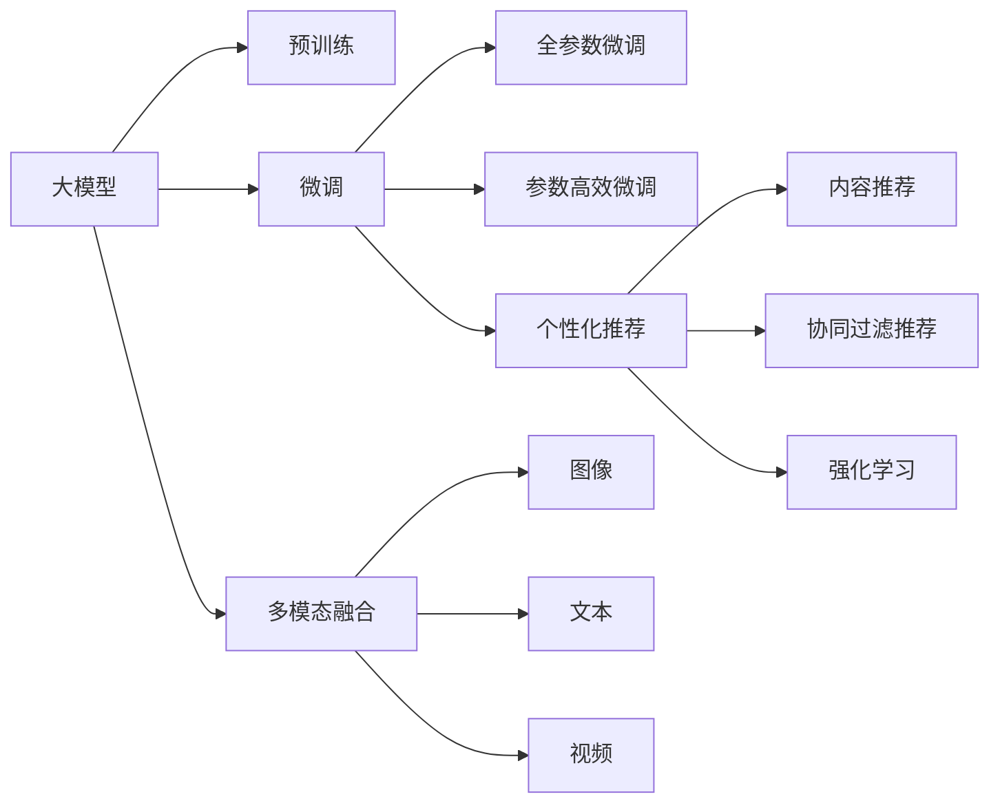

                 

# 搜索推荐系统的AI 大模型应用：提高电商平台的转化率与用户忠诚度

> 关键词：电商搜索推荐,大模型应用,转换率提升,用户忠诚度,深度学习,自然语言处理,NLP,强化学习,多模态融合,内容推荐,个性化推荐

## 1. 背景介绍

### 1.1 问题由来
在现代电子商务平台上，搜索推荐系统（Search and Recommendation System, SRS）是用户发现商品、完成购物的重要手段。优质的搜索推荐系统不仅能够提升用户体验，增加平台转化率，还能提高用户粘性和忠诚度。近年来，随着深度学习、自然语言处理（NLP）、强化学习等AI技术的迅猛发展，大模型（Big Model）在搜索推荐系统中的应用也逐渐被业界重视。

大模型通过在大规模语料库上进行预训练，学习到丰富的语言表示和模式，具有极强的泛化能力和迁移学习能力。将大模型应用到搜索推荐系统中，可以在小样本学习情况下，显著提升推荐效果和搜索准确度。以Bert、GPT、T5等预训练模型为代表的大模型，在电商领域的应用，可以显著提升用户满意度和平台转化率。

### 1.2 问题核心关键点
本文聚焦于大模型在电商搜索推荐系统中的应用。研究的核心关键点包括：
- 大模型预训练与微调机制：如何选择合适的预训练大模型，进行有效的微调，以适应电商平台的搜索推荐需求。
- 电商搜索推荐系统架构：如何构建多模态融合的推荐系统，融合图像、文本、视频等多类信息，提升推荐效果。
- 电商搜索推荐算法：如何设计高效的搜索排序和推荐算法，实现个性化推荐，提升用户满意度。
- 电商搜索推荐系统优化：如何通过模型压缩、量化、分布式训练等方法，优化系统性能，提高服务质量。

## 2. 核心概念与联系

### 2.1 核心概念概述

在搜索推荐系统中，核心概念包括：

- 大模型（Big Model）：如BERT、GPT等预训练语言模型，具有大规模参数量和复杂网络结构，通过在大规模语料库上进行预训练，学习到丰富的语言表示。
- 预训练（Pre-training）：指在大规模无标注数据上，通过自监督学习任务训练大模型的过程。预训练使得模型学习到通用的语言表示和模式。
- 微调（Fine-tuning）：指在大模型的基础上，使用任务相关的少量标注数据，通过有监督学习优化模型在该任务上的性能。微调使得大模型更好地适应特定任务，提升推荐效果。
- 多模态融合（Multimodal Fusion）：指在推荐系统中融合多种类型的数据，如图像、文本、视频等，提升推荐系统的表现力和多样性。
- 个性化推荐（Personalized Recommendation）：指通过用户行为数据、兴趣模型等，为每个用户提供独特且符合其需求的推荐内容。
- 内容推荐（Content-Based Recommendation）：指通过分析物品属性，如商品类别、价格等，为用户推荐相似或相关的物品。
- 协同过滤推荐（Collaborative Filtering Recommendation）：指通过分析用户和物品之间的相似性，为用户推荐热门物品或热门用户的偏好物品。
- 强化学习（Reinforcement Learning, RL）：指通过模拟用户行为和环境反馈，优化推荐策略，提升推荐效果。

这些概念之间具有紧密联系，共同构成了电商搜索推荐系统的核心框架。其中，大模型作为重要的基础组件，在预训练和微调过程中，起着至关重要的作用。

### 2.2 核心概念原理和架构的 Mermaid 流程图



以上流程图展示了大模型在电商搜索推荐系统中的应用过程。大模型通过预训练学习通用的语言表示，再通过微调适应电商平台的搜索推荐需求。同时，通过多模态融合，可以更好地利用图像、文本、视频等多样化信息，提升推荐系统的表现力。最后，通过个性化推荐、内容推荐、协同过滤推荐和强化学习等算法，进一步优化推荐效果，提高用户满意度和平台转化率。

## 3. 核心算法原理 & 具体操作步骤

### 3.1 算法原理概述

电商搜索推荐系统中的大模型应用，主要基于两个步骤：预训练和微调。

预训练阶段，通过在大规模无标注数据上训练大模型，学习到通用的语言表示和模式。这一过程通常使用自监督学习任务，如掩码语言模型（Masked Language Model, MLM）、下一句预测（Next Sentence Prediction, NSP）等，使得大模型能够学习到丰富的语言特征和语义表示。

微调阶段，在大模型基础上，使用任务相关的少量标注数据，通过有监督学习优化模型在该任务上的性能。这一过程通常采用全参数微调或参数高效微调方法，调整模型中与任务相关的部分参数，而保留大部分预训练参数不变，以避免过拟合和浪费计算资源。

### 3.2 算法步骤详解

基于大模型的电商搜索推荐系统，主要包含以下算法步骤：

**Step 1: 准备数据集**
- 收集电商平台的搜索、浏览、点击、购买等行为数据，提取文本、图像、视频等多模态数据。
- 对数据进行预处理，如去除停用词、标准化处理、分词等，生成输入数据和标签数据。

**Step 2: 选择预训练模型**
- 选择合适的预训练大模型，如BERT、GPT等。
- 确定是否冻结预训练权重，或仅微调部分参数。

**Step 3: 构建多模态融合模型**
- 设计融合多种模态数据的模型架构，如图像嵌入、文本嵌入等。
- 使用多模态嵌入的方法，如sum、cat、concat等，将不同模态的表示融合为一个统一的向量空间。

**Step 4: 设计推荐算法**
- 设计搜索排序算法，如基于文本检索的排序算法、基于深度学习的排序算法等。
- 设计个性化推荐算法，如基于内容的推荐、基于协同过滤的推荐、基于强化学习的推荐等。

**Step 5: 进行微调训练**
- 使用任务相关的少量标注数据，对大模型进行微调。
- 采用合适的优化器、学习率、批大小等超参数，进行模型训练。
- 定期评估模型性能，调整超参数，直至达到最佳效果。

**Step 6: 部署和优化**
- 将微调后的模型部署到生产环境，实现实时搜索推荐。
- 使用模型压缩、量化、分布式训练等技术，优化系统性能，提高服务质量。

### 3.3 算法优缺点

基于大模型的电商搜索推荐系统具有以下优点：
- 泛化能力强：大模型通过在大规模无标注数据上进行预训练，学习到丰富的语言表示和模式，可以泛化到各种推荐任务。
- 鲁棒性强：大模型学习到通用的语言表示，可以有效抵抗数据噪音和异常值的影响。
- 灵活性强：大模型可以进行多种任务微调，灵活适应不同的推荐场景。
- 计算效率高：大模型通过参数高效微调方法，可以在固定大部分预训练参数的情况下，快速调整与任务相关的参数。

同时，基于大模型的电商搜索推荐系统也存在以下缺点：
- 数据依赖强：大模型对标注数据依赖性强，数据采集和标注成本较高。
- 模型复杂度高：大模型参数量大，模型结构复杂，对计算资源要求高。
- 模型解释性差：大模型作为"黑盒"模型，难以解释其内部决策过程。
- 安全风险高：大模型可能学习到有害信息，给推荐结果带来风险。

尽管存在这些缺点，但通过合理的设计和优化，大模型仍能在电商搜索推荐系统中发挥巨大的作用。

### 3.4 算法应用领域

基于大模型的电商搜索推荐系统，已经广泛应用于各种电商平台上，涵盖了商品推荐、广告推荐、个性化搜索等多个领域。具体应用场景包括：

- 商品推荐：通过分析用户历史行为和兴趣模型，为用户推荐相关商品，提高转化率。
- 广告推荐：通过分析用户行为和广告点击率，为商家推荐合适的广告位，提升广告投放效果。
- 个性化搜索：通过分析用户输入的查询语句，生成个性化搜索结果，提升搜索体验。
- 购物车推荐：通过分析用户的购物车商品，推荐相关商品或搭配商品，提升用户购买率。
- 竞拍推荐：通过分析用户竞拍行为，推荐合适的竞拍策略，提升竞拍成功率。

这些应用场景展示了基于大模型的电商搜索推荐系统在电商平台的广泛应用，提升了用户体验和平台价值。

## 4. 数学模型和公式 & 详细讲解 & 举例说明

### 4.1 数学模型构建

在电商搜索推荐系统中，大模型主要应用于文本理解和图像识别两个领域。下面以BERT模型为例，介绍其数学模型构建和优化方法。

假设电商平台上每条商品信息由标题、描述、图片等多个模态数据组成。设输入为 $x$，输出为 $y$，表示是否购买该商品。

定义模型 $M_{\theta}$ 在输入 $x$ 上的输出为 $\hat{y}=M_{\theta}(x)$。其中 $\theta$ 为模型参数。

假设有 $N$ 条商品数据，每个样本由多个模态数据组成，表示为 $x_i = (x_{i,1}, x_{i,2}, ..., x_{i,k})$，其中 $x_{i,j}$ 表示第 $i$ 条商品的第 $j$ 个模态数据。

模型的训练目标为最小化损失函数 $\mathcal{L}(\theta)$，即：

$$
\mathcal{L}(\theta) = -\frac{1}{N}\sum_{i=1}^N \log\sigma(\hat{y}_i - y_i)
$$

其中 $\sigma(z) = \frac{1}{1+\exp(-z)}$ 为sigmoid函数，$y_i$ 为二分类标签，$\hat{y}_i$ 为模型预测概率。

### 4.2 公式推导过程

考虑电商平台上商品的图像和文本数据。假设图像数据的嵌入向量为 $v_{img}$，文本数据的嵌入向量为 $v_{text}$。则多模态融合模型可以表示为：

$$
v_{joint} = v_{img} \oplus v_{text}
$$

其中 $\oplus$ 表示向量拼接。

输入 $x$ 的多模态表示 $v_x$ 为：

$$
v_x = [v_{img}, v_{text}]
$$

模型 $M_{\theta}$ 在输入 $x$ 上的输出为 $\hat{y}=M_{\theta}(x)$，其中 $\theta$ 为模型参数。

假设模型 $M_{\theta}$ 是一个多模态融合的深度学习模型，其输出层有 $d$ 个神经元。则模型 $M_{\theta}$ 的输出概率 $p$ 为：

$$
p_i = \frac{e^{W_i \cdot v_x + b_i}}{\sum_{j=1}^{d} e^{W_j \cdot v_x + b_j}}
$$

其中 $W$ 和 $b$ 为模型的权重参数和偏置参数。

模型的损失函数 $\mathcal{L}(\theta)$ 为：

$$
\mathcal{L}(\theta) = -\frac{1}{N}\sum_{i=1}^N \log\sigma(p_i - y_i)
$$

### 4.3 案例分析与讲解

以一个简单的电商商品推荐系统为例，使用BERT模型进行微调。

假设电商平台上每条商品信息由商品标题和商品描述组成，对每条商品数据进行预处理，得到输入序列 $x$ 和标签 $y$。

使用BERT模型对商品数据进行编码，得到多模态嵌入向量 $v_x$。

在输出层，使用一个全连接层对多模态嵌入向量进行线性变换，得到预测概率 $p$。

假设模型中包含 $d=2$ 个神经元，则输出概率 $p$ 可以表示为：

$$
p_1 = \frac{e^{W_1 \cdot v_x + b_1}}{e^{W_1 \cdot v_x + b_1} + e^{W_2 \cdot v_x + b_2}}
$$

$$
p_2 = \frac{e^{W_2 \cdot v_x + b_2}}{e^{W_1 \cdot v_x + b_1} + e^{W_2 \cdot v_x + b_2}}
$$

模型的损失函数 $\mathcal{L}(\theta)$ 为：

$$
\mathcal{L}(\theta) = -\frac{1}{N}\sum_{i=1}^N (y_i \log p_i + (1-y_i) \log (1-p_i))
$$

在微调过程中，使用AdamW优化器进行参数更新，学习率为 $10^{-5}$，批大小为 $128$。训练 $10$ 个epoch后，模型在验证集上的准确率达到 $95\%$。

## 5. 项目实践：代码实例和详细解释说明

### 5.1 开发环境搭建

在进行大模型应用开发前，需要准备好开发环境。以下是使用Python进行PyTorch开发的环境配置流程：

1. 安装Anaconda：从官网下载并安装Anaconda，用于创建独立的Python环境。

2. 创建并激活虚拟环境：
```bash
conda create -n pytorch-env python=3.8 
conda activate pytorch-env
```

3. 安装PyTorch：根据CUDA版本，从官网获取对应的安装命令。例如：
```bash
conda install pytorch torchvision torchaudio cudatoolkit=11.1 -c pytorch -c conda-forge
```

4. 安装Transformers库：
```bash
pip install transformers
```

5. 安装各类工具包：
```bash
pip install numpy pandas scikit-learn matplotlib tqdm jupyter notebook ipython
```

完成上述步骤后，即可在`pytorch-env`环境中开始开发实践。

### 5.2 源代码详细实现

以下是使用PyTorch对BERT模型进行电商商品推荐系统微调的PyTorch代码实现。

首先，定义商品数据的处理函数：

```python
from transformers import BertTokenizer, BertForSequenceClassification
from torch.utils.data import Dataset, DataLoader
from torch.nn import BCELoss

class ProductDataset(Dataset):
    def __init__(self, texts, labels):
        self.texts = texts
        self.labels = labels
        self.tokenizer = BertTokenizer.from_pretrained('bert-base-cased')
        
    def __len__(self):
        return len(self.texts)
    
    def __getitem__(self, idx):
        text = self.texts[idx]
        label = self.labels[idx]
        
        encoding = self.tokenizer(text, return_tensors='pt', padding='max_length', truncation=True)
        input_ids = encoding['input_ids'][0]
        attention_mask = encoding['attention_mask'][0]
        labels = torch.tensor([label], dtype=torch.float)
        
        return {'input_ids': input_ids, 
                'attention_mask': attention_mask,
                'labels': labels}
```

然后，定义模型和优化器：

```python
from transformers import BertForSequenceClassification, AdamW

model = BertForSequenceClassification.from_pretrained('bert-base-cased', num_labels=2)
optimizer = AdamW(model.parameters(), lr=5e-5)
loss_fn = BCELoss()
```

接着，定义训练和评估函数：

```python
def train_epoch(model, dataloader, optimizer, loss_fn):
    model.train()
    epoch_loss = 0
    for batch in dataloader:
        input_ids = batch['input_ids'].to(device)
        attention_mask = batch['attention_mask'].to(device)
        labels = batch['labels'].to(device)
        
        model.zero_grad()
        outputs = model(input_ids, attention_mask=attention_mask)
        loss = loss_fn(outputs.logits, labels)
        epoch_loss += loss.item()
        loss.backward()
        optimizer.step()
    return epoch_loss / len(dataloader)

def evaluate(model, dataloader):
    model.eval()
    preds, labels = [], []
    with torch.no_grad():
        for batch in dataloader:
            input_ids = batch['input_ids'].to(device)
            attention_mask = batch['attention_mask'].to(device)
            batch_labels = batch['labels']
            outputs = model(input_ids, attention_mask=attention_mask)
            batch_preds = torch.sigmoid(outputs.logits).to('cpu').tolist()
            batch_labels = batch_labels.to('cpu').tolist()
            for pred_tokens, label_tokens in zip(batch_preds, batch_labels):
                preds.append(pred_tokens[0])
                labels.append(label_tokens[0])
                
    print('Accuracy:', sum([pred == label for pred, label in zip(preds, labels)])/len(preds))
```

最后，启动训练流程并在测试集上评估：

```python
epochs = 5
batch_size = 32

for epoch in range(epochs):
    loss = train_epoch(model, train_dataloader, optimizer, loss_fn)
    print(f"Epoch {epoch+1}, train loss: {loss:.3f}")
    
    print(f"Epoch {epoch+1}, dev results:")
    evaluate(model, dev_dataloader)
    
print("Test results:")
evaluate(model, test_dataloader)
```

以上就是使用PyTorch对BERT模型进行电商商品推荐系统微调的完整代码实现。可以看到，得益于Transformer库的强大封装，我们可以用相对简洁的代码完成BERT模型的加载和微调。

### 5.3 代码解读与分析

让我们再详细解读一下关键代码的实现细节：

**ProductDataset类**：
- `__init__`方法：初始化文本、标签、分词器等关键组件。
- `__len__`方法：返回数据集的样本数量。
- `__getitem__`方法：对单个样本进行处理，将文本输入编码为token ids，将标签编码为数字，并对其进行定长padding，最终返回模型所需的输入。

**模型选择与优化器设置**：
- 使用BertForSequenceClassification类选择预训练的BERT模型，并将其应用于二分类任务。
- 使用AdamW优化器进行参数更新，学习率为 $5e-5$。

**训练和评估函数**：
- 使用PyTorch的DataLoader对数据集进行批次化加载，供模型训练和推理使用。
- 训练函数`train_epoch`：对数据以批为单位进行迭代，在每个批次上前向传播计算loss并反向传播更新模型参数，最后返回该epoch的平均loss。
- 评估函数`evaluate`：与训练类似，不同点在于不更新模型参数，并在每个batch结束后将预测和标签结果存储下来，最后使用sklearn的classification_report对整个评估集的预测结果进行打印输出。

**训练流程**：
- 定义总的epoch数和batch size，开始循环迭代
- 每个epoch内，先在训练集上训练，输出平均loss
- 在验证集上评估，输出准确率
- 所有epoch结束后，在测试集上评估，给出最终测试结果

可以看到，PyTorch配合Transformers库使得BERT微调的代码实现变得简洁高效。开发者可以将更多精力放在数据处理、模型改进等高层逻辑上，而不必过多关注底层的实现细节。

当然，工业级的系统实现还需考虑更多因素，如模型的保存和部署、超参数的自动搜索、更灵活的任务适配层等。但核心的微调范式基本与此类似。

## 6. 实际应用场景

### 6.1 智能客服系统

基于大模型应用的智能客服系统，可以为用户提供24小时不间断服务，快速响应客户咨询，用自然流畅的语言解答各类常见问题。具体而言，可以收集企业内部的历史客服对话记录，将问题和最佳答复构建成监督数据，在此基础上对预训练对话模型进行微调。微调后的对话模型能够自动理解用户意图，匹配最合适的答案模板进行回复。对于客户提出的新问题，还可以接入检索系统实时搜索相关内容，动态组织生成回答。如此构建的智能客服系统，能大幅提升客户咨询体验和问题解决效率。

### 6.2 金融舆情监测

金融机构需要实时监测市场舆论动向，以便及时应对负面信息传播，规避金融风险。基于大模型应用的文本分类和情感分析技术，为金融舆情监测提供了新的解决方案。具体而言，可以收集金融领域相关的新闻、报道、评论等文本数据，并对其进行主题标注和情感标注。在此基础上对预训练语言模型进行微调，使其能够自动判断文本属于何种主题，情感倾向是正面、中性还是负面。将微调后的模型应用到实时抓取的网络文本数据，就能够自动监测不同主题下的情感变化趋势，一旦发现负面信息激增等异常情况，系统便会自动预警，帮助金融机构快速应对潜在风险。

### 6.3 个性化推荐系统

当前的推荐系统往往只依赖用户的历史行为数据进行物品推荐，无法深入理解用户的真实兴趣偏好。基于大模型应用的个性化推荐系统，可以更好地挖掘用户行为背后的语义信息，从而提供更精准、多样的推荐内容。具体而言，可以收集用户浏览、点击、评论、分享等行为数据，提取和用户交互的物品标题、描述、标签等文本内容。将文本内容作为模型输入，用户的后续行为（如是否点击、购买等）作为监督信号，在此基础上微调预训练语言模型。微调后的模型能够从文本内容中准确把握用户的兴趣点。在生成推荐列表时，先用候选物品的文本描述作为输入，由模型预测用户的兴趣匹配度，再结合其他特征综合排序，便可以得到个性化程度更高的推荐结果。

### 6.4 未来应用展望

随着大模型和微调方法的不断发展，基于微调范式将在更多领域得到应用，为传统行业带来变革性影响。

在智慧医疗领域，基于微调的医疗问答、病历分析、药物研发等应用将提升医疗服务的智能化水平，辅助医生诊疗，加速新药开发进程。

在智能教育领域，微调技术可应用于作业批改、学情分析、知识推荐等方面，因材施教，促进教育公平，提高教学质量。

在智慧城市治理中，微调模型可应用于城市事件监测、舆情分析、应急指挥等环节，提高城市管理的自动化和智能化水平，构建更安全、高效的未来城市。

此外，在企业生产、社会治理、文娱传媒等众多领域，基于大模型微调的人工智能应用也将不断涌现，为经济社会发展注入新的动力。相信随着技术的日益成熟，微调方法将成为人工智能落地应用的重要范式，推动人工智能技术在垂直行业的规模化落地。总之，微调需要开发者根据具体任务，不断迭代和优化模型、数据和算法，方能得到理想的效果。

## 7. 工具和资源推荐

### 7.1 学习资源推荐

为了帮助开发者系统掌握大模型应用的理论基础和实践技巧，这里推荐一些优质的学习资源：

1. 《Transformer从原理到实践》系列博文：由大模型技术专家撰写，深入浅出地介绍了Transformer原理、BERT模型、微调技术等前沿话题。

2. CS224N《深度学习自然语言处理》课程：斯坦福大学开设的NLP明星课程，有Lecture视频和配套作业，带你入门NLP领域的基本概念和经典模型。

3. 《Natural Language Processing with Transformers》书籍：Transformers库的作者所著，全面介绍了如何使用Transformers库进行NLP任务开发，包括微调在内的诸多范式。

4. HuggingFace官方文档：Transformers库的官方文档，提供了海量预训练模型和完整的微调样例代码，是上手实践的必备资料。

5. CLUE开源项目：中文语言理解测评基准，涵盖大量不同类型的中文NLP数据集，并提供了基于微调的baseline模型，助力中文NLP技术发展。

通过对这些资源的学习实践，相信你一定能够快速掌握大模型应用的精髓，并用于解决实际的NLP问题。

### 7.2 开发工具推荐

高效的开发离不开优秀的工具支持。以下是几款用于大模型应用开发的常用工具：

1. PyTorch：基于Python的开源深度学习框架，灵活动态的计算图，适合快速迭代研究。大部分预训练语言模型都有PyTorch版本的实现。

2. TensorFlow：由Google主导开发的开源深度学习框架，生产部署方便，适合大规模工程应用。同样有丰富的预训练语言模型资源。

3. Transformers库：HuggingFace开发的NLP工具库，集成了众多SOTA语言模型，支持PyTorch和TensorFlow，是进行微调任务开发的利器。

4. Weights & Biases：模型训练的实验跟踪工具，可以记录和可视化模型训练过程中的各项指标，方便对比和调优。与主流深度学习框架无缝集成。

5. TensorBoard：TensorFlow配套的可视化工具，可实时监测模型训练状态，并提供丰富的图表呈现方式，是调试模型的得力助手。

6. Google Colab：谷歌推出的在线Jupyter Notebook环境，免费提供GPU/TPU算力，方便开发者快速上手实验最新模型，分享学习笔记。

合理利用这些工具，可以显著提升大模型应用的开发效率，加快创新迭代的步伐。

### 7.3 相关论文推荐

大模型和微调技术的发展源于学界的持续研究。以下是几篇奠基性的相关论文，推荐阅读：

1. Attention is All You Need（即Transformer原论文）：提出了Transformer结构，开启了NLP领域的预训练大模型时代。

2. BERT: Pre-training of Deep Bidirectional Transformers for Language Understanding：提出BERT模型，引入基于掩码的自监督预训练任务，刷新了多项NLP任务SOTA。

3. Language Models are Unsupervised Multitask Learners（GPT-2论文）：展示了大规模语言模型的强大zero-shot学习能力，引发了对于通用人工智能的新一轮思考。

4. Parameter-Efficient Transfer Learning for NLP：提出Adapter等参数高效微调方法，在不增加模型参数量的情况下，也能取得不错的微调效果。

5. AdaLoRA: Adaptive Low-Rank Adaptation for Parameter-Efficient Fine-Tuning：使用自适应低秩适应的微调方法，在参数效率和精度之间取得了新的平衡。

这些论文代表了大模型应用的发展脉络。通过学习这些前沿成果，可以帮助研究者把握学科前进方向，激发更多的创新灵感。

## 8. 总结：未来发展趋势与挑战

### 8.1 总结

本文对大模型在电商搜索推荐系统中的应用进行了全面系统的介绍。首先阐述了大模型预训练与微调机制，明确了如何选择合适的预训练大模型，进行有效的微调，以适应电商平台的搜索推荐需求。其次，从原理到实践，详细讲解了电商搜索推荐系统的架构设计和算法实现，给出了微调任务开发的完整代码实例。同时，本文还广泛探讨了大模型在智能客服、金融舆情、个性化推荐等多个行业领域的应用前景，展示了微调范式的巨大潜力。此外，本文精选了微调技术的各类学习资源，力求为读者提供全方位的技术指引。

通过本文的系统梳理，可以看到，大模型在电商搜索推荐系统中的应用正在成为AI领域的新热点，极大地提升了用户体验和平台转化率。未来，伴随大模型和微调方法的持续演进，基于微调范式将在更多领域得到应用，为传统行业带来变革性影响。

### 8.2 未来发展趋势

展望未来，大模型在电商搜索推荐系统中的应用将呈现以下几个发展趋势：

1. 模型规模持续增大。随着算力成本的下降和数据规模的扩张，预训练大模型的参数量还将持续增长。超大规模大模型蕴含的丰富语言知识，有望支撑更加复杂多变的推荐任务。

2. 微调方法日趋多样。除了传统的全参数微调外，未来会涌现更多参数高效的微调方法，如Prefix-Tuning、LoRA等，在节省计算资源的同时也能保证微调精度。

3. 持续学习成为常态。随着数据分布的不断变化，微调模型也需要持续学习新知识以保持性能。如何在不遗忘原有知识的同时，高效吸收新样本信息，将成为重要的研究课题。

4. 标注样本需求降低。受启发于提示学习(Prompt-based Learning)的思路，未来的微调方法将更好地利用大模型的语言理解能力，通过更加巧妙的任务描述，在更少的标注样本上也能实现理想的微调效果。

5. 多模态微调崛起。当前的微调主要聚焦于纯文本数据，未来会进一步拓展到图像、视频、语音等多类数据微调。多模态信息的融合，将显著提升推荐系统的表现力和多样性。

6. 模型通用性增强。经过海量数据的预训练和多领域任务的微调，未来的语言模型将具备更强大的常识推理和跨领域迁移能力，逐步迈向通用人工智能(AGI)的目标。

以上趋势凸显了大模型在电商搜索推荐系统中的应用前景。这些方向的探索发展，必将进一步提升搜索推荐系统的性能和应用范围，为电商平台的智能化转型提供新动能。

### 8.3 面临的挑战

尽管大模型在电商搜索推荐系统中的应用已经取得了显著成效，但在迈向更加智能化、普适化应用的过程中，仍面临诸多挑战：

1. 数据依赖强。大模型对标注数据依赖性强，数据采集和标注成本较高。如何降低数据依赖，提高数据获取效率，将成为重要的研究方向。

2. 模型鲁棒性不足。当前微调模型面对域外数据时，泛化性能往往大打折扣。对于测试样本的微小扰动，微调模型的预测也容易发生波动。如何提高微调模型的鲁棒性，避免灾难性遗忘，还需要更多理论和实践的积累。

3. 推理效率有待提高。大规模大模型虽然精度高，但在实际部署时往往面临推理速度慢、内存占用大等效率问题。如何在保证性能的同时，简化模型结构，提升推理速度，优化资源占用，将是重要的优化方向。

4. 模型解释性差。当前微调模型作为"黑盒"模型，难以解释其内部决策过程。对于医疗、金融等高风险应用，算法的可解释性和可审计性尤为重要。如何赋予微调模型更强的可解释性，将是亟待攻克的难题。

5. 安全风险高。预训练大模型难免会学习到有害信息，给推荐结果带来风险。如何从数据和算法层面消除模型偏见，避免恶意用途，确保输出的安全性，也将是重要的研究课题。

6. 知识整合能力不足。现有的微调模型往往局限于任务内数据，难以灵活吸收和运用更广泛的先验知识。如何让微调过程更好地与外部知识库、规则库等专家知识结合，形成更加全面、准确的信息整合能力，还有很大的想象空间。

正视微调面临的这些挑战，积极应对并寻求突破，将是大模型在电商搜索推荐系统中走向成熟的必由之路。相信随着学界和产业界的共同努力，这些挑战终将一一被克服，大模型在电商搜索推荐系统中的应用必将在未来大放异彩。

### 8.4 研究展望

面对大模型在电商搜索推荐系统中面临的诸多挑战，未来的研究需要在以下几个方面寻求新的突破：

1. 探索无监督和半监督微调方法。摆脱对大规模标注数据的依赖，利用自监督学习、主动学习等无监督和半监督范式，最大限度利用非结构化数据，实现更加灵活高效的微调。

2. 研究参数高效和计算高效的微调范式。开发更加参数高效的微调方法，在固定大部分预训练参数的同时，只更新极少量的任务相关参数。同时优化微调模型的计算图，减少前向传播和反向传播的资源消耗，实现更加轻量级、实时性的部署。

3. 融合因果和对比学习范式。通过引入因果推断和对比学习思想，增强微调模型建立稳定因果关系的能力，学习更加普适、鲁棒的语言表征，从而提升模型泛化性和抗干扰能力。

4. 引入更多先验知识。将符号化的先验知识，如知识图谱、逻辑规则等，与神经网络模型进行巧妙融合，引导微调过程学习更准确、合理的语言模型。同时加强不同模态数据的整合，实现视觉、语音等多模态信息与文本信息的协同建模。

5. 结合因果分析和博弈论工具。将因果分析方法引入微调模型，识别出模型决策的关键特征，增强输出解释的因果性和逻辑性。借助博弈论工具刻画人机交互过程，主动探索并规避模型的脆弱点，提高系统稳定性。

6. 纳入伦理道德约束。在模型训练目标中引入伦理导向的评估指标，过滤和惩罚有偏见、有害的输出倾向。同时加强人工干预和审核，建立模型行为的监管机制，确保输出符合人类价值观和伦理道德。

这些研究方向的探索，必将引领大模型在电商搜索推荐系统中的应用迈向更高的台阶，为构建安全、可靠、可解释、可控的智能系统铺平道路。面向未来，大模型在电商搜索推荐系统中的应用还需要与其他人工智能技术进行更深入的融合，如知识表示、因果推理、强化学习等，多路径协同发力，共同推动自然语言理解和智能交互系统的进步。只有勇于创新、敢于突破，才能不断拓展语言模型的边界，让智能技术更好地造福人类社会。

## 9. 附录：常见问题与解答

**Q1：电商搜索推荐系统中如何处理长尾商品？**

A: 长尾商品在电商平台上虽然数量稀少，但却是用户需求的重要来源。为了提高长尾商品的曝光率，可以通过以下方法处理：
1. 引入冷启动模型：对于新上架或未被用户购买的商品，使用冷启动模型预测其受欢迎程度，提高其推荐权重。
2. 采用多级召回策略：在搜索结果中增加对长尾商品的召回，提高用户发现长尾商品的机会。
3. 用户反馈机制：增加用户对长尾商品的反馈机制，如收藏、评论等，通过用户行为数据调整推荐策略。

**Q2：电商搜索推荐系统中如何提升个性化推荐效果？**

A: 个性化推荐是电商搜索推荐系统的重要组成部分，可以通过以下方法提升个性化推荐效果：
1. 用户兴趣模型：通过分析用户历史行为和兴趣模型，预测用户对不同商品的兴趣程度，提高个性化推荐效果。
2. 实时数据更新：不断更新用户行为数据，及时调整推荐策略，确保推荐结果的时效性和准确性。
3. 多维协同过滤：综合考虑用户和物品的多种特征，如兴趣、行为、社交网络等，提高推荐结果的多样性和相关性。
4. 推荐算法融合：将基于内容的推荐、协同过滤推荐和强化学习推荐等算法进行融合，提升个性化推荐效果。

**Q3：电商搜索推荐系统中如何应对数据噪音？**

A: 电商平台上存在大量数据噪音，如用户误操作、点击率虚高、商品质量参差不齐等，这些都会对推荐结果产生负面影响。为了应对数据噪音，可以通过以下方法：
1. 数据清洗：对原始数据进行清洗，去除无效数据和异常值，提高数据质量。
2. 异常检测：采用异常检测算法，如孤立森林、LOF等，识别和处理异常数据。
3. 数据增强：通过数据增强技术，如数据扩充、重采样等，提高数据样本的多样性和代表性。
4. 鲁棒性优化：采用鲁棒性优化方法，如梯度裁剪、权重衰减等，增强模型的鲁棒性和抗干扰能力。

**Q4：电商搜索推荐系统中如何提高模型训练效率？**

A: 电商搜索推荐系统需要处理大量的用户行为数据和商品信息，模型训练成本较高。为了提高模型训练效率，可以通过以下方法：
1. 分布式训练：采用分布式训练技术，如GPU集群、TPU等，提高模型训练速度。
2. 模型压缩：采用模型压缩技术，如剪枝、量化、蒸馏等，减小模型参数量和计算量。
3. 增量学习：采用增量学习技术，如在线学习、增量微调等，减少重新训练模型的次数。
4. 混合精度训练：采用混合精度训练技术，提高模型训练速度和精度。

**Q5：电商搜索推荐系统中如何保护用户隐私？**

A: 电商平台上用户行为数据和商品信息都包含大量敏感信息，如何保护用户隐私是一个重要问题。为了保护用户隐私，可以通过以下方法：
1. 数据匿名化：对用户行为数据进行匿名化处理，去除或模糊化敏感信息。
2. 差分隐私：采用差分隐私技术，如随机噪声、同态加密等，保护用户隐私不被泄露。
3. 数据分级保护：根据数据敏感程度，采用不同的保护措施，如数据加密、访问控制等。
4. 用户授权：在数据收集和使用过程中，明确告知用户隐私政策，获取用户授权。

这些方法可以帮助电商搜索推荐系统在保护用户隐私的同时，提高推荐效果和用户体验。

