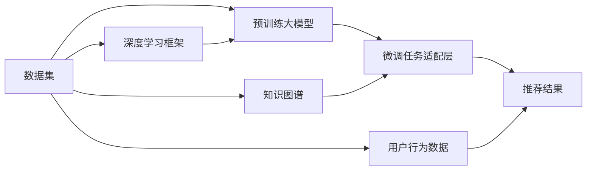

                 

# 搜索推荐系统的AI 大模型应用：电商平台提高竞争力的关键策略

> 关键词：搜索推荐系统, 人工智能大模型, 电商平台, 个性化推荐, 知识图谱, 深度学习, 超大规模模型, 电商竞争力

## 1. 背景介绍

在数字化转型的浪潮中，电商平台作为互联网经济的支柱之一，面临着愈加激烈的市场竞争。如何在海量商品中快速匹配用户需求，提供精准、个性化的购物体验，成为电商平台提高竞争力的关键问题。传统的基于规则和浅层学习的推荐系统已难以适应复杂多变的用户需求。近年来，利用AI大模型和深度学习技术的推荐系统，以其高效、精准的特点，逐渐成为电商平台的核心竞争力。

人工智能大模型，如BERT、GPT-3、T5等，通过对大规模无标签数据进行自监督预训练，获取了丰富的语言表示能力。电商平台通过将用户查询、浏览记录等文本数据作为输入，利用预训练模型进行特征提取，再通过微调任务适配层，得到个性化的推荐结果，实现了显著的推荐效果提升。

## 2. 核心概念与联系

### 2.1 核心概念概述

本节将介绍几个核心概念：

- **搜索推荐系统**：将用户查询映射到对应商品，或推荐符合用户偏好的商品的系统。常用的技术包括基于CF的推荐、基于协同过滤的推荐、基于矩阵分解的推荐、基于内容的推荐、基于知识图谱的推荐等。

- **AI大模型**：通过自监督预训练获取通用知识表示的大型深度学习模型。常见的有BERT、GPT、T5、XLNet等。

- **深度学习**：利用多层神经网络模拟人脑神经元处理信息，通过反向传播算法训练模型，实现对复杂数据的高效处理。

- **超大规模模型**：参数量达到亿级的深度学习模型，如GPT-3、BERT等，在处理大规模数据集时具有优势。

- **知识图谱**：通过构建实体关系图，将知识结构化存储，用于辅助推荐系统更精准地匹配用户查询和商品属性。

这些核心概念构成了搜索推荐系统的基本框架，各个概念之间通过数据流和计算流相连接，形成了一个复杂的系统。

### 2.2 核心概念原理和架构的 Mermaid 流程图



此图展示了大模型在搜索推荐系统中的作用和流程：
1. **数据集**：包含用户行为数据、商品属性数据等。
2. **预训练大模型**：通过自监督预训练学习到丰富的语言表示。
3. **微调任务适配层**：将预训练模型适配到推荐任务，生成推荐结果。
4. **推荐结果**：通过分析用户查询和商品属性，生成个性化推荐。

## 3. 核心算法原理 & 具体操作步骤
### 3.1 算法原理概述

基于AI大模型的推荐系统，通过预训练模型获取语义表示，再通过微调任务适配层，将模型输出映射为推荐结果。这一过程主要包括以下步骤：

1. **预训练模型表示**：利用大规模无标签文本数据，通过自监督预训练学习到通用语义表示。
2. **任务适配层设计**：根据推荐任务特点，设计合适的任务适配层，如匹配模型、生成模型等。
3. **微调模型优化**：使用用户查询、浏览记录等数据，在预训练模型的基础上进行微调，优化模型输出。
4. **推荐结果生成**：将用户查询输入微调后的模型，生成推荐结果。

### 3.2 算法步骤详解

以电商平台的商品推荐为例，算法步骤主要包括：

1. **数据准备**：收集用户查询、浏览记录、商品属性等文本数据，构建训练数据集。
2. **模型加载**：加载预训练的AI大模型，如BERT、GPT等，准备微调。
3. **任务适配层设计**：根据推荐任务设计匹配模型或生成模型，定义损失函数。
4. **模型微调**：使用训练数据集，优化任务适配层参数，最小化损失函数。
5. **推荐结果生成**：将用户查询输入微调后的模型，输出推荐结果。

### 3.3 算法优缺点

基于AI大模型的推荐系统具有以下优点：

- **高效性**：大模型具备强大的语义表示能力，可以快速处理大量数据，生成推荐结果。
- **精准性**：通过深度学习模型，可以从复杂文本数据中提取高层次语义信息，匹配用户需求和商品属性。
- **通用性**：大模型在多种推荐场景下均能取得不错的效果，具有广泛的适用性。

同时，该方法也存在一些缺点：

- **数据依赖**：需要大量高质量标注数据进行微调，数据获取成本较高。
- **模型复杂性**：大模型结构复杂，训练和推理成本高。
- **解释性不足**：推荐结果由黑盒模型生成，难以解释其内部决策机制。
- **资源占用大**：大模型参数量巨大，需要高性能计算资源。

### 3.4 算法应用领域

基于AI大模型的推荐系统，主要应用于以下领域：

- **电商推荐**：通过用户查询、浏览记录生成个性化商品推荐。
- **内容推荐**：对新闻、文章等文本内容进行个性化推荐。
- **搜索匹配**：对用户查询和商品标题进行匹配，快速找到相关商品。
- **广告推荐**：根据用户行为和兴趣生成个性化广告推荐。
- **视频推荐**：对视频内容进行个性化推荐，提升用户观看体验。

## 4. 数学模型和公式 & 详细讲解 & 举例说明

### 4.1 数学模型构建

假设推荐系统任务为给定用户查询 $q$，推荐与该查询最匹配的商品 $i$。模型构建如下：

- **预训练模型**：$M_{\theta}(q)$，其中 $\theta$ 为模型参数。
- **任务适配层**：$F_{\phi}(q)$，其中 $\phi$ 为任务适配层参数。
- **损失函数**：$\mathcal{L}(q, i) = \frac{1}{N}\sum_{j=1}^N \ell(F_{\phi}(q), i_j)$，其中 $\ell$ 为交叉熵损失函数，$i_j$ 为第 $j$ 个用户查询对应的推荐结果。

### 4.2 公式推导过程

以电商推荐为例，假设模型输出为 $p_i(q)$，表示商品 $i$ 对查询 $q$ 的相关性概率。则模型输出的概率表示为：

$$
p_i(q) = \frac{\exp(F_{\phi}(q) \cdot W_i)}{\sum_j \exp(F_{\phi}(q) \cdot W_j)}
$$

其中 $W_i$ 为商品 $i$ 的特征向量，可以通过预训练模型获取。

### 4.3 案例分析与讲解

假设某电商平台对用户查询 "黑色T恤" 进行推荐，查询经过预训练模型处理后得到向量 $q'$。模型输出对各个商品的匹配概率 $p_i(q')$，将 $p_i(q')$ 作为排序依据，选择匹配度最高的商品进行推荐。

## 5. 项目实践：代码实例和详细解释说明
### 5.1 开发环境搭建

在进行推荐系统开发前，需要先搭建开发环境。以下是使用Python进行PyTorch开发的环境配置流程：

1. 安装Anaconda：从官网下载并安装Anaconda，用于创建独立的Python环境。
2. 创建并激活虚拟环境：
```bash
conda create -n pytorch-env python=3.8 
conda activate pytorch-env
```
3. 安装PyTorch：根据CUDA版本，从官网获取对应的安装命令。例如：
```bash
conda install pytorch torchvision torchaudio cudatoolkit=11.1 -c pytorch -c conda-forge
```
4. 安装Transformers库：
```bash
pip install transformers
```
5. 安装各类工具包：
```bash
pip install numpy pandas scikit-learn matplotlib tqdm jupyter notebook ipython
```

完成上述步骤后，即可在`pytorch-env`环境中开始推荐系统开发。

### 5.2 源代码详细实现

下面我们以电商平台商品推荐为例，给出使用Transformers库进行推荐系统开发的PyTorch代码实现。

首先，定义推荐任务的数据处理函数：

```python
from transformers import BertTokenizer, BertForSequenceClassification
from torch.utils.data import Dataset
import torch

class RecommenderDataset(Dataset):
    def __init__(self, texts, labels, tokenizer, max_len=128):
        self.texts = texts
        self.labels = labels
        self.tokenizer = tokenizer
        self.max_len = max_len
        
    def __len__(self):
        return len(self.texts)
    
    def __getitem__(self, item):
        text = self.texts[item]
        label = self.labels[item]
        
        encoding = self.tokenizer(text, return_tensors='pt', max_length=self.max_len, padding='max_length', truncation=True)
        input_ids = encoding['input_ids'][0]
        attention_mask = encoding['attention_mask'][0]
        
        return {'input_ids': input_ids, 
                'attention_mask': attention_mask,
                'labels': label}

# 加载BERT模型和 tokenizer
tokenizer = BertTokenizer.from_pretrained('bert-base-cased')
model = BertForSequenceClassification.from_pretrained('bert-base-cased', num_labels=1)

# 准备数据
train_dataset = RecommenderDataset(train_texts, train_labels, tokenizer, max_len=128)
val_dataset = RecommenderDataset(val_texts, val_labels, tokenizer, max_len=128)
test_dataset = RecommenderDataset(test_texts, test_labels, tokenizer, max_len=128)
```

然后，定义模型和优化器：

```python
from transformers import AdamW

optimizer = AdamW(model.parameters(), lr=2e-5)
```

接着，定义训练和评估函数：

```python
from torch.utils.data import DataLoader
from tqdm import tqdm
from sklearn.metrics import roc_auc_score

device = torch.device('cuda') if torch.cuda.is_available() else torch.device('cpu')
model.to(device)

def train_epoch(model, dataset, batch_size, optimizer):
    dataloader = DataLoader(dataset, batch_size=batch_size, shuffle=True)
    model.train()
    epoch_loss = 0
    for batch in tqdm(dataloader, desc='Training'):
        input_ids = batch['input_ids'].to(device)
        attention_mask = batch['attention_mask'].to(device)
        labels = batch['labels'].to(device)
        model.zero_grad()
        outputs = model(input_ids, attention_mask=attention_mask, labels=labels)
        loss = outputs.loss
        epoch_loss += loss.item()
        loss.backward()
        optimizer.step()
    return epoch_loss / len(dataloader)

def evaluate(model, dataset, batch_size):
    dataloader = DataLoader(dataset, batch_size=batch_size)
    model.eval()
    preds, labels = [], []
    with torch.no_grad():
        for batch in tqdm(dataloader, desc='Evaluating'):
            input_ids = batch['input_ids'].to(device)
            attention_mask = batch['attention_mask'].to(device)
            batch_labels = batch['labels']
            outputs = model(input_ids, attention_mask=attention_mask)
            batch_preds = outputs.logits.argmax(dim=1).to('cpu').tolist()
            batch_labels = batch_labels.to('cpu').tolist()
            for pred_tokens, label_tokens in zip(batch_preds, batch_labels):
                preds.append(pred_tokens)
                labels.append(label_tokens)
                
    roc_auc = roc_auc_score(labels, preds)
    print(f'ROC-AUC: {roc_auc:.3f}')
```

最后，启动训练流程并在测试集上评估：

```python
epochs = 5
batch_size = 16

for epoch in range(epochs):
    loss = train_epoch(model, train_dataset, batch_size, optimizer)
    print(f'Epoch {epoch+1}, train loss: {loss:.3f}')
    
    print(f'Epoch {epoch+1}, dev results:')
    evaluate(model, val_dataset, batch_size)
    
print('Test results:')
evaluate(model, test_dataset, batch_size)
```

以上就是使用PyTorch进行电商平台商品推荐系统微调的完整代码实现。可以看到，得益于Transformers库的强大封装，我们可以用相对简洁的代码完成BERT模型的加载和微调。

### 5.3 代码解读与分析

让我们再详细解读一下关键代码的实现细节：

**RecommenderDataset类**：
- `__init__`方法：初始化文本、标签、分词器等关键组件。
- `__len__`方法：返回数据集的样本数量。
- `__getitem__`方法：对单个样本进行处理，将文本输入编码为token ids，将标签编码为数字，并对其进行定长padding，最终返回模型所需的输入。

**模型和优化器定义**：
- `tokenizer`和`model`的加载：使用BertTokenizer和BertForSequenceClassification分别加载BERT分词器和分类器模型，并将标签设置为1。
- `optimizer`的初始化：使用AdamW优化器进行模型参数的优化，设置学习率为2e-5。

**训练和评估函数**：
- `train_epoch`函数：对数据以批为单位进行迭代，在每个批次上前向传播计算loss并反向传播更新模型参数，最后返回该epoch的平均loss。
- `evaluate`函数：与训练类似，不同点在于不更新模型参数，并在每个batch结束后将预测和标签结果存储下来，最后使用sklearn的roc_auc_score计算ROC-AUC指标。

**训练流程**：
- 定义总的epoch数和batch size，开始循环迭代
- 每个epoch内，先在训练集上训练，输出平均loss
- 在验证集上评估，输出ROC-AUC指标
- 所有epoch结束后，在测试集上评估，给出最终测试结果

可以看到，PyTorch配合Transformers库使得BERT微调的代码实现变得简洁高效。开发者可以将更多精力放在数据处理、模型改进等高层逻辑上，而不必过多关注底层的实现细节。

当然，工业级的系统实现还需考虑更多因素，如模型的保存和部署、超参数的自动搜索、更灵活的任务适配层等。但核心的微调范式基本与此类似。

## 6. 实际应用场景
### 6.1 智能客服系统

基于AI大模型的推荐系统，可以广泛应用于智能客服系统的构建。传统客服往往需要配备大量人力，高峰期响应缓慢，且一致性和专业性难以保证。而使用基于推荐系统的智能客服，可以7x24小时不间断服务，快速响应客户咨询，用自然流畅的语言解答各类常见问题。

在技术实现上，可以收集企业内部的历史客服对话记录，将问题和最佳答复构建成监督数据，在此基础上对预训练推荐模型进行微调。微调后的推荐模型能够自动理解用户意图，匹配最合适的答复模板进行回复。对于客户提出的新问题，还可以接入检索系统实时搜索相关内容，动态组织生成回答。如此构建的智能客服系统，能大幅提升客户咨询体验和问题解决效率。

### 6.2 金融舆情监测

金融机构需要实时监测市场舆论动向，以便及时应对负面信息传播，规避金融风险。传统的人工监测方式成本高、效率低，难以应对网络时代海量信息爆发的挑战。基于AI大模型的推荐系统，在舆情监测中也有着重要的应用。

具体而言，可以收集金融领域相关的新闻、报道、评论等文本数据，并对其进行主题标注和情感标注。在此基础上对预训练推荐模型进行微调，使其能够自动判断文本属于何种主题，情感倾向是正面、中性还是负面。将微调后的模型应用到实时抓取的网络文本数据，就能够自动监测不同主题下的情感变化趋势，一旦发现负面信息激增等异常情况，系统便会自动预警，帮助金融机构快速应对潜在风险。

### 6.3 个性化推荐系统

当前的推荐系统往往只依赖用户的历史行为数据进行物品推荐，无法深入理解用户的真实兴趣偏好。基于AI大模型的推荐系统，可以更好地挖掘用户行为背后的语义信息，从而提供更精准、多样的推荐内容。

在实践中，可以收集用户浏览、点击、评论、分享等行为数据，提取和用户交互的物品标题、描述、标签等文本内容。将文本内容作为模型输入，用户的后续行为（如是否点击、购买等）作为监督信号，在此基础上微调预训练推荐模型。微调后的模型能够从文本内容中准确把握用户的兴趣点。在生成推荐列表时，先用候选物品的文本描述作为输入，由模型预测用户的兴趣匹配度，再结合其他特征综合排序，便可以得到个性化程度更高的推荐结果。

### 6.4 未来应用展望

随着AI大模型和推荐技术的不断发展，基于微调范式将在更多领域得到应用，为传统行业带来变革性影响。

在智慧医疗领域，基于微调的推荐系统，可以在用药推荐、健康管理等方面，提升医疗服务的智能化水平，辅助医生诊疗，加速新药开发进程。

在智能教育领域，微调技术可应用于作业批改、学情分析、知识推荐等方面，因材施教，促进教育公平，提高教学质量。

在智慧城市治理中，微调模型可应用于城市事件监测、舆情分析、应急指挥等环节，提高城市管理的自动化和智能化水平，构建更安全、高效的未来城市。

此外，在企业生产、社会治理、文娱传媒等众多领域，基于大模型微调的人工智能应用也将不断涌现，为经济社会发展注入新的动力。相信随着预训练语言模型和微调方法的不断进步，搜索推荐系统必将在构建人机协同的智能时代中扮演越来越重要的角色。

## 7. 工具和资源推荐
### 7.1 学习资源推荐

为了帮助开发者系统掌握大语言模型微调的理论基础和实践技巧，这里推荐一些优质的学习资源：

1. 《Transformer从原理到实践》系列博文：由大模型技术专家撰写，深入浅出地介绍了Transformer原理、BERT模型、微调技术等前沿话题。

2. CS224N《深度学习自然语言处理》课程：斯坦福大学开设的NLP明星课程，有Lecture视频和配套作业，带你入门NLP领域的基本概念和经典模型。

3. 《Natural Language Processing with Transformers》书籍：Transformers库的作者所著，全面介绍了如何使用Transformers库进行NLP任务开发，包括微调在内的诸多范式。

4. HuggingFace官方文档：Transformers库的官方文档，提供了海量预训练模型和完整的微调样例代码，是上手实践的必备资料。

5. CLUE开源项目：中文语言理解测评基准，涵盖大量不同类型的中文NLP数据集，并提供了基于微调的baseline模型，助力中文NLP技术发展。

通过对这些资源的学习实践，相信你一定能够快速掌握大语言模型微调的精髓，并用于解决实际的NLP问题。
###  7.2 开发工具推荐

高效的开发离不开优秀的工具支持。以下是几款用于大语言模型微调开发的常用工具：

1. PyTorch：基于Python的开源深度学习框架，灵活动态的计算图，适合快速迭代研究。大部分预训练语言模型都有PyTorch版本的实现。

2. TensorFlow：由Google主导开发的开源深度学习框架，生产部署方便，适合大规模工程应用。同样有丰富的预训练语言模型资源。

3. Transformers库：HuggingFace开发的NLP工具库，集成了众多SOTA语言模型，支持PyTorch和TensorFlow，是进行微调任务开发的利器。

4. Weights & Biases：模型训练的实验跟踪工具，可以记录和可视化模型训练过程中的各项指标，方便对比和调优。与主流深度学习框架无缝集成。

5. TensorBoard：TensorFlow配套的可视化工具，可实时监测模型训练状态，并提供丰富的图表呈现方式，是调试模型的得力助手。

6. Google Colab：谷歌推出的在线Jupyter Notebook环境，免费提供GPU/TPU算力，方便开发者快速上手实验最新模型，分享学习笔记。

合理利用这些工具，可以显著提升大语言模型微调任务的开发效率，加快创新迭代的步伐。

### 7.3 相关论文推荐

大语言模型和微调技术的发展源于学界的持续研究。以下是几篇奠基性的相关论文，推荐阅读：

1. Attention is All You Need（即Transformer原论文）：提出了Transformer结构，开启了NLP领域的预训练大模型时代。

2. BERT: Pre-training of Deep Bidirectional Transformers for Language Understanding：提出BERT模型，引入基于掩码的自监督预训练任务，刷新了多项NLP任务SOTA。

3. Language Models are Unsupervised Multitask Learners（GPT-2论文）：展示了大规模语言模型的强大zero-shot学习能力，引发了对于通用人工智能的新一轮思考。

4. Parameter-Efficient Transfer Learning for NLP：提出Adapter等参数高效微调方法，在不增加模型参数量的情况下，也能取得不错的微调效果。

5. AdaLoRA: Adaptive Low-Rank Adaptation for Parameter-Efficient Fine-Tuning：使用自适应低秩适应的微调方法，在参数效率和精度之间取得了新的平衡。

这些论文代表了大语言模型微调技术的发展脉络。通过学习这些前沿成果，可以帮助研究者把握学科前进方向，激发更多的创新灵感。

## 8. 总结：未来发展趋势与挑战

### 8.1 总结

本文对基于AI大模型的推荐系统进行了全面系统的介绍。首先阐述了推荐系统在电商平台的应用背景和重要性，明确了基于大模型的推荐系统在提升用户体验、优化运营效率方面的独特价值。其次，从原理到实践，详细讲解了推荐系统的数学原理和关键步骤，给出了推荐任务开发的完整代码实例。同时，本文还广泛探讨了推荐系统在智能客服、金融舆情、个性化推荐等多个行业领域的应用前景，展示了大模型微调的巨大潜力。此外，本文精选了推荐系统的各类学习资源，力求为读者提供全方位的技术指引。

通过本文的系统梳理，可以看到，基于大模型的推荐系统正在成为电商平台的核心竞争力，极大地拓展了推荐系统的应用边界，催生了更多的落地场景。受益于大规模语料的预训练和深度学习的强大表达能力，推荐系统在精准性和个性化方面取得了显著提升，为电商平台的数字化转型提供了强有力的技术支撑。未来，伴随大模型和微调方法的持续演进，基于AI大模型的推荐系统必将实现更高效、更精准、更智能的推荐效果，为电商平台的发展注入新的活力。

### 8.2 未来发展趋势

展望未来，基于AI大模型的推荐系统将呈现以下几个发展趋势：

1. **模型的多模态融合**：当前基于大模型的推荐系统主要以文本数据为输入，未来的发展方向是融合图像、视频、语音等多模态信息，构建更加全面、丰富的推荐系统。

2. **模型的自适应学习**：推荐系统不再仅仅依赖于静态的模型，而是通过持续学习，不断适应用户行为和市场变化，保持推荐结果的实时性和精准性。

3. **模型的透明化**：推荐系统不仅需要提升推荐的准确性，还需要提高推荐的可解释性，让用户了解推荐结果的生成依据，增强用户的信任和满意度。

4. **模型的可扩展性**：随着数据量和用户规模的不断增长，推荐系统需要具备更好的可扩展性，支持分布式计算和实时数据处理，满足海量数据下的高并发需求。

5. **模型的安全性**：推荐系统需要具备更高的安全性，防止恶意攻击和数据泄露，保障用户隐私和模型安全。

6. **模型的社会责任**：推荐系统需要更多关注其社会影响，避免有害信息的传播，促进社会公平和正义。

这些趋势凸显了推荐系统的广阔前景。未来，通过引入更多先验知识、多模态数据、因果推理等技术，推荐系统将更加智能化、个性化、透明化，为用户提供更加高效、满意的购物体验。

### 8.3 面临的挑战

尽管基于AI大模型的推荐系统已经取得了瞩目成就，但在迈向更加智能化、普适化应用的过程中，它仍面临着诸多挑战：

1. **数据依赖**：推荐系统需要大量的标注数据进行微调，对于长尾应用场景，难以获得充足的高质量标注数据，成为制约推荐性能的瓶颈。如何进一步降低推荐对标注样本的依赖，将是一大难题。

2. **推荐偏见**：当前推荐系统可能会学习到数据中的偏见和歧视，导致推荐结果的不公平和有害。如何检测和消除推荐系统中的偏见，是一个亟待解决的问题。

3. **计算资源需求**：大模型推荐系统需要高性能计算资源支持，算力和存储成本较高。如何在有限的计算资源下，优化推荐系统性能，是工业应用的重要挑战。

4. **推荐算法透明性**：当前推荐系统通常是一个"黑盒"模型，难以解释其内部工作机制和决策逻辑。如何赋予推荐系统更强的可解释性，将是重要的研究方向。

5. **用户隐私保护**：推荐系统需要处理大量的用户数据，如何保护用户隐私，防止数据泄露和滥用，是一个重要问题。

6. **推荐效果稳定**：推荐系统需要适应多变的市场环境，如何提高推荐效果的稳定性和鲁棒性，避免推荐结果的波动，是一个需要长期关注的问题。

7. **推荐算法可解释性**：推荐系统需要赋予用户对其推荐结果的知情权和选择权，如何增强推荐算法的透明度，让用户理解推荐依据，是一个重要研究方向。

### 8.4 研究展望

面对推荐系统面临的种种挑战，未来的研究需要在以下几个方面寻求新的突破：

1. **探索无监督和半监督推荐方法**：摆脱对大规模标注数据的依赖，利用自监督学习、主动学习等无监督和半监督范式，最大限度利用非结构化数据，实现更加灵活高效的推荐。

2. **研究参数高效和计算高效的推荐方法**：开发更加参数高效的推荐方法，在固定大部分预训练参数的同时，只更新极少量的任务相关参数。同时优化推荐系统的计算图，减少前向传播和反向传播的资源消耗，实现更加轻量级、实时性的部署。

3. **引入因果推断和对比学习思想**：通过引入因果推断和对比学习思想，增强推荐系统建立稳定因果关系的能力，学习更加普适、鲁棒的语言表征，从而提升推荐系统的泛化性和抗干扰能力。

4. **融合更多先验知识**：将符号化的先验知识，如知识图谱、逻辑规则等，与神经网络模型进行巧妙融合，引导推荐系统学习更准确、合理的语言模型。同时加强不同模态数据的整合，实现视觉、语音等多模态信息与文本信息的协同建模。

5. **结合因果分析和博弈论工具**：将因果分析方法引入推荐系统，识别出推荐决策的关键特征，增强推荐结果的因果性和逻辑性。借助博弈论工具刻画人机交互过程，主动探索并规避推荐系统的脆弱点，提高系统稳定性。

6. **纳入伦理道德约束**：在推荐系统训练目标中引入伦理导向的评估指标，过滤和惩罚有害的输出倾向。同时加强人工干预和审核，建立推荐系统的监管机制，确保推荐结果符合人类价值观和伦理道德。

这些研究方向的探索，必将引领推荐系统技术迈向更高的台阶，为构建安全、可靠、可解释、可控的智能系统铺平道路。面向未来，推荐系统需要与其他人工智能技术进行更深入的融合，如知识表示、因果推理、强化学习等，多路径协同发力，共同推动智能推荐系统的进步。只有勇于创新、敢于突破，才能不断拓展推荐系统的边界，让智能技术更好地造福人类社会。

## 9. 附录：常见问题与解答

**Q1：大模型推荐系统是否适用于所有电商场景？**

A: 大模型推荐系统在大多数电商场景上都能取得不错的效果，特别是对于数据量较大的电商网站。但对于一些特定领域的电商网站，如奢侈品、高端家具等，由于商品种类繁多且需求多样，仅仅依靠通用语料预训练的模型可能难以很好地适应。此时需要在特定领域语料上进一步预训练，再进行微调，才能获得理想效果。

**Q2：推荐系统如何处理长尾商品？**

A: 长尾商品在电商平台上数量庞大，但销量较低。为处理长尾商品，推荐系统通常采取以下策略：

1. **冷启动策略**：新商品在平台初期销量较低，推荐系统通过冷启动策略，根据商品属性、用户行为等特征，为长尾商品生成初步的推荐结果。
2. **小样本学习**：利用用户的小样本行为数据进行推荐，如点击、浏览等。
3. **动态调整**：根据商品销量和评价等动态数据，不断调整推荐模型，提升长尾商品曝光率。

**Q3：推荐系统如何应对用户行为变化？**

A: 用户行为是动态变化的，为应对用户行为变化，推荐系统通常采取以下策略：

1. **持续学习**：推荐系统通过不断学习和适应用户行为变化，保持推荐结果的实时性。
2. **多模型融合**：将多个推荐模型融合，综合不同模型的推荐结果，提高推荐效果的稳定性和鲁棒性。
3. **用户反馈**：通过用户反馈机制，收集用户对推荐结果的评价，不断优化推荐模型。

**Q4：推荐系统如何处理异常数据？**

A: 异常数据可能对推荐结果产生负面影响，为处理异常数据，推荐系统通常采取以下策略：

1. **数据清洗**：通过数据清洗，去除噪音数据和异常值。
2. **异常检测**：利用异常检测算法，识别出异常数据。
3. **异常处理**：对识别出的异常数据进行处理，如填补、剔除等，保障推荐模型的准确性。

**Q5：推荐系统如何保护用户隐私？**

A: 推荐系统需要处理大量的用户数据，为保护用户隐私，通常采取以下策略：

1. **数据匿名化**：对用户数据进行匿名化处理，防止用户隐私泄露。
2. **差分隐私**：在推荐算法中引入差分隐私技术，保护用户隐私。
3. **数据加密**：对用户数据进行加密存储和传输，保障数据安全。

这些策略可以帮助推荐系统在保护用户隐私的同时，实现精准推荐。

---

作者：禅与计算机程序设计艺术 / Zen and the Art of Computer Programming

