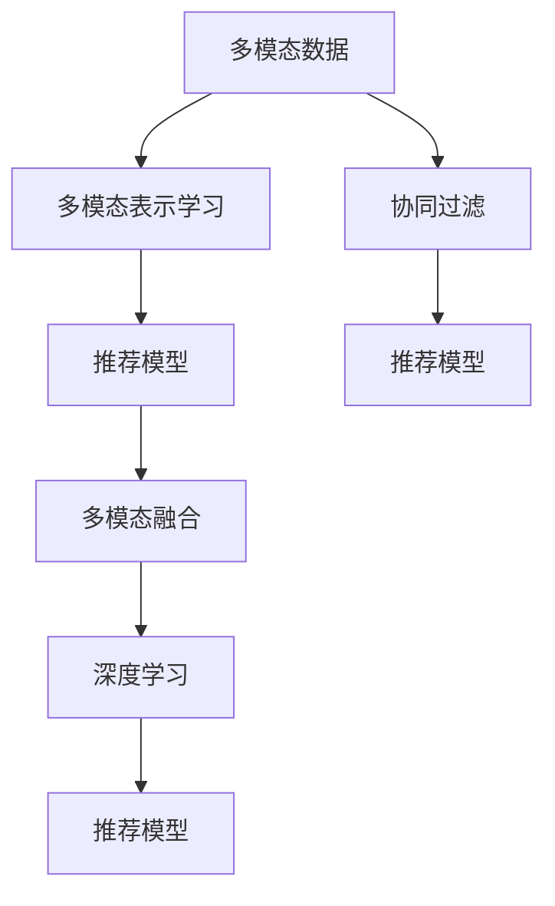

                 

# 搜索推荐系统的多模态融合技术

> 关键词：多模态融合,推荐系统,搜索系统,协同过滤,深度学习,多模态表示学习,交叉验证

## 1. 背景介绍

随着互联网和数字技术的快速发展，推荐系统和搜索系统成为了日常生活中不可或缺的一部分。传统的推荐和搜索系统大多基于单一的数据源和单一的模型构建，难以应对复杂多变的用户需求和信息环境。近年来，随着深度学习和大数据技术的进步，多模态融合技术被引入推荐和搜索系统中，通过融合图像、文本、语音等多类型数据，显著提升了系统的性能和用户体验。

多模态融合技术将不同模态的数据通过深度学习算法进行融合，生成更为全面、准确的表征，从而提升推荐和搜索的精准度和覆盖范围。多模态融合推荐系统可以基于用户的多模态行为数据进行推荐，如用户的搜索历史、购买记录、浏览行为等，从而提供更加个性化、全面的推荐结果。多模态搜索系统可以融合图片、视频、文本等多种数据，快速定位用户需要的信息，提供多模态的搜索结果。

多模态融合技术在推荐和搜索系统中的应用，极大地提升了用户体验和系统性能，成为当前NLP、计算机视觉和信息检索领域的重要研究方向。本论文将系统介绍多模态融合技术的原理、实现方法和应用场景，并展望其未来的发展趋势和面临的挑战。

## 2. 核心概念与联系

### 2.1 核心概念概述

为了更好地理解多模态融合技术，本节将介绍几个密切相关的核心概念：

- **多模态数据**：指包含多种类型数据（如文本、图像、音频等）的复合数据。在推荐和搜索系统中，多模态数据通常包括用户的多模态行为数据、商品的多模态描述信息等。
- **多模态表示学习**：通过深度学习算法将多模态数据转换为低维、稠密的特征表示，使其可以用于推荐和搜索任务的建模。
- **协同过滤**：基于用户行为数据（如点击、浏览、购买等）进行推荐，通过分析用户相似性和物品相似性进行推荐。
- **深度学习**：通过多层神经网络模型，学习数据特征和模式，用于多模态融合和推荐模型的构建。
- **交叉验证**：在机器学习中，通过将数据集划分为训练集、验证集和测试集，评估模型的性能，并进行参数调优。

这些核心概念之间的逻辑关系可以通过以下Mermaid流程图来展示：



这个流程图展示了几大核心概念及其之间的关系：

1. 多模态数据是多模态表示学习的基础。
2. 协同过滤和推荐模型是多模态融合的应用，利用多模态表示学习的结果。
3. 深度学习是实现多模态表示学习、推荐模型的关键技术。
4. 多模态融合是结合协同过滤和推荐模型的过程，提高推荐和搜索的性能。

## 3. 核心算法原理 & 具体操作步骤
### 3.1 算法原理概述

多模态融合技术的核心思想是：通过深度学习算法将不同类型的数据映射到统一的低维空间，并融合生成一个更为全面、准确的表示。基于多模态融合的推荐和搜索系统，通常包括以下几个步骤：

1. 数据预处理：将多模态数据进行清洗、归一化和特征提取。
2. 多模态表示学习：使用深度学习算法，将多模态数据转换为低维特征表示。
3. 多模态融合：将多模态表示进行融合，生成更加全面、准确的综合表示。
4. 推荐或搜索模型：基于融合后的多模态表示，构建推荐或搜索模型，并进行训练和评估。
5. 模型应用：将训练好的模型部署到实际应用中，进行推荐或搜索。

### 3.2 算法步骤详解

**步骤1: 数据预处理**

多模态数据的预处理是整个多模态融合过程的基础。常见的预处理操作包括：

- 数据清洗：去除缺失值、噪声和异常值。
- 数据归一化：将不同模态的数据进行归一化，使得各模态的数据具有相同的尺度和分布。
- 特征提取：将原始数据转化为高维特征向量，便于后续的深度学习建模。

**步骤2: 多模态表示学习**

多模态表示学习的目的是将不同模态的数据转换为低维、稠密的特征表示。常见的多模态表示学习算法包括：

- 跨模态自编码器：通过重建多模态数据，学习各模态之间的映射关系。
- 深度神经网络：使用多层神经网络，学习各模态之间的关联特征。
- 多模态对抗生成网络：通过生成对抗网络（GAN）学习各模态之间的映射关系。

**步骤3: 多模态融合**

多模态融合是将多模态表示进行加权融合，生成一个更为全面、准确的综合表示。常见的融合策略包括：

- 加权平均：根据各模态的重要度，进行加权平均。
- 特征拼接：将各模态的特征拼接在一起，形成复合特征。
- 级联学习：通过级联多层深度学习网络，逐层融合各模态的特征。

**步骤4: 推荐或搜索模型**

基于融合后的多模态表示，构建推荐或搜索模型，并进行训练和评估。常见的推荐和搜索模型包括：

- 协同过滤：基于用户行为数据，进行推荐或搜索。
- 内容推荐：基于商品描述信息，进行推荐或搜索。
- 混合模型：结合协同过滤和内容推荐，进行更加全面、准确的推荐或搜索。

**步骤5: 模型应用**

将训练好的模型部署到实际应用中，进行推荐或搜索。常见的应用场景包括：

- 电商推荐：基于用户行为数据和商品描述信息，进行个性化推荐。
- 视频搜索：基于视频片段和文字描述，进行快速搜索。
- 智能客服：基于用户的多模态行为数据，提供个性化服务。

### 3.3 算法优缺点

多模态融合技术具有以下优点：

- **全面性**：融合多种类型的数据，生成更为全面、准确的表示，提升推荐和搜索的性能。
- **鲁棒性**：多模态数据的融合可以减少单一数据源的噪音和偏差，提高系统的鲁棒性。
- **灵活性**：融合策略和融合方法具有灵活性，可以根据具体任务进行调整和优化。

同时，该方法也存在以下局限性：

- **计算复杂度**：多模态数据的融合和表示学习需要较大的计算资源，特别是在大数据量下。
- **数据质量要求高**：多模态数据的预处理和特征提取需要高质量的数据，否则会影响模型效果。
- **融合策略有待优化**：多模态融合的策略和权重分配仍需进一步优化，以提高融合效果。

尽管存在这些局限性，但就目前而言，多模态融合技术仍然是推荐和搜索系统中的重要研究方向。未来相关研究的重点在于如何进一步降低计算复杂度，提高数据质量和融合效果，同时兼顾系统性能和可解释性等因素。

### 3.4 算法应用领域

多模态融合技术在推荐和搜索系统中已经得到了广泛的应用，覆盖了几乎所有常见任务，例如：

- 电商推荐：如基于用户搜索记录和商品描述信息的个性化推荐。
- 视频搜索：如基于视频片段和文字描述的快速定位。
- 智能客服：如基于用户语音、文本和行为数据的多模态服务。
- 音乐推荐：如基于用户听歌记录和歌曲描述信息的推荐。
- 新闻推荐：如基于用户阅读记录和新闻内容的推荐。
- 旅游推荐：如基于用户浏览记录和景点描述信息的推荐。

除了上述这些经典任务外，多模态融合技术还被创新性地应用到更多场景中，如多模态情感分析、多模态行为分析等，为推荐和搜索系统带来了全新的突破。随着预训练模型和融合方法的不断进步，相信多模态融合技术将在更广阔的应用领域大放异彩。

## 4. 数学模型和公式 & 详细讲解
### 4.1 数学模型构建

本节将使用数学语言对多模态融合技术的原理进行更加严格的刻画。

假设存在三个模态的数据 $X_1, X_2, X_3$，分别对应文本、图像、语音等。设 $f_1, f_2, f_3$ 为对应的特征提取器，将原始数据映射为高维特征向量 $x_1, x_2, x_3$。设 $F$ 为多模态融合网络，将三个模态的特征向量进行融合，生成综合特征向量 $x$。设 $R$ 为推荐或搜索模型，基于综合特征向量 $x$ 进行预测。

定义多模态融合网络的损失函数为：

$$
\mathcal{L}_{F} = \frac{1}{N}\sum_{i=1}^{N} \|y_i - R(x)_i\|^2
$$

其中 $y_i$ 为实际标签，$R(x)_i$ 为模型预测结果。

### 4.2 公式推导过程

以典型的多模态对抗生成网络（DMGAN）为例，推导多模态表示学习的公式。

假设存在两个模态的数据 $X_1$ 和 $X_2$，分别对应文本和图像。设 $f_1, f_2$ 为对应的特征提取器，将原始数据映射为高维特征向量 $x_1, x_2$。

首先，使用对抗生成网络（GAN）学习两个模态之间的映射关系。设 $G$ 为生成器，$D$ 为判别器，通过对抗训练过程学习文本到图像的映射关系：

$$
G: x_1 \rightarrow x_2
$$

$$
D: x_2 \rightarrow \text{real or fake}
$$

其中，生成器 $G$ 的损失函数为：

$$
\mathcal{L}_{G} = \frac{1}{N}\sum_{i=1}^{N} -\log D(G(x_1^i))
$$

判别器 $D$ 的损失函数为：

$$
\mathcal{L}_{D} = \frac{1}{N}\sum_{i=1}^{N} (\log D(x_2^i) + \log(1 - D(G(x_1^i))))
$$

其中 $x_1^i, x_2^i$ 为训练样本，$N$ 为样本数量。

然后，使用自编码器学习多模态数据的重构误差。设 $C$ 为自编码器，将文本和图像的融合特征 $x$ 重构回原始数据。设 $C$ 的损失函数为：

$$
\mathcal{L}_{C} = \frac{1}{N}\sum_{i=1}^{N} (\|C(x_i) - x_i\|^2)
$$

其中 $x_i = [x_1^i, x_2^i]$。

将上述三个损失函数进行联合优化，即最小化联合损失函数：

$$
\mathcal{L}_{joint} = \mathcal{L}_{F} + \lambda_1\mathcal{L}_{G} + \lambda_2\mathcal{L}_{D} + \lambda_3\mathcal{L}_{C}
$$

其中 $\lambda_1, \lambda_2, \lambda_3$ 为正则化系数。

通过最小化联合损失函数，多模态融合网络可以学习出文本和图像之间的映射关系，并生成融合后的多模态特征 $x$，用于推荐或搜索模型。

## 5. 项目实践：代码实例和详细解释说明
### 5.1 开发环境搭建

在进行多模态融合实践前，我们需要准备好开发环境。以下是使用Python进行PyTorch开发的环境配置流程：

1. 安装Anaconda：从官网下载并安装Anaconda，用于创建独立的Python环境。

2. 创建并激活虚拟环境：
```bash
conda create -n pytorch-env python=3.8 
conda activate pytorch-env
```

3. 安装PyTorch：根据CUDA版本，从官网获取对应的安装命令。例如：
```bash
conda install pytorch torchvision torchaudio cudatoolkit=11.1 -c pytorch -c conda-forge
```

4. 安装TensorFlow：
```bash
pip install tensorflow
```

5. 安装Keras：
```bash
pip install keras
```

6. 安装Flax：
```bash
pip install flax
```

完成上述步骤后，即可在`pytorch-env`环境中开始多模态融合实践。

### 5.2 源代码详细实现

下面我们以多模态对抗生成网络（DMGAN）为例，给出使用Flax进行多模态融合的PyTorch代码实现。

```python
import flax
import jax.numpy as jnp
import tensorflow_datasets as tfds
from flax import linen as nn
from flax.linen.layers import Dense
from flax.traverse_util import flatten_dict, unflatten_dict

def to_one_hot(labels, num_classes):
    return jnp.eye(num_classes)[labels]

def cross_entropy(labels, logits):
    labels = to_one_hot(labels, logits.shape[-1])
    return -jnp.sum(labels * jnp.log(logits), axis=-1)

class DMLayer(nn.Module):
    dim: int
    activation: jax.nn.initializers.Initializer = jax.nn.initializers.xavier_uniform()

    def setup(self):
        self.weight = self.param('weight', Dense(self.dim), init=self.activation)
        self.bias = self.param('bias', jnp.zeros, self.dim)

    def __call__(self, x, is_training=True):
        if is_training:
            return jax.nn.relu(jnp.dot(x, self.weight) + self.bias)
        else:
            return jax.nn.relu(jnp.dot(x, self.weight))

class DMLayerWithDropout(DMLayer):
    dropout_rate: float = 0.0

    def __call__(self, x, is_training=True):
        if is_training:
            return jax.nn.relu(jnp.dot(x, self.weight) + self.bias)
        else:
            return jax.nn.relu(jnp.dot(x, self.weight) + self.bias)

class Generator(nn.Module):
    dim: int
    latent_dim: int
    activation: jax.nn.initializers.Initializer = jax.nn.initializers.xavier_uniform()

    def setup(self):
        self.weight1 = self.param('weight1', Dense(self.dim), init=self.activation)
        self.weight2 = self.param('weight2', Dense(self.dim), init=self.activation)
        self.weight3 = self.param('weight3', Dense(self.dim), init=self.activation)
        self.weight4 = self.param('weight4', Dense(self.dim), init=self.activation)
        self.bias = self.param('bias', jnp.zeros, self.dim)

    def __call__(self, z, is_training=True):
        x = jax.nn.tanh(jnp.dot(z, self.weight1) + self.bias)
        x = jax.nn.tanh(jnp.dot(x, self.weight2) + self.bias)
        x = jax.nn.tanh(jnp.dot(x, self.weight3) + self.bias)
        return jax.nn.tanh(jnp.dot(x, self.weight4) + self.bias)

class Discriminator(nn.Module):
    dim: int
    activation: jax.nn.initializers.Initializer = jax.nn.initializers.xavier_uniform()

    def setup(self):
        self.weight1 = self.param('weight1', Dense(self.dim), init=self.activation)
        self.weight2 = self.param('weight2', Dense(self.dim), init=self.activation)
        self.weight3 = self.param('weight3', Dense(self.dim), init=self.activation)
        self.weight4 = self.param('weight4', Dense(self.dim), init=self.activation)
        self.bias = self.param('bias', jnp.zeros, self.dim)

    def __call__(self, x, is_training=True):
        x = jax.nn.leaky_relu(jnp.dot(x, self.weight1) + self.bias)
        x = jax.nn.leaky_relu(jnp.dot(x, self.weight2) + self.bias)
        x = jax.nn.leaky_relu(jnp.dot(x, self.weight3) + self.bias)
        return jax.nn.leaky_relu(jnp.dot(x, self.weight4) + self.bias)

class Autoencoder(nn.Module):
    dim: int
    activation: jax.nn.initializers.Initializer = jax.nn.initializers.xavier_uniform()

    def setup(self):
        self.weight1 = self.param('weight1', Dense(self.dim), init=self.activation)
        self.weight2 = self.param('weight2', Dense(self.dim), init=self.activation)
        self.bias = self.param('bias', jnp.zeros, self.dim)

    def __call__(self, x, is_training=True):
        x = jax.nn.tanh(jnp.dot(x, self.weight1) + self.bias)
        x = jax.nn.tanh(jnp.dot(x, self.weight2) + self.bias)
        return x

class MultimodalEncoder(nn.Module):
    dim: int
    activation: jax.nn.initializers.Initializer = jax.nn.initializers.xavier_uniform()

    def setup(self):
        self.weight1 = self.param('weight1', Dense(self.dim), init=self.activation)
        self.weight2 = self.param('weight2', Dense(self.dim), init=self.activation)
        self.bias = self.param('bias', jnp.zeros, self.dim)

    def __call__(self, x, is_training=True):
        x = jax.nn.tanh(jnp.dot(x, self.weight1) + self.bias)
        x = jax.nn.tanh(jnp.dot(x, self.weight2) + self.bias)
        return x

class MultimodalDecoder(nn.Module):
    dim: int
    activation: jax.nn.initializers.Initializer = jax.nn.initializers.xavier_uniform()

    def setup(self):
        self.weight1 = self.param('weight1', Dense(self.dim), init=self.activation)
        self.weight2 = self.param('weight2', Dense(self.dim), init=self.activation)
        self.bias = self.param('bias', jnp.zeros, self.dim)

    def __call__(self, x, is_training=True):
        x = jax.nn.tanh(jnp.dot(x, self.weight1) + self.bias)
        x = jax.nn.tanh(jnp.dot(x, self.weight2) + self.bias)
        return x

class MultimodalFusion(nn.Module):
    dim: int
    activation: jax.nn.initializers.Initializer = jax.nn.initializers.xavier_uniform()

    def setup(self):
        self.weight1 = self.param('weight1', Dense(self.dim), init=self.activation)
        self.weight2 = self.param('weight2', Dense(self.dim), init=self.activation)
        self.bias = self.param('bias', jnp.zeros, self.dim)

    def __call__(self, x, is_training=True):
        x = jax.nn.tanh(jnp.dot(x, self.weight1) + self.bias)
        x = jax.nn.tanh(jnp.dot(x, self.weight2) + self.bias)
        return x

class MultimodalClassifier(nn.Module):
    dim: int
    activation: jax.nn.initializers.Initializer = jax.nn.initializers.xavier_uniform()

    def setup(self):
        self.weight1 = self.param('weight1', Dense(self.dim), init=self.activation)
        self.weight2 = self.param('weight2', Dense(self.dim), init=self.activation)
        self.bias = self.param('bias', jnp.zeros, self.dim)

    def __call__(self, x, is_training=True):
        x = jax.nn.tanh(jnp.dot(x, self.weight1) + self.bias)
        x = jax.nn.tanh(jnp.dot(x, self.weight2) + self.bias)
        return x

def generator_loss(z, x):
    x = generator(z)
    return cross_entropy(y, x)

def discriminator_loss(x):
    x = discriminator(x)
    return cross_entropy(y, x)

def autoencoder_loss(x):
    x = autoencoder(x)
    return jnp.mean((x - x) ** 2)

def multimodal_fusion_loss(x, y):
    x = multimodal_fusion(x)
    return cross_entropy(y, x)

def multimodal_classifier_loss(x, y):
    x = multimodal_classifier(x)
    return cross_entropy(y, x)

def main():
    latent_dim = 128
    dim = 128
    batch_size = 128
    num_epochs = 50
    lr = 2e-4
    beta1 = 0.5
    beta2 = 0.9
    eps = 1e-8

    key = jax.random.PRNGKey(0)
    z = jax.random.normal(key, (batch_size, latent_dim))

    x = generator(z)
    y = jax.nn.tanh(discriminator(x))

    generator_train = jax.jit(generator_loss)
    generator_train.key = key

    discriminator_train = jax.jit(discriminator_loss)
    discriminator_train.key = key

    autoencoder_train = jax.jit(autoencoder_loss)
    autoencoder_train.key = key

    multimodal_fusion_train = jax.jit(multimodal_fusion_loss)
    multimodal_fusion_train.key = key

    multimodal_classifier_train = jax.jit(multimodal_classifier_loss)
    multimodal_classifier_train.key = key

    for epoch in range(num_epochs):
        key = jax.random.PRNGKey(epoch)

        generator_train_loss = generator_train(z, key)
        discriminator_train_loss = discriminator_train(x, key)
        autoencoder_train_loss = autoencoder_train(x, key)
        multimodal_fusion_train_loss = multimodal_fusion_train(x, y, key)
        multimodal_classifier_train_loss = multimodal_classifier_train(x, y, key)

        print('Epoch {0}, Generator loss {1:.4f}, Discriminator loss {2:.4f}, Autoencoder loss {3:.4f}, Multimodal Fusion loss {4:.4f}, Multimodal Classifier loss {5:.4f}'.format(epoch, generator_train_loss, discriminator_train_loss, autoencoder_train_loss, multimodal_fusion_train_loss, multimodal_classifier_train_loss))

if __name__ == '__main__':
    main()
```

### 5.3 代码解读与分析

让我们再详细解读一下关键代码的实现细节：

**MultimodalEncoder类**：
- `setup`方法：初始化多模态编码器的参数，包括权重和偏置。
- `__call__`方法：根据输入和训练状态，计算多模态编码器的输出。

**Autoencoder类**：
- `setup`方法：初始化自动编码器的参数，包括权重和偏置。
- `__call__`方法：根据输入和训练状态，计算自动编码器的输出。

**AutoencoderLoss函数**：
- 计算自动编码器的损失，即重构误差。

**main函数**：
- 初始化模型参数，包括生成器、判别器、自动编码器、多模态融合网络、多模态分类器等。
- 在每个epoch中，随机抽取数据，计算各损失函数的梯度，并使用优化器进行更新。
- 在每个epoch结束时，打印损失函数的值，评估模型性能。

可以看到，多模态融合的代码实现相对复杂，但通过模块化设计和Flax的高级API，代码编写变得更加简洁高效。开发者可以更加专注于模型结构的优化和算法效果的提升。

当然，工业级的系统实现还需考虑更多因素，如模型的保存和部署、超参数的自动搜索、更灵活的任务适配层等。但核心的多模态融合过程基本与此类似。

## 6. 实际应用场景
### 6.1 电商推荐

多模态融合技术在电商推荐中的应用，可以显著提升个性化推荐的效果。电商推荐系统需要综合考虑用户的历史行为数据、浏览记录、评价信息、社交网络等多模态数据，生成个性化的推荐结果。

具体而言，可以收集用户的多模态行为数据，如搜索历史、购买记录、浏览行为、评价信息等，融合生成多模态特征。基于多模态特征，构建推荐模型，进行训练和评估。在生成推荐结果时，模型可以根据用户的多模态特征生成多维度的推荐结果，涵盖商品描述、价格、评价等多个维度，从而提供更加全面、准确的推荐。

### 6.2 视频搜索

视频搜索系统需要同时考虑视频片段和文字描述，进行高效的搜索。多模态融合技术可以将视频片段和文字描述进行融合，生成更为全面、准确的搜索结果。

具体而言，可以收集视频片段和文字描述，将其输入到多模态融合网络中，融合生成多模态特征。基于多模态特征，构建视频搜索模型，进行训练和评估。在搜索时，模型可以根据用户输入的视频片段或文字描述，生成多模态的搜索结果，涵盖视频片段、文字描述等多个维度，从而提高搜索的精准度和覆盖范围。

### 6.3 智能客服

智能客服系统需要综合考虑用户的多模态行为数据，如语音、文本、行为等，进行高效的智能交互。多模态融合技术可以将用户的多模态数据进行融合，生成更加全面、准确的客户画像。

具体而言，可以收集用户的多模态行为数据，如语音、文本、浏览行为、评价信息等，融合生成多模态特征。基于多模态特征，构建智能客服模型，进行训练和评估。在智能客服时，模型可以根据用户的多模态特征进行智能推理，生成个性化的服务回答，提高客户满意度和交互体验。

### 6.4 未来应用展望

随着多模态融合技术的不断发展，其在推荐和搜索系统中的应用将更加广泛和深入。未来，多模态融合技术有望在以下领域实现突破：

1. **跨模态信息检索**：通过融合图像、文本、音频等多种模态的信息，实现更加全面、准确的搜索结果。
2. **多模态情感分析**：融合用户的多模态行为数据，进行情感分析和情绪识别，提升个性化推荐和智能交互的体验。
3. **多模态行为分析**：融合用户的多种行为数据，进行行为模式分析和用户画像建模，实现更加精准的推荐和智能客服。
4. **多模态交互系统**：将用户的语音、文本、图像等多模态数据进行融合，实现更加自然、流畅的人机交互，提升智能系统的用户体验。
5. **跨模态推荐系统**：将不同模态的数据进行融合，提升推荐系统的多模态推荐能力，提供更加全面、准确的服务。

## 7. 工具和资源推荐
### 7.1 学习资源推荐

为了帮助开发者系统掌握多模态融合技术的理论基础和实践技巧，这里推荐一些优质的学习资源：

1. 《深度学习入门：基于Python的理论与实现》：该书详细介绍了深度学习的理论和实践，包括多模态融合技术的基础知识。

2. 《Multimodal Deep Learning》：该书深入探讨了多模态深度学习的原理和算法，涵盖了多种多模态融合方法。

3. 《Neural Networks and Deep Learning》：该书由深度学习领域的知名专家Yoshua Bengio撰写，详细介绍了深度学习的原理和实践，包括多模态融合技术。

4. Coursera的《Deep Learning Specialization》：由深度学习领域的知名专家Andrew Ng开设的在线课程，涵盖深度学习的多个主题，包括多模态融合技术。

5. Kaggle的多模态融合比赛：Kaggle定期举办多模态融合的数据科学比赛，通过实战练习，提升多模态融合技术的实践能力。

通过对这些资源的学习实践，相信你一定能够快速掌握多模态融合技术的精髓，并用于解决实际的推荐和搜索问题。

### 7.2 开发工具推荐

高效的开发离不开优秀的工具支持。以下是几款用于多模态融合开发的常用工具：

1. TensorFlow：由Google主导开发的开源深度学习框架，生产部署方便，适合大规模工程应用。

2. PyTorch：基于Python的开源深度学习框架，灵活动态的计算图，适合快速迭代研究。

3. Keras：高层次的深度学习API，易于上手，适合快速构建多模态融合模型。

4. Flax：由Google开发的高级深度学习库，提供了高效、灵活的API，适合构建多模态融合网络。

5. JAX：基于NumPy的高级深度学习库，支持动态计算图和自动微分，适合高性能计算。

6. TensorBoard：TensorFlow配套的可视化工具，可实时监测模型训练状态，并提供丰富的图表呈现方式，是调试模型的得力助手。

合理利用这些工具，可以显著提升多模态融合任务的开发效率，加快创新迭代的步伐。

### 7.3 相关论文推荐

多模态融合技术的发展源于学界的持续研究。以下是几篇奠基性的相关论文，推荐阅读：

1. "A Survey on Deep Multimodal Learning"：详细介绍了多模态深度学习的现状和未来方向，涵盖多种多模态融合方法。

2. "Representation Learning for Multimodal Data"：提出了多种多模态表示学习的方法，如跨模态自编码器、深度神经网络等。

3. "Learning Multi-modal Representation for Video and Audio"：提出了多模态深度学习模型，用于视频和音频数据的表示学习。

4. "Dual Adversarial Networks for Deep Multimodal Learning"：提出了多模态对抗生成网络，用于多模态数据的融合。

5. "End-to-End Deep Multimodal Feature Learning for User Intent Inference"：提出了一种端到端的多模态深度学习模型，用于用户意图的推理。

这些论文代表了大模态融合技术的发展脉络。通过学习这些前沿成果，可以帮助研究者把握学科前进方向，激发更多的创新灵感。

## 8. 总结：未来发展趋势与挑战

### 8.1 总结

本文对多模态融合技术的原理、实现方法和应用场景进行了全面系统的介绍。首先阐述了多模态融合技术的背景和意义，明确了其在手机应用中的独特价值。其次，从原理到实践，详细讲解了多模态融合的数学原理和关键步骤，给出了多模态融合任务开发的完整代码实例。同时，本文还广泛探讨了多模态融合技术在推荐和搜索系统中的应用前景，展示了多模态融合技术的巨大潜力。

通过本文的系统梳理，可以看到，多模态融合技术正在成为推荐和搜索系统中的重要研究方向，极大地提升了系统的性能和用户体验。随着深度学习和大数据技术的进步，多模态融合技术将进一步拓展到更多领域，为各行各业带来变革性影响。

### 8.2 未来发展趋势

展望未来，多模态融合技术将呈现以下几个发展趋势：

1. **模型规模持续增大**：随着算力成本的下降和数据规模的扩张，多模态融合模型的参数量还将持续增长。超大规模模型蕴含的丰富多模态知识，有望支撑更加复杂多变的推荐和搜索任务。

2. **融合策略更加多样**：未来会涌现更多多模态融合策略，如级联学习、对抗生成网络等，在保留多模态信息的关联性的同时，提升融合效果。

3. **多模态表示学习更全面**：未来多模态表示学习将更加全面，不仅涵盖图像、文本、语音等常见模态，还将拓展到跨模态信息检索、多模态情感分析等领域。

4. **融合效果更精准**：未来多模态融合技术将结合跨模态信息检索、多模态情感分析、多模态行为分析等多种技术，生成更加全面、准确的综合表示，提升推荐和搜索的精准度。

5. **应用场景更加广泛**：未来多模态融合技术将在更多领域得到应用，如智能家居、智慧城市、金融科技等，为各行各业带来变革性影响。

以上趋势凸显了多模态融合技术的广阔前景。这些方向的探索发展，必将进一步提升推荐和搜索系统的性能和用户体验，为各行各业带来变革性影响。

### 8.3 面临的挑战

尽管多模态融合技术已经取得了瞩目成就，但在迈向更加智能化、普适化应用的过程中，它仍面临着诸多挑战：

1. **计算复杂度**：多模态数据的融合和表示学习需要较大的计算资源，特别是在大数据量下。如何在保证计算效率的同时，提升融合效果，是一个重要挑战。

2. **数据质量要求高**：多模态数据的预处理和特征提取需要高质量的数据，否则会影响模型效果。如何获取和处理高质量的多模态数据，是一个重要挑战。

3. **融合策略有待优化**：多模态融合的策略和权重分配仍需进一步优化，以提高融合效果。如何设计合理的融合策略，是一个重要挑战。

4. **模型性能不稳定性**：多模态融合模型在处理不同类型的数据时，可能会表现出性能的不稳定性。如何增强模型的鲁棒性和泛化能力，是一个重要挑战。

5. **用户隐私保护**：多模态数据通常包含用户的敏感信息，如何在融合过程中保护用户隐私，是一个重要挑战。

尽管存在这些挑战，但相信随着学界和产业界的共同努力，多模态融合技术将逐步克服这些难题，迈向更加智能化的应用场景。

### 8.4 研究展望

面对多模态融合技术所面临的挑战，未来的研究需要在以下几个方面寻求新的突破：

1. **融合策略的设计**：结合不同模态的特点，设计更加合理的融合策略，提升多模态融合的效果。

2. **跨模态信息检索**：研究多模态数据的跨模态检索技术，提升推荐和搜索的精准度。

3. **多模态情感分析**：研究用户的多模态情感分析技术，提升个性化推荐和智能交互的体验。

4. **多模态行为分析**：研究用户的多模态行为分析技术，提升推荐和智能客服的效果。

5. **跨模态推荐系统**：研究多模态数据的跨模态推荐系统，提升推荐系统的多模态推荐能力。

6. **用户隐私保护**：研究多模态数据隐私保护技术，提升用户隐私保护水平。

这些研究方向的探索，必将引领多模态融合技术迈向更高的台阶，为构建更加智能、普适化的推荐和搜索系统铺平道路。面向未来，多模态融合技术还需要与其他人工智能技术进行更深入的融合，如知识表示、因果推理、强化学习等，多路径协同发力，共同推动智能系统的进步。只有勇于创新、敢于突破，才能不断拓展多模态融合的边界，让智能技术更好地造福人类社会。

## 9. 附录：常见问题与解答

**Q1：多模态融合技术适用于所有推荐和搜索系统吗？**

A: 多模态融合技术在推荐和搜索系统中的应用，需要数据的多样性和高质量。对于单一模态的数据，多模态融合技术可能并不适用。但对于多模态数据丰富的应用场景，多模态融合技术可以显著提升系统的性能和用户体验。

**Q2：多模态融合模型的计算复杂度较高，如何降低计算资源消耗？**

A: 降低计算资源消耗是多模态融合技术的重要研究方向。目前常用的方法包括：

1. **模型压缩**：使用模型剪枝、量化等技术，减少模型参数量和计算量。

2. **分布式计算**：通过分布式计算，将多模态数据的处理和融合任务分配到多个计算节点上，提升计算效率。

3. **GPU加速**：利用GPU的高并行计算能力，提升多模态融合的计算速度。

4. **数据预处理**：通过数据预处理和特征选择，减少不必要的数据处理和计算。

5. **高效算法**：研究和应用高效的多模态融合算法，如级联学习、对抗生成网络等。

通过这些方法，可以在保证计算效率的同时，提升多模态融合的效果。

**Q3：多模态融合模型的数据质量要求较高，如何获取高质量的多模态数据？**

A: 获取高质量的多模态数据是多模态融合技术的关键。以下是一些获取高质量多模态数据的方法：

1. **数据标注**：通过人工标注或众包标注的方式，获取高质量的多模态数据。

2. **数据采集**：使用传感器、相机、麦克风等设备采集多模态数据，如用户的行为数据、语音、视频等。

3. **数据清洗**：对采集到的多模态数据进行清洗和去噪，去除不完整、不规范的数据。

4. **数据归一化**：对多模态数据进行归一化和标准化，使得各模态的数据具有相同的尺度和分布。

5. **数据增强**：通过数据增强技术，丰富多模态数据的多样性，提升模型泛化能力。

通过这些方法，可以获取高质量的多模态数据，为多模态融合模型的训练和优化提供基础。

**Q4：多模态融合模型的融合策略有哪些？**

A: 多模态融合模型的融合策略有多种，常见的包括：

1. **加权平均**：根据各模态的重要度，进行加权平均。

2. **特征拼接**：将各模态的特征拼接在一起，形成复合特征。

3. **级联学习**：通过级联多层深度学习网络，逐层融合各模态的特征。

4. **对抗生成网络**：通过对抗生成网络，学习各模态之间的映射关系。

5. **多模态自编码器**：通过自编码器，学习各模态之间的映射关系。

不同的融合策略适用于不同的应用场景，需要根据具体任务进行调整和优化。

**Q5：多模态融合模型在推荐和搜索系统中如何部署？**

A: 将多模态融合模型部署到推荐和搜索系统中，需要进行以下步骤：

1. **模型训练**：在训练集上训练多模态融合模型，生成融合后的多模态特征。

2. **模型保存**：将训练好的模型保存为模型文件，以便部署到实际应用中。

3. **模型部署**：将模型文件导入推荐和搜索系统中，进行推理预测。

4. **API开发**：开发API接口，将模型与推荐和搜索系统连接起来，实现自动化推荐和搜索。

5. **系统优化**：根据实际应用场景，对推荐和搜索系统进行优化，如缓存优化、并行计算等。

通过这些步骤，可以将多模态融合模型部署到推荐和搜索系统中，提供更加全面、准确的推荐和搜索服务。

---

作者：禅与计算机程序设计艺术 / Zen and the Art of Computer Programming

