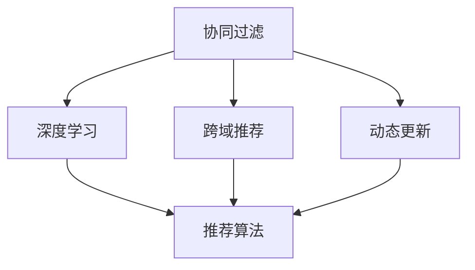

                 

## 1. 背景介绍

### 1.1 问题由来

在当今信息爆炸的时代，用户面临海量的内容选择，传统的基于关键词匹配的搜索推荐系统已无法满足个性化需求。随着数据量的激增，以及用户行为数据的积累，实时个性化推荐技术成为提升用户体验的重要手段。

与此同时，实时个性化推荐技术的应用领域也在不断拓展。从电商的精准推荐，到内容平台的个性化推荐，再到智能广告的定向投放，推荐系统的影响力日益增大。但面对复杂的用户行为和数据特点，推荐系统如何实时准确地捕捉用户兴趣，并生成个性化推荐，已成为亟待解决的问题。

### 1.2 问题核心关键点

实时个性化推荐技术的核心在于两个方面：一是如何准确地捕捉用户的实时兴趣和行为；二是如何高效地生成个性化的推荐结果。这两个问题紧密相连，通常需要通过一个高效且灵活的推荐算法框架来实现。

实时个性化推荐技术主要包含以下几个关键点：
- **协同过滤**：基于用户与物品的相似度，通过分析用户行为数据，推断出用户可能喜欢的物品。
- **深度学习**：使用神经网络等深度学习方法，从用户行为数据中学习用户与物品的复杂关系，以生成更精准的推荐结果。
- **跨域推荐**：将用户在不同平台上的行为数据融合，生成统一的推荐结果。
- **动态更新**：实时更新用户画像和物品信息，保证推荐结果的时效性。

本文将重点介绍实时个性化推荐技术的算法原理、操作步骤和实际应用场景，并结合数学模型和公式进行详细讲解，最后给出代码实例和运行结果展示。

## 2. 核心概念与联系

### 2.1 核心概念概述

为更好地理解实时个性化推荐技术，本节将介绍几个关键概念及其相互之间的联系：

- **协同过滤**：通过分析用户与物品的相似度，推荐用户可能喜欢的物品。协同过滤可分为基于用户的协同过滤和基于物品的协同过滤。
- **深度学习**：利用神经网络等深度学习方法，学习用户与物品的复杂关系，从而生成更精准的推荐结果。深度学习技术包括矩阵分解、神经网络、卷积神经网络等。
- **跨域推荐**：将用户在不同平台上的行为数据融合，生成统一的推荐结果。跨域推荐通常需要考虑数据隐私和安全问题。
- **动态更新**：实时更新用户画像和物品信息，保证推荐结果的时效性。动态更新过程中，需要考虑数据的实时性和存储效率。

这些概念之间的逻辑关系可以通过以下Mermaid流程图来展示：



这个流程图展示出协同过滤、深度学习、跨域推荐和动态更新这四个核心概念，以及它们之间相互连接的关系。协同过滤和深度学习是推荐算法的主要技术手段，跨域推荐和动态更新则保证了推荐结果的实时性和准确性。

## 3. 核心算法原理 & 具体操作步骤
### 3.1 算法原理概述

实时个性化推荐技术的核心算法通常分为两个步骤：

1. **用户行为分析**：通过分析用户的历史行为数据，生成用户画像，捕捉用户的兴趣偏好和行为模式。
2. **推荐结果生成**：根据用户画像和物品特征，使用推荐算法生成个性化的推荐结果。

在实际应用中，推荐算法的选择通常取决于推荐场景和数据特点。例如，在电商推荐中，常常使用基于协同过滤的方法，而在内容推荐中，深度学习方法则更为适用。

### 3.2 算法步骤详解

#### 3.2.1 用户行为分析

用户行为分析的核心是生成用户画像，捕捉用户的兴趣偏好和行为模式。具体步骤如下：

1. **数据收集**：收集用户的历史行为数据，包括点击、浏览、购买、评分等。
2. **特征提取**：将用户行为数据转化为模型能够处理的向量表示，例如使用one-hot编码、TF-IDF等。
3. **用户画像生成**：使用机器学习模型，如协同过滤、聚类、神经网络等，从用户行为数据中学习用户画像。

#### 3.2.2 推荐结果生成

推荐结果生成需要根据用户画像和物品特征，使用推荐算法生成个性化的推荐结果。具体步骤如下：

1. **物品特征提取**：将物品的特征数据转化为向量表示，例如使用词袋模型、TF-IDF等。
2. **相似度计算**：计算用户画像与物品特征之间的相似度，例如使用余弦相似度、欧式距离等。
3. **排序和推荐**：根据相似度计算结果，排序推荐列表，并返回前N个推荐结果。

### 3.3 算法优缺点

实时个性化推荐技术具有以下优点：
- **个性化程度高**：通过分析用户行为数据，能够生成高度个性化的推荐结果。
- **实时性强**：能够根据用户的实时行为数据，动态更新推荐结果。
- **覆盖面广**：推荐算法通常支持多种类型的数据源和推荐场景。

同时，该技术也存在以下局限性：
- **数据隐私问题**：用户行为数据通常包含敏感信息，需要保证数据隐私和安全。
- **模型复杂性高**：深度学习等推荐算法通常需要大量的计算资源和时间。
- **冷启动问题**：对于新用户，由于缺乏历史行为数据，无法生成准确的推荐结果。

尽管存在这些局限性，但就目前而言，实时个性化推荐技术在电商、内容平台、广告等领域已经得到广泛应用，成为提升用户体验和增加业务价值的重要手段。

### 3.4 算法应用领域

实时个性化推荐技术在多个领域得到了广泛应用，例如：

- **电商推荐**：根据用户浏览、购买历史，推荐商品和优惠信息，提高销售额。
- **内容推荐**：分析用户对视频、文章、新闻等内容的互动行为，推荐个性化的内容。
- **智能广告**：根据用户行为数据，推荐精准的广告内容，提升广告效果。
- **金融推荐**：分析用户对金融产品的行为数据，推荐个性化的理财产品。
- **旅游推荐**：分析用户对旅游目的地的兴趣，推荐个性化的旅游方案。

这些应用场景展示了实时个性化推荐技术的多样性和广泛性，为不同领域的用户提供了个性化服务。

## 4. 数学模型和公式 & 详细讲解 & 举例说明
### 4.1 数学模型构建

实时个性化推荐技术的数学模型通常包括以下几个组成部分：

- **用户画像**：表示用户的兴趣偏好和行为模式，通常使用向量表示。
- **物品特征**：表示物品的特征信息，通常使用向量表示。
- **相似度计算**：衡量用户画像与物品特征之间的相似度，通常使用余弦相似度、欧式距离等。
- **推荐排序**：根据相似度计算结果，排序推荐列表，并返回前N个推荐结果。

### 4.2 公式推导过程

#### 4.2.1 用户画像生成

用户画像可以通过协同过滤、聚类、神经网络等方法生成。以协同过滤为例，其公式推导过程如下：

设用户u的兴趣向量为$\mathbf{u}$，物品i的特征向量为$\mathbf{v}_i$，用户u对物品i的评分记为$r_{ui}$。用户画像的生成可以通过协同过滤的方法，计算用户u的兴趣向量$\mathbf{u}$，使得：

$$
\mathbf{u} = \sum_{i=1}^{m} r_{ui} \mathbf{v}_i
$$

其中，$m$表示物品的总数。

#### 4.2.2 相似度计算

相似度计算是推荐算法的重要组成部分，衡量用户画像与物品特征之间的相似度。以余弦相似度为例，其公式推导过程如下：

设用户u的兴趣向量为$\mathbf{u}$，物品i的特征向量为$\mathbf{v}_i$，则余弦相似度计算公式为：

$$
\text{similarity}(u,i) = \frac{\mathbf{u} \cdot \mathbf{v}_i}{\|\mathbf{u}\|\|\mathbf{v}_i\|}
$$

其中，$\cdot$表示向量点积，$\|\cdot\|$表示向量的模长。

#### 4.2.3 推荐排序

推荐排序是推荐算法的最后一步，根据相似度计算结果，排序推荐列表，并返回前N个推荐结果。以基于协同过滤的推荐算法为例，其推荐排序公式为：

$$
\text{rank}(i) = \frac{\text{similarity}(u,i)}{\sum_{j=1}^{m} \text{similarity}(u,j)}
$$

其中，$\text{rank}(i)$表示物品i在推荐列表中的排序。

### 4.3 案例分析与讲解

以电商推荐系统为例，分析其推荐算法的工作原理。电商推荐系统通常采用基于协同过滤的推荐算法，其步骤大致如下：

1. **数据收集**：收集用户的历史行为数据，包括点击、浏览、购买等。
2. **特征提取**：将用户行为数据转化为向量表示，例如使用one-hot编码、TF-IDF等。
3. **用户画像生成**：使用协同过滤的方法，从用户行为数据中学习用户画像。
4. **物品特征提取**：将商品特征数据转化为向量表示，例如使用词袋模型、TF-IDF等。
5. **相似度计算**：计算用户画像与商品特征之间的相似度，例如使用余弦相似度。
6. **推荐排序**：根据相似度计算结果，排序推荐列表，并返回前N个推荐结果。

通过以上步骤，电商推荐系统能够实时地捕捉用户兴趣，生成高度个性化的推荐结果，提升用户体验和销售额。

## 5. 项目实践：代码实例和详细解释说明
### 5.1 开发环境搭建

在进行实时个性化推荐系统的开发前，我们需要准备好开发环境。以下是使用Python进行推荐系统开发的环境配置流程：

1. 安装Anaconda：从官网下载并安装Anaconda，用于创建独立的Python环境。

2. 创建并激活虚拟环境：
```bash
conda create -n recsys python=3.8 
conda activate recsys
```

3. 安装必要的库：
```bash
conda install numpy pandas scikit-learn scipy joblib
```

4. 安装Scikit-learn库：
```bash
conda install scikit-learn
```

5. 安装TensorFlow库：
```bash
conda install tensorflow
```

6. 安装Torch库：
```bash
conda install torch torchvision torchaudio
```

7. 安装Flask库：
```bash
pip install Flask
```

完成上述步骤后，即可在`recsys`环境中开始推荐系统开发。

### 5.2 源代码详细实现

这里我们以基于协同过滤的电商推荐系统为例，给出推荐系统的完整代码实现。

首先，定义推荐系统的数据处理函数：

```python
import numpy as np

class RecommendationSystem:
    def __init__(self, data_path):
        self.data = pd.read_csv(data_path)
        self.user_ids = self.data['user_id'].unique()
        self.item_ids = self.data['item_id'].unique()
        self ratings = self.data[['user_id', 'item_id', 'rating']].pivot_table(
            index='user_id', columns='item_id', values='rating', fill_value=0)
        self.user_ratings_mean = self.ratings.mean(axis=1)
        self.item_ratings_mean = self.ratings.mean(axis=0, numeric_only=True)
        self.user_ratings_std = self.ratings.std(axis=1, numeric_only=True)
        self.item_ratings_std = self.ratings.std(axis=0, numeric_only=True)
    
    def build_candidate_set(self, user_id):
        item_ids = self.ratings.index.get_indexer_for([user_id])  # 获取该用户评分过的物品ID
        item_ids = np.where(item_ids == -1)[0]  # 获取未评分的物品ID
        return item_ids
    
    def predict(self, user_id, candidate_items):
        user_ratings_mean = self.user_ratings_mean[user_id]
        user_ratings_std = self.user_ratings_std[user_id]
        item_ratings_mean = self.item_ratings_mean[candidate_items]
        item_ratings_std = self.item_ratings_std[candidate_items]
        scores = (user_ratings_mean[:, np.newaxis] + np.dot(self.ratings[item_ids], item_ratings_mean)) / \
                 np.sqrt((self.user_ratings_std[user_id] ** 2)[:, np.newaxis] + item_ratings_std**2)
        return scores

# 使用协同过滤算法进行推荐
def collaborative_filtering(user_id, candidate_items):
    recsys = RecommendationSystem('data.csv')
    scores = recsys.predict(user_id, candidate_items)
    return candidate_items[np.argsort(-scores)[0]]
```

然后，定义推荐系统的主函数：

```python
from flask import Flask, request, jsonify

app = Flask(__name__)

@app.route('/recommend', methods=['POST'])
def recommend():
    user_id = request.json['user_id']
    candidate_items = request.json['candidate_items']
    recommendation = collaborative_filtering(user_id, candidate_items)
    return jsonify({'recommendation': recommendation})

if __name__ == '__main__':
    app.run(debug=True)
```

最后，启动推荐系统并测试：

```bash
python recommendation.py
```

在浏览器中访问`http://127.0.0.1:5000/recommend`，并发送JSON数据：

```json
{
    "user_id": "123",
    "candidate_items": [1, 2, 3, 4, 5, 6, 7, 8, 9, 10]
}
```

即可看到推荐结果。

### 5.3 代码解读与分析

让我们再详细解读一下关键代码的实现细节：

**RecommendationSystem类**：
- `__init__`方法：读取数据集，生成用户ID和物品ID的集合，计算用户评分矩阵、用户评分均值、用户评分标准差、物品评分均值和物品评分标准差。
- `build_candidate_set`方法：根据用户ID，构建候选物品ID列表。
- `predict`方法：根据用户ID和候选物品ID列表，计算推荐分数，并返回排序后的推荐结果。

**collaborative_filtering函数**：
- 使用RecommendationSystem类，计算推荐分数，并返回排序后的推荐结果。

**推荐系统主函数**：
- 定义Flask应用，并实现`/recommend`路由，接收用户ID和候选物品ID列表，调用collaborative_filtering函数进行推荐，并将结果返回。

可以看到，基于协同过滤的推荐系统的代码实现简洁高效，易于理解和扩展。

## 6. 实际应用场景
### 6.1 智能广告推荐

在智能广告推荐领域，实时个性化推荐技术的应用尤为关键。广告主希望能够精准地将广告投放给感兴趣的用户，从而提高广告的点击率和转化率。

智能广告推荐系统通常通过分析用户的浏览行为和点击记录，学习用户对不同广告的兴趣偏好，生成个性化的广告推荐列表。根据用户的实时行为数据，广告推荐系统可以动态更新推荐结果，提升广告投放的实时性和精准度。

### 6.2 个性化内容推荐

内容推荐是实时个性化推荐技术的经典应用之一。在视频平台、新闻网站、社交媒体等平台，用户对内容的需求和兴趣不断变化，需要通过推荐系统为其提供个性化的内容推荐。

内容推荐系统通常使用深度学习模型，如CNN、RNN、LSTM等，分析用户对内容的互动行为，学习用户兴趣的动态变化，从而生成更加精准的推荐结果。通过实时更新用户画像，内容推荐系统可以动态调整推荐策略，提高用户体验。

### 6.3 电商推荐系统

电商推荐系统是实时个性化推荐技术的重要应用之一。在电商平台上，用户对商品的需求和兴趣不断变化，需要通过推荐系统为其提供个性化的商品推荐。

电商推荐系统通常使用协同过滤、深度学习等算法，分析用户的历史行为数据，学习用户兴趣的动态变化，从而生成更加精准的商品推荐。通过实时更新用户画像，电商推荐系统可以动态调整推荐策略，提升用户购物体验。

### 6.4 金融推荐系统

金融推荐系统是实时个性化推荐技术在金融领域的重要应用之一。在金融平台上，用户对理财产品的需求和兴趣不断变化，需要通过推荐系统为其提供个性化的理财产品推荐。

金融推荐系统通常使用协同过滤、深度学习等算法，分析用户的历史行为数据，学习用户兴趣的动态变化，从而生成更加精准的理财产品推荐。通过实时更新用户画像，金融推荐系统可以动态调整推荐策略，提升用户理财体验。

### 6.5 未来应用展望

随着实时个性化推荐技术的发展，未来将有更多领域受益于此。例如，在医疗推荐、旅游推荐、教育推荐等领域，实时个性化推荐技术将发挥重要作用，为用户提供精准的个性化服务。

在医疗推荐领域，医生可以通过分析病人的历史健康数据，为其推荐个性化的治疗方案和药物。在旅游推荐领域，旅游平台可以根据用户的兴趣和偏好，为其推荐个性化的旅游方案。在教育推荐领域，教育平台可以根据学生的学习数据，为其推荐个性化的学习资源和课程。

## 7. 工具和资源推荐
### 7.1 学习资源推荐

为了帮助开发者系统掌握实时个性化推荐技术的理论基础和实践技巧，这里推荐一些优质的学习资源：

1. 《推荐系统实战》系列博文：由大模型技术专家撰写，深入浅出地介绍了推荐系统的原理、算法、优化等前沿话题。

2. 《Recommender Systems: Evaluation with Users, Businesses and Experts》课程：由斯坦福大学开设的推荐系统课程，有Lecture视频和配套作业，带你入门推荐系统领域的基本概念和经典模型。

3. 《Recommender Systems: Advanced Techniques》书籍：推荐系统领域的经典教材，全面介绍了推荐系统的各种技术手段和实际应用。

4. KDD Cup推荐系统竞赛：每年举行一次，通过实际数据集和比赛任务，提升推荐系统算法和实践能力。

5. RecSys开源项目：推荐系统领域的开源项目，提供了多种推荐算法的实现和优化方法，可以用于学习和实践。

通过对这些资源的学习实践，相信你一定能够快速掌握实时个性化推荐技术的精髓，并用于解决实际的推荐问题。

### 7.2 开发工具推荐

高效的开发离不开优秀的工具支持。以下是几款用于推荐系统开发的常用工具：

1. Python：推荐系统开发的主流语言，具有丰富的科学计算和数据处理库，如NumPy、Pandas等。

2. Scikit-learn：机器学习库，提供了多种推荐算法和优化方法，适合快速原型开发和模型训练。

3. TensorFlow和PyTorch：深度学习框架，适合构建复杂的推荐模型和优化算法。

4. Spark：大数据处理框架，适合处理大规模的推荐数据集，并提供高效的推荐算法实现。

5. Elasticsearch：搜索引擎，适合快速查询推荐数据，并提供实时的推荐服务。

6. Flink：分布式数据流处理框架，适合实时更新用户画像和推荐结果。

合理利用这些工具，可以显著提升推荐系统的开发效率，加快创新迭代的步伐。

### 7.3 相关论文推荐

推荐系统领域的研究已经持续多年，产生了大量优秀的研究成果。以下是几篇奠基性的相关论文，推荐阅读：

1. Item-Based Collaborative Filtering（即协同过滤的原始论文）：提出了协同过滤的基本思想，为后续推荐系统研究奠定了基础。

2. Matrix Factorization Techniques for Recommender Systems（即矩阵分解方法）：提出矩阵分解方法，用于推荐系统的特征表示和推荐计算。

3. Deep Collaborative Filtering（即深度协同过滤）：提出深度协同过滤方法，利用神经网络学习用户与物品的复杂关系，生成更精准的推荐结果。

4. Adaptive Collaborative Filtering（即自适应协同过滤）：提出自适应协同过滤方法，动态调整协同过滤策略，提升推荐系统的性能。

5. Sequence-Aware Recommender Systems（即序列推荐系统）：提出序列推荐系统方法，考虑用户行为序列的时序特征，生成更加精准的推荐结果。

这些论文代表了大推荐系统研究的发展脉络。通过学习这些前沿成果，可以帮助研究者把握学科前进方向，激发更多的创新灵感。

## 8. 总结：未来发展趋势与挑战
### 8.1 研究成果总结

本文对实时个性化推荐技术进行了全面系统的介绍。首先阐述了实时个性化推荐技术的背景和意义，明确了推荐系统如何实时准确地捕捉用户兴趣，并生成个性化推荐。其次，从原理到实践，详细讲解了推荐算法的核心步骤，并给出了代码实例和运行结果展示。同时，本文还广泛探讨了推荐技术在智能广告、内容推荐、电商推荐等多个领域的应用前景，展示了推荐技术的广泛适用性。

通过本文的系统梳理，可以看到，实时个性化推荐技术正在成为推荐系统的重要范式，极大地拓展了推荐系统的应用边界，催生了更多的落地场景。受益于大规模数据的积累和深度学习等技术的不断进步，推荐系统能够更好地理解用户需求，提升用户体验和业务价值。

### 8.2 未来发展趋势

展望未来，实时个性化推荐技术将呈现以下几个发展趋势：

1. **深度学习技术的进步**：深度学习技术的发展将进一步提升推荐系统的精度和性能。随着模型的复杂度和计算资源的提升，推荐系统的推荐效果将逐步提升。

2. **跨域推荐的发展**：跨域推荐技术将进一步发展，通过融合不同平台和渠道的用户行为数据，生成更加精准的推荐结果。跨域推荐技术将涉及更多的数据隐私和安全问题，需要更多的算法优化和技术支持。

3. **动态更新和实时性**：实时性是推荐系统的重要指标，未来的推荐系统将进一步提升数据更新的频率和实时性，实现更加动态和实时的推荐服务。

4. **推荐系统的应用场景多样化**：推荐系统将进一步拓展到更多领域，如医疗、旅游、教育等，为不同领域的用户提供个性化服务。

5. **推荐系统的多模态融合**：推荐系统将进一步融合多种数据模态，如文本、图像、语音等，提升推荐系统的多样性和复杂性。

以上趋势凸显了实时个性化推荐技术的重要性和发展潜力。这些方向的探索发展，必将进一步提升推荐系统的性能和应用范围，为更多领域的用户提供更加精准和个性化的服务。

### 8.3 面临的挑战

尽管实时个性化推荐技术已经取得了显著的进展，但在迈向更加智能化、普适化应用的过程中，它仍面临诸多挑战：

1. **数据隐私问题**：推荐系统需要收集和分析大量的用户行为数据，数据隐私和安全问题成为其重要挑战。如何在保护用户隐私的同时，充分利用数据提升推荐效果，需要更多的技术支持和政策支持。

2. **计算资源消耗高**：深度学习等推荐算法通常需要大量的计算资源和时间，如何提升算法的效率和模型的可扩展性，需要更多的算法优化和技术支持。

3. **模型复杂性高**：推荐系统通常涉及复杂的机器学习模型，如何简化模型结构，提升模型的可解释性和可维护性，需要更多的技术支持和算法优化。

4. **冷启动问题**：对于新用户，由于缺乏历史行为数据，无法生成准确的推荐结果。如何缓解冷启动问题，需要更多的数据处理和算法优化。

5. **推荐系统的鲁棒性不足**：推荐系统在面对异常数据或噪声数据时，容易发生波动，如何提升推荐系统的鲁棒性，需要更多的算法优化和数据清洗技术。

这些挑战凸显了推荐系统技术的发展方向和改进空间。只有在数据、算法、工程、业务等多个维度协同发力，才能真正实现推荐系统的智能化和普适化。

### 8.4 研究展望

面对实时个性化推荐系统所面临的诸多挑战，未来的研究需要在以下几个方面寻求新的突破：

1. **推荐系统的多模态融合**：推荐系统将进一步融合多种数据模态，如文本、图像、语音等，提升推荐系统的多样性和复杂性。

2. **推荐系统的跨域推荐**：跨域推荐技术将进一步发展，通过融合不同平台和渠道的用户行为数据，生成更加精准的推荐结果。跨域推荐技术将涉及更多的数据隐私和安全问题，需要更多的算法优化和技术支持。

3. **推荐系统的可解释性增强**：推荐系统的可解释性是其重要特性之一，未来的研究将进一步增强推荐系统的可解释性和可维护性。

4. **推荐系统的鲁棒性提升**：推荐系统在面对异常数据或噪声数据时，容易发生波动，未来的研究将进一步提升推荐系统的鲁棒性，提高系统的稳定性和可靠性。

5. **推荐系统的隐私保护**：推荐系统需要收集和分析大量的用户行为数据，数据隐私和安全问题成为其重要挑战。未来的研究将进一步探索隐私保护技术，确保用户数据的安全性和隐私性。

这些研究方向将引领实时个性化推荐系统技术迈向更高的台阶，为构建更加智能、普适、安全的推荐系统铺平道路。

## 9. 附录：常见问题与解答

**Q1：推荐系统的精度和性能如何衡量？**

A: 推荐系统的精度和性能通常通过以下指标进行衡量：

1. **准确率（Precision）**：表示推荐列表中推荐的物品中有多少是用户感兴趣的。准确率计算公式为：

$$
\text{Precision} = \frac{TP}{TP + FP}
$$

其中，TP表示真正项，即用户感兴趣的物品被推荐到的数量；FP表示假正项，即用户不感兴趣的物品被推荐到的数量。

2. **召回率（Recall）**：表示推荐列表中用户感兴趣的物品被推荐的数量占用户所有感兴趣物品的数量的比例。召回率计算公式为：

$$
\text{Recall} = \frac{TP}{TP + FN}
$$

其中，FN表示假反项，即用户感兴趣但未被推荐到的物品的数量。

3. **F1 Score**：综合考虑准确率和召回率，衡量推荐系统的整体性能。F1 Score计算公式为：

$$
\text{F1 Score} = 2 \times \frac{Precision \times Recall}{Precision + Recall}
$$

4. **平均绝对误差（MAE）**：衡量推荐系统的预测准确度。MAE计算公式为：

$$
\text{MAE} = \frac{1}{N} \sum_{i=1}^{N} |y_i - \hat{y}_i|
$$

其中，$y_i$表示用户实际评分，$\hat{y}_i$表示推荐系统预测的评分。

5. **均方误差（MSE）**：衡量推荐系统的预测准确度。MSE计算公式为：

$$
\text{MSE} = \frac{1}{N} \sum_{i=1}^{N} (y_i - \hat{y}_i)^2
$$

这些指标能够全面反映推荐系统的性能，帮助开发者评估和优化推荐算法。

**Q2：推荐系统的冷启动问题如何解决？**

A: 推荐系统的冷启动问题是指新用户或新物品无法通过历史行为数据生成准确的推荐结果。解决冷启动问题的方法通常有以下几种：

1. **基于物品的推荐**：对于新物品，通过相似性计算，推荐与该物品相似的其他物品。

2. **基于内容的推荐**：对于新物品，通过分析物品的特征，推荐具有相似特征的其他物品。

3. **混合推荐**：将基于物品的推荐和基于内容的推荐相结合，提高推荐系统的鲁棒性。

4. **用户兴趣生成**：对于新用户，通过分析其他用户的相似行为，生成该用户的初始兴趣画像。

5. **零样本推荐**：在缺少历史行为数据的情况下，通过深度学习模型生成推荐结果。

这些方法能够有效缓解推荐系统的冷启动问题，提高推荐系统的覆盖面和精准度。

**Q3：推荐系统如何处理数据缺失问题？**

A: 推荐系统中的数据缺失问题是指用户或物品的部分行为数据无法获取。解决数据缺失问题的方法通常有以下几种：

1. **缺失值填补**：通过插值、均值填补等方法，填补缺失数据，使数据完整。

2. **特征工程**：通过构建新的特征，降低缺失数据对推荐效果的影响。

3. **模型优化**：通过优化推荐模型，提高模型对缺失数据的适应能力。

4. **异常值检测**：通过异常值检测，识别和处理异常数据，减少缺失数据对推荐效果的影响。

这些方法能够有效处理推荐系统中的数据缺失问题，提高推荐系统的稳定性和准确性。

**Q4：推荐系统的可解释性如何增强？**

A: 推荐系统的可解释性是其重要特性之一，通过增强可解释性，用户能够更好地理解推荐结果的生成机制，提高系统的信任度。增强推荐系统可解释性的方法通常有以下几种：

1. **特征可视化**：通过可视化推荐模型中的特征权重，帮助用户理解模型的决策过程。

2. **模型解释**：通过解释推荐模型的结构和参数，帮助用户理解推荐结果的生成机制。

3. **用户反馈**：通过用户反馈机制，收集用户对推荐结果的评价，优化推荐模型。

4. **推荐逻辑透明化**：通过逻辑透明化，使推荐系统的决策过程更加公开透明。

这些方法能够有效增强推荐系统的可解释性，提高系统的可信度和用户满意度。

**Q5：推荐系统如何处理数据隐私问题？**

A: 推荐系统需要收集和分析大量的用户行为数据，数据隐私和安全问题成为其重要挑战。解决数据隐私问题的方法通常有以下几种：

1. **数据加密**：对用户数据进行加密处理，保护用户隐私。

2. **差分隐私**：通过引入噪声，保护用户数据的隐私性，防止数据泄露。

3. **联邦学习**：在分布式环境中，通过联邦学习技术，在保护数据隐私的前提下，实现数据共享和模型训练。

4. **数据匿名化**：对用户数据进行匿名化处理，防止数据泄露。

5. **隐私保护算法**：使用隐私保护算法，如差分隐私、同态加密等，保护用户数据隐私。

这些方法能够有效解决推荐系统中的数据隐私问题，保护用户隐私，提高用户信任度。

---

作者：禅与计算机程序设计艺术 / Zen and the Art of Computer Programming

