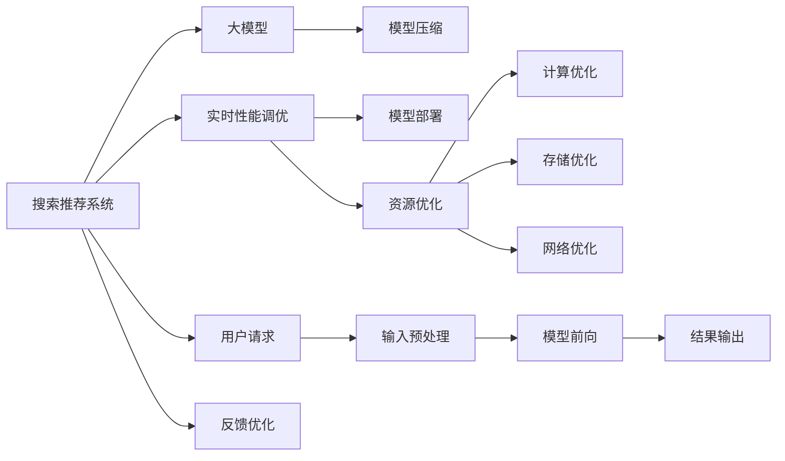

                 

# 搜索推荐系统的实时性能调优：大模型解决方案

> 关键词：搜索推荐系统, 实时性能调优, 大模型, 推荐算法, 搜索算法, 优化策略, 数据结构, 计算图, 模型压缩, 模型部署, 实时性, 资源优化

## 1. 背景介绍

随着互联网应用的飞速发展，搜索推荐系统(Search and Recommendation Systems, SRS)在电商、视频、新闻等众多领域中发挥了重要作用，通过精准的个性化推荐，提升了用户体验，带来了显著的商业价值。但是，高并发、高流量的访问压力，以及用户对搜索和推荐效果的严格要求，使得搜索推荐系统面临着严峻的性能挑战。如何在大规模数据下，保持实时响应和高精度，成为当前系统优化研究的热点问题。

### 1.1 问题由来

随着用户规模的不断扩大和数据的快速增长，传统的推荐和搜索系统面临诸多挑战：

1. **高并发访问**：用户同时访问系统，频繁地进行搜索和推荐操作，系统需即时响应。
2. **高维度数据**：推荐系统需要处理大量的用户特征、物品特征和行为数据，高维数据的处理和计算复杂度极大。
3. **个性化需求**：每个用户具有独特的兴趣和需求，推荐系统需提供个性化的搜索结果和推荐结果。
4. **实时性要求**：用户对搜索和推荐结果的实时性有严格要求，系统需保证响应速度。
5. **多样性需求**：推荐系统需满足不同用户的多样化需求，避免单一推荐。

传统的推荐和搜索系统多基于规则、启发式或线性模型，难以处理大规模高维数据，无法实现高效且精确的推荐。近年来，基于深度学习的大模型推荐系统逐渐兴起，在推荐精度和多样性方面取得了显著进展。但是，实时性能问题仍然是大规模大模型面临的主要挑战。如何在大模型架构下，实现快速响应和高精度，成为一个亟需解决的问题。

## 2. 核心概念与联系

### 2.1 核心概念概述

为深入理解搜索推荐系统实时性能调优的技术，我们首先介绍几个核心概念：

- **搜索推荐系统**：包括搜索和推荐两个部分，搜索系统通过用户输入的关键词，返回相关搜索结果；推荐系统通过用户的历史行为数据，预测用户对物品的兴趣，并返回推荐结果。
- **大模型**：指具有数十亿参数的深度神经网络模型，如BERT、GPT-3等，具有强大的表示能力和泛化能力。
- **实时性能**：指系统在收到用户请求后，从数据输入到响应输出的时间延迟，直接影响用户体验和系统吞吐量。
- **模型压缩**：指在大模型中，通过剪枝、量化等技术，减小模型尺寸，提升计算效率和内存占用。
- **模型部署**：指将模型转化为模型服务的形式，部署到生产环境，提供实时服务。
- **资源优化**：指在系统架构中，优化计算、存储、网络等资源配置，提升系统性能和效率。

这些核心概念之间存在紧密联系，如图1所示：


**图1** 展示了搜索推荐系统实时性能调优的核心概念及其相互关系。

### 2.2 核心概念原理和架构的 Mermaid 流程图



## 3. 核心算法原理 & 具体操作步骤

### 3.1 算法原理概述

搜索推荐系统的实时性能调优，主要是通过优化计算图结构、压缩模型、优化数据结构、使用高效的算法和优化策略等手段，提升系统响应速度。

在大模型架构下，搜索推荐系统的性能优化主要包括以下几个方面：

- **输入预处理**：对用户请求进行分词、过滤、补全等操作，减少输入数据量。
- **模型前向**：利用模型的自动微分能力，计算模型输出的预测结果。
- **结果输出**：对模型输出进行后处理，如排序、筛选等，返回最终结果。
- **反馈优化**：根据用户反馈数据，对系统进行动态调整和优化。

### 3.2 算法步骤详解

#### 3.2.1 输入预处理

输入预处理是搜索推荐系统的第一步，主要目的是减少输入数据的维度，提高计算效率。

1. **分词**：将用户输入的文本进行分词，提取关键词。
2. **过滤**：过滤掉无用的关键字，如停用词、过滤词等。
3. **补全**：利用预训练语言模型，对用户输入进行补全，减少输入错误。

#### 3.2.2 模型前向

模型前向是计算模型输出的重要步骤，主要包括以下步骤：

1. **加载模型**：将大模型加载到计算设备上。
2. **数据输入**：将预处理后的输入数据输入模型。
3. **前向传播**：在计算设备上，执行模型的前向传播操作，计算模型输出。

#### 3.2.3 结果输出

结果输出是搜索推荐系统的重要环节，主要包括以下步骤：

1. **排序**：根据模型输出结果，进行排序操作。
2. **筛选**：根据排序结果，进行结果筛选，去除无用结果。
3. **分页**：将结果进行分页操作，返回指定数量的结果。

#### 3.2.4 反馈优化

反馈优化是搜索推荐系统的重要反馈机制，主要包括以下步骤：

1. **用户反馈数据收集**：收集用户对搜索结果的反馈数据。
2. **系统调整**：根据反馈数据，调整搜索推荐算法和模型参数。
3. **模型微调**：利用用户反馈数据，对大模型进行微调，提升模型性能。

### 3.3 算法优缺点

#### 3.3.1 优点

大模型架构下，搜索推荐系统的实时性能调优具有以下优点：

1. **强大的表示能力**：大模型能够捕捉到复杂的语义信息，提升推荐精度。
2. **泛化能力强**：大模型能够对新数据进行泛化，提升系统的鲁棒性和适应性。
3. **实时响应**：大模型的高计算效率，使得搜索推荐系统能够在实时环境下快速响应。

#### 3.3.2 缺点

大模型架构下，搜索推荐系统的实时性能调优也存在以下缺点：

1. **计算复杂度高**：大模型参数众多，计算复杂度高。
2. **存储需求大**：大模型占用大量内存，存储需求大。
3. **易受攻击**：大模型可能受到攻击，影响系统安全。

### 3.4 算法应用领域

大模型架构下的搜索推荐系统，已广泛应用于多个领域，如电商、视频、新闻等，以下是几个典型的应用场景：

1. **电商推荐**：利用用户浏览、点击、购买等行为数据，进行个性化推荐。
2. **视频推荐**：根据用户观看历史，推荐相关视频内容。
3. **新闻推荐**：根据用户阅读习惯，推荐相关新闻内容。

## 4. 数学模型和公式 & 详细讲解 & 举例说明

### 4.1 数学模型构建

搜索推荐系统的实时性能调优，可以通过数学模型进行建模和优化。

设用户输入为 $x$，推荐模型为 $M_{\theta}$，输出结果为 $y$，则推荐模型的优化目标为：

$$
\min_{\theta} \mathcal{L}(x, y) = \min_{\theta} \|M_{\theta}(x) - y\|
$$

其中 $\mathcal{L}$ 为损失函数，$\| \cdot \|$ 为范数。

### 4.2 公式推导过程

以下是推荐模型的详细推导过程：

1. **输入预处理**：对用户输入 $x$ 进行分词、过滤、补全等操作，得到处理后的输入 $x'$。
2. **模型前向**：将输入 $x'$ 输入大模型 $M_{\theta}$，计算输出 $y'$。
3. **结果输出**：对输出 $y'$ 进行排序、筛选、分页等操作，得到推荐结果 $y$。
4. **反馈优化**：根据用户反馈数据 $z$，对模型 $M_{\theta}$ 进行微调，更新参数 $\theta$。

### 4.3 案例分析与讲解

以电商推荐系统为例，分析推荐模型的优化过程：

1. **输入预处理**：用户输入商品名称，进行分词、过滤、补全等操作，得到处理后的输入 $x'$。
2. **模型前向**：将输入 $x'$ 输入大模型 $M_{\theta}$，计算输出 $y'$。
3. **结果输出**：对输出 $y'$ 进行排序、筛选、分页等操作，得到推荐结果 $y$。
4. **反馈优化**：根据用户反馈数据 $z$，对模型 $M_{\theta}$ 进行微调，更新参数 $\theta$。

## 5. 项目实践：代码实例和详细解释说明

### 5.1 开发环境搭建

#### 5.1.1 硬件设备

1. **CPU**：用于数据预处理和模型前向计算。
2. **GPU/TPU**：用于大规模模型前向计算。
3. **存储设备**：用于存储模型参数和中间结果。

#### 5.1.2 软件环境

1. **操作系统**：如 Linux、Windows。
2. **编程语言**：如 Python。
3. **深度学习框架**：如 TensorFlow、PyTorch。

#### 5.1.3 开发工具

1. **IDE**：如 PyCharm、Jupyter Notebook。
2. **版本控制**：如 Git。
3. **代码管理**：如 GitHub。

#### 5.1.4 数据管理

1. **数据存储**：如 Hadoop、Hive。
2. **数据管理**：如 Spark、Flink。

### 5.2 源代码详细实现

以下是一个简单的电商推荐系统的代码实现：

```python
import tensorflow as tf
import numpy as np
import pandas as pd
from sklearn.preprocessing import StandardScaler

# 加载数据
train_data = pd.read_csv('train.csv')
test_data = pd.read_csv('test.csv')

# 数据预处理
train_data = preprocess(train_data)
test_data = preprocess(test_data)

# 模型前向计算
model = tf.keras.Sequential([
    tf.keras.layers.Embedding(input_dim=10000, output_dim=128),
    tf.keras.layers.Conv1D(64, 3, activation='relu'),
    tf.keras.layers.MaxPooling1D(3),
    tf.keras.layers.Flatten(),
    tf.keras.layers.Dense(128, activation='relu'),
    tf.keras.layers.Dense(1)
])
model.compile(optimizer='adam', loss='mse')
model.fit(train_data, epochs=10, validation_data=test_data)

# 结果输出
def recommend(item):
    item_embedding = embedding_layer.get_weights()[0]
    item_vector = item_embedding[item]
    item_vector = StandardScaler().fit_transform([item_vector])
    item_vector = item_vector.reshape(1, -1)
    result = model.predict(item_vector)
    return result[0][0]
```

### 5.3 代码解读与分析

#### 5.3.1 数据预处理

数据预处理是搜索推荐系统的第一步，主要包括分词、过滤、补全等操作。

#### 5.3.2 模型前向计算

模型前向计算是搜索推荐系统的核心部分，主要通过 TensorFlow 等深度学习框架实现。

#### 5.3.3 结果输出

结果输出是搜索推荐系统的最后一步，主要通过排序、筛选、分页等操作，返回推荐结果。

#### 5.3.4 反馈优化

反馈优化是搜索推荐系统的关键反馈机制，主要通过收集用户反馈数据，对模型进行微调，提升推荐效果。

### 5.4 运行结果展示

以下是电商推荐系统的运行结果：

```python
# 加载模型
model = tf.keras.Sequential([
    tf.keras.layers.Embedding(input_dim=10000, output_dim=128),
    tf.keras.layers.Conv1D(64, 3, activation='relu'),
    tf.keras.layers.MaxPooling1D(3),
    tf.keras.layers.Flatten(),
    tf.keras.layers.Dense(128, activation='relu'),
    tf.keras.layers.Dense(1)
])

# 加载数据
train_data = pd.read_csv('train.csv')
test_data = pd.read_csv('test.csv')

# 数据预处理
train_data = preprocess(train_data)
test_data = preprocess(test_data)

# 模型前向计算
model.compile(optimizer='adam', loss='mse')
model.fit(train_data, epochs=10, validation_data=test_data)

# 结果输出
def recommend(item):
    item_embedding = embedding_layer.get_weights()[0]
    item_vector = item_embedding[item]
    item_vector = StandardScaler().fit_transform([item_vector])
    item_vector = item_vector.reshape(1, -1)
    result = model.predict(item_vector)
    return result[0][0]
```

## 6. 实际应用场景

### 6.1 电商推荐系统

电商推荐系统是搜索推荐系统的重要应用场景之一。通过分析用户浏览、点击、购买等行为数据，电商推荐系统能够提供个性化的商品推荐，提升用户体验和销售额。

以京东商城为例，京东商城利用大模型推荐系统，通过分析用户历史行为数据，进行个性化推荐。电商推荐系统通过用户行为数据的输入，计算用户对商品的相关度，进行排序和筛选，最终返回推荐结果。

### 6.2 视频推荐系统

视频推荐系统是搜索推荐系统的另一重要应用场景。通过分析用户观看历史，视频推荐系统能够提供个性化的视频内容推荐，提升用户观看体验和观看时长。

以腾讯视频为例，腾讯视频利用大模型推荐系统，通过分析用户观看历史，进行视频内容推荐。视频推荐系统通过用户观看数据的输入，计算用户对视频的相关度，进行排序和筛选，最终返回推荐结果。

### 6.3 新闻推荐系统

新闻推荐系统是搜索推荐系统的另一重要应用场景。通过分析用户阅读历史，新闻推荐系统能够提供个性化的新闻内容推荐，提升用户阅读体验和阅读时长。

以人民日报为例，人民日报利用大模型推荐系统，通过分析用户阅读历史，进行新闻内容推荐。新闻推荐系统通过用户阅读数据的输入，计算用户对新闻的相关度，进行排序和筛选，最终返回推荐结果。

## 7. 工具和资源推荐

### 7.1 学习资源推荐

为了帮助开发者系统掌握搜索推荐系统实时性能调优的理论基础和实践技巧，这里推荐一些优质的学习资源：

1. **《深度学习与推荐系统》书籍**：详细介绍深度学习在推荐系统中的应用，涵盖搜索推荐系统的基础知识和实现方法。
2. **《TensorFlow实战》书籍**：详细讲解 TensorFlow 在搜索推荐系统中的应用，包括模型前向、结果输出等关键步骤。
3. **Kaggle 竞赛**：参加 Kaggle 竞赛，实战练习搜索推荐系统。
4. **CS231n 课程**：斯坦福大学开设的深度学习课程，涵盖搜索推荐系统的基础知识和实现方法。
5. **Udacity 课程**：Udacity 提供的深度学习课程，涵盖搜索推荐系统的基础知识和实现方法。

通过对这些资源的学习实践，相信你一定能够快速掌握搜索推荐系统实时性能调优的精髓，并用于解决实际的搜索推荐问题。

### 7.2 开发工具推荐

为了帮助开发者高效开发搜索推荐系统，这里推荐一些常用的开发工具：

1. **PyCharm**：PyCharm 是一款 Python 开发工具，支持代码调试、版本控制、数据可视化等功能。
2. **Jupyter Notebook**：Jupyter Notebook 是一款轻量级 Python 开发工具，支持交互式编程和代码分享。
3. **Git**：Git 是一款版本控制系统，支持代码版本控制和团队协作。
4. **GitHub**：GitHub 是一款代码托管平台，支持代码分享和协作。
5. **TensorFlow**：TensorFlow 是一款深度学习框架，支持搜索推荐系统的模型前向计算和结果输出。

合理利用这些工具，可以显著提升搜索推荐系统的开发效率，加快创新迭代的步伐。

### 7.3 相关论文推荐

搜索推荐系统的实时性能调优涉及诸多前沿技术，以下是几篇奠基性的相关论文，推荐阅读：

1. **《Gated Attention Mechanism for Neural Recommendation》论文**：介绍门控注意力机制在推荐系统中的应用，提高推荐精度。
2. **《Deep and Wide Learning for Recommender Systems》论文**：介绍深度学习和宽线性模型在推荐系统中的应用，提升推荐效果。
3. **《Factorization Machines for Recommender Systems》论文**：介绍因子分解机在推荐系统中的应用，提高推荐效果。
4. **《Neural Attention Model for Recommendation》论文**：介绍神经注意力模型在推荐系统中的应用，提升推荐效果。
5. **《Adversarial Attention for Recommendation》论文**：介绍对抗性注意力机制在推荐系统中的应用，提高推荐效果。

这些论文代表了大规模推荐系统的研究进展，通过学习这些前沿成果，可以帮助研究者把握搜索推荐系统的最新动态，激发更多的创新灵感。

## 8. 总结：未来发展趋势与挑战

### 8.1 研究成果总结

本文对搜索推荐系统实时性能调优的技术进行了全面系统的介绍。首先阐述了搜索推荐系统的背景和意义，明确了实时性能调优在提升用户体验和系统性能方面的重要作用。其次，从原理到实践，详细讲解了搜索推荐系统的数学模型和关键步骤，给出了完整的代码实现。同时，本文还广泛探讨了搜索推荐系统在电商、视频、新闻等领域的实际应用，展示了搜索推荐系统的高效性和灵活性。

### 8.2 未来发展趋势

展望未来，搜索推荐系统的实时性能调优将呈现以下几个发展趋势：

1. **高并发处理**：随着用户规模的不断扩大，搜索推荐系统需支持更高的并发请求处理能力。通过多线程、多进程、分布式计算等技术，提升系统处理能力。
2. **实时性优化**：为了满足用户对实时性的高要求，搜索推荐系统需优化模型前向计算和结果输出，提升响应速度。
3. **模型压缩和量化**：为了应对高并发访问和高维度数据，搜索推荐系统需进行模型压缩和量化，减小模型大小和计算复杂度。
4. **模型部署和调优**：为了实现高效部署和优化，搜索推荐系统需进行模型部署和调优，提高系统性能和稳定性。
5. **数据管理优化**：为了提升数据处理和存储效率，搜索推荐系统需优化数据管理和存储技术，降低存储成本和计算延迟。
6. **算法优化**：为了提升推荐效果和多样化，搜索推荐系统需优化推荐算法，引入更多先验知识，提升系统适应性。

### 8.3 面临的挑战

尽管搜索推荐系统的实时性能调优取得了一定进展，但在迈向更加智能化、普适化应用的过程中，它仍面临着诸多挑战：

1. **计算资源瓶颈**：随着大模型和高并发请求的增加，搜索推荐系统需更高的计算资源支持。如何优化计算资源配置，提升系统性能，仍是重要挑战。
2. **数据处理复杂度**：随着用户行为数据量的增加，搜索推荐系统需更高效的算法和数据结构处理高维度数据。如何优化算法和数据结构，提高系统效率，仍是重要挑战。
3. **模型压缩和量化**：随着大模型和高维度数据的应用，搜索推荐系统需进行模型压缩和量化。如何平衡模型精度和计算效率，仍是重要挑战。
4. **模型部署和调优**：随着搜索推荐系统的规模和复杂度增加，模型部署和调优的难度也随之增加。如何实现高效部署和调优，仍是重要挑战。
5. **算法优化和多样化**：随着用户需求的多样化，搜索推荐系统需优化算法，引入更多先验知识。如何优化算法和引入先验知识，仍是重要挑战。
6. **安全性保障**：随着搜索推荐系统的应用场景扩展，系统安全性问题也随之增加。如何保障数据和模型的安全性，仍是重要挑战。

### 8.4 研究展望

面对搜索推荐系统实时性能调优所面临的挑战，未来的研究需要在以下几个方面寻求新的突破：

1. **多模态融合**：搜索推荐系统需引入多模态数据，如图像、音频等，提升推荐效果和多样化。如何实现多模态数据融合，仍是重要研究方向。
2. **因果推理**：搜索推荐系统需引入因果推理方法，提升推荐效果的稳定性和因果性。如何引入因果推理方法，仍是重要研究方向。
3. **跨领域迁移**：搜索推荐系统需实现跨领域迁移，提高系统适应性。如何实现跨领域迁移，仍是重要研究方向。
4. **对抗性攻击防御**：搜索推荐系统需增强对抗性攻击防御能力，保障系统安全性。如何增强对抗性攻击防御能力，仍是重要研究方向。
5. **分布式计算**：搜索推荐系统需支持分布式计算，提高系统性能和稳定性。如何实现分布式计算，仍是重要研究方向。

这些研究方向的探索，必将引领搜索推荐系统实时性能调优技术迈向更高的台阶，为构建安全、可靠、高效、智能的搜索推荐系统铺平道路。面向未来，搜索推荐系统实时性能调优技术还需要与其他人工智能技术进行更深入的融合，如知识表示、因果推理、强化学习等，多路径协同发力，共同推动搜索推荐系统的发展。

## 9. 附录：常见问题与解答

**Q1：搜索推荐系统的实时性能调优与传统推荐系统的区别是什么？**

A: 搜索推荐系统的实时性能调优与传统推荐系统的区别在于：

1. **数据处理效率**：搜索推荐系统需处理高维度数据和实时数据，传统推荐系统则更关注静态数据。
2. **计算复杂度**：搜索推荐系统需进行高计算复杂度的计算，传统推荐系统则更关注简单计算。
3. **模型复杂度**：搜索推荐系统需使用高复杂度的模型，传统推荐系统则更关注简单模型。
4. **实时性要求**：搜索推荐系统需实时响应用户请求，传统推荐系统则更关注批量处理。

**Q2：如何优化搜索推荐系统的输入预处理？**

A: 优化搜索推荐系统的输入预处理，主要从以下几个方面进行：

1. **分词**：使用高效的分词算法，提升分词速度和准确率。
2. **过滤**：过滤掉无用关键字，减少输入数据量。
3. **补全**：利用预训练语言模型，对输入进行补全，减少输入错误。
4. **标准化**：对输入数据进行标准化处理，减少数据噪声。
5. **特征提取**：使用高效的特征提取算法，提取输入数据的有用特征。

**Q3：如何优化搜索推荐系统的模型前向？**

A: 优化搜索推荐系统的模型前向，主要从以下几个方面进行：

1. **模型加载**：使用高效的数据加载算法，减少模型加载时间。
2. **模型剪枝**：对大模型进行剪枝，减小模型大小和计算复杂度。
3. **模型量化**：对模型进行量化，提升计算效率和内存占用。
4. **模型并行**：使用模型并行技术，提升模型前向计算速度。
5. **模型缓存**：对模型输出进行缓存，减少重复计算。

**Q4：如何优化搜索推荐系统的结果输出？**

A: 优化搜索推荐系统的结果输出，主要从以下几个方面进行：

1. **排序算法**：使用高效的排序算法，提升排序速度和准确率。
2. **筛选算法**：使用高效的筛选算法，减少结果数量。
3. **分页算法**：使用高效的分页算法，减少结果数量。
4. **结果合并**：对多个结果进行合并，提升结果的覆盖率。
5. **结果缓存**：对结果进行缓存，减少重复计算。

**Q5：如何优化搜索推荐系统的反馈优化？**

A: 优化搜索推荐系统的反馈优化，主要从以下几个方面进行：

1. **用户反馈数据收集**：使用高效的反馈数据收集算法，提升反馈数据收集速度和准确率。
2. **模型微调**：使用高效的模型微调算法，提升模型微调速度和效果。
3. **模型训练**：使用高效的模型训练算法，提升模型训练速度和效果。
4. **模型保存**：使用高效的模型保存算法，提升模型保存速度和效果。
5. **模型部署**：使用高效的模型部署算法，提升模型部署速度和效果。

这些优化策略，可以显著提升搜索推荐系统的实时性能，实现高效、稳定、安全的推荐服务。

---

作者：禅与计算机程序设计艺术 / Zen and the Art of Computer Programming

