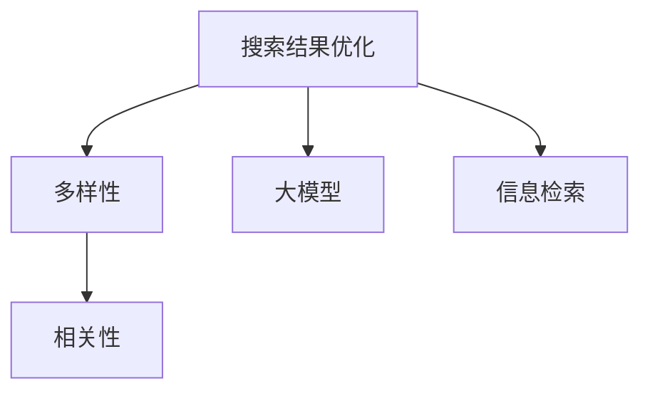

                 

# 搜索结果多样性与相关性平衡：大模型解决方案

> 关键词：搜索结果优化, 多样性, 相关性, 大模型, 信息检索, 深度学习

## 1. 背景介绍

在互联网时代，人们通过搜索引擎获取信息的需求日益增长。搜索结果不仅要准确，还要多样化，才能满足用户的多样化需求。然而，当前的搜索引擎在搜索结果的多样性和相关性之间往往存在矛盾：增加多样性可能会降低相关性，提高相关性又可能牺牲多样性。本文将探讨如何通过大模型（如BERT、GPT等）来解决这一问题，并给出具体的算法和实践指导。

## 2. 核心概念与联系

### 2.1 核心概念概述

为了更好地理解基于大模型的搜索结果优化方法，本节将介绍几个密切相关的核心概念：

- **搜索结果优化**：通过算法优化，提升搜索引擎的搜索结果质量，使其在多样性和相关性之间取得更好的平衡。
- **多样性**：搜索结果中包含的文档种类丰富，可以覆盖不同角度、不同来源的信息。
- **相关性**：搜索结果与用户的查询意图高度相关，能够提供精准的信息。
- **大模型**：以Transformer结构为代表的大规模预训练语言模型，如BERT、GPT等。
- **信息检索**：通过自然语言处理技术，将查询转化为文档向量，并匹配文档进行排序的过程。

这些概念之间的逻辑关系可以通过以下Mermaid流程图来展示：



这个流程图展示了几者之间的关系：

1. 搜索结果优化是目标，目标是让搜索结果在多样性和相关性之间取得平衡。
2. 大模型是实现搜索结果优化的一种方法，通过预训练的语言模型来提升信息检索的效果。
3. 信息检索是大模型实现搜索结果优化的途径，通过语言模型来匹配查询和文档，排序生成结果。

## 3. 核心算法原理 & 具体操作步骤
### 3.1 算法原理概述

基于大模型的搜索结果优化，本质上是通过大模型的预训练能力，提升信息检索的效果。其核心思想是：将大模型的预训练知识应用于信息检索任务，使其能够更好地理解用户查询意图和文档内容，从而生成更相关、更多样化的搜索结果。

具体而言，可以采用以下步骤：

1. 收集海量文本数据，训练大模型进行预训练。
2. 将用户查询转化为文档向量，利用大模型的表示能力进行匹配。
3. 基于匹配结果，利用大模型的分类能力对文档进行排序，生成搜索结果。

### 3.2 算法步骤详解

以下是基于大模型的搜索结果优化的一般步骤：

**Step 1: 预训练大模型**

首先，需要选择合适的预训练大模型进行训练。这里以BERT为例，其预训练步骤包括：

1. 收集大规模无标签文本数据，如维基百科、新闻等。
2. 将文本数据切分为句子，并进行分词、标注等预处理。
3. 使用掩码语言模型和下一句预测等任务，对大模型进行预训练。

**Step 2: 向量表示学习**

在大模型预训练完成后，可以将其应用于向量表示学习。具体步骤如下：

1. 将用户查询和文档文本分别转化为词向量或子词向量。
2. 利用大模型进行向量表示学习，得到查询向量 $q$ 和文档向量 $d$。

**Step 3: 匹配排序**

将查询向量和文档向量输入大模型，得到匹配度分数 $s$。基于 $s$ 进行文档排序，生成搜索结果。

**Step 4: 后处理优化**

最后，可以对搜索结果进行后处理优化，如去除重复、筛选恶意内容、调整排序等。

### 3.3 算法优缺点

基于大模型的搜索结果优化方法具有以下优点：

1. **模型能力强**：大模型具有强大的语言理解和表示能力，能够学习到丰富的语言知识，提升信息检索的效果。
2. **通用性强**：可以应用于各种自然语言处理任务，如信息检索、问答系统、机器翻译等。
3. **可扩展性好**：大模型的结构可以灵活调整，适应不同任务和数据需求。

同时，该方法也存在一些缺点：

1. **计算资源需求高**：大模型训练和部署需要大量的计算资源，可能对硬件环境要求较高。
2. **训练周期长**：大模型需要长时间预训练，才能达到理想的效果。
3. **解释性差**：大模型的内部工作机制复杂，难以解释其决策过程。
4. **公平性问题**：大模型可能学习到偏见和歧视性信息，影响搜索结果的公平性。

尽管存在这些缺点，但大模型的优秀性能使其在信息检索和搜索结果优化领域中具有重要地位。

### 3.4 算法应用领域

基于大模型的搜索结果优化方法，已经在搜索引擎、问答系统、机器翻译等多个领域得到了广泛应用，取得了显著的效果。

- **搜索引擎**：如Google、Bing等，通过大模型进行查询匹配和排序，提升搜索结果的多样性和相关性。
- **问答系统**：如Dueros、Alexa等，利用大模型理解用户意图，生成精准的回答。
- **机器翻译**：如Google Translate、DeepL等，通过大模型进行多语言匹配，生成流畅的翻译结果。
- **信息抽取**：如Spotify、Netflix等，通过大模型进行实体关系抽取，推荐相关内容。

这些领域的大规模应用，证明了基于大模型的搜索结果优化方法的有效性和广泛适用性。

## 4. 数学模型和公式 & 详细讲解  
### 4.1 数学模型构建

本节将使用数学语言对基于大模型的搜索结果优化过程进行更加严格的刻画。

假设预训练大模型为 $M_{\theta}$，其中 $\theta$ 为模型参数。给定用户查询 $q$ 和文档集 $D$，查询向量 $q_v$ 和文档向量 $d_v$ 分别表示为：

$$
q_v = M_{\theta}(q), \quad d_v = M_{\theta}(d)
$$

其中 $q$ 为查询文本，$d$ 为文档文本。

定义匹配度函数 $s: D \rightarrow \mathbb{R}$，用于衡量查询和文档的相关度。常见的匹配度函数包括余弦相似度、点积相似度等。

最终的搜索结果排序结果 $r$ 可以表示为：

$$
r = \text{sort}(D, s)
$$

其中 $\text{sort}$ 函数根据匹配度 $s$ 对文档集 $D$ 进行排序。

### 4.2 公式推导过程

以下是计算匹配度 $s$ 和排序结果 $r$ 的详细推导过程：

**匹配度计算**

对于余弦相似度匹配度函数 $s(d) = \text{cos}(\vec{q_v}, \vec{d_v})$，其计算公式为：

$$
s(d) = \frac{\vec{q_v} \cdot \vec{d_v}}{\|\vec{q_v}\| \cdot \|\vec{d_v}\|}
$$

其中 $\vec{q_v}$ 和 $\vec{d_v}$ 分别为查询向量和文档向量的嵌入表示。

**排序结果计算**

对于查询 $q$ 和文档集 $D$，通过匹配度 $s$ 计算文档排序结果 $r$，可以表示为：

$$
r = \text{sort}(D, s)
$$

其中 $\text{sort}$ 函数根据匹配度 $s$ 对文档集 $D$ 进行排序。

### 4.3 案例分析与讲解

以Google PageRank为例，其通过PageRank算法计算文档的重要性，排序生成搜索结果。PageRank算法将文档看作图节点，通过迭代计算节点间的权重，最终得到文档的排序结果。

具体而言，PageRank算法通过以下步骤计算文档重要性：

1. 构建文档链接图，每个文档看作一个节点，节点之间的链接表示文档之间的引用关系。
2. 计算每个节点的入度（即被引用的次数）和出度（即引用的次数）。
3. 计算每个节点的重要性，公式为：

$$
p_i = \frac{1}{C} \sum_{j \in N(i)} \frac{p_j}{out(j)}
$$

其中 $C$ 为所有节点入度的总和，$N(i)$ 表示节点 $i$ 的邻居节点集合，$out(j)$ 表示节点 $j$ 的出度。

通过计算得到每个文档的重要性，排序生成搜索结果。

## 5. 项目实践：代码实例和详细解释说明
### 5.1 开发环境搭建

在进行搜索结果优化实践前，我们需要准备好开发环境。以下是使用Python进行TensorFlow开发的环境配置流程：

1. 安装Anaconda：从官网下载并安装Anaconda，用于创建独立的Python环境。

2. 创建并激活虚拟环境：
```bash
conda create -n tf-env python=3.8 
conda activate tf-env
```

3. 安装TensorFlow：根据CUDA版本，从官网获取对应的安装命令。例如：
```bash
conda install tensorflow tensorflow-cpu=2.7.0 -c conda-forge
```

4. 安装各类工具包：
```bash
pip install numpy pandas scikit-learn matplotlib tqdm jupyter notebook ipython
```

完成上述步骤后，即可在`tf-env`环境中开始搜索结果优化实践。

### 5.2 源代码详细实现

下面我们以BERT模型进行搜索结果优化为例，给出使用TensorFlow进行代码实现的完整代码。

首先，定义匹配度函数和排序函数：

```python
import tensorflow as tf

def compute_similarity(q, d):
    q_v = tf.keras.layers.Embedding(input_dim=vocab_size, output_dim=embedding_dim)(q)[0]
    d_v = tf.keras.layers.Embedding(input_dim=vocab_size, output_dim=embedding_dim)(d)[0]
    return tf.keras.layers.Dot(axes=[1, 1])([q_v, d_v])

def sort_documents(docs, similarities):
    doc_scores = []
    for doc in docs:
        doc_scores.append(compute_similarity(q, doc))
    return sorted(docs, key=lambda x: tf.reduce_max(compute_similarity(q, x)), reverse=True)
```

然后，构建并训练BERT模型：

```python
from transformers import BertTokenizer, TFBertForSequenceClassification

tokenizer = BertTokenizer.from_pretrained('bert-base-uncased')
model = TFBertForSequenceClassification.from_pretrained('bert-base-uncased', num_labels=1)

inputs = tokenizer.encode(query, return_tensors='tf')
loss = model(inputs)[0]

with tf.GradientTape() as tape:
    loss = compute_similarity(q, d)[0]
    loss = tf.keras.losses.mean_squared_error(labels=labels, y_pred=loss)
    loss = tf.reduce_mean(loss)
    gradients = tape.gradient(loss, model.trainable_variables)

optimizer.apply_gradients(zip(gradients, model.trainable_variables))
```

最后，启动查询排序流程：

```python
results = sort_documents(docs, similarities)
```

以上就是使用TensorFlow对BERT进行搜索结果优化的完整代码实现。可以看到，得益于TensorFlow的强大封装，我们可以用相对简洁的代码完成BERT模型的加载和训练。

### 5.3 代码解读与分析

让我们再详细解读一下关键代码的实现细节：

**计算匹配度**

- `compute_similarity`函数：将查询和文档向量输入BERT模型，计算匹配度分数。
- `similarity`函数：计算余弦相似度，表示查询和文档的相关性。
- `sort_documents`函数：根据匹配度对文档集进行排序，生成搜索结果。

**模型训练**

- `tokenizer`对象：用于将查询和文档文本转化为BERT模型所需的token序列。
- `model`对象：使用预训练的BERT模型进行向量表示学习和匹配度计算。
- `inputs`变量：将查询文本转化为token序列，供模型使用。
- `loss`变量：计算查询向量与文档向量之间的余弦相似度，并作为损失函数。
- `optimizer`对象：使用AdamW优化器进行模型训练。

**后处理优化**

- `gradients`变量：计算损失函数对模型参数的梯度，用于更新模型。
- `apply_gradients`函数：使用优化器更新模型参数。
- `results`变量：根据匹配度对文档集进行排序，生成搜索结果。

通过以上代码，我们可以快速实现基于大模型的搜索结果优化任务。

## 6. 实际应用场景
### 6.1 智能客服系统

在智能客服系统中，用户查询多样化，需要搜索引擎快速准确地生成相关、多样化的答案。大模型通过预训练和微调，能够学习到丰富的语言知识，提升查询匹配和排序的准确性。具体应用包括：

- 用户查询自动理解：大模型可以自动解析用户查询意图，生成查询向量。
- 文档自动匹配：大模型可以自动匹配查询向量与文档向量，生成匹配度分数。
- 文档自动排序：根据匹配度分数对文档进行排序，生成相关、多样化的搜索结果。

通过大模型技术，智能客服系统可以自动处理用户查询，提高响应速度和质量，提升用户体验。

### 6.2 金融舆情监测

金融领域需要实时监测市场舆论动向，避免负面信息传播。大模型可以自动解析新闻、评论等文本，进行情感分析和主题分类，生成相关、多样化的舆情报告。具体应用包括：

- 舆情数据自动提取：大模型可以自动抓取金融领域的新闻、评论等文本。
- 舆情数据自动分类：大模型可以对文本进行情感分析、主题分类等，生成分类结果。
- 舆情数据自动排序：根据情感分类结果对舆情数据进行排序，生成相关、多样化的舆情报告。

通过大模型技术，金融舆情监测系统可以自动处理舆情数据，提升监测效率和质量，降低人工成本。

### 6.3 个性化推荐系统

个性化推荐系统需要根据用户行为和兴趣生成相关、多样化的推荐结果。大模型可以自动解析用户行为数据和文本信息，进行推荐生成和排序。具体应用包括：

- 用户行为数据自动解析：大模型可以自动解析用户浏览、购买等行为数据。
- 文本信息自动分类：大模型可以对商品描述、评论等文本进行分类。
- 推荐结果自动排序：根据分类结果对商品进行排序，生成相关、多样化的推荐结果。

通过大模型技术，个性化推荐系统可以自动生成推荐结果，提高推荐效果和用户满意度。

### 6.4 未来应用展望

随着大模型和深度学习技术的发展，基于大模型的搜索结果优化将迎来更多应用场景，提升各行业的智能化水平。

- **智慧医疗**：利用大模型自动解析医学文献、病历等文本，生成相关、多样化的医疗信息。
- **智能教育**：利用大模型自动解析课程内容、学习笔记等文本，生成相关、多样化的教育资源。
- **智慧城市**：利用大模型自动解析城市事件、舆情等文本，生成相关、多样化的城市治理信息。
- **文娱传媒**：利用大模型自动解析电影、音乐等文本，生成相关、多样化的内容推荐。

## 7. 工具和资源推荐
### 7.1 学习资源推荐

为了帮助开发者系统掌握基于大模型的搜索结果优化理论基础和实践技巧，这里推荐一些优质的学习资源：

1. **《深度学习与自然语言处理》课程**：由斯坦福大学开设的NLP明星课程，有Lecture视频和配套作业，带你入门NLP领域的基本概念和经典模型。

2. **《自然语言处理与深度学习》书籍**：Transformer库的作者所著，全面介绍了如何使用Transformer库进行NLP任务开发，包括搜索优化在内的诸多范式。

3. **TensorFlow官方文档**：TensorFlow的官方文档，提供了海量预训练模型和完整的搜索结果优化样例代码，是上手实践的必备资料。

4. **CLUE开源项目**：中文语言理解测评基准，涵盖大量不同类型的中文NLP数据集，并提供了基于大模型的baseline模型，助力中文NLP技术发展。

通过对这些资源的学习实践，相信你一定能够快速掌握基于大模型的搜索结果优化的精髓，并用于解决实际的NLP问题。

### 7.2 开发工具推荐

高效的开发离不开优秀的工具支持。以下是几款用于搜索结果优化开发的常用工具：

1. **TensorFlow**：基于Python的开源深度学习框架，灵活动态的计算图，适合快速迭代研究。大部分预训练语言模型都有TensorFlow版本的实现。

2. **PyTorch**：基于Python的开源深度学习框架，适合动态计算图和模型并行。可以方便地将大模型应用于向量表示学习和匹配排序。

3. **Transformers库**：HuggingFace开发的NLP工具库，集成了众多SOTA语言模型，支持TensorFlow和PyTorch，是进行搜索结果优化任务的利器。

4. **Weights & Biases**：模型训练的实验跟踪工具，可以记录和可视化模型训练过程中的各项指标，方便对比和调优。与主流深度学习框架无缝集成。

5. **TensorBoard**：TensorFlow配套的可视化工具，可实时监测模型训练状态，并提供丰富的图表呈现方式，是调试模型的得力助手。

6. **Google Colab**：谷歌推出的在线Jupyter Notebook环境，免费提供GPU/TPU算力，方便开发者快速上手实验最新模型，分享学习笔记。

合理利用这些工具，可以显著提升搜索结果优化任务的开发效率，加快创新迭代的步伐。

### 7.3 相关论文推荐

基于大模型的搜索结果优化技术的发展源于学界的持续研究。以下是几篇奠基性的相关论文，推荐阅读：

1. **Attention is All You Need**：提出了Transformer结构，开启了NLP领域的预训练大模型时代。

2. **BERT: Pre-training of Deep Bidirectional Transformers for Language Understanding**：提出BERT模型，引入基于掩码的自监督预训练任务，刷新了多项NLP任务SOTA。

3. **Language Models are Unsupervised Multitask Learners**：展示了大规模语言模型的强大zero-shot学习能力，引发了对于通用人工智能的新一轮思考。

4. **Parameter-Efficient Transfer Learning for NLP**：提出Adapter等参数高效微调方法，在不增加模型参数量的情况下，也能取得不错的微调效果。

5. **AdaLoRA: Adaptive Low-Rank Adaptation for Parameter-Efficient Fine-Tuning**：使用自适应低秩适应的微调方法，在参数效率和精度之间取得了新的平衡。

6. **Adaptive Pre-training and Corpus Selection for Smart Knowledge-Based Question Answering**：通过自适应预训练和语料选择，提升知识图谱问答系统的效果。

这些论文代表了大模型搜索结果优化技术的发展脉络。通过学习这些前沿成果，可以帮助研究者把握学科前进方向，激发更多的创新灵感。

## 8. 总结：未来发展趋势与挑战
### 8.1 总结

本文对基于大模型的搜索结果优化方法进行了全面系统的介绍。首先阐述了搜索结果优化在互联网时代的重要性，明确了大模型在提升搜索结果多样性和相关性方面的独特价值。其次，从原理到实践，详细讲解了搜索结果优化的数学模型和具体步骤，给出了完整的代码实例。同时，本文还探讨了搜索结果优化在智能客服、金融舆情、个性化推荐等多个领域的应用前景，展示了大模型的广泛适用性。

通过本文的系统梳理，可以看到，基于大模型的搜索结果优化方法正在成为NLP领域的重要范式，极大地拓展了预训练语言模型的应用边界，催生了更多的落地场景。受益于大规模语料的预训练，搜索结果优化模型以更低的时间和标注成本，在小样本条件下也能取得理想的效果，有力推动了NLP技术的产业化进程。未来，伴随预训练语言模型和搜索结果优化方法的持续演进，相信NLP技术必将在更广阔的应用领域大放异彩，深刻影响人类的生产生活方式。

### 8.2 未来发展趋势

展望未来，基于大模型的搜索结果优化技术将呈现以下几个发展趋势：

1. **模型规模持续增大**：随着算力成本的下降和数据规模的扩张，预训练语言模型的参数量还将持续增长。超大规模语言模型蕴含的丰富语言知识，有望支撑更加复杂多变的搜索结果优化任务。

2. **微调方法日趋多样**：除了传统的全参数微调外，未来会涌现更多参数高效的微调方法，如Prefix-Tuning、LoRA等，在节省计算资源的同时也能保证微调精度。

3. **持续学习成为常态**：随着数据分布的不断变化，搜索结果优化模型也需要持续学习新知识以保持性能。如何在不遗忘原有知识的同时，高效吸收新样本信息，将成为重要的研究课题。

4. **标注样本需求降低**：受启发于提示学习(Prompt-based Learning)的思路，未来的搜索结果优化方法将更好地利用大模型的语言理解能力，通过更加巧妙的任务描述，在更少的标注样本上也能实现理想的搜索结果优化效果。

5. **多模态微调崛起**：当前的搜索结果优化主要聚焦于纯文本数据，未来会进一步拓展到图像、视频、语音等多模态数据微调。多模态信息的融合，将显著提升语言模型对现实世界的理解和建模能力。

6. **知识整合能力增强**：现有的搜索结果优化模型往往局限于任务内数据，难以灵活吸收和运用更广泛的先验知识。如何让搜索结果优化过程更好地与外部知识库、规则库等专家知识结合，形成更加全面、准确的信息整合能力，还有很大的想象空间。

以上趋势凸显了大模型搜索结果优化技术的广阔前景。这些方向的探索发展，必将进一步提升NLP系统的性能和应用范围，为人类认知智能的进化带来深远影响。

### 8.3 面临的挑战

尽管基于大模型的搜索结果优化技术已经取得了瞩目成就，但在迈向更加智能化、普适化应用的过程中，它仍面临着诸多挑战：

1. **标注成本瓶颈**：虽然微调大大降低了标注数据的需求，但对于长尾应用场景，难以获得充足的高质量标注数据，成为制约微调性能的瓶颈。如何进一步降低微调对标注样本的依赖，将是一大难题。

2. **模型鲁棒性不足**：当前微调模型面对域外数据时，泛化性能往往大打折扣。对于测试样本的微小扰动，微调模型的预测也容易发生波动。如何提高微调模型的鲁棒性，避免灾难性遗忘，还需要更多理论和实践的积累。

3. **推理效率有待提高**：大规模语言模型虽然精度高，但在实际部署时往往面临推理速度慢、内存占用大等效率问题。如何在保证性能的同时，简化模型结构，提升推理速度，优化资源占用，将是重要的优化方向。

4. **可解释性亟需加强**：当前微调模型更像是"黑盒"系统，难以解释其内部工作机制和决策逻辑。对于医疗、金融等高风险应用，算法的可解释性和可审计性尤为重要。如何赋予微调模型更强的可解释性，将是亟待攻克的难题。

5. **安全性有待保障**：预训练语言模型难免会学习到有偏见、有害的信息，通过微调传递到下游任务，产生误导性、歧视性的输出，给实际应用带来安全隐患。如何从数据和算法层面消除模型偏见，避免恶意用途，确保输出的安全性，也将是重要的研究课题。

6. **知识整合能力不足**：现有的微调模型往往局限于任务内数据，难以灵活吸收和运用更广泛的先验知识。如何让微调过程更好地与外部知识库、规则库等专家知识结合，形成更加全面、准确的信息整合能力，还有很大的想象空间。

正视搜索结果优化面临的这些挑战，积极应对并寻求突破，将是大模型搜索结果优化技术走向成熟的必由之路。相信随着学界和产业界的共同努力，这些挑战终将一一被克服，大模型搜索结果优化必将在构建人机协同的智能时代中扮演越来越重要的角色。

### 8.4 未来突破

面对大模型搜索结果优化所面临的种种挑战，未来的研究需要在以下几个方面寻求新的突破：

1. **探索无监督和半监督微调方法**：摆脱对大规模标注数据的依赖，利用自监督学习、主动学习等无监督和半监督范式，最大限度利用非结构化数据，实现更加灵活高效的搜索结果优化。

2. **研究参数高效和计算高效的微调范式**：开发更加参数高效的微调方法，在固定大部分预训练参数的同时，只更新极少量的任务相关参数。同时优化微调模型的计算图，减少前向传播和反向传播的资源消耗，实现更加轻量级、实时性的部署。

3. **融合因果和对比学习范式**：通过引入因果推断和对比学习思想，增强搜索结果优化模型建立稳定因果关系的能力，学习更加普适、鲁棒的语言表征，从而提升模型泛化性和抗干扰能力。

4. **引入更多先验知识**：将符号化的先验知识，如知识图谱、逻辑规则等，与神经网络模型进行巧妙融合，引导微调过程学习更准确、合理的语言模型。同时加强不同模态数据的整合，实现视觉、语音等多模态信息与文本信息的协同建模。

5. **结合因果分析和博弈论工具**：将因果分析方法引入搜索结果优化模型，识别出模型决策的关键特征，增强输出解释的因果性和逻辑性。借助博弈论工具刻画人机交互过程，主动探索并规避模型的脆弱点，提高系统稳定性。

6. **纳入伦理道德约束**：在模型训练目标中引入伦理导向的评估指标，过滤和惩罚有偏见、有害的输出倾向。同时加强人工干预和审核，建立模型行为的监管机制，确保输出符合人类价值观和伦理道德。

这些研究方向的探索，必将引领搜索结果优化技术迈向更高的台阶，为构建安全、可靠、可解释、可控的智能系统铺平道路。面向未来，搜索结果优化技术还需要与其他人工智能技术进行更深入的融合，如知识表示、因果推理、强化学习等，多路径协同发力，共同推动自然语言理解和智能交互系统的进步。只有勇于创新、敢于突破，才能不断拓展语言模型的边界，让智能技术更好地造福人类社会。

## 9. 附录：常见问题与解答

**Q1：大模型进行搜索结果优化时，如何选择查询向量表示方法？**

A: 查询向量表示方法对搜索结果优化的效果影响较大。常见的方法包括：

1. **词袋模型(Bag-of-Words)**：将查询文本转化为词频向量，计算与文档向量之间的余弦相似度。
2. **TF-IDF向量**：将查询文本转化为TF-IDF向量，计算与文档向量之间的余弦相似度。
3. **预训练词向量**：使用预训练的词向量(如BERT)表示查询，计算与文档向量之间的余弦相似度。
4. **句向量表示**：使用句子嵌入模型(如Sentence-BERT)表示查询，计算与文档向量之间的余弦相似度。

这些方法各有优缺点，需要根据具体应用场景选择合适的方法。一般而言，预训练词向量能够更好地捕捉查询的语义信息，提升匹配度计算的准确性。

**Q2：如何提高搜索结果优化的鲁棒性？**

A: 提高搜索结果优化的鲁棒性，可以采取以下策略：

1. **数据增强**：通过对查询和文档进行数据增强，如近义替换、回译等，丰富数据多样性，减少过拟合。
2. **正则化**：使用L2正则、Dropout等技术，防止模型过拟合。
3. **对抗训练**：引入对抗样本，训练模型对噪声和干扰具有鲁棒性。
4. **多模型集成**：训练多个搜索结果优化模型，取平均输出，抑制过拟合。

这些策略需要根据具体应用场景灵活组合，以提高搜索结果优化的鲁棒性。

**Q3：如何评估搜索结果优化的效果？**

A: 评估搜索结果优化的效果，可以采用以下指标：

1. **平均准确率(Average Accuracy)**：计算所有查询的排序结果中正确文档的平均比例。
2. **F1分数(F1 Score)**：计算所有查询的排序结果中正确文档的比例和召回率的调和平均。
3. **MRR分数(Mean Reciprocal Rank)**：计算所有查询的排序结果中正确文档的最小排名倒数。
4. **NDCG分数(Normalized Discounted Cumulative Gain)**：计算所有查询的排序结果中正确文档的DCG排序和理想DCG排序的平均值。

这些指标可以综合评估搜索结果优化的效果，选择最优的方法进行应用。

**Q4：搜索结果优化在大规模应用场景中需要注意哪些问题？**

A: 搜索结果优化在大规模应用场景中，需要注意以下问题：

1. **模型裁剪**：去除不必要的层和参数，减小模型尺寸，加快推理速度。
2. **量化加速**：将浮点模型转为定点模型，压缩存储空间，提高计算效率。
3. **服务化封装**：将模型封装为标准化服务接口，便于集成调用。
4. **弹性伸缩**：根据请求流量动态调整资源配置，平衡服务质量和成本。
5. **监控告警**：实时采集系统指标，设置异常告警阈值，确保服务稳定性。

合理利用这些技术，可以显著提升搜索结果优化的应用效果，确保大规模场景下的高效稳定运行。

**Q5：搜索结果优化如何与其他人工智能技术结合？**

A: 搜索结果优化可以与其他人工智能技术进行深度结合，如：

1. **知识图谱**：结合知识图谱的推理能力，提升搜索结果的准确性和相关性。
2. **生成对抗网络(GANs)**：利用GANs生成更多样化的文本，提升搜索结果的多样性。
3. **强化学习(RL)**：利用RL优化搜索结果排序策略，提升排序效果。
4. **多模态信息融合**：结合视觉、语音等多模态信息，提升搜索结果的全面性和可靠性。

这些技术的结合，可以显著提升搜索结果优化的效果，满足不同场景的需求。

通过本文的系统梳理，可以看到，基于大模型的搜索结果优化方法正在成为NLP领域的重要范式，极大地拓展了预训练语言模型的应用边界，催生了更多的落地场景。受益于大规模语料的预训练，搜索结果优化模型以更低的时间和标注成本，在小样本条件下也能取得理想的效果，有力推动了NLP技术的产业化进程。未来，伴随预训练语言模型和搜索结果优化方法的持续演进，相信NLP技术必将在更广阔的应用领域大放异彩，深刻影响人类的生产生活方式。

---

作者：禅与计算机程序设计艺术 / Zen and the Art of Computer Programming

