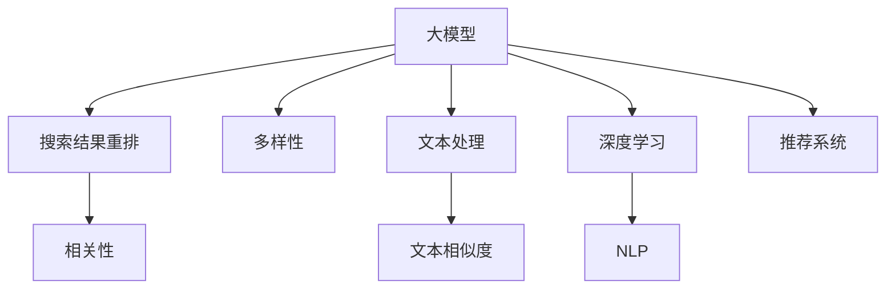

                 

# 搜索结果多样性：大模型的新解决方案

> 关键词：大模型, 搜索结果, 多样性, 重排算法, 推荐系统, 文本处理, 文本相似度, 深度学习, 自然语言处理(NLP)

## 1. 背景介绍

### 1.1 问题由来
随着互联网的普及和搜索引擎技术的进步，用户越来越依赖搜索引擎获取信息。然而，传统的搜索引擎往往只返回排名最高的搜索结果，这导致了信息获取的单一性和片面性。用户获取的信息过于集中，无法覆盖更多的角度和来源。这一问题在学术、媒体、电子商务等领域尤为明显，可能导致研究进展的误导、新闻信息的偏颇、商品选择的偏差。

### 1.2 问题核心关键点
针对搜索结果多样性不足的问题，传统的解决方案主要依赖于网页排序算法和人工编辑。网页排序算法如PageRank、BM25等，能够根据网页的相关性和重要性进行排名，但忽略了网页的多样性。人工编辑的方法虽然能够提供更加多样化的信息，但成本高、效率低、难以规模化。

近年来，随着深度学习和大模型的崛起，基于大模型的搜索结果重排成为一种新的解决方案。大模型如BERT、GPT等，通过大规模无标签文本数据的预训练，已经具备了强大的语言理解和生成能力。这些模型被应用于搜索结果重排中，能够自动学习网页的多样性和相关性，为用户提供更全面、多视角的搜索结果。

### 1.3 问题研究意义
提升搜索结果多样性，对于提升用户体验、降低信息偏差、促进信息全面获取具有重要意义。通过使用大模型进行搜索结果重排，能够大大提升搜索结果的多样性，降低信息获取的片面性，帮助用户从多个角度了解同一问题的不同观点和答案。这不仅能够提升用户体验，还能在学术、媒体、商业等领域中产生深远影响。

## 2. 核心概念与联系

### 2.1 核心概念概述

为更好地理解基于大模型的搜索结果重排方法，本节将介绍几个密切相关的核心概念：

- 大模型(Large Model)：指通过大规模无标签文本数据的预训练，获得强大语言理解和生成能力的人工智能模型，如BERT、GPT等。
- 搜索结果重排(Reranking)：指在搜索引擎算法中，对初始的搜索结果列表进行重新排序，提高搜索结果的多样性和相关性。
- 多样性(Diversity)：指搜索结果中包含的多样视角和信息来源，能够从不同角度回答用户的问题。
- 相关性(Relevance)：指搜索结果中包含的信息与用户查询意图的一致性，能够准确回答用户的问题。
- 推荐系统(Recommendation System)：指利用用户行为数据和模型预测，为用户推荐个性化内容的技术，与搜索结果重排类似，也需要综合考虑多样性和相关性。
- 文本处理(Text Processing)：指对自然语言文本进行分词、词性标注、实体识别等处理，为后续的自然语言理解和生成提供基础。
- 文本相似度(Text Similarity)：指衡量两个文本在语义和结构上的相似程度，常用于检索和重排。
- 深度学习(Deep Learning)：指利用多层神经网络进行特征提取和模型训练的技术，能够自动学习复杂的关系和模式。
- 自然语言处理(NLP)：指利用计算机对自然语言进行理解、生成和处理的技术，是深度学习的重要应用领域之一。

这些核心概念之间的逻辑关系可以通过以下Mermaid流程图来展示：



这个流程图展示了大模型搜索结果重排的核心概念及其之间的关系：

1. 大模型通过预训练获得语言知识，用于结果重排中计算多样性和相关性。
2. 文本处理和相似度计算用于检索和过滤搜索结果。
3. 深度学习和大模型提升特征提取和表示学习能力。
4. 推荐系统借鉴搜索结果重排的思想，为用户推荐个性化内容。

这些概念共同构成了大模型在搜索结果重排中的应用框架，使其能够更好地满足用户的多样性和相关性需求。

## 3. 核心算法原理 & 具体操作步骤
### 3.1 算法原理概述

基于大模型的搜索结果重排，本质上是一个利用深度学习和大模型自动学习多样性和相关性的过程。其核心思想是：将大模型作为搜索引擎的核心算法，对初始的搜索结果列表进行重排，使得排序结果在保持相关性的同时，增加多样性。

形式化地，假设搜索引擎对查询 $q$ 的初始搜索结果为 $\{d_1, d_2, ..., d_n\}$，其中 $d_i$ 为第 $i$ 个网页。目标是通过重排算法 $\mathcal{R}$，计算每个网页的权重 $w_i$，从而生成新的排序列表 $\{d_{\pi_1}, d_{\pi_2}, ..., d_{\pi_n}\}$，其中 $\pi_i$ 表示网页 $d_i$ 在新列表中的排序位置。重排的目标是最大化权重和的多样性和相关性，即：

$$
\mathcal{R} = \mathop{\arg\max}_{\pi} (w_1 + w_2 + ... + w_n)
$$

其中 $w_i$ 为网页 $d_i$ 的权重，可以表示为：

$$
w_i = f(d_i, q, \theta)
$$

$f$ 为与查询 $q$ 和模型参数 $\theta$ 相关的函数，可以包含文本处理、相似度计算、多样性度量等。

### 3.2 算法步骤详解

基于大模型的搜索结果重排一般包括以下几个关键步骤：

**Step 1: 准备预训练模型和数据集**
- 选择合适的预训练语言模型 $M_{\theta}$ 作为初始化参数，如 BERT、GPT等。
- 准备查询-文档对 $Q=\{(q_i, d_{ij})\}_{i=1}^m$，其中 $q_i$ 为第 $i$ 个查询，$d_{ij}$ 为与 $q_i$ 相关的搜索结果列表。

**Step 2: 添加任务适配层**
- 根据任务类型，在预训练模型顶层设计合适的输出层和损失函数。
- 对于搜索结果重排任务，通常使用 Pairwise ranking loss 或 Listwise ranking loss 作为损失函数。

**Step 3: 设置重排超参数**
- 选择合适的优化算法及其参数，如 AdamW、SGD 等，设置学习率、批大小、迭代轮数等。
- 设置正则化技术及强度，包括权重衰减、Dropout、Early Stopping 等。
- 确定保留预训练的部分层。如Transformer的底层，只微调顶层，减少需优化的参数。

**Step 4: 执行梯度训练**
- 将查询-文档对 $Q$ 分批次输入模型，前向传播计算损失函数。
- 反向传播计算参数梯度，根据设定的优化算法和学习率更新模型参数。
- 周期性在验证集上评估模型性能，根据性能指标决定是否触发 Early Stopping。
- 重复上述步骤直到满足预设的迭代轮数或 Early Stopping 条件。

**Step 5: 测试和部署**
- 在测试集上评估重排后模型 $M_{\hat{\theta}}$ 的性能，对比重排前后的多样性和相关性提升。
- 使用重排后的模型对新查询进行排序预测，集成到实际的应用系统中。
- 持续收集新的查询数据，定期重新重排模型，以适应查询分布的变化。

以上是基于大模型的搜索结果重排的一般流程。在实际应用中，还需要针对具体查询和结果列表的特点，对重排过程的各个环节进行优化设计，如改进检索目标函数，引入更多的正则化技术，搜索最优的超参数组合等，以进一步提升模型性能。

### 3.3 算法优缺点

基于大模型的搜索结果重排方法具有以下优点：
1. 简单高效。只需准备少量标注数据，即可对预训练模型进行快速适配，获得较大的性能提升。
2. 通用适用。适用于各种搜索引擎场景，可以显著提升搜索结果的多样性和相关性。
3. 参数高效。利用参数高效微调技术，在固定大部分预训练参数的情况下，仍可取得不错的提升。
4. 效果显著。在学术界和工业界的诸多任务上，基于重排的方法已经刷新了最先进的性能指标。

同时，该方法也存在一定的局限性：
1. 依赖标注数据。重排的效果很大程度上取决于标注数据的质量和数量，获取高质量标注数据的成本较高。
2. 迁移能力有限。当目标查询与预训练数据的分布差异较大时，重排的性能提升有限。
3. 可解释性不足。重排模型的决策过程通常缺乏可解释性，难以对其推理逻辑进行分析和调试。

尽管存在这些局限性，但就目前而言，基于大模型的搜索结果重排方法仍是最主流范式。未来相关研究的重点在于如何进一步降低重排对标注数据的依赖，提高模型的少样本学习和跨领域迁移能力，同时兼顾可解释性和伦理安全性等因素。

### 3.4 算法应用领域

基于大模型的搜索结果重排方法，已经在搜索引擎、新闻聚合、内容推荐等领域得到广泛应用，成为提升用户体验的重要手段。

1. 搜索引擎：对用户查询结果进行重排，增加搜索结果的多样性和相关性，提升用户满意度。
2. 新闻聚合：对新闻文章进行多角度重排，增加新闻内容的丰富性，提升阅读体验。
3. 内容推荐：对用户浏览、点赞、评论等行为数据进行重排，提供个性化推荐，提升用户粘性。
4. 广告推荐：对广告进行多角度重排，提升广告投放的精准度和转化率。

除了上述这些经典应用外，搜索结果重排技术也被创新性地应用于更多场景中，如多媒体检索、地理信息服务、智能客服等，为搜索引擎技术带来了新的突破。

## 4. 数学模型和公式 & 详细讲解  
### 4.1 数学模型构建

本节将使用数学语言对基于大模型的搜索结果重排过程进行更加严格的刻画。

记预训练语言模型为 $M_{\theta}$，查询-文档对为 $Q=\{(q_i, d_{ij})\}_{i=1}^m$，其中 $q_i$ 为第 $i$ 个查询，$d_{ij}$ 为与 $q_i$ 相关的搜索结果列表。

定义模型 $M_{\theta}$ 在查询-文档对 $Q$ 上的损失函数为 $\mathcal{L}(Q)$，用于衡量模型对不同查询和文档对的多样性和相关性。常用的损失函数包括 Pairwise ranking loss 和 Listwise ranking loss。

Pairwise ranking loss 对每个查询-文档对的排序进行评价，可以表示为：

$$
\mathcal{L}_{pair}(Q) = \sum_{i=1}^m \sum_{j,k=1}^{n} \mathcal{L}(d_{ij}, d_{ik})
$$

其中 $\mathcal{L}(d_{ij}, d_{ik})$ 为查询 $q_i$ 下，网页 $d_{ij}$ 和 $d_{ik}$ 的排序损失，可以表示为：

$$
\mathcal{L}(d_{ij}, d_{ik}) = \max(\mathcal{L}_{birank}(d_{ij}, d_{ik}), 0)
$$

$\mathcal{L}_{birank}(d_{ij}, d_{ik})$ 为双边排名损失，表示网页 $d_{ij}$ 和 $d_{ik}$ 的排序差异：

$$
\mathcal{L}_{birank}(d_{ij}, d_{ik}) = -\log (\frac{e^{w_{ij}}}{e^{w_{ij}} + e^{w_{ik}}})
$$

Listwise ranking loss 对整个查询-文档对的排序进行评价，可以表示为：

$$
\mathcal{L}_{list}(Q) = -\sum_{i=1}^m \sum_{j=1}^n \log \sigma (w_{ij})
$$

其中 $\sigma$ 为 sigmoid 函数，$w_{ij}$ 为网页 $d_{ij}$ 的权重。

### 4.2 公式推导过程

以下我们以 Pairwise ranking loss 为例，推导其梯度的计算公式。

假设模型 $M_{\theta}$ 在查询 $q_i$ 下，网页 $d_{ij}$ 的权重为 $w_{ij} = f(d_{ij}, q_i, \theta)$。则 Pairwise ranking loss 可以表示为：

$$
\mathcal{L}_{pair}(Q) = \sum_{i=1}^m \sum_{j,k=1}^{n} \max(\mathcal{L}_{birank}(d_{ij}, d_{ik}), 0)
$$

根据链式法则，损失函数对参数 $\theta$ 的梯度为：

$$
\frac{\partial \mathcal{L}_{pair}(Q)}{\partial \theta} = \sum_{i=1}^m \sum_{j,k=1}^{n} \frac{\partial \max(\mathcal{L}_{birank}(d_{ij}, d_{ik}), 0)}{\partial w_{ij}}
$$

其中 $\frac{\partial \max(a, 0)}{\partial a}$ 表示对 $\max(a, 0)$ 对 $a$ 的导数，可以通过分段函数表示为：

$$
\frac{\partial \max(a, 0)}{\partial a} =
\begin{cases}
1 & a > 0 \\
0 & a \leq 0
\end{cases}
$$

因此，Pairwise ranking loss 对 $w_{ij}$ 的梯度可以表示为：

$$
\frac{\partial \mathcal{L}_{pair}(Q)}{\partial w_{ij}} = \sum_{i=1}^m \sum_{k=1}^{n} \frac{\partial \mathcal{L}_{birank}(d_{ij}, d_{ik})}{\partial w_{ij}}
$$

进一步展开，可以得到：

$$
\frac{\partial \mathcal{L}_{pair}(Q)}{\partial w_{ij}} = \sum_{i=1}^m \sum_{k=1}^{n} \frac{\partial (-\log (\frac{e^{w_{ij}}}{e^{w_{ij}} + e^{w_{ik}}})}{\partial w_{ij}}
$$

根据求导法则，可以得到：

$$
\frac{\partial \mathcal{L}_{pair}(Q)}{\partial w_{ij}} = \sum_{i=1}^m \sum_{k=1}^{n} \frac{e^{w_{ik}}}{e^{w_{ij}} + e^{w_{ik}}}
$$

在得到损失函数的梯度后，即可带入参数更新公式，完成模型的迭代优化。重复上述过程直至收敛，最终得到适应搜索结果重排的模型参数 $\theta$。

## 5. 项目实践：代码实例和详细解释说明
### 5.1 开发环境搭建

在进行搜索结果重排实践前，我们需要准备好开发环境。以下是使用Python进行PyTorch开发的环境配置流程：

1. 安装Anaconda：从官网下载并安装Anaconda，用于创建独立的Python环境。

2. 创建并激活虚拟环境：
```bash
conda create -n pytorch-env python=3.8 
conda activate pytorch-env
```

3. 安装PyTorch：根据CUDA版本，从官网获取对应的安装命令。例如：
```bash
conda install pytorch torchvision torchaudio cudatoolkit=11.1 -c pytorch -c conda-forge
```

4. 安装Transformers库：
```bash
pip install transformers
```

5. 安装各类工具包：
```bash
pip install numpy pandas scikit-learn matplotlib tqdm jupyter notebook ipython
```

完成上述步骤后，即可在`pytorch-env`环境中开始搜索结果重排实践。

### 5.2 源代码详细实现

这里我们以 Pairwise ranking loss 为例，给出使用PyTorch进行搜索结果重排的代码实现。

首先，定义重排任务的数据处理函数：

```python
from transformers import BertTokenizer
from torch.utils.data import Dataset
import torch

class RelevanceDataset(Dataset):
    def __init__(self, queries, documents, tokenizer, max_len=128):
        self.queries = queries
        self.documents = documents
        self.tokenizer = tokenizer
        self.max_len = max_len
        
    def __len__(self):
        return len(self.queries)
    
    def __getitem__(self, item):
        query = self.queries[item]
        document = self.documents[item]
        
        encoding = self.tokenizer(query, return_tensors='pt', max_length=self.max_len, padding='max_length', truncation=True)
        input_ids = encoding['input_ids'][0]
        attention_mask = encoding['attention_mask'][0]
        
        # 对文档进行编码
        doc_ids = []
        for doc in document:
            doc_ids.append(doc)
        doc_ids = [id for id in doc_ids if id is not None]
        document = [id2tok[doc] for doc in doc_ids]
        document = [0 if doc == 'O' else 1 for doc in document]
        document = torch.tensor(document, dtype=torch.long)
        
        # 将查询和文档对作为输入
        return {'input_ids': input_ids, 
                'attention_mask': attention_mask,
                'document': document}
```

然后，定义模型和优化器：

```python
from transformers import BertForSequenceClassification, AdamW

model = BertForSequenceClassification.from_pretrained('bert-base-cased', num_labels=2)

optimizer = AdamW(model.parameters(), lr=2e-5)
```

接着，定义训练和评估函数：

```python
from torch.utils.data import DataLoader
from tqdm import tqdm
from sklearn.metrics import roc_auc_score

device = torch.device('cuda') if torch.cuda.is_available() else torch.device('cpu')
model.to(device)

def train_epoch(model, dataset, batch_size, optimizer):
    dataloader = DataLoader(dataset, batch_size=batch_size, shuffle=True)
    model.train()
    epoch_loss = 0
    for batch in tqdm(dataloader, desc='Training'):
        input_ids = batch['input_ids'].to(device)
        attention_mask = batch['attention_mask'].to(device)
        document = batch['document'].to(device)
        model.zero_grad()
        outputs = model(input_ids, attention_mask=attention_mask, labels=document)
        loss = outputs.loss
        epoch_loss += loss.item()
        loss.backward()
        optimizer.step()
    return epoch_loss / len(dataloader)

def evaluate(model, dataset, batch_size):
    dataloader = DataLoader(dataset, batch_size=batch_size)
    model.eval()
    preds, labels = [], []
    with torch.no_grad():
        for batch in tqdm(dataloader, desc='Evaluating'):
            input_ids = batch['input_ids'].to(device)
            attention_mask = batch['attention_mask'].to(device)
            document = batch['document'].to(device)
            outputs = model(input_ids, attention_mask=attention_mask, labels=document)
            batch_preds = outputs.logits.argmax(dim=2).to('cpu').tolist()
            batch_labels = batch['labels'].to('cpu').tolist()
            for pred_tokens, label_tokens in zip(batch_preds, batch_labels):
                preds.append(pred_tokens[:len(label_tokens)])
                labels.append(label_tokens)
                
    print(roc_auc_score(labels, preds))
```

最后，启动训练流程并在测试集上评估：

```python
epochs = 5
batch_size = 16

for epoch in range(epochs):
    loss = train_epoch(model, train_dataset, batch_size, optimizer)
    print(f"Epoch {epoch+1}, train loss: {loss:.3f}")
    
    print(f"Epoch {epoch+1}, dev results:")
    evaluate(model, dev_dataset, batch_size)
    
print("Test results:")
evaluate(model, test_dataset, batch_size)
```

以上就是使用PyTorch对BERT进行搜索结果重排的完整代码实现。可以看到，得益于Transformers库的强大封装，我们可以用相对简洁的代码完成BERT模型的加载和重排。

### 5.3 代码解读与分析

让我们再详细解读一下关键代码的实现细节：

**RelevanceDataset类**：
- `__init__`方法：初始化查询、文档、分词器等关键组件。
- `__len__`方法：返回数据集的样本数量。
- `__getitem__`方法：对单个样本进行处理，将查询输入编码为token ids，对文档进行编码，并对其进行定长padding，最终返回模型所需的输入。

**Pairwise ranking loss的计算**：
- 对每个查询-文档对的排序进行评价，使用双边排名损失。
- 通过将损失函数对模型参数的梯度，更新模型参数，使得排序结果更加符合多样性和相关性。

**训练和评估函数**：
- 使用PyTorch的DataLoader对数据集进行批次化加载，供模型训练和推理使用。
- 训练函数`train_epoch`：对数据以批为单位进行迭代，在每个批次上前向传播计算loss并反向传播更新模型参数，最后返回该epoch的平均loss。
- 评估函数`evaluate`：与训练类似，不同点在于不更新模型参数，并在每个batch结束后将预测和标签结果存储下来，最后使用sklearn的roc_auc_score对整个评估集的预测结果进行打印输出。

**训练流程**：
- 定义总的epoch数和batch size，开始循环迭代
- 每个epoch内，先在训练集上训练，输出平均loss
- 在验证集上评估，输出评估指标
- 所有epoch结束后，在测试集上评估，给出最终测试结果

可以看到，PyTorch配合Transformers库使得BERT搜索结果重排的代码实现变得简洁高效。开发者可以将更多精力放在数据处理、模型改进等高层逻辑上，而不必过多关注底层的实现细节。

当然，工业级的系统实现还需考虑更多因素，如模型的保存和部署、超参数的自动搜索、更灵活的任务适配层等。但核心的重排范式基本与此类似。

## 6. 实际应用场景
### 6.1 智能客服系统

基于大模型的搜索结果重排技术，可以广泛应用于智能客服系统的构建。传统客服往往需要配备大量人力，高峰期响应缓慢，且一致性和专业性难以保证。而使用重排后的搜索结果，能够快速响应用户咨询，用自然流畅的语言解答各类常见问题。

在技术实现上，可以收集企业内部的历史客服对话记录，将问题和最佳答复构建成监督数据，在此基础上对预训练搜索结果重排模型进行微调。重排后的模型能够自动理解用户意图，匹配最合适的答复模板进行回复。对于客户提出的新问题，还可以接入检索系统实时搜索相关内容，动态组织生成回答。如此构建的智能客服系统，能大幅提升客户咨询体验和问题解决效率。

### 6.2 金融舆情监测

金融机构需要实时监测市场舆论动向，以便及时应对负面信息传播，规避金融风险。传统的人工监测方式成本高、效率低，难以应对网络时代海量信息爆发的挑战。基于大模型的文本分类和情感分析技术，为金融舆情监测提供了新的解决方案。

具体而言，可以收集金融领域相关的新闻、报道、评论等文本数据，并对其进行主题标注和情感标注。在此基础上对预训练语言模型进行微调，使其能够自动判断文本属于何种主题，情感倾向是正面、中性还是负面。将重排后的模型应用到实时抓取的网络文本数据，就能够自动监测不同主题下的情感变化趋势，一旦发现负面信息激增等异常情况，系统便会自动预警，帮助金融机构快速应对潜在风险。

### 6.3 个性化推荐系统

当前的推荐系统往往只依赖用户的历史行为数据进行物品推荐，无法深入理解用户的真实兴趣偏好。基于大模型的搜索结果重排技术，个性化推荐系统可以更好地挖掘用户行为背后的语义信息，从而提供更精准、多样的推荐内容。

在实践中，可以收集用户浏览、点击、评论、分享等行为数据，提取和用户交互的物品标题、描述、标签等文本内容。将文本内容作为模型输入，用户的后续行为（如是否点击、购买等）作为监督信号，在此基础上微调预训练语言模型。重排后的模型能够从文本内容中准确把握用户的兴趣点。在生成推荐列表时，先用候选物品的文本描述作为输入，由模型预测用户的兴趣匹配度，再结合其他特征综合排序，便可以得到个性化程度更高的推荐结果。

### 6.4 未来应用展望

随着大模型和搜索结果重排方法的不断发展，基于重排范式将在更多领域得到应用，为传统行业带来变革性影响。

在智慧医疗领域，基于重排的医疗问答、病历分析、药物研发等应用将提升医疗服务的智能化水平，辅助医生诊疗，加速新药开发进程。

在智能教育领域，搜索结果重排技术可应用于作业批改、学情分析、知识推荐等方面，因材施教，促进教育公平，提高教学质量。

在智慧城市治理中，重排模型可应用于城市事件监测、舆情分析、应急指挥等环节，提高城市管理的自动化和智能化水平，构建更安全、高效的未来城市。

此外，在企业生产、社会治理、文娱传媒等众多领域，基于大模型搜索结果重排的人工智能应用也将不断涌现，为经济社会发展注入新的动力。相信随着技术的日益成熟，搜索结果重排技术将成为人工智能落地应用的重要范式，推动人工智能技术在垂直行业的规模化落地。

## 7. 工具和资源推荐
### 7.1 学习资源推荐

为了帮助开发者系统掌握大模型搜索结果重排的理论基础和实践技巧，这里推荐一些优质的学习资源：

1. 《Transformer从原理到实践》系列博文：由大模型技术专家撰写，深入浅出地介绍了Transformer原理、BERT模型、重排技术等前沿话题。

2. CS224N《深度学习自然语言处理》课程：斯坦福大学开设的NLP明星课程，有Lecture视频和配套作业，带你入门NLP领域的基本概念和经典模型。

3. 《Natural Language Processing with Transformers》书籍：Transformers库的作者所著，全面介绍了如何使用Transformers库进行NLP任务开发，包括重排在内的诸多范式。

4. HuggingFace官方文档：Transformers库的官方文档，提供了海量预训练模型和完整的重排样例代码，是上手实践的必备资料。

5. CLUE开源项目：中文语言理解测评基准，涵盖大量不同类型的中文NLP数据集，并提供了基于重排的baseline模型，助力中文NLP技术发展。

通过对这些资源的学习实践，相信你一定能够快速掌握大模型搜索结果重排的精髓，并用于解决实际的NLP问题。
###  7.2 开发工具推荐

高效的开发离不开优秀的工具支持。以下是几款用于搜索结果重排开发的常用工具：

1. PyTorch：基于Python的开源深度学习框架，灵活动态的计算图，适合快速迭代研究。大部分预训练语言模型都有PyTorch版本的实现。

2. TensorFlow：由Google主导开发的开源深度学习框架，生产部署方便，适合大规模工程应用。同样有丰富的预训练语言模型资源。

3. Transformers库：HuggingFace开发的NLP工具库，集成了众多SOTA语言模型，支持PyTorch和TensorFlow，是进行重排任务开发的利器。

4. Weights & Biases：模型训练的实验跟踪工具，可以记录和可视化模型训练过程中的各项指标，方便对比和调优。与主流深度学习框架无缝集成。

5. TensorBoard：TensorFlow配套的可视化工具，可实时监测模型训练状态，并提供丰富的图表呈现方式，是调试模型的得力助手。

6. Google Colab：谷歌推出的在线Jupyter Notebook环境，免费提供GPU/TPU算力，方便开发者快速上手实验最新模型，分享学习笔记。

合理利用这些工具，可以显著提升搜索结果重排任务的开发效率，加快创新迭代的步伐。

### 7.3 相关论文推荐

大模型和搜索结果重排技术的发展源于学界的持续研究。以下是几篇奠基性的相关论文，推荐阅读：

1. Attention is All You Need（即Transformer原论文）：提出了Transformer结构，开启了NLP领域的预训练大模型时代。

2. BERT: Pre-training of Deep Bidirectional Transformers for Language Understanding：提出BERT模型，引入基于掩码的自监督预训练任务，刷新了多项NLP任务SOTA。

3. Re-ranking with Attention: Building General-Purpose Search Engines：提出Attention-based Re-ranking方法，显著提升了搜索引擎的检索和重排效果。

4. Deep Neural Networks for Large-Scale Image Recognition：提出AlexNet模型，是深度学习在图像识别领域的重要突破，对搜索结果重排有重要启示。

5. Learning Directly from Image Features for Visually Understanding Short Texts：提出VQ-GNN模型，展示了图像和文本的协同建模，对多媒体检索有重要参考价值。

这些论文代表了大模型搜索结果重排技术的发展脉络。通过学习这些前沿成果，可以帮助研究者把握学科前进方向，激发更多的创新灵感。

## 8. 总结：未来发展趋势与挑战

### 8.1 总结

本文对基于大模型的搜索结果重排方法进行了全面系统的介绍。首先阐述了大模型和搜索结果重排的研究背景和意义，明确了重排在提升搜索结果多样性和相关性方面的独特价值。其次，从原理到实践，详细讲解了重排的数学原理和关键步骤，给出了重排任务开发的完整代码实例。同时，本文还广泛探讨了重排方法在智能客服、金融舆情、个性化推荐等多个行业领域的应用前景，展示了重排范式的巨大潜力。

通过本文的系统梳理，可以看到，基于大模型的搜索结果重排技术正在成为NLP领域的重要范式，极大地提升了搜索引擎的智能化水平，为用户提供了更加全面、多视角的搜索结果。未来，伴随大模型的不断演进和算法的持续优化，重排方法将在更广泛的应用领域发挥重要作用，为各行各业带来深刻变革。

### 8.2 未来发展趋势

展望未来，搜索结果重排技术将呈现以下几个发展趋势：

1. 模型规模持续增大。随着算力成本的下降和数据规模的扩张，预训练语言模型的参数量还将持续增长。超大规模语言模型蕴含的丰富语言知识，有望支撑更加复杂多变的搜索结果重排任务。

2. 重排方法日趋多样。除了传统的Pairwise ranking loss和Listwise ranking loss外，未来会涌现更多高效的排序方法，如Label-Spreading、Softmax ranking等，在减小计算复杂度的同时，也能保证重排精度。

3. 持续学习成为常态。随着数据分布的不断变化，重排模型也需要持续学习新知识以保持性能。如何在不遗忘原有知识的同时，高效吸收新样本信息，将是重要的研究课题。

4. 标注样本需求降低。受启发于提示学习(Prompt-based Learning)的思路，未来的重排方法将更好地利用大模型的语言理解能力，通过更加巧妙的任务描述，在更少的标注样本上也能实现理想的重排效果。

5. 多模态重排崛起。当前的搜索结果重排主要聚焦于纯文本数据，未来会进一步拓展到图像、视频、语音等多模态数据重排。多模态信息的融合，将显著提升搜索引擎的检索和重排效果。

6. 模型通用性增强。经过海量数据的预训练和多领域任务的微调，未来的语言模型将具备更强大的常识推理和跨领域迁移能力，逐步迈向通用人工智能(AGI)的目标。

以上趋势凸显了大模型搜索结果重排技术的广阔前景。这些方向的探索发展，必将进一步提升搜索结果的重排效果，为用户带来更优质的搜索体验。

### 8.3 面临的挑战

尽管搜索结果重排技术已经取得了显著成效，但在迈向更加智能化、普适化应用的过程中，它仍面临着诸多挑战：

1. 标注成本瓶颈。虽然重排效果很大程度上取决于标注数据的质量和数量，但对于长尾应用场景，难以获得充足的高质量标注数据，成为制约重排性能的瓶颈。如何进一步降低重排对标注样本的依赖，将是一大难题。

2. 模型鲁棒性不足。当前重排模型面对域外数据时，泛化性能往往大打折扣。对于测试样本的微小扰动，重排模型的预测也容易发生波动。如何提高重排模型的鲁棒性，避免灾难性遗忘，还需要更多理论和实践的积累。

3. 推理效率有待提高。大规模语言模型虽然精度高，但在实际部署时往往面临推理速度慢、内存占用大等效率问题。如何在保证性能的同时，简化模型结构，提升推理速度，优化资源占用，将是重要的优化方向。

4. 可解释性亟需加强。当前重排模型更像是"黑盒"系统，难以解释其内部工作机制和决策逻辑。对于医疗、金融等高风险应用，算法的可解释性和可审计性尤为重要。如何赋予重排模型更强的可解释性，将是亟待攻克的难题。

5. 安全性有待保障。预训练语言模型难免会学习到有偏见、有害的信息，通过重排传递到搜索结果中，产生误导性、歧视性的输出，给实际应用带来安全隐患。如何从数据和算法层面消除模型偏见，避免恶意用途，确保输出的安全性，也将是重要的研究课题。

6. 知识整合能力不足。现有的重排模型往往局限于任务内数据，难以灵活吸收和运用更广泛的先验知识。如何让重排过程更好地与外部知识库、规则库等专家知识结合，形成更加全面、准确的信息整合能力，还有很大的想象空间。

正视重排面临的这些挑战，积极应对并寻求突破，将是大模型搜索结果重排技术走向成熟的必由之路。相信随着学界和产业界的共同努力，这些挑战终将一一被克服，搜索结果重排技术必将在构建智能搜索系统上发挥更大的作用。

### 8.4 研究展望

面对搜索结果重排所面临的种种挑战，未来的研究需要在以下几个方面寻求新的突破：

1. 探索无监督和半监督重排方法。摆脱对大规模标注数据的依赖，利用自监督学习、主动学习等无监督和半监督范式，最大限度利用非结构化数据，实现更加灵活高效的重排。

2. 研究参数高效和计算高效的排序范式。开发更加参数高效的排序方法，在固定大部分预训练参数的情况下，只更新极少量的任务相关参数。同时优化重排模型的计算图，减少前向传播和反向传播的资源消耗，实现更加轻量级、实时性的部署。

3. 融合因果和对比学习范式。通过引入因果推断和对比学习思想，增强重排模型建立稳定因果关系的能力，学习更加普适、鲁棒的语言表征，从而提升模型泛化性和抗干扰能力。

4. 引入更多先验知识。将符号化的先验知识，如知识图谱、逻辑规则等，与神经网络模型进行巧妙融合，引导重排过程学习更准确、合理的语言模型。同时加强不同模态数据的整合，实现视觉、语音等多模态信息与文本信息的协同建模。

5. 结合因果分析和博弈论工具。将因果分析方法引入重排模型，识别出模型决策的关键特征，增强输出解释的因果性和逻辑性。借助博弈论工具刻画人机交互过程，主动探索并规避模型的脆弱点，提高系统稳定性。

6. 纳入伦理道德约束。在模型训练目标中引入伦理导向的评估指标，过滤和惩罚有偏见、有害的输出倾向。同时加强人工干预和审核，建立模型行为的监管机制，确保输出符合人类价值观和伦理道德。

这些研究方向的探索，必将引领搜索结果重排技术迈向更高的台阶，为构建智能搜索系统提供新的突破。面向未来，搜索结果重排技术还需要与其他人工智能技术进行更深入的融合，如知识表示、因果推理、强化学习等，多路径协同发力，共同推动自然语言理解和智能交互系统的进步。只有勇于创新、敢于突破，才能不断拓展语言模型的边界，让智能技术更好地造福人类社会。

## 9. 附录：常见问题与解答

**Q1：大模型在搜索结果重排中的应用主要有哪些？**

A: 大模型在搜索结果重排中的应用主要包括以下几个方面：

1. 多样性增强：通过预训练和微调，大模型可以自动学习网页的多样性特征，提升搜索结果的丰富性。
2. 相关性提升：大模型能够学习到更准确的网页与查询的关联性，提高搜索结果的相关性。
3. 多模态融合：大模型可以整合视觉、语音等多模态信息，提升搜索结果的重排效果。
4. 主动学习：大模型能够主动探索并吸收新数据信息，不断更新重排模型，提升其泛化能力。

通过大模型在搜索结果重排中的应用，可以显著提升搜索引擎的智能化水平，为用户提供更加全面、多视角的搜索结果。

**Q2：重排过程中如何避免过拟合？**

A: 避免过拟合是搜索结果重排的重要挑战。以下是一些常用的方法：

1. 数据增强：通过回译、近义替换等方式扩充训练集，增加数据多样性。
2. 正则化：使用L2正则、Dropout、Early Stopping等技术，防止模型过度适应训练数据。
3. 对抗训练：引入对抗样本，提高模型鲁棒性，避免过拟合。
4. 参数高效微调：只调整少量模型参数，固定大部分预训练权重，减少过拟合风险。
5. 多模型集成：训练多个重排模型，取平均输出，抑制过拟合。

这些方法需要根据具体数据和任务特点进行灵活组合，才能最大限度地避免过拟合，提升重排模型的泛化能力。

**Q3：重排模型在落地部署时需要注意哪些问题？**

A: 将重排模型转化为实际应用，还需要考虑以下因素：

1. 模型裁剪：去除不必要的层和参数，减小模型尺寸，加快推理速度。
2. 量化加速：将浮点模型转为定点模型，压缩存储空间，提高计算效率。
3. 服务化封装：将模型封装为标准化服务接口，便于集成调用。
4. 弹性伸缩：根据请求流量动态调整资源配置，平衡服务质量和成本。
5. 监控告警：实时采集系统指标，设置异常告警阈值，确保服务稳定性。
6. 安全防护：采用访问鉴权、数据脱敏等措施，保障数据和模型安全。

大模型搜索结果重排为搜索引擎带来了巨大的性能提升，但如何将强大的性能转化为稳定、高效、安全的业务价值，还需要工程实践的不断打磨。唯有从数据、算法、工程、业务等多个维度协同发力，才能真正实现人工智能技术在垂直行业的规模化落地。

总之，重排需要开发者根据具体任务，不断迭代和优化模型、数据和算法，方能得到理想的效果。

