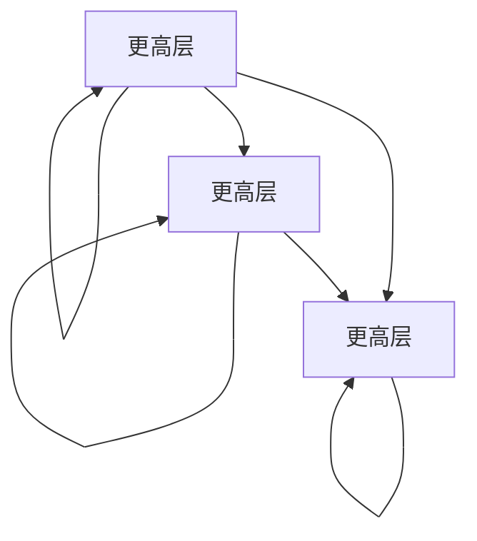

                 

# 操作系统的进程管理策略比较

> 关键词：进程管理, 进程调度, 进程同步, 进程通信, 多道程序设计, 实时系统, 批处理系统

## 1. 背景介绍

进程管理是操作系统中最为关键的技术之一，其核心在于如何合理地分配和调度系统资源，以提高系统性能、响应速度以及资源利用效率。一个高效的操作系统必须具备强大的进程管理能力，以支持多样化的应用场景和负载需求。

本文将从进程管理的基础概念出发，比较和分析操作系统中常见的进程管理策略，包括进程调度、进程同步、进程通信等方面，力求为读者提供一个深入理解操作系统进程管理机制的视角。

## 2. 核心概念与联系

### 2.1 核心概念概述

在深入比较之前，我们先简要介绍几个核心概念：

- **进程（Process）**：进程是操作系统中运行的一个程序实例，包含执行代码、数据和资源。
- **进程调度（Scheduling）**：进程调度是指操作系统根据一定的算法和策略，决定哪个进程应该得到CPU的执行时间。
- **进程同步（Synchronization）**：进程同步是指在多个进程之间实现协调和沟通，以防止资源竞争和死锁等问题。
- **进程通信（Interprocess Communication, IPC）**：进程通信是指不同进程之间交换信息或协作执行的一种机制。

### 2.2 核心概念原理和架构的 Mermaid 流程图



这个流程图展示了进程管理的三大核心概念之间的联系：进程调度、进程同步和进程通信互相影响，共同构成了操作系统进程管理的完整架构。

## 3. 核心算法原理 & 具体操作步骤

### 3.1 算法原理概述

操作系统中的进程管理算法原理，主要围绕着进程调度和资源分配展开。

- **进程调度**：通过一定的算法策略，决定哪个进程应该获得CPU的执行时间。主要考虑进程的优先级、CPU亲和性、I/O需求等因素。
- **资源分配**：操作系统负责管理CPU、内存、I/O设备等系统资源，确保每个进程能够公平、高效地获取所需的资源。

### 3.2 算法步骤详解

#### 3.2.1 进程调度

进程调度是操作系统中最基本的任务之一，其目的是通过合理的调度算法，确保系统中所有进程都能得到公平的CPU时间。常用的调度算法包括：

- **先来先服务（FCFS, First Come, First Served）**：按照进程到达的顺序进行调度，先到先服务。
- **短作业优先（SJF, Shortest Job First）**：优先调度需要执行时间最短的进程。
- **优先级调度（Priority Scheduling）**：根据进程的优先级进行调度，高优先级进程优先执行。
- **时间片轮转（Round Robin, RR）**：每个进程分配一个固定时间片，时间片结束后，进程被挂起，下一个进程获得执行权。
- **多级反馈队列调度（Multilevel Feedback Queue Scheduling）**：设置多个队列，每个队列采用不同的调度算法和时间片大小，高优先级队列采用时间片轮转，低优先级队列采用多级队列调度。

#### 3.2.2 进程同步

进程同步的目的是在多个进程之间实现协调和沟通，以防止资源竞争和死锁等问题。常见的同步机制包括：

- **互斥锁（Mutex）**：用于保护共享资源的访问，一次只能由一个进程访问。
- **信号量（Semaphore）**：用于控制并发进程对共享资源的访问，支持信号量计数器。
- **条件变量（Condition Variable）**：允许进程等待某个条件成立，并在条件满足时唤醒相应进程。
- **读写锁（Read-Write Lock）**：允许多个进程同时读取共享资源，但只允许一个进程写入共享资源。

#### 3.2.3 进程通信

进程通信是指不同进程之间交换信息或协作执行的一种机制。常见的通信方式包括：

- **管道（Pipe）**：允许多个进程通过共享内存区进行通信。
- **消息传递（Message Passing）**：通过消息队列、信箱等方式进行进程间通信。
- **共享内存（Shared Memory）**：多个进程共享同一块物理内存，通过直接读写共享内存进行通信。
- **套接字（Socket）**：用于网络应用程序之间的通信。

### 3.3 算法优缺点

#### 3.3.1 进程调度

- **优点**：公平、灵活、易于实现。
- **缺点**：效率可能不如其他算法，无法充分利用CPU。

#### 3.3.2 进程同步

- **优点**：简单、易于实现，能够有效防止资源竞争和死锁。
- **缺点**：同步机制的过度使用可能导致性能下降。

#### 3.3.3 进程通信

- **优点**：灵活、高效、适用范围广。
- **缺点**：通信复杂度较高，容易出错。

### 3.4 算法应用领域

进程调度、进程同步和进程通信是操作系统中最为基础和关键的技术，广泛应用于各种类型的系统，包括：

- **批处理系统**：如早期的IBM OS/360，适用于大型机环境，侧重于资源利用效率和吞吐量。
- **分时系统**：如UNIX、Linux，适用于个人计算机和工作站，侧重于响应速度和用户交互。
- **实时系统**：如RT-Linux、FreeRTOS，适用于嵌入式系统和工业控制，侧重于实时性和可靠性。
- **分布式系统**：如Google Borg、Apache Mesos，适用于云计算和数据中心，侧重于资源管理和调度。

## 4. 数学模型和公式 & 详细讲解 & 举例说明

### 4.1 数学模型构建

#### 4.1.1 进程调度模型

进程调度模型的核心是调度算法，常见算法的时间复杂度和性能分析可以使用数学模型来描述。

- **FCFS调度算法**：时间复杂度为$O(N)$，公平但效率较低。
- **SJF调度算法**：平均响应时间最短，但需要预测进程的执行时间。
- **优先级调度算法**：根据进程优先级进行调度，时间复杂度取决于优先级实现方式。
- **时间片轮转调度算法**：时间复杂度为$O(N)$，性能平衡但可能出现饥饿现象。
- **多级反馈队列调度算法**：复杂度取决于队列数量和时间片大小，性能较好但实现复杂。

#### 4.1.2 进程同步模型

进程同步模型主要描述多个进程之间如何进行沟通和协调，常见的同步机制可以通过数学模型描述。

- **互斥锁（Mutex）**：互斥锁可以防止多个进程同时访问共享资源，时间复杂度取决于锁的使用频率。
- **信号量（Semaphore）**：信号量使用计数器进行同步，时间复杂度取决于信号量的个数。
- **条件变量（Condition Variable）**：条件变量通过等待和唤醒机制实现进程同步，时间复杂度取决于等待和唤醒的次数。
- **读写锁（Read-Write Lock）**：读写锁允许多个进程同时读取共享资源，时间复杂度取决于读写锁的使用频率。

#### 4.1.3 进程通信模型

进程通信模型主要描述不同进程之间如何进行信息交换，常见的通信方式可以通过数学模型描述。

- **管道（Pipe）**：管道通信的时间复杂度取决于数据的传输速度和管道的大小。
- **消息传递（Message Passing）**：消息传递的时间复杂度取决于消息的发送和接收次数。
- **共享内存（Shared Memory）**：共享内存通信的时间复杂度取决于数据的读取和写入速度。
- **套接字（Socket）**：套接字通信的时间复杂度取决于网络传输延迟和带宽。

### 4.2 公式推导过程

#### 4.2.1 进程调度算法公式推导

以时间片轮转调度算法为例，设时间片大小为$T$，进程数为$N$，每个进程的执行时间为$E_i$。

- **响应时间（RT）**：
$$ RT = \frac{T}{N} + \sum_{i=1}^{N} \frac{E_i}{N} $$

- **吞吐量（TPS）**：
$$ TPS = \frac{N}{T} $$

#### 4.2.2 进程同步算法公式推导

以互斥锁为例，设锁的访问次数为$M$，锁的使用频率为$F$。

- **锁的响应时间（RT）**：
$$ RT = M \times F $$

- **锁的利用率（Utilization）**：
$$ Utilization = \frac{M}{M \times F} $$

#### 4.2.3 进程通信算法公式推导

以管道通信为例，设管道大小为$S$，数据传输速度为$V$，传输次数为$T$。

- **传输时间（TT）**：
$$ TT = \frac{S}{V} \times T $$

### 4.3 案例分析与讲解

#### 4.3.1 批处理系统中的进程调度

在批处理系统中，调度算法往往采用时间片轮转（RR）或短作业优先（SJF），以最大化系统资源利用效率和吞吐量。

- **时间片轮转调度算法**：
  - **优点**：公平、灵活、易于实现。
  - **缺点**：可能出现饥饿现象，低优先级进程难以获得执行时间。

- **短作业优先调度算法**：
  - **优点**：平均响应时间短，系统吞吐量大。
  - **缺点**：需要预测进程的执行时间，可能出现低估或高估的问题。

#### 4.3.2 分时系统中的进程同步

在分时系统中，同步机制通常采用互斥锁和条件变量，以确保用户交互的响应速度和流畅性。

- **互斥锁**：
  - **优点**：简单、易于实现，防止多个进程同时访问共享资源。
  - **缺点**：锁的竞争可能导致性能下降，需要合理设计锁的粒度和使用频率。

- **条件变量**：
  - **优点**：支持进程等待和唤醒，防止死锁和饥饿现象。
  - **缺点**：复杂度高，容易出现死锁和竞态条件。

#### 4.3.3 实时系统中的进程通信

在实时系统中，通信机制通常采用管道和套接字，以支持系统的高实时性和可靠性。

- **管道**：
  - **优点**：简单、高效，适用于进程间快速通信。
  - **缺点**：数据传输速度受限，无法支持大量数据传输。

- **套接字**：
  - **优点**：适用于网络应用程序之间的通信，支持异步通信。
  - **缺点**：复杂度高，通信延迟较大。

## 5. 项目实践：代码实例和详细解释说明

### 5.1 开发环境搭建

在进行进程管理策略的实践时，我们需要准备好开发环境。以下是使用Linux系统进行进程管理策略的开发环境配置流程：

1. 安装Linux系统：选择一个稳定的Linux发行版，如Ubuntu或CentOS。
2. 安装必要的开发工具：
  - **编译工具**：gcc、g++等。
  - **系统编程库**：libpthread、libsyscall、libstdc++等。
3. 安装操作系统内核源码：
  - **Linux内核**：从官网下载适合你系统的内核源码，安装gcc编译工具。
  - **Linux kernel headers**：通过`apt-get install linux-headers-<version>`安装内核头文件。

### 5.2 源代码详细实现

#### 5.2.1 进程调度

以下是一个简单的进程调度器实现示例，采用时间片轮转调度算法：

```c
#include <stdio.h>
#include <unistd.h>
#include <stdlib.h>
#include <signal.h>

#define TIME_SLICE 100

void time_slice_handler(int sig) {
    kill(getpid(), SIGKILL);
}

int main() {
    pid_t pid1, pid2;

    pid1 = fork();
    if (pid1 == 0) {
        printf("Child process 1\n");
        sleep(TIME_SLICE);
        kill(getppid(), SIGKILL);
        exit(0);
    }

    pid2 = fork();
    if (pid2 == 0) {
        printf("Child process 2\n");
        sleep(TIME_SLICE);
        kill(getppid(), SIGKILL);
        exit(0);
    }

    while (1) {
        if (wait(NULL) != -1) {
            printf("Process died\n");
            exit(0);
        }
    }

    return 0;
}
```

在这个示例中，通过调用`fork`函数创建子进程，并设置时间片轮转调度器。当子进程运行到指定时间片时，会通过`kill`函数终止父进程，从而实现时间片轮转调度。

#### 5.2.2 进程同步

以下是一个简单的互斥锁示例，用于保护共享资源：

```c
#include <stdio.h>
#include <stdlib.h>
#include <pthread.h>

int counter = 0;
pthread_mutex_t mutex;

void* worker(void* arg) {
    pthread_mutex_lock(&mutex);
    counter++;
    printf("Worker %d: counter = %d\n", *(int*)arg, counter);
    pthread_mutex_unlock(&mutex);
    return NULL;
}

int main() {
    pthread_t thread1, thread2;
    int arg1 = 1, arg2 = 2;

    pthread_mutex_init(&mutex, NULL);

    pthread_create(&thread1, NULL, worker, &arg1);
    pthread_create(&thread2, NULL, worker, &arg2);

    pthread_join(thread1, NULL);
    pthread_join(thread2, NULL);

    pthread_mutex_destroy(&mutex);

    return 0;
}
```

在这个示例中，通过调用`pthread_mutex_lock`和`pthread_mutex_unlock`函数来实现互斥锁，保护`counter`变量的访问，确保每个进程只能独占地访问该变量。

#### 5.2.3 进程通信

以下是一个简单的管道通信示例，用于进程间通信：

```c
#include <stdio.h>
#include <stdlib.h>
#include <unistd.h>
#include <signal.h>
#include <sys/types.h>
#include <sys/wait.h>

#define BUFFER_SIZE 1024

int main() {
    int fd[2], pid;
    char buffer[BUFFER_SIZE];

    pid = fork();

    if (pid == 0) {
        close(fd[1]);
        read(fd[0], buffer, BUFFER_SIZE);
        printf("Child process received: %s\n", buffer);
        exit(0);
    } else {
        close(fd[0]);
        sprintf(buffer, "Hello from parent");
        write(fd[1], buffer, strlen(buffer));
        wait(NULL);
        exit(0);
    }

    return 0;
}
```

在这个示例中，通过调用`pipe`函数创建管道，并在子进程和父进程之间进行数据传输。子进程通过`read`函数从管道中读取数据，父进程通过`write`函数向管道中写入数据，实现进程间通信。

### 5.3 代码解读与分析

#### 5.3.1 进程调度

在进程调度的代码实现中，时间片轮转算法通过设置时间片大小和调度器触发条件，实现进程切换。

- **优点**：公平、灵活，适用于批处理系统。
- **缺点**：可能出现饥饿现象，需要合理设计时间片大小和调度策略。

#### 5.3.2 进程同步

在进程同步的代码实现中，互斥锁通过`pthread_mutex_lock`和`pthread_mutex_unlock`函数实现，防止多个进程同时访问共享资源。

- **优点**：简单、易于实现，防止多个进程同时访问共享资源。
- **缺点**：锁的竞争可能导致性能下降，需要合理设计锁的粒度和使用频率。

#### 5.3.3 进程通信

在进程通信的代码实现中，管道通信通过`pipe`函数创建，并在子进程和父进程之间进行数据传输。

- **优点**：简单、高效，适用于进程间快速通信。
- **缺点**：数据传输速度受限，无法支持大量数据传输。

## 6. 实际应用场景

### 6.1 批处理系统

批处理系统通常用于大规模数据处理和计算任务，如科学计算、数据分析等。常见的批处理系统包括UNIX、Linux等。

- **应用场景**：大数据处理、科学计算、数据分析等。
- **特点**：高吞吐量、高效率、适合处理大数据量任务。
- **关键技术**：时间片轮转调度算法、短作业优先调度算法。

### 6.2 分时系统

分时系统通常用于交互式应用和用户接口，如桌面操作系统、Web服务器等。常见的分时系统包括UNIX、Linux等。

- **应用场景**：桌面操作系统、Web服务器、交互式应用等。
- **特点**：高响应速度、用户友好、适合交互式任务。
- **关键技术**：优先级调度算法、互斥锁、条件变量。

### 6.3 实时系统

实时系统通常用于对时间要求严格的应用，如工业控制、航空航天等。常见的实时系统包括RT-Linux、FreeRTOS等。

- **应用场景**：工业控制、航空航天、医疗设备等。
- **特点**：高实时性、可靠性、适合对时间要求严格的任务。
- **关键技术**：实时调度算法、中断机制、时间片轮转调度算法。

### 6.4 分布式系统

分布式系统通常用于大规模分布式计算任务，如云计算、大数据分析等。常见的分布式系统包括Google Borg、Apache Mesos等。

- **应用场景**：云计算、大数据分析、分布式计算等。
- **特点**：高可扩展性、高可靠性、适合大规模任务。
- **关键技术**：多级反馈队列调度算法、分布式锁、消息传递。

## 7. 工具和资源推荐

### 7.1 学习资源推荐

为了帮助开发者系统掌握操作系统进程管理的技术，这里推荐一些优质的学习资源：

1. **操作系统经典书籍**：
  - 《计算机操作系统》（现代操作系统）：详细讲解了操作系统各个方面的基础知识和核心技术。
  - 《操作系统设计与实现》：介绍了操作系统的设计与实现方法，涵盖进程管理、内存管理、文件系统等。

2. **在线课程**：
  - Coursera的《操作系统原理》：由斯坦福大学提供，涵盖了操作系统的基本原理和核心技术。
  - Udacity的《高级操作系统》：介绍了操作系统的高级主题，包括进程管理、并发控制等。

3. **官方文档**：
  - Linux内核源码：从内核源码中学习操作系统实现细节，理解进程管理的底层机制。
  - Unix系统编程手册：详细讲解了Unix系统编程中的各种函数和数据结构，包括进程管理相关的API。

### 7.2 开发工具推荐

为了提高进程管理策略的开发效率，我们推荐一些常用的开发工具：

1. **gcc和g++**：编译器工具，支持C和C++语言开发。
2. **Makefile和CMake**：构建自动化工具，用于编译和管理多个源文件。
3. **Valgrind和gdb**：调试工具，用于查找内存泄漏、代码错误等。

### 7.3 相关论文推荐

进程管理是操作系统中的核心技术，近年来有很多相关研究论文，以下是几篇经典的论文：

1. **《Operating System Concepts》（第九版）**：详细介绍了操作系统的核心概念和实现方法，是学习操作系统的经典教材。
2. **《UNIX Network Programming》**：介绍了UNIX系统的网络编程接口和进程管理相关API。
3. **《Linux Kernel Development》**：介绍了Linux内核的开发方法和关键技术，包括进程管理的实现细节。

## 8. 总结：未来发展趋势与挑战

### 8.1 研究成果总结

本文详细介绍了操作系统的进程管理策略，包括进程调度、进程同步和进程通信等方面。通过比较和分析，展示了不同策略的优点和缺点，并探讨了它们在实际应用中的表现。

### 8.2 未来发展趋势

展望未来，进程管理技术将呈现以下几个发展趋势：

1. **容器化技术**：容器技术如Docker、Kubernetes等，将改变传统的进程管理方式，提供更灵活、高效的系统管理方法。
2. **微服务架构**：微服务架构将带来更轻量级的进程管理，适合分布式系统和云计算场景。
3. **实时计算**：实时计算技术如Flink、Apache Storm等，将为实时系统提供更强大的计算能力。
4. **智能调度**：智能调度算法如自适应调度、机器学习调度等，将进一步提高系统的资源利用效率。

### 8.3 面临的挑战

尽管进程管理技术已经取得了显著进展，但在实际应用中仍面临一些挑战：

1. **资源竞争和死锁**：多进程竞争共享资源时容易出现死锁和竞争问题，需要设计合理的同步机制。
2. **系统响应速度**：高并发环境下的进程管理需要考虑系统响应速度，避免性能瓶颈。
3. **系统可靠性和稳定性**：进程管理系统的稳定性和可靠性直接影响系统的整体性能，需要设计合理的故障恢复机制。
4. **资源优化**：如何在有限的资源条件下，最大化系统的性能和响应速度，是一个重要的研究方向。

### 8.4 研究展望

未来，进程管理技术需要在以下几个方面寻求新的突破：

1. **多核和分布式计算**：研究如何在多核和分布式环境中实现高效的进程管理。
2. **实时性和可靠性**：研究如何在实时和高可靠性环境中实现高效的进程管理。
3. **智能调度算法**：研究如何引入机器学习等智能调度算法，进一步优化进程管理。
4. **容器化技术**：研究如何在容器化环境中实现高效的进程管理，提供更灵活的系统管理方法。

通过以上研究，相信进程管理技术能够更好地支持多样化的应用场景，提升系统的性能和可靠性。

