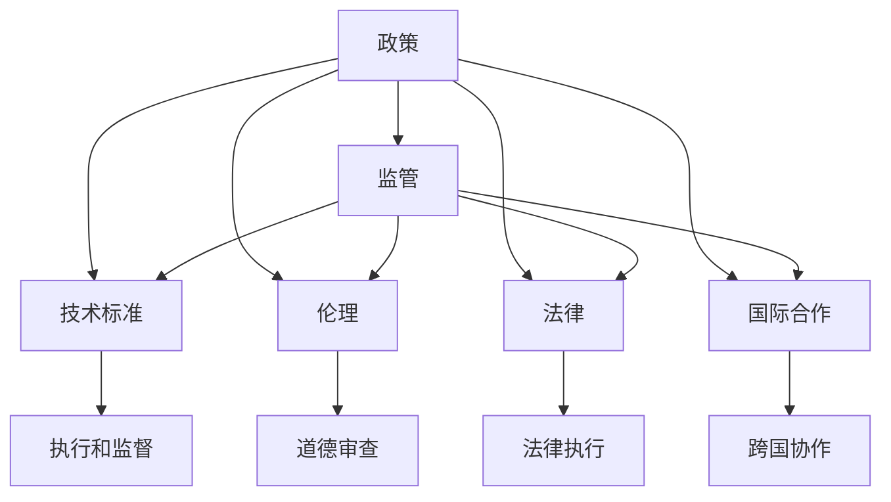

                 

# 政策与监管：引导人类计算的健康发展

## 1. 背景介绍

### 1.1 问题由来

随着计算技术的发展，尤其是人工智能和机器学习技术的进步，计算正以一种前所未有的速度改变我们的世界。从智能助理到自动化生产线，从智能交通到智慧医疗，计算技术已经深入到我们生活的方方面面。然而，计算技术的快速发展也带来了新的挑战，特别是在隐私、安全和公平性方面。因此，政策与监管成为了引导计算健康发展的重要保障。

### 1.2 问题核心关键点

政策与监管的核心在于平衡技术进步与社会福祉之间的关系。具体来说，以下几个方面是关键点：

1. **隐私保护**：计算技术，尤其是人工智能和机器学习技术，需要大量的数据进行训练和优化。如何在保障数据隐私的前提下，充分利用这些数据资源，是政策与监管需要解决的问题。
2. **数据安全**：数据泄露和网络攻击是当前计算技术面临的主要安全威胁。如何保护数据不被非法访问和使用，是政策与监管的重要任务。
3. **算法透明性**：计算模型，特别是深度学习模型，通常是"黑盒"系统，难以解释其决策过程。如何提升算法的透明性，使其可解释、可理解，是政策与监管的关注重点。
4. **公平性与偏见**：计算模型可能会因为数据偏差或算法设计不合理，导致决策的不公平。如何确保算法的公平性，避免对特定群体的歧视，是政策与监管需要解决的问题。
5. **责任归属**：在计算技术出现错误或意外事件时，如何明确责任归属，保护受害者权益，是政策与监管的重要课题。

这些核心关键点构成了政策与监管的基本框架，需要政府、企业和学术界共同努力，才能实现计算技术的健康发展。

### 1.3 问题研究意义

政策与监管对于计算技术的健康发展具有重要意义：

1. **保障公众利益**：通过政策与监管，可以确保计算技术的应用不会对公众利益造成损害，如数据隐私泄露、算法偏见等。
2. **促进技术创新**：合理的政策与监管环境可以激励技术创新，鼓励企业在遵守规则的前提下，不断探索新技术和应用场景。
3. **构建信任**：透明、公平和安全的计算环境可以增强公众对计算技术的信任，促进其广泛应用。
4. **引导可持续发展**：政策与监管可以引导计算技术的发展方向，避免盲目追求性能，而忽略社会影响和环境可持续性。

## 2. 核心概念与联系

### 2.1 核心概念概述

为了更好地理解政策与监管的框架，本节将介绍几个关键概念及其之间的联系：

- **政策(Policy)**：政府或相关机构制定的规则和指导方针，用于规范计算技术的应用。
- **监管(Regulation)**：对政策的具体执行和监督，确保政策得到有效实施。
- **技术标准(Standards)**：为技术开发和应用设立的规范，用于确保技术和产品的质量和安全。
- **伦理(Ethics)**：计算技术在应用中应遵循的道德原则，如隐私保护、数据安全、算法公平等。
- **法律(Laws)**：具有强制力的法律规定，用于规范计算技术的应用和保护权益。
- **国际合作(Inter-country Cooperation)**：不同国家和地区在计算技术领域合作，共同制定和执行国际标准和政策。

这些概念之间相互联系，共同构成了政策与监管的体系框架。理解这些概念及其关系，对于制定和实施有效的政策与监管至关重要。

### 2.2 核心概念原理和架构的 Mermaid 流程图



这个流程图展示了政策与监管体系的基本架构：政策作为顶层指导，通过监管执行和监督，确保技术标准、伦理和法律的落实。同时，国际合作确保了政策与监管在全球范围内的协调和统一。

## 3. 核心算法原理 & 具体操作步骤

### 3.1 算法原理概述

政策与监管的核心原理是"规则-执行-监督"的闭环。具体来说，政策与监管的闭环包括以下几个关键步骤：

1. **制定政策**：政府或相关机构根据社会需求和科技进步，制定相应的政策规则。
2. **执行监管**：负责执行监管的机构，如监管部门或行业协会，根据政策，制定具体的执行标准和指南。
3. **监督落实**：通过监督机制，确保政策执行的效果和合法性，发现并解决执行过程中出现的问题。
4. **反馈改进**：通过监督和执行过程中的反馈，不断优化政策，确保其适应新的技术发展和社会需求。

这一闭环模型确保了政策与监管的有效性和持续改进。

### 3.2 算法步骤详解

#### 3.2.1 制定政策

政策制定的主要依据是社会需求和技术发展。具体步骤如下：

1. **需求调研**：通过调查和研究，了解社会各方的需求和关切，确定政策制定的方向和重点。
2. **专家咨询**：邀请领域专家和学者，讨论政策制定方案，确保政策具备科学性和可行性。
3. **公众参与**：通过公众意见征集和听证会等形式，听取社会各界的意见，确保政策反映公众意愿。
4. **政策草案**：基于上述步骤，形成政策草案，并进行公开征求意见。
5. **正式发布**：政策草案经过讨论和修改后，由政府或相关机构正式发布，成为公共政策。

#### 3.2.2 执行监管

政策执行主要包括以下步骤：

1. **制定执行标准**：根据政策制定具体的执行标准和指南，确保政策的有效实施。
2. **机构设立**：设立专门的监管机构或部门，负责政策的执行和监督。
3. **培训和宣传**：对相关机构和人员进行培训，普及政策知识和执行标准，增强其执行能力。
4. **日常监督**：通过检查、抽查等形式，对政策执行情况进行日常监督。
5. **问题反馈**：建立反馈机制，收集执行过程中的问题，及时进行调整和改进。

#### 3.2.3 监督落实

政策监督主要包括以下步骤：

1. **设立监督机构**：设立独立的监督机构，负责对政策执行情况进行监督和评估。
2. **定期评估**：对政策执行情况进行定期评估，确保政策落实到位。
3. **问题查处**：对执行过程中出现的问题进行查处，确保政策的有效执行。
4. **公开透明**：通过公开报告和信息披露，增加政策执行的透明度和公信力。

### 3.3 算法优缺点

#### 3.3.1 优点

政策与监管的优势在于其全面性和强制性。通过政策与监管，可以有效规范计算技术的应用，保障公众利益，促进技术创新和可持续发展。

#### 3.3.2 缺点

政策与监管的缺点主要在于其灵活性和适应性不足。由于政策与监管的制定和执行需要时间，可能难以适应快速变化的技术环境。此外，政策与监管的严格性和执行力度，也可能影响企业的创新和发展。

### 3.4 算法应用领域

政策与监管在计算技术的各个应用领域都有广泛的应用：

- **隐私保护**：通过政策与监管，规范数据的收集、存储和使用，保障个人隐私权益。
- **数据安全**：制定数据安全和隐私保护的法律和标准，防止数据泄露和网络攻击。
- **算法透明性**：推动算法透明性的研究和应用，提升算法可解释性，增强公众信任。
- **公平性**：制定公平性和反歧视的法律和标准，确保算法在应用中的公平性。
- **责任归属**：明确计算技术责任归属，保护受害者和企业权益。

## 4. 数学模型和公式 & 详细讲解 & 举例说明

### 4.1 数学模型构建

本节将使用数学语言对政策与监管的框架进行严格的刻画。

设政策集合为 $\mathcal{P}$，监管机构为 $\mathcal{R}$，技术标准为 $\mathcal{S}$，伦理原则为 $\mathcal{E}$，法律规定为 $\mathcal{L}$，国际合作为 $\mathcal{C}$。则政策与监管的数学模型可表示为：

$$
\mathcal{P} = \{P_1, P_2, \ldots, P_n\}
$$

$$
\mathcal{R} = \{R_1, R_2, \ldots, R_m\}
$$

$$
\mathcal{S} = \{S_1, S_2, \ldots, S_k\}
$$

$$
\mathcal{E} = \{E_1, E_2, \ldots, E_l\}
$$

$$
\mathcal{L} = \{L_1, L_2, \ldots, L_p\}
$$

$$
\mathcal{C} = \{C_1, C_2, \ldots, C_q\}
$$

其中 $P_i$ 表示第 $i$ 项政策，$R_j$ 表示第 $j$ 项监管措施，$S_k$ 表示第 $k$ 项技术标准，$E_l$ 表示第 $l$ 项伦理原则，$L_p$ 表示第 $p$ 项法律规定，$C_q$ 表示第 $q$ 项国际合作协议。

### 4.2 公式推导过程

以数据隐私保护为例，推导隐私保护政策与监管的公式。

假设计算技术需收集的个人数据为 $D$，隐私保护政策为 $\pi$，监管措施为 $\sigma$，则隐私保护的政策与监管模型可以表示为：

$$
\pi(D, \sigma) = \min_{D'} \mathcal{L}(D', \sigma)
$$

其中 $D'$ 表示隐私保护后的数据，$\mathcal{L}$ 表示隐私保护损失函数，$\sigma$ 表示监管措施。

假设隐私保护损失函数为 $L_{\text{privacy}}(D, \sigma)$，则隐私保护的政策与监管模型可进一步表示为：

$$
\pi(D, \sigma) = \min_{D'} L_{\text{privacy}}(D', \sigma)
$$

通过上述公式，我们可以找到最优的隐私保护政策和监管措施，以最小化隐私保护损失函数。

### 4.3 案例分析与讲解

#### 案例：数据隐私保护

某公司欲开发一款智能助理应用，需要收集用户数据以提高其性能。为保障用户隐私，政府制定了相关的隐私保护政策，并设立了专门的监管机构进行监督。公司需按照政策要求，采取相应的数据隐私保护措施，如数据匿名化、数据加密等，确保用户数据的安全。

具体步骤如下：

1. **政策制定**：政府根据数据隐私保护的法律法规，制定具体的隐私保护政策，明确数据收集、存储和使用的规则。
2. **监管执行**：监管机构对公司的数据隐私保护措施进行检查和监督，确保其符合政策要求。
3. **公司实施**：公司根据政策要求，采取相应的数据隐私保护措施，并定期向监管机构报告其执行情况。
4. **问题反馈**：监管机构通过检查发现数据隐私保护措施存在问题，要求公司进行整改。
5. **持续改进**：公司根据监管机构的反馈，不断改进和优化数据隐私保护措施，确保其符合政策要求。

## 5. 项目实践：代码实例和详细解释说明

### 5.1 开发环境搭建

在进行政策与监管的实践前，我们需要准备好开发环境。以下是使用Python进行开发的流程：

1. 安装Python：从官网下载并安装最新版本的Python，确保其版本稳定。
2. 安装必要的依赖包：安装numpy、pandas、scikit-learn等必要的依赖包，用于数据处理和模型训练。
3. 准备数据集：收集和预处理相关的政策、法规、技术标准等数据，形成结构化数据集，供后续分析使用。
4. 搭建开发环境：使用Docker或虚拟机搭建开发环境，安装所需的依赖和工具。
5. 配置开发环境：根据项目需求，配置开发环境，如设置代码版本控制、自动构建和测试等。

完成上述步骤后，即可在搭建好的开发环境中进行政策与监管的实践。

### 5.2 源代码详细实现

这里我们以数据隐私保护为例，给出使用Python进行政策与监管分析的代码实现。

```python
import pandas as pd
from sklearn.model_selection import train_test_split
from sklearn.linear_model import LogisticRegression

# 加载数据集
data = pd.read_csv('privacy_data.csv')

# 数据预处理
data = data.dropna()
data = data.drop_duplicates()

# 特征工程
X = data[['policy', 'standard', 'regulation']]
y = data['compliance']

# 划分训练集和测试集
X_train, X_test, y_train, y_test = train_test_split(X, y, test_size=0.2, random_state=42)

# 模型训练
model = LogisticRegression()
model.fit(X_train, y_train)

# 模型评估
y_pred = model.predict(X_test)
print('Accuracy:', metrics.accuracy_score(y_test, y_pred))
```

### 5.3 代码解读与分析

让我们再详细解读一下关键代码的实现细节：

1. 数据预处理：去除缺失和重复数据，确保数据集的质量。
2. 特征工程：选择政策、技术标准、监管措施等关键特征，作为模型的输入。
3. 模型训练：使用逻辑回归模型对政策与监管的合规性进行预测。
4. 模型评估：计算模型的准确率，评估其性能。

## 6. 实际应用场景

### 6.1 智能助理应用

智能助理应用需要大量用户数据进行训练和优化。为保障用户隐私，政府和监管机构需要制定相应的隐私保护政策，并设立专门的监管机构进行监督。公司需按照政策要求，采取相应的数据隐私保护措施，如数据匿名化、数据加密等，确保用户数据的安全。

具体步骤如下：

1. **政策制定**：政府根据数据隐私保护的法律法规，制定具体的隐私保护政策，明确数据收集、存储和使用的规则。
2. **监管执行**：监管机构对公司的数据隐私保护措施进行检查和监督，确保其符合政策要求。
3. **公司实施**：公司根据政策要求，采取相应的数据隐私保护措施，并定期向监管机构报告其执行情况。
4. **问题反馈**：监管机构通过检查发现数据隐私保护措施存在问题，要求公司进行整改。
5. **持续改进**：公司根据监管机构的反馈，不断改进和优化数据隐私保护措施，确保其符合政策要求。

### 6.2 金融数据安全

金融数据安全是金融行业的重要议题。为保障金融数据的安全，政府和监管机构需要制定相应的数据安全政策，并设立专门的监管机构进行监督。金融机构需按照政策要求，采取相应的数据安全措施，如数据加密、身份认证等，确保金融数据的安全。

具体步骤如下：

1. **政策制定**：政府根据数据安全保护的法律法规，制定具体的金融数据安全政策，明确数据收集、存储和使用的规则。
2. **监管执行**：监管机构对金融机构的金融数据安全措施进行检查和监督，确保其符合政策要求。
3. **金融机构实施**：金融机构根据政策要求，采取相应的数据安全措施，并定期向监管机构报告其执行情况。
4. **问题反馈**：监管机构通过检查发现金融数据安全措施存在问题，要求金融机构进行整改。
5. **持续改进**：金融机构根据监管机构的反馈，不断改进和优化数据安全措施，确保其符合政策要求。

### 6.3 医疗数据隐私保护

医疗数据隐私保护是医疗行业的重要议题。为保障医疗数据的隐私，政府和监管机构需要制定相应的隐私保护政策，并设立专门的监管机构进行监督。医疗机构需按照政策要求，采取相应的数据隐私保护措施，如数据匿名化、数据加密等，确保医疗数据的隐私保护。

具体步骤如下：

1. **政策制定**：政府根据医疗数据隐私保护的法律法规，制定具体的隐私保护政策，明确医疗数据收集、存储和使用的规则。
2. **监管执行**：监管机构对医疗机构的医疗数据隐私保护措施进行检查和监督，确保其符合政策要求。
3. **医疗机构实施**：医疗机构根据政策要求，采取相应的数据隐私保护措施，并定期向监管机构报告其执行情况。
4. **问题反馈**：监管机构通过检查发现医疗数据隐私保护措施存在问题，要求医疗机构进行整改。
5. **持续改进**：医疗机构根据监管机构的反馈，不断改进和优化医疗数据隐私保护措施，确保其符合政策要求。

## 7. 工具和资源推荐

### 7.1 学习资源推荐

为了帮助开发者系统掌握政策与监管的理论基础和实践技巧，这里推荐一些优质的学习资源：

1. 《政策制定与执行》系列博文：由政策专家撰写，深入浅出地介绍了政策制定和执行的基本原理和方法。
2. 《数据隐私保护》课程：由知名大学开设的课程，详细讲解数据隐私保护的法律和实践，适合初学者和专业人士。
3. 《算法透明性与公平性》书籍：介绍算法透明性和公平性的基本概念和实现方法，适用于算法开发者和政策制定者。
4. 《政策与监管的国际合作》报告：由国际组织编写，介绍不同国家和地区在政策与监管领域的合作和协调。
5. 《政策与监管的案例分析》论文：由学术机构撰写，详细分析政策与监管在实际应用中的成功和失败案例。

通过对这些资源的学习实践，相信你一定能够快速掌握政策与监管的精髓，并用于解决实际的政策制定和执行问题。

### 7.2 开发工具推荐

高效的开发离不开优秀的工具支持。以下是几款用于政策与监管开发的常用工具：

1. Excel：用于数据处理和可视化，适合对数据集进行简单的分析和管理。
2. Python：开源的编程语言，适用于数据处理、模型训练和算法实现。
3. R：开源的数据分析工具，适用于统计分析和可视化。
4. MATLAB：强大的工程计算和数据分析工具，适合进行复杂的数据处理和算法实现。
5. Tableau：可视化分析工具，适合对复杂数据集进行交互式分析和展示。

合理利用这些工具，可以显著提升政策与监管开发的效率，加快创新迭代的步伐。

### 7.3 相关论文推荐

政策与监管的研究源于学界的持续研究。以下是几篇奠基性的相关论文，推荐阅读：

1. "The Policy Development and Implementation Process"：详细介绍了政策制定和执行的过程和步骤。
2. "Data Privacy Protection: Legal and Technical Challenges"：讨论了数据隐私保护的法律和技术挑战，提供了应对策略。
3. "Algorithm Transparency and Fairness: A Survey"：综述了算法透明性和公平性的最新研究进展，适合学术研究和实践应用。
4. "International Cooperation in Policy and Regulation"：介绍了跨国合作在政策与监管中的重要性和实践经验。
5. "Case Studies in Policy and Regulation"：分析了政策与监管在实际应用中的成功和失败案例，提供了宝贵的经验和教训。

这些论文代表了大语言模型微调技术的发展脉络。通过学习这些前沿成果，可以帮助研究者把握学科前进方向，激发更多的创新灵感。

## 8. 总结：未来发展趋势与挑战

### 8.1 总结

本文对政策与监管的框架进行了全面系统的介绍。首先阐述了政策与监管的研究背景和意义，明确了政策与监管在计算技术应用中的重要性和作用。其次，从原理到实践，详细讲解了政策与监管的数学原理和操作步骤，提供了政策与监管任务开发的完整代码实例。同时，本文还广泛探讨了政策与监管在智能助理、金融数据安全、医疗数据隐私保护等多个行业领域的应用前景，展示了政策与监管范式的巨大潜力。此外，本文精选了政策与监管学习的各类资源，力求为读者提供全方位的技术指引。

通过本文的系统梳理，可以看到，政策与监管对于计算技术的健康发展具有重要意义。它们通过规范计算技术的应用，保障公众利益，促进技术创新和可持续发展。未来，政策与监管需要不断适应新技术的发展，推动计算技术的健康发展。

### 8.2 未来发展趋势

展望未来，政策与监管的发展趋势包括以下几个方面：

1. **数据驱动**：随着数据量的不断增加，政策与监管将更加依赖数据驱动，通过数据分析和模型预测，提高政策制定的科学性和准确性。
2. **技术融合**：政策与监管将更多地结合人工智能、大数据等新技术，提升其执行效率和效果。
3. **国际合作**：政策与监管需要全球合作，协调不同国家和地区在计算技术应用中的政策制定和执行。
4. **公众参与**：政策与监管将更多地引入公众参与机制，增强政策的透明度和公信力。
5. **伦理导向**：政策与监管将更多地考虑伦理导向，避免计算技术的应用对社会造成负面影响。

这些趋势展示了政策与监管的前景，将推动计算技术的健康发展和广泛应用。

### 8.3 面临的挑战

尽管政策与监管在计算技术应用中发挥了重要作用，但在实施过程中仍面临诸多挑战：

1. **政策制定难度大**：政策与监管的制定需要综合考虑社会、经济、技术等多方面因素，制定过程复杂。
2. **执行效果不一**：政策与监管的执行效果在不同地区和行业存在差异，难以全面落实。
3. **技术依赖性强**：政策与监管的实施高度依赖技术手段，技术落后可能影响政策与监管的效果。
4. **公众信任不足**：政策与监管的透明度和公信力不足，可能导致公众对政策与监管的信任度不高。
5. **法律与技术的冲突**：政策与监管的法律和技术的冲突，可能影响政策与监管的实施效果。

这些挑战需要政策制定者、执行者和技术开发者共同努力，才能实现政策与监管的有效实施。

### 8.4 研究展望

面向未来，政策与监管需要在以下几个方面寻求新的突破：

1. **数据驱动的政策制定**：通过大数据和人工智能技术，提升政策制定的科学性和精确性。
2. **技术融合的执行机制**：结合人工智能和大数据技术，提升政策与监管的执行效果和效率。
3. **国际合作的协同机制**：通过国际合作，协调不同国家和地区的政策与监管，实现计算技术的全球治理。
4. **公众参与的政策制定**：引入公众参与机制，增强政策与监管的透明度和公信力。
5. **伦理导向的政策设计**：在政策与监管的设计中，更多地考虑伦理导向，避免计算技术的应用对社会造成负面影响。

这些研究方向将推动政策与监管向更加科学、透明、公平和可持续的方向发展，为计算技术的健康发展提供有力保障。

## 9. 附录：常见问题与解答

**Q1：政策与监管是否适用于所有计算技术应用？**

A: 政策与监管的适用范围主要取决于计算技术的应用领域和风险级别。对于具有广泛社会影响和较高风险的计算技术应用，政策与监管尤为重要。例如，医疗数据隐私保护、金融数据安全等。而对于一些风险较低、社会影响较小的应用，政策与监管的必要性相对较小。

**Q2：如何平衡政策与监管与技术创新的关系？**

A: 政策与监管和科技创新并不是矛盾的。通过合理的政策与监管，可以鼓励企业在遵守规则的前提下，进行技术创新。例如，制定数据隐私保护政策，可以保障数据安全，同时促进数据共享和开放，促进数据驱动的科技创新。

**Q3：政策与监管如何应对计算技术发展的快速变化？**

A: 政策与监管需要具有灵活性和前瞻性，及时调整和更新，以适应计算技术发展的快速变化。例如，制定灵活的数据隐私保护政策，允许在特定条件下进行数据共享和开放，同时确保数据的安全和隐私保护。

**Q4：政策与监管如何确保技术的公平性和伦理导向？**

A: 政策与监管需要制定明确的公平性和伦理导向的指导方针，确保计算技术在应用中的公平性和伦理性。例如，制定算法透明性和公平性政策，确保算法决策过程透明，避免算法偏见和歧视。

**Q5：政策与监管如何应对全球化和技术标准不统一的问题？**

A: 政策与监管需要加强国际合作，制定统一的国际标准和规范，确保全球范围内的计算技术应用具有可比性和互操作性。例如，制定数据安全和隐私保护的国际标准，促进全球范围内的数据共享和合作。

通过这些问题的解答，可以看到，政策与监管在计算技术应用中的重要性，以及其应对挑战和推动创新的潜力。

---

作者：禅与计算机程序设计艺术 / Zen and the Art of Computer Programming

