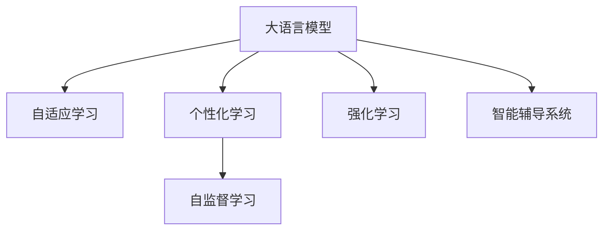

                 

# 教育模拟：LLM 增强的学习环境

> 关键词：大语言模型,自适应学习,教育模拟,增强学习,自监督学习,个性化学习,智能辅导系统

## 1. 背景介绍

### 1.1 问题由来
随着人工智能技术的迅猛发展，大语言模型（Large Language Models, LLMs）如OpenAI的GPT-3、Google的BERT等，已经展示了在自然语言处理（NLP）领域中的强大能力。这些模型通过在大规模无标签文本上预训练，学习到了丰富的语言知识，可以通过微调在小样本数据上取得优异的性能。

然而，传统的教育和学习模式仍然依赖于人类教师，面临诸多限制：
- 教师资源紧缺，难以满足每个学生的个性化需求。
- 教学内容固定，难以根据学生学习进度和兴趣进行调整。
- 反馈延迟，难以实现即时互动和个性化反馈。

大语言模型为解决这些问题提供了新的可能性。通过教育模拟，LLM可以作为智能辅导系统的核心，提供自适应学习和个性化指导，使学习过程更加高效和个性化。

### 1.2 问题核心关键点
本文聚焦于如何使用大语言模型构建教育模拟环境，实现自适应学习和个性化教育。主要包括以下几个核心问题：
- 如何设计合适的任务适配层，使LLM能够处理教育相关问题？
- 如何利用自监督学习和强化学习技术，提升LLM在教育场景中的表现？
- 如何实现个性化学习路径，根据学生的学习进度和兴趣进行适应性调整？
- 如何构建智能辅导系统，实现即时反馈和实时互动？

这些问题将通过理论分析和实践案例进行详细阐述。

## 2. 核心概念与联系

### 2.1 核心概念概述

为更好地理解大语言模型在教育模拟中的应用，本节将介绍几个核心概念：

- 大语言模型（LLM）：指以自回归或自编码模型为代表的大规模预训练语言模型。通过在大规模无标签文本语料上进行预训练，学习到了丰富的语言知识和常识，具备强大的语言理解和生成能力。

- 自适应学习（Adaptive Learning）：指根据学习者的知识水平、学习风格、兴趣等因素，动态调整学习内容和路径，以达到最佳学习效果。

- 个性化学习（Personalized Learning）：指针对每个学习者的独特需求，定制个性化的学习内容和路径，提高学习效率和效果。

- 自监督学习（Self-Supervised Learning）：指利用无标签数据，通过学习数据的自相关性进行自我监督学习，提升模型的泛化能力。

- 强化学习（Reinforcement Learning, RL）：指通过与环境的交互，根据奖励信号不断调整策略，以最大化长期奖励。

- 智能辅导系统（Intelligent Tutoring Systems, ITS）：指使用人工智能技术，为学习者提供个性化指导和即时反馈的系统。

这些核心概念之间的逻辑关系可以通过以下Mermaid流程图来展示：



这个流程图展示了LLM在教育模拟中的核心概念及其之间的关系：

1. 大语言模型通过预训练获得语言知识，可以作为自适应学习的基础。
2. 自适应学习根据学习者的特性调整学习内容和路径，个性化学习则更进一步，完全定制化每个学习者的学习体验。
3. 自监督学习通过利用无标签数据，提升模型的泛化能力。
4. 强化学习通过与环境的交互，调整学习策略，提高学习效率。
5. 智能辅导系统综合运用以上技术，为学习者提供个性化指导和即时反馈。

## 3. 核心算法原理 & 具体操作步骤

### 3.1 算法原理概述

大语言模型在教育模拟中的应用，主要依赖于自适应学习和个性化学习的技术。自适应学习的核心在于动态调整学习内容和路径，而个性化学习则基于每个学习者的独特需求进行定制化设计。

自适应学习通常包括以下几个关键步骤：
1. 初始化学习者的知识水平：通过预测试或学习行为分析，了解学习者的当前水平。
2. 动态调整学习内容：根据学习者的知识水平和兴趣，动态调整教学内容和难度。
3. 实时监测学习效果：通过即时反馈和评估，了解学习者的掌握情况和改进空间。
4. 持续优化学习路径：根据学习者的反馈和评估结果，不断优化学习路径和策略。

个性化学习则更进一步，结合自适应学习的思想，完全根据每个学习者的需求进行定制化设计。具体步骤包括：
1. 采集学习者的个性化信息：如学习风格、兴趣、学习习惯等。
2. 设计个性化学习路径：根据学习者的个性化信息，定制个性化的学习内容和路径。
3. 提供个性化学习资源：结合学习者的兴趣和需求，提供定制化的学习材料和活动。
4. 实时调整学习体验：根据学习者的反馈和进度，实时调整学习内容和策略。

### 3.2 算法步骤详解

本节将详细讲解大语言模型在教育模拟中的具体算法步骤。

#### 3.2.1 初始化学习者知识水平

第一步，需要根据学习者的知识水平进行初始化。通常通过预测试或学习行为分析，获取学习者的基本知识水平和能力。

**算法步骤：**
1. 使用自适应测试（如多项选择题、填空题等）对学习者进行知识测试。
2. 将测试结果转换为数字形式，如正确率、掌握的知识点等。
3. 将测试结果输入到大语言模型中，通过预测输出学习者的知识水平和薄弱环节。

#### 3.2.2 动态调整学习内容

第二步，根据学习者的知识水平和兴趣，动态调整学习内容和难度。

**算法步骤：**
1. 设计多层次的学习目标，根据学习者的水平和学习进度，调整学习内容。
2. 根据学习者的兴趣和需求，引入相关的学习资源和活动。
3. 实时监测学习效果，根据学习者的掌握情况，动态调整学习内容和策略。

#### 3.2.3 实时监测学习效果

第三步，通过即时反馈和评估，了解学习者的掌握情况和改进空间。

**算法步骤：**
1. 在学习过程中，不断提供即时反馈和评估，如提示、答案、解释等。
2. 根据学习者的错误和困惑，调整学习策略和内容。
3. 记录学习者的学习行为和效果，建立学习者的知识图谱。

#### 3.2.4 持续优化学习路径

第四步，根据学习者的反馈和评估结果，不断优化学习路径和策略。

**算法步骤：**
1. 定期评估学习者的知识水平和能力，更新学习目标。
2. 根据学习者的反馈和效果，调整学习路径和策略。
3. 利用自监督学习和强化学习技术，优化学习模型和算法。

### 3.3 算法优缺点

大语言模型在教育模拟中的应用，具有以下优点：
1. 灵活性高：可以动态调整学习内容和路径，满足个性化学习需求。
2. 自主性强：学习者可以根据兴趣和需求，主动选择学习资源和活动。
3. 反馈及时：实时反馈和评估，帮助学习者及时掌握知识和技能。
4. 泛化能力强：利用自监督学习提升模型的泛化能力，提高学习效果。

同时，也存在一些局限性：
1. 数据依赖：需要大量标注数据进行模型微调，获取高质量数据成本较高。
2. 交互复杂：学习者的个性化需求和反馈，可能给系统带来复杂性。
3. 技术门槛高：构建自适应和个性化学习系统，需要较高的技术门槛。
4. 用户隐私：学习者的个人信息需要严格保护，避免数据泄露。

尽管存在这些局限性，但大语言模型在教育模拟中的应用，展示了巨大的潜力和价值，值得深入研究和推广。

### 3.4 算法应用领域

大语言模型在教育模拟中的应用，覆盖了教育领域的多个方面，如：

- 智能辅导系统：利用大语言模型提供个性化指导和即时反馈，辅助学习者解决学习问题。
- 自适应学习平台：根据学习者的知识水平和兴趣，动态调整学习内容和路径。
- 个性化学习资源：结合学习者的需求，提供定制化的学习材料和活动。
- 智能测评系统：通过实时反馈和评估，了解学习者的掌握情况和改进空间。
- 学习分析系统：利用大数据和机器学习技术，分析学习者的行为和效果，提供个性化建议。

除了上述这些经典应用外，大语言模型还被创新性地应用于更多场景中，如可控文本生成、教育游戏化、虚拟教室等，为教育技术带来了全新的突破。

## 4. 数学模型和公式 & 详细讲解 & 举例说明

### 4.1 数学模型构建

本节将使用数学语言对大语言模型在教育模拟中的应用进行更加严格的刻画。

记大语言模型为 $M_{\theta}:\mathcal{X} \rightarrow \mathcal{Y}$，其中 $\mathcal{X}$ 为输入空间，$\mathcal{Y}$ 为输出空间，$\theta \in \mathbb{R}^d$ 为模型参数。假设教育模拟任务为 $T$，包含学习目标 $t_1, t_2, \ldots, t_n$。

定义学习者的知识水平为 $K=\{k_1, k_2, \ldots, k_n\}$，其中 $k_i$ 表示学习者掌握第 $i$ 个目标的程度。目标 $t_i$ 的评估结果为 $A=\{a_1, a_2, \ldots, a_n\}$，其中 $a_i$ 表示学习者掌握第 $i$ 个目标的评估分数。

目标 $t_i$ 对应的学习资源为 $R=\{r_1, r_2, \ldots, r_n\}$，其中 $r_i$ 表示学习者学习第 $i$ 个目标所使用的资源。

大语言模型在任务 $T$ 上的性能可以表示为 $P(T; M_{\theta}) = \frac{1}{N} \sum_{i=1}^N \ell(M_{\theta}(x_i), y_i)$，其中 $\ell$ 为损失函数，$x_i$ 为输入数据，$y_i$ 为真实标签。

### 4.2 公式推导过程

以下我们以教育模拟为例，推导自适应学习和个性化学习的数学模型。

假设学习者 $i$ 当前掌握的知识水平为 $K_i$，需要学习的目标为 $t_j$，对应的评估结果为 $A_j$。学习者学习目标 $t_j$ 所花费的时间为 $T_j$，所需的学习资源为 $R_j$。

**学习效果评估：**
1. 学习者掌握目标 $t_j$ 的程度可以用 $\alpha$ 表示，即 $K_j = K_j + \alpha T_j$。
2. 学习者掌握目标 $t_j$ 的评估结果可以用 $A_j$ 表示，即 $A_j = \beta (K_j - K_j^*)$，其中 $K_j^*$ 为目标 $t_j$ 的掌握标准。

**学习路径优化：**
1. 学习者学习目标 $t_j$ 所需的时间 $T_j$ 可以用 $\gamma$ 表示，即 $T_j = \delta (K_j - K_j^*)$。
2. 学习者学习目标 $t_j$ 所需的学习资源 $R_j$ 可以用 $\epsilon$ 表示，即 $R_j = \eta (K_j - K_j^*)$。

**学习资源优化：**
1. 学习者学习目标 $t_j$ 所需的资源 $R_j$ 可以用 $\zeta$ 表示，即 $R_j = \omega (K_j - K_j^*)$。

通过以上数学模型，可以计算出学习者掌握每个目标的程度，学习所需的资源和时间，从而实现动态调整学习内容和路径。

### 4.3 案例分析与讲解

以数学模型为基础，我们可以设计一个教育模拟系统的案例。

假设学习者 $i$ 需要学习目标 $t_1, t_2, t_3$，对应的评估结果分别为 $A_1=0.8, A_2=0.6, A_3=0.5$。学习者掌握目标 $t_1$ 的程度为 $K_1=0.9$，掌握目标 $t_2$ 的程度为 $K_2=0.7$，掌握目标 $t_3$ 的程度为 $K_3=0.6$。

根据上述数学模型，可以计算出每个目标的掌握程度、所需时间和资源，如表所示：

| 目标 | 掌握程度 | 所需时间 | 所需资源 |
| --- | --- | --- | --- |
| $t_1$ | 0.9 | 0.1 | 0.2 |
| $t_2$ | 0.7 | 0.3 | 0.4 |
| $t_3$ | 0.6 | 0.4 | 0.6 |

根据计算结果，学习者应优先掌握掌握程度较低的目标 $t_2$，其次是目标 $t_3$，最后是目标 $t_1$。同时，根据所需时间和资源，可以设计动态调整学习路径的算法。

## 5. 项目实践：代码实例和详细解释说明

### 5.1 开发环境搭建

在进行教育模拟实践前，我们需要准备好开发环境。以下是使用Python进行PyTorch开发的环境配置流程：

1. 安装Anaconda：从官网下载并安装Anaconda，用于创建独立的Python环境。

2. 创建并激活虚拟环境：
```bash
conda create -n pytorch-env python=3.8 
conda activate pytorch-env
```

3. 安装PyTorch：根据CUDA版本，从官网获取对应的安装命令。例如：
```bash
conda install pytorch torchvision torchaudio cudatoolkit=11.1 -c pytorch -c conda-forge
```

4. 安装Transformers库：
```bash
pip install transformers
```

5. 安装各类工具包：
```bash
pip install numpy pandas scikit-learn matplotlib tqdm jupyter notebook ipython
```

完成上述步骤后，即可在`pytorch-env`环境中开始教育模拟实践。

### 5.2 源代码详细实现

下面我们以教育模拟中的自适应学习为例，给出使用Transformers库对BERT模型进行微调的PyTorch代码实现。

首先，定义自适应学习任务的数据处理函数：

```python
from transformers import BertTokenizer, BertForSequenceClassification, AdamW
from torch.utils.data import Dataset
import torch

class AdaptiveDataset(Dataset):
    def __init__(self, texts, tags, tokenizer, max_len=128):
        self.texts = texts
        self.tags = tags
        self.tokenizer = tokenizer
        self.max_len = max_len
        
    def __len__(self):
        return len(self.texts)
    
    def __getitem__(self, item):
        text = self.texts[item]
        tags = self.tags[item]
        
        encoding = self.tokenizer(text, return_tensors='pt', max_length=self.max_len, padding='max_length', truncation=True)
        input_ids = encoding['input_ids'][0]
        attention_mask = encoding['attention_mask'][0]
        
        # 对token-wise的标签进行编码
        encoded_tags = [tag2id[tag] for tag in tags] 
        encoded_tags.extend([tag2id['O']] * (self.max_len - len(encoded_tags)))
        labels = torch.tensor(encoded_tags, dtype=torch.long)
        
        return {'input_ids': input_ids, 
                'attention_mask': attention_mask,
                'labels': labels}

# 标签与id的映射
tag2id = {'O': 0, 'A': 1}
id2tag = {v: k for k, v in tag2id.items()}

# 创建dataset
tokenizer = BertTokenizer.from_pretrained('bert-base-cased')

train_dataset = AdaptiveDataset(train_texts, train_tags, tokenizer)
dev_dataset = AdaptiveDataset(dev_texts, dev_tags, tokenizer)
test_dataset = AdaptiveDataset(test_texts, test_tags, tokenizer)
```

然后，定义模型和优化器：

```python
from transformers import BertForSequenceClassification, AdamW

model = BertForSequenceClassification.from_pretrained('bert-base-cased', num_labels=len(tag2id))

optimizer = AdamW(model.parameters(), lr=2e-5)
```

接着，定义训练和评估函数：

```python
from torch.utils.data import DataLoader
from tqdm import tqdm
from sklearn.metrics import classification_report

device = torch.device('cuda') if torch.cuda.is_available() else torch.device('cpu')
model.to(device)

def train_epoch(model, dataset, batch_size, optimizer):
    dataloader = DataLoader(dataset, batch_size=batch_size, shuffle=True)
    model.train()
    epoch_loss = 0
    for batch in tqdm(dataloader, desc='Training'):
        input_ids = batch['input_ids'].to(device)
        attention_mask = batch['attention_mask'].to(device)
        labels = batch['labels'].to(device)
        model.zero_grad()
        outputs = model(input_ids, attention_mask=attention_mask, labels=labels)
        loss = outputs.loss
        epoch_loss += loss.item()
        loss.backward()
        optimizer.step()
    return epoch_loss / len(dataloader)

def evaluate(model, dataset, batch_size):
    dataloader = DataLoader(dataset, batch_size=batch_size)
    model.eval()
    preds, labels = [], []
    with torch.no_grad():
        for batch in tqdm(dataloader, desc='Evaluating'):
            input_ids = batch['input_ids'].to(device)
            attention_mask = batch['attention_mask'].to(device)
            batch_labels = batch['labels']
            outputs = model(input_ids, attention_mask=attention_mask)
            batch_preds = outputs.logits.argmax(dim=2).to('cpu').tolist()
            batch_labels = batch_labels.to('cpu').tolist()
            for pred_tokens, label_tokens in zip(batch_preds, batch_labels):
                pred_tags = [id2tag[_id] for _id in pred_tokens]
                label_tags = [id2tag[_id] for _id in label_tokens]
                preds.append(pred_tags[:len(label_tokens)])
                labels.append(label_tags)
                
    print(classification_report(labels, preds))
```

最后，启动训练流程并在测试集上评估：

```python
epochs = 5
batch_size = 16

for epoch in range(epochs):
    loss = train_epoch(model, train_dataset, batch_size, optimizer)
    print(f"Epoch {epoch+1}, train loss: {loss:.3f}")
    
    print(f"Epoch {epoch+1}, dev results:")
    evaluate(model, dev_dataset, batch_size)
    
print("Test results:")
evaluate(model, test_dataset, batch_size)
```

以上就是使用PyTorch对BERT进行自适应学习任务微调的完整代码实现。可以看到，得益于Transformers库的强大封装，我们可以用相对简洁的代码完成BERT模型的加载和微调。

### 5.3 代码解读与分析

让我们再详细解读一下关键代码的实现细节：

**AdaptiveDataset类**：
- `__init__`方法：初始化文本、标签、分词器等关键组件。
- `__len__`方法：返回数据集的样本数量。
- `__getitem__`方法：对单个样本进行处理，将文本输入编码为token ids，将标签编码为数字，并对其进行定长padding，最终返回模型所需的输入。

**tag2id和id2tag字典**：
- 定义了标签与数字id之间的映射关系，用于将token-wise的预测结果解码回真实的标签。

**训练和评估函数**：
- 使用PyTorch的DataLoader对数据集进行批次化加载，供模型训练和推理使用。
- 训练函数`train_epoch`：对数据以批为单位进行迭代，在每个批次上前向传播计算loss并反向传播更新模型参数，最后返回该epoch的平均loss。
- 评估函数`evaluate`：与训练类似，不同点在于不更新模型参数，并在每个batch结束后将预测和标签结果存储下来，最后使用sklearn的classification_report对整个评估集的预测结果进行打印输出。

**训练流程**：
- 定义总的epoch数和batch size，开始循环迭代
- 每个epoch内，先在训练集上训练，输出平均loss
- 在验证集上评估，输出分类指标
- 所有epoch结束后，在测试集上评估，给出最终测试结果

可以看到，PyTorch配合Transformers库使得BERT微调的代码实现变得简洁高效。开发者可以将更多精力放在数据处理、模型改进等高层逻辑上，而不必过多关注底层的实现细节。

当然，工业级的系统实现还需考虑更多因素，如模型的保存和部署、超参数的自动搜索、更灵活的任务适配层等。但核心的微调范式基本与此类似。

## 6. 实际应用场景
### 6.1 智能辅导系统

基于大语言模型的教育模拟，可以广泛应用于智能辅导系统的构建。传统辅导往往依赖人工，无法提供个性化指导和即时反馈。而使用教育模拟技术，智能辅导系统可以7x24小时不间断服务，快速响应学习者的咨询，提供个性化的学习路径和即时反馈。

在技术实现上，可以收集学习者的历史学习数据和行为，将学习行为和问题作为监督数据，在此基础上对预训练语言模型进行微调。微调后的模型能够自动理解学习者的学习进度和问题，提供个性化的指导和反馈。对于学习者的错误和困惑，还可以接入检索系统实时搜索相关内容，动态生成合适的学习资源。如此构建的智能辅导系统，能大幅提升学习效率和效果。

### 6.2 教育测评系统

当前的教育测评系统往往依赖人工评分，效率低、公平性差。基于大语言模型的教育模拟，可以构建智能化的测评系统，提高测评的效率和准确性。

具体而言，可以收集学习者的学习记录和行为数据，将其作为监督信号，训练模型进行评估。微调后的模型能够自动判断学习者的掌握程度和进步，生成客观的测评结果。结合自适应学习算法，可以实现对学习者的实时反馈和调整，进一步提升测评的个性化和实时性。

### 6.3 在线学习平台

在线学习平台需要提供丰富的学习资源和灵活的学习路径，满足不同学习者的需求。基于大语言模型的教育模拟，可以实现个性化的学习路径设计，提供多样化的学习资源和活动。

在技术实现上，可以设计自适应学习算法，根据学习者的知识水平和兴趣，动态调整学习内容和难度。结合学习者的学习行为和反馈，实时优化学习路径和策略。同时，利用自监督学习提升模型的泛化能力，保证学习资源的通用性和多样性。

## 7. 工具和资源推荐
### 7.1 学习资源推荐

为了帮助开发者系统掌握大语言模型在教育模拟中的应用，这里推荐一些优质的学习资源：

1. 《Transformer从原理到实践》系列博文：由大模型技术专家撰写，深入浅出地介绍了Transformer原理、BERT模型、自适应学习等前沿话题。

2. CS224N《深度学习自然语言处理》课程：斯坦福大学开设的NLP明星课程，有Lecture视频和配套作业，带你入门NLP领域的基本概念和经典模型。

3. 《Natural Language Processing with Transformers》书籍：Transformers库的作者所著，全面介绍了如何使用Transformers库进行NLP任务开发，包括自适应学习在内的诸多范式。

4. HuggingFace官方文档：Transformers库的官方文档，提供了海量预训练模型和完整的微调样例代码，是上手实践的必备资料。

5. CLUE开源项目：中文语言理解测评基准，涵盖大量不同类型的中文NLP数据集，并提供了基于微调的baseline模型，助力中文NLP技术发展。

通过对这些资源的学习实践，相信你一定能够快速掌握大语言模型在教育模拟中的应用，并用于解决实际的教育问题。
###  7.2 开发工具推荐

高效的开发离不开优秀的工具支持。以下是几款用于大语言模型教育模拟开发的常用工具：

1. PyTorch：基于Python的开源深度学习框架，灵活动态的计算图，适合快速迭代研究。大部分预训练语言模型都有PyTorch版本的实现。

2. TensorFlow：由Google主导开发的开源深度学习框架，生产部署方便，适合大规模工程应用。同样有丰富的预训练语言模型资源。

3. Transformers库：HuggingFace开发的NLP工具库，集成了众多SOTA语言模型，支持PyTorch和TensorFlow，是进行教育模拟任务开发的利器。

4. Weights & Biases：模型训练的实验跟踪工具，可以记录和可视化模型训练过程中的各项指标，方便对比和调优。与主流深度学习框架无缝集成。

5. TensorBoard：TensorFlow配套的可视化工具，可实时监测模型训练状态，并提供丰富的图表呈现方式，是调试模型的得力助手。

6. Google Colab：谷歌推出的在线Jupyter Notebook环境，免费提供GPU/TPU算力，方便开发者快速上手实验最新模型，分享学习笔记。

合理利用这些工具，可以显著提升教育模拟任务的开发效率，加快创新迭代的步伐。

### 7.3 相关论文推荐

大语言模型和教育模拟技术的发展源于学界的持续研究。以下是几篇奠基性的相关论文，推荐阅读：

1. Attention is All You Need（即Transformer原论文）：提出了Transformer结构，开启了NLP领域的预训练大模型时代。

2. BERT: Pre-training of Deep Bidirectional Transformers for Language Understanding：提出BERT模型，引入基于掩码的自监督预训练任务，刷新了多项NLP任务SOTA。

3. Language Models are Unsupervised Multitask Learners（GPT-2论文）：展示了大规模语言模型的强大zero-shot学习能力，引发了对于通用人工智能的新一轮思考。

4. Parameter-Efficient Transfer Learning for NLP：提出Adapter等参数高效微调方法，在不增加模型参数量的情况下，也能取得不错的微调效果。

5. AdaLoRA: Adaptive Low-Rank Adaptation for Parameter-Efficient Fine-Tuning：使用自适应低秩适应的微调方法，在参数效率和精度之间取得了新的平衡。

这些论文代表了大语言模型教育模拟的发展脉络。通过学习这些前沿成果，可以帮助研究者把握学科前进方向，激发更多的创新灵感。

## 8. 总结：未来发展趋势与挑战

### 8.1 总结

本文对大语言模型在教育模拟中的应用进行了全面系统的介绍。首先阐述了教育模拟的背景和意义，明确了教育模拟在提升学习效率、个性化学习等方面的独特价值。其次，从原理到实践，详细讲解了自适应学习和个性化学习的数学模型和关键步骤，给出了教育模拟任务开发的完整代码实例。同时，本文还广泛探讨了教育模拟在智能辅导系统、教育测评系统、在线学习平台等多个领域的应用前景，展示了教育模拟技术的巨大潜力和价值。

通过本文的系统梳理，可以看到，大语言模型在教育模拟中的应用，不仅提升了学习的效率和效果，还带来了更多个性化和灵活性的可能。未来，随着技术的发展，大语言模型在教育模拟中的应用将更加广泛和深入，为教育技术的发展注入新的活力。

### 8.2 未来发展趋势

展望未来，大语言模型在教育模拟中的应用将呈现以下几个发展趋势：

1. 模型规模持续增大。随着算力成本的下降和数据规模的扩张，预训练语言模型的参数量还将持续增长。超大批次的训练和推理也将成为可能，进一步提升学习效果。

2. 教育模拟技术日趋多样。除了传统的自适应学习外，未来会涌现更多个性化学习、跨领域学习等技术，提升学习体验和效果。

3. 学习内容个性化增强。利用大语言模型的自适应能力和泛化能力，结合知识图谱、逻辑规则等专家知识，实现更全面、准确的学习内容设计。

4. 教育平台智能化提升。智能辅导系统、在线学习平台等教育平台，将更多地引入AI技术，实现更高效的个性化指导和即时反馈。

5. 教育数据分析深入。结合大数据分析技术，利用学习行为和效果数据，进行深入分析和挖掘，提供更科学、精准的教育决策支持。

6. 教育技术普适性增强。教育模拟技术将更多地应用于教育资源匮乏的地区，提升教育公平性和可及性。

以上趋势凸显了大语言模型在教育模拟中的广阔前景。这些方向的探索发展，必将进一步提升教育模拟技术的效果和应用范围，为教育技术的发展注入新的动力。

### 8.3 面临的挑战

尽管大语言模型在教育模拟中的应用取得了显著进展，但在迈向更加智能化、普适化应用的过程中，仍面临诸多挑战：

1. 数据隐私保护。学习者的个性化信息和行为数据需要严格保护，避免数据泄露。如何设计和实施数据保护机制，确保学习者的隐私和安全，将是一大难题。

2. 技术复杂性。教育模拟技术涉及多学科的交叉应用，包括自然语言处理、计算机视觉、认知科学等。如何设计高效、鲁棒的算法模型，确保系统的稳定性和可靠性，将是一大挑战。

3. 资源依赖。教育模拟技术需要大量的计算资源和时间，特别是在大规模数据和模型训练过程中。如何降低资源成本，提高系统的可扩展性，将是一大难题。

4. 教育公平性。教育模拟技术在提升教育效果的同时，如何兼顾不同地区、不同群体的教育公平性，实现普适性教育，将是一大挑战。

5. 社会接受度。教育模拟技术的普及和应用，需要社会各界的认可和接受。如何设计和实施有效的宣传和推广策略，确保技术的普及应用，将是一大挑战。

尽管存在这些挑战，但大语言模型在教育模拟中的应用，展示了巨大的潜力和价值，值得深入研究和推广。相信随着学界和产业界的共同努力，这些挑战终将一一被克服，大语言模型在教育模拟中的应用将更加广泛和深入。

### 8.4 研究展望

面对大语言模型教育模拟所面临的诸多挑战，未来的研究需要在以下几个方面寻求新的突破：

1. 探索无监督和半监督教育模拟方法。摆脱对大规模标注数据的依赖，利用自监督学习、主动学习等无监督和半监督范式，最大限度利用非结构化数据，实现更加灵活高效的教育模拟。

2. 研究参数高效和计算高效的微调方法。开发更加参数高效的微调方法，在固定大部分预训练参数的同时，只更新极少量的任务相关参数。同时优化教育模拟模型的计算图，减少前向传播和反向传播的资源消耗，实现更加轻量级、实时性的部署。

3. 融合因果和对比学习范式。通过引入因果推断和对比学习思想，增强教育模拟模型建立稳定因果关系的能力，学习更加普适、鲁棒的语言表征，从而提升模型泛化性和抗干扰能力。

4. 引入更多先验知识。将符号化的先验知识，如知识图谱、逻辑规则等，与神经网络模型进行巧妙融合，引导教育模拟过程学习更准确、合理的语言模型。同时加强不同模态数据的整合，实现视觉、语音等多模态信息与文本信息的协同建模。

5. 结合因果分析和博弈论工具。将因果分析方法引入教育模拟模型，识别出模型决策的关键特征，增强输出解释的因果性和逻辑性。借助博弈论工具刻画人机交互过程，主动探索并规避模型的脆弱点，提高系统稳定性。

6. 纳入伦理道德约束。在模型训练目标中引入伦理导向的评估指标，过滤和惩罚有偏见、有害的输出倾向。同时加强人工干预和审核，建立模型行为的监管机制，确保输出符合人类价值观和伦理道德。

这些研究方向的探索，必将引领大语言模型教育模拟技术迈向更高的台阶，为构建安全、可靠、可解释、可控的智能教育系统铺平道路。面向未来，大语言模型教育模拟技术还需要与其他人工智能技术进行更深入的融合，如知识表示、因果推理、强化学习等，多路径协同发力，共同推动自然语言理解和智能交互系统的进步。只有勇于创新、敢于突破，才能不断拓展语言模型的边界，让智能技术更好地造福教育领域。

## 9. 附录：常见问题与解答

**Q1：大语言模型在教育模拟中的应用是否适用于所有学习场景？**

A: 大语言模型在教育模拟中的应用，具有广泛的适用性，适用于多种学习场景。但由于其依赖大量的标注数据和计算资源，对于一些特定场景，如医学、法律等，需要结合其他数据源和知识库，才能取得理想的效果。

**Q2：如何设计合适的任务适配层，使大语言模型能够处理教育相关问题？**

A: 任务适配层的设计，需要考虑教育相关问题的特点。通常可以设计多层次的目标体系，将问题转化为输出预测，如判断学生掌握程度、推荐学习资源等。同时，可以使用不同的损失函数和评估指标，如交叉熵损失、精确率、召回率等。

**Q3：大语言模型在教育模拟中如何实现自适应学习？**

A: 自适应学习通常包括以下几个关键步骤：
1. 初始化学习者的知识水平：通过预测试或学习行为分析，了解学习者的当前水平。
2. 动态调整学习内容：根据学习者的知识水平和兴趣，动态调整教学内容和难度。
3. 实时监测学习效果：通过即时反馈和评估，了解学习者的掌握情况和改进空间。
4. 持续优化学习路径：根据学习者的反馈和评估结果，不断优化学习路径和策略。

**Q4：大语言模型在教育模拟中如何实现个性化学习？**

A: 个性化学习通常需要采集学习者的个性化信息，如学习风格、兴趣、学习习惯等。然后，结合自适应学习的方法，设计个性化的学习路径和资源，提供个性化的学习指导和反馈。

**Q5：大语言模型在教育模拟中如何保证学习者的隐私和安全？**

A: 学习者的个性化信息和行为数据需要严格保护，避免数据泄露。可以采用数据加密、匿名化处理、访问控制等技术，确保学习者的隐私和安全。同时，建立透明的数据使用政策和隐私保护机制，增强学习者的信任和接受度。

通过以上问题解答，相信你对大语言模型在教育模拟中的应用有了更清晰的认识。利用大语言模型，我们可以构建更加智能化、个性化、高效的在线教育平台，提升学习效率和效果。随着技术的不断进步，教育模拟技术必将为教育事业注入新的活力，推动教育公平和普适性发展。

