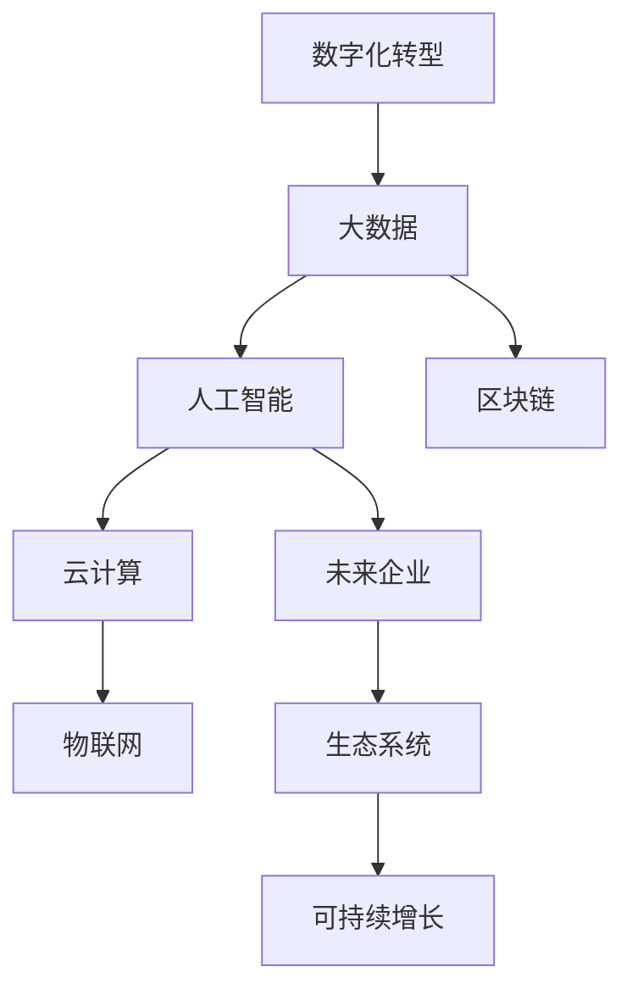
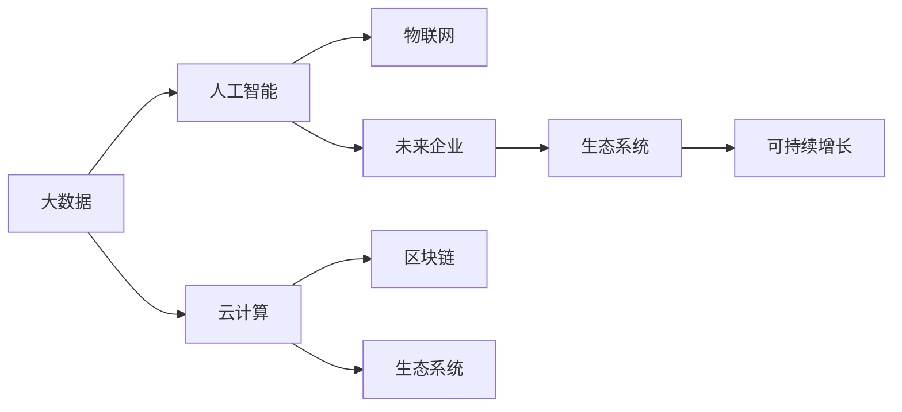

                 

# 数字化创业：打造未来企业的蓝图

> 关键词：数字化转型, 创业, 人工智能, 大数据, 云计算, 区块链, 物联网, 未来企业, 蓝图

## 1. 背景介绍

### 1.1 问题由来

数字化转型已经成为全球各行各业共同关注的重要议题。随着信息技术的快速发展，数字经济已经逐渐成为驱动经济增长的关键力量。对于创业者和企业管理者而言，掌握数字化转型的核心技术与方法，构建数字化运营的新模式，已经成为提升企业竞争力和持续发展的必由之路。

在数字化转型的浪潮中，大数据、人工智能、云计算、物联网、区块链等先进技术的应用日益广泛，为企业提供了一个全新的发展空间。借助这些前沿技术，企业可以更加高效地管理运营，提升生产效率，实现业务模式的创新和转型。

然而，数字化转型的复杂性也带来了诸多挑战。企业需要跨学科的知识，熟练掌握各种先进技术，并具备强大的创新能力，才能在数字化时代中立足。创业者的成功不仅取决于产品的技术创新，更需要对数字化转型的全流程有深入的理解和系统的规划。

### 1.2 问题核心关键点

数字化创业的核心在于理解并掌握数字化转型的全过程，包括技术选择、架构设计、平台搭建、数据治理、业务整合等关键环节。成功的数字化创业需要对技术深度理解，能够将技术优势转化为业务价值，同时具备快速响应市场变化的能力。

以下列举数字化创业的几个关键点：

1. **技术融合与创新**：通过技术融合创新，构建新的业务模式和运营体系。
2. **数据驱动决策**：充分利用数据资源，实现精准的业务决策和运营优化。
3. **平台化运营**：构建平台，汇聚各类资源，提升资源利用效率。
4. **生态系统构建**：建立行业生态系统，实现协同创新和资源共享。
5. **可持续增长**：通过数字化手段，实现业务的可持续增长和转型。

### 1.3 问题研究意义

理解并掌握数字化创业的方法和策略，对于创业者和企业管理者都具有重要意义：

1. **提升企业竞争力**：数字化创业可以显著提升企业的运营效率和创新能力，使企业在市场竞争中占据优势。
2. **促进业务转型**：数字化手段可以帮助企业实现业务模式创新和转型，开拓新的增长点。
3. **增强客户体验**：数字化技术可以提升客户服务质量和客户满意度，增强客户黏性。
4. **推动可持续发展**：数字化转型能够提高企业的资源利用效率，降低环境影响，实现可持续发展。

## 2. 核心概念与联系

### 2.1 核心概念概述

为了更好地理解数字化创业，我们首先需要了解以下几个关键概念：

- **数字化转型**：将传统商业模式和运营方式，通过数字化技术手段进行升级和转型。
- **大数据**：指大规模、多源、异构的数据资源，通过数据挖掘和分析，提供决策支持。
- **人工智能(AI)**：通过模拟人类智能行为，实现智能化的决策和运营。
- **云计算**：提供弹性、按需、自助的服务，支持大规模数据处理和计算。
- **区块链**：一种去中心化的分布式账本技术，保障数据透明和安全。
- **物联网(IoT)**：通过各种传感器和设备，实现物物互联和数据采集。
- **未来企业**：以数字化技术为核心的新型企业形态，具备高效、灵活、智能的运营能力。

这些概念之间通过数字化的浪潮连接在一起，共同构建了未来企业的蓝图。以下是一个简化的Mermaid流程图，展示它们之间的联系：



### 2.2 核心概念原理和架构的 Mermaid 流程图

为了更好地理解这些概念的联系，以下是一个更详细的Mermaid流程图：



这个流程图展示了各个概念之间的内在联系：

- **大数据**提供基础数据资源，支撑**人工智能**进行数据分析和建模。
- **人工智能**通过数据分析和模型训练，辅助企业实现智能化决策和运营。
- **云计算**提供弹性的计算和存储资源，支持大数据和人工智能的高效运行。
- **物联网**实现设备互联，提供实时数据支持。
- **区块链**提供数据透明和安全性，保障数据安全。
- **未来企业**通过集成以上技术，构建高效的运营体系。
- **生态系统**促进资源共享和协同创新，推动企业持续增长。

这些概念通过数字化技术的深度融合，共同构建了未来企业的蓝图。

## 3. 核心算法原理 & 具体操作步骤

### 3.1 算法原理概述

数字化创业的核心算法原理，可以归结为以下几个关键环节：

1. **数据集成与治理**：通过数据清洗、标准化和整合，提升数据质量，为后续分析和应用奠定基础。
2. **数据分析与建模**：利用大数据技术和人工智能模型，对数据进行深入分析，提取有价值的信息。
3. **业务流程优化**：通过数字化手段，优化企业运营流程，提升效率和效果。
4. **智能决策支持**：利用人工智能模型和数据分析结果，辅助企业进行智能决策。
5. **技术平台搭建**：构建数字化平台，支持数据管理、业务运营和创新应用。

### 3.2 算法步骤详解

以下是一个详细的数字化创业步骤：

**Step 1: 数据集成与治理**

1. **数据收集**：从不同的数据源收集数据，包括内部业务数据、外部市场数据等。
2. **数据清洗**：清洗数据，去除噪声和异常值，保证数据质量。
3. **数据标准化**：统一数据格式和标准，方便后续分析和应用。
4. **数据整合**：将不同数据源的数据进行整合，形成统一的数据视图。

**Step 2: 数据分析与建模**

1. **数据探索**：通过数据可视化等手段，探索数据特征和趋势。
2. **特征工程**：选择合适的特征，进行特征提取和转换。
3. **模型选择**：根据业务需求，选择合适的机器学习或深度学习模型。
4. **模型训练**：使用标注数据训练模型，并进行调参优化。
5. **模型评估**：对模型进行评估，选择合适的模型进行部署。

**Step 3: 业务流程优化**

1. **流程分析**：分析现有业务流程，找出瓶颈和优化点。
2. **流程重构**：重构业务流程，引入数字化手段，提升效率。
3. **系统集成**：将新的数字化工具和系统集成到现有流程中。
4. **流程监控**：实时监控流程运行情况，及时发现和解决问题。

**Step 4: 智能决策支持**

1. **决策支持系统(DSS)**：建立基于数据分析的决策支持系统，辅助企业决策。
2. **实时监控**：利用物联网和云计算技术，实现实时数据采集和分析。
3. **智能预警**：根据实时数据，进行异常预警和风险管理。

**Step 5: 技术平台搭建**

1. **云平台搭建**：选择适合的云平台，搭建基础设施。
2. **数据管理平台**：建立数据管理平台，支持数据存储、治理和应用。
3. **业务运营平台**：搭建业务运营平台，支持业务流程自动化。
4. **创新应用平台**：开发创新应用，推动业务模式创新。

### 3.3 算法优缺点

数字化创业的算法有以下几个优点：

1. **高效性**：通过数字化手段，可以显著提升企业运营效率和效果。
2. **灵活性**：数字化平台具有高度的灵活性，可以快速响应市场变化和业务需求。
3. **可扩展性**：数字化平台支持水平和垂直扩展，能够适应业务规模的不断增长。
4. **创新性**：数字化创业可以推动业务模式的创新和转型，开拓新的增长点。

同时，数字化创业也存在一些缺点：

1. **高成本**：数字化转型需要大量的资金投入，特别是在初期阶段。
2. **技术复杂**：数字化创业需要跨学科的知识，技术复杂性较高。
3. **数据隐私**：数字化转型涉及大量数据的收集和分析，需要严格的数据隐私保护。
4. **文化变革**：数字化创业需要组织文化的变革，需要管理层的支持和推动。

### 3.4 算法应用领域

数字化创业的算法应用领域非常广泛，主要包括以下几个方面：

1. **零售业**：通过数据分析和人工智能，优化库存管理、精准营销、客户服务等。
2. **制造业**：通过物联网和云计算，实现智能制造、设备管理、供应链优化等。
3. **金融业**：利用大数据和人工智能，进行风险管理、反欺诈、智能投顾等。
4. **医疗健康**：通过人工智能和大数据，实现精准医疗、健康管理、智能诊断等。
5. **教育行业**：利用人工智能和大数据分析，提供个性化学习、智能评估、在线教育等。
6. **物流行业**：通过物联网和人工智能，实现路径优化、智能调度、物流监控等。

## 4. 数学模型和公式 & 详细讲解 & 举例说明

### 4.1 数学模型构建

在数字化创业中，数学模型扮演着至关重要的角色。以下是一些常见的数学模型及其构建方法：

**Step 1: 数据预处理**

1. **缺失值处理**：通过插值或删除处理缺失值，保证数据完整性。
2. **特征选择**：选择合适的特征，去除冗余和无用特征。
3. **特征缩放**：对数据进行标准化或归一化，保证模型训练的稳定性和效果。

**Step 2: 数据建模**

1. **回归模型**：利用线性回归、决策树、随机森林等算法，进行预测和分类。
2. **机器学习模型**：使用支持向量机、朴素贝叶斯、K近邻等算法，进行模式识别和分类。
3. **深度学习模型**：利用神经网络模型，进行复杂的特征提取和预测。

**Step 3: 模型评估**

1. **损失函数**：选择合适的损失函数，如均方误差、交叉熵、对数损失等。
2. **评价指标**：使用准确率、召回率、F1分数等评价指标，评估模型效果。
3. **过拟合控制**：通过正则化、Dropout等方法，避免模型过拟合。

### 4.2 公式推导过程

以线性回归模型为例，进行详细推导：

假设数据集为 $(x_1, y_1), (x_2, y_2), ..., (x_n, y_n)$，其中 $x$ 为自变量，$y$ 为因变量。线性回归模型的目标是最小化均方误差：

$$
\min_{\beta} \frac{1}{2n} \sum_{i=1}^n (y_i - \beta_0 - \beta_1x_i)^2
$$

其中 $\beta_0, \beta_1$ 为模型的参数。

将目标函数对 $\beta_0, \beta_1$ 求偏导，得到：

$$
\frac{\partial \min_{\beta}}{\partial \beta_0} = \frac{-1}{n} \sum_{i=1}^n (y_i - \beta_0 - \beta_1x_i)
$$

$$
\frac{\partial \min_{\beta}}{\partial \beta_1} = \frac{-1}{n} \sum_{i=1}^n (y_i - \beta_0 - \beta_1x_i)x_i
$$

解以上方程组，得到模型的参数 $\beta_0, \beta_1$：

$$
\beta_0 = \frac{1}{n} \sum_{i=1}^n y_i
$$

$$
\beta_1 = \frac{1}{n} \sum_{i=1}^n (x_i - \bar{x})(y_i - \bar{y})
$$

其中 $\bar{x} = \frac{1}{n} \sum_{i=1}^n x_i$，$\bar{y} = \frac{1}{n} \sum_{i=1}^n y_i$。

### 4.3 案例分析与讲解

**案例分析：电商推荐系统**

电商推荐系统是数字化创业中的典型应用，其核心在于通过数据分析和机器学习，实现个性化推荐。以下是一个简单的电商推荐系统的构建步骤：

**Step 1: 数据收集**

1. **用户数据**：收集用户的基本信息、购买历史、浏览记录等数据。
2. **商品数据**：收集商品的属性、价格、销量、评价等数据。
3. **行为数据**：收集用户的行为数据，如点击、购买、收藏等。

**Step 2: 数据预处理**

1. **数据清洗**：去除噪声和异常值，保证数据质量。
2. **特征工程**：选择用户特征和商品特征，进行特征提取和转换。
3. **数据整合**：将用户数据、商品数据和行为数据进行整合，形成统一的数据视图。

**Step 3: 模型选择与训练**

1. **模型选择**：选择协同过滤或基于内容的推荐模型。
2. **模型训练**：使用标注数据训练模型，并进行调参优化。
3. **模型评估**：对模型进行评估，选择合适的模型进行部署。

**Step 4: 推荐策略设计**

1. **用户画像**：利用用户数据，建立用户画像，了解用户兴趣和需求。
2. **商品推荐**：根据用户画像，选择推荐商品，并利用多臂老虎机等算法，提升推荐效果。
3. **实时推荐**：利用实时数据，进行实时推荐，提升用户体验。

## 5. 项目实践：代码实例和详细解释说明

### 5.1 开发环境搭建

在开始项目实践前，需要先准备好开发环境。以下是使用Python进行PyTorch开发的环境配置流程：

1. 安装Anaconda：从官网下载并安装Anaconda，用于创建独立的Python环境。

2. 创建并激活虚拟环境：
```bash
conda create -n pytorch-env python=3.8 
conda activate pytorch-env
```

3. 安装PyTorch：根据CUDA版本，从官网获取对应的安装命令。例如：
```bash
conda install pytorch torchvision torchaudio cudatoolkit=11.1 -c pytorch -c conda-forge
```

4. 安装TensorFlow：
```bash
pip install tensorflow
```

5. 安装各类工具包：
```bash
pip install numpy pandas scikit-learn matplotlib tqdm jupyter notebook ipython
```

完成上述步骤后，即可在`pytorch-env`环境中开始项目实践。

### 5.2 源代码详细实现

以下是一个使用PyTorch搭建的电商推荐系统的实现：

```python
import torch
import torch.nn as nn
import torch.optim as optim
from torch.utils.data import Dataset, DataLoader

# 定义用户数据集
class UserDataset(Dataset):
    def __init__(self, data, labels):
        self.data = data
        self.labels = labels
        
    def __len__(self):
        return len(self.data)
    
    def __getitem__(self, item):
        return self.data[item], self.labels[item]

# 定义商品数据集
class ItemDataset(Dataset):
    def __init__(self, data, labels):
        self.data = data
        self.labels = labels
        
    def __len__(self):
        return len(self.data)
    
    def __getitem__(self, item):
        return self.data[item], self.labels[item]

# 定义协同过滤模型
class CollaborativeFiltering(nn.Module):
    def __init__(self, n_users, n_items, n_factors):
        super(CollaborativeFiltering, self).__init__()
        self.user_factors = nn.Embedding(n_users, n_factors)
        self.item_factors = nn.Embedding(n_items, n_factors)
        self.cos_sim = nn.CosineSimilarity(dim=1, eps=1e-6)
        
    def forward(self, user_id, item_id):
        user_vector = self.user_factors(user_id)
        item_vector = self.item_factors(item_id)
        return self.cos_sim(user_vector, item_vector)
        
# 定义训练函数
def train_epoch(model, user_data, item_data, batch_size, optimizer):
    user_loader = DataLoader(user_data, batch_size=batch_size, shuffle=True)
    item_loader = DataLoader(item_data, batch_size=batch_size, shuffle=True)
    model.train()
    epoch_loss = 0
    for user_id, user_labels in user_loader:
        item_id, item_labels = next(iter(item_loader))
        optimizer.zero_grad()
        outputs = model(user_id, item_id)
        loss = torch.mean(torch.square(outputs - user_labels) + torch.square(outputs - item_labels))
        epoch_loss += loss.item()
        loss.backward()
        optimizer.step()
    return epoch_loss / len(user_loader)

# 定义评估函数
def evaluate(model, user_data, item_data, batch_size):
    user_loader = DataLoader(user_data, batch_size=batch_size)
    item_loader = DataLoader(item_data, batch_size=batch_size)
    model.eval()
    with torch.no_grad():
        predictions = []
        for user_id, user_labels in user_loader:
            item_id, item_labels = next(iter(item_loader))
            outputs = model(user_id, item_id)
            predictions.append(outputs.numpy().tolist())
        return predictions

# 加载数据集
user_data = UserDataset(user_data, user_labels)
item_data = ItemDataset(item_data, item_labels)

# 定义模型和优化器
n_users = 1000
n_items = 1000
n_factors = 100
model = CollaborativeFiltering(n_users, n_items, n_factors)
optimizer = optim.Adam(model.parameters(), lr=0.01)

# 训练模型
epochs = 10
batch_size = 64

for epoch in range(epochs):
    loss = train_epoch(model, user_data, item_data, batch_size, optimizer)
    print(f"Epoch {epoch+1}, train loss: {loss:.3f}")
    
# 评估模型
predictions = evaluate(model, user_data, item_data, batch_size)
print(f"Predictions: {predictions}")
```

以上就是使用PyTorch搭建电商推荐系统的完整代码实现。可以看到，通过上述代码，我们可以快速搭建和训练一个基本的协同过滤模型，实现用户和商品的推荐。

### 5.3 代码解读与分析

让我们再详细解读一下关键代码的实现细节：

**UserDataset和ItemDataset类**：
- `__init__`方法：初始化数据和标签。
- `__len__`方法：返回数据集大小。
- `__getitem__`方法：返回指定位置的数据和标签。

**CollaborativeFiltering类**：
- `__init__`方法：定义模型结构，包括用户嵌入层、物品嵌入层和余弦相似度层。
- `forward`方法：定义前向传播过程，计算余弦相似度。

**train_epoch和evaluate函数**：
- `train_epoch`函数：定义训练循环，计算损失函数并更新模型参数。
- `evaluate`函数：定义评估循环，保存预测结果。

**加载数据集**：
- 通过自定义的UserDataset和ItemDataset类，加载用户数据和商品数据。

**定义模型和优化器**：
- 定义协同过滤模型，包括用户嵌入层、物品嵌入层和余弦相似度层。
- 使用Adam优化器，设置学习率为0.01。

**训练和评估**：
- 在训练过程中，每次迭代计算损失函数并更新模型参数。
- 在评估过程中，将预测结果保存并输出。

## 6. 实际应用场景

### 6.1 智能客服系统

基于数字化创业的智能客服系统，可以为企业提供7x24小时不间断的客户服务，提升客户满意度和响应速度。智能客服系统通过数字化手段，实现自然语言理解和生成，能够快速理解和回答客户问题。

具体实现上，可以采用基于预训练语言模型的微调方法，构建智能客服系统。通过对大量历史客服对话数据的微调，使模型能够自动理解客户意图和生成自然语言回答。在实际应用中，可以集成到企业内部的客服系统中，提供实时响应和自动答复。

### 6.2 金融风控系统

金融风控系统是数字化创业中的重要应用场景。通过数字化手段，可以实现实时风险监测和预警，有效降低金融风险。

具体实现上，可以采用大数据和人工智能技术，构建金融风控系统。通过对历史交易数据的分析，构建风险模型，实时监测交易行为，及时发现异常情况并预警。同时，可以利用区块链技术，保障数据透明和安全，确保系统的可靠性和可信度。

### 6.3 智慧城市治理

智慧城市治理是数字化创业中的典型应用，通过数字化手段，可以实现城市管理的智能化和精细化。智慧城市治理系统可以涵盖交通管理、环境监测、公共安全等多个方面，提升城市治理水平和居民生活质量。

具体实现上，可以采用物联网和云计算技术，构建智慧城市治理系统。通过实时数据采集和分析，实现交通流量监测、环境质量监测、公共安全预警等。同时，可以利用大数据技术，对城市运行数据进行综合分析，优化城市资源配置和运营管理。

## 7. 工具和资源推荐

### 7.1 学习资源推荐

为了帮助开发者系统掌握数字化创业的理论基础和实践技巧，这里推荐一些优质的学习资源：

1. 《数字化转型实战指南》：介绍数字化转型的基本概念和实战方法，适合企业管理者和创业者阅读。
2. 《人工智能入门教程》：讲解人工智能的基本原理和应用，适合技术开发者阅读。
3. 《大数据技术与实践》：介绍大数据的核心技术和应用场景，适合数据工程师阅读。
4. 《云计算基础教程》：讲解云计算的核心概念和应用场景，适合云计算工程师阅读。
5. 《区块链原理与技术》：讲解区块链的核心原理和技术实现，适合区块链开发者阅读。
6. 《物联网技术与应用》：讲解物联网的核心技术和应用场景，适合物联网开发者阅读。

通过对这些资源的学习实践，相信你一定能够快速掌握数字化创业的理论基础和实践技巧，构建高效的数字化运营体系。

### 7.2 开发工具推荐

高效的开发离不开优秀的工具支持。以下是几款用于数字化创业开发的常用工具：

1. Python：适合数据科学和人工智能应用的编程语言。
2. PyTorch：基于Python的开源深度学习框架，支持动态计算图。
3. TensorFlow：由Google主导开发的开源深度学习框架，支持静态计算图。
4. Hadoop：适合大数据处理的开源分布式计算框架。
5. Spark：适合大数据处理的开源分布式计算框架，支持弹性计算资源。
6. Elasticsearch：适合搜索引擎和大数据查询的开源分布式数据库。

合理利用这些工具，可以显著提升数字化创业的开发效率，加速创新迭代的步伐。

### 7.3 相关论文推荐

数字化创业的相关论文涵盖了技术、应用、管理等多个方面。以下是几篇奠基性的相关论文，推荐阅读：

1. "The Digital Transformation of Business: A Conceptual Framework"：介绍数字化转型的核心概念和实现方法，适合企业管理者阅读。
2. "The Impact of AI and Machine Learning on Business"：分析人工智能和机器学习对企业的影响，适合技术开发者阅读。
3. "Big Data Analytics for Business Intelligence"：讲解大数据技术在商业智能中的应用，适合数据工程师阅读。
4. "Cloud Computing for Business: Principles and Best Practices"：介绍云计算技术在企业中的应用，适合云计算工程师阅读。
5. "Blockchain Technology in Business: Opportunities and Challenges"：分析区块链技术在企业中的应用，适合区块链开发者阅读。
6. "IoT Applications in Business: Current Trends and Future Directions"：讲解物联网技术在企业中的应用，适合物联网开发者阅读。

这些论文代表了大数字化创业技术的发展脉络。通过学习这些前沿成果，可以帮助研究者把握学科前进方向，激发更多的创新灵感。

## 8. 总结：未来发展趋势与挑战

### 8.1 总结

本文对数字化创业的方法和策略进行了全面系统的介绍。首先阐述了数字化转型的背景和意义，明确了数字化创业的重要性。其次，从原理到实践，详细讲解了数字化创业的核心算法和具体操作步骤，给出了数字化创业的完整代码实例。同时，本文还广泛探讨了数字化创业在智能客服、金融风控、智慧城市等多个领域的应用前景，展示了数字化创业的广阔前景。此外，本文精选了数字化创业的学习资源、开发工具和相关论文，力求为读者提供全方位的技术指引。

通过本文的系统梳理，可以看到，数字化创业是未来企业发展的重要方向，是实现业务模式创新和转型的关键途径。数字化创业需要跨学科的知识，需要从技术、业务、管理等多个维度进行全面考虑。数字化创业的未来发展趋势和面临的挑战，也将是大数据、人工智能、云计算等前沿技术不断融合的结果。

### 8.2 未来发展趋势

展望未来，数字化创业将呈现以下几个发展趋势：

1. **技术融合与创新**：通过技术融合创新，构建新的业务模式和运营体系。
2. **数据驱动决策**：充分利用数据资源，实现精准的业务决策和运营优化。
3. **平台化运营**：构建平台，汇聚各类资源，提升资源利用效率。
4. **生态系统构建**：建立行业生态系统，实现协同创新和资源共享。
5. **可持续增长**：通过数字化手段，实现业务的可持续增长和转型。

### 8.3 面临的挑战

尽管数字化创业在技术上取得了许多进展，但在迈向更加智能化、普适化应用的过程中，仍面临诸多挑战：

1. **技术复杂性**：数字化创业需要跨学科的知识，技术复杂性较高。
2. **数据隐私**：数字化创业涉及大量数据的收集和分析，需要严格的数据隐私保护。
3. **文化变革**：数字化创业需要组织文化的变革，需要管理层的支持和推动。
4. **技术融合难度**：不同技术的融合和集成，需要复杂的系统架构和设计。
5. **市场竞争**：数字化创业需要面对激烈的市场竞争，需要不断创新和优化。
6. **数据质量**：数字化创业需要高质量的数据，但数据清洗和治理难度较大。

### 8.4 研究展望

面对数字化创业所面临的挑战，未来的研究需要在以下几个方面寻求新的突破：

1. **多技术融合**：进一步推动大数据、人工智能、云计算等技术的深度融合，构建高效、灵活的数字化运营体系。
2. **数据治理与质量**：建立完善的数据治理机制，提升数据质量，保障数据隐私和安全。
3. **文化变革与组织管理**：推动组织文化的变革，加强领导力和团队建设，提升数字化创业的执行力和效果。
4. **技术创新与持续改进**：不断创新技术手段，优化数字化创业的方法和策略，提升数字化创业的竞争力和影响力。
5. **行业应用与生态系统构建**：推动数字化创业在各个行业的落地应用，构建行业生态系统，实现协同创新和资源共享。
6. **国际合作与标准制定**：加强国际合作，推动数字化创业的标准化，提升数字化创业的全球竞争力。

总之，数字化创业是未来企业发展的必然选择，是实现业务模式创新和转型的关键途径。数字化创业需要跨学科的知识，需要从技术、业务、管理等多个维度进行全面考虑。只有不断创新、持续改进，才能在数字化浪潮中脱颖而出，引领未来的发展方向。

## 9. 附录：常见问题与解答

**Q1：数字化创业与传统创业有何不同？**

A: 数字化创业与传统创业的主要区别在于技术的应用。数字化创业通过数字化手段，实现业务的自动化、智能化和精细化，提升了企业的运营效率和竞争力。而传统创业则更多依赖人力、物力和财力，缺乏对数字化转型的系统思考和规划。

**Q2：如何选择合适的数字化创业方向？**

A: 选择合适的数字化创业方向需要综合考虑市场机会、技术可行性、自身优势等因素。可以从自身行业特点出发，寻找数字化转型的切入点。例如，零售业可以利用电商平台和智能推荐系统，提升用户体验和销售效率。金融业可以利用大数据和人工智能，实现风险管理和智能投顾。制造业可以利用物联网和智能制造技术，提升生产效率和产品质量。

**Q3：数字化创业需要哪些关键技术？**

A: 数字化创业需要多种关键技术，包括大数据、人工智能、云计算、物联网、区块链等。具体选择哪些技术，需要根据业务需求和资源条件进行评估。例如，电商平台可以利用大数据和人工智能技术，实现个性化推荐和智能客服。智能制造可以利用物联网和云计算技术，实现设备监控和智能调度。

**Q4：数字化创业需要多少投入？**

A: 数字化创业的投入主要集中在技术、设备和人力资源上。初期的投入可能较大，但随着项目的推进和技术的成熟，投入成本会逐渐下降。具体投入金额需要根据项目规模和技术需求进行评估。例如，电商平台的初期投入可能包括服务器、数据处理和算法开发，但随着系统的稳定和用户基数的增长，投入成本会逐渐降低。

**Q5：数字化创业的风险有哪些？**

A: 数字化创业的风险主要包括技术风险、市场风险和资金风险。技术风险包括技术选型不当、系统架构不合理等。市场风险包括市场需求不确定、用户接受度低等。资金风险包括资金链断裂、投资回报期长等。需要通过系统评估和风险管理，降低数字化创业的风险。

综上所述，数字化创业是一个复杂且系统的工程，需要从技术、业务、管理等多个维度进行全面考虑。只有不断创新、持续改进，才能在数字化浪潮中脱颖而出，引领未来的发展方向。

---

作者：禅与计算机程序设计艺术 / Zen and the Art of Computer Programming

