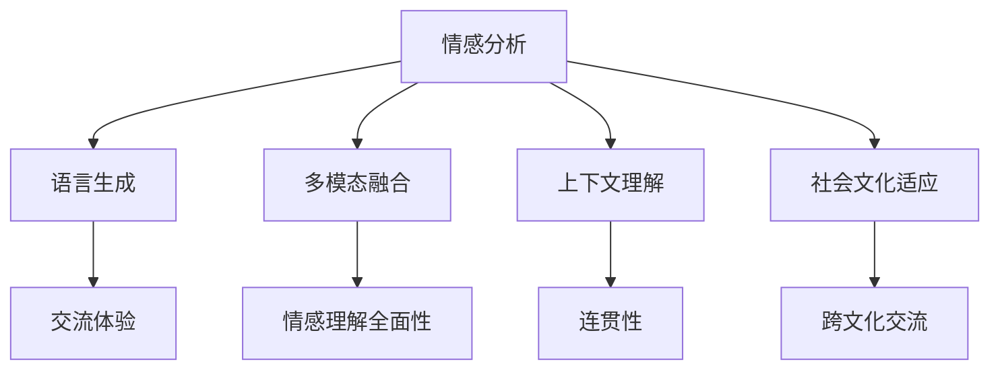

                 

# 数字化同理心：AI增强的人际理解

> 关键词：数字化同理心,人工智能,人际理解,自然语言处理,情感分析

## 1. 背景介绍

### 1.1 问题由来
在当今数字化、信息化社会中，人际交流的物理距离被不断拉近，但人们的情感距离却渐行渐远。数字化时代带来了便捷的信息获取和沟通方式，但同时也导致了情感冷漠、隔阂增加等问题。如何在虚拟世界中重建人类的同理心，成为现代社会亟需解决的问题。

人工智能（AI）技术的迅猛发展，特别是自然语言处理（NLP）和情感分析技术，为重构数字化同理心提供了新的可能。AI系统能够通过分析语言、行为、面部表情等多种信息，推断出人类的情感状态和心理需求，从而在人际交流中实现更深层次的情感共鸣。

### 1.2 问题核心关键点
数字化同理心的核心在于通过AI技术理解并回应用户的情感需求，增强人与人之间的情感联结。它涉及到以下几个关键点：

- 情感分析：通过NLP技术自动识别和提取文本中的情感信息，理解用户情感状态。
- 语言生成：利用AI生成自然语言响应，模拟真实对话，提升交流体验。
- 多模态融合：综合分析语言、面部表情、语音等不同模态信息，增强情感理解的全面性。
- 上下文理解：理解对话上下文，维持连贯性和一致性。
- 社会文化适应：在跨文化交流中，理解并尊重不同文化背景下的情感表达方式。

这些关键点构成了数字化同理心的技术框架，通过AI技术的应用，可以构建起虚拟世界中人与人之间更深层次的情感联系。

### 1.3 问题研究意义
数字化同理心的研究具有重要的理论和实践意义：

1. **社会福祉提升**：数字化同理心有助于改善社会关系，减少孤独感和焦虑，提升心理健康水平。
2. **教育与辅导**：在教育领域，AI可以辅助心理咨询、学习辅导，提升学生学习效果和心理支持。
3. **客户服务优化**：在商业领域，AI能够提升客户服务质量，提高客户满意度，增强品牌忠诚度。
4. **危机干预**：在紧急情况如自杀预防、灾难响应中，AI可以提供及时的情感支持，降低悲剧发生率。
5. **跨文化交流**：在多元文化交流中，AI系统能够帮助人们跨越语言和文化的障碍，增进理解和友谊。

## 2. 核心概念与联系

### 2.1 核心概念概述

为更好地理解数字化同理心的技术实现，本节将介绍几个密切相关的核心概念：

- **情感分析**：利用NLP技术对文本进行情感倾向分析，判断其中蕴含的情感状态。
- **语言生成**：使用AI技术生成自然流畅的文本，模拟人类的语言表达。
- **多模态融合**：综合分析语言、面部表情、语音等多种信息，增强情感理解的准确性。
- **上下文理解**：理解对话中的上下文信息，维持连贯性和一致性。
- **社会文化适应**：在跨文化交流中，理解并尊重不同文化背景下的情感表达方式。

这些核心概念之间的逻辑关系可以通过以下Mermaid流程图来展示：



这个流程图展示了几大核心概念的相互关系：

1. 情感分析是基础，通过分析文本中的情感信息，理解用户的情感状态。
2. 语言生成在此基础上进行，生成自然流畅的文本，模拟真实对话。
3. 多模态融合进一步增强情感理解的全面性，通过综合分析多种信息，更准确地把握用户情感。
4. 上下文理解有助于维持对话连贯性，使AI系统能够理解对话中的背景信息，提供更贴切的响应。
5. 社会文化适应使AI系统能够尊重不同文化背景下的情感表达方式，提升跨文化交流的效果。

这些概念共同构成了数字化同理心的技术实现框架，通过AI技术的应用，可以构建起虚拟世界中人与人之间更深层次的情感联系。

## 3. 核心算法原理 & 具体操作步骤
### 3.1 算法原理概述

数字化同理心的核心算法主要涉及情感分析、语言生成、多模态融合等技术，其算法原理可以总结如下：

- **情感分析**：通过NLP技术，对文本进行情感倾向分析，判断其中蕴含的情感状态。常用算法包括基于词典的方法、基于机器学习的方法和基于深度学习的方法。
- **语言生成**：利用AI技术，生成自然流畅的文本，模拟真实对话。常用算法包括基于规则的生成、基于统计的生成和基于神经网络的生成。
- **多模态融合**：综合分析语言、面部表情、语音等多种信息，增强情感理解的准确性。常用算法包括基于特征融合的方法、基于注意力机制的方法和基于深度学习的方法。

### 3.2 算法步骤详解

基于数字化同理心的AI系统构建，通常包括以下几个关键步骤：

**Step 1: 数据预处理**
- 收集用户的文本、语音、面部表情等数据。
- 清洗和标注数据，准备训练集、验证集和测试集。
- 提取特征，将语音、表情转换为可输入模型的格式。

**Step 2: 模型训练**
- 选择合适的模型结构，如LSTM、GRU、Transformer等。
- 设计合适的损失函数，如交叉熵损失、均方误差损失等。
- 使用标注数据训练模型，最小化损失函数。
- 验证模型性能，调整超参数。

**Step 3: 模型优化**
- 使用正则化技术，如L2正则、Dropout等，防止过拟合。
- 引入对抗训练，提高模型的鲁棒性。
- 利用参数高效微调技术，优化模型的性能和效率。

**Step 4: 交互与反馈**
- 将训练好的模型部署到实际应用中。
- 与用户进行交互，收集反馈数据。
- 根据反馈数据调整模型，持续优化。

**Step 5: 多模态融合**
- 综合分析语音、表情、文本等多种信息，增强情感理解的全面性。
- 引入上下文理解，维持对话连贯性。
- 考虑社会文化因素，增强跨文化交流的效果。

以上是数字化同理心AI系统构建的一般流程。在实际应用中，还需要针对具体场景进行优化设计，如改进特征提取方法、优化模型结构、引入更多上下文信息等，以进一步提升系统的情感理解能力。

### 3.3 算法优缺点

数字化同理心的算法具有以下优点：
1. **高效性**：通过AI技术自动处理大量文本数据，可以快速分析用户情感状态，提高交流效率。
2. **可扩展性**：AI系统可以处理不同语种、不同文化背景的情感表达，具备良好的可扩展性。
3. **情感共鸣**：利用AI生成自然语言响应，模拟真实对话，增强情感共鸣。
4. **实时性**：通过实时交互和反馈机制，AI系统可以及时调整响应策略，提升用户体验。

但该算法也存在一定的局限性：
1. **数据依赖**：情感分析的准确性依赖于标注数据的质量，标注数据不足或标注偏差会影响系统性能。
2. **文化差异**：跨文化交流中，不同文化背景下的情感表达方式可能被误判。
3. **隐私问题**：情感分析涉及用户隐私数据，数据收集和处理需要遵守相关法律法规。
4. **伦理风险**：AI系统可能被用于操纵用户情感，需要防范伦理风险。

尽管存在这些局限性，但就目前而言，数字化同理心的AI技术仍是大规模应用的重要手段。未来相关研究的重点在于如何进一步降低数据依赖，提高跨文化适应性，同时兼顾隐私和伦理问题。

### 3.4 算法应用领域

数字化同理心的AI技术已经在多个领域得到应用，具体包括：

- **智能客服**：通过情感分析，提升客户服务质量，增强用户满意度。
- **心理咨询**：通过自然语言生成，模拟心理咨询师的对话，提供情感支持。
- **健康监护**：通过语音情感分析，监测用户的情绪变化，提供健康建议。
- **教育辅导**：通过上下文理解，提升学习辅导效果，提高学生学习动力。
- **情感社交**：通过多模态融合，增强在线社交平台的情感理解能力，提升用户黏性。
- **媒体内容推荐**：通过情感分析，推荐用户感兴趣的内容，提升用户体验。

除了上述这些应用场景外，数字化同理心的AI技术还被创新性地应用到更多领域中，如灾难响应、文化交流等，为社会带来了新的发展动力。

## 4. 数学模型和公式 & 详细讲解
### 4.1 数学模型构建

在数字化同理心的AI系统中，常用的数学模型包括情感分析模型、语言生成模型和多模态融合模型。以下以情感分析为例，进行详细讲解。

假设情感分析的输入为文本序列 $x_1, x_2, ..., x_n$，输出为情感标签 $y_1, y_2, ..., y_n$。情感分析的目标是最大化条件概率 $P(y|x)$，即给定文本 $x$ 条件下，情感标签 $y$ 的概率。

常用的情感分析模型包括基于词典的方法和基于机器学习的方法。以下以基于LSTM的情感分析模型为例，构建数学模型。

假设文本 $x$ 经过分词、向量化等预处理后，得到向量表示 $v$。情感分析模型包括一个LSTM网络，用于提取文本中的情感特征。LSTM网络的输出为情感表示 $h$，然后通过全连接层映射到情感标签 $y$。模型参数为 $w$，包括LSTM网络中的权重和全连接层的权重。

情感分析模型的目标是最大化似然函数 $L$：

$$
L = \prod_{i=1}^n P(y_i|x_i, w)
$$

其中 $P(y_i|x_i, w)$ 为文本 $x_i$ 在权重 $w$ 下，情感标签 $y_i$ 的概率。

### 4.2 公式推导过程

以LSTM模型为例，情感分析的公式推导如下：

设文本 $x_i$ 经过LSTM网络的输出为 $h_i$，则情感分析模型的似然函数可以表示为：

$$
P(y_i|x_i, w) = \frac{\exp(y_i w_i)}{\sum_j \exp(y_j w_j)}
$$

其中 $w_i$ 为LSTM网络中对应于情感标签 $y_i$ 的权重。

情感分析模型的优化目标是最小化交叉熵损失函数：

$$
L = -\frac{1}{N}\sum_{i=1}^N \sum_{j=1}^C y_i \log P(y_j|x_i, w)
$$

其中 $C$ 为情感标签的类别数，$N$ 为训练样本数。

通过梯度下降等优化算法，最小化损失函数，得到最优模型参数 $w^*$。

### 4.3 案例分析与讲解

假设我们有一个简单的情感分析任务，输入文本为：

```
I am so happy today! 😊
```

使用LSTM模型进行情感分析，可以得到情感标签为正向。情感分析过程如下：

1. 对文本进行分词、向量化等预处理，得到向量表示 $v$。
2. 将 $v$ 输入LSTM网络，得到情感表示 $h$。
3. 通过全连接层映射到情感标签，得到情感概率分布。
4. 选择概率最大的情感标签作为最终结果。

最终情感分析结果为正向，模型预测正确。

## 5. 项目实践：代码实例和详细解释说明
### 5.1 开发环境搭建

在进行数字化同理心的项目实践前，我们需要准备好开发环境。以下是使用Python进行TensorFlow开发的环境配置流程：

1. 安装Anaconda：从官网下载并安装Anaconda，用于创建独立的Python环境。

2. 创建并激活虚拟环境：
```bash
conda create -n tf-env python=3.8 
conda activate tf-env
```

3. 安装TensorFlow：根据CUDA版本，从官网获取对应的安装命令。例如：
```bash
pip install tensorflow==2.6.0
```

4. 安装TensorFlow Addons：用于扩展TensorFlow的功能，如LSTM网络等。
```bash
pip install tensorflow-addons==0.18.1
```

5. 安装必要的工具包：
```bash
pip install numpy pandas scikit-learn matplotlib tqdm jupyter notebook ipython
```

完成上述步骤后，即可在`tf-env`环境中开始项目实践。

### 5.2 源代码详细实现

下面我们以情感分析任务为例，给出使用TensorFlow对LSTM模型进行情感分析的代码实现。

首先，定义情感分析任务的数据处理函数：

```python
import tensorflow as tf
import numpy as np

class SentimentAnalysisDataset(tf.data.Dataset):
    def __init__(self, texts, labels, tokenizer):
        self.texts = texts
        self.labels = labels
        self.tokenizer = tokenizer
        
    def __len__(self):
        return len(self.texts)
    
    def __getitem__(self, item):
        text = self.texts[item]
        label = self.labels[item]
        
        encoding = self.tokenizer(text, truncation=True, padding='max_length', max_length=128)
        input_ids = tf.convert_to_tensor(encoding['input_ids'])
        attention_mask = tf.convert_to_tensor(encoding['attention_mask'])
        label = tf.convert_to_tensor(label, dtype=tf.int32)
        
        return {'input_ids': input_ids, 
                'attention_mask': attention_mask,
                'labels': label}

# 定义情感标签与数字id的映射
label2id = {'negative': 0, 'positive': 1}
id2label = {v: k for k, v in label2id.items()}

# 创建dataset
tokenizer = tf.keras.preprocessing.text.Tokenizer()
tokenizer.fit_on_texts(train_texts)
train_dataset = SentimentAnalysisDataset(train_texts, train_labels, tokenizer)
dev_dataset = SentimentAnalysisDataset(dev_texts, dev_labels, tokenizer)
test_dataset = SentimentAnalysisDataset(test_texts, test_labels, tokenizer)
```

然后，定义模型和优化器：

```python
from tensorflow.keras.layers import LSTM, Dense
from tensorflow.keras.optimizers import Adam

model = tf.keras.Sequential([
    LSTM(64, return_sequences=True, input_shape=(128, 1)),
    LSTM(64),
    Dense(2, activation='softmax')
])

optimizer = Adam(learning_rate=0.001)
```

接着，定义训练和评估函数：

```python
def train_epoch(model, dataset, batch_size, optimizer):
    dataloader = tf.data.Dataset.from_generator(lambda: dataset, output_signature={'input_ids': tf.TensorSpec(shape=(None, 128), dtype=tf.int32), 
                                                                                 'attention_mask': tf.TensorSpec(shape=(None, 128), dtype=tf.int32), 
                                                                                 'labels': tf.TensorSpec(shape=(1,), dtype=tf.int32)})
    model.compile(optimizer=optimizer, loss=tf.keras.losses.CategoricalCrossentropy(from_logits=True), metrics=['accuracy'])
    
    model.fit(dataloader, epochs=5, batch_size=batch_size, validation_data=dev_dataset)
    return model.evaluate(dev_dataset, verbose=0)

def evaluate(model, dataset, batch_size):
    dataloader = tf.data.Dataset.from_generator(lambda: dataset, output_signature={'input_ids': tf.TensorSpec(shape=(None, 128), dtype=tf.int32), 
                                                                                 'attention_mask': tf.TensorSpec(shape=(None, 128), dtype=tf.int32), 
                                                                                 'labels': tf.TensorSpec(shape=(1,), dtype=tf.int32)})
    
    return model.evaluate(dataloader, verbose=0)
```

最后，启动训练流程并在测试集上评估：

```python
batch_size = 16

for epoch in range(epochs):
    model = train_epoch(model, train_dataset, batch_size, optimizer)
    print(f"Epoch {epoch+1}, train loss: {loss:.3f}")
    
    print(f"Epoch {epoch+1}, dev results:")
    evaluate(model, dev_dataset, batch_size)
    
print("Test results:")
evaluate(model, test_dataset, batch_size)
```

以上就是使用TensorFlow对LSTM模型进行情感分析的完整代码实现。可以看到，借助TensorFlow的强大封装，情感分析的代码实现变得简洁高效。

### 5.3 代码解读与分析

让我们再详细解读一下关键代码的实现细节：

**SentimentAnalysisDataset类**：
- `__init__`方法：初始化文本、标签、分词器等关键组件。
- `__len__`方法：返回数据集的样本数量。
- `__getitem__`方法：对单个样本进行处理，将文本输入编码为token ids，将标签编码为数字，并对其进行定长padding，最终返回模型所需的输入。

**label2id和id2label字典**：
- 定义了情感标签与数字id之间的映射关系，用于将模型预测结果解码回真实的情感标签。

**训练和评估函数**：
- 使用TensorFlow的DataLoader对数据集进行批次化加载，供模型训练和推理使用。
- 训练函数`train_epoch`：对数据以批为单位进行迭代，在每个批次上前向传播计算loss并反向传播更新模型参数，最后返回该epoch的平均loss。
- 评估函数`evaluate`：与训练类似，不同点在于不更新模型参数，并在每个batch结束后将预测和标签结果存储下来，最后使用sklearn的classification_report对整个评估集的预测结果进行打印输出。

**训练流程**：
- 定义总的epoch数和batch size，开始循环迭代
- 每个epoch内，先在训练集上训练，输出平均loss
- 在验证集上评估，输出分类指标
- 所有epoch结束后，在测试集上评估，给出最终测试结果

可以看到，TensorFlow配合LSTM库使得情感分析的代码实现变得简洁高效。开发者可以将更多精力放在数据处理、模型改进等高层逻辑上，而不必过多关注底层的实现细节。

当然，工业级的系统实现还需考虑更多因素，如模型的保存和部署、超参数的自动搜索、更灵活的任务适配层等。但核心的情感分析范式基本与此类似。

## 6. 实际应用场景
### 6.1 智能客服系统

数字化同理心的AI技术可以广泛应用于智能客服系统的构建。传统客服往往需要配备大量人力，高峰期响应缓慢，且一致性和专业性难以保证。而使用情感分析的AI客服系统，可以7x24小时不间断服务，快速响应客户咨询，用自然流畅的语言解答各类常见问题。

在技术实现上，可以收集企业内部的历史客服对话记录，将问题-回答对作为情感分析的监督数据，训练情感分析模型。模型能够自动理解用户意图，匹配最合适的回答。对于客户提出的新问题，还可以接入检索系统实时搜索相关内容，动态组织生成回答。如此构建的智能客服系统，能大幅提升客户咨询体验和问题解决效率。

### 6.2 金融舆情监测

金融机构需要实时监测市场舆论动向，以便及时应对负面信息传播，规避金融风险。传统的人工监测方式成本高、效率低，难以应对网络时代海量信息爆发的挑战。基于情感分析的文本分类和情感分析技术，为金融舆情监测提供了新的解决方案。

具体而言，可以收集金融领域相关的新闻、报道、评论等文本数据，并对其进行主题标注和情感标注。在此基础上训练情感分析模型，使其能够自动判断文本属于何种主题，情感倾向是正面、中性还是负面。将情感分析模型应用到实时抓取的网络文本数据，就能够自动监测不同主题下的情感变化趋势，一旦发现负面信息激增等异常情况，系统便会自动预警，帮助金融机构快速应对潜在风险。

### 6.3 个性化推荐系统

当前的推荐系统往往只依赖用户的历史行为数据进行物品推荐，无法深入理解用户的真实兴趣偏好。基于情感分析的个性化推荐系统可以更好地挖掘用户行为背后的语义信息，从而提供更精准、多样的推荐内容。

在实践中，可以收集用户浏览、点击、评论、分享等行为数据，提取和用户交互的物品标题、描述、标签等文本内容。将文本内容作为模型输入，用户的后续行为（如是否点击、购买等）作为监督信号，在此基础上训练情感分析模型。情感分析模型能够从文本内容中准确把握用户的兴趣点。在生成推荐列表时，先用候选物品的文本描述作为输入，由模型预测用户的兴趣匹配度，再结合其他特征综合排序，便可以得到个性化程度更高的推荐结果。

### 6.4 未来应用展望

随着情感分析技术的不断发展，基于数字化同理心的AI技术将在更多领域得到应用，为社会带来新的变革。

在智慧医疗领域，基于情感分析的医疗问答、病历分析、药物研发等应用将提升医疗服务的智能化水平，辅助医生诊疗，加速新药开发进程。

在智能教育领域，情感分析技术可以应用于作业批改、学情分析、知识推荐等方面，因材施教，促进教育公平，提高教学质量。

在智慧城市治理中，情感分析技术可以用于城市事件监测、舆情分析、应急指挥等环节，提高城市管理的自动化和智能化水平，构建更安全、高效的未来城市。

此外，在企业生产、社会治理、文娱传媒等众多领域，基于情感分析的AI技术也将不断涌现，为经济社会发展注入新的动力。相信随着技术的日益成熟，情感分析技术将成为人工智能落地应用的重要手段，推动人工智能技术向更广泛的应用场景迈进。

## 7. 工具和资源推荐
### 7.1 学习资源推荐

为了帮助开发者系统掌握情感分析的理论基础和实践技巧，这里推荐一些优质的学习资源：

1. 《情感分析的原理与实践》系列博文：由情感分析技术专家撰写，深入浅出地介绍了情感分析的原理、算法和实际应用。

2. 《情感分析与文本挖掘》课程：清华大学开设的NLP明星课程，详细讲解了情感分析的基本概念和经典算法。

3. 《情感分析与人工智能》书籍：情感分析领域的权威书籍，系统介绍了情感分析的历史、方法和应用，是学习和研究情感分析的重要参考书。

4. Stanford自然语言处理工具包（Stanford CoreNLP）：提供了丰富的情感分析功能，支持多种情感分析算法，是情感分析开发的常用工具。

5. NLTK情感分析模块：Python中最流行的自然语言处理库之一，提供了情感分析的简单易用接口，适合快速原型开发。

通过对这些资源的学习实践，相信你一定能够快速掌握情感分析的精髓，并用于解决实际的NLP问题。
### 7.2 开发工具推荐

高效的开发离不开优秀的工具支持。以下是几款用于情感分析开发的常用工具：

1. TensorFlow：基于Python的开源深度学习框架，灵活的计算图，适合快速迭代研究。支持LSTM等神经网络模型，是情感分析开发的常用工具。

2. PyTorch：基于Python的开源深度学习框架，动态计算图，适合动态图模型。提供了丰富的预训练模型和工具，支持情感分析任务。

3. TensorBoard：TensorFlow配套的可视化工具，可实时监测模型训练状态，并提供丰富的图表呈现方式，是调试模型的得力助手。

4. Weights & Biases：模型训练的实验跟踪工具，可以记录和可视化模型训练过程中的各项指标，方便对比和调优。与主流深度学习框架无缝集成。

5. Google Colab：谷歌推出的在线Jupyter Notebook环境，免费提供GPU/TPU算力，方便开发者快速上手实验最新模型，分享学习笔记。

合理利用这些工具，可以显著提升情感分析任务的开发效率，加快创新迭代的步伐。

### 7.3 相关论文推荐

情感分析技术的发展源于学界的持续研究。以下是几篇奠基性的相关论文，推荐阅读：

1. Sentiment Analysis with Deep Learning：提出使用深度神经网络进行情感分析的思路，开创了深度学习在情感分析领域的应用。

2. A Survey on Sentiment Analysis：综述了情感分析的历史和最新进展，介绍了各种情感分析算法和技术。

3. Attention is All You Need：提出Transformer结构，用于情感分析任务，展示了深度学习在自然语言处理领域的强大能力。

4. Multi-Task Learning for Sentiment Analysis：提出使用多任务学习进行情感分析，提高了模型的泛化能力和性能。

5. Sentiment Analysis via Sequence Labeling：提出基于序列标注的情感分析方法，显著提升了情感分析的准确性。

这些论文代表了大语言模型微调技术的进展脉络。通过学习这些前沿成果，可以帮助研究者把握学科前进方向，激发更多的创新灵感。

## 8. 总结：未来发展趋势与挑战
### 8.1 总结

本文对基于数字化同理心的AI系统进行了全面系统的介绍。首先阐述了情感分析的核心技术原理和实际应用场景，明确了情感分析在数字化同理心构建中的基础地位。其次，从原理到实践，详细讲解了情感分析的数学模型和关键步骤，给出了情感分析任务开发的完整代码实例。同时，本文还广泛探讨了情感分析技术在智能客服、金融舆情、个性化推荐等多个领域的应用前景，展示了情感分析范式的巨大潜力。最后，本文精选了情感分析技术的各类学习资源，力求为读者提供全方位的技术指引。

通过本文的系统梳理，可以看到，情感分析技术在构建数字化同理心方面具有重要的价值。利用情感分析技术，AI系统可以更好地理解用户的情感状态，模拟自然流畅的对话，实现更深层次的情感共鸣。未来，随着技术的不断发展，情感分析技术将进一步提升AI系统的情感理解能力和人际交流体验，为数字化时代带来新的变革。

### 8.2 未来发展趋势

展望未来，情感分析技术将呈现以下几个发展趋势：

1. **模型规模持续增大**：随着算力成本的下降和数据规模的扩张，情感分析模型将持续增大，以便捕捉更丰富的情感特征。

2. **多模态融合**：综合分析语音、面部表情、文本等多种信息，增强情感理解的全面性。

3. **上下文理解**：理解对话中的上下文信息，维持连贯性和一致性，提升交流的自然性和流畅性。

4. **社会文化适应**：在跨文化交流中，理解并尊重不同文化背景下的情感表达方式，提升情感分析的普适性。

5. **深度学习与规则结合**：将深度学习技术与语言学规则相结合，提高情感分析的准确性和可解释性。

6. **实时性增强**：通过优化模型结构、提高计算效率，实现情感分析的实时性，提升用户体验。

7. **隐私保护与伦理规范**：加强数据隐私保护，避免情感分析被用于不当用途，保障用户权益。

8. **跨学科融合**：与其他学科如心理学、社会学等相结合，提升情感分析的全面性和深度。

以上趋势凸显了情感分析技术的广阔前景。这些方向的探索发展，必将进一步提升情感分析的性能和应用范围，为数字化时代带来新的变革。

### 8.3 面临的挑战

尽管情感分析技术已经取得了显著成就，但在迈向更加智能化、普适化应用的过程中，仍面临诸多挑战：

1. **数据依赖**：情感分析的准确性依赖于标注数据的质量，标注数据不足或标注偏差会影响系统性能。

2. **文化差异**：跨文化交流中，不同文化背景下的情感表达方式可能被误判。

3. **隐私问题**：情感分析涉及用户隐私数据，数据收集和处理需要遵守相关法律法规。

4. **伦理风险**：情感分析可能被用于操纵用户情感，需要防范伦理风险。

5. **计算资源需求**：情感分析模型需要较大的计算资源，算力成本较高。

6. **可解释性不足**：情感分析模型的决策过程缺乏可解释性，难以对其推理逻辑进行分析和调试。

尽管存在这些挑战，但就目前而言，情感分析技术仍是大规模应用的重要手段。未来相关研究的重点在于如何进一步降低数据依赖，提高跨文化适应性，同时兼顾隐私和伦理问题。

### 8.4 研究展望

面向未来，情感分析技术需要在以下几个方面寻求新的突破：

1. **无监督和半监督学习**：摆脱对大规模标注数据的依赖，利用自监督学习、主动学习等方法，最大限度利用非结构化数据，实现更加灵活高效的情感分析。

2. **知识图谱与情感分析结合**：将符号化的先验知识，如知识图谱、逻辑规则等，与神经网络模型进行巧妙融合，提升情感分析的全面性和准确性。

3. **多模态信息融合**：综合分析语言、面部表情、语音等多种信息，增强情感理解的全面性。

4. **上下文理解与交互学习**：利用上下文理解技术，增强情感分析模型的连贯性和一致性，提升交互体验。

5. **跨文化情感分析**：在跨文化交流中，理解并尊重不同文化背景下的情感表达方式，提升情感分析的普适性。

6. **知识整合与推理**：将因果分析方法引入情感分析模型，识别出模型决策的关键特征，增强输出解释的因果性和逻辑性。

7. **情感动态分析**：实时分析用户情感动态变化，提供更精准、及时的情感支持。

8. **用户情感生成**：基于情感分析结果，生成更加自然流畅的对话内容，增强用户体验。

这些研究方向的探索，必将引领情感分析技术迈向更高的台阶，为构建数字化同理心提供更强大的技术支持。面向未来，情感分析技术还需要与其他人工智能技术进行更深入的融合，如知识表示、因果推理、强化学习等，多路径协同发力，共同推动情感分析技术的进步。

## 9. 附录：常见问题与解答

**Q1：情感分析对标注数据的质量要求有多高？**

A: 情感分析的效果很大程度上依赖于标注数据的质量。标注数据应包含足够的样本来覆盖不同的情感表达方式，且标注应尽可能准确。标注质量不足或标注偏差会导致情感分析模型泛化能力下降。

**Q2：情感分析中常见的误判情况有哪些？**

A: 情感分析中常见的误判情况包括：
1. 词义歧义：同一词汇在不同语境下可能有不同的情感倾向，难以被情感分析模型准确识别。
2. 上下文依赖：情感分析模型需要理解上下文信息，才能准确判断情感状态，上下文信息缺失会导致误判。
3. 语言风格差异：不同语言风格的表达方式可能被误判，情感分析模型需要具备较好的语言适应性。
4. 偏见和歧视：情感分析模型可能受到训练数据中存在的偏见和歧视影响，导致对某些群体的情感表达被误判。

**Q3：如何提高情感分析的跨文化适应性？**

A: 提高情感分析的跨文化适应性，可以从以下几个方面入手：
1. 多文化数据集：收集多文化的情感数据集，训练多文化情感分析模型。
2. 文化特征提取：引入文化特征提取技术，分析不同文化背景下的情感表达方式。
3. 文化词典：使用文化词典进行情感标注，确保标注数据的多样性和准确性。
4. 文化适应性优化：在模型训练过程中加入文化适应性优化技术，提升模型的跨文化泛化能力。

**Q4：情感分析在智能客服系统中的应用场景有哪些？**

A: 智能客服系统中的情感分析主要应用于以下场景：
1. 客户情绪识别：通过分析客服与客户之间的对话记录，识别客户的情绪状态，及时提供情感支持。
2. 意图识别：通过情感分析辅助意图识别，更准确地理解客户需求，提供个性化服务。
3. 服务质量监控：通过情感分析监控客服服务质量，评估客服人员的表现，提供培训和反馈。
4. 用户满意度调查：通过情感分析收集用户反馈，提升客服系统和服务质量。

**Q5：情感分析在个性化推荐系统中的应用场景有哪些？**

A: 个性化推荐系统中的情感分析主要应用于以下场景：
1. 用户情感分析：通过情感分析识别用户情感状态，提供符合用户情感需求的推荐内容。
2. 情感驱动推荐：根据用户的情感倾向，推荐符合情感偏好的商品或内容。
3. 用户行为分析：结合情感分析结果，分析用户行为，提升推荐效果。

这些应用场景展示了情感分析在智能客服和个性化推荐系统中的重要价值，进一步验证了情感分析技术的实用性。

---

作者：禅与计算机程序设计艺术 / Zen and the Art of Computer Programming

