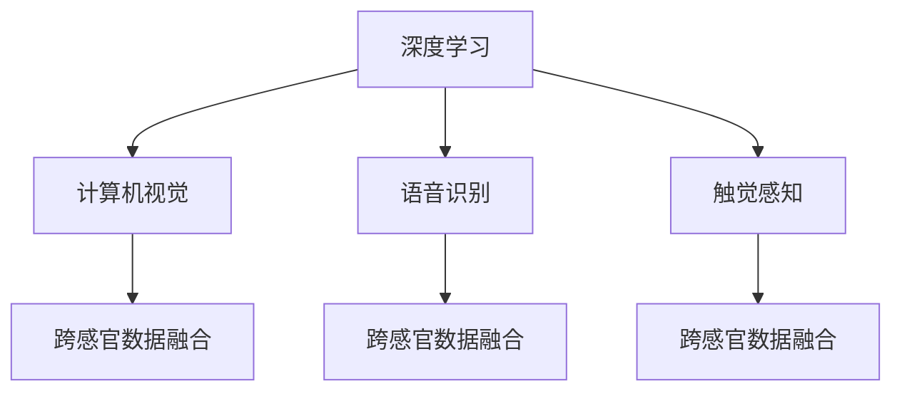

                 

# 数字化感知：AI增强人类感官

## 1. 背景介绍

在数字化时代，人类感官不断被技术所增强和扩展，人类对世界的感知不再局限于自身的感觉器官，而是借助AI技术实现了前所未有的突破。这种数字化感知不仅丰富了人类的感知维度，也为各个领域的应用提供了可能，从智能家居到虚拟现实，从医疗诊断到艺术创作，AI技术正在开启一场感官革命。

### 1.1 问题由来

随着信息技术的发展，特别是深度学习和计算机视觉的进步，人类感官的数字化增强已经成为一个热门话题。AI技术，尤其是深度学习，通过模拟人类感官的感知过程，实现了对声音、图像、触觉等感官数据的高级处理。这种技术的发展使得我们能够突破物理局限，实现虚拟感知，从而在医疗、教育、娱乐等领域带来了革命性的变革。

### 1.2 问题核心关键点

数字化感知的核心在于AI技术如何模拟和增强人类感官的感知能力。关键点包括：

- 深度学习模型如何学习并处理感官数据。
- 如何实现跨感官数据的融合和转换。
- 在实际应用中，如何将数字化感知技术嵌入到各类产品和服务中。
- 如何确保数字化感知技术的可靠性和安全性。

本文将详细探讨这些核心问题，帮助读者理解数字化感知的技术原理和应用前景。

## 2. 核心概念与联系

### 2.1 核心概念概述

为了更好地理解数字化感知，我们需要了解以下几个核心概念：

- 深度学习（Deep Learning）：一种模拟人脑神经网络的人工智能技术，通过多层次的神经元网络对感官数据进行高级处理。
- 计算机视觉（Computer Vision）：使用计算机处理和分析图像和视频数据的领域，是实现数字化感知的重要技术之一。
- 语音识别（Speech Recognition）：将语音转换为文本的技术，实现了语音输入的数字化感知。
- 触觉感知（Tactile Perception）：通过传感器和机器学习算法，模拟人类触觉的感知能力，如机器人触觉、虚拟现实触觉等。
- 跨感官数据融合（Cross-Sensory Data Fusion）：将不同感官的数据进行融合，提升整体感知效果。

这些概念之间的联系可以通过以下Mermaid流程图来展示：



这个流程图展示了深度学习与其他感官处理技术之间的联系：

- 深度学习为其他感官技术提供了基础处理能力。
- 计算机视觉、语音识别、触觉感知等技术各自处理特定类型的感官数据。
- 跨感官数据融合将这些感官数据进行整合，提升整体的感知效果。

## 3. 核心算法原理 & 具体操作步骤
### 3.1 算法原理概述

数字化感知的核心算法原理是基于深度学习模型的感知处理。其基本流程如下：

1. 数据采集：使用传感器和设备采集各类感官数据。
2. 预处理：对采集的数据进行去噪、归一化等预处理操作。
3. 特征提取：通过深度学习模型提取数据的特征。
4. 感知处理：将特征输入到深度学习模型中，进行高级处理，如分类、识别、生成等。
5. 输出反馈：将感知处理的结果输出，用于后续的决策和应用。

### 3.2 算法步骤详解

以下是一个基于深度学习的数字化感知算法示例，主要针对计算机视觉和语音识别两个领域：

#### 3.2.1 计算机视觉

**算法步骤：**

1. **数据准备**：
   - 收集标注好的图像数据集，如ImageNet、COCO等。
   - 将图像转换为标准格式，如TensorFlow格式。

2. **模型选择**：
   - 选择预训练模型，如VGG、ResNet等。
   - 使用迁移学习或微调技术，调整模型参数以适应具体任务。

3. **模型训练**：
   - 定义损失函数，如交叉熵、均方误差等。
   - 使用随机梯度下降（SGD）或Adam优化算法，对模型进行训练。

4. **模型评估**：
   - 使用测试集对模型进行评估，计算准确率、召回率等指标。
   - 根据评估结果调整模型参数，进行多次迭代优化。

5. **模型部署**：
   - 将训练好的模型导出为模型文件。
   - 在实际应用中，将模型文件加载到相应设备或平台，实现感知处理。

**代码实现示例：**

```python
import tensorflow as tf
from tensorflow.keras import layers

# 数据准备
data = ...

# 模型选择
model = tf.keras.Sequential([
    layers.Conv2D(32, (3,3), activation='relu', input_shape=(224,224,3)),
    layers.MaxPooling2D((2,2)),
    layers.Conv2D(64, (3,3), activation='relu'),
    layers.MaxPooling2D((2,2)),
    layers.Flatten(),
    layers.Dense(64, activation='relu'),
    layers.Dense(num_classes, activation='softmax')
])

# 模型训练
model.compile(optimizer='adam', loss='categorical_crossentropy', metrics=['accuracy'])
model.fit(data, epochs=10)

# 模型评估
test_data = ...
test_loss, test_acc = model.evaluate(test_data)

# 模型部署
model.save('model.h5')
```

#### 3.2.2 语音识别

**算法步骤：**

1. **数据准备**：
   - 收集标注好的音频数据集，如LibriSpeech、Speech Commands等。
   - 将音频转换为频谱图，如Mel-spectrogram。

2. **模型选择**：
   - 选择预训练模型，如DeepSpeech、Wav2Vec等。
   - 使用迁移学习或微调技术，调整模型参数以适应具体任务。

3. **模型训练**：
   - 定义损失函数，如CTC（Connectionist Temporal Classification）损失。
   - 使用随机梯度下降（SGD）或Adam优化算法，对模型进行训练。

4. **模型评估**：
   - 使用测试集对模型进行评估，计算准确率、召回率等指标。
   - 根据评估结果调整模型参数，进行多次迭代优化。

5. **模型部署**：
   - 将训练好的模型导出为模型文件。
   - 在实际应用中，将模型文件加载到相应设备或平台，实现语音识别。

**代码实现示例：**

```python
import tensorflow as tf
from tensorflow.keras import layers

# 数据准备
data = ...

# 模型选择
model = tf.keras.Sequential([
    layers.Conv2D(32, (3,3), activation='relu', input_shape=(128,128,1)),
    layers.MaxPooling2D((2,2)),
    layers.Conv2D(64, (3,3), activation='relu'),
    layers.MaxPooling2D((2,2)),
    layers.Flatten(),
    layers.Dense(64, activation='relu'),
    layers.Dense(num_classes, activation='softmax')
])

# 模型训练
model.compile(optimizer='adam', loss='categorical_crossentropy', metrics=['accuracy'])
model.fit(data, epochs=10)

# 模型评估
test_data = ...
test_loss, test_acc = model.evaluate(test_data)

# 模型部署
model.save('model.h5')
```

### 3.3 算法优缺点

基于深度学习的数字化感知算法具有以下优点：

- **高效处理**：深度学习模型能够处理大量数据，自动提取高级特征，高效地进行感知处理。
- **灵活性高**：通过迁移学习和微调，模型能够快速适应不同的应用场景和数据类型。
- **可扩展性**：不同领域的数据和任务可以并行处理，提升整体感知能力。

同时，这些算法也存在以下缺点：

- **资源消耗大**：深度学习模型需要大量的计算资源和存储空间，对硬件要求较高。
- **模型解释性差**：深度学习模型通常被视为"黑箱"，难以解释其内部的决策过程。
- **训练时间长**：模型训练需要大量时间，对于大规模数据集和复杂任务，训练时间可能较长。

### 3.4 算法应用领域

数字化感知技术在多个领域得到了广泛应用，以下是几个主要领域：

#### 3.4.1 智能家居

智能家居中，数字化感知技术可以通过传感器和设备获取各类环境数据，如温度、湿度、光线、声音等。通过对这些数据进行处理和分析，智能家居系统可以实现自适应控制和决策，提升用户的生活质量。

#### 3.4.2 医疗诊断

在医疗领域，数字化感知技术可以通过计算机视觉和语音识别，对医学图像和病历进行分析和处理。如使用深度学习模型对X光片进行自动诊断，使用语音识别系统对医生诊断进行辅助。

#### 3.4.3 自动驾驶

自动驾驶中，数字化感知技术通过传感器获取道路和环境信息，结合计算机视觉和语音识别技术，实现智能决策和控制。如使用计算机视觉进行车道识别、交通信号识别，使用语音识别进行人机交互。

## 4. 数学模型和公式 & 详细讲解  
### 4.1 数学模型构建

基于深度学习的数字化感知模型主要由以下几个部分组成：

- **输入层**：接收感官数据，如图像、音频等。
- **卷积层和池化层**：对输入数据进行特征提取和降维。
- **全连接层**：将特征映射到具体的感知任务，如分类、识别等。
- **输出层**：根据具体任务定义输出格式，如分类概率、回归值等。

### 4.2 公式推导过程

以下以计算机视觉中的分类任务为例，推导深度学习模型的数学模型和损失函数。

**输入层**：假设输入图像的尺寸为$H \times W$，将图像转换为一维向量$X \in \mathbb{R}^{H \times W \times C}$，其中$C$为通道数。

**卷积层和池化层**：使用卷积层和池化层对输入进行特征提取，得到特征图$Y \in \mathbb{R}^{k \times k \times C'}$，其中$C'$为卷积层输出通道数，$k$为特征图尺寸。

**全连接层**：将特征图展开为一维向量$Z \in \mathbb{R}^{N}$，其中$N = k \times k \times C'$。定义一个全连接层$\theta \in \mathbb{R}^{N \times D}$，得到输出$\hat{Y} \in \mathbb{R}^{D}$，其中$D$为输出维度。

**损失函数**：定义交叉熵损失函数$L$，计算预测输出与真实标签之间的差异：
$$
L(Y, \hat{Y}) = -\frac{1}{N} \sum_{i=1}^{N} \sum_{j=1}^{D} y_j \log \hat{y}_j
$$
其中$y$为真实标签，$\hat{y}$为模型预测输出。

### 4.3 案例分析与讲解

以ImageNet数据集为例，介绍深度学习模型在图像分类任务中的应用。

**数据准备**：
- 收集并标注大量图像数据，分为训练集和测试集。
- 将图像转换为TensorFlow格式。

**模型选择**：
- 选择预训练模型，如VGG、ResNet等。
- 使用迁移学习或微调技术，调整模型参数以适应具体任务。

**模型训练**：
- 定义交叉熵损失函数$L$。
- 使用随机梯度下降（SGD）或Adam优化算法，对模型进行训练。

**模型评估**：
- 使用测试集对模型进行评估，计算准确率、召回率等指标。
- 根据评估结果调整模型参数，进行多次迭代优化。

**模型部署**：
- 将训练好的模型导出为模型文件。
- 在实际应用中，将模型文件加载到相应设备或平台，实现图像分类。

## 5. 项目实践：代码实例和详细解释说明
### 5.1 开发环境搭建

在进行数字化感知项目实践前，我们需要准备好开发环境。以下是使用Python进行TensorFlow开发的环境配置流程：

1. 安装Anaconda：从官网下载并安装Anaconda，用于创建独立的Python环境。

2. 创建并激活虚拟环境：
```bash
conda create -n tensorflow-env python=3.8 
conda activate tensorflow-env
```

3. 安装TensorFlow：根据CUDA版本，从官网获取对应的安装命令。例如：
```bash
conda install tensorflow -c tf
```

4. 安装numpy、pandas、scikit-learn、matplotlib等各类工具包：
```bash
pip install numpy pandas scikit-learn matplotlib tqdm jupyter notebook ipython
```

完成上述步骤后，即可在`tensorflow-env`环境中开始数字化感知项目实践。

### 5.2 源代码详细实现

下面我们以计算机视觉的图像分类任务为例，给出使用TensorFlow实现数字化感知模型的代码实现。

**代码实现示例：**

```python
import tensorflow as tf
from tensorflow.keras import layers

# 数据准备
data = ...

# 模型选择
model = tf.keras.Sequential([
    layers.Conv2D(32, (3,3), activation='relu', input_shape=(224,224,3)),
    layers.MaxPooling2D((2,2)),
    layers.Conv2D(64, (3,3), activation='relu'),
    layers.MaxPooling2D((2,2)),
    layers.Flatten(),
    layers.Dense(64, activation='relu'),
    layers.Dense(num_classes, activation='softmax')
])

# 模型训练
model.compile(optimizer='adam', loss='categorical_crossentropy', metrics=['accuracy'])
model.fit(data, epochs=10)

# 模型评估
test_data = ...
test_loss, test_acc = model.evaluate(test_data)

# 模型部署
model.save('model.h5')
```

### 5.3 代码解读与分析

让我们再详细解读一下关键代码的实现细节：

**数据准备**：
- `data`：包含标注好的图像数据集，分为训练集和测试集。

**模型选择**：
- `model`：使用TensorFlow Sequential模型，定义了卷积层、池化层、全连接层和输出层。

**模型训练**：
- `compile`：定义交叉熵损失函数和优化算法。
- `fit`：对模型进行训练，指定训练轮数和批次大小。

**模型评估**：
- `evaluate`：对模型进行评估，输出准确率和损失函数值。

**模型部署**：
- `save`：将训练好的模型导出为模型文件。

## 6. 实际应用场景
### 6.1 智能家居

智能家居中，数字化感知技术可以通过传感器和设备获取各类环境数据，如温度、湿度、光线、声音等。通过对这些数据进行处理和分析，智能家居系统可以实现自适应控制和决策，提升用户的生活质量。

**应用场景**：
- **智能照明系统**：根据房间内光线和用户行为，自动调节照明亮度和色彩。
- **智能空调系统**：根据室内温度和湿度，自动调节空调状态，提升舒适性。
- **智能安防系统**：通过语音识别和图像识别，自动检测异常行为和入侵，及时报警。

### 6.2 医疗诊断

在医疗领域，数字化感知技术可以通过计算机视觉和语音识别，对医学图像和病历进行分析和处理。如使用深度学习模型对X光片进行自动诊断，使用语音识别系统对医生诊断进行辅助。

**应用场景**：
- **医学图像分析**：使用深度学习模型对X光片、CT、MRI等医学图像进行自动诊断，辅助医生进行疾病检测。
- **病历文本分析**：使用自然语言处理技术对病历文本进行分析和理解，辅助医生进行病情诊断和治疗决策。

### 6.3 自动驾驶

自动驾驶中，数字化感知技术通过传感器获取道路和环境信息，结合计算机视觉和语音识别技术，实现智能决策和控制。如使用计算机视觉进行车道识别、交通信号识别，使用语音识别进行人机交互。

**应用场景**：
- **自动驾驶车辆**：使用计算机视觉和语音识别技术，对道路和环境进行实时感知，实现自主驾驶。
- **智能交通系统**：使用计算机视觉技术，对交通信号和路标进行识别，优化交通管理。

## 7. 工具和资源推荐
### 7.1 学习资源推荐

为了帮助开发者系统掌握数字化感知技术，以下是一些优质的学习资源：

1. 《深度学习》书籍：由Ian Goodfellow、Yoshua Bengio和Aaron Courville合著，全面介绍了深度学习的原理和应用。
2. 《计算机视觉：算法与应用》书籍：由Richard Szeliski撰写，介绍了计算机视觉的算法和应用案例。
3. 《TensorFlow官方文档》：官方文档详细介绍了TensorFlow的使用方法，包含丰富的代码示例和教程。
4. Udacity深度学习课程：Udacity提供了一系列深度学习课程，涵盖了从基础到高级的深度学习知识。
5. Coursera深度学习专项课程：Coursera提供了一系列深度学习专项课程，由Andrew Ng等知名教授授课。

通过这些资源的学习实践，相信你一定能够快速掌握数字化感知技术的精髓，并用于解决实际的感知问题。

### 7.2 开发工具推荐

高效的开发离不开优秀的工具支持。以下是几款用于数字化感知开发的常用工具：

1. TensorFlow：基于Python的开源深度学习框架，灵活动态的计算图，适合快速迭代研究。大部分深度学习模型都有TensorFlow版本的实现。
2. PyTorch：由Facebook开发的深度学习框架，灵活性高，易于使用，适合研究型项目。
3. OpenCV：开源计算机视觉库，提供了丰富的图像处理和计算机视觉算法。
4. Kaldi：开源语音识别框架，提供了丰富的语音处理和识别算法。
5. Jupyter Notebook：交互式笔记本环境，适合进行数据探索、算法实现和结果展示。

合理利用这些工具，可以显著提升数字化感知任务的开发效率，加快创新迭代的步伐。

### 7.3 相关论文推荐

数字化感知技术的发展源于学界的持续研究。以下是几篇奠基性的相关论文，推荐阅读：

1. AlexNet: One Hundred Layers and the True Beginnings of Deep Learning（ImageNet论文）：提出AlexNet模型，开创了深度学习在图像识别领域的先河。
2. Inception Networks：提出Inception模块，优化了深度学习模型的计算效率和准确率。
3. ResNet: Deep Residual Learning for Image Recognition：提出ResNet模型，解决了深度学习模型的梯度消失问题，提升了深度学习模型的训练效果。
4. VGGNet: Very Deep Convolutional Networks for Large-Scale Image Recognition：提出VGGNet模型，展示了深度网络在图像分类中的强大能力。
5. Speech2TextSystem（Google Speech-to-Text论文）：介绍了Google Speech-to-Text系统的实现方法和技术细节。

这些论文代表了大规模深度学习在计算机视觉和语音识别领域的进展，对理解数字化感知技术具有重要意义。

## 8. 总结：未来发展趋势与挑战

### 8.1 总结

本文对基于深度学习的数字化感知技术进行了全面系统的介绍。首先阐述了数字化感知技术的研究背景和意义，明确了数字化感知在智能家居、医疗诊断、自动驾驶等领域的巨大应用潜力。其次，从原理到实践，详细讲解了深度学习模型的构建和训练过程，给出了数字化感知任务开发的完整代码实例。同时，本文还广泛探讨了数字化感知技术在各个领域的应用前景，展示了数字化感知技术的广阔前景。

通过本文的系统梳理，可以看到，深度学习模型在数字化感知中的应用，正在引领一场感官革命，提升人类的感知维度，改变我们的生活和工作方式。未来，伴随深度学习技术的不断演进，数字化感知技术必将在更多领域得到应用，为人类带来前所未有的变革。

### 8.2 未来发展趋势

展望未来，数字化感知技术将呈现以下几个发展趋势：

1. **技术融合**：数字化感知技术与其他AI技术（如自然语言处理、强化学习等）进行更深入的融合，实现跨领域的技术突破。
2. **多模态感知**：将不同感官的数据进行融合，提升整体的感知效果，实现视觉、听觉、触觉等多模态的感知能力。
3. **实时性提升**：通过硬件加速和算法优化，提升数字化感知技术的实时性，实现更加流畅、高效的感知应用。
4. **模型可解释性**：研究如何赋予深度学习模型更强的可解释性，增强其决策过程的透明性和可靠性。
5. **跨领域应用**：将数字化感知技术应用于更多垂直行业，如教育、金融、艺术等，推动各个领域的智能化发展。

这些趋势凸显了数字化感知技术的广阔前景，也为未来研究指明了方向。

### 8.3 面临的挑战

尽管数字化感知技术已经取得了瞩目成就，但在迈向更加智能化、普适化应用的过程中，它仍面临着诸多挑战：

1. **资源消耗大**：深度学习模型需要大量的计算资源和存储空间，对硬件要求较高。
2. **模型解释性差**：深度学习模型通常被视为"黑箱"，难以解释其内部的决策过程。
3. **训练时间长**：模型训练需要大量时间，对于大规模数据集和复杂任务，训练时间可能较长。
4. **数据隐私问题**：数字化感知技术需要大量的数据支持，如何保护用户数据隐私成为一大难题。
5. **模型鲁棒性**：深度学习模型在面对噪声、干扰等情况下，容易出现错误决策。

### 8.4 研究展望

面对数字化感知技术所面临的挑战，未来的研究需要在以下几个方面寻求新的突破：

1. **资源优化**：研究如何优化深度学习模型的计算图，降低资源消耗，实现轻量级、实时性的部署。
2. **模型可解释性**：研究如何赋予深度学习模型更强的可解释性，增强其决策过程的透明性和可靠性。
3. **多模态感知**：研究如何将不同感官的数据进行融合，提升整体的感知效果。
4. **跨领域应用**：将数字化感知技术应用于更多垂直行业，推动各个领域的智能化发展。
5. **数据隐私保护**：研究如何在保护用户数据隐私的同时，实现高效的感知处理。

这些研究方向的探索，必将引领数字化感知技术迈向更高的台阶，为构建安全、可靠、可解释、可控的智能系统铺平道路。面向未来，数字化感知技术还需要与其他AI技术进行更深入的融合，共同推动自然语言理解和智能交互系统的进步。只有勇于创新、敢于突破，才能不断拓展数字化感知技术的边界，让人工智能技术更好地造福人类社会。

## 9. 附录：常见问题与解答

**Q1：如何选择合适的深度学习模型？**

A: 选择合适的深度学习模型需要考虑以下几个因素：
1. 任务类型：不同类型的任务需要不同的模型。例如，图像分类可以使用卷积神经网络（CNN），语音识别可以使用循环神经网络（RNN）或长短期记忆网络（LSTM）。
2. 数据量：数据量较小时，可以选择轻量级模型；数据量较大时，可以选择更大型的模型。
3. 计算资源：计算资源有限时，可以选择参数较少的模型。

**Q2：深度学习模型在训练过程中需要注意哪些问题？**

A: 深度学习模型在训练过程中需要注意以下几个问题：
1. 过拟合：使用正则化技术，如L2正则化、Dropout等，避免过拟合。
2. 欠拟合：增加模型复杂度，或使用更高级的模型。
3. 学习率：选择合适的学习率，避免过拟合或欠拟合。
4. 梯度消失或爆炸：使用梯度裁剪、归一化等技术，避免梯度消失或爆炸。
5. 数据预处理：对数据进行归一化、标准化等预处理，提升模型的训练效果。

**Q3：深度学习模型在部署过程中需要注意哪些问题？**

A: 深度学习模型在部署过程中需要注意以下几个问题：
1. 模型裁剪：去除不必要的层和参数，减小模型尺寸，加快推理速度。
2. 量化加速：将浮点模型转为定点模型，压缩存储空间，提高计算效率。
3. 服务化封装：将模型封装为标准化服务接口，便于集成调用。
4. 弹性伸缩：根据请求流量动态调整资源配置，平衡服务质量和成本。
5. 监控告警：实时采集系统指标，设置异常告警阈值，确保服务稳定性。

**Q4：数字化感知技术在实际应用中需要注意哪些问题？**

A: 数字化感知技术在实际应用中需要注意以下几个问题：
1. 数据质量：确保输入的数据质量，避免噪声和干扰。
2. 环境适应性：确保模型在不同环境下的鲁棒性和稳定性。
3. 用户隐私：保护用户数据隐私，避免数据泄露。
4. 实时性：确保模型的实时性和响应速度，避免延迟。
5. 可解释性：确保模型的决策过程透明，便于用户理解和信任。

---

作者：禅与计算机程序设计艺术 / Zen and the Art of Computer Programming

