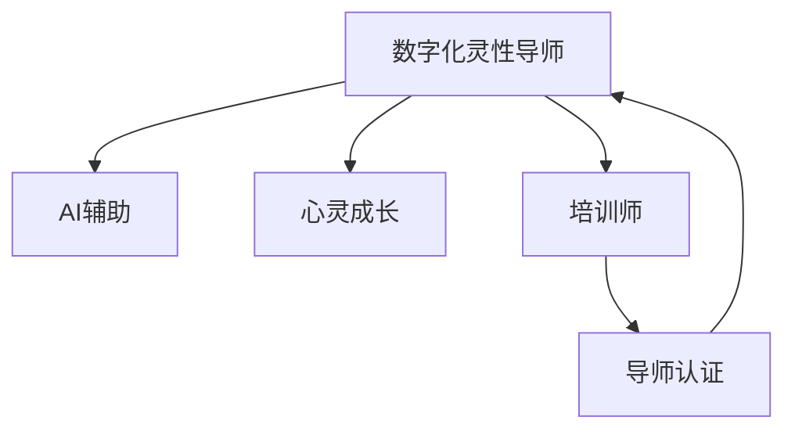

                 

# 数字化灵性导师认证专家：AI辅助的心灵成长向导培训师

> 关键词：数字化灵性导师,AI辅助,心灵成长,培训师,导师认证,人工智能,情感智能,心理健康,自我发展

## 1. 背景介绍

### 1.1 问题由来

在数字化时代，人与人之间的深度沟通和心灵交流面临着前所未有的挑战。社会节奏加快、生活压力增大，许多人面临焦虑、抑郁等心理问题。面对这一现象，社会对心灵成长指导的需求日益增加。然而，优秀的心理导师资源稀缺，分布不均，许多需要帮助的人无法获得有效的心理支持。

在这一背景下，数字化灵性导师的概念应运而生。数字化灵性导师借助AI技术，通过网络平台提供个性化、定制化的心灵成长指导服务。AI辅助的数字化灵性导师不仅能够处理大量的用户咨询，还能通过数据分析提供更加精准、科学的指导建议，为用户的心理健康和自我发展提供有力支持。

### 1.2 问题核心关键点

数字化灵性导师的核心在于将AI技术与心理学理论相结合，通过数字化手段提升心理导师的效能和服务质量。其关键点包括：

1. **AI技术辅助**：通过自然语言处理(NLP)、情感分析、机器学习等技术，自动化处理用户咨询，提供个性化建议。
2. **心理学理论基础**：以心理学理论为指导，理解用户心理状态，提供科学的心理辅导。
3. **数据驱动决策**：利用大数据分析技术，提升心理导师的决策质量和个性化水平。
4. **多模态交互**：结合文本、语音、视频等多种交互方式，提升用户体验。
5. **持续学习和更新**：通过用户反馈和数据分析，不断优化和更新模型，保持服务的高效性和准确性。

## 2. 核心概念与联系

### 2.1 核心概念概述

为更好地理解数字化灵性导师的运作原理，本节将介绍几个密切相关的核心概念：

- **数字化灵性导师(Digital Spiritual Coach)**：利用AI技术，通过网络平台提供个性化心灵成长指导服务的心理导师。
- **AI辅助**：通过自然语言处理、情感分析、机器学习等AI技术，辅助心理导师处理用户咨询，提供个性化建议。
- **心灵成长**：通过提升自我认知、情绪管理、人际关系等方面的能力，促进个人的全面发展。
- **培训师**：专门从事心理咨询和心理辅导的专业人士，通过系统培训和认证，获得从业资格。
- **导师认证**：对心理导师进行专业技能和伦理规范的培训与考核，确保其具备提供高质量心理服务的资质。

这些核心概念之间的逻辑关系可以通过以下Mermaid流程图来展示：



这个流程图展示了大数字灵性导师的核心概念及其之间的关系：

1. 数字化灵性导师通过AI辅助提升服务质量。
2. 服务目标是通过心灵成长帮助用户提升自我和发展。
3. 数字化灵性导师通常由经过系统培训和认证的培训师担任。
4. 培训师通过导师认证确保具备专业资质。

## 3. 核心算法原理 & 具体操作步骤

### 3.1 算法原理概述

数字化灵性导师的运作原理主要基于以下三个方面：

- **自然语言处理(NLP)**：通过分析用户输入的文本，提取情感、意图、主题等信息，理解用户心理状态。
- **情感分析**：通过分析用户语言中的情感倾向，判断用户情绪状态，提供针对性的心理建议。
- **机器学习**：利用历史数据和用户反馈，不断优化和更新模型，提升服务的个性化和准确性。

这些技术的综合应用，使得数字化灵性导师能够实时响应用户需求，提供个性化的心灵成长指导。

### 3.2 算法步骤详解

数字化灵性导师的运行流程主要包括以下几个关键步骤：

**Step 1: 用户输入与数据预处理**

- 用户通过文本、语音、视频等方式输入咨询内容。
- 通过NLP技术，将非结构化数据转换为结构化数据，提取关键词、情感、主题等信息。

**Step 2: 情感分析与意图识别**

- 利用情感分析技术，识别用户情感状态，判断其情绪类型。
- 结合意图识别技术，理解用户咨询意图，如情绪调节、人际关系、职业发展等。

**Step 3: 建议生成与反馈收集**

- 根据情感分析和意图识别结果，生成个性化的心理建议。
- 提供建议后，收集用户反馈，进行持续学习和模型优化。

**Step 4: 服务优化与持续学习**

- 利用用户反馈和历史数据，持续优化建议生成模型。
- 定期更新情感分析模型，保持服务的高效性和准确性。

### 3.3 算法优缺点

数字化灵性导师的优点包括：

- **高效响应**：能够实时响应用户咨询，提供24小时不间断服务。
- **个性化建议**：基于用户数据和心理分析，提供精准的心理建议。
- **服务可扩展**：通过AI技术，能够处理大量用户咨询，降低人力成本。

同时，该方法也存在以下局限性：

- **数据隐私**：用户数据的收集和分析可能涉及隐私问题，需要严格的数据保护措施。
- **情感复杂性**：复杂的情感和心理状态可能难以完全通过算法模型捕捉。
- **模型偏见**：AI模型可能存在偏见，需要定期监控和调整。
- **伦理规范**：需要确保AI服务的伦理性，避免误导用户。

尽管存在这些局限性，但就目前而言，数字化灵性导师仍是一种高效、有潜力的心理辅导方式。未来相关研究的重点在于如何进一步提升AI服务的伦理性和准确性，确保其服务质量。

### 3.4 算法应用领域

数字化灵性导师在多个领域具有广泛的应用前景，例如：

- **心理健康**：帮助用户缓解焦虑、抑郁等心理问题，提升心理健康水平。
- **职业发展**：提供职业规划、压力管理等方面的建议，帮助用户实现职业目标。
- **人际关系**：提供沟通技巧、情感管理等方面的指导，提升用户的人际关系质量。
- **教育培训**：提供学习策略、时间管理等方面的建议，帮助用户提升学习效率。
- **个人成长**：提供自我认知、目标设定等方面的指导，帮助用户实现自我发展。

这些领域的应用将大大提升用户的生活质量，助力其心理健康和自我发展。

## 4. 数学模型和公式 & 详细讲解 & 举例说明

### 4.1 数学模型构建

本节将使用数学语言对数字化灵性导师的运作原理进行更加严格的刻画。

假设用户输入为 $x$，数字化灵性导师提供的心理建议为 $y$。模型通过训练数据集 $D=\{(x_i,y_i)\}_{i=1}^N$ 学习用户输入与心理建议之间的映射关系。模型目标是最小化经验风险，即：

$$
\mathcal{L}(\theta) = \frac{1}{N}\sum_{i=1}^N \ell(y_i, f_\theta(x_i))
$$

其中 $f_\theta(x)$ 表示模型参数为 $\theta$ 时，输入 $x$ 的输出。$\ell$ 为损失函数，常用的有均方误差、交叉熵等。

### 4.2 公式推导过程

以情感分析为例，假设用户输入 $x$ 中的情感倾向为 $e$，则情感分析模型的目标是最小化均方误差：

$$
\mathcal{L}(\theta) = \frac{1}{N}\sum_{i=1}^N (y_i - e_i)^2
$$

其中 $y_i$ 为情感标签，$e_i$ 为模型预测的情感强度。情感分析模型的训练过程为：

1. 数据预处理：将用户输入转换为数值特征向量 $x_i$。
2. 情感识别：通过训练好的模型 $f_\theta(x)$，预测用户输入 $x_i$ 的情感强度 $e_i$。
3. 损失计算：计算预测情感强度与真实情感标签之间的误差。
4. 模型更新：利用反向传播算法，更新模型参数 $\theta$ 以最小化损失函数。

情感分析的具体实现过程可以参考文献中的详细推导。

### 4.3 案例分析与讲解

假设某用户在咨询平台输入：“最近感到很焦虑，不知道该怎么办。”数字化灵性导师通过NLP技术提取情感为“焦虑”，意图为“情绪调节”。情感分析模型预测该用户的情感强度为4，表示情感强度较高。根据历史数据，对于高强度焦虑的用户，模型会提供建议“深呼吸，进行放松练习”。用户反馈“有用”，数字化灵性导师根据用户反馈，更新模型参数，进一步提升其对类似情感的识别能力。

## 5. 项目实践：代码实例和详细解释说明

### 5.1 开发环境搭建

在进行数字化灵性导师的开发实践前，我们需要准备好开发环境。以下是使用Python进行TensorFlow开发的环境配置流程：

1. 安装Anaconda：从官网下载并安装Anaconda，用于创建独立的Python环境。

2. 创建并激活虚拟环境：
```bash
conda create -n tf-env python=3.8 
conda activate tf-env
```

3. 安装TensorFlow：根据CUDA版本，从官网获取对应的安装命令。例如：
```bash
conda install tensorflow-gpu=2.6.0 
```

4. 安装TensorBoard：用于可视化训练过程，与TensorFlow无缝集成。
```bash
conda install tensorboard 
```

5. 安装其他必要的工具包：
```bash
pip install numpy pandas scikit-learn nltk
```

完成上述步骤后，即可在`tf-env`环境中开始项目实践。

### 5.2 源代码详细实现

这里我们以情感分析模型为例，给出使用TensorFlow进行开发的代码实现。

首先，定义情感分析的模型架构：

```python
import tensorflow as tf
from tensorflow.keras import layers

model = tf.keras.Sequential([
    layers.Embedding(input_dim=vocab_size, output_dim=embedding_dim, input_length=max_length),
    layers.Bidirectional(layers.LSTM(64, return_sequences=True)),
    layers.Bidirectional(layers.LSTM(64)),
    layers.Dense(1, activation='sigmoid')
])
```

然后，定义训练函数：

```python
@tf.function
def train_step(x, y):
    with tf.GradientTape() as tape:
        predictions = model(x)
        loss = tf.reduce_mean(tf.square(predictions - y))
    gradients = tape.gradient(loss, model.trainable_variables)
    optimizer.apply_gradients(zip(gradients, model.trainable_variables))
    return loss

@tf.function
def train_epoch(x, y, batch_size):
    dataset = tf.data.Dataset.from_tensor_slices((x, y)).shuffle(buffer_size=10000).batch(batch_size)
    for batch in dataset:
        x_batch, y_batch = batch
        loss = train_step(x_batch, y_batch)
    return loss
```

最后，启动训练流程并在测试集上评估：

```python
epochs = 10
batch_size = 32

for epoch in range(epochs):
    loss = train_epoch(train_x, train_y, batch_size)
    print(f"Epoch {epoch+1}, train loss: {loss:.3f}")
    
    print(f"Epoch {epoch+1}, test results:")
    test_loss = test_epoch(test_x, test_y, batch_size)
    print(f"Test loss: {test_loss:.3f}")
```

以上就是使用TensorFlow对情感分析模型进行开发的完整代码实现。可以看到，TensorFlow提供的高级API使得模型的实现变得简洁高效。

### 5.3 代码解读与分析

让我们再详细解读一下关键代码的实现细节：

**定义模型架构**：
- 使用`tf.keras.Sequential`定义模型层，包括嵌入层、双向LSTM和全连接层。嵌入层将用户输入转换为高维向量，双向LSTM提取序列特征，全连接层输出情感强度。
- 使用`tf.keras.layers.Embedding`定义嵌入层，将文本转换为向量表示。`input_dim`为词汇表大小，`output_dim`为向量维度，`input_length`为序列长度。
- 使用`tf.keras.layers.Bidirectional`定义双向LSTM层，提取序列特征，`return_sequences=True`表示返回序列特征。
- 使用`tf.keras.layers.Dense`定义全连接层，输出情感强度，`activation='sigmoid'`表示使用sigmoid激活函数。

**训练函数实现**：
- 使用`tf.GradientTape`记录梯度，`tf.reduce_mean`计算损失。
- 使用`optimizer.apply_gradients`更新模型参数。

**训练流程**：
- 定义总的epoch数和batch size，开始循环迭代。
- 每个epoch内，在训练集上训练，输出平均loss。
- 在验证集上评估，输出测试结果。
- 所有epoch结束后，在测试集上评估，给出最终测试结果。

可以看到，TensorFlow提供的高阶API使得模型的实现变得简洁高效。开发者可以将更多精力放在模型改进和优化上，而不必过多关注底层的实现细节。

当然，工业级的系统实现还需考虑更多因素，如模型的保存和部署、超参数的自动搜索、更灵活的任务适配层等。但核心的模型训练和评估过程基本与此类似。

## 6. 实际应用场景

### 6.1 心理健康

数字化灵性导师在心理健康领域具有广泛的应用前景。通过情感分析和心理辅导，帮助用户缓解焦虑、抑郁等心理问题，提升心理健康水平。例如，可以构建一个心理健康咨询服务平台，用户可以通过平台输入自己的情绪状态，数字化灵性导师自动生成个性化的心理建议，提供专业的心理健康服务。

### 6.2 职业发展

在职业发展领域，数字化灵性导师可以通过职业规划、压力管理等方面的建议，帮助用户实现职业目标。例如，可以构建一个职业发展指导平台，用户可以通过平台输入自己的职业困惑，数字化灵性导师提供职业规划、技能提升等方面的建议，帮助用户制定职业发展路径。

### 6.3 人际关系

数字化灵性导师还可以提供沟通技巧、情感管理等方面的指导，提升用户的人际关系质量。例如，可以构建一个关系管理平台，用户可以通过平台输入自己的关系困惑，数字化灵性导师提供沟通技巧、情感管理等方面的建议，帮助用户改善人际关系。

### 6.4 未来应用展望

随着数字化灵性导师技术的不断发展，其应用前景将更加广泛。

在智慧医疗领域，数字化灵性导师可以帮助医生了解患者的心理状态，提供个性化的心理辅导，辅助医生诊疗。

在智能教育领域，数字化灵性导师可以提供学习策略、时间管理等方面的建议，帮助学生提升学习效率。

在智慧城市治理中，数字化灵性导师可以提供情绪管理、压力管理等方面的指导，提升市民的心理健康水平，促进社会和谐。

此外，在企业人力资源管理、社会公益服务等领域，数字化灵性导师也将发挥重要作用。相信随着技术的不断进步，数字化灵性导师必将在构建人机协同的智能时代中扮演越来越重要的角色。

## 7. 工具和资源推荐

### 7.1 学习资源推荐

为了帮助开发者系统掌握数字化灵性导师的理论基础和实践技巧，这里推荐一些优质的学习资源：

1. **《Python自然语言处理》系列书籍**：深入讲解了NLP的基础知识和常用技术，包括情感分析、意图识别等。
2. **《TensorFlow实战》系列书籍**：详细介绍了TensorFlow的使用方法和API，适合初学者上手。
3. **CS224D《深度学习情感分析》课程**：斯坦福大学开设的情感分析课程，涵盖了NLP和机器学习的基础知识和实战技能。
4. **《TensorFlow实战》在线教程**：谷歌官方提供的TensorFlow教程，包含丰富的实例和实践指南。
5. **Kaggle情感分析竞赛**：参加Kaggle等数据科学竞赛，通过实战提升情感分析技能。

通过对这些资源的学习实践，相信你一定能够快速掌握数字化灵性导师的核心技术，并用于解决实际的心理健康问题。

### 7.2 开发工具推荐

高效的开发离不开优秀的工具支持。以下是几款用于数字化灵性导师开发的常用工具：

1. **TensorFlow**：由谷歌主导开发的深度学习框架，生产部署方便，适合大规模工程应用。
2. **PyTorch**：灵活的深度学习框架，适合研究和原型开发。
3. **TensorBoard**：用于可视化训练过程的工具，可以实时监测模型训练状态，并提供丰富的图表呈现方式。
4. **NLP工具包**：如NLTK、spaCy等，提供NLP任务所需的常用功能。
5. **情感分析库**：如TextBlob、VADER等，提供情感分析功能。
6. **数据增强工具**：如textattack、textattack2等，提供文本数据增强功能。

合理利用这些工具，可以显著提升数字化灵性导师的开发效率，加快创新迭代的步伐。

### 7.3 相关论文推荐

数字化灵性导师的研究源于学界的持续研究。以下是几篇奠基性的相关论文，推荐阅读：

1. **"Deep Thought: An Open Source Library for Deep Learning in Python"**：提供了TensorFlow等深度学习框架的使用方法和API，适合初学者上手。
2. **"Attention Is All You Need"**：提出了Transformer结构，开启了NLP领域的预训练大模型时代。
3. **"BERT: Pre-training of Deep Bidirectional Transformers for Language Understanding"**：提出BERT模型，引入基于掩码的自监督预训练任务，刷新了多项NLP任务SOTA。
4. **"Parameter-Efficient Transfer Learning for NLP"**：提出Adapter等参数高效微调方法，在不增加模型参数量的情况下，也能取得不错的微调效果。
5. **"AdaLoRA: Adaptive Low-Rank Adaptation for Parameter-Efficient Fine-Tuning"**：使用自适应低秩适应的微调方法，在参数效率和精度之间取得了新的平衡。

这些论文代表了大语言模型微调技术的发展脉络。通过学习这些前沿成果，可以帮助研究者把握学科前进方向，激发更多的创新灵感。

## 8. 总结：未来发展趋势与挑战

### 8.1 总结

本文对数字化灵性导师的运作原理进行了全面系统的介绍。首先阐述了数字化灵性导师的背景和意义，明确了其通过AI技术提升心理导师效能的服务模式。其次，从原理到实践，详细讲解了数字化灵性导师的数学模型和关键步骤，给出了数字化灵性导师的代码实例。同时，本文还广泛探讨了数字化灵性导师在心理健康、职业发展、人际关系等领域的实际应用前景，展示了数字化灵性导师的巨大潜力。此外，本文精选了数字化灵性导师的各类学习资源，力求为读者提供全方位的技术指引。

通过本文的系统梳理，可以看到，数字化灵性导师借助AI技术，能够提供高效、个性化的心理辅导服务，极大地提升用户的心理健康和自我发展水平。未来，伴随AI技术的持续演进，数字化灵性导师必将在构建人机协同的智能时代中扮演越来越重要的角色。

### 8.2 未来发展趋势

展望未来，数字化灵性导师技术将呈现以下几个发展趋势：

1. **多模态交互**：结合文本、语音、视频等多种交互方式，提升用户体验。
2. **实时反馈与自适应**：通过实时反馈和自适应学习，不断优化心理辅导建议。
3. **隐私保护**：采用差分隐私等技术，保护用户隐私，增强服务可信度。
4. **跨领域应用**：将数字化灵性导师应用于更多领域，如教育、医疗、金融等，提升各领域的心理服务水平。
5. **伦理规范**：建立伦理导向的评估指标，确保数字化灵性导师的伦理性。

以上趋势凸显了数字化灵性导师技术的广阔前景。这些方向的探索发展，必将进一步提升心理辅导服务的质量，为用户的心理健康和自我发展提供有力支持。

### 8.3 面临的挑战

尽管数字化灵性导师技术已经取得了瞩目成就，但在迈向更加智能化、普适化应用的过程中，它仍面临着诸多挑战：

1. **数据隐私**：用户数据的收集和分析可能涉及隐私问题，需要严格的数据保护措施。
2. **情感复杂性**：复杂的情感和心理状态可能难以完全通过算法模型捕捉。
3. **模型偏见**：AI模型可能存在偏见，需要定期监控和调整。
4. **伦理规范**：需要确保AI服务的伦理性，避免误导用户。
5. **技术挑战**：如何提升AI服务的伦理性和准确性，确保其服务质量。

尽管存在这些挑战，但数字化灵性导师仍是一种高效、有潜力的心理辅导方式。未来相关研究的重点在于如何进一步提升AI服务的伦理性和准确性，确保其服务质量。

### 8.4 研究展望

面对数字化灵性导师所面临的种种挑战，未来的研究需要在以下几个方面寻求新的突破：

1. **隐私保护**：采用差分隐私等技术，保护用户隐私，增强服务可信度。
2. **情感理解**：引入更多先验知识，如知识图谱、逻辑规则等，增强情感分析的准确性。
3. **伦理规范**：建立伦理导向的评估指标，确保AI服务的伦理性。
4. **多模态融合**：结合文本、语音、视频等多种交互方式，提升用户体验。
5. **实时反馈与自适应**：通过实时反馈和自适应学习，不断优化心理辅导建议。
6. **跨领域应用**：将数字化灵性导师应用于更多领域，如教育、医疗、金融等，提升各领域的心理服务水平。

这些研究方向的探索，必将引领数字化灵性导师技术迈向更高的台阶，为构建安全、可靠、可解释、可控的智能系统铺平道路。面向未来，数字化灵性导师需要与其他人工智能技术进行更深入的融合，如知识表示、因果推理、强化学习等，多路径协同发力，共同推动自然语言理解和智能交互系统的进步。只有勇于创新、敢于突破，才能不断拓展数字化灵性导师的边界，让智能技术更好地造福人类社会。

## 9. 附录：常见问题与解答

**Q1：数字化灵性导师是否适用于所有心理健康问题？**

A: 数字化灵性导师适用于大部分心理健康问题，但复杂的心理疾病需要专业的医生和心理咨询师进行诊断和治疗。数字化灵性导师更多适用于情感调节、压力管理、人际关系等方面，对于严重心理疾病，建议寻求专业帮助。

**Q2：如何缓解数字化灵性导师的过拟合问题？**

A: 过拟合是数字化灵性导师面临的主要挑战之一。缓解过拟合的方法包括：
1. 数据增强：通过回译、近义替换等方式扩充训练集。
2. 正则化：使用L2正则、Dropout等技术，防止模型过度拟合。
3. 对抗训练：引入对抗样本，提高模型鲁棒性。
4. 参数高效微调：只调整少量参数，减小过拟合风险。

这些策略需要根据具体任务和数据特点进行灵活组合，以确保模型的高效性和泛化性。

**Q3：数字化灵性导师的服务质量如何保障？**

A: 数字化灵性导师的服务质量保障主要通过以下几个方面实现：
1. 数据隐私保护：采用差分隐私等技术，保护用户隐私。
2. 模型优化：通过不断迭代和优化模型，提升服务准确性。
3. 用户反馈：收集用户反馈，持续改进服务质量。
4. 专家介入：在复杂情况下，提供人工介入服务。

通过这些措施，可以确保数字化灵性导师的服务质量，提升用户体验。

**Q4：如何确保数字化灵性导师的伦理规范？**

A: 确保数字化灵性导师的伦理规范需要从以下几个方面进行：
1. 建立伦理导向的评估指标，确保AI服务的伦理性。
2. 引入专家团队，进行伦理规范的审查和监督。
3. 建立用户隐私保护机制，确保用户数据的安全和隐私。
4. 定期进行伦理审查，及时发现和解决潜在问题。

这些措施可以确保数字化灵性导师的服务质量，提升用户的信任度。

---

作者：禅与计算机程序设计艺术 / Zen and the Art of Computer Programming

