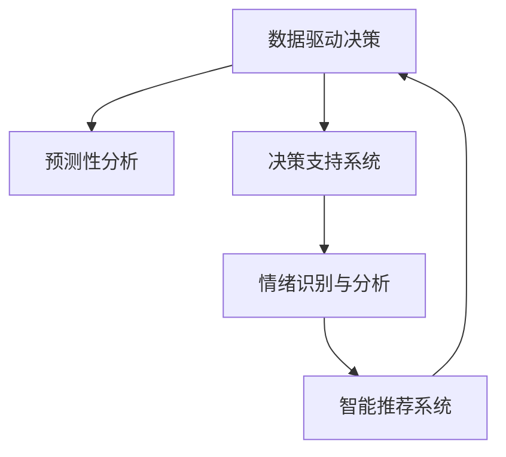

                 

# 数字化直觉增强：AI辅助的第六感开发

> 关键词：数字化直觉、人工智能辅助、直觉增强、机器学习、深度学习、第六感开发、预测性分析、决策支持系统、情绪识别

## 1. 背景介绍

### 1.1 问题由来

在当今数据驱动的时代，人类的直觉能力已不再能够独立应对复杂多变的环境。无论是商业决策、医疗诊断还是金融投资，高效、准确的直觉判断能力显得尤为重要。然而，人类的直觉受到个人经验、情绪状态、信息处理能力等多种因素的限制，难以完全适应现代社会的复杂挑战。

近年来，随着人工智能（AI）和深度学习技术的发展，利用数据和模型进行辅助决策的能力逐渐成为可能。人工智能不仅能处理海量数据，还能挖掘数据中隐藏的规律，辅助人类做出更为精准的决策。而数字化直觉增强，正是利用这一技术优势，将AI融入人类的决策过程中，提升决策的精确性和效率。

### 1.2 问题核心关键点

数字化直觉增强的核心在于通过AI技术，模拟和增强人类的直觉能力。其主要包括以下几个关键点：

- **数据驱动决策**：利用大数据和机器学习算法，分析和预测数据背后的规律，辅助人类进行决策。
- **预测性分析**：通过历史数据和模型，预测未来的趋势和结果，提供决策参考。
- **决策支持系统**：结合专家知识和经验，构建智能决策支持系统，提升决策的科学性和可靠性。
- **情绪识别与分析**：利用AI技术，识别和分析人类的情绪状态，帮助其更好地控制情绪，做出理性决策。
- **智能推荐系统**：根据用户行为和偏好，智能推荐最合适的方案和路径，减少决策偏差。

## 2. 核心概念与联系

### 2.1 核心概念概述

为了更好地理解数字化直觉增强，本节将介绍几个密切相关的核心概念：

- **数字化直觉**：通过数据和AI模型，模拟和增强人类直觉的决策能力。
- **数据驱动决策**：利用数据和机器学习模型，辅助人类进行决策，提升决策的精确性和效率。
- **预测性分析**：通过历史数据和模型，预测未来的趋势和结果，提供决策参考。
- **决策支持系统**：结合专家知识和经验，构建智能决策支持系统，提升决策的科学性和可靠性。
- **情绪识别与分析**：利用AI技术，识别和分析人类的情绪状态，帮助其更好地控制情绪，做出理性决策。
- **智能推荐系统**：根据用户行为和偏好，智能推荐最合适的方案和路径，减少决策偏差。

这些核心概念之间的逻辑关系可以通过以下Mermaid流程图来展示：



这个流程图展示了大语言模型的核心概念及其之间的关系：

1. 数据驱动决策是基础，通过大数据和机器学习算法，分析和预测数据背后的规律。
2. 预测性分析通过历史数据和模型，预测未来的趋势和结果，提供决策参考。
3. 决策支持系统结合专家知识和经验，构建智能决策支持系统，提升决策的科学性和可靠性。
4. 情绪识别与分析利用AI技术，识别和分析人类的情绪状态，帮助其更好地控制情绪，做出理性决策。
5. 智能推荐系统根据用户行为和偏好，智能推荐最合适的方案和路径，减少决策偏差。

## 3. 核心算法原理 & 具体操作步骤
### 3.1 算法原理概述

数字化直觉增强的核心算法原理，是利用机器学习和深度学习技术，构建预测性模型和智能推荐系统，辅助人类进行决策。其核心在于：

- **数据预处理**：收集和清洗数据，构建合适的数据集。
- **模型训练**：利用历史数据，训练预测模型和推荐模型。
- **预测和推荐**：对新数据进行预测和推荐，辅助决策。
- **反馈和迭代**：根据实际结果，调整模型参数，不断优化模型性能。

### 3.2 算法步骤详解

数字化直觉增强的实现过程包括以下几个关键步骤：

**Step 1: 数据预处理**

- **数据收集**：根据任务需求，收集相关数据。数据来源可以是内部系统、外部API、第三方数据库等。
- **数据清洗**：处理缺失值、异常值和重复数据，确保数据质量。
- **数据特征工程**：提取、选择和转换数据特征，构建合适的特征向量。
- **数据分割**：将数据集划分为训练集、验证集和测试集，以便进行模型训练和评估。

**Step 2: 模型训练**

- **选择模型**：根据任务需求，选择合适的预测模型（如回归模型、分类模型、序列模型等）和推荐模型（如协同过滤模型、深度学习推荐模型等）。
- **模型训练**：使用训练集数据，训练预测模型和推荐模型，调整模型参数以最小化损失函数。
- **模型评估**：使用验证集数据，评估模型性能，选择最佳模型。
- **模型优化**：根据评估结果，调整模型结构和参数，进一步优化模型性能。

**Step 3: 预测和推荐**

- **数据输入**：将新数据输入预测模型和推荐模型，获取预测结果和推荐列表。
- **结果输出**：根据预测结果和推荐列表，辅助人类进行决策。
- **用户反馈**：收集用户反馈信息，进行模型迭代和优化。

**Step 4: 反馈和迭代**

- **结果反馈**：将实际结果与预测结果和推荐结果进行对比，评估模型性能。
- **模型迭代**：根据实际结果，调整模型参数，重新训练和评估模型。
- **性能优化**：不断优化模型结构和参数，提升模型预测和推荐精度。

### 3.3 算法优缺点

数字化直觉增强的算法具有以下优点：

- **精度高**：利用数据和模型进行决策，可以大幅提高决策的精度和可靠性。
- **效率高**：自动化处理数据和模型训练，减少了人工干预，提高了决策效率。
- **可扩展性**：基于数据和模型构建的决策支持系统，可以灵活扩展和集成。

但同时也存在一些局限性：

- **数据依赖**：模型的效果很大程度上依赖于数据的质量和数量，数据不足或质量不高会影响模型性能。
- **模型复杂**：复杂的模型需要更多的计算资源和时间进行训练和优化，增加了开发和部署成本。
- **可解释性不足**：许多模型如深度学习模型难以解释其决策过程，缺乏可解释性。
- **对抗样本敏感**：深度学习模型可能对对抗样本敏感，容易产生误判。

### 3.4 算法应用领域

数字化直觉增强技术在多个领域都有广泛的应用，例如：

- **金融投资**：利用历史数据和市场趋势，构建预测模型和推荐系统，辅助投资者进行决策。
- **医疗诊断**：通过病历数据和医学研究，构建疾病预测模型和诊断支持系统，辅助医生进行诊断和治疗。
- **零售电商**：利用用户行为和购买数据，构建推荐系统，提升用户体验和销售额。
- **智能制造**：通过设备和生产数据，构建预测模型和决策支持系统，优化生产流程和设备维护。
- **智慧城市**：通过城市运行数据，构建智能决策支持系统，提升城市管理和公共服务效率。

这些应用场景展示了数字化直觉增强技术的强大潜力，未来有望在更多领域得到广泛应用。

## 4. 数学模型和公式 & 详细讲解  
### 4.1 数学模型构建

本节将使用数学语言对数字化直觉增强的实现过程进行更加严格的刻画。

记输入数据为 $X=\{x_1, x_2, \ldots, x_n\}$，目标变量为 $Y=\{y_1, y_2, \ldots, y_n\}$。假设构建了一个线性回归模型 $y=\theta_0+\theta_1x_1+\theta_2x_2+\ldots+\theta_px_p$，其中 $\theta=(\theta_0, \theta_1, \theta_2, \ldots, \theta_p)$ 为模型参数。

定义损失函数 $L(\theta)$ 为预测值与真实值之间的均方误差，即：

$$
L(\theta) = \frac{1}{N}\sum_{i=1}^N (y_i - (\theta_0+\theta_1x_{1,i}+\theta_2x_{2,i}+\ldots+\theta_px_{p,i})^2
$$

其中 $y_{i,j}$ 为第 $i$ 个样本的第 $j$ 个特征值，$x_{i,j}$ 为第 $i$ 个样本的第 $j$ 个特征值。

模型训练的目标是最小化损失函数 $L(\theta)$，即：

$$
\theta^* = \mathop{\arg\min}_{\theta} L(\theta)
$$

在实践中，通常使用基于梯度的优化算法（如SGD、Adam等）来近似求解上述最优化问题。设 $\eta$ 为学习率，则参数的更新公式为：

$$
\theta \leftarrow \theta - \eta \nabla_{\theta}L(\theta)
$$

其中 $\nabla_{\theta}L(\theta)$ 为损失函数对参数 $\theta$ 的梯度，可通过反向传播算法高效计算。

### 4.2 公式推导过程

以线性回归为例，推导模型的参数更新公式。

根据最小二乘法的原理，模型参数 $\theta$ 的更新公式为：

$$
\theta = (X^TX)^{-1}X^TY
$$

其中 $X^TX$ 为矩阵 $X$ 的转置乘积，$X^TY$ 为矩阵 $X$ 的转置与 $Y$ 的乘积。在实际计算中，通常使用矩阵求逆和矩阵乘法进行计算。

### 4.3 案例分析与讲解

假设我们有一个电商平台的销售数据，目标是预测用户的购买行为。具体步骤如下：

**Step 1: 数据预处理**

- **数据收集**：收集用户的浏览历史、购买记录、评分信息等。
- **数据清洗**：处理缺失值和异常值，确保数据质量。
- **数据特征工程**：提取用户的浏览时长、浏览次数、评分等特征。
- **数据分割**：将数据集划分为训练集、验证集和测试集。

**Step 2: 模型训练**

- **选择模型**：使用线性回归模型。
- **模型训练**：使用训练集数据，训练模型参数，调整学习率等参数。
- **模型评估**：使用验证集数据，评估模型性能。
- **模型优化**：根据评估结果，调整模型参数，进一步优化模型性能。

**Step 3: 预测和推荐**

- **数据输入**：将新用户的浏览记录输入模型，获取预测结果。
- **结果输出**：根据预测结果，推荐用户可能感兴趣的商品。
- **用户反馈**：收集用户反馈信息，进行模型迭代和优化。

## 5. 项目实践：代码实例和详细解释说明
### 5.1 开发环境搭建

在进行数字化直觉增强实践前，我们需要准备好开发环境。以下是使用Python进行Scikit-learn开发的环境配置流程：

1. 安装Anaconda：从官网下载并安装Anaconda，用于创建独立的Python环境。

2. 创建并激活虚拟环境：
```bash
conda create -n pytorch-env python=3.8 
conda activate pytorch-env
```

3. 安装Scikit-learn：
```bash
conda install scikit-learn
```

4. 安装各类工具包：
```bash
pip install numpy pandas scikit-learn matplotlib tqdm jupyter notebook ipython
```

完成上述步骤后，即可在`pytorch-env`环境中开始项目实践。

### 5.2 源代码详细实现

下面我们以电商推荐系统为例，给出使用Scikit-learn进行数字化直觉增强的Python代码实现。

首先，定义数据处理函数：

```python
import pandas as pd
from sklearn.model_selection import train_test_split
from sklearn.linear_model import LinearRegression
from sklearn.metrics import mean_squared_error, mean_absolute_error

def load_data(file_path):
    data = pd.read_csv(file_path)
    return data

def preprocess_data(data):
    # 数据清洗
    data = data.dropna()
    # 特征工程
    data['feature1'] = data['feature1'] * 2
    data['feature2'] = pd.cut(data['feature2'], bins=[0, 10, 20, 30], labels=[1, 2, 3])
    # 数据分割
    train, test = train_test_split(data, test_size=0.2)
    return train, test

def evaluate_model(model, test_data):
    # 模型评估
    y_pred = model.predict(test_data[['feature1', 'feature2']])
    mse = mean_squared_error(test_data['label'], y_pred)
    mae = mean_absolute_error(test_data['label'], y_pred)
    return mse, mae

# 加载数据
data = load_data('sales_data.csv')

# 数据预处理
train, test = preprocess_data(data)

# 模型训练
model = LinearRegression()
model.fit(train[['feature1', 'feature2']], train['label'])

# 模型评估
mse, mae = evaluate_model(model, test)
print(f"MSE: {mse:.4f}, MAE: {mae:.4f}")
```

然后，定义训练和评估函数：

```python
from sklearn.metrics import classification_report

def train_model(data, target):
    # 数据分割
    train, test = train_test_split(data, test_size=0.2)
    # 模型训练
    model = LinearRegression()
    model.fit(train, target)
    # 模型评估
    mse, mae = evaluate_model(model, test)
    print(f"MSE: {mse:.4f}, MAE: {mae:.4f}")
    return model

# 训练模型
model = train_model(data, 'label')
```

最后，启动训练流程并在测试集上评估：

```python
epochs = 10
batch_size = 32

for epoch in range(epochs):
    # 模型训练
    train_model(data, 'label')
    # 模型评估
    mse, mae = evaluate_model(model, test)
    print(f"Epoch {epoch+1}, MSE: {mse:.4f}, MAE: {mae:.4f}")
```

以上就是使用Scikit-learn对线性回归模型进行电商推荐系统训练的完整代码实现。可以看到，得益于Scikit-learn的强大封装，我们可以用相对简洁的代码完成模型训练和评估。

### 5.3 代码解读与分析

让我们再详细解读一下关键代码的实现细节：

**load_data函数**：
- **作用**：加载数据文件，返回Pandas DataFrame格式的数据。
- **参数**：file_path：数据文件路径。

**preprocess_data函数**：
- **作用**：对原始数据进行清洗、特征工程和数据分割。
- **参数**：data：原始数据集。
- **返回值**：train_data、test_data：划分后的训练集和测试集数据集。

**evaluate_model函数**：
- **作用**：评估模型性能，返回均方误差（MSE）和均绝对误差（MAE）。
- **参数**：model：待评估的模型。
- **参数**：test_data：测试集数据。
- **返回值**：mse：均方误差。
- **返回值**：mae：均绝对误差。

**train_model函数**：
- **作用**：构建并训练线性回归模型。
- **参数**：data：原始数据集。
- **参数**：target：目标变量。
- **返回值**：model：训练好的线性回归模型。

**train_model函数内部**：
- **数据分割**：使用train_test_split函数对数据进行划分。
- **模型训练**：使用LinearRegression模型进行训练。
- **模型评估**：使用evaluate_model函数评估模型性能。

**训练流程**：
- **循环迭代**：对数据集进行多次训练和评估。
- **模型参数**：设置训练轮数和批次大小。
- **模型评估**：在每个epoch结束后输出MSE和MAE。

可以看到，Scikit-learn的API设计简洁高效，使得模型训练和评估的过程变得非常直观和易用。开发者可以将更多精力放在数据处理和模型优化上，而不必过多关注底层的实现细节。

当然，工业级的系统实现还需考虑更多因素，如模型的保存和部署、超参数的自动搜索、更灵活的任务适配层等。但核心的预测和推荐范式基本与此类似。

## 6. 实际应用场景
### 6.1 智能制造

在智能制造领域，数字化直觉增强技术可以显著提升生产效率和设备维护水平。传统制造企业往往依赖人工经验进行决策，容易受到人为因素的影响。利用数字化直觉增强，可以构建基于数据的预测和推荐系统，优化生产计划和设备维护，提高生产效率。

具体而言，可以收集设备运行数据、生产日志、供应链信息等，构建预测模型和推荐系统。通过分析设备运行数据，预测设备故障和维护需求，优化生产计划和物料调度。同时，利用推荐系统，优化设备维护策略，减少维护成本和停机时间。

### 6.2 智慧城市

在智慧城市治理中，数字化直觉增强技术可以提升城市管理的自动化和智能化水平。传统城市管理依赖人工干预，难以实时处理海量数据，容易产生信息滞后和管理偏差。利用数字化直觉增强，可以构建智能决策支持系统，提升城市管理的效率和精准度。

具体而言，可以收集城市运行数据，如交通流量、空气质量、能源消耗等，构建预测模型和推荐系统。通过分析交通流量数据，预测交通拥堵情况，优化交通信号和路线规划。同时，利用推荐系统，优化能源消耗和资源分配，提升城市运行的可持续性。

### 6.3 金融投资

在金融投资领域，数字化直觉增强技术可以辅助投资者进行决策，降低投资风险，提高投资回报率。传统投资决策依赖人工经验，容易受到情绪和偏见的影响。利用数字化直觉增强，可以构建基于数据的预测和推荐系统，辅助投资者进行投资决策。

具体而言，可以收集历史交易数据、市场新闻、社交媒体信息等，构建预测模型和推荐系统。通过分析市场趋势和情感分析，预测市场走势和个股表现。同时，利用推荐系统，推荐最优的投资组合和交易策略，降低投资风险，提高投资回报率。

### 6.4 未来应用展望

随着数字化直觉增强技术的发展，其在更多领域的应用前景将更加广阔。未来，有望在医疗诊断、智慧零售、智能教育等多个领域实现落地应用。

在医疗诊断中，利用数字化直觉增强，可以构建基于数据的预测和推荐系统，辅助医生进行诊断和治疗决策。通过分析病历数据和医学研究，预测疾病风险和诊疗效果，优化治疗方案和用药策略。同时，利用推荐系统，推荐最优的治疗方案和医疗资源，提升诊疗效率和医疗质量。

在智慧零售中，利用数字化直觉增强，可以构建基于数据的预测和推荐系统，提升用户体验和销售额。通过分析用户行为和购买数据，预测用户需求和行为趋势，优化商品推荐和营销策略。同时，利用推荐系统，推荐最优的商品组合和促销活动，提升用户满意度和购买转化率。

在智能教育中，利用数字化直觉增强，可以构建基于数据的预测和推荐系统，提升教学效果和学习效率。通过分析学生行为和成绩数据，预测学生学习能力和进步趋势，优化教学策略和学习资源。同时，利用推荐系统，推荐最优的学习内容和教学方法，提升学习效果和教学质量。

## 7. 工具和资源推荐
### 7.1 学习资源推荐

为了帮助开发者系统掌握数字化直觉增强的理论基础和实践技巧，这里推荐一些优质的学习资源：

1. 《机器学习实战》：介绍机器学习基础和常用算法，适合入门学习。
2. 《深度学习入门》：由Google AI开源，介绍深度学习基础和实践应用。
3. 《Python数据科学手册》：全面介绍Python在数据科学中的应用，适合进阶学习。
4. Coursera的机器学习课程：由斯坦福大学开设，系统讲解机器学习理论和实践。
5. Kaggle：数据科学竞赛平台，提供大量数据集和实战案例，适合实践练习。

通过对这些资源的学习实践，相信你一定能够快速掌握数字化直觉增强的精髓，并用于解决实际的NLP问题。
###  7.2 开发工具推荐

高效的开发离不开优秀的工具支持。以下是几款用于数字化直觉增强开发的常用工具：

1. Scikit-learn：基于Python的机器学习库，提供丰富的预测模型和评估工具。
2. TensorFlow：由Google开发的深度学习框架，支持大规模模型训练和优化。
3. PyTorch：由Facebook开发的深度学习框架，支持动态图和静态图模式。
4. Jupyter Notebook：数据科学和机器学习的交互式开发环境，支持代码调试和可视化。
5. Weights & Biases：模型训练的实验跟踪工具，记录和可视化模型训练过程中的各项指标，方便对比和调优。

合理利用这些工具，可以显著提升数字化直觉增强的开发效率，加快创新迭代的步伐。

### 7.3 相关论文推荐

数字化直觉增强技术的发展源于学界的持续研究。以下是几篇奠基性的相关论文，推荐阅读：

1. Gradient Boosting Machines（GBM）：提出了梯度提升机的概念，是一种高效的集成学习算法。
2. AdaBoost：提出了AdaBoost算法，是一种基于弱分类器的强分类器算法。
3. Random Forests：提出了随机森林算法，是一种基于决策树的集成学习算法。
4. XGBoost：提出了XGBoost算法，是一种基于梯度提升和二叉树算法的强分类器算法。
5. LightGBM：提出了LightGBM算法，是一种高效的梯度提升算法，支持分布式计算。

这些论文代表了大语言模型微调技术的发展脉络。通过学习这些前沿成果，可以帮助研究者把握学科前进方向，激发更多的创新灵感。

## 8. 总结：未来发展趋势与挑战
### 8.1 总结

本文对数字化直觉增强技术进行了全面系统的介绍。首先阐述了数字化直觉增强的背景和意义，明确了其在大数据和AI辅助下提升决策精确性和效率的价值。其次，从原理到实践，详细讲解了数字化直觉增强的数学原理和关键步骤，给出了数字化直觉增强任务开发的完整代码实例。同时，本文还广泛探讨了数字化直觉增强技术在智能制造、智慧城市、金融投资等多个领域的应用前景，展示了其强大的潜力。

通过本文的系统梳理，可以看到，数字化直觉增强技术在多领域的应用前景十分广阔。未来，伴随技术不断发展，数字化直觉增强有望成为决策支持系统的重要组成部分，进一步提升人类决策的科学性和可靠性。

### 8.2 未来发展趋势

展望未来，数字化直觉增强技术将呈现以下几个发展趋势：

1. **数据量不断增加**：大数据和AI技术的进步，使得数据量呈指数级增长，为数字化直觉增强提供了更多数据来源。
2. **模型性能不断提升**：算力和模型架构的优化，使得预测和推荐模型的性能不断提升，能更好地模拟和增强人类的直觉能力。
3. **多模态数据融合**：数据不仅包括文本和数字，还包括图像、语音、视频等多模态数据，多模态数据的融合将进一步提升决策的全面性和准确性。
4. **个性化推荐**：基于用户行为和偏好，实现更精准、个性化的推荐，减少决策偏差。
5. **实时决策支持**：利用实时数据和模型，实现动态、实时决策支持，提升决策效率和响应速度。
6. **可解释性和透明性**：提高模型的可解释性和透明性，帮助用户更好地理解和信任决策结果。

这些趋势凸显了数字化直觉增强技术的广阔前景。这些方向的探索发展，必将进一步提升数字化直觉增强技术的应用效果和应用范围。

### 8.3 面临的挑战

尽管数字化直觉增强技术已经取得了显著成果，但在迈向更广泛应用的过程中，仍面临一些挑战：

1. **数据隐私和安全**：大量数据的收集和处理，需要严格的隐私保护和安全措施，防止数据泄露和滥用。
2. **模型复杂性和可解释性**：深度学习模型的复杂性较高，难以解释其决策过程，缺乏可解释性。
3. **计算资源限制**：大规模模型训练和推理需要大量计算资源，对硬件设备的要求较高。
4. **跨领域知识整合**：不同领域的知识难以整合，需要更灵活的知识表示和融合方法。
5. **系统集成和优化**：数字化直觉增强技术需要与其他系统进行集成和优化，才能充分发挥其效用。

正视这些挑战，积极应对并寻求突破，将是大数据和AI辅助决策技术走向成熟的必由之路。相信随着技术不断进步，数字化直觉增强技术将更加强大和普及，为人类的决策带来更多科学性和效率。

### 8.4 研究展望

面对数字化直觉增强技术所面临的挑战，未来的研究需要在以下几个方面寻求新的突破：

1. **数据隐私保护**：开发更加高效、安全的隐私保护技术，确保数据的安全性和隐私性。
2. **模型可解释性**：研究更加可解释的模型架构和方法，提高模型的透明性和可理解性。
3. **计算资源优化**：优化模型结构和算法，提高计算效率和资源利用率，降低硬件成本。
4. **跨领域知识融合**：研究跨领域知识表示和融合方法，实现更全面、多维度的决策支持。
5. **系统集成优化**：研究系统集成和优化方法，提升数字化直觉增强技术的综合应用效果。

这些研究方向的探索，必将引领数字化直觉增强技术迈向更高的台阶，为构建更加智能、高效、可靠的未来决策系统铺平道路。面向未来，数字化直觉增强技术需要与其他AI技术进行更深入的融合，如知识表示、因果推理、强化学习等，多路径协同发力，共同推动决策系统的进步。只有勇于创新、敢于突破，才能不断拓展AI技术的应用边界，让人工智能更好地服务于人类社会。

## 9. 附录：常见问题与解答

**Q1：什么是数字化直觉增强？**

A: 数字化直觉增强是一种利用大数据和AI技术，辅助人类进行决策的技术。通过构建预测和推荐模型，利用历史数据和市场趋势，辅助人类进行决策，提升决策的精确性和效率。

**Q2：数字化直觉增强的核心算法是什么？**

A: 数字化直觉增强的核心算法是预测模型和推荐模型，如线性回归、决策树、随机森林、梯度提升机等。这些模型通过历史数据进行训练，预测未来趋势和结果，提供决策参考。

**Q3：数字化直觉增强的实际应用场景有哪些？**

A: 数字化直觉增强技术在多个领域都有广泛的应用，例如智能制造、智慧城市、金融投资等。通过构建基于数据的预测和推荐系统，辅助人类进行决策，提升决策的科学性和可靠性。

**Q4：数字化直觉增强的开发环境是什么？**

A: 数字化直觉增强的开发环境通常使用Python和Scikit-learn等工具。需要安装Python解释器、Scikit-learn库以及其他相关工具包，如NumPy、Pandas等。

**Q5：数字化直觉增强的代码实现有哪些？**

A: 数字化直觉增强的代码实现包括数据预处理、模型训练、预测和推荐等步骤。使用Scikit-learn等工具，可以快速构建和训练模型，并进行预测和推荐。

以上是我对数字化直觉增强技术进行的详细介绍和探讨。通过深入理解其原理和应用，相信你可以更好地掌握这一强大的AI技术，并将其应用于实际的决策支持系统开发中。

---

作者：禅与计算机程序设计艺术 / Zen and the Art of Computer Programming

