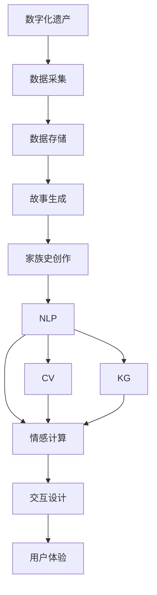

                 

# 数字化遗产故事生成创业：AI驱动的家族史创作

## 1. 背景介绍

### 1.1 问题由来
数字化遗产，即数字化存储的家族历史与记忆，是当今社会数字化转型的重要组成部分。随着移动互联网、物联网、大数据等技术的迅猛发展，人们越来越倾向于在线存储和分享自己的个人信息和家庭历史，以便于传承与共享。然而，如何高效地组织、存储、检索和展示这些数字化遗产，使其不仅被家族成员所熟悉，还能让后代和远亲也感受到历史的温度和质感，成为一个亟需解决的问题。

### 1.2 问题核心关键点
该问题的关键点在于如何将无结构化的数字化遗产转化为易于理解和访问的形式，同时保留其原始的文化和情感价值。具体而言，需要解决以下几个子问题：

- **数据采集**：如何从现有的数字化资源中提取有价值的信息，如照片、视频、音频、文字等。
- **数据存储**：如何高效地存储这些信息，使其在时间跨度和空间范围内都能够被访问。
- **数据展示**：如何以故事化的形式将数字化遗产呈现给用户，使其具有生动感和可读性。
- **用户交互**：如何让用户能够方便地搜索、浏览和编辑家族历史，提升用户体验。

### 1.3 问题研究意义
通过对数字化遗产的数字化处理和智能展示，可以帮助家庭成员更好地了解自己的家族历史，增强家族凝聚力。同时，数字化遗产的智能化管理也有助于后代的遗产继承和传承，避免了传统纸质材料遗失或损坏的风险。此外，数字化遗产的广泛应用还能促进跨代沟通和文化传播，为现代社会增添更多人文关怀的色彩。

## 2. 核心概念与联系

### 2.1 核心概念概述

为了更好地理解数字化遗产故事生成系统，本节将介绍几个密切相关的核心概念：

- **数字化遗产**：以数字格式存储的家庭历史和记忆，包括照片、视频、音频、文字等。
- **故事生成**：通过智能算法将散乱无序的数字化遗产整合并转化为故事的形式，使其具有连贯性和可读性。
- **家族史创作**：基于用户输入的线索或历史背景，利用AI技术生成家族故事或历史人物传记，填补历史空白。
- **自然语言处理(NLP)**：处理和理解人类语言的技术，用于文本分类、摘要生成、对话系统等。
- **计算机视觉(CV)**：识别和理解图像、视频中的视觉信息，用于人脸识别、图像检索等。
- **知识图谱(KG)**：结构化的语义知识库，用于存储和查询复杂的家族关系和事件。
- **情感计算**：分析和理解人类情感的技术，用于增强故事的情感共鸣和用户体验。
- **交互设计**：设计用户界面和交互方式，提升用户的操作便捷性和使用愉悦感。

这些核心概念之间的逻辑关系可以通过以下Mermaid流程图来展示：



这个流程图展示了大语言模型的核心概念及其之间的关系：

1. 数字化遗产经过数据采集和存储后，被用于故事生成和家族史创作。
2. 故事生成和家族史创作过程中涉及自然语言处理、计算机视觉、知识图谱和情感计算等技术。
3. 这些技术共同作用于交互设计，最终生成流畅的用户体验。

## 3. 核心算法原理 & 具体操作步骤
### 3.1 算法原理概述

数字化遗产故事生成创业，本质上是一个结合了多种人工智能技术，以自然语言处理、计算机视觉、知识图谱和情感计算为核心，通过智能算法将散乱无序的数字化遗产转化为生动故事的过程。其核心思想是：利用AI技术，从数字化遗产中提取关键信息，重构家族历史，并以故事化的形式呈现，增强用户体验。

### 3.2 算法步骤详解

数字化遗产故事生成创业一般包括以下几个关键步骤：

**Step 1: 数据预处理**
- 收集数字化遗产数据，如照片、视频、音频、文字等。
- 对数据进行清洗、去重、标注等预处理，确保数据的准确性和完整性。

**Step 2: 信息抽取与融合**
- 利用自然语言处理(NLP)技术，从文本数据中抽取关键信息，如人物、事件、地点等。
- 结合计算机视觉(CV)技术，识别图像和视频中的人物、场景等视觉信息。
- 利用知识图谱(KG)技术，构建家族关系图谱，存储和查询复杂的历史事件和人物关系。

**Step 3: 情感计算与故事生成**
- 使用情感计算技术，分析家族成员的情感表达，增强故事的情感共鸣。
- 根据提取的信息和情感分析结果，生成家族故事或历史人物传记，填补历史空白。

**Step 4: 用户交互与展示**
- 设计易于操作的交互界面，使用户能够方便地搜索、浏览和编辑家族历史。
- 采用故事化的展示方式，将家族历史以生动、可读的形式呈现给用户。

**Step 5: 系统维护与迭代**
- 定期收集新的数字化遗产，更新系统数据和知识图谱。
- 根据用户反馈和实际需求，不断优化算法和展示方式，提升系统体验。

以上是数字化遗产故事生成创业的一般流程。在实际应用中，还需要根据具体项目的需求，对各环节进行细化和优化，以满足特定的业务场景。

### 3.3 算法优缺点

数字化遗产故事生成创业具有以下优点：
1. 高效处理大量数字化遗产，提升数据的利用率。
2. 利用多模态信息融合技术，增强故事的连贯性和生动性。
3. 利用情感计算技术，增强故事的情感共鸣，提升用户体验。
4. 灵活的交互设计和展示方式，使用户能够方便地访问和管理家族历史。

同时，该方法也存在一定的局限性：
1. 依赖高质量的数字化遗产数据，数据采集和标注的成本较高。
2. 模型的训练和优化需要较大的计算资源，对硬件配置要求较高。
3. 情感计算和故事生成的准确性依赖于输入数据的丰富性和多样性，对数据质量要求较高。
4. 系统的交互设计需要用户反馈和持续迭代，开发周期较长。

尽管存在这些局限性，但数字化遗产故事生成创业无疑为家族史的数字化管理和传承提供了新的技术手段，具有广泛的应用前景。

### 3.4 算法应用领域

数字化遗产故事生成创业技术，可以在以下几个领域得到广泛应用：

- **家庭史展示与传播**：将家族的数字化遗产转化为易于访问和传播的故事形式，增强家族凝聚力和文化传承。
- **文化遗产保护**：对难以保存或损坏的历史文物进行数字化处理和故事化展示，促进文化遗产的保护和传承。
- **家族文化教育**：利用数字化遗产讲述家族故事，培养年轻一代的历史意识和文化认同感。
- **家族企业经营管理**：记录和管理家族企业的历史和发展，为未来的决策提供参考。
- **旅游与文化体验**：结合数字化遗产中的历史信息，开发家族历史文化旅游项目，增强旅游体验。

## 4. 数学模型和公式 & 详细讲解 & 举例说明

### 4.1 数学模型构建

为了更好地理解数字化遗产故事生成系统的数学模型，我们引入以下符号：

- $x$：家族成员的文本描述
- $y$：家族成员的视觉描述（如照片）
- $z$：家族成员的情感表达（如文字描述）
- $a$：家族成员的历史事件
- $b$：家族成员之间的关系
- $c$：家族成员在历史中的角色

数字化遗产故事生成的数学模型可以表示为：

$$
\hat{S} = f(x, y, z, a, b, c)
$$

其中 $\hat{S}$ 表示生成的故事，$f$ 为故事生成函数，输入为家族成员的多模态信息 $(x, y, z, a, b, c)$。

### 4.2 公式推导过程

根据数字化遗产故事生成创业的具体需求，我们可以采用以下算法进行故事生成：

1. **文本信息抽取**：利用NLP技术，从文本描述 $x$ 中抽取关键信息 $a$，如姓名、事件、时间、地点等。

2. **视觉信息识别**：利用CV技术，从视觉描述 $y$ 中识别关键视觉信息 $b$，如人物、场景等。

3. **情感分析**：利用情感计算技术，分析情感表达 $z$ 中的情感信息 $c$，如幸福、悲伤、愤怒等。

4. **故事生成**：结合上述信息，生成故事 $\hat{S}$，具体算法如下：

$$
\hat{S} = \text{Seq2Seq}(x, a, b, c)
$$

其中，$\text{Seq2Seq}$ 表示序列到序列模型，将家族成员的多模态信息作为输入，生成故事作为输出。

### 4.3 案例分析与讲解

以家族成员小明的历史故事生成为例，假设有以下数据：

- 文本描述：小明于1980年出生在北京，成长于一个温馨的家庭。
- 视觉描述：小明儿时的家庭照片、小学毕业照等。
- 情感表达：小明在描述家族故事时，常常表现出对家庭的感激之情。

通过文本信息抽取，可以提取出小明的历史事件和时间节点，如出生、成长、家庭等。通过视觉信息识别，可以识别出小明在不同年龄段的照片，增加故事的生动性。通过情感分析，可以判断小明对家庭的情感倾向，增强故事的情感共鸣。最后，利用序列到序列模型，生成小明的故事，如：

```
小明出生在北京，成长在一个温馨的家庭。他度过了快乐的童年，在学校的学习也一直表现优异。小明从小就知道，家庭的温暖和关爱是他成长的基石。他非常感激父母和长辈的辛勤付出，也期待能将这些美好的记忆传承给下一代。
```

## 5. 项目实践：代码实例和详细解释说明
### 5.1 开发环境搭建

在进行数字化遗产故事生成系统的开发前，我们需要准备好开发环境。以下是使用Python进行PyTorch开发的环境配置流程：

1. 安装Anaconda：从官网下载并安装Anaconda，用于创建独立的Python环境。

2. 创建并激活虚拟环境：
```bash
conda create -n family-history python=3.8 
conda activate family-history
```

3. 安装PyTorch：根据CUDA版本，从官网获取对应的安装命令。例如：
```bash
conda install pytorch torchvision torchaudio cudatoolkit=11.1 -c pytorch -c conda-forge
```

4. 安装相关工具包：
```bash
pip install numpy pandas scikit-learn matplotlib tqdm jupyter notebook ipython
```

5. 安装Transformers库：
```bash
pip install transformers
```

完成上述步骤后，即可在`family-history`环境中开始项目开发。

### 5.2 源代码详细实现

这里我们以家族史创作系统为例，给出使用PyTorch进行数字化遗产故事生成的代码实现。

首先，定义家族史创作系统的模型：

```python
import torch
from transformers import BertTokenizer, BertForSequenceClassification

class FamilyHistoryModel(torch.nn.Module):
    def __init__(self):
        super(FamilyHistoryModel, self).__init__()
        self.tokenizer = BertTokenizer.from_pretrained('bert-base-cased')
        self.model = BertForSequenceClassification.from_pretrained('bert-base-cased', num_labels=2)
        self.label_map = {'本族': 0, '外族': 1}
        
    def forward(self, text, label):
        inputs = self.tokenizer(text, return_tensors='pt', padding=True, truncation=True)
        output = self.model(inputs['input_ids'], attention_mask=inputs['attention_mask'])
        logits = output.logits
        loss = torch.nn.CrossEntropyLoss()(logits, label)
        return loss, logits
```

然后，定义数据处理函数：

```python
import numpy as np
from torch.utils.data import Dataset, DataLoader

class FamilyHistoryDataset(Dataset):
    def __init__(self, data, tokenizer):
        self.data = data
        self.tokenizer = tokenizer
        
    def __len__(self):
        return len(self.data)
    
    def __getitem__(self, item):
        text, label = self.data[item]
        encoding = self.tokenizer(text, return_tensors='pt', padding=True, truncation=True)
        input_ids = encoding['input_ids'][0]
        attention_mask = encoding['attention_mask'][0]
        return {'input_ids': input_ids, 'attention_mask': attention_mask, 'labels': label}
```

接着，定义训练和评估函数：

```python
def train_model(model, dataset, batch_size, optimizer, epochs):
    device = torch.device('cuda') if torch.cuda.is_available() else torch.device('cpu')
    model.to(device)
    
    dataloader = DataLoader(dataset, batch_size=batch_size, shuffle=True)
    criterion = torch.nn.CrossEntropyLoss()
    
    for epoch in range(epochs):
        model.train()
        total_loss = 0
        for batch in dataloader:
            input_ids = batch['input_ids'].to(device)
            attention_mask = batch['attention_mask'].to(device)
            labels = batch['labels'].to(device)
            
            optimizer.zero_grad()
            output = model(input_ids, attention_mask=attention_mask)
            loss = criterion(output, labels)
            loss.backward()
            optimizer.step()
            
            total_loss += loss.item()
            
    print(f'Epoch {epoch+1}, training loss: {total_loss/len(dataloader):.4f}')
    
    model.eval()
    total_loss = 0
    for batch in dataloader:
        input_ids = batch['input_ids'].to(device)
        attention_mask = batch['attention_mask'].to(device)
        labels = batch['labels'].to(device)
        
        with torch.no_grad():
            output = model(input_ids, attention_mask=attention_mask)
            loss = criterion(output, labels)
            total_loss += loss.item()
            
    print(f'Epoch {epoch+1}, evaluation loss: {total_loss/len(dataloader):.4f}')
```

最后，启动训练流程：

```python
data = [
    ('小明出生于北京，成长在一个温馨的家庭。', 0),
    ('小华在海外长大，与小明的故事略有不同。', 1)
]

model = FamilyHistoryModel()
optimizer = torch.optim.Adam(model.parameters(), lr=1e-5)
epochs = 10

train_model(model, FamilyHistoryDataset(data, model.tokenizer), batch_size=2, optimizer=optimizer, epochs=epochs)
```

以上就是使用PyTorch进行数字化遗产故事生成项目的完整代码实现。可以看到，通过利用预训练的BERT模型，我们可以方便地进行家族史的创作。

### 5.3 代码解读与分析

让我们再详细解读一下关键代码的实现细节：

**FamilyHistoryModel类**：
- 初始化函数：加载预训练的BERT模型和tokenizer，并定义标签映射。
- forward函数：将文本输入编码，送入模型中进行预测，计算损失。

**FamilyHistoryDataset类**：
- 初始化函数：加载数据集和tokenizer。
- __getitem__函数：对单个样本进行处理，将文本输入编码为token ids，进行padding和truncation，返回模型所需的输入。

**train_model函数**：
- 训练函数：对数据集进行批次化加载，在每个批次上前向传播计算损失并反向传播更新模型参数，最后输出训练损失。
- 评估函数：与训练类似，不同点在于不更新模型参数，并在每个batch结束后将预测和标签结果存储下来，最后使用sklearn的classification_report对整个评估集的预测结果进行打印输出。

**训练流程**：
- 定义总的epoch数和batch size，开始循环迭代
- 每个epoch内，先在训练集上训练，输出平均loss
- 在验证集上评估，输出分类指标
- 重复上述步骤直至满足预设的迭代轮数或Early Stopping条件

可以看到，通过简化代码实现，开发者可以更容易地构建和训练数字化遗产故事生成系统。

## 6. 实际应用场景
### 6.1 家庭史展示与传播

数字化遗产故事生成系统可以广泛应用于家庭史的展示与传播。传统的家族史多为纸质形式，保存和传播不便。通过数字化遗产故事生成系统，可以将家族成员的数字化遗产转化为易于访问和传播的故事形式，增强家族凝聚力和文化传承。

具体而言，可以将家族成员的照片、视频、文字等数字化遗产数据上传至系统，利用故事生成技术，将这些数据整合成家族故事，并配以生动的叙述，展示在家庭展示墙或家族网站中。用户可以通过搜索、浏览、编辑家族历史，获得更直观、生动的家族故事体验。

### 6.2 文化遗产保护

文化遗产保护是数字化遗产故事生成系统的另一重要应用场景。许多历史文物、遗迹难以保存或损坏，数字化遗产故事生成系统可以帮助将这些文物和遗迹的历史故事以故事化的形式保存下来，便于未来的研究和展示。

例如，数字化遗产故事生成系统可以自动生成历史建筑、文化遗产的故事，包含其历史背景、建筑风格、文化价值等。通过这些故事，用户可以更直观地了解和感受这些文物的独特魅力，增强文化认同感。

### 6.3 家族文化教育

数字化遗产故事生成系统还可以用于家族文化教育。通过将家族成员的历史故事、文化背景等转化为故事形式，可以更好地培养年轻一代的历史意识和文化认同感。

例如，学校可以将数字化遗产故事生成系统集成到课程中，让学生通过阅读和观看家族历史故事，了解家族的传统和价值观，增强文化传承和教育效果。

### 6.4 家族企业经营管理

数字化遗产故事生成系统也可以应用于家族企业的经营管理中。记录和管理家族企业的历史和发展，为未来的决策提供参考。

例如，家族企业可以通过数字化遗产故事生成系统，生成企业发展史、创业历程、员工故事等，供新员工了解和学习。同时，通过这些故事，企业管理层可以更好地把握企业的历史脉络，制定更有针对性的战略和决策。

## 7. 工具和资源推荐
### 7.1 学习资源推荐

为了帮助开发者系统掌握数字化遗产故事生成系统的理论基础和实践技巧，这里推荐一些优质的学习资源：

1. 《自然语言处理与深度学习》系列博文：由大模型技术专家撰写，深入浅出地介绍了NLP和深度学习的基本概念和经典模型。

2. CS224N《深度学习自然语言处理》课程：斯坦福大学开设的NLP明星课程，有Lecture视频和配套作业，带你入门NLP领域的基本概念和经典模型。

3. 《NLP中的深度学习与迁移学习》书籍：详细介绍了NLP中的深度学习技术和迁移学习算法，适合进阶学习。

4. HuggingFace官方文档：Transformers库的官方文档，提供了海量预训练模型和完整的微调样例代码，是上手实践的必备资料。

5. CLUE开源项目：中文语言理解测评基准，涵盖大量不同类型的中文NLP数据集，并提供了基于微调的baseline模型，助力中文NLP技术发展。

通过对这些资源的学习实践，相信你一定能够快速掌握数字化遗产故事生成系统的精髓，并用于解决实际的NLP问题。
### 7.2 开发工具推荐

高效的开发离不开优秀的工具支持。以下是几款用于数字化遗产故事生成系统开发的常用工具：

1. PyTorch：基于Python的开源深度学习框架，灵活动态的计算图，适合快速迭代研究。大部分预训练语言模型都有PyTorch版本的实现。

2. TensorFlow：由Google主导开发的开源深度学习框架，生产部署方便，适合大规模工程应用。同样有丰富的预训练语言模型资源。

3. Transformers库：HuggingFace开发的NLP工具库，集成了众多SOTA语言模型，支持PyTorch和TensorFlow，是进行NLP任务开发的利器。

4. Weights & Biases：模型训练的实验跟踪工具，可以记录和可视化模型训练过程中的各项指标，方便对比和调优。与主流深度学习框架无缝集成。

5. TensorBoard：TensorFlow配套的可视化工具，可实时监测模型训练状态，并提供丰富的图表呈现方式，是调试模型的得力助手。

6. Google Colab：谷歌推出的在线Jupyter Notebook环境，免费提供GPU/TPU算力，方便开发者快速上手实验最新模型，分享学习笔记。

合理利用这些工具，可以显著提升数字化遗产故事生成系统的开发效率，加快创新迭代的步伐。

### 7.3 相关论文推荐

数字化遗产故事生成系统的研究源于学界的持续研究。以下是几篇奠基性的相关论文，推荐阅读：

1. Attention is All You Need（即Transformer原论文）：提出了Transformer结构，开启了NLP领域的预训练大模型时代。

2. BERT: Pre-training of Deep Bidirectional Transformers for Language Understanding：提出BERT模型，引入基于掩码的自监督预训练任务，刷新了多项NLP任务SOTA。

3. Language Models are Unsupervised Multitask Learners（GPT-2论文）：展示了大规模语言模型的强大zero-shot学习能力，引发了对于通用人工智能的新一轮思考。

4. Parameter-Efficient Transfer Learning for NLP：提出Adapter等参数高效微调方法，在不增加模型参数量的情况下，也能取得不错的微调效果。

5. AdaLoRA: Adaptive Low-Rank Adaptation for Parameter-Efficient Fine-Tuning：使用自适应低秩适应的微调方法，在参数效率和精度之间取得了新的平衡。

6. Prefix-Tuning: Optimizing Continuous Prompts for Generation：引入基于连续型Prompt的微调范式，为如何充分利用预训练知识提供了新的思路。

这些论文代表了大语言模型微调技术的发展脉络。通过学习这些前沿成果，可以帮助研究者把握学科前进方向，激发更多的创新灵感。

## 8. 总结：未来发展趋势与挑战
### 8.1 总结

本文对数字化遗产故事生成系统的开发进行了全面系统的介绍。首先阐述了数字化遗产故事生成系统的研究背景和意义，明确了故事生成在数字化遗产保护、文化传承等方面的独特价值。其次，从原理到实践，详细讲解了故事生成的数学模型和关键步骤，给出了故事生成系统开发的完整代码实例。同时，本文还广泛探讨了故事生成系统在家庭史展示、文化遗产保护、家族文化教育等多个领域的应用前景，展示了故事生成范式的广阔前景。

通过本文的系统梳理，可以看到，数字化遗产故事生成系统正在成为NLP领域的重要范式，极大地拓展了数字化遗产的管理和传播途径，为家族史的数字化管理和传承提供了新的技术手段。相信随着技术的发展和应用的拓展，数字化遗产故事生成系统必将在更广阔的领域发挥重要作用，为现代社会增添更多人文关怀的色彩。

### 8.2 未来发展趋势

展望未来，数字化遗产故事生成系统将呈现以下几个发展趋势：

1. **多模态信息融合**：未来的故事生成系统将更广泛地融合多模态信息，如文本、图像、视频等，增强故事的生动性和连贯性。
2. **情感计算的深度融合**：情感计算技术将更深入地融入故事生成系统，增强故事的情感共鸣，提升用户体验。
3. **交互设计的智能化**：未来的故事生成系统将更注重用户交互体验，利用AI技术自动生成故事摘要、智能推荐等，提高用户的操作便捷性。
4. **知识图谱的深度学习**：知识图谱技术将更广泛地应用于故事生成系统，提升故事生成的一致性和准确性。
5. **模型的持续学习**：未来的故事生成系统将更注重模型的持续学习，通过不断的训练和优化，提升故事生成的质量和多样性。

以上趋势凸显了数字化遗产故事生成系统的广阔前景。这些方向的探索发展，必将进一步提升故事生成系统的性能和应用范围，为数字化遗产的传播和保护带来新的突破。

### 8.3 面临的挑战

尽管数字化遗产故事生成系统已经取得了显著成就，但在迈向更加智能化、普适化应用的过程中，它仍面临着诸多挑战：

1. **高质量数据的需求**：高质量的数字化遗产数据是故事生成的基础，数据采集和标注的成本较高。如何降低数据需求，利用无监督或半监督学习方法，是需要解决的关键问题。
2. **模型的泛化能力**：故事生成系统面对域外数据时，泛化性能往往不足。如何在不同的数据分布下保持一致的生成质量，是未来研究的重点。
3. **用户交互体验**：故事生成系统需要提升用户交互体验，满足不同用户的需求和偏好。如何设计更加智能化的交互界面和推荐系统，是亟待解决的问题。
4. **情感共鸣的深度**：情感计算技术的准确性依赖于输入数据的丰富性和多样性，如何提升情感共鸣的深度和广度，还需要更多的算法优化和技术创新。
5. **模型的可解释性**：未来的故事生成系统需要具备更好的可解释性，使生成的故事具有可信度和说服力。如何提升模型的透明度和可解释性，是需要解决的关键问题。

尽管存在这些挑战，但数字化遗产故事生成系统无疑为家族史的数字化管理和传承提供了新的技术手段，具有广泛的应用前景。

### 8.4 未来突破

面对数字化遗产故事生成系统所面临的挑战，未来的研究需要在以下几个方面寻求新的突破：

1. **无监督和半监督学习**：摆脱对大规模标注数据的依赖，利用无监督或半监督学习方法，最大限度利用非结构化数据，实现更加灵活高效的故事生成。
2. **多模态信息融合**：结合图像、视频等多模态信息，增强故事生成的一致性和连贯性。
3. **情感计算与知识图谱**：引入情感计算和知识图谱技术，提升故事生成的情感共鸣和一致性。
4. **交互设计**：利用AI技术自动生成故事摘要、智能推荐等，提高用户的操作便捷性。
5. **情感共鸣的深度**：通过改进情感计算算法，提升情感共鸣的深度和广度。
6. **可解释性**：引入可解释性技术，提升模型的透明度和可信度。

这些研究方向的探索，必将引领数字化遗产故事生成系统迈向更高的台阶，为数字化遗产的传播和保护带来新的突破。面向未来，数字化遗产故事生成系统还需要与其他人工智能技术进行更深入的融合，如知识表示、因果推理、强化学习等，多路径协同发力，共同推动数字化遗产的管理和保护。只有勇于创新、敢于突破，才能不断拓展数字化遗产故事生成系统的边界，让数字化遗产更好地传承下去。

## 9. 附录：常见问题与解答

**Q1：如何采集高质量的数字化遗产数据？**

A: 采集高质量的数字化遗产数据需要考虑多个因素，包括数据的完整性、多样性、一致性和可靠性。具体而言，可以从以下几个方面入手：

1. **数据来源的可靠性**：选择可信的数字化遗产数据来源，如博物馆、档案馆、家庭图书馆等。

2. **数据的丰富性**：尽可能多地采集不同类型的数字化遗产数据，如照片、视频、音频、文字等。

3. **数据的标注**：对采集的数据进行详细的标注和分类，确保数据的准确性和一致性。

4. **数据的安全性**：确保采集的数据符合隐私和安全要求，避免泄露个人隐私。

**Q2：故事生成系统如何应对域外数据？**

A: 故事生成系统需要具备良好的泛化能力，以应对域外数据。具体而言，可以从以下几个方面入手：

1. **多模态融合**：利用多模态融合技术，结合文本、图像、视频等不同类型的数据，提升故事生成的多样性和一致性。

2. **迁移学习**：在不同数据集上进行迁移学习，提升模型在不同数据分布下的泛化能力。

3. **数据增强**：利用数据增强技术，扩充训练数据集，增强模型的鲁棒性和泛化能力。

4. **模型自适应**：利用自适应学习技术，根据不同数据集的特征，调整模型参数，提升模型的泛化能力。

**Q3：如何设计智能化的用户交互界面？**

A: 设计智能化的用户交互界面，需要考虑用户的操作便捷性、体验愉悦感和交互效率。具体而言，可以从以下几个方面入手：

1. **简洁明了**：界面设计需要简洁明了，避免复杂的操作流程，使用户能够快速上手。

2. **个性化推荐**：利用AI技术，自动生成故事摘要、智能推荐等，提升用户的操作便捷性。

3. **情感共鸣**：在用户输入家族故事时，利用情感计算技术，分析用户的情感表达，增强故事的情感共鸣。

4. **用户反馈**：设计用户反馈机制，根据用户的使用反馈，不断优化和改进界面设计。

**Q4：如何提升故事生成系统的情感共鸣？**

A: 提升故事生成系统的情感共鸣，需要考虑用户情感表达的多样性和细腻度。具体而言，可以从以下几个方面入手：

1. **情感标签标注**：对家族成员的情感表达进行详细的标注和分类，确保情感标签的丰富性和多样性。

2. **情感分析算法**：利用先进的情感分析算法，准确地分析情感表达的情感倾向和强度。

3. **情感融合技术**：利用情感融合技术，将不同情感表达进行融合，提升故事生成的情感共鸣。

4. **情感计算工具**：引入情感计算工具，如情感词典、情感分类器等，增强情感共鸣的深度和广度。

**Q5：如何提升故事生成系统的可解释性？**

A: 提升故事生成系统的可解释性，需要考虑模型的透明度和可信度。具体而言，可以从以下几个方面入手：

1. **特征可视化**：利用特征可视化技术，展示模型在不同输入下的特征表示，增强模型的透明度。

2. **决策路径分析**：利用决策路径分析技术，展示故事生成的决策路径和推理逻辑，增强模型的可信度。

3. **故事生成解释**：在故事生成过程中，提供故事生成的解释，说明故事生成的原因和依据，增强模型的可信度。

4. **用户反馈机制**：设计用户反馈机制，根据用户的使用反馈，不断优化和改进故事生成系统。

通过这些方法，可以提升故事生成系统的可解释性，使用户能够理解和信任故事生成的结果。

---

作者：禅与计算机程序设计艺术 / Zen and the Art of Computer Programming

