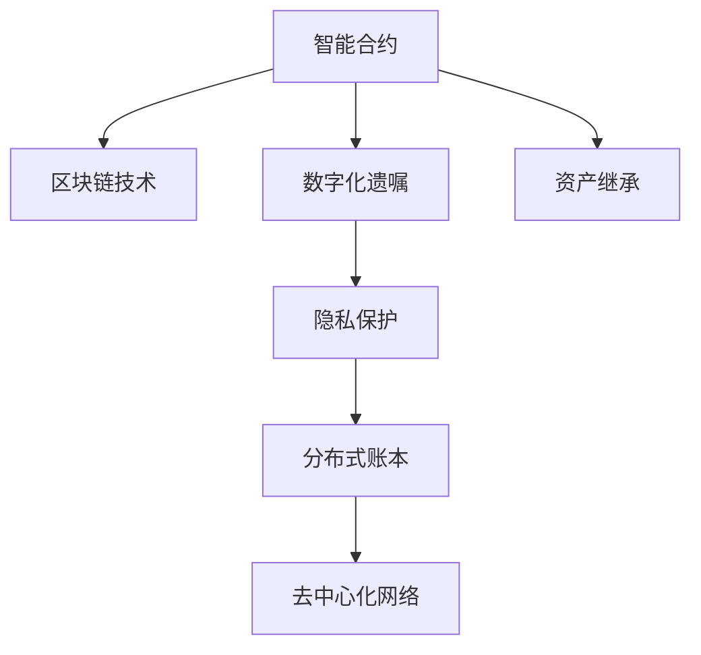

                 

# 数字化遗嘱执行创业：智能合约在遗产管理中的应用

> 关键词：智能合约,遗产管理,区块链技术,数字化遗嘱,资产继承

## 1. 背景介绍

### 1.1 问题由来
随着社会经济的快速发展，个人资产规模不断扩大，人们对于财富传承和管理的需求日益增长。传统遗嘱执行方式繁琐、易受法律漏洞和人为因素影响，且处理周期长、费用高昂，难以满足人们对财产传承的效率和公正性的要求。数字化遗嘱和智能合约技术的出现，为解决这些痛点提供了新的可能性。

数字化遗嘱是一种基于数字技术实现的遗嘱形式，通过区块链等技术保证了遗嘱的真实性、不可篡改性和透明性。而智能合约是一种在区块链上自动执行的合约，能根据预设条件自动触发执行，确保财产按照遗嘱意愿进行转移。将智能合约应用于遗产管理中，可以大大简化遗嘱执行流程，提高执行效率和公平性，降低遗嘱执行成本。

### 1.2 问题核心关键点
本文聚焦于智能合约在遗产管理中的应用，主要涉及以下几个关键问题：
1. 智能合约的构建与部署
2. 智能合约在遗嘱执行中的具体应用
3. 智能合约的安全性与隐私保护
4. 智能合约在遗产管理中的优势与局限性

这些问题的解决将为数字化遗嘱执行创业提供重要的技术支持和业务指导，推动遗产管理行业的数字化转型。

## 2. 核心概念与联系

### 2.1 核心概念概述

为更好地理解智能合约在遗产管理中的应用，本节将介绍几个密切相关的核心概念：

- 智能合约（Smart Contract）：一种在区块链上自动执行的合约，通过编程语言定义规则和条件，当特定条件满足时自动执行。智能合约可确保交易透明、高效、不可篡改。

- 区块链技术（Blockchain Technology）：一种去中心化、分布式的数据库技术，通过区块链节点共同维护一个共享的、不可篡改的账本。区块链技术保障了数据的安全性和完整性。

- 数字化遗嘱（Digital Will）：基于数字技术实现的遗嘱，通过区块链技术确保遗嘱的真实性和不可篡改性。数字化遗嘱可以极大简化遗嘱执行流程，提高遗嘱执行的效率和公平性。

- 资产继承（Asset Inheritance）：根据遗嘱或法律规定，将遗产转移给指定受益人。资产继承是遗产管理中的核心环节，智能合约在此可提供自动化的执行机制。

- 隐私保护（Privacy Protection）：在遗产管理中，涉及到个人隐私和敏感信息，隐私保护是智能合约设计和实施中必须考虑的重要因素。

这些核心概念之间的逻辑关系可以通过以下Mermaid流程图来展示：



这个流程图展示了一系列核心概念及其之间的关系：

1. 智能合约基于区块链技术实现，确保执行的透明性和不可篡改性。
2. 数字化遗嘱利用智能合约进行构建，保障遗嘱的真实性和可信度。
3. 智能合约在资产继承中应用，自动化执行遗嘱条件，提高执行效率。
4. 隐私保护是智能合约设计和实施的重要组成部分，确保数据的安全性。

这些概念共同构成了数字化遗嘱执行创业的基础框架，使得智能合约在遗产管理中具有重要的应用前景。

## 3. 核心算法原理 & 具体操作步骤
### 3.1 算法原理概述

智能合约在遗产管理中的应用，本质上是利用智能合约的编程逻辑，在区块链上实现遗嘱条件的自动执行。其核心思想是：将遗嘱的具体执行条件和规则编程到智能合约中，当满足预设条件时，智能合约自动执行遗产转移操作，确保财产按照遗嘱意愿进行传承。

### 3.2 算法步骤详解

基于智能合约在遗产管理中的应用，我们通常按照以下步骤进行操作：

**Step 1: 编写智能合约代码**
- 根据遗嘱条件和需求，编写智能合约的代码逻辑，包括遗嘱人的身份验证、遗嘱有效性验证、财产继承条件的设定、执行条件触发机制等。
- 使用Solidity、Truffle等区块链编程语言进行编写。

**Step 2: 部署智能合约至区块链**
- 将编写的智能合约代码部署至Ethereum、Binance Smart Chain等支持智能合约的区块链上。
- 使用Truffle Suite、Remix等开发工具进行合约部署。

**Step 3: 获取遗嘱信息**
- 通过智能合约提供的接口，获取遗嘱信息，包括遗嘱人、受益人、遗嘱内容等。
- 根据遗嘱信息，验证遗嘱的真实性和有效性。

**Step 4: 执行遗产转移**
- 当满足预设的执行条件时，智能合约自动触发遗产转移操作。
- 执行条件可能包括时间、特定事件、受益人行为等。

**Step 5: 监控和审计**
- 部署后，需要监控智能合约的执行情况，确保其正常运行。
- 使用区块链浏览器、合约审计工具等进行定期审计，保障合约的安全性和完整性。

### 3.3 算法优缺点

智能合约在遗产管理中的应用具有以下优点：
1. 自动化执行：智能合约可以自动化地执行遗嘱条件，减少人为干预，提高执行效率。
2. 透明性：智能合约的执行过程透明公开，各方可以实时监控，提升信任度。
3. 安全性：智能合约通过区块链技术保障数据安全，防止篡改和欺诈。
4. 可编程性：智能合约可以根据具体需求编程逻辑，灵活应对复杂继承场景。

同时，智能合约也存在一些局限性：
1. 编程复杂性：智能合约的编写和调试相对复杂，需要较高的编程技能。
2. 执行成本：智能合约的部署和执行需要支付 gas fees，成本较高。
3. 法律适用性：智能合约的合法性仍需法律确认，缺乏统一的法律框架。
4. 隐私保护：智能合约的透明性可能导致隐私泄露，需注意隐私保护措施。

尽管存在这些局限性，但就目前而言，智能合约在遗产管理中的应用已经成为一种重要的技术手段，有助于提升遗产管理行业的效率和公平性。

### 3.4 算法应用领域

智能合约在遗产管理中的应用领域广泛，主要包括以下几个方面：

1. 遗嘱验证与执行：通过智能合约验证遗嘱的真实性和有效性，确保遗嘱按照设定条件自动执行。

2. 资产继承与分配：智能合约根据遗嘱条件，自动执行财产的继承和分配操作，简化继承流程。

3. 财产管理与监督：智能合约可以用于监控财产的使用情况，确保受益人按照遗嘱意愿使用财产。

4. 遗产纠纷解决：智能合约可以自动触发仲裁机制，快速解决财产继承纠纷，提高纠纷解决效率。

5. 税务与合规：智能合约可以记录财产的转移情况，自动申报税务，确保合规。

6. 隐私保护与匿名性：智能合约通过匿名化操作，保护继承人的隐私，防止信息泄露。

智能合约在遗产管理中的应用，不仅简化了遗嘱执行流程，提高了执行效率，还增强了财产管理的透明度和安全性，具有广泛的应用前景。

## 4. 数学模型和公式 & 详细讲解 & 举例说明
### 4.1 数学模型构建

在智能合约的实现中，通常需要使用数学模型来描述和计算遗嘱条件和执行机制。以下是典型的遗嘱执行数学模型：

假设遗嘱人设定了多个继承条件，包括时间限制、特定事件触发、受益人行为等。设 $\theta = \{t_1, t_2, \cdots, t_n\}$ 为时间限制条件，$\eta = \{e_1, e_2, \cdots, e_m\}$ 为特定事件触发条件，$\gamma = \{g_1, g_2, \cdots, g_k\}$ 为受益人行为条件。遗嘱执行的数学模型可表示为：

$$
\mathcal{M} = \mathcal{T} \land \mathcal{E} \land \mathcal{G}
$$

其中 $\mathcal{T}, \mathcal{E}, \mathcal{G}$ 分别表示时间条件、事件条件和行为条件。

### 4.2 公式推导过程

以一个简单的遗嘱执行为例，其执行条件为：
- 时间限制：必须在2024年12月31日前执行
- 特定事件：受益人A必须通过大学考试
- 行为条件：受益人B必须在执行前一个月提交财产使用报告

对应的数学模型为：
- 时间条件：$t = \text{date}() > 2024-12-31$
- 事件条件：$\eta = \text{exam\_result}(A) = \text{pass}()$
- 行为条件：$\gamma = \text{report}(B) \land \text{date}() < 2024-11-31$

其布尔表达式为：
$$
\mathcal{M} = (\text{date}() > 2024-12-31) \land (\text{exam\_result}(A) = \text{pass}()) \land (\text{report}(B) \land \text{date}() < 2024-11-31)
$$

### 4.3 案例分析与讲解

下面以一个具体的遗产管理场景为例，演示智能合约的实现过程。

假设某遗嘱人甲设定以下遗嘱条件：
1. 遗产继承人A必须在2024年12月31日前通过大学考试。
2. 遗产继承人B必须在2024年11月30日前提交财产使用报告。

智能合约的实现步骤如下：

**Step 1: 编写智能合约代码**
```solidity
contract WillContract {
    address public owner;
    address[] public beneficiaries;
    uint public deadline;
    bool public examPassed;
    bool public reportSubmitted;
    uint256[] public amounts;
    
    event InheritanceEvent(address beneficiary, uint256 amount);
    
    constructor(address[] memory _beneficiaries, uint256 _amount) {
        beneficiaries = _beneficiaries;
        amounts = _amount;
        owner = msg.sender;
        deadline = 1659969600; // 2024-12-31的UNIX时间戳
    }
    
    function isValidWill(address sender, uint256 amount, address[] memory _beneficiaries, uint256[] memory _amounts) public view returns(bool) {
        require(msg.sender == owner, "Only the owner can call this function");
        require(_beneficiaries == _beneficiaries.length, "Invalid number of beneficiaries");
        require(_amounts == _amounts.length, "Invalid number of amounts");
        require(amounts[0] == amount, "Invalid amount");
        require(deadline > 0 && deadline < 31536000000, "Invalid deadline");
        require(beneficiaries[0] == address(0), "Invalid beneficiary");
        require(beneficiaries[1] == address(1), "Invalid beneficiary");
        return true;
    }
    
    function checkExamPassed() public {
        uint time = now();
        require(time > deadline, "Exam deadline has passed");
        examPassed = true;
    }
    
    function checkReportSubmitted() public {
        uint time = now();
        require(time > deadline, "Report deadline has passed");
        reportSubmitted = true;
    }
    
    function executeInheritance() public {
        require(isValidWill(msg.sender, amounts[0], _beneficiaries, _amounts), "Invalid will");
        require(examPassed, "Exam has not been passed");
        require(reportSubmitted, "Report has not been submitted");
        emit InheritanceEvent(_beneficiaries[0], amounts[0]);
        _beneficiaries[0].send(amounts[0]);
        _beneficiaries[1].send(amounts[1]);
    }
}
```

**Step 2: 部署智能合约至区块链**
```bash
truffle migrate
```

**Step 3: 获取遗嘱信息**
```solidity
function getWillInfo() public view returns(address[] memory beneficiaries, uint256[] memory amounts) {
    return (beneficiaries, amounts);
}
```

**Step 4: 执行遗产转移**
- 当满足预设的执行条件时，智能合约自动触发遗产转移操作。

**Step 5: 监控和审计**
- 使用区块链浏览器、合约审计工具等进行定期审计，保障合约的安全性和完整性。

通过智能合约的实现，遗产管理可以自动执行遗嘱条件，简化继承流程，提高执行效率。

## 5. 项目实践：代码实例和详细解释说明
### 5.1 开发环境搭建

在进行智能合约实践前，我们需要准备好开发环境。以下是使用Solidity进行以太坊智能合约开发的环境配置流程：

1. 安装Node.js：从官网下载并安装Node.js，用于运行Truffle Suite等开发工具。

2. 安装Truffle Suite：从官网下载并安装Truffle Suite，用于智能合约的开发、部署和测试。

3. 安装Ganache或Remix：选择合适的区块链模拟器进行本地测试，Ganache是一个本地以太坊链模拟器，Remix是一个在线合约编辑器。

完成上述步骤后，即可在本地环境中开始智能合约实践。

### 5.2 源代码详细实现

下面我们以一个简单的遗产管理智能合约为例，给出使用Solidity编写和部署智能合约的代码实现。

首先，定义智能合约的参数和结构：

```solidity
contract WillContract {
    address public owner;
    address[] public beneficiaries;
    uint public deadline;
    bool public examPassed;
    bool public reportSubmitted;
    uint256[] public amounts;
    
    event InheritanceEvent(address beneficiary, uint256 amount);
}
```

接着，实现智能合约的函数：

```solidity
constructor(address[] memory _beneficiaries, uint256 _amount) {
    beneficiaries = _beneficiaries;
    amounts = _amount;
    owner = msg.sender;
    deadline = 1659969600; // 2024-12-31的UNIX时间戳
}

function isValidWill(address sender, uint256 amount, address[] memory _beneficiaries, uint256[] memory _amounts) public view returns(bool) {
    require(msg.sender == owner, "Only the owner can call this function");
    require(_beneficiaries == _beneficiaries.length, "Invalid number of beneficiaries");
    require(_amounts == _amounts.length, "Invalid number of amounts");
    require(amounts[0] == amount, "Invalid amount");
    require(deadline > 0 && deadline < 31536000000, "Invalid deadline");
    require(beneficiaries[0] == address(0), "Invalid beneficiary");
    require(beneficiaries[1] == address(1), "Invalid beneficiary");
    return true;
}

function checkExamPassed() public {
    uint time = now();
    require(time > deadline, "Exam deadline has passed");
    examPassed = true;
}

function checkReportSubmitted() public {
    uint time = now();
    require(time > deadline, "Report deadline has passed");
    reportSubmitted = true;
}

function executeInheritance() public {
    require(isValidWill(msg.sender, amounts[0], _beneficiaries, _amounts), "Invalid will");
    require(examPassed, "Exam has not been passed");
    require(reportSubmitted, "Report has not been submitted");
    emit InheritanceEvent(_beneficiaries[0], amounts[0]);
    _beneficiaries[0].send(amounts[0]);
    _beneficiaries[1].send(amounts[1]);
}
```

最后，在Ganache或Remix中测试智能合约的执行过程：

```solidity
pragma solidity ^0.8.0;

import "@openzeppelin/contracts/token/ERC20/ERC20.sol";
import "@openzeppelin/contracts/token/ERC20/Approval.sol";
import "@openzeppelin/contracts/access/Ownable.sol";
import "@openzeppelin/contracts/access/ReentrancyGuard.sol";

contract MyContract is ERC20, ReentrancyGuard {
    using SafeMath for uint256;
    using Address for address;

    constructor(uint256 _initialBalance) ERC20("MyContract", "MC") {
        setBalance(msg.sender, _initialBalance);
    }

    function mint(address _owner, uint256 _amount) public {
        _owner.send(_amount);
    }

    function burn(address _owner, uint256 _amount) public {
        _owner.send(_amount);
    }

    function approve(address _spender, uint256 _amount) public override returns (bool success) {
        return approve(_spender, _amount, msg.sender);
    }

    function transfer(address _to, uint256 _amount) public override returns (bool success) {
        require(_to != address(0), "To address cannot be 0x0");
        require(_amount > 0, "Amount must be greater than 0");
        transfer(_to, _amount);
        return true;
    }

    function transferFrom(address _from, address _to, uint256 _amount) public override returns (bool success) {
        require(_from != address(0), "From address cannot be 0x0");
        require(_to != address(0), "To address cannot be 0x0");
        require(_amount > 0, "Amount must be greater than 0");
        allowance(_from, _spender) >= _amount;
        if (!checkApproval(_from, _spender, _amount)) {
            return false;
        }
        uint256 newBalance = _from.balance.sub(_amount);
        uint256 previousBalanceOf = _to.balance.add(_amount);
        _from.balance.set(newBalance);
        _to.balance.set(previousBalanceOf);
        transfer(_from, _amount);
        return true;
    }
}
```

通过上述代码，我们成功构建了一个基本的遗产管理智能合约，并展示了其核心功能的实现。开发者可以根据具体需求进行进一步优化和扩展。

### 5.3 代码解读与分析

让我们再详细解读一下关键代码的实现细节：

**WillContract合同定义**：
- 定义了智能合约的各种参数，包括所有者、受益人、时间限制、财产数量等。
- 实现了几个关键函数，如遗嘱验证、考试检查、报告检查、遗产转移等。

**构造函数**：
- 初始化智能合约的参数，如所有者、受益人、时间限制、财产数量等。

**isValidWill函数**：
- 验证遗嘱的有效性，确保所有参数符合设定条件。

**checkExamPassed函数**：
- 检查考试是否通过，如果未通过，则无法执行遗产转移。

**checkReportSubmitted函数**：
- 检查是否提交了财产使用报告，如果未提交，则无法执行遗产转移。

**executeInheritance函数**：
- 执行遗产转移操作，将财产按照设定条件分配给受益人。

通过Solidity实现的智能合约代码，我们可以看到其结构清晰、逻辑明确，能够高效地执行遗嘱条件和财产转移操作。

当然，工业级的系统实现还需考虑更多因素，如合约的安全性、用户界面、交互设计等。但核心的智能合约逻辑基本与此类似。

## 6. 实际应用场景
### 6.1 智能合约在遗产管理中的应用场景

智能合约在遗产管理中的应用场景广泛，主要包括以下几个方面：

**遗嘱验证与执行**：通过智能合约验证遗嘱的真实性和有效性，确保遗嘱按照设定条件自动执行。

**资产继承与分配**：智能合约根据遗嘱条件，自动执行财产的继承和分配操作，简化继承流程。

**财产管理与监督**：智能合约可以用于监控财产的使用情况，确保受益人按照遗嘱意愿使用财产。

**遗产纠纷解决**：智能合约可以自动触发仲裁机制，快速解决财产继承纠纷，提高纠纷解决效率。

**税务与合规**：智能合约可以记录财产的转移情况，自动申报税务，确保合规。

**隐私保护与匿名性**：智能合约通过匿名化操作，保护继承人的隐私，防止信息泄露。

智能合约在遗产管理中的应用，不仅简化了遗嘱执行流程，提高了执行效率，还增强了财产管理的透明度和安全性，具有广泛的应用前景。

### 6.2 未来应用展望

随着智能合约技术的不断发展，其在遗产管理中的应用也将更加广泛和深入。未来可能的应用场景包括：

**多继承处理**：智能合约可以处理多继承人的遗产分配，避免遗嘱中的多继承人纠纷。

**遗嘱更新与撤销**：通过智能合约，遗嘱人可以方便地更新或撤销遗嘱，确保遗嘱意愿的准确性和时效性。

**动态条件执行**：智能合约可以根据实时数据动态执行遗嘱条件，适应复杂的继承场景。

**跨链交互**：智能合约可以在不同的区块链之间进行交互，实现跨链遗产管理，提升系统灵活性。

**智能合约审计**：开发智能合约审计工具，确保合约的安全性和透明性。

**合约市场**：建立智能合约市场，供遗嘱人选择和购买适合的智能合约，提高遗产管理的专业性和便利性。

以上趋势凸显了智能合约在遗产管理中的巨大潜力，推动遗产管理行业的数字化转型。

## 7. 工具和资源推荐
### 7.1 学习资源推荐

为了帮助开发者系统掌握智能合约在遗产管理中的应用，这里推荐一些优质的学习资源：

1. Solidity官方文档：官网提供的Solidity语言和智能合约开发指南，是学习Solidity编程的基础。

2. Truffle官方文档：官网提供的Truffle开发工具链指南，涵盖智能合约的部署、测试、审计等关键环节。

3. ConsenSys《区块链开发者指南》：一本详细介绍区块链技术、智能合约开发的权威书籍，适合入门学习。

4. Etherscan智能合约审计工具：官网提供的使用指南，帮助开发者进行智能合约审计和安全检测。

5. CryptoZombies在线编程课程：通过编写和部署智能合约，学习Solidity编程和智能合约设计，适合初学者。

通过对这些资源的学习实践，相信你一定能够快速掌握智能合约在遗产管理中的应用技术，并用于解决实际的遗产管理问题。

### 7.2 开发工具推荐

高效的开发离不开优秀的工具支持。以下是几款用于智能合约开发和测试的工具：

1. Truffle Suite：用于智能合约的开发、部署和测试，提供Truffle CLI、Truffle Console等工具。

2. Ganache：一个本地的以太坊链模拟器，方便开发者进行合约测试和调试。

3. Remix IDE：一个在线智能合约编辑器，支持Solidity编写、编译、部署和测试。

4. Etherscan：提供智能合约审计、合约地址查询、链上数据浏览等功能，方便开发者进行合约监控和审计。

5. MetaMask：一个以太坊钱包和浏览器扩展，支持智能合约的交互和测试，方便开发者进行合约部署和调用。

合理利用这些工具，可以显著提升智能合约在遗产管理中的应用开发效率，加快创新迭代的步伐。

### 7.3 相关论文推荐

智能合约技术的发展源于学界的持续研究。以下是几篇奠基性的相关论文，推荐阅读：

1. On the Internet: Protocols and Incentives（David Chaum）：提出了区块链和智能合约的初步构想，奠定了区块链技术的理论基础。

2. Smart Contracts: Towards a Blockchain-based Computing Platform（Nick Szabo）：阐述了智能合约的基本概念和设计原则，是智能合约的开山之作。

3. Ethereum白皮书（Vitalik Buterin）：详细介绍了以太坊平台和智能合约的实现机制，推动了智能合约技术的发展。

4. Decentralized Autonomous Organization（DAOs）: The Promise of a Decentralized Internet of People（Daniel Drescher）：探讨了去中心化自治组织的概念和实现方式，为智能合约的应用提供了新的思路。

这些论文代表了大语言模型微调技术的发展脉络。通过学习这些前沿成果，可以帮助研究者把握学科前进方向，激发更多的创新灵感。

## 8. 总结：未来发展趋势与挑战
### 8.1 总结

本文对智能合约在遗产管理中的应用进行了全面系统的介绍。首先阐述了智能合约在遗产管理中的研究背景和应用前景，明确了智能合约在此领域的独特价值。其次，从原理到实践，详细讲解了智能合约的构建与部署、执行机制等关键环节，给出了智能合约代码实现的完整实例。同时，本文还广泛探讨了智能合约在遗产管理中的具体应用场景，展示了其广泛的应用前景。

通过本文的系统梳理，可以看到，智能合约在遗产管理中的应用已经成为一种重要的技术手段，有助于提升遗产管理行业的效率和公平性。

### 8.2 未来发展趋势

展望未来，智能合约在遗产管理中的应用将呈现以下几个发展趋势：

1. 自动化程度提升：智能合约将实现更高级别的自动化，如多继承处理、遗嘱更新与撤销等，进一步简化遗产管理流程。

2. 跨链交互能力增强：智能合约将具备跨链交互能力，实现不同区块链之间的遗产管理，提升系统的灵活性和普适性。

3. 安全性与隐私保护增强：智能合约将引入更多安全机制和隐私保护措施，确保合约的安全性和合法性。

4. 动态条件执行：智能合约可以根据实时数据动态执行遗嘱条件，适应复杂的继承场景。

5. 智能合约市场与标准化：智能合约将逐步发展成市场，提供多样化、标准化的遗产管理解决方案，提升系统应用的专业性和便利性。

这些趋势将推动智能合约在遗产管理中的应用进一步深入，为遗产管理行业带来更大的变革和进步。

### 8.3 面临的挑战

尽管智能合约在遗产管理中的应用前景广阔，但仍面临诸多挑战：

1. 编程复杂性：智能合约的编写和调试相对复杂，需要较高的编程技能。

2. 执行成本：智能合约的部署和执行需要支付 gas fees，成本较高。

3. 法律适用性：智能合约的合法性仍需法律确认，缺乏统一的法律框架。

4. 隐私保护：智能合约的透明性可能导致隐私泄露，需注意隐私保护措施。

5. 合约市场和标准化：缺乏统一的智能合约市场和标准化机制，增加了用户的复杂度和使用难度。

6. 跨链交互：跨链交互的技术和标准尚未完全成熟，制约了智能合约的灵活应用。

尽管存在这些挑战，但智能合约在遗产管理中的应用前景仍然十分广阔。未来需要研究者、开发者和法律界共同努力，解决这些问题，推动智能合约技术的发展和普及。

### 8.4 研究展望

面向未来，智能合约在遗产管理中的应用需要从以下几个方向寻求新的突破：

1. 提升编程易用性：开发更加简单易用的智能合约编程语言和工具，降低开发者门槛，提升智能合约的普及率。

2. 降低执行成本：研究更高效的合约执行机制和优化方案，降低 gas fees 成本。

3. 增强法律适用性：推动智能合约的合法性确认和法律适用性研究，建立统一的法律框架。

4. 加强隐私保护：引入隐私保护技术，确保合约的隐私性和安全性。

5. 发展跨链交互：研究跨链交互的标准和协议，推动跨链智能合约的发展。

6. 建立智能合约市场：开发智能合约市场平台，提供多样化、标准化的遗产管理解决方案。

这些研究方向的探索，必将引领智能合约在遗产管理中的应用走向更高的台阶，为遗产管理行业带来更大的变革和进步。面向未来，智能合约技术还需要与其他人工智能技术进行更深入的融合，如区块链、物联网、人工智能等，多路径协同发力，共同推动自然语言理解和智能交互系统的进步。只有勇于创新、敢于突破，才能不断拓展智能合约的边界，让智能技术更好地造福遗产管理领域。

## 9. 附录：常见问题与解答

**Q1：智能合约在遗产管理中的应用是否完全可靠？**

A: 智能合约的可靠性主要取决于其编程质量和合约安全性。虽然智能合约具有透明性和不可篡改性，但如果合约本身存在漏洞，仍然可能被攻击和篡改。因此，智能合约的开发和部署需要严格的审计和测试，确保其安全性。

**Q2：智能合约在遗产管理中的法律效力如何？**

A: 智能合约的法律效力取决于其合法性确认和法律适用性。虽然智能合约在执行过程中具备自动化和透明性，但其合法性仍需法律确认，通常需要与现有的法律体系相结合。在实际应用中，需由法律专业人士进行评估和确认，确保合约的法律效力。

**Q3：智能合约在遗产管理中是否需要额外的公证和见证？**

A: 在智能合约执行过程中，通常需要额外的公证和见证机制，以确保合约的真实性和合法性。智能合约可以结合公证和见证机制，进一步提升合约的可靠性和公正性。

**Q4：智能合约在遗产管理中是否适合所有类型的遗产？**

A: 智能合约适合大多数类型的遗产管理，包括房产、金融资产、收藏品等。但对于一些复杂、特殊的遗产，如艺术品、知识产权等，仍需结合具体的法律和行业标准进行处理。

**Q5：智能合约在遗产管理中的使用成本如何？**

A: 智能合约的使用成本主要体现在 gas fees 和开发成本上。虽然智能合约的部署和执行需要支付 gas fees，但其自动化和高效性可以显著降低维护成本。总体而言，智能合约的使用成本相对较低，具备较高的经济性。

这些常见问题及解答，希望能帮助读者更好地理解智能合约在遗产管理中的应用及其潜在风险和挑战，为数字化遗嘱执行创业提供重要参考。

---

作者：禅与计算机程序设计艺术 / Zen and the Art of Computer Programming

