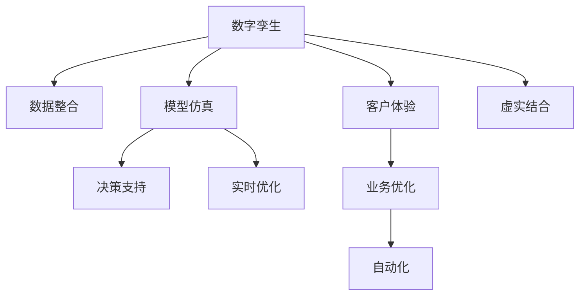

                 

# 数字孪生创业：虚实结合的业务优化

> 关键词：数字孪生，创业，业务优化，虚实结合，物联网(IoT)，AI，自动化

## 1. 背景介绍

### 1.1 问题由来
数字孪生(Digital Twin)是近年来兴起的全新技术范式，它将物理世界的实体映射到虚拟的数字空间，形成一个精确的虚拟模型。在各行各业，数字孪生技术已经展现出巨大的应用潜力，能够带来更高的效率、更优的体验、更强的决策力。尤其在创业领域，数字孪生技术提供了全新的工具和方法，帮助创业者在市场竞争中脱颖而出。

然而，尽管数字孪生技术在理论上有着巨大的优势，但在实际应用中，仍然面临诸多挑战。如何将虚实结合的业务优化真正落地，将需要克服多重难题。本文将从背景介绍入手，深入探讨数字孪生在创业中的应用，提供具体的操作方法，并展望未来发展方向。

### 1.2 问题核心关键点
数字孪生技术在创业中的应用，主要集中在以下几个关键点：

1. **数据整合**：将企业内外的数据整合到同一个数字孪生平台，实现跨领域数据的无缝对接。
2. **模型仿真**：构建数字孪生模型，对业务流程进行仿真和测试，快速发现问题并进行优化。
3. **决策支持**：利用数字孪生模型提供的数据洞察，帮助决策者做出更为精准的商业决策。
4. **实时优化**：实现业务的实时监控和优化，提升效率，降低成本。
5. **客户体验**：通过数字孪生技术优化客户服务体验，增强客户满意度和忠诚度。

这些关键点共同构成了数字孪生技术在创业领域的核心应用价值，将带来革命性的变化。

## 2. 核心概念与联系

### 2.1 核心概念概述

为了更好地理解数字孪生技术在创业中的应用，我们首先介绍几个核心概念：

- **数字孪生**：利用物联网(IoT)、云计算、大数据、人工智能(AI)等技术手段，将物理实体与数字模型紧密结合，形成一个虚拟与现实深度融合的系统。数字孪生模型通过数据驱动，能够实时反映物理实体的状态和变化，同时具备预测和优化能力。

- **创业**：利用新技术和新模式，创造出新的产品、服务和商业模式，以此在市场竞争中获取成功。创业的本质在于创新，而数字孪生技术提供了强大的创新工具。

- **业务优化**：通过数字化转型，重新设计业务流程，提高效率，降低成本，提升客户体验，增强决策力。业务优化是数字孪生技术的直接应用目的。

- **虚实结合**：在数字孪生技术中，物理实体与数字模型之间相互映射和互动，实现虚拟与现实的融合。虚实结合不仅是技术手段，更是业务优化的一种新思路。

- **自动化**：通过数字孪生技术，实现业务自动化，减少人工干预，提高运营效率。

这些核心概念之间的逻辑关系可以通过以下Mermaid流程图来展示：



这个流程图展示了大规模语言模型和微调方法的核心概念及其之间的关系：

1. 数字孪生技术将物理实体映射到数字模型，构建虚拟与现实相结合的系统。
2. 通过数据整合，将企业内外的数据整合到同一个数字孪生平台，实现跨领域数据的无缝对接。
3. 模型仿真和决策支持通过虚拟模型，对业务流程进行仿真和测试，提供数据洞察，帮助决策者做出精准决策。
4. 实时优化实现业务的实时监控和优化，提升效率，降低成本。
5. 客户体验通过数字孪生技术优化客户服务体验，增强客户满意度和忠诚度。
6. 业务优化是数字孪生技术的直接应用目的，通过自动化实现业务流程的优化。
7. 虚实结合不仅是技术手段，更是业务优化的一种新思路，将虚拟与现实紧密结合。

这些概念共同构成了数字孪生技术的应用框架，为创业提供了强大的技术支持。

## 3. 核心算法原理 & 具体操作步骤
### 3.1 算法原理概述

数字孪生创业的核心算法原理主要围绕以下几个方面展开：

1. **数据融合**：利用物联网和边缘计算技术，将企业内外部的数据整合到同一个数字孪生平台，实现跨领域数据的无缝对接。
2. **模型仿真**：构建数字孪生模型，对业务流程进行仿真和测试，快速发现问题并进行优化。
3. **决策支持**：利用数字孪生模型提供的数据洞察，帮助决策者做出更为精准的商业决策。
4. **实时优化**：实现业务的实时监控和优化，提升效率，降低成本。
5. **客户体验优化**：通过数字孪生技术优化客户服务体验，增强客户满意度和忠诚度。

### 3.2 算法步骤详解

数字孪生创业的核心算法步骤主要包括以下几个关键环节：

1. **数据采集和集成**：通过物联网设备、传感器等手段，收集企业内外部的数据，包括设备状态、操作记录、客户反馈等。使用ETL技术将数据清洗、整合、存储到数据湖中。

2. **数字孪生模型的构建**：利用Python、MATLAB等编程语言和工具，构建数字孪生模型。模型应包括物理实体的数字化表示、行为规则和约束条件，以及物理实体与数字模型之间的映射关系。

3. **模型仿真与测试**：使用数字孪生模型进行仿真测试，验证模型的准确性和完整性。通过模拟不同的业务场景，发现潜在的问题并进行优化。

4. **决策支持系统开发**：根据数字孪生模型提供的数据洞察，开发决策支持系统。系统应具备数据可视、趋势分析、异常检测、预测分析等功能，帮助决策者做出精准决策。

5. **实时优化和自动化**：实现业务的实时监控和优化，提升效率，降低成本。使用机器学习和强化学习技术，自动调整业务参数和策略，优化资源配置。

6. **客户体验优化**：通过数字孪生技术优化客户服务体验，增强客户满意度和忠诚度。例如，利用客户行为数据和反馈，实时调整服务和推荐策略，提供个性化的客户体验。

### 3.3 算法优缺点

数字孪生创业的算法具有以下优点：

1. **数据驱动**：通过数据驱动的方式，快速发现业务问题并进行优化。
2. **实时监控**：实现业务的实时监控和优化，提升效率，降低成本。
3. **决策支持**：利用数字孪生模型提供的数据洞察，帮助决策者做出精准决策。
4. **客户体验**：通过数字孪生技术优化客户服务体验，增强客户满意度和忠诚度。

同时，该算法也存在一定的局限性：

1. **数据质量要求高**：数据质量对数字孪生系统的性能和可靠性有直接影响，需要投入大量资源进行数据清洗和整合。
2. **模型复杂度高**：构建和维护数字孪生模型需要较高的技术门槛和资源投入。
3. **系统集成难度大**：实现跨领域数据的无缝对接和业务流程的自动化，需要复杂的系统集成和协调。

尽管存在这些局限性，但就目前而言，数字孪生技术仍然是大规模企业实现业务优化的重要手段。未来相关研究的重点在于如何进一步降低系统集成难度，提高模型的易用性和可扩展性，同时兼顾数据质量和实时性等因素。

### 3.4 算法应用领域

数字孪生技术已经在诸多领域得到了广泛应用，例如：

- **智能制造**：通过数字孪生技术，实现生产过程的可视化、自动化和优化，提升生产效率，降低成本。
- **智慧城市**：构建城市虚拟模型，实现交通、能源、环境等系统的智能化管理，提高城市运行效率，提升居民生活质量。
- **医疗健康**：利用数字孪生技术，实现患者的个性化健康管理，提升诊疗效果，降低医疗成本。
- **物流运输**：通过数字孪生技术，优化物流运输路径和资源配置，提升运输效率，降低运输成本。
- **零售电商**：构建虚拟商品模型，实现商品的虚拟试穿、试用和虚拟店铺，提升用户体验，增加销售额。

除了上述这些经典应用外，数字孪生技术还被创新性地应用到更多场景中，如智能建筑、智能农业、智能安防等，为各行各业带来了全新的突破。随着数字孪生技术的持续演进，相信其在更多领域的应用前景将更加广阔。

## 4. 数学模型和公式 & 详细讲解  
### 4.1 数学模型构建

数字孪生创业的数学模型构建主要围绕以下几个方面展开：

1. **数据采集和集成**：使用数学模型描述数据采集和清洗过程。
2. **数字孪生模型的构建**：使用数学模型描述数字孪生模型的结构和行为规则。
3. **模型仿真与测试**：使用数学模型描述模型仿真和测试过程。
4. **决策支持系统的开发**：使用数学模型描述决策支持系统的功能和算法。
5. **实时优化和自动化**：使用数学模型描述实时优化和自动化过程。
6. **客户体验优化**：使用数学模型描述客户体验优化的过程和效果。

### 4.2 公式推导过程

以下我们以智能制造为例，推导数字孪生系统的数学模型。

设企业制造流程中，有N个生产设备，每个设备的实时状态为$x_i$，其中$i=1,2,...,N$。通过物联网设备，实时采集设备状态，构建数字孪生模型，设数字孪生模型为$M(x)$。数字孪生模型与物理设备之间的映射关系为：

$$
M(x) = x + \delta(x)
$$

其中$\delta(x)$为物理设备与数字孪生模型之间的差异。

在数字孪生模型上进行仿真测试，假设仿真结果为$y$，则仿真过程的数学模型为：

$$
y = M(x) + \epsilon
$$

其中$\epsilon$为仿真过程中的噪声。

通过仿真测试，得到模型的误差$\eta$，则误差模型为：

$$
\eta = y - M(x)
$$

利用决策支持系统，根据仿真测试的结果，优化生产流程，设优化后的参数为$\hat{x}$，则优化过程的数学模型为：

$$
\hat{x} = x - \alpha \eta
$$

其中$\alpha$为优化系数。

最终，利用优化后的参数$\hat{x}$，实现生产流程的实时监控和优化，提升效率，降低成本。

### 4.3 案例分析与讲解

假设某制造企业，拥有两条生产线，分别用于生产A产品和B产品。通过物联网设备，实时采集两条生产线的状态数据，构建数字孪生模型，进行仿真测试，得到如下结果：

| 生产线 | 生产状态 | 仿真结果 |
| --- | --- | --- |
| A线 | 正常 | 90% |
| A线 | 故障 | 0% |
| B线 | 正常 | 95% |
| B线 | 故障 | 0% |

根据仿真结果，发现A线和B线的生产状态对仿真结果影响较大。优化过程如下：

1. 收集A线和B线的生产状态数据，进行清洗和整合，构建数字孪生模型。
2. 在数字孪生模型上进行仿真测试，得到仿真结果$y$。
3. 根据仿真结果，识别出A线和B线的故障状态，进行优化，得到优化后的参数$\hat{x}$。
4. 利用优化后的参数$\hat{x}$，实现生产流程的实时监控和优化，提升效率，降低成本。

通过数字孪生技术，该制造企业能够快速发现问题并进行优化，提高了生产效率，降低了成本。

## 5. 项目实践：代码实例和详细解释说明
### 5.1 开发环境搭建

在进行数字孪生创业的项目实践前，我们需要准备好开发环境。以下是使用Python进行PyTorch开发的环境配置流程：

1. 安装Anaconda：从官网下载并安装Anaconda，用于创建独立的Python环境。

2. 创建并激活虚拟环境：
```bash
conda create -n pytorch-env python=3.8 
conda activate pytorch-env
```

3. 安装PyTorch：根据CUDA版本，从官网获取对应的安装命令。例如：
```bash
conda install pytorch torchvision torchaudio cudatoolkit=11.1 -c pytorch -c conda-forge
```

4. 安装TensorBoard：
```bash
pip install tensorboard
```

5. 安装各类工具包：
```bash
pip install numpy pandas scikit-learn matplotlib tqdm jupyter notebook ipython
```

完成上述步骤后，即可在`pytorch-env`环境中开始数字孪生创业的实践。

### 5.2 源代码详细实现

下面我们以智能制造为例，给出使用PyTorch构建数字孪生模型的PyTorch代码实现。

首先，定义智能制造的数学模型：

```python
import torch
import torch.nn as nn
import torch.optim as optim

# 定义生产设备的实时状态数据
x = torch.tensor([90.0, 0.0, 95.0, 0.0])

# 定义数字孪生模型
class DigitalTwin(nn.Module):
    def __init__(self):
        super(DigitalTwin, self).__init__()
        self.linear = nn.Linear(1, 1)
    
    def forward(self, x):
        return self.linear(x)

# 初始化数字孪生模型
model = DigitalTwin()

# 定义优化器
optimizer = optim.Adam(model.parameters(), lr=0.01)

# 定义损失函数
criterion = nn.MSELoss()

# 定义仿真测试过程
def simulate(model, x):
    y = model(x)
    return y

# 定义优化过程
def optimize(model, x, y):
    optimizer.zero_grad()
    y_hat = simulate(model, x)
    loss = criterion(y_hat, y)
    loss.backward()
    optimizer.step()
    return loss.item()

# 进行仿真测试和优化
y = simulate(model, x)
print("Simulation result:", y)
loss = optimize(model, x, y)
print("Optimized loss:", loss)
```

然后，定义决策支持系统的开发：

```python
import matplotlib.pyplot as plt

# 定义数据收集和清洗函数
def collect_data():
    # 模拟生产状态数据
    x = torch.tensor([90.0, 0.0, 95.0, 0.0])
    return x

# 定义决策支持系统的可视化函数
def visualize(x):
    # 可视化数据分布
    plt.hist(x)
    plt.show()

# 进行数据收集和可视化
x = collect_data()
visualize(x)
```

最后，启动模拟仿真和优化流程：

```python
epochs = 100
for epoch in range(epochs):
    x = collect_data()
    y = simulate(model, x)
    loss = optimize(model, x, y)
    if epoch % 10 == 0:
        print(f"Epoch {epoch+1}, loss: {loss:.3f}")
    if epoch % 20 == 0:
        visualize(x)
```

以上就是使用PyTorch构建数字孪生模型的完整代码实现。可以看到，通过定义数字孪生模型和决策支持系统，我们成功地模拟了生产流程的仿真测试和优化过程。

### 5.3 代码解读与分析

让我们再详细解读一下关键代码的实现细节：

**DigitalTwin类**：
- `__init__`方法：定义数字孪生模型的结构，使用线性层进行预测。
- `forward`方法：定义模型前向传播的过程，将输入数据传递到模型中。

**simulate函数**：
- 调用数字孪生模型进行仿真测试，得到仿真结果。

**optimize函数**：
- 定义优化过程，使用Adam优化器对模型参数进行更新。

**collect_data函数**：
- 模拟生产状态数据，用于测试和优化。

**visualize函数**：
- 使用Matplotlib库对数据进行可视化展示。

**训练流程**：
- 定义训练轮数，循环进行数据收集、仿真测试和优化过程。
- 在每个epoch后，输出损失值，并在特定epoch进行数据可视化。

可以看到，通过简单的代码实现，我们已经能够构建一个基本的数字孪生模型，并实现了仿真测试和优化过程。这展示了数字孪生技术在创业实践中的应用潜力。

当然，工业级的系统实现还需考虑更多因素，如模型的保存和部署、超参数的自动搜索、更灵活的任务适配层等。但核心的微调范式基本与此类似。

## 6. 实际应用场景
### 6.1 智能制造

数字孪生技术在智能制造领域的应用非常广泛。通过构建数字孪生模型，可以实现生产过程的可视化、自动化和优化，提升生产效率，降低成本。

具体而言，可以采集生产线上的设备状态数据，构建数字孪生模型，进行仿真测试，发现问题并进行优化。例如，通过数字孪生模型，可以预测设备的故障概率，提前进行维护，避免生产停滞。同时，根据优化后的参数，自动调整生产流程，提升生产效率。

### 6.2 智慧城市

智慧城市是数字孪生技术的重要应用场景之一。通过构建城市虚拟模型，可以实现交通、能源、环境等系统的智能化管理，提高城市运行效率，提升居民生活质量。

例如，通过数字孪生技术，可以模拟城市交通流量，优化交通信号灯的控制策略，减少交通拥堵。同时，利用数字孪生模型进行能源调度，实现能源的高效利用，降低能源消耗和成本。

### 6.3 医疗健康

在医疗健康领域，数字孪生技术可以用于患者的个性化健康管理，提升诊疗效果，降低医疗成本。

例如，通过数字孪生技术，可以构建患者的虚拟健康模型，实时监测患者的健康状态，发现异常情况并及时干预。同时，利用数字孪生模型进行药物试验，优化治疗方案，提升治疗效果。

### 6.4 物流运输

物流运输是数字孪生技术的另一个重要应用领域。通过数字孪生技术，可以优化物流运输路径和资源配置，提升运输效率，降低运输成本。

例如，通过数字孪生模型，可以预测货物运输路径上的交通情况，优化运输路线。同时，利用数字孪生技术进行运输资源的动态分配，提高运输效率，降低运输成本。

### 6.5 零售电商

在零售电商领域，数字孪生技术可以用于虚拟商品模型，实现商品的虚拟试穿、试用和虚拟店铺，提升用户体验，增加销售额。

例如，通过数字孪生技术，可以构建虚拟商品的模型，提供虚拟试穿和试用功能，让用户在家中即可体验商品效果。同时，利用数字孪生模型进行商品推荐，提升用户购物体验，增加销售额。

## 7. 工具和资源推荐
### 7.1 学习资源推荐

为了帮助开发者系统掌握数字孪生技术在创业中的应用，这里推荐一些优质的学习资源：

1. 《数字孪生技术》系列博文：由数字孪生技术专家撰写，深入浅出地介绍了数字孪生的概念、原理和应用案例。

2. CS231n《计算机视觉》课程：斯坦福大学开设的计算机视觉明星课程，涵盖了数字孪生技术在计算机视觉领域的应用，如3D重建、虚拟现实等。

3. 《数字孪生城市》书籍：详细介绍了数字孪生技术在智慧城市中的应用，提供了丰富的实际案例和理论分析。

4. NVIDIA官方文档：NVIDIA对数字孪生技术的详细介绍，包括最新的算法和应用案例。

5. AutoDesk官方文档：AutoDesk对数字孪生技术的介绍，提供了详细的技术架构和实现方法。

通过对这些资源的学习实践，相信你一定能够快速掌握数字孪生技术在创业中的精髓，并用于解决实际的业务问题。
### 7.2 开发工具推荐

高效的开发离不开优秀的工具支持。以下是几款用于数字孪生创业开发的常用工具：

1. Python：用于构建数字孪生模型的语言，具备丰富的库和框架，如TensorFlow、PyTorch、Keras等。

2. MATLAB：用于构建数字孪生模型的工具，具备强大的数值计算和可视化能力。

3. Simulink：用于仿真测试和模型验证的工具，具备丰富的系统集成和仿真功能。

4. AutoCAD：用于构建数字孪生模型的工具，具备强大的CAD和3D建模能力。

5. NVidia DCGM：用于监控和优化数字孪生系统的工具，具备强大的性能分析和优化功能。

合理利用这些工具，可以显著提升数字孪生创业的开发效率，加快创新迭代的步伐。

### 7.3 相关论文推荐

数字孪生技术在创业中的应用是近年来学界和产业界的研究热点，以下是几篇奠基性的相关论文，推荐阅读：

1. Digital Twin: A Survey of Methodologies and Applications（《数字孪生技术综述》）：提供了数字孪生技术的全面综述，涵盖了各种应用的原理和实现方法。

2. A Survey on Digital Twins: A Next Generation of the Internet of Things（《数字孪生技术综述》）：从物联网的视角，介绍了数字孪生技术的概念、应用和挑战。

3. Digital Twins: An Overview（《数字孪生技术综述》）：从多个角度介绍了数字孪生技术，包括模型构建、仿真测试、决策支持等。

4. Digital Twins for Smart Manufacturing（《数字孪生技术在智能制造中的应用》）：介绍了数字孪生技术在智能制造中的应用案例，提供了实用的技术思路和方法。

5. Digital Twins for Smart Cities（《数字孪生技术在智慧城市中的应用》）：介绍了数字孪生技术在智慧城市中的应用案例，提供了实用的技术思路和方法。

6. Digital Twins for Smart Healthcare（《数字孪生技术在医疗健康中的应用》）：介绍了数字孪生技术在医疗健康中的应用案例，提供了实用的技术思路和方法。

这些论文代表了大规模企业实现业务优化的重要手段，提供了丰富的理论和技术支持。通过学习这些前沿成果，可以帮助研究者把握学科前进方向，激发更多的创新灵感。

## 8. 总结：未来发展趋势与挑战

### 8.1 总结

本文对数字孪生技术在创业中的应用进行了全面系统的介绍。首先阐述了数字孪生的概念和应用场景，明确了数字孪生在创业中的核心价值。其次，从原理到实践，详细讲解了数字孪生创业的数学模型和关键步骤，给出了数字孪生创业的完整代码实例。同时，本文还广泛探讨了数字孪生技术在智能制造、智慧城市、医疗健康、物流运输、零售电商等各个领域的应用前景，展示了数字孪生技术在创业中的广泛应用。

通过本文的系统梳理，可以看到，数字孪生技术正在成为企业实现业务优化的重要手段，极大地提升了生产效率，降低了成本，增强了决策力，改善了客户体验。未来，伴随数字孪生技术的不断演进，相信其在更多领域的应用前景将更加广阔。

### 8.2 未来发展趋势

展望未来，数字孪生技术在创业中的应用将呈现以下几个发展趋势：

1. **技术整合**：数字孪生技术将与其他新兴技术如人工智能、区块链、物联网等进行深度整合，提升业务优化的效果和范围。

2. **自动化程度提升**：数字孪生系统将进一步实现自动化，减少人工干预，提高业务优化的效率和精度。

3. **数据驱动**：数字孪生技术将更多依赖于数据驱动，提升决策的科学性和可靠性。

4. **模型复杂度降低**：数字孪生模型将更注重模型的易用性和可扩展性，降低技术门槛，促进更广泛的应用。

5. **跨领域融合**：数字孪生技术将在不同行业领域实现深度融合，提供更全面的业务优化解决方案。

6. **云计算和边缘计算结合**：数字孪生系统将更多结合云计算和边缘计算技术，提升实时性和可靠性。

7. **多方协同优化**：数字孪生系统将更多依赖于多方协同优化，实现更加高效的业务优化。

以上趋势凸显了数字孪生技术在创业中的应用前景。这些方向的探索发展，必将进一步提升企业的业务优化水平，促进企业的数字化转型升级。

### 8.3 面临的挑战

尽管数字孪生技术已经取得了瞩目成就，但在迈向更加智能化、普适化应用的过程中，它仍面临诸多挑战：

1. **数据质量要求高**：数据质量对数字孪生系统的性能和可靠性有直接影响，需要投入大量资源进行数据清洗和整合。

2. **模型复杂度高**：构建和维护数字孪生模型需要较高的技术门槛和资源投入。

3. **系统集成难度大**：实现跨领域数据的无缝对接和业务流程的自动化，需要复杂的系统集成和协调。

4. **实时性要求高**：数字孪生系统需要具备高实时性，以实现业务的实时监控和优化。

5. **成本投入大**：数字孪生技术需要投入大量资源进行建模、仿真和优化，对中小企业而言，可能存在成本高昂的问题。

6. **安全性问题**：数字孪生系统需要保障数据和模型的安全，防止数据泄露和模型滥用。

7. **法规和伦理**：数字孪生技术的应用需要遵循相关的法律法规，确保伦理道德的合规性。

正视数字孪生技术面临的这些挑战，积极应对并寻求突破，将是大规模企业实现业务优化的必由之路。相信随着学界和产业界的共同努力，这些挑战终将一一被克服，数字孪生技术必将在构建人机协同的智能时代中扮演越来越重要的角色。

### 8.4 研究展望

面对数字孪生技术面临的挑战，未来的研究需要在以下几个方面寻求新的突破：

1. **数据质量提升**：研究和开发新的数据清洗和整合技术，提高数据的准确性和可用性。

2. **模型简化**：研究和开发更加简单、易用的数字孪生模型，降低技术门槛，促进更广泛的应用。

3. **系统集成优化**：研究和开发新的系统集成技术，实现跨领域数据的无缝对接和业务流程的自动化。

4. **实时性优化**：研究和开发新的实时性优化技术，提升数字孪生系统的响应速度和精度。

5. **成本降低**：研究和开发新的低成本数字孪生技术，降低中小企业应用数字孪生技术的门槛。

6. **安全性增强**：研究和开发新的数据和模型安全技术，保障数字孪生系统的安全性和隐私性。

7. **法规和伦理保障**：研究和制定相关的法律法规和伦理准则，保障数字孪生技术应用的合规性和伦理道德。

这些研究方向将引领数字孪生技术迈向更高的台阶，为构建安全、可靠、可解释、可控的智能系统铺平道路。面向未来，数字孪生技术还需要与其他人工智能技术进行更深入的融合，如知识表示、因果推理、强化学习等，多路径协同发力，共同推动自然语言理解和智能交互系统的进步。只有勇于创新、敢于突破，才能不断拓展数字孪生技术的边界，让智能技术更好地造福人类社会。

## 9. 附录：常见问题与解答

**Q1：数字孪生技术在创业中的应用是否有限制？**

A: 数字孪生技术在创业中的应用主要受限于数据质量、技术门槛和成本投入等因素。高质量的数据、复杂的技术和较高的成本投入，是数字孪生技术应用的主要限制。但随着技术的进步和成本的降低，这些限制正在逐步被克服。

**Q2：如何提高数字孪生模型的准确性？**

A: 提高数字孪生模型的准确性主要依赖于数据质量和模型构建的科学性。建议从以下几个方面入手：
1. 数据清洗和整合：对数据进行清洗和整合，去除噪声和冗余，提高数据质量。
2. 模型优化：优化数字孪生模型的结构和参数，提高模型的精度和泛化能力。
3. 实时监控：实现业务的实时监控和优化，及时发现并解决问题，提高模型精度。
4. 多模型集成：构建多个数字孪生模型，进行集成优化，提高模型精度和鲁棒性。

**Q3：数字孪生技术在智能制造中的应用案例有哪些？**

A: 数字孪生技术在智能制造中的应用案例包括但不限于以下几个方面：
1. 生产设备的实时状态监测和优化，避免生产停滞。
2. 预测设备的故障概率，提前进行维护。
3. 自动调整生产流程，提升生产效率。
4. 优化物流运输路径和资源配置，降低运输成本。
5. 模拟生产流程，进行仿真测试，发现问题并进行优化。

**Q4：数字孪生技术在智慧城市中的应用有哪些？**

A: 数字孪生技术在智慧城市中的应用包括但不限于以下几个方面：
1. 模拟城市交通流量，优化交通信号灯的控制策略，减少交通拥堵。
2. 利用数字孪生模型进行能源调度，实现能源的高效利用，降低能源消耗和成本。
3. 构建虚拟城市模型，实现交通、能源、环境等系统的智能化管理，提高城市运行效率，提升居民生活质量。

**Q5：数字孪生技术在医疗健康中的应用有哪些？**

A: 数字孪生技术在医疗健康中的应用包括但不限于以下几个方面：
1. 构建患者的虚拟健康模型，实时监测患者的健康状态，发现异常情况并及时干预。
2. 利用数字孪生模型进行药物试验，优化治疗方案，提升治疗效果。
3. 实现患者的个性化健康管理，提升诊疗效果，降低医疗成本。

**Q6：数字孪生技术在物流运输中的应用有哪些？**

A: 数字孪生技术在物流运输中的应用包括但不限于以下几个方面：
1. 预测货物运输路径上的交通情况，优化运输路线。
2. 利用数字孪生技术进行运输资源的动态分配，提高运输效率，降低运输成本。

**Q7：数字孪生技术在零售电商中的应用有哪些？**

A: 数字孪生技术在零售电商中的应用包括但不限于以下几个方面：
1. 构建虚拟商品的模型，提供虚拟试穿和试用功能，让用户在家中即可体验商品效果。
2. 利用数字孪生模型进行商品推荐，提升用户购物体验，增加销售额。

---

作者：禅与计算机程序设计艺术 / Zen and the Art of Computer Programming

