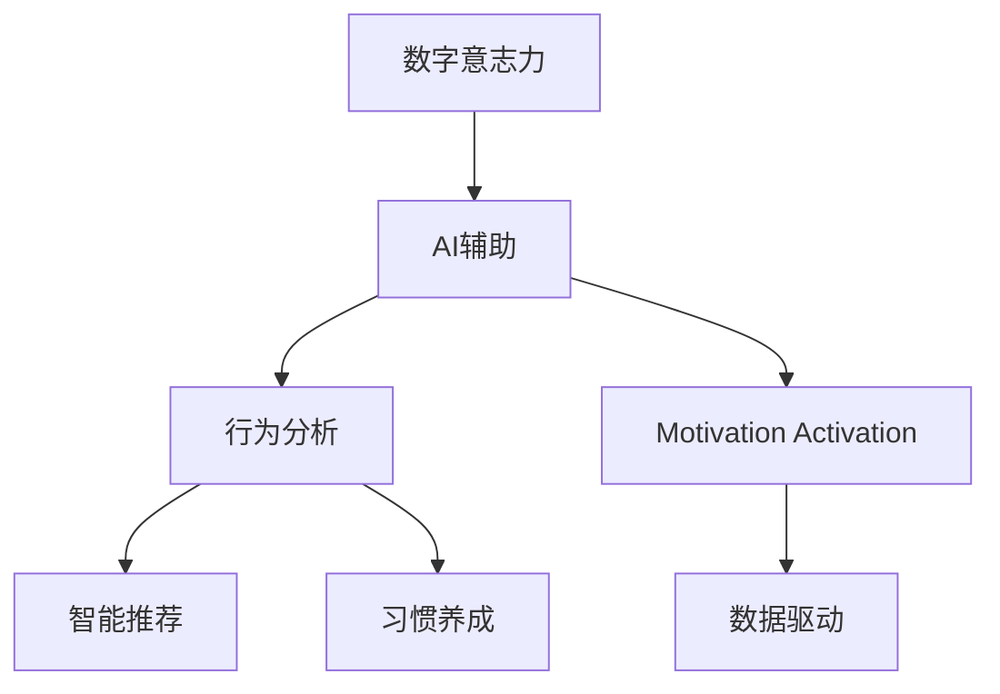

                 

# 数字意志力增强器：AI辅助的自制力培养

> 关键词：数字意志力, AI辅助, 自制力培养, 行为分析, 智能推荐, 习惯养成, 动机激发, 数据驱动

## 1. 背景介绍

### 1.1 问题由来
在现代社会中，信息爆炸、工作压力增大、社交媒体的吸引使得人们难以维持良好的自我控制能力。特别是数字原住民一代，他们从小就沉浸在数字环境中，缺乏足够的自制力去抵御数字产品的诱惑。为此，数字意志力（Digital Willpower）成为一个热门话题。数字意志力是指个体在数字环境中控制自己的行为，避免过度消费、分心、拖延等问题的能力。

### 1.2 问题核心关键点
如何利用人工智能技术来提升个体的数字意志力，成为当前研究的焦点。AI技术可以通过大数据、机器学习、自然语言处理等方式，对用户的行为进行分析、预测和干预，从而帮助用户提高自制力。

### 1.3 问题研究意义
研究AI辅助的数字意志力提升，对于提高个人生活质量、工作效率、学习效果等方面具有重要意义：

- 提升生活质量：帮助用户建立健康的生活习惯，减少对数字产品的依赖，从而提升整体幸福感和满意度。
- 提高工作效率：减少工作中的分心和拖延行为，提高任务完成效率和工作质量。
- 促进学习效果：帮助学生制定学习计划、避免分心，提高学习专注度和学习效果。
- 促进心理健康：减少因过度使用数字产品带来的焦虑和抑郁症状，提高心理韧性。

## 2. 核心概念与联系

### 2.1 核心概念概述

为更好地理解AI辅助的数字意志力提升方法，本节将介绍几个密切相关的核心概念：

- **数字意志力（Digital Willpower）**：指个体在数字环境中控制自己行为的能力，避免过度消费、分心、拖延等问题的能力。
- **AI辅助（AI-Assisted）**：利用人工智能技术，如大数据、机器学习、自然语言处理等，对用户的行为进行分析、预测和干预，以提升其数字意志力。
- **行为分析（Behavior Analysis）**：通过收集用户使用数字产品的时间和行为数据，分析其习惯和偏好，找出潜在的分心、拖延等行为。
- **智能推荐（Smart Recommendation）**：根据用户的行为数据和偏好，智能推荐合适的数字产品使用方案，帮助用户建立健康的使用习惯。
- **习惯养成（Habit Formation）**：通过设定目标和奖励机制，使用提醒和激励的方式帮助用户建立并维持良好的行为习惯。
- **动机激发（Motivation Activation）**：通过增强用户对特定行为的动机，如通过游戏化设计等方式，提高用户对目标的投入和坚持。
- **数据驱动（Data-Driven）**：基于大量的用户行为数据和心理模型，设计个性化的干预措施，提升数字意志力培养效果。

这些核心概念之间的逻辑关系可以通过以下Mermaid流程图来展示：



这个流程图展示了大语言模型的核心概念及其之间的关系：

1. **数字意志力** 是最终目标，AI辅助是其手段。
2. **行为分析** 和 **智能推荐** 是AI辅助的重要组成部分，用于个性化干预。
3. **习惯养成** 和 **动机激发** 是实际应用的有效手段，用于提升数字意志力。
4. **数据驱动** 是AI辅助的基础，确保个性化干预措施的科学性和有效性。

这些概念共同构成了AI辅助的数字意志力提升框架，使其能够更好地帮助用户应对数字环境的挑战。

## 3. 核心算法原理 & 具体操作步骤
### 3.1 算法原理概述

AI辅助的数字意志力提升，本质上是一个基于大数据和机器学习的行为干预过程。其核心思想是：通过收集和分析用户在使用数字产品时的行为数据，预测其潜在的分心、拖延等行为，并设计个性化的干预措施，帮助用户提升自制力。

形式化地，假设用户在使用数字产品时，每个行为 $x$ 都与特定目标 $y$ 有关联。模型的目标是通过历史数据 $D=\{(x_i,y_i)\}_{i=1}^N$ 学习 $x$ 和 $y$ 之间的关系，即找到最优的函数 $f(x)$ 预测用户的行为目标 $y$。

用户的行为目标 $y$ 可以是对特定应用的使用频率、应用停留时间、任务完成时间等。因此，可以通过监督学习的方法，构建一个分类或回归模型 $M_{\theta}$，使得：

$$
y_i = M_{\theta}(x_i)
$$

其中，$\theta$ 为模型参数，通过梯度下降等优化算法最小化预测误差。

### 3.2 算法步骤详解

AI辅助的数字意志力提升一般包括以下几个关键步骤：

**Step 1: 数据收集与预处理**
- 使用应用程序记录用户的行为数据，包括使用时间、应用停留时间、点击频率等。
- 对数据进行清洗和预处理，去除噪声和异常值。

**Step 2: 行为分析**
- 构建用户行为特征库，包括使用频率、应用种类、使用时间等。
- 使用机器学习算法对行为数据进行分析，预测用户的潜在行为。

**Step 3: 智能推荐**
- 根据预测结果，推荐合适的使用策略，如使用时间控制、应用限制等。
- 使用自然语言处理技术，生成个性化提醒和建议。

**Step 4: 习惯养成和动机激发**
- 设定明确的目标和奖励机制，如每日任务完成、长期目标实现等。
- 使用游戏化设计等手段，增强用户对目标的动机和坚持。

**Step 5: 持续评估与优化**
- 持续收集用户反馈，评估干预效果。
- 根据反馈调整干预措施，逐步优化效果。

### 3.3 算法优缺点

AI辅助的数字意志力提升方法具有以下优点：

- **个性化**：基于用户的行为数据，能够提供个性化的干预策略，提升干预效果。
- **动态适应**：可以实时调整干预策略，适应用户行为的变化。
- **数据驱动**：通过数据驱动的方式，提升干预措施的科学性和有效性。

同时，该方法也存在一定的局限性：

- **隐私问题**：需要收集大量的用户行为数据，可能涉及隐私问题。
- **过度干预**：干预措施可能过于严格，影响用户体验。
- **依赖技术**：需要依赖复杂的算法和系统，可能存在技术实现难度。

尽管存在这些局限性，但就目前而言，基于AI的干预方法仍是最主流的手段。未来相关研究的重点在于如何进一步提高算法的普适性和鲁棒性，同时兼顾用户体验和隐私保护。

### 3.4 算法应用领域

基于AI辅助的数字意志力提升方法，已经在多个领域得到了应用，例如：

- 教育领域：帮助学生制定学习计划、减少分心，提升学习效果。
- 健康领域：帮助用户控制屏幕时间、避免过度使用数字产品，提升健康水平。
- 工作领域：减少工作中的分心和拖延，提高工作效率。
- 游戏领域：使用AI生成个性化推荐和任务提示，提高游戏体验。

除了上述这些经典应用外，AI辅助的数字意志力提升方法还正在被创新性地应用于更多场景中，如社交媒体、智能家居等，为数字产品的使用提供新的指导和干预方式。

## 4. 数学模型和公式 & 详细讲解
### 4.1 数学模型构建

本节将使用数学语言对AI辅助的数字意志力提升过程进行更加严格的刻画。

假设用户在使用数字产品时，每个行为 $x$ 都与特定目标 $y$ 有关联。模型的目标是通过历史数据 $D=\{(x_i,y_i)\}_{i=1}^N$ 学习 $x$ 和 $y$ 之间的关系，即找到最优的函数 $f(x)$ 预测用户的行为目标 $y$。

定义模型 $M_{\theta}$ 在输入 $x$ 上的输出为 $y$，其中 $\theta$ 为模型参数。在监督学习中，目标函数为：

$$
\mathcal{L}(\theta) = \frac{1}{N} \sum_{i=1}^N \ell(y_i, M_{\theta}(x_i))
$$

其中 $\ell$ 为损失函数，用于衡量预测值与真实值之间的差异。

在实践中，我们通常使用基于梯度的优化算法（如SGD、Adam等）来近似求解上述最优化问题。设 $\eta$ 为学习率，$\lambda$ 为正则化系数，则参数的更新公式为：

$$
\theta \leftarrow \theta - \eta \nabla_{\theta}\mathcal{L}(\theta) - \eta\lambda\theta
$$

其中 $\nabla_{\theta}\mathcal{L}(\theta)$ 为损失函数对参数 $\theta$ 的梯度，可通过反向传播算法高效计算。

### 4.2 公式推导过程

以下我们以二分类任务为例，推导基于监督学习的二元分类模型。

假设模型 $M_{\theta}$ 在输入 $x$ 上的输出为 $\hat{y}=M_{\theta}(x) \in [0,1]$，表示样本属于正类的概率。真实标签 $y \in \{0,1\}$。则二分类交叉熵损失函数定义为：

$$
\ell(M_{\theta}(x),y) = -[y\log \hat{y} + (1-y)\log (1-\hat{y})]
$$

将其代入经验风险公式，得：

$$
\mathcal{L}(\theta) = -\frac{1}{N}\sum_{i=1}^N [y_i\log M_{\theta}(x_i)+(1-y_i)\log(1-M_{\theta}(x_i))]
$$

根据链式法则，损失函数对参数 $\theta_k$ 的梯度为：

$$
\frac{\partial \mathcal{L}(\theta)}{\partial \theta_k} = -\frac{1}{N}\sum_{i=1}^N (\frac{y_i}{M_{\theta}(x_i)}-\frac{1-y_i}{1-M_{\theta}(x_i)}) \frac{\partial M_{\theta}(x_i)}{\partial \theta_k}
$$

其中 $\frac{\partial M_{\theta}(x_i)}{\partial \theta_k}$ 可进一步递归展开，利用自动微分技术完成计算。

在得到损失函数的梯度后，即可带入参数更新公式，完成模型的迭代优化。重复上述过程直至收敛，最终得到适应特定用户行为的数字意志力提升模型 $M_{\hat{\theta}}$。

## 5. 项目实践：代码实例和详细解释说明
### 5.1 开发环境搭建

在进行AI辅助的数字意志力提升实践前，我们需要准备好开发环境。以下是使用Python进行TensorFlow开发的环境配置流程：

1. 安装Anaconda：从官网下载并安装Anaconda，用于创建独立的Python环境。

2. 创建并激活虚拟环境：
```bash
conda create -n tf-env python=3.8 
conda activate tf-env
```

3. 安装TensorFlow：根据CUDA版本，从官网获取对应的安装命令。例如：
```bash
conda install tensorflow tensorflow-gpu=cuda11.1 -c conda-forge
```

4. 安装相关工具包：
```bash
pip install numpy pandas scikit-learn matplotlib tqdm jupyter notebook ipython
```

完成上述步骤后，即可在`tf-env`环境中开始AI辅助的数字意志力提升实践。

### 5.2 源代码详细实现

下面我们以智能推荐系统的开发为例，给出使用TensorFlow进行AI辅助的数字意志力提升的代码实现。

首先，定义行为数据和目标数据：

```python
import tensorflow as tf
import numpy as np
from sklearn.model_selection import train_test_split

# 假设有历史行为数据
x = np.array([1, 2, 3, 4, 5, 6, 7, 8, 9, 10])
y = np.array([0, 1, 0, 1, 0, 1, 0, 1, 0, 1])

# 将数据划分为训练集和测试集
x_train, x_test, y_train, y_test = train_test_split(x, y, test_size=0.2, random_state=42)
```

然后，定义模型和优化器：

```python
from tensorflow.keras.models import Sequential
from tensorflow.keras.layers import Dense
from tensorflow.keras.losses import BinaryCrossentropy
from tensorflow.keras.optimizers import Adam

model = Sequential([
    Dense(32, activation='relu', input_shape=(1,)),
    Dense(1, activation='sigmoid')
])

model.compile(optimizer=Adam(lr=0.001), loss=BinaryCrossentropy(), metrics=['accuracy'])

# 训练模型
model.fit(x_train, y_train, epochs=100, batch_size=16, validation_data=(x_test, y_test))
```

接着，定义预测函数：

```python
def predict(model, x):
    return model.predict(x)
```

最后，在用户行为数据上应用模型进行预测和推荐：

```python
# 假设有新的用户行为数据
new_user_data = np.array([11, 12, 13, 14, 15, 16, 17, 18, 19, 20])

# 对新用户行为进行预测
predictions = predict(model, new_user_data)

# 输出预测结果
print(predictions)
```

以上就是使用TensorFlow进行AI辅助的数字意志力提升的完整代码实现。可以看到，通过简单的数据处理和模型训练，即可实现基于监督学习的二元分类预测，进而对用户的行为进行智能推荐。

### 5.3 代码解读与分析

让我们再详细解读一下关键代码的实现细节：

**行为数据定义**：
- `x` 为历史行为数据，这里假设是应用停留时间。
- `y` 为对应的目标数据，这里假设是是否进行了目标行为，0表示未完成，1表示完成了。

**模型定义**：
- `Sequential` 为序贯模型，包含了两个全连接层，一个输入层和一个输出层。
- 输入层只有一个神经元，对应一个特征。
- 输出层有一个神经元，使用 sigmoid 激活函数，输出二元分类结果。

**训练模型**：
- 使用 `Adam` 优化器进行模型训练，学习率为 0.001。
- 损失函数使用 `BinaryCrossentropy`，适用于二元分类问题。
- 训练集和测试集分别用于训练和评估模型。

**预测函数定义**：
- 使用 `predict` 函数对新的用户行为数据进行预测。

**新用户行为预测**：
- 将新的用户行为数据输入预测函数，输出预测结果。

可以看到，TensorFlow为模型的定义、训练和预测提供了高度灵活和易于操作的接口，使得AI辅助的数字意志力提升实践变得更加简单和高效。

当然，实际应用中还需要考虑更多因素，如模型的优化、超参数的调优、数据的实时收集等，以进一步提高干预措施的效果。

## 6. 实际应用场景
### 6.1 智能推荐系统

智能推荐系统已经在电商、新闻、视频等多个领域得到广泛应用。通过AI辅助的数字意志力提升方法，可以进一步优化推荐系统的设计和应用，帮助用户建立健康的使用习惯。

具体而言，可以收集用户的历史行为数据，包括应用停留时间、浏览时间、点击次数等，通过监督学习模型预测用户的行为目标。基于预测结果，智能推荐系统可以推荐合适的应用使用方案，如限制使用时间、推荐替代应用等。此外，还可以通过自然语言处理技术，生成个性化提醒和建议，帮助用户建立健康的使用习惯。

### 6.2 学习辅助应用

AI辅助的数字意志力提升方法同样适用于学习辅助应用。通过收集学生的历史学习行为数据，如学习时长、完成度、应用停留时间等，可以预测学生的学习目标。基于预测结果，推荐合适的学习计划和任务安排，帮助学生提升学习效率和效果。同时，还可以通过游戏化设计等方式，增强学生对学习的动机和坚持。

### 6.3 数字产品使用管理

数字产品使用管理是另一个重要应用场景。通过收集用户使用数字产品的行为数据，可以预测用户的潜在问题行为，如分心、拖延等。基于预测结果，推荐合适的使用策略，如限制使用时间、提供定时提醒等，帮助用户建立健康的使用习惯。同时，还可以通过自然语言处理技术，生成个性化的建议和提醒，提高干预效果。

### 6.4 未来应用展望

随着AI辅助数字意志力提升技术的发展，未来将在更多领域得到应用：

- 娱乐领域：帮助用户控制游戏时间，避免过度沉迷。
- 金融领域：帮助用户管理投资行为，避免冲动交易。
- 社交媒体：减少社交媒体的过度使用，提升心理健康。
- 健康领域：帮助用户控制屏幕时间，改善健康状况。

未来的发展方向包括：

- 更加个性化：通过更加精细的行为分析，提供更加个性化的干预策略。
- 实时动态：实时监控和调整用户行为，及时干预问题行为。
- 跨平台集成：将数字意志力提升应用集成到各类数字产品中，实现跨平台覆盖。
- 多模态融合：结合语音、图像等多种模态数据，提升行为分析的准确性。

## 7. 工具和资源推荐
### 7.1 学习资源推荐

为了帮助开发者系统掌握AI辅助的数字意志力提升的理论基础和实践技巧，这里推荐一些优质的学习资源：

1. 《机器学习实战》系列博文：由机器学习专家撰写，深入浅出地介绍了机器学习的基本概念和实践技巧。

2. 《TensorFlow官方文档》：TensorFlow官方提供的详细文档，包含大量实例和代码实现，是学习和实践TensorFlow的重要资源。

3. 《自然语言处理基础》书籍：介绍自然语言处理的基本原理和常用技术，帮助开发者构建基于文本的行为分析系统。

4. 《行为科学导论》书籍：介绍行为科学的基本理论和实验设计方法，为AI辅助的数字意志力提升提供理论支持。

5. 《游戏化设计》书籍：介绍游戏化设计的原理和实践方法，为动机激发和习惯养成提供设计思路。

通过对这些资源的学习实践，相信你一定能够快速掌握AI辅助数字意志力提升的精髓，并用于解决实际的数字产品使用问题。

### 7.2 开发工具推荐

高效的开发离不开优秀的工具支持。以下是几款用于AI辅助数字意志力提升开发的常用工具：

1. TensorFlow：由Google主导开发的开源深度学习框架，生产部署方便，适合大规模工程应用。

2. Keras：基于TensorFlow的高层API，提供简单易用的模型定义和训练接口。

3. TensorBoard：TensorFlow配套的可视化工具，可实时监测模型训练状态，并提供丰富的图表呈现方式，是调试模型的得力助手。

4. Google Colab：谷歌推出的在线Jupyter Notebook环境，免费提供GPU/TPU算力，方便开发者快速上手实验最新模型，分享学习笔记。

5. Weights & Biases：模型训练的实验跟踪工具，可以记录和可视化模型训练过程中的各项指标，方便对比和调优。

合理利用这些工具，可以显著提升AI辅助数字意志力提升任务的开发效率，加快创新迭代的步伐。

### 7.3 相关论文推荐

AI辅助的数字意志力提升技术源于学界的持续研究。以下是几篇奠基性的相关论文，推荐阅读：

1. 《行为分析与机器学习：一种新的消费者行为预测方法》：介绍行为分析在消费者行为预测中的应用，为后续研究提供数据基础。

2. 《智能推荐系统的设计与实现》：介绍智能推荐系统的基本原理和实现方法，为行为分析提供技术支持。

3. 《基于游戏化设计的动机激发方法》：介绍游戏化设计的基本原理和应用实例，为动机激发提供理论依据。

4. 《数字产品使用管理系统的设计与实现》：介绍数字产品使用管理系统在实际应用中的应用，为智能推荐和行为分析提供实际案例。

5. 《AI辅助数字意志力提升的理论与实践》：介绍AI辅助数字意志力提升的基本原理和实践方法，为进一步研究提供理论指导。

这些论文代表了大语言模型微调技术的发展脉络。通过学习这些前沿成果，可以帮助研究者把握学科前进方向，激发更多的创新灵感。

## 8. 总结：未来发展趋势与挑战

### 8.1 总结

本文对AI辅助的数字意志力提升方法进行了全面系统的介绍。首先阐述了数字意志力的重要性和AI辅助的必要性，明确了AI辅助在提升自制力方面的独特价值。其次，从原理到实践，详细讲解了AI辅助的数字意志力提升数学模型和算法流程，给出了具体的应用实例。同时，本文还广泛探讨了AI辅助数字意志力提升在多个行业领域的应用前景，展示了其广泛的应用潜力。此外，本文精选了AI辅助数字意志力提升的各种学习资源，力求为读者提供全方位的技术指引。

通过本文的系统梳理，可以看到，AI辅助的数字意志力提升方法正在成为帮助用户应对数字环境挑战的重要手段。AI技术通过大数据、机器学习、自然语言处理等方式，能够实时分析用户行为，设计个性化的干预策略，帮助用户建立健康的使用习惯。未来，伴随AI技术的不断发展，数字意志力提升将更加普及和高效，为提升个体生活质量和工作效率贡献力量。

### 8.2 未来发展趋势

展望未来，AI辅助的数字意志力提升技术将呈现以下几个发展趋势：

1. **个性化增强**：通过更加精细的行为分析，提供更加个性化的干预策略，提升干预效果。

2. **实时动态**：实时监控和调整用户行为，及时干预问题行为。

3. **跨平台集成**：将数字意志力提升应用集成到各类数字产品中，实现跨平台覆盖。

4. **多模态融合**：结合语音、图像等多种模态数据，提升行为分析的准确性。

5. **模型优化**：引入更先进的优化算法，提升模型的训练效率和效果。

6. **隐私保护**：在数据收集和处理过程中，注重用户隐私保护，增强用户信任。

以上趋势凸显了AI辅助数字意志力提升技术的广阔前景。这些方向的探索发展，必将进一步提升数字意志力提升系统的性能和应用范围，为提升个体生活质量和工作效率提供有力支持。

### 8.3 面临的挑战

尽管AI辅助的数字意志力提升技术已经取得了瞩目成就，但在迈向更加智能化、普适化应用的过程中，它仍面临着诸多挑战：

1. **数据隐私**：需要收集大量的用户行为数据，可能涉及隐私问题。

2. **模型鲁棒性**：面对多样化的用户行为，模型需要具备良好的鲁棒性和泛化能力。

3. **用户接受度**：干预措施可能过于严格，影响用户体验。

4. **技术实现难度**：需要依赖复杂的算法和系统，可能存在技术实现难度。

尽管存在这些挑战，但AI辅助的数字意志力提升技术仍具有广泛的应用前景。未来研究需要在数据隐私保护、模型鲁棒性提升、用户体验优化、技术实现简化等方面进行深入探索。

### 8.4 研究展望

面对AI辅助数字意志力提升技术所面临的种种挑战，未来的研究需要在以下几个方面寻求新的突破：

1. **数据隐私保护**：开发更加安全的用户行为数据收集和处理技术，保护用户隐私。

2. **模型鲁棒性提升**：引入更先进的算法和数据增强技术，提升模型的泛化能力和鲁棒性。

3. **用户接受度优化**：设计更加人性化的干预策略，提升用户接受度和满意度。

4. **技术实现简化**：开发更加易用的工具和平台，降低技术实现难度，提高应用普及度。

5. **多模态融合**：结合语音、图像等多种模态数据，提升行为分析的准确性。

6. **跨平台集成**：将数字意志力提升应用集成到各类数字产品中，实现跨平台覆盖。

这些研究方向的探索，必将引领AI辅助数字意志力提升技术迈向更高的台阶，为提升个体生活质量和工作效率提供有力支持。面向未来，AI辅助数字意志力提升技术还需要与其他人工智能技术进行更深入的融合，如知识表示、因果推理、强化学习等，多路径协同发力，共同推动数字产品的智能化发展。

## 9. 附录：常见问题与解答

**Q1：AI辅助的数字意志力提升是否适用于所有用户？**

A: AI辅助的数字意志力提升方法适用于大部分用户，特别是数字原住民一代。但对于一些特殊群体，如老年人、儿童等，可能需要结合其他手段进行辅助。

**Q2：数据隐私如何保护？**

A: 在数据收集和处理过程中，需要严格遵守隐私保护法律法规，如GDPR等。同时，采用匿名化和去标识化的技术，保护用户隐私。

**Q3：如何保证模型的鲁棒性？**

A: 采用更加复杂的模型和数据增强技术，提升模型的泛化能力和鲁棒性。同时，定期更新和优化模型，避免过拟合和模型老化。

**Q4：用户接受度如何提升？**

A: 设计更加人性化的干预策略，如逐步引导、个性化建议等，增强用户接受度和满意度。同时，通过反馈机制，不断调整和优化干预措施。

**Q5：技术实现难度如何降低？**

A: 开发更加易用的工具和平台，如预制化配置、一键式干预等，降低技术实现难度，提高应用普及度。

这些问题的解答，展示了AI辅助数字意志力提升技术在实际应用中的重要性和挑战，为进一步的研究和实践提供了有益的指导。

---

作者：禅与计算机程序设计艺术 / Zen and the Art of Computer Programming

