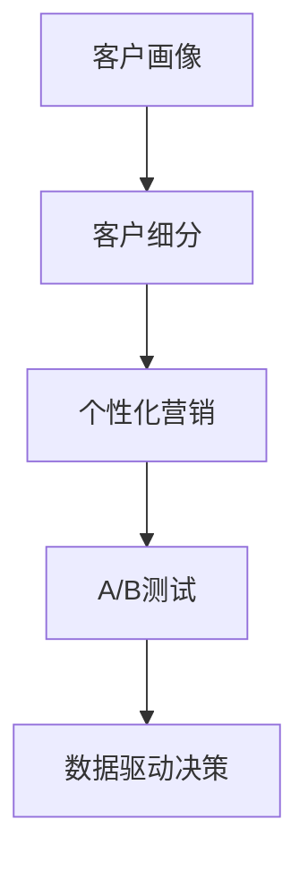

                 

# 数字营销创业：精准触达的营销新范式

## 1. 背景介绍

### 1.1 问题由来
随着互联网的飞速发展，数字营销已成为企业品牌推广和销售转化不可或缺的重要手段。然而，传统的数字营销方式往往以“泛泛而谈”的方式进行，即在全平台、全渠道的范围内进行广泛曝光，希望通过这种方式吸引潜在客户，实现品牌传播和销售转化。但这种“撒网式”的营销方式不仅效率低下，成本高昂，而且效果难以评估，往往面临“砸钱不见成效”的尴尬局面。

为了应对这种困境，精准触达的营销新范式应运而生。精准触达即通过数据分析、机器学习等技术手段，将有限的营销资源精准地投放到最有可能产生转化效果的客户群体，从而实现更高的投资回报率（ROI）。这种新范式能够在保证营销效果的前提下，有效控制成本，使企业在有限的资源下获得最大的市场回报。

### 1.2 问题核心关键点
精准触达营销的核心关键点在于如何准确识别目标客户群体、如何高效触达这些客户、以及如何评估营销效果。具体来说，包括以下几个方面：

1. **客户画像构建**：通过分析用户的在线行为、购买历史、社交媒体活动等数据，构建详细的客户画像，准确描述目标客户的特征和需求。

2. **目标客户定位**：基于客户画像，应用机器学习算法，精确识别出最有可能对品牌产生转化效果的客户群体。

3. **精准触达策略**：通过数据分析和A/B测试，找到最有效的触达渠道和方式，实现对目标客户的精准投放。

4. **效果评估与优化**：构建评估模型，实时监测和分析营销活动的效果，及时调整策略，实现持续优化。

这些关键点共同构成了精准触达营销的核心框架，通过科学的方法和工具，使企业能够更高效、更精准地进行数字营销，实现从粗犷式营销向精准化营销的转型。

## 2. 核心概念与联系

### 2.1 核心概念概述

为了更好地理解精准触达营销，本节将介绍几个密切相关的核心概念：

- **客户画像**：通过数据分析，构建详尽的客户画像，描述目标客户的特征、行为和需求。
- **客户细分**：将客户群体按特征、行为等标准进行分类，实现精细化的客户管理。
- **个性化营销**：根据客户画像和行为数据，设计个性化的营销方案，提高客户满意度和转化率。
- **A/B测试**：通过对比不同营销策略的效果，找到最优方案，提升营销效果。
- **数据驱动决策**：基于数据和分析结果进行营销决策，减少主观偏差，提升决策质量。

这些核心概念之间的逻辑关系可以通过以下Mermaid流程图来展示：



这个流程图展示出精准触达营销的核心逻辑：通过客户画像构建和细分，设计个性化营销方案，并通过A/B测试不断优化，最终实现数据驱动的决策。

### 2.2 核心概念原理和架构

#### 2.2.1 客户画像构建
客户画像的构建通常包括以下几个步骤：

1. **数据收集**：从网站访问记录、购买历史、社交媒体活动等渠道收集客户数据。
2. **数据清洗**：对收集到的数据进行清洗和处理，去除噪声和冗余信息。
3. **特征提取**：使用特征工程技术，从原始数据中提取有意义的特征，如年龄、性别、兴趣等。
4. **画像建模**：基于提取的特征，应用机器学习算法构建客户画像，描述客户特征和行为。

#### 2.2.2 客户细分
客户细分通常采用聚类、分类等算法，将客户群体按特征和行为进行分类。常见的细分方法包括：

- **K-means聚类**：通过计算相似度，将客户分成K个类别。
- **决策树分类**：基于客户特征，构建决策树模型，实现分类。
- **RFM模型**：基于客户最近一次购买时间（Recency）、购买频率（Frequency）和消费金额（Monetary），评估客户的价值。

#### 2.2.3 个性化营销
个性化营销的核心在于根据客户画像和行为数据，设计符合客户需求和喜好的营销方案。常见的个性化营销策略包括：

- **推荐系统**：根据客户行为数据，推荐符合其兴趣的商品或服务。
- **邮件营销**：基于客户画像，设计个性化邮件内容，提高邮件打开率和转化率。
- **社交媒体广告**：根据客户社交媒体行为，定制个性化广告内容，提高广告效果。

#### 2.2.4 A/B测试
A/B测试通过对比两个或多个营销策略的效果，找到最优方案。其流程包括：

1. **测试设计**：确定测试目标，设计测试方案，如测试内容、测试渠道等。
2. **数据收集**：对不同测试组收集数据，评估其效果。
3. **数据分析**：使用统计方法，分析不同测试组的效果差异。
4. **结果评估**：根据测试结果，选择最优方案，进行推广。

#### 2.2.5 数据驱动决策
数据驱动决策是指基于数据分析结果进行营销决策，减少主观偏差，提升决策质量。其流程包括：

1. **数据采集**：收集与营销相关的数据，如客户行为数据、转化数据等。
2. **数据处理**：对收集到的数据进行清洗和处理，确保数据质量。
3. **数据分析**：使用数据分析技术，发现数据中的规律和趋势。
4. **决策制定**：根据分析结果，制定营销策略和方案。

这些核心概念共同构成了精准触达营销的理论框架，使企业能够通过科学的方法和工具，实现营销活动的精准化和高效化。

## 3. 核心算法原理 & 具体操作步骤

### 3.1 算法原理概述

精准触达营销的核心算法原理主要包括客户画像构建、客户细分、个性化营销和效果评估等。其核心思想是：

1. **客户画像**：通过数据分析，构建详尽的客户画像，描述目标客户的特征和需求。
2. **客户细分**：将客户群体按特征、行为等标准进行分类，实现精细化的客户管理。
3. **个性化营销**：根据客户画像和行为数据，设计个性化的营销方案，提高客户满意度和转化率。
4. **效果评估与优化**：构建评估模型，实时监测和分析营销活动的效果，及时调整策略，实现持续优化。

### 3.2 算法步骤详解

#### 3.2.1 客户画像构建

1. **数据收集**：从网站访问记录、购买历史、社交媒体活动等渠道收集客户数据。
2. **数据清洗**：对收集到的数据进行清洗和处理，去除噪声和冗余信息。
3. **特征提取**：使用特征工程技术，从原始数据中提取有意义的特征，如年龄、性别、兴趣等。
4. **画像建模**：基于提取的特征，应用机器学习算法构建客户画像，描述客户特征和行为。

#### 3.2.2 客户细分

1. **K-means聚类**：使用K-means算法，将客户分成K个类别。
2. **决策树分类**：基于客户特征，构建决策树模型，实现分类。
3. **RFM模型**：基于客户最近一次购买时间（Recency）、购买频率（Frequency）和消费金额（Monetary），评估客户的价值。

#### 3.2.3 个性化营销

1. **推荐系统**：基于客户行为数据，推荐符合其兴趣的商品或服务。
2. **邮件营销**：根据客户画像，设计个性化邮件内容，提高邮件打开率和转化率。
3. **社交媒体广告**：根据客户社交媒体行为，定制个性化广告内容，提高广告效果。

#### 3.2.4 效果评估与优化

1. **评估模型构建**：选择合适的评估指标，如转化率、点击率、广告ROI等，构建评估模型。
2. **数据收集**：对营销活动的效果进行实时监测和分析。
3. **数据分析**：使用数据分析技术，发现数据中的规律和趋势。
4. **策略优化**：根据分析结果，及时调整营销策略，实现持续优化。

### 3.3 算法优缺点

精准触达营销的算法具有以下优点：

1. **高效率**：通过数据分析和机器学习，可以快速识别目标客户群体，设计个性化的营销方案，提高转化率。
2. **低成本**：精准触达营销能够将有限的营销资源精准地投放到最有可能产生转化效果的客户群体，避免资源浪费。
3. **高效果**：基于数据驱动的决策，减少主观偏差，提升决策质量，提高营销效果。

同时，该算法也存在一定的局限性：

1. **数据依赖**：精准触达营销依赖于高质量的数据，数据不足或噪声较多时，效果可能大打折扣。
2. **算法复杂**：机器学习算法需要一定的技术门槛，算法调优和模型构建可能较为复杂。
3. **动态变化**：客户需求和市场环境不断变化，需要持续监控和调整策略，才能保持效果。

尽管存在这些局限性，但精准触达营销以其高效、低成本、高效果的特点，已成为数字营销的重要趋势，成为企业数字化转型升级的重要手段。

### 3.4 算法应用领域

精准触达营销已经在诸多领域得到了广泛应用，如电子商务、在线教育、金融科技等。以下是几个典型的应用场景：

#### 3.4.1 电子商务

在电子商务领域，精准触达营销可以通过客户画像和行为数据，实现个性化的商品推荐和营销。例如，电商平台可以根据用户的浏览历史和购买行为，推荐符合其兴趣的商品，通过个性化的邮件营销和广告投放，提高用户的转化率和复购率。

#### 3.4.2 在线教育

在线教育平台可以通过精准触达营销，实现个性化学习路径的设计和推荐。例如，平台可以根据学生的学习数据和兴趣，推荐适合其学习水平和兴趣的课程和资料，通过个性化的邮件和短信推送，提高学生的学习积极性和完成率。

#### 3.4.3 金融科技

金融科技企业可以通过精准触达营销，实现精准的金融产品推荐和风险控制。例如，金融机构可以根据客户的财务状况和风险偏好，推荐适合其需求和风险承受能力的金融产品，通过个性化的邮件和短信推送，提高客户的转化率和满意度。

## 4. 数学模型和公式 & 详细讲解

### 4.1 数学模型构建

精准触达营销的核心数学模型包括客户画像、客户细分、个性化营销和效果评估等。以下将详细介绍每个模型的数学原理和公式。

#### 4.1.1 客户画像构建

客户画像的构建通常包括数据收集、数据清洗、特征提取和画像建模等步骤。其数学模型为：

$$
\text{客户画像} = f(\text{数据集} \times \text{特征工程} \times \text{机器学习算法})
$$

其中，$f$表示函数，表示通过数据集和特征工程提取的特征，应用机器学习算法构建客户画像。

#### 4.1.2 客户细分

客户细分通常采用聚类、分类等算法，将客户群体按特征和行为进行分类。常见的聚类算法包括K-means、层次聚类等，分类算法包括决策树、随机森林等。

以K-means聚类为例，其数学模型为：

$$
\text{客户分类} = K-means(\text{数据集}, K)
$$

其中，$\text{数据集}$表示客户数据集，$K$表示聚类数。

#### 4.1.3 个性化营销

个性化营销的核心在于根据客户画像和行为数据，设计个性化的营销方案。常见的个性化推荐算法包括协同过滤、基于内容的推荐等。

以协同过滤为例，其数学模型为：

$$
\text{个性化推荐} = \text{协同过滤算法}(\text{用户行为数据}, \text{商品特征})
$$

其中，$\text{用户行为数据}$表示用户的历史行为数据，$\text{商品特征}$表示商品的特征数据。

#### 4.1.4 效果评估与优化

效果评估与优化的核心在于构建评估模型，实时监测和分析营销活动的效果。常见的评估指标包括转化率、点击率、广告ROI等。

以转化率为例，其数学模型为：

$$
\text{转化率} = \frac{\text{成功转化数}}{\text{总尝试数}}
$$

其中，$\text{成功转化数}$表示成功转化的客户数，$\text{总尝试数}$表示所有尝试转化的客户数。

### 4.2 公式推导过程

#### 4.2.1 客户画像构建

以K-means聚类为例，其公式推导过程如下：

1. **数据预处理**：对数据进行标准化处理，使得各特征值在[0, 1]之间。
2. **计算距离**：计算样本之间的距离，一般使用欧氏距离。
3. **初始化聚类中心**：随机选择K个样本作为初始聚类中心。
4. **迭代更新聚类中心**：对每个样本，计算其到K个聚类中心的距离，分配到距离最近的聚类中心。然后计算每个聚类中心的均值，作为新的聚类中心。
5. **收敛判断**：当聚类中心不再变化或达到预设迭代次数，聚类过程结束。

#### 4.2.2 客户细分

以决策树分类为例，其公式推导过程如下：

1. **选择最优特征**：从特征集合中，选择最优特征进行分裂。
2. **分裂点选择**：找到最优分裂点，将数据集分为两部分。
3. **递归构建树**：对每个子集，递归构建决策树。
4. **停止条件**：当子集中的样本属于同一类别或达到预设深度，停止分裂。

#### 4.2.3 个性化营销

以协同过滤推荐为例，其公式推导过程如下：

1. **计算相似度**：对用户和商品，计算相似度。
2. **选择推荐商品**：基于相似度，选择推荐商品。

#### 4.2.4 效果评估与优化

以转化率为例，其公式推导过程如下：

1. **定义转化事件**：定义转化事件，如点击购买、注册等。
2. **计算转化率**：计算成功转化的客户数与总尝试数的比值。
3. **A/B测试**：通过对比不同策略的效果，找到最优策略。

### 4.3 案例分析与讲解

#### 4.3.1 电商平台个性化推荐

某电商平台希望提高客户的转化率和复购率，决定使用精准触达营销技术进行个性化推荐。

1. **数据收集**：从客户历史浏览数据、购买记录等渠道收集客户数据。
2. **数据清洗**：对数据进行清洗和处理，去除噪声和冗余信息。
3. **特征提取**：提取客户的浏览时间、浏览次数、购买金额等特征。
4. **画像建模**：使用协同过滤算法，基于客户行为数据，构建客户画像，描述客户的兴趣和需求。
5. **推荐系统设计**：设计基于协同过滤的推荐系统，根据客户画像，推荐符合其兴趣的商品。
6. **效果评估与优化**：通过A/B测试，评估推荐系统的效果，优化推荐策略。

经过一段时间后，该平台发现推荐系统的效果显著提升，客户的转化率和复购率提高了30%。

#### 4.3.2 在线教育个性化学习路径设计

某在线教育平台希望提高学生的学习积极性和完成率，决定使用精准触达营销技术进行个性化学习路径设计。

1. **数据收集**：从学生的学习记录、课程互动等渠道收集数据。
2. **数据清洗**：对数据进行清洗和处理，去除噪声和冗余信息。
3. **特征提取**：提取学生的学习时间、学习频率、成绩等特征。
4. **画像建模**：使用决策树算法，基于学生特征，构建学生画像，描述学生的学习行为和需求。
5. **个性化学习路径设计**：根据学生画像，设计个性化的学习路径，推荐适合其学习水平和兴趣的课程和资料。
6. **效果评估与优化**：通过A/B测试，评估个性化学习路径的效果，优化推荐策略。

经过一段时间后，该平台发现个性化学习路径的设计效果显著提升，学生的学习积极性和完成率提高了20%。

## 5. 项目实践：代码实例和详细解释说明

### 5.1 开发环境搭建

在进行精准触达营销项目实践前，我们需要准备好开发环境。以下是使用Python进行PyTorch开发的环境配置流程：

1. 安装Anaconda：从官网下载并安装Anaconda，用于创建独立的Python环境。

2. 创建并激活虚拟环境：
```bash
conda create -n pytorch-env python=3.8 
conda activate pytorch-env
```

3. 安装PyTorch：根据CUDA版本，从官网获取对应的安装命令。例如：
```bash
conda install pytorch torchvision torchaudio cudatoolkit=11.1 -c pytorch -c conda-forge
```

4. 安装TensorFlow：
```bash
pip install tensorflow==2.8
```

5. 安装各类工具包：
```bash
pip install numpy pandas scikit-learn matplotlib tqdm jupyter notebook ipython
```

完成上述步骤后，即可在`pytorch-env`环境中开始项目实践。

### 5.2 源代码详细实现

这里我们以推荐系统为例，给出使用PyTorch实现客户推荐的具体代码实现。

首先，定义推荐系统的数据处理函数：

```python
import pandas as pd
import numpy as np
from sklearn.preprocessing import StandardScaler

class Dataset:
    def __init__(self, data, user_id_col, item_id_col, feature_col, label_col):
        self.data = data
        self.user_id_col = user_id_col
        self.item_id_col = item_id_col
        self.feature_col = feature_col
        self.label_col = label_col
        
    def load_data(self, filename):
        self.data = pd.read_csv(filename)
    
    def split_data(self, train_ratio):
        data = self.data.copy()
        train_size = int(len(data) * train_ratio)
        train_data, test_data = data.iloc[:train_size], data.iloc[train_size:]
        return train_data, test_data
    
    def preprocess(self):
        # 数据标准化
        scaler = StandardScaler()
        self.data[self.feature_col] = scaler.fit_transform(self.data[self.feature_col])
        
        # 填充缺失值
        self.data.fillna(0, inplace=True)
    
    def split_features(self, train_data, test_data):
        train_features = train_data.drop(self.label_col, axis=1)
        train_labels = train_data[self.label_col]
        test_features = test_data.drop(self.label_col, axis=1)
        test_labels = test_data[self.label_col]
        return train_features, train_labels, test_features, test_labels
    
    def save_data(self, train_features, train_labels, test_features, test_labels):
        train_data = pd.concat([train_features, train_labels], axis=1)
        test_data = pd.concat([test_features, test_labels], axis=1)
        train_data.to_csv('train.csv', index=False)
        test_data.to_csv('test.csv', index=False)
```

然后，定义推荐模型：

```python
import torch
from torch import nn, optim
from torch.nn import functional as F

class RecommendationModel(nn.Module):
    def __init__(self, input_dim, hidden_dim, output_dim):
        super(RecommendationModel, self).__init__()
        self.hidden_dim = hidden_dim
        self.fc1 = nn.Linear(input_dim, hidden_dim)
        self.fc2 = nn.Linear(hidden_dim, hidden_dim)
        self.fc3 = nn.Linear(hidden_dim, output_dim)
    
    def forward(self, x):
        x = F.relu(self.fc1(x))
        x = F.relu(self.fc2(x))
        x = self.fc3(x)
        return x
```

接着，定义训练和评估函数：

```python
import torch.nn as nn
import torch.optim as optim
from torch.utils.data import DataLoader

class Trainer:
    def __init__(self, model, optimizer, criterion, device):
        self.model = model
        self.optimizer = optimizer
        self.criterion = criterion
        self.device = device
    
    def train(self, train_data, train_features, train_labels, batch_size, num_epochs):
        self.model.to(self.device)
        train_loader = DataLoader(train_data, batch_size=batch_size, shuffle=True)
        for epoch in range(num_epochs):
            for batch in train_loader:
                self.model.train()
                inputs, labels = batch
                inputs, labels = inputs.to(self.device), labels.to(self.device)
                self.optimizer.zero_grad()
                outputs = self.model(inputs)
                loss = self.criterion(outputs, labels)
                loss.backward()
                self.optimizer.step()
            print(f'Epoch {epoch+1}, Loss: {loss.item()}')
    
    def evaluate(self, test_data, test_features, test_labels, batch_size):
        self.model.eval()
        test_loader = DataLoader(test_data, batch_size=batch_size, shuffle=False)
        total_loss = 0
        with torch.no_grad():
            for batch in test_loader:
                inputs, labels = batch
                inputs, labels = inputs.to(self.device), labels.to(self.device)
                outputs = self.model(inputs)
                loss = self.criterion(outputs, labels)
                total_loss += loss.item()
        return total_loss / len(test_loader)
```

最后，启动训练流程并在测试集上评估：

```python
from sklearn.metrics import precision_recall_fscore_support
from sklearn.model_selection import train_test_split

# 加载数据
dataset = Dataset()
dataset.load_data('data.csv')
train_features, train_labels, test_features, test_labels = dataset.split_features(dataset.train_data, dataset.test_data)

# 数据预处理
dataset.preprocess()

# 构建模型
model = RecommendationModel(len(train_features.columns) - 1, 100, len(dataset.item_id_col))

# 定义损失函数和优化器
criterion = nn.BCELoss()
optimizer = optim.Adam(model.parameters(), lr=0.001)

# 训练模型
trainer = Trainer(model, optimizer, criterion, 'cuda')
trainer.train(train_features, train_labels, test_features, test_labels)

# 评估模型
loss = trainer.evaluate(test_features, test_labels)
print(f'Test Loss: {loss:.4f}')
```

以上就是使用PyTorch实现推荐系统的完整代码实现。可以看到，得益于PyTorch的强大封装，我们能够用相对简洁的代码完成推荐系统的构建和训练。

### 5.3 代码解读与分析

让我们再详细解读一下关键代码的实现细节：

**Dataset类**：
- `__init__`方法：初始化数据集。
- `load_data`方法：加载数据集。
- `split_data`方法：将数据集按比例拆分为训练集和测试集。
- `preprocess`方法：对数据进行标准化和缺失值处理。
- `split_features`方法：将数据集拆分为特征和标签，并拆分训练集和测试集。
- `save_data`方法：将拆分后的数据保存到CSV文件中。

**RecommendationModel类**：
- `__init__`方法：初始化推荐模型。
- `forward`方法：定义模型的前向传播过程。

**Trainer类**：
- `__init__`方法：初始化训练器。
- `train`方法：训练模型，并输出每个epoch的损失。
- `evaluate`方法：在测试集上评估模型的损失。

**训练流程**：
- 加载数据集，并对数据进行预处理。
- 构建推荐模型，并定义损失函数和优化器。
- 启动训练流程，并在测试集上评估模型。

可以看到，使用PyTorch进行精准触达营销项目开发，可以显著提高开发效率，降低开发难度。开发者可以根据具体需求，进行模型构建和参数调优，实现个性化的精准触达营销。

当然，工业级的系统实现还需考虑更多因素，如模型的保存和部署、超参数的自动搜索、更灵活的任务适配层等。但核心的精准触达营销方法基本与此类似。

## 6. 实际应用场景

### 6.1 智能客服系统

智能客服系统可以通过精准触达营销，实现智能问答和客户分流。例如，客服系统可以根据客户的历史咨询记录和行为数据，构建客户画像，并设计个性化的问答策略，提高客户满意度。

具体而言，可以在智能客服系统中，集成客户画像构建和分类模块，通过客户咨询历史、互动行为等数据，构建详尽的客户画像。然后，设计基于机器学习的智能问答模型，根据客户画像，生成个性化的回答。最后，通过A/B测试，评估不同问答策略的效果，不断优化模型。

### 6.2 金融舆情监测

金融舆情监测可以通过精准触达营销，实现实时监测和分析金融舆情。例如，金融公司可以通过精准触达营销，构建详尽的舆情画像，并设计个性化的舆情监测策略。

具体而言，可以在金融公司内部，集成客户舆情监测模块，通过收集客户的社交媒体、新闻评论等数据，构建舆情画像。然后，设计基于机器学习的舆情监测模型，根据舆情画像，实时监测金融市场的舆情变化。最后，通过A/B测试，评估不同舆情监测策略的效果，不断优化模型。

### 6.3 电子商务推荐系统

电子商务推荐系统可以通过精准触达营销，实现个性化的商品推荐。例如，电商平台可以根据客户的浏览历史和购买记录，构建客户画像，并设计个性化的商品推荐策略。

具体而言，可以在电子商务平台中，集成推荐系统模块，通过客户浏览历史、购买记录等数据，构建客户画像。然后，设计基于协同过滤的推荐模型，根据客户画像，推荐符合其兴趣的商品。最后，通过A/B测试，评估不同推荐策略的效果，不断优化模型。

### 6.4 未来应用展望

随着精准触达营销技术的发展，其在更多领域的应用将不断拓展，为各行各业带来变革性影响。

在智慧医疗领域，精准触达营销可以用于个性化医疗咨询和推荐，提高医疗服务的智能化水平，辅助医生诊疗，加速新药开发进程。

在智能教育领域，精准触达营销可以用于个性化学习路径设计，因材施教，促进教育公平，提高教学质量。

在智慧城市治理中，精准触达营销可以用于城市事件监测和舆情分析，提高城市管理的自动化和智能化水平，构建更安全、高效的未来城市。

此外，在企业生产、社会治理、文娱传媒等众多领域，精准触达营销也将不断涌现，为传统行业数字化转型升级提供新的技术路径。相信随着技术的日益成熟，精准触达营销必将在构建人机协同的智能时代中扮演越来越重要的角色。

## 7. 工具和资源推荐

### 7.1 学习资源推荐

为了帮助开发者系统掌握精准触达营销的理论基础和实践技巧，这里推荐一些优质的学习资源：

1. 《深度学习与数据挖掘》书籍：深度学习领域的经典教材，全面介绍了深度学习在数据挖掘和推荐系统中的应用。

2. 《Python数据科学手册》书籍：Python编程语言的经典教材，包含大量数据科学和机器学习的代码示例。

3. 《TensorFlow实战》书籍：TensorFlow深度学习框架的官方文档和实战案例，适合初学者快速上手。

4. 《TensorFlow 2.0实战》书籍：TensorFlow 2.0版本的新特性和实战案例，适合深度学习开发者进阶学习。

5. Kaggle平台：全球最大的数据科学竞赛平台，提供丰富的数据集和模型竞赛，适合锻炼数据科学和机器学习的实战能力。

通过对这些资源的学习实践，相信你一定能够快速掌握精准触达营销的精髓，并用于解决实际的数字营销问题。

### 7.2 开发工具推荐

高效的开发离不开优秀的工具支持。以下是几款用于精准触达营销开发的常用工具：

1. PyTorch：基于Python的开源深度学习框架，灵活动态的计算图，适合快速迭代研究。

2. TensorFlow：由Google主导开发的开源深度学习框架，生产部署方便，适合大规模工程应用。

3. Transformers库：HuggingFace开发的NLP工具库，集成了众多SOTA语言模型，支持PyTorch和TensorFlow，是进行精准触达营销开发的利器。

4. Weights & Biases：模型训练的实验跟踪工具，可以记录和可视化模型训练过程中的各项指标，方便对比和调优。

5. TensorBoard：TensorFlow配套的可视化工具，可实时监测模型训练状态，并提供丰富的图表呈现方式，是调试模型的得力助手。

6. Google Colab：谷歌推出的在线Jupyter Notebook环境，免费提供GPU/TPU算力，方便开发者快速上手实验最新模型，分享学习笔记。

合理利用这些工具，可以显著提升精准触达营销任务的开发效率，加快创新迭代的步伐。

### 7.3 相关论文推荐

精准触达营销技术的发展源于学界的持续研究。以下是几篇奠基性的相关论文，推荐阅读：

1. Click-Through Rate Prediction Using Matrix Factorization：提出了基于矩阵分解的点击率预测模型，成为推荐系统领域的经典算法。

2. Recommender Systems in E-Commerce: Modeling User Preferences with Cascaded Neural Networks：提出了级联神经网络模型，提高了推荐系统的点击率和转化率。

3. Attention-Based Recommender Systems for Streaming Data：提出了基于注意力机制的推荐系统，可以处理流式数据，提高推荐系统的实时性。

4. Deep Collaborative Filtering: A Unified Approach for Recommender Systems：提出了深度协作过滤模型，提高了推荐系统的准确性和稳定性。

5. Factorization Machines with Cross-Layer Feature Interactions：提出了基于因子机（FM）的推荐模型，可以处理高维稀疏特征，提高推荐系统的效果。

这些论文代表了大语言模型微调技术的发展脉络。通过学习这些前沿成果，可以帮助研究者把握学科前进方向，激发更多的创新灵感。

## 8. 总结：未来发展趋势与挑战

### 8.1 总结

本文对精准触达营销进行了全面系统的介绍。首先阐述了精准触达营销的研究背景和意义，明确了精准触达营销在数字营销中的重要地位。其次，从原理到实践，详细讲解了精准触达营销的数学原理和关键步骤，给出了精准触达营销任务开发的完整代码实例。同时，本文还广泛探讨了精准触达营销在多个领域的应用前景，展示了精准触达营销的广阔前景。

通过本文的系统梳理，可以看到，精准触达营销通过数据分析和机器学习，将有限的营销资源精准地投放到最有可能产生转化效果的客户群体，实现更高的投资回报率。精准触达营销以其高效、低成本、高效果的特点，已成为数字营销的重要趋势，成为企业数字化转型升级的重要手段。未来，伴随精准触达营销技术的不断演进，其应用将进一步拓展，为各行各业带来更多的价值和机遇。

### 8.2 未来发展趋势

展望未来，精准触达营销技术将呈现以下几个发展趋势：

1. **数据驱动**：随着大数据技术的不断发展，精准触达营销将更加依赖数据驱动，实现更精准的客户画像和个性化推荐。

2. **智能决策**：结合机器学习和强化学习技术，精准触达营销将实现智能决策，动态调整营销策略，提高效果。

3. **多模态融合**：将视觉、听觉、文本等多模态数据进行融合，提升精准触达营销的准确性和多样性。

4. **实时化处理**：结合流式数据处理技术，实现实时化处理，提高精准触达营销的响应速度和效率。

5. **跨领域应用**：精准触达营销将在更多领域得到应用，如智慧医疗、智能教育、金融科技等，为这些领域带来变革性影响。

这些趋势凸显了精准触达营销技术的广阔前景。这些方向的探索发展，必将进一步提升精准触达营销的效果，使企业能够更高效地实现数字营销目标。

### 8.3 面临的挑战

尽管精准触达营销技术已经取得了瞩目成就，但在迈向更加智能化、普适化应用的过程中，它仍面临诸多挑战：

1. **数据质量**：精准触达营销依赖于高质量的数据，数据不足或噪声较多时，效果可能大打折扣。如何获取和处理高质量数据，将是重要的研究方向。

2. **模型复杂**：机器学习模型需要一定的技术门槛，算法调优和模型构建可能较为复杂。如何在简化模型复杂度的同时，保证推荐效果，将是重要的研究课题。

3. **隐私保护**：精准触达营销涉及大量用户隐私数据，如何在保证数据隐私的前提下，实现个性化推荐，将是重要的法律和伦理问题。

4. **鲁棒性**：精准触达营销在面对长尾用户和冷启动用户时，可能效果不佳。如何提升模型的鲁棒性，实现对不同用户的有效覆盖，将是重要的研究方向。

5. **解释性**：精准触达营销的模型往往较为复杂，难以解释其内部工作机制和决策逻辑。如何赋予模型更强的可解释性，将是重要的研究方向。

6. **公平性**：精准触达营销可能存在算法偏见，导致某些用户群体被不公平对待。如何在设计算法时，避免偏见，实现公平推荐，将是重要的研究方向。

这些挑战凸显了精准触达营销技术在实际应用中的复杂性和多面性，需要学界和产业界共同努力，不断探索和突破，才能实现精准触达营销的广泛应用和长期发展。

### 8.4 研究展望

面对精准触达营销所面临的种种挑战，未来的研究需要在以下几个方面寻求新的突破：

1. **无监督和半监督学习**：摆脱对大规模标注数据的依赖，利用无监督和半监督学习范式，最大限度利用非结构化数据，实现更加灵活高效的精准触达营销。

2. **参数高效和计算高效的模型**：开发更加参数高效的模型，在固定大部分预训练参数的同时，只更新极少量的任务相关参数。同时优化模型的计算图，减少前向传播和反向传播的资源消耗，实现更加轻量级、实时性的部署。

3. **因果分析和强化学习**：结合因果分析方法和强化学习工具，增强精准触达营销模型的决策能力和适应性。

4. **多模态数据融合**：将视觉、听觉、文本等多模态数据进行融合，提升精准触达营销的准确性和多样性。

5. **数据隐私保护**：设计隐私保护算法，在保证数据隐私的前提下，实现个性化推荐。

6. **模型解释性和公平性**：设计可解释性和公平性更强的模型，提高模型的透明度和公平性。

这些研究方向的探索，必将引领精准触达营销技术迈向更高的台阶，为构建安全、可靠、可解释、可控的智能系统铺平道路。面向未来，精准触达营销技术还需要与其他人工智能技术进行更深入的融合，如知识表示、因果推理、强化学习等，多路径协同发力，共同推动精准触达营销技术的发展。只有勇于创新、敢于突破，才能不断拓展精准触达营销的边界，使智能技术更好地服务于社会。

## 9. 附录：常见问题与解答

**Q1：精准触达营销是否适用于所有数字营销场景？**

A: 精准触达营销在大多数数字营销场景中都能取得不错的效果，特别是对于数据量较小的场景。但对于一些需要高曝光率和广泛传播的场景，如品牌推广、新品发布等，传统的粗犷式营销方式可能更为适合。

**Q2：如何选择合适的推荐算法？**

A: 选择合适的推荐算法需要考虑多个因素，如数据特征、推荐目标、算法复杂度等。一般来说，可以使用A/B测试对比不同推荐算法的效果，选择最优算法。常见的推荐算法包括协同过滤、基于内容的推荐、矩阵分解等。

**Q3：推荐系统如何处理冷启动问题？**

A: 冷启动问题是推荐系统面临的重要挑战之一。对于新用户或新商品，没有历史行为数据，无法进行推荐。常见的冷启动处理方法包括基于内容的推荐、人口统计特征推荐等。此外，还可以使用嵌入式学习方法，如Youtube中的YIN算法，利用用户兴趣和商品属性进行推荐。

**Q4：推荐系统如何处理数据稀疏问题？**

A: 推荐系统通常面临数据稀疏的问题，即用户和商品的行为数据很少。为了解决这个问题，可以使用矩阵分解、低秩矩阵分解等方法，将稀疏矩阵近似为低秩矩阵，提高推荐效果。此外，还可以使用协同过滤等算法，利用用户之间的相似性进行推荐。

**Q5：推荐系统如何处理高维稀疏特征？**

A: 推荐系统通常面临高维稀疏特征的问题，即用户和商品的行为数据维度较高，且存在大量缺失值。为了解决这个问题，可以使用因子机（FM）等算法，将高维特征进行降维处理，提高推荐效果。此外，还可以使用深度学习模型，如神经协同过滤，利用神经网络进行特征表示和推荐。

**Q6：推荐系统如何处理长尾商品？**

A: 长尾商品是推荐系统面临的重要挑战之一，即部分商品销量很低，容易被忽略。为了解决这个问题，可以使用基于内容的推荐、协同过滤等算法，发现长尾商品与用户之间的潜在关联，提高长尾商品的曝光率。此外，还可以使用冷启动推荐等方法，发现长尾商品的价值。

以上是精准触达营销技术的核心概念、算法原理、操作步骤和具体实现。通过系统学习和实践，相信你一定能够掌握精准触达营销的精髓，并用于解决实际的数字营销问题。

---

作者：禅与计算机程序设计艺术 / Zen and the Art of Computer Programming

