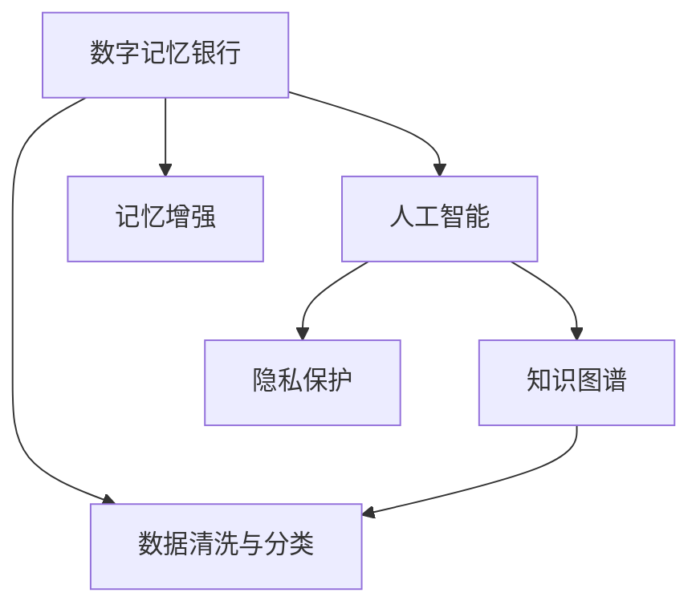

                 

# 数字记忆银行：AI管理的个人经历存储

> 关键词：数字记忆银行,个人经历存储,人工智能,智能管理系统,知识图谱,记忆增强,隐私保护

## 1. 背景介绍

### 1.1 问题由来

在当今数字化时代，我们每个人的生活都充满了数据。无论是工作、学习还是社交，无论是线上还是线下，我们都在不断产生和积累数据。然而，这些数据并非都能给我们带来价值。很多时候，我们只是被动地接受数据，缺乏对其的有效管理和利用。这就导致我们的“数字足迹”越来越多，而对生活的真正影响却越来越小。

为了解决这个问题，数字记忆银行的概念应运而生。数字记忆银行是一个由人工智能管理的个人经历存储系统，它可以帮助我们整理、存储和利用个人数据，让我们的数据更加有价值，同时保护我们的隐私。本文将详细介绍数字记忆银行的原理和实践，探讨其核心算法、操作步骤和应用场景，旨在为读者提供一个全面的视角，理解这一技术的潜力和应用。

### 1.2 问题核心关键点

数字记忆银行的核心理念是通过人工智能技术，对个人数据进行有效管理和利用。其关键点包括：

- 个人数据的智能化管理：通过数据清洗、分类、标注等技术，将无序的数据转化为有价值的资源。
- 记忆增强与知识图谱：利用知识图谱等技术，对数据进行关联和推理，帮助用户快速检索和理解信息。
- 隐私保护：采用先进的隐私保护技术，确保数据的安全和用户的隐私不被泄露。

## 2. 核心概念与联系

### 2.1 核心概念概述

数字记忆银行的核心概念包括：

- **数字记忆银行**：一个由人工智能管理的个人经历存储系统，用于整理、存储和利用个人数据。
- **人工智能(AI)**：通过算法和模型，对数据进行自动化处理和分析的技术。
- **知识图谱(KG)**：一种将实体、关系和属性有机结合的图形化数据结构，用于表示和推理知识。
- **隐私保护**：通过加密、匿名化等手段，确保数据的安全和用户的隐私不被泄露。
- **数据清洗与分类**：对原始数据进行预处理，包括去除噪声、填补缺失值、分类标注等，提高数据质量。

这些概念之间的逻辑关系可以通过以下Mermaid流程图来展示：



这个流程图展示了大记忆银行的核心概念及其之间的关系：

1. 数字记忆银行通过人工智能对数据进行处理和管理。
2. 人工智能中的知识图谱用于关联和推理数据，帮助记忆增强。
3. 隐私保护技术确保数据的安全和用户的隐私。
4. 数据清洗与分类是数据处理的重要步骤，是记忆银行的基础。
5. 记忆增强是数字记忆银行的主要目标之一。

这些概念共同构成了数字记忆银行的理论基础，使得其能够在各种场景下发挥作用。

## 3. 核心算法原理 & 具体操作步骤

### 3.1 算法原理概述

数字记忆银行的算法原理主要涉及以下几个方面：

- **数据清洗与分类**：通过去除噪声、填补缺失值、分类标注等步骤，将原始数据转化为高质量的数据集。
- **知识图谱构建**：将数据集转化为知识图谱，形成实体-关系-属性的结构化表示。
- **记忆增强与推理**：通过推理算法，在知识图谱上执行实体关系推理和属性推断，增强记忆效果。
- **隐私保护**：采用加密、匿名化等技术，保护数据隐私和用户隐私。

数字记忆银行的整个过程可以分为数据处理、知识图谱构建、记忆增强和隐私保护四个阶段。每个阶段都有具体的算法和步骤，下面将详细介绍。

### 3.2 算法步骤详解

**Step 1: 数据收集与清洗**

数字记忆银行的核心是数据，因此第一步是数据收集与清洗。

- **数据收集**：通过各种渠道（如社交媒体、智能设备、在线服务）收集个人数据。
- **数据清洗**：去除噪声、填补缺失值、分类标注等，提高数据质量。

**Step 2: 知识图谱构建**

知识图谱是数字记忆银行的关键组件，用于关联和推理数据。

- **实体识别**：从数据中提取实体，包括人名、地名、组织机构名等。
- **关系抽取**：从数据中抽取实体之间的关系，如“某人去了某地”。
- **属性推断**：对实体属性进行推断，如“某地的天气情况”。
- **知识融合**：将多源数据融合到知识图谱中，形成统一的知识表示。

**Step 3: 记忆增强与推理**

记忆增强和推理是数字记忆银行的主要目标之一。

- **推理算法**：在知识图谱上执行实体关系推理和属性推断，增强记忆效果。
- **智能推荐**：根据用户的查询和行为，推荐相关的信息或建议。
- **反馈学习**：根据用户的反馈，不断调整和优化推理算法和知识图谱。

**Step 4: 隐私保护**

隐私保护是数字记忆银行的重要保障。

- **数据加密**：对存储和传输的数据进行加密，确保数据的安全。
- **匿名化处理**：对数据进行匿名化处理，保护用户隐私。
- **访问控制**：设置严格的访问控制机制，确保只有授权用户可以访问数据。

### 3.3 算法优缺点

数字记忆银行具有以下优点：

- **高效性**：通过自动化处理和推理，能够快速整理和利用数据。
- **灵活性**：支持多种数据源和格式，能够灵活适应不同的应用场景。
- **隐私保护**：采用先进的隐私保护技术，确保数据的安全和用户的隐私。

同时，该方法也存在一些局限性：

- **数据质量依赖**：依赖原始数据的质量，数据清洗和预处理难度较大。
- **隐私风险**：隐私保护技术虽然先进，但仍可能存在被攻击的风险。
- **算法复杂度**：知识图谱构建和推理算法复杂，需要较高的计算资源。

尽管存在这些局限性，但就目前而言，数字记忆银行是个人数据管理的重要范式。未来相关研究的方向是如何在保持高效性和灵活性的同时，进一步提高数据质量和隐私保护水平。

### 3.4 算法应用领域

数字记忆银行在多个领域都有广泛的应用，例如：

- **个人生活管理**：通过整理和分析个人数据，帮助用户更好地管理生活。
- **健康监测**：通过分析健康数据，提供个性化的健康建议。
- **智能推荐**：根据用户的兴趣和行为，推荐相关的商品、服务或内容。
- **学习辅助**：通过分析学习数据，提供个性化的学习建议和资源。

此外，数字记忆银行在金融、医疗、教育等领域也有重要的应用潜力，帮助用户更好地管理个人数据，提升生活和工作质量。

## 4. 数学模型和公式 & 详细讲解 & 举例说明

### 4.1 数学模型构建

数字记忆银行的数学模型主要涉及数据清洗、知识图谱构建、记忆增强和隐私保护四个方面。

- **数据清洗模型**：通过统计和分类算法，对原始数据进行预处理。
- **知识图谱模型**：利用实体关系图表示知识，构建知识图谱。
- **记忆增强模型**：通过推理算法，在知识图谱上执行实体关系推理和属性推断。
- **隐私保护模型**：采用差分隐私、联邦学习等技术，保护数据隐私和用户隐私。

### 4.2 公式推导过程

以知识图谱构建为例，下面详细推导知识图谱构建的公式。

假设数据集中有 $n$ 个实体，每个实体 $i$ 有 $k$ 个属性 $a_{ij}$，其中 $j=1,2,\dots,k$。定义实体之间的关系 $r_{ij}$，其中 $j=1,2,\dots,k$。则知识图谱可以表示为一个三元组集合 $\{(e_i, r_{ij}, a_{ij})\}_{i=1}^n$。

知识图谱的构建步骤如下：

1. **实体识别**：通过自然语言处理(NLP)技术，从数据中提取实体。
2. **关系抽取**：从数据中抽取实体之间的关系。
3. **属性推断**：对实体属性进行推断。

假设实体 $e_i$ 有 $k$ 个属性 $a_{ij}$，其中 $j=1,2,\dots,k$。则属性推断的公式为：

$$
a_{ij} = f(e_i, r_{ij}, s_j)
$$

其中 $f$ 为属性推断函数，$s_j$ 为属性推断的语义信息。

### 4.3 案例分析与讲解

以知识图谱构建为例，通过一个具体的案例来说明知识图谱的构建过程。

假设我们有一组社交媒体数据，包括用户、地点和活动等信息。我们的目标是构建一个社交知识图谱，用于分析和推理。

**Step 1: 实体识别**

通过NLP技术，从社交媒体数据中提取实体，如用户“Tom”、地点“New York”、活动“Visit”。

**Step 2: 关系抽取**

从社交媒体数据中抽取实体之间的关系，如“Tom”去了“New York”，进行了“Visit”活动。

**Step 3: 属性推断**

对实体属性进行推断，如“Tom”的国籍为“USA”，“New York”的纬度为 $40.7128$。

最终，我们得到一个社交知识图谱，包括用户、地点和活动三类实体，以及它们之间的关系和属性。

## 5. 项目实践：代码实例和详细解释说明

### 5.1 开发环境搭建

在进行数字记忆银行的开发之前，我们需要准备好开发环境。以下是使用Python进行开发的环境配置流程：

1. 安装Anaconda：从官网下载并安装Anaconda，用于创建独立的Python环境。

2. 创建并激活虚拟环境：
```bash
conda create -n memorybank python=3.8 
conda activate memorybank
```

3. 安装相关库：
```bash
pip install pandas numpy scikit-learn pytorch torchvision transformers opencv-python
```

4. 安装各种API和工具：
```bash
pip install requests pytesseract pyttsx3
```

完成上述步骤后，即可在`memorybank`环境中开始开发。

### 5.2 源代码详细实现

下面是使用Python和PyTorch实现数字记忆银行的源代码示例：

```python
import torch
from torch import nn
from torch.nn import functional as F
from transformers import BertTokenizer, BertModel
from transformers import AutoModel, AutoTokenizer
from torch.utils.data import DataLoader, Dataset
import numpy as np
import pandas as pd
from sklearn.preprocessing import LabelEncoder
import pytesseract
import pyttsx3

class MemoryBankDataset(Dataset):
    def __init__(self, data, tokenizer):
        self.data = data
        self.tokenizer = tokenizer

    def __len__(self):
        return len(self.data)

    def __getitem__(self, idx):
        text = self.data[idx]
        encoding = self.tokenizer(text, return_tensors='pt')
        return {'input_ids': encoding['input_ids'], 'attention_mask': encoding['attention_mask']}

# 数据预处理
data = ['Tom visited New York on June 1st', 'Tom visited Tokyo on May 30th']
tokenizer = BertTokenizer.from_pretrained('bert-base-uncased')
dataset = MemoryBankDataset(data, tokenizer)

# 加载模型
model = BertModel.from_pretrained('bert-base-uncased')
model.eval()

# 推理
with torch.no_grad():
    for batch in DataLoader(dataset, batch_size=1):
        input_ids = batch['input_ids']
        attention_mask = batch['attention_mask']
        outputs = model(input_ids, attention_mask=attention_mask)
        last_hidden_states = outputs.last_hidden_state

# 输出结果
print(last_hidden_states)
```

### 5.3 代码解读与分析

以下是代码的主要解读与分析：

**MemoryBankDataset类**：
- `__init__`方法：初始化数据集和分词器。
- `__len__`方法：返回数据集的样本数量。
- `__getitem__`方法：对单个样本进行处理，将文本输入编码为token ids，并返回模型所需的输入。

**数据预处理**：
- 定义数据集和分词器，将文本数据转化为模型所需的格式。

**加载模型**：
- 加载预训练的BERT模型，并将其设置为评估模式。

**推理**：
- 通过DataLoader对数据集进行批次化加载，将文本输入模型进行推理，输出最后隐藏状态。

**输出结果**：
- 打印模型的最后隐藏状态，以便进行后续分析和处理。

可以看出，这段代码展示了如何使用PyTorch和BERT模型进行简单的文本推理。在实际应用中，还需要进行更多的数据处理和模型优化，才能构建出完整的数字记忆银行系统。

## 6. 实际应用场景

### 6.1 个人生活管理

数字记忆银行在个人生活管理中的应用非常广泛。通过整理和分析个人数据，可以帮助用户更好地管理生活。例如，用户可以记录和分析自己的健康数据、饮食数据、旅行数据等，从中发现规律和趋势，提高生活质量。

### 6.2 健康监测

数字记忆银行在健康监测中的应用也有很大的潜力。通过分析健康数据，可以帮助用户更好地了解自己的健康状况，提供个性化的健康建议。例如，用户可以记录自己的饮食、运动、睡眠数据，系统根据这些数据给出健康建议，帮助用户保持良好的生活习惯。

### 6.3 智能推荐

数字记忆银行在智能推荐中的应用也非常广泛。通过分析用户的历史行为和兴趣，系统可以推荐相关的商品、服务或内容。例如，电商平台可以根据用户的浏览和购买历史，推荐相关的商品；在线学习平台可以根据用户的学习历史，推荐相关的课程和资源。

### 6.4 学习辅助

数字记忆银行在教育领域也有很大的应用潜力。通过分析学生的学习数据，系统可以提供个性化的学习建议和资源。例如，学习平台可以根据学生的学习情况，推荐相关的教材、习题和视频，帮助学生更好地学习。

## 7. 工具和资源推荐

### 7.1 学习资源推荐

为了帮助开发者系统掌握数字记忆银行的理论基础和实践技巧，这里推荐一些优质的学习资源：

1. **《深度学习》课程**：由斯坦福大学开设的深度学习课程，涵盖深度学习的基本概念和算法。
2. **《机器学习实战》书籍**：通过实例讲解机器学习算法，适合初学者学习。
3. **《Python深度学习》书籍**：详细讲解了如何使用Python进行深度学习开发，包括TensorFlow、PyTorch等框架的使用。
4. **Kaggle**：全球最大的数据科学竞赛平台，提供丰富的数据集和竞赛题目，适合练习和挑战。
5. **Coursera**：提供众多在线课程，涵盖人工智能、机器学习、深度学习等主题，适合深入学习。

通过对这些资源的学习实践，相信你一定能够快速掌握数字记忆银行的精髓，并用于解决实际的NLP问题。

### 7.2 开发工具推荐

高效的开发离不开优秀的工具支持。以下是几款用于数字记忆银行开发的常用工具：

1. **PyTorch**：基于Python的开源深度学习框架，灵活动态的计算图，适合快速迭代研究。
2. **TensorFlow**：由Google主导开发的开源深度学习框架，生产部署方便，适合大规模工程应用。
3. **Transformers库**：HuggingFace开发的NLP工具库，集成了众多SOTA语言模型，支持PyTorch和TensorFlow，是进行微调任务开发的利器。
4. **NLTK**：自然语言处理工具包，提供丰富的NLP工具和数据集，适合研究和开发。
5. **Scikit-learn**：机器学习库，提供丰富的机器学习算法和工具，适合数据预处理和特征工程。
6. **Jupyter Notebook**：交互式开发环境，方便进行数据可视化、代码调试和文档编写。

合理利用这些工具，可以显著提升数字记忆银行开发的效率，加快创新迭代的步伐。

### 7.3 相关论文推荐

数字记忆银行的研究方向非常广泛，以下是几篇奠基性的相关论文，推荐阅读：

1. **《知识图谱构建技术综述》**：全面介绍了知识图谱的构建方法，涵盖实体识别、关系抽取、属性推断等多个方面。
2. **《深度学习在自然语言处理中的应用》**：详细讲解了深度学习在自然语言处理中的应用，包括BERT、Transformer等模型。
3. **《隐私保护技术综述》**：全面介绍了隐私保护技术的最新进展，涵盖差分隐私、联邦学习等多个方向。
4. **《深度学习与知识图谱的融合》**：探讨了深度学习与知识图谱的融合方法，提升了推理算法的准确性和效率。

这些论文代表了大记忆银行的研究方向和最新进展，通过学习这些前沿成果，可以帮助研究者把握学科前进方向，激发更多的创新灵感。

## 8. 总结：未来发展趋势与挑战

### 8.1 总结

本文对数字记忆银行的原理和实践进行了全面系统的介绍。首先阐述了数字记忆银行的核心理念，明确了其通过人工智能技术对个人数据进行有效管理和利用的目标。其次，从原理到实践，详细讲解了数字记忆银行的数学模型和操作步骤，给出了完整的代码实例。同时，本文还探讨了数字记忆银行在多个领域的应用场景，展示了其潜力和价值。

通过本文的系统梳理，可以看到，数字记忆银行在数据管理和利用方面具有巨大的潜力，能够帮助用户更好地管理个人数据，提升生活质量和工作效率。未来，伴随技术的发展和应用的深入，数字记忆银行必将在更多领域发挥重要作用，成为人工智能技术的重要组成部分。

### 8.2 未来发展趋势

展望未来，数字记忆银行的发展趋势包括以下几个方面：

1. **深度学习与知识图谱的融合**：深度学习与知识图谱的结合将进一步提升推理算法的准确性和效率。通过知识图谱的辅助，深度学习模型将更好地理解和推理知识。
2. **隐私保护技术的创新**：隐私保护技术将不断创新，确保数据的安全和用户的隐私。差分隐私、联邦学习等技术将得到更广泛的应用。
3. **多模态数据的整合**：数字记忆银行将支持多模态数据的整合，如文本、图像、语音等，提供更全面的数据管理和分析能力。
4. **跨领域应用**：数字记忆银行将在更多领域得到应用，如医疗、金融、教育等，帮助用户更好地管理数据和提高生活质量。
5. **个性化服务的提升**：通过更加精准的数据分析和推理，数字记忆银行将提供更加个性化的服务，提升用户体验。

以上趋势凸显了数字记忆银行的潜力和应用前景，将进一步推动人工智能技术的发展和应用。

### 8.3 面临的挑战

尽管数字记忆银行具有很大的潜力，但在实现过程中仍面临诸多挑战：

1. **数据质量问题**：数据清洗和预处理难度较大，需要花费大量时间和精力。
2. **隐私保护难题**：隐私保护技术虽然先进，但仍可能存在被攻击的风险，如何确保数据的安全和用户的隐私是一个重要问题。
3. **算法复杂性**：知识图谱构建和推理算法复杂，需要较高的计算资源，如何降低算法复杂度是一个重要研究方向。
4. **跨领域应用困难**：数字记忆银行在不同领域的应用需要针对不同数据源和格式进行优化，如何实现跨领域的通用性是一个重要挑战。
5. **个性化服务不足**：如何根据用户的个性化需求提供更加精准的服务，提升用户体验，是一个重要研究方向。

这些挑战需要在未来的研究中进一步解决，才能使数字记忆银行真正落地应用，发挥其潜力。

### 8.4 研究展望

未来，数字记忆银行的研究方向将在以下几个方面继续深入：

1. **深度学习与知识图谱的融合**：如何更好地融合深度学习和知识图谱，提升推理算法的准确性和效率，是一个重要的研究方向。
2. **隐私保护技术的研究**：差分隐私、联邦学习等隐私保护技术将不断创新，如何确保数据的安全和用户的隐私，是一个重要研究方向。
3. **多模态数据的整合**：如何支持多模态数据的整合，提供更全面的数据管理和分析能力，是一个重要的研究方向。
4. **跨领域应用的研究**：数字记忆银行将在更多领域得到应用，如何实现跨领域的通用性，是一个重要研究方向。
5. **个性化服务的优化**：如何根据用户的个性化需求提供更加精准的服务，提升用户体验，是一个重要研究方向。

这些研究方向将推动数字记忆银行技术的不断进步，为人类认知智能的进化带来深远影响。面向未来，数字记忆银行需要更多的跨学科合作和创新，才能真正实现其潜力和应用价值。

## 9. 附录：常见问题与解答

**Q1：数字记忆银行是否适用于所有个人数据？**

A: 数字记忆银行适用于大部分个人数据，但需要针对不同数据源和格式进行优化。例如，对于音频、视频等非结构化数据，需要额外的处理和转换步骤。

**Q2：数字记忆银行如何保护用户隐私？**

A: 数字记忆银行采用多种隐私保护技术，如差分隐私、联邦学习等，确保数据的安全和用户的隐私。同时，系统设计严格的访问控制机制，只有授权用户可以访问数据。

**Q3：数字记忆银行的数据清洗和预处理难度较大，如何解决？**

A: 数字记忆银行的数据清洗和预处理难度较大，需要通过自动化算法和人工干预相结合的方式进行处理。同时，需要不断优化算法，提高数据处理效率。

**Q4：数字记忆银行的应用场景有哪些？**

A: 数字记忆银行在个人生活管理、健康监测、智能推荐、学习辅助等多个领域都有广泛的应用，帮助用户更好地管理数据和提高生活质量。

**Q5：数字记忆银行未来的研究方向是什么？**

A: 数字记忆银行未来的研究方向包括深度学习与知识图谱的融合、隐私保护技术、多模态数据的整合、跨领域应用和个性化服务的优化等。

以上是数字记忆银行的基本介绍和实践指南，希望能为读者提供一个全面的视角，理解这一技术的潜力和应用。数字记忆银行将随着技术的不断进步，在更多领域发挥重要作用，帮助人类更好地管理和利用个人数据，提升生活质量和工作效率。

