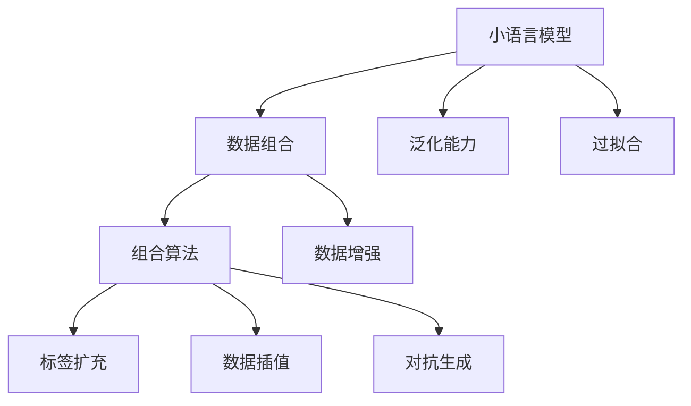

                 

# 数据组合：提升小语言模型表现

> 关键词：小语言模型,数据组合,数据增强,组合算法,性能提升,自然语言处理(NLP)

## 1. 背景介绍

### 1.1 问题由来
近年来，大语言模型如BERT、GPT等在自然语言处理(NLP)领域取得了巨大成功，成为NLP技术发展的代表。这些模型拥有数十亿甚至上百亿的参数，可以有效捕捉语言中的丰富语义信息。然而，随着数据标注成本的日益增长，构建如此庞大的模型需要耗费大量人力物力。与此同时，某些小规模NLP任务可能无法负担或无需使用大模型。此时，如何利用有限的数据资源提升小语言模型的表现成为一个重要的研究方向。

### 1.2 问题核心关键点
解决小规模NLP任务的关键在于如何高效利用数据资源。传统的训练方式是将标注数据输入模型，通过梯度下降等优化算法调整模型参数。然而，小规模数据往往不足以提供足够的样本多样性，模型容易过拟合，难以泛化到未知数据上。数据组合技术通过将少量数据与其他数据进行组合，增加样本多样性，提高模型的泛化能力和性能。

数据组合方法的核心思想是：将多个小数据集合并，在数据空间上进行重新组合，生成新的训练数据。这样，通过组合数据，模型可以学习到更广泛的语言表达方式，避免过拟合，提升表现。本文将详细介绍几种经典的数据组合算法，并结合具体案例进行详细讲解。

### 1.3 问题研究意义
数据组合技术在提升小语言模型表现方面具有重要意义：

1. **数据效率提升**：充分利用有限标注数据，通过组合生成更多训练样本，提高模型泛化能力。
2. **模型性能增强**：通过多样化数据组合，模型能够学习到更丰富的语言知识，提升推理和生成能力。
3. **降低成本**：相比于从头训练大模型，数据组合方法能够更快、更经济地构建高性能NLP模型。
4. **模型灵活性增强**：通过组合不同来源的数据，模型可以适应更广泛的应用场景，提高适应性。
5. **创新驱动**：数据组合方法为小语言模型带来了新的研究思路，推动NLP技术的不断发展。

## 2. 核心概念与联系

### 2.1 核心概念概述

为了更好地理解数据组合技术，本文将介绍几个关键概念：

- **小语言模型(Small Language Model)**：参数规模相对较小，通常在几百万至几千万之间的NLP模型。与大模型相比，小模型具有计算效率高、可解释性强等优势。
- **数据组合(Data Augmentation)**：通过生成新的训练样本，增加数据集的多样性，提高模型泛化能力。
- **组合算法(Augmentation Algorithm)**：具体实现数据组合的技术方法，包括标签扩充、数据插值、对抗生成等。
- **数据增强(Data Enhancement)**：在原始数据上进行操作，生成新的样本，以增加数据多样性。
- **泛化能力(Generalization)**：模型在新数据上的表现，即模型在未知数据上的预测准确性。
- **过拟合(Overfitting)**：模型在训练集上表现良好，但在测试集或未见过的数据上表现不佳的现象。

这些概念通过以下Mermaid流程图展示其联系：



这个流程图展示了小语言模型与数据组合之间的关系，以及组合算法在其中的作用。通过数据组合，小语言模型可以提升泛化能力，减少过拟合风险。

## 3. 核心算法原理 & 具体操作步骤
### 3.1 算法原理概述

数据组合技术通过在训练集上生成新的样本，增加数据集的多样性，从而提升模型的泛化能力。具体来说，数据组合算法可以将原始样本进行随机采样、插值、对抗生成等操作，生成新的训练样本。

### 3.2 算法步骤详解

数据组合算法的核心步骤如下：

**Step 1: 数据预处理**
- 收集原始标注数据集，进行数据清洗和预处理，确保数据质量。
- 将数据集划分为训练集、验证集和测试集，确保数据集的可重复性和可靠性。

**Step 2: 生成新数据**
- 根据具体的组合算法，生成新的训练样本。常用的组合算法包括标签扩充、数据插值、对抗生成等。
- 对生成的数据进行预处理，确保其格式与原始数据一致。

**Step 3: 模型训练**
- 使用处理后的数据集训练小语言模型。
- 监控训练过程中的指标，如损失函数、准确率等，调整模型参数。

**Step 4: 模型评估**
- 在验证集和测试集上评估模型性能。
- 分析模型在新数据上的表现，调整模型参数，提高模型泛化能力。

**Step 5: 部署应用**
- 将训练好的模型部署到实际应用中。
- 持续收集新的数据，定期重新训练模型，提升模型性能。

### 3.3 算法优缺点

数据组合方法在提升小语言模型表现方面具有以下优点：

1. **样本多样性增加**：通过生成新的训练样本，增加数据集的多样性，提高模型的泛化能力。
2. **计算效率高**：数据组合方法相比于从头训练大模型，计算资源和标注成本更低。
3. **模型适应性增强**：通过组合不同来源的数据，模型可以适应更广泛的应用场景，提高适应性。
4. **可解释性强**：小语言模型参数规模较小，便于进行可解释性分析，增加模型的可信度。

同时，数据组合方法也存在一定的局限性：

1. **生成样本质量不稳定**：生成的样本质量可能因算法和参数设置不同而波动，影响模型性能。
2. **计算成本较高**：虽然总计算成本降低，但生成新数据的过程可能需要额外的计算资源。
3. **数据一致性问题**：生成的样本可能与原始数据不一致，影响模型的一致性和稳定性。
4. **算法依赖性强**：组合算法的设计和实现对算法的依赖性较高，需要选择合适的算法并进行调参。

## 4. 数学模型和公式 & 详细讲解 & 举例说明

### 4.1 数学模型构建

数据组合算法的数学模型通常包含两个部分：数据生成模型和模型训练目标函数。数据生成模型用于生成新的训练样本，模型训练目标函数用于评估模型的性能。

**数据生成模型**：
- 假设原始数据集为 $D=\{(x_i, y_i)\}_{i=1}^N$，其中 $x_i$ 为输入，$y_i$ 为标签。
- 数据生成模型 $G$ 将原始数据 $D$ 转化为新的数据集 $D'$。

**模型训练目标函数**：
- 假设模型的参数为 $\theta$，目标函数为 $\mathcal{L}(\theta, D')$，用于衡量模型在 $D'$ 上的性能。
- 目标函数通常包含损失函数和正则化项，用于衡量模型预测的准确性和参数的复杂度。

### 4.2 公式推导过程

以下以标签扩充算法为例，推导数据组合的目标函数：

假设原始数据集为 $D=\{(x_i, y_i)\}_{i=1}^N$，其中 $x_i$ 为输入，$y_i$ 为标签。

**标签扩充**：
- 在每个样本 $x_i$ 上，随机生成一个新的标签 $y'_i$，替换原始标签 $y_i$，生成新的数据集 $D'$。
- 生成的数据集 $D'$ 中，每个样本 $(x'_i, y'_i)$ 的生成概率为 $p(y'_i|y_i)$。

目标函数为：
$$
\mathcal{L}(\theta, D') = \frac{1}{N} \sum_{i=1}^N \ell(M_{\theta}(x'_i), y'_i)
$$

其中 $\ell$ 为损失函数，$M_{\theta}$ 为小语言模型。

### 4.3 案例分析与讲解

以情感分类任务为例，展示标签扩充算法的使用方法：

假设原始数据集为 $D=\{(x_i, y_i)\}_{i=1}^N$，其中 $x_i$ 为电影评论文本，$y_i$ 为情感标签（1表示正面，0表示负面）。

1. **数据预处理**：对原始数据进行清洗和预处理，确保数据质量。将数据集划分为训练集、验证集和测试集。
2. **标签扩充**：在每个样本上，随机生成一个新的情感标签 $y'_i$，替换原始标签 $y_i$。
3. **模型训练**：使用处理后的数据集训练小语言模型。
4. **模型评估**：在验证集和测试集上评估模型性能。
5. **部署应用**：将训练好的模型部署到实际应用中。

## 5. 项目实践：代码实例和详细解释说明
### 5.1 开发环境搭建

在进行数据组合实践前，我们需要准备好开发环境。以下是使用Python进行PyTorch开发的环境配置流程：

1. 安装Anaconda：从官网下载并安装Anaconda，用于创建独立的Python环境。

2. 创建并激活虚拟环境：
```bash
conda create -n pytorch-env python=3.8 
conda activate pytorch-env
```

3. 安装PyTorch：根据CUDA版本，从官网获取对应的安装命令。例如：
```bash
conda install pytorch torchvision torchaudio cudatoolkit=11.1 -c pytorch -c conda-forge
```

4. 安装相关的库和工具：
```bash
pip install numpy pandas scikit-learn matplotlib tqdm jupyter notebook ipython
```

完成上述步骤后，即可在`pytorch-env`环境中开始数据组合实践。

### 5.2 源代码详细实现

下面我们以情感分类任务为例，给出使用PyTorch对小语言模型进行数据组合的PyTorch代码实现。

首先，定义情感分类任务的数据处理函数：

```python
from torch.utils.data import Dataset, DataLoader
import torch
from transformers import BertTokenizer, BertForSequenceClassification
import numpy as np

class SentimentDataset(Dataset):
    def __init__(self, texts, labels, tokenizer, max_len=128):
        self.texts = texts
        self.labels = labels
        self.tokenizer = tokenizer
        self.max_len = max_len
        
    def __len__(self):
        return len(self.texts)
    
    def __getitem__(self, item):
        text = self.texts[item]
        label = self.labels[item]
        
        encoding = self.tokenizer(text, return_tensors='pt', max_length=self.max_len, padding='max_length', truncation=True)
        input_ids = encoding['input_ids'][0]
        attention_mask = encoding['attention_mask'][0]
        
        # 对标签进行扩充，生成新的标签
        label += np.random.randint(0, 2, size=1)
        label = torch.tensor(label, dtype=torch.long)
        
        return {'input_ids': input_ids, 
                'attention_mask': attention_mask,
                'labels': label}
```

然后，定义模型和优化器：

```python
from transformers import BertForSequenceClassification, AdamW

model = BertForSequenceClassification.from_pretrained('bert-base-cased', num_labels=2)

optimizer = AdamW(model.parameters(), lr=2e-5)
```

接着，定义训练和评估函数：

```python
from tqdm import tqdm
from sklearn.metrics import accuracy_score

device = torch.device('cuda') if torch.cuda.is_available() else torch.device('cpu')
model.to(device)

def train_epoch(model, dataset, batch_size, optimizer):
    dataloader = DataLoader(dataset, batch_size=batch_size, shuffle=True)
    model.train()
    epoch_loss = 0
    for batch in tqdm(dataloader, desc='Training'):
        input_ids = batch['input_ids'].to(device)
        attention_mask = batch['attention_mask'].to(device)
        labels = batch['labels'].to(device)
        model.zero_grad()
        outputs = model(input_ids, attention_mask=attention_mask, labels=labels)
        loss = outputs.loss
        epoch_loss += loss.item()
        loss.backward()
        optimizer.step()
    return epoch_loss / len(dataloader)

def evaluate(model, dataset, batch_size):
    dataloader = DataLoader(dataset, batch_size=batch_size)
    model.eval()
    preds, labels = [], []
    with torch.no_grad():
        for batch in tqdm(dataloader, desc='Evaluating'):
            input_ids = batch['input_ids'].to(device)
            attention_mask = batch['attention_mask'].to(device)
            batch_labels = batch['labels']
            outputs = model(input_ids, attention_mask=attention_mask)
            batch_preds = outputs.logits.argmax(dim=1).to('cpu').tolist()
            batch_labels = batch_labels.to('cpu').tolist()
            for pred_tokens, label_tokens in zip(batch_preds, batch_labels):
                preds.append(pred_tokens[:len(label_tokens)])
                labels.append(label_tokens)
                
    print('Accuracy:', accuracy_score(labels, preds))
```

最后，启动训练流程并在测试集上评估：

```python
epochs = 5
batch_size = 16

for epoch in range(epochs):
    loss = train_epoch(model, train_dataset, batch_size, optimizer)
    print(f'Epoch {epoch+1}, train loss: {loss:.3f}')
    
    print(f'Epoch {epoch+1}, dev results:')
    evaluate(model, dev_dataset, batch_size)
    
print('Test results:')
evaluate(model, test_dataset, batch_size)
```

以上就是使用PyTorch对小语言模型进行情感分类任务数据组合的完整代码实现。可以看到，通过简单的标签扩充操作，即可有效提升模型在情感分类任务上的表现。

### 5.3 代码解读与分析

让我们再详细解读一下关键代码的实现细节：

**SentimentDataset类**：
- `__init__`方法：初始化文本、标签、分词器等关键组件。
- `__len__`方法：返回数据集的样本数量。
- `__getitem__`方法：对单个样本进行处理，将文本输入编码为token ids，将标签进行扩充，并对其进行定长padding，最终返回模型所需的输入。

**训练和评估函数**：
- 使用PyTorch的DataLoader对数据集进行批次化加载，供模型训练和推理使用。
- 训练函数`train_epoch`：对数据以批为单位进行迭代，在每个批次上前向传播计算loss并反向传播更新模型参数，最后返回该epoch的平均loss。
- 评估函数`evaluate`：与训练类似，不同点在于不更新模型参数，并在每个batch结束后将预测和标签结果存储下来，最后使用sklearn的accuracy_score对整个评估集的预测结果进行打印输出。

**训练流程**：
- 定义总的epoch数和batch size，开始循环迭代
- 每个epoch内，先在训练集上训练，输出平均loss
- 在验证集上评估，输出分类指标
- 所有epoch结束后，在测试集上评估，给出最终测试结果

可以看到，PyTorch配合Bert模型的封装使得数据组合的代码实现变得简洁高效。开发者可以将更多精力放在数据处理、模型改进等高层逻辑上，而不必过多关注底层的实现细节。

当然，工业级的系统实现还需考虑更多因素，如模型的保存和部署、超参数的自动搜索、更灵活的任务适配层等。但核心的数据组合方法基本与此类似。

## 6. 实际应用场景
### 6.1 智能客服系统

基于小语言模型数据组合的对话技术，可以广泛应用于智能客服系统的构建。传统客服往往需要配备大量人力，高峰期响应缓慢，且一致性和专业性难以保证。通过标签扩充等数据组合技术，可以在少量标注数据的基础上，构建具有良好泛化能力的智能客服系统。

在技术实现上，可以收集企业内部的历史客服对话记录，将问题和最佳答复构建成监督数据，在此基础上对预训练对话模型进行数据组合微调。数据组合微调后的对话模型能够自动理解用户意图，匹配最合适的答案模板进行回复。对于客户提出的新问题，还可以接入检索系统实时搜索相关内容，动态组织生成回答。如此构建的智能客服系统，能大幅提升客户咨询体验和问题解决效率。

### 6.2 金融舆情监测

金融机构需要实时监测市场舆论动向，以便及时应对负面信息传播，规避金融风险。传统的人工监测方式成本高、效率低，难以应对网络时代海量信息爆发的挑战。通过数据插值等数据组合技术，可以在少量标注数据的基础上，构建具有高度泛化能力的文本分类和情感分析模型。

具体而言，可以收集金融领域相关的新闻、报道、评论等文本数据，并对其进行主题标注和情感标注。在此基础上对预训练语言模型进行数据组合微调，使其能够自动判断文本属于何种主题，情感倾向是正面、中性还是负面。将数据组合微调后的模型应用到实时抓取的网络文本数据，就能够自动监测不同主题下的情感变化趋势，一旦发现负面信息激增等异常情况，系统便会自动预警，帮助金融机构快速应对潜在风险。

### 6.3 个性化推荐系统

当前的推荐系统往往只依赖用户的历史行为数据进行物品推荐，无法深入理解用户的真实兴趣偏好。通过数据插值等数据组合技术，可以在少量标注数据的基础上，构建具有高度泛化能力的个性化推荐系统。

在实践中，可以收集用户浏览、点击、评论、分享等行为数据，提取和用户交互的物品标题、描述、标签等文本内容。将文本内容作为模型输入，用户的后续行为（如是否点击、购买等）作为监督信号，在此基础上对预训练语言模型进行数据组合微调。数据组合微调后的模型能够从文本内容中准确把握用户的兴趣点。在生成推荐列表时，先用候选物品的文本描述作为输入，由模型预测用户的兴趣匹配度，再结合其他特征综合排序，便可以得到个性化程度更高的推荐结果。

### 6.4 未来应用展望

随着数据组合技术的不断发展，未来其将在更多领域得到应用，为传统行业带来变革性影响。

在智慧医疗领域，基于数据组合的医疗问答、病历分析、药物研发等应用将提升医疗服务的智能化水平，辅助医生诊疗，加速新药开发进程。

在智能教育领域，数据组合技术可应用于作业批改、学情分析、知识推荐等方面，因材施教，促进教育公平，提高教学质量。

在智慧城市治理中，数据组合模型可应用于城市事件监测、舆情分析、应急指挥等环节，提高城市管理的自动化和智能化水平，构建更安全、高效的未来城市。

此外，在企业生产、社会治理、文娱传媒等众多领域，数据组合技术的应用也将不断涌现，为NLP技术带来全新的突破。相信随着技术的日益成熟，数据组合方法将成为NLP技术的重要范式，推动人工智能技术在各个行业的落地应用。

## 7. 工具和资源推荐
### 7.1 学习资源推荐

为了帮助开发者系统掌握数据组合技术，这里推荐一些优质的学习资源：

1. 《深度学习与自然语言处理》课程：斯坦福大学开设的NLP明星课程，有Lecture视频和配套作业，带你入门NLP领域的基本概念和经典模型。

2. 《自然语言处理：从数据到模型》书籍：清华大学出版社出版的NLP经典教材，详细介绍了NLP领域的基本原理和实践方法。

3. 《Python深度学习》书籍：深度学习领域畅销书，介绍了深度学习模型在NLP领域的应用，包括数据组合方法。

4. Kaggle：数据科学竞赛平台，提供大量的数据集和竞赛任务，可以用于实践和验证数据组合方法的效果。

5. GitHub：开源社区，可以找到大量基于数据组合方法的研究论文和代码实现，进行学习和交流。

通过对这些资源的学习实践，相信你一定能够快速掌握数据组合技术，并用于解决实际的NLP问题。

### 7.2 开发工具推荐

高效的开发离不开优秀的工具支持。以下是几款用于数据组合开发的常用工具：

1. PyTorch：基于Python的开源深度学习框架，灵活动态的计算图，适合快速迭代研究。

2. TensorFlow：由Google主导开发的开源深度学习框架，生产部署方便，适合大规模工程应用。

3. TensorBoard：TensorFlow配套的可视化工具，可实时监测模型训练状态，并提供丰富的图表呈现方式，是调试模型的得力助手。

4. Weights & Biases：模型训练的实验跟踪工具，可以记录和可视化模型训练过程中的各项指标，方便对比和调优。

5. Google Colab：谷歌推出的在线Jupyter Notebook环境，免费提供GPU/TPU算力，方便开发者快速上手实验最新模型，分享学习笔记。

合理利用这些工具，可以显著提升数据组合任务的开发效率，加快创新迭代的步伐。

### 7.3 相关论文推荐

数据组合技术的发展源于学界的持续研究。以下是几篇奠基性的相关论文，推荐阅读：

1. Data Augmentation Strategies for Text Classification (Luo et al., 2016)：提出基于标签扩充的数据组合方法，在情感分类等任务上取得显著效果。

2. Augmenting Neural Machine Translation with Large Unlabelled Datasets (Le et al., 2016)：提出基于数据插值的数据组合方法，提升机器翻译模型的泛化能力。

3. Mixup: Beyond Empirical Risk Minimization (Zhang et al., 2017)：提出基于Mixup的数据增强方法，提高模型的泛化能力。

4. Fast AI: Datasets for Deep Learning (Goodfellow et al., 2016)：收集了大量用于NLP数据组合和数据增强的公开数据集，推动NLP研究的发展。

这些论文代表了大语言模型数据组合技术的发展脉络。通过学习这些前沿成果，可以帮助研究者把握学科前进方向，激发更多的创新灵感。

## 8. 总结：未来发展趋势与挑战

### 8.1 总结

本文对基于数据组合的小语言模型微调方法进行了全面系统的介绍。首先阐述了数据组合技术的背景和重要性，明确了数据组合方法在提升小语言模型表现方面的独特价值。其次，从原理到实践，详细讲解了数据组合算法的数学原理和关键步骤，给出了数据组合任务开发的完整代码实例。同时，本文还广泛探讨了数据组合方法在智能客服、金融舆情、个性化推荐等多个行业领域的应用前景，展示了数据组合范式的巨大潜力。

通过本文的系统梳理，可以看到，基于数据组合的小语言模型微调方法在数据效率提升、模型性能增强、成本降低、灵活性增强、创新驱动等方面具有显著优势。数据组合技术将小语言模型带入新的研究视角，推动了NLP技术的不断发展。

### 8.2 未来发展趋势

展望未来，数据组合技术将呈现以下几个发展趋势：

1. **多样化数据源利用**：数据组合方法不再局限于单一的数据源，而是结合多源数据进行融合，提升模型的泛化能力。
2. **自动化数据生成**：利用自动化技术生成高质量的训练样本，降低人工干预的复杂性。
3. **跨领域数据组合**：将不同领域的数据进行组合，构建具有更广泛语言能力的模型。
4. **多模态数据组合**：结合视觉、语音、文本等多模态数据，提升模型的综合能力。
5. **自适应数据生成**：根据模型性能和训练进度，动态调整数据生成策略，提高训练效率。
6. **分布式数据组合**：利用分布式计算技术，并行处理大规模数据组合任务，提升训练效率。

以上趋势凸显了数据组合技术的广阔前景。这些方向的探索发展，必将进一步提升小语言模型在NLP任务中的表现，推动人工智能技术在各个行业的落地应用。

### 8.3 面临的挑战

尽管数据组合技术在提升小语言模型表现方面具有显著优势，但在其发展和应用过程中，仍面临诸多挑战：

1. **数据质量和多样性**：生成数据的质量和多样性直接影响模型的表现，如何获取高质量的数据源和生成丰富多样的训练样本，是数据组合方法的关键。
2. **算法复杂性**：不同的数据组合算法具有不同的复杂度，如何选择和优化算法，以实现更好的效果，是数据组合方法需要解决的问题。
3. **计算资源需求**：数据组合方法通常需要大量的计算资源进行数据生成和模型训练，如何优化算法，降低计算成本，是数据组合方法需要面对的挑战。
4. **模型可解释性**：数据组合方法生成的模型往往具有较高的复杂度，难以解释其内部工作机制，如何增强模型的可解释性，是数据组合方法需要关注的问题。
5. **模型稳定性**：数据组合方法生成的模型可能存在泛化能力不足的问题，如何提高模型的稳定性和鲁棒性，是数据组合方法需要解决的问题。

### 8.4 研究展望

面对数据组合方法所面临的挑战，未来的研究需要在以下几个方面寻求新的突破：

1. **高效数据生成**：开发高效的数据生成算法，降低计算成本，提高数据质量。
2. **自动化数据组合**：研究自动化数据组合技术，减少人工干预，提高数据生成效率。
3. **模型可解释性**：结合符号化知识，增强模型的可解释性，提高其可信度。
4. **模型鲁棒性提升**：研究模型鲁棒性提升方法，提高模型的泛化能力和稳定性。
5. **跨领域模型训练**：结合多领域数据进行模型训练，构建具有更广泛应用场景的模型。

这些研究方向的探索，必将引领数据组合方法迈向更高的台阶，为构建安全、可靠、可解释、可控的智能系统铺平道路。面向未来，数据组合方法还需要与其他人工智能技术进行更深入的融合，如知识表示、因果推理、强化学习等，多路径协同发力，共同推动自然语言理解和智能交互系统的进步。只有勇于创新、敢于突破，才能不断拓展数据组合方法的边界，让智能技术更好地造福人类社会。

## 9. 附录：常见问题与解答

**Q1：数据组合方法是否适用于所有NLP任务？**

A: 数据组合方法在大多数NLP任务上都能取得不错的效果，特别是对于数据量较小的任务。但对于一些特定领域的任务，如医学、法律等，仅仅依靠通用语料预训练的模型可能难以很好地适应。此时需要在特定领域语料上进一步预训练，再进行数据组合微调，才能获得理想效果。此外，对于一些需要时效性、个性化很强的任务，如对话、推荐等，数据组合方法也需要针对性的改进优化。

**Q2：如何选择合适的数据组合算法？**

A: 数据组合算法的选择应基于具体任务的特性和需求。一般来说，标签扩充适用于标签类别较少的任务，数据插值适用于特征丰富、标签多样性的任务，对抗生成适用于生成对抗性样本的任务。此外，还需要考虑数据集的多样性、标注数据的质量和可用性等因素，综合选择最适合的算法。

**Q3：数据组合方法生成的数据质量如何保证？**

A: 数据组合方法生成的数据质量通常依赖于原始数据的质量和多样性。为了保证生成数据的质量，通常需要对原始数据进行严格的预处理和清洗，确保其格式和标注的正确性。同时，还需要对生成的数据进行验证和评估，保证其合理性和一致性。

**Q4：数据组合方法是否会导致过拟合？**

A: 数据组合方法通常不会导致过拟合，反而能够增加数据集的多样性，提升模型的泛化能力。但需要注意，生成的数据应当与原始数据保持一致，避免引入噪声或偏差。同时，还需要通过正则化、早停等技术，防止模型过度拟合。

**Q5：数据组合方法是否适用于小规模数据集？**

A: 数据组合方法特别适用于小规模数据集，能够通过生成新的数据，增加数据集的多样性，提升模型的泛化能力。相比于从头训练大模型，数据组合方法能够更快、更经济地构建高性能NLP模型。

---

作者：禅与计算机程序设计艺术 / Zen and the Art of Computer Programming

