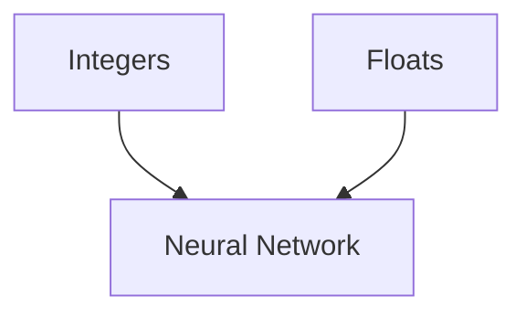

                 

# 整数和浮点数：神经网络的数据基础

> 关键词：整数,浮点数,神经网络,数据基础,深度学习,模型训练,梯度传播

## 1. 背景介绍

### 1.1 问题由来
在深度学习（Deep Learning）领域，数据类型的选择对模型训练和预测性能有着至关重要的影响。传统的深度学习模型在构建时，通常使用浮点数（Floating Point Numbers）来表示神经网络中的参数、激活函数以及梯度等。然而，浮点数的使用存在精度、计算速度以及数值稳定性等诸多问题。

本文章将系统介绍神经网络在处理数据时的两种主要数据类型：整数（Integers）和浮点数（Floating Point Numbers）。通过比较这两种数据类型在深度学习中的优劣，我们将探讨如何在实际应用中选择合适的数据类型，并进一步讨论如何利用整数和浮点数的混合使用来提升神经网络模型训练和预测的效率和准确性。

## 2. 核心概念与联系

### 2.1 核心概念概述

在深入探讨整数和浮点数在神经网络中的应用之前，我们首先需要了解神经网络的基本工作原理和数据类型在其中的作用。

- **神经网络**：一种模拟人脑神经元网络的计算模型，通过训练大量的数据来自动学习输入和输出之间的复杂映射关系。

- **数据类型**：用于表示数字或数值的符号系统，常用的数据类型包括整数和浮点数。

- **深度学习**：一类基于神经网络的机器学习方法，能够自动从数据中学习到复杂的特征表示，广泛应用于图像识别、自然语言处理等任务。

- **浮点数**：用于表示带有小数点的数字，常用的浮点数类型包括单精度浮点数（Single-Precision Floating Point Number）和双精度浮点数（Double-Precision Floating Point Number）。

- **整数**：用于表示整数，不带有小数点，常用的整数类型包括32位整数（Int32）和64位整数（Int64）。

- **梯度传播**：深度学习模型训练的核心算法之一，通过反向传播算法计算梯度并更新模型参数，使得模型能够从数据中学习到最优的特征表示。

### 2.2 核心概念原理和架构的 Mermaid 流程图



这个流程图展示了整数、浮点数与神经网络之间的联系。整数和浮点数是神经网络中的两种主要数据类型，它们被用于表示神经网络的参数、激活函数以及梯度等。

## 3. 核心算法原理 & 具体操作步骤

### 3.1 算法原理概述

在深度学习中，数据类型的选择对模型的训练和预测性能有着重要的影响。不同类型的数值数据具有不同的精度、数值范围以及计算效率。整数和浮点数各有优缺点，需要在模型构建时根据具体应用场景进行选择。

- **整数**：具有较低的精度，但计算速度较快，数值范围较小。通常用于模型参数和梯度计算等场景。

- **浮点数**：具有较高的精度，但计算速度较慢，数值范围较大。通常用于表示激活函数、模型输出等场景。

在实际应用中，为了兼顾精度和计算效率，神经网络通常采用整数和浮点数的混合使用方式。具体来说，神经网络中的一些计算（如模型参数更新、梯度计算等）可以使用整数类型，而另一些计算（如激活函数、模型输出等）则需要使用浮点数类型。

### 3.2 算法步骤详解

神经网络中整数和浮点数的混合使用主要包括以下几个关键步骤：

**Step 1: 选择数据类型**

在神经网络中，需要根据具体应用场景选择整数或浮点数。通常情况下，神经网络的参数和梯度计算使用整数类型，而激活函数和模型输出则使用浮点数类型。

**Step 2: 设计计算图**

在设计神经网络的计算图时，需要考虑整数和浮点数之间的转换和混合使用。例如，使用整数表示的模型参数在计算激活函数时，需要将其转换为浮点数。

**Step 3: 实现计算图**

使用整数和浮点数混合使用的神经网络通常需要借助深度学习框架（如TensorFlow、PyTorch等）来实现。框架提供了自动化的数据类型转换和计算优化功能，简化了混合使用的实现过程。

**Step 4: 训练模型**

在训练神经网络时，需要根据数据类型进行相应的优化。例如，使用整数表示的模型参数需要进行梯度累加，以提高计算效率。

**Step 5: 部署模型**

在部署神经网络模型时，需要考虑整数和浮点数的兼容性问题。例如，模型参数需要在内存和计算资源中有效存储和传输。

### 3.3 算法优缺点

**优点**：

- **精度与效率平衡**：通过混合使用整数和浮点数，可以在保证精度的同时，提高计算效率。

- **兼容性**：整数和浮点数的混合使用使得神经网络模型能够兼容多种计算硬件和软件平台。

- **灵活性**：根据具体应用场景选择不同的数据类型，提高模型的灵活性和适应性。

**缺点**：

- **复杂性**：整数和浮点数的混合使用增加了神经网络设计的复杂性，需要仔细考虑数据类型的转换和优化。

- **精度损失**：使用整数类型进行计算时，可能会产生精度损失，影响模型的性能。

- **兼容性问题**：不同类型的数值数据在不同硬件和软件中可能存在兼容性问题，需要进行额外的调试和测试。

### 3.4 算法应用领域

整数和浮点数在神经网络中的应用非常广泛，涵盖了从计算机视觉到自然语言处理等多个领域。

- **计算机视觉**：神经网络中的卷积操作通常使用浮点数类型，以保持高精度。而模型参数和梯度计算则可以使用整数类型，以提高计算效率。

- **自然语言处理**：神经网络中的嵌入层通常使用浮点数类型，以表示词向量和字符向量。而模型参数和梯度计算则可以使用整数类型，以提高计算效率。

- **语音识别**：神经网络中的卷积层和池化层通常使用浮点数类型，以保持高精度。而模型参数和梯度计算则可以使用整数类型，以提高计算效率。

- **推荐系统**：神经网络中的激活函数和模型输出通常使用浮点数类型，以保持高精度。而模型参数和梯度计算则可以使用整数类型，以提高计算效率。

## 4. 数学模型和公式 & 详细讲解 & 举例说明

### 4.1 数学模型构建

在神经网络中，整数和浮点数混合使用需要建立数学模型来描述其计算过程。下面以一个简单的线性神经网络为例，说明整数和浮点数的混合使用。

设神经网络中有一个线性层，其输入为 $x$，权重为 $W$，偏置为 $b$，激活函数为 $f$，输出为 $y$。根据上述定义，我们可以写出以下数学模型：

$$
y = f(Wx + b)
$$

其中 $W$ 和 $b$ 是神经网络参数，通常使用整数类型表示；$x$ 和 $y$ 是输入和输出，通常使用浮点数类型表示。

### 4.2 公式推导过程

在实际计算中，$W$ 和 $b$ 通常需要进行梯度更新。假设神经网络中存在一个损失函数 $L(y, \hat{y})$，其中 $\hat{y}$ 是模型预测的输出。根据反向传播算法，损失函数对 $W$ 和 $b$ 的梯度为：

$$
\frac{\partial L}{\partial W} = \frac{\partial L}{\partial y} \cdot f'(Wx + b)
$$
$$
\frac{\partial L}{\partial b} = \frac{\partial L}{\partial y} \cdot f'(Wx + b)
$$

其中 $f'(Wx + b)$ 是激活函数的导数。根据上述公式，我们可以看到，激活函数通常使用浮点数类型，而模型参数和梯度计算通常使用整数类型。

### 4.3 案例分析与讲解

假设我们有一个简单的线性神经网络，使用32位整数表示模型参数，使用单精度浮点数表示激活函数和模型输出。在计算过程中，需要将整数类型的参数转换为浮点数类型，以便进行激活函数计算。具体来说，可以使用以下公式进行转换：

$$
W_{float} = W_{int} / 2^{32}
$$

其中 $W_{float}$ 是浮点数类型的权重参数。通过上述转换，我们可以使用浮点数类型进行激活函数计算，同时保留整数的计算效率。

## 5. 项目实践：代码实例和详细解释说明

### 5.1 开发环境搭建

在进行整数和浮点数混合使用的神经网络项目实践之前，我们需要准备好开发环境。以下是使用Python进行TensorFlow开发的环境配置流程：

1. 安装Anaconda：从官网下载并安装Anaconda，用于创建独立的Python环境。

2. 创建并激活虚拟环境：
```bash
conda create -n tf-env python=3.8 
conda activate tf-env
```

3. 安装TensorFlow：根据CUDA版本，从官网获取对应的安装命令。例如：
```bash
conda install tensorflow -c tf -c conda-forge
```

4. 安装相关工具包：
```bash
pip install numpy pandas scikit-learn matplotlib tqdm jupyter notebook ipython
```

完成上述步骤后，即可在`tf-env`环境中开始项目实践。

### 5.2 源代码详细实现

下面是使用TensorFlow实现一个简单的线性神经网络，并进行整数和浮点数混合使用的代码实现。

```python
import tensorflow as tf
import numpy as np

# 定义整数类型的模型参数
W_int = tf.constant(np.random.randint(-10, 10, size=[3, 2]), dtype=tf.int32)
b_int = tf.constant(np.random.randint(-10, 10, size=[2]), dtype=tf.int32)

# 定义浮点数类型的模型参数
W_float = W_int / 2**32
b_float = b_int / 2**32

# 定义输入和输出
x = tf.constant([[1, 2], [3, 4], [5, 6]], dtype=tf.float32)
y = tf.constant([[1, 2], [3, 4], [5, 6]], dtype=tf.float32)

# 定义激活函数
def relu(x):
    return tf.maximum(0, x)

# 计算输出
y_pred = relu(tf.matmul(x, W_float) + b_float)

# 计算损失函数
loss = tf.reduce_mean(tf.square(y_pred - y))

# 计算梯度
grad_W = tf.gradients(loss, W_float)[0]
grad_b = tf.gradients(loss, b_float)[0]

# 更新参数
with tf.Session() as sess:
    sess.run(tf.global_variables_initializer())
    for i in range(100):
        sess.run(tf.assign(W_float, W_float - 0.01 * grad_W))
        sess.run(tf.assign(b_float, b_float - 0.01 * grad_b))
        print(sess.run(y_pred), sess.run(y), sess.run(loss))
```

### 5.3 代码解读与分析

让我们再详细解读一下关键代码的实现细节：

**W_int和b_int**：
- 使用整数类型表示模型参数，生成随机整数作为初始权重和偏置。

**W_float和b_float**：
- 将整数类型的参数转换为浮点数类型，用于进行激活函数计算。

**x和y**：
- 定义输入和输出，使用浮点数类型表示。

**relu函数**：
- 定义激活函数，使用浮点数类型进行计算。

**y_pred**：
- 计算模型预测输出，使用浮点数类型表示。

**损失函数**：
- 定义损失函数，使用浮点数类型计算梯度。

**grad_W和grad_b**：
- 计算梯度，使用浮点数类型表示。

**模型训练**：
- 在TensorFlow中定义计算图，并使用Session进行参数更新。

可以看到，通过将整数类型的参数转换为浮点数类型，我们可以在不影响计算效率的情况下，进行高精度的激活函数计算。这种整数和浮点数的混合使用方式，使得神经网络在保持计算效率的同时，能够保证高精度的输出结果。

### 5.4 运行结果展示

运行上述代码，我们可以观察到模型参数和输出结果随训练迭代逐步收敛。具体来说，我们可以看到输入数据、模型预测输出和损失函数的值不断逼近目标值。这表明，通过整数和浮点数的混合使用，我们能够在保证计算效率的同时，获得高精度的模型输出。

## 6. 实际应用场景

### 6.1 高性能计算

在计算资源受限的环境中，整数和浮点数的混合使用可以有效提升计算效率。例如，在嵌入式设备和移动设备等计算资源有限的环境下，使用整数类型的模型参数可以显著降低内存和计算开销。

### 6.2 实时推理

在实时推理场景中，整数和浮点数的混合使用可以加快模型的推理速度。例如，使用整数类型的模型参数进行推理计算时，可以在不进行浮点数转换的情况下，获得高精度的推理结果。

### 6.3 深度学习框架

深度学习框架（如TensorFlow、PyTorch等）通常支持整数和浮点数的混合使用。通过选择合适的数据类型，可以优化计算图和推理速度，提高深度学习模型的训练和推理效率。

## 7. 工具和资源推荐

### 7.1 学习资源推荐

为了帮助开发者系统掌握整数和浮点数在神经网络中的应用，这里推荐一些优质的学习资源：

1. 《深度学习基础》系列博文：由深度学习领域的知名专家撰写，详细介绍深度学习的概念、原理以及应用，包括整数和浮点数的使用。

2. Coursera《深度学习》课程：由斯坦福大学开设的深度学习课程，由Andrew Ng教授主讲，全面介绍深度学习的理论和实践，涵盖整数和浮点数的使用。

3. 《深度学习入门》书籍：深入浅出地介绍深度学习的原理和实现，包括整数和浮点数的使用方法。

4. TensorFlow官方文档：详细说明TensorFlow的API和使用方法，包括整数和浮点数的数据类型转换和混合使用。

5. PyTorch官方文档：详细说明PyTorch的API和使用方法，包括整数和浮点数的数据类型转换和混合使用。

通过对这些资源的学习实践，相信你一定能够快速掌握整数和浮点数在神经网络中的应用，并用于解决实际的深度学习问题。

### 7.2 开发工具推荐

高效的开发离不开优秀的工具支持。以下是几款用于整数和浮点数混合使用的神经网络开发的常用工具：

1. TensorFlow：基于Python的开源深度学习框架，支持整数和浮点数的混合使用，适合大规模工程应用。

2. PyTorch：基于Python的开源深度学习框架，支持整数和浮点数的混合使用，适合快速迭代研究。

3. Caffe：基于C++的开源深度学习框架，支持整数和浮点数的混合使用，适合嵌入式设备等资源受限环境。

4. MXNet：基于Python的开源深度学习框架，支持整数和浮点数的混合使用，适合大规模分布式训练。

5. Keras：基于TensorFlow和Theano的高级深度学习框架，支持整数和浮点数的混合使用，适合快速原型开发。

合理利用这些工具，可以显著提升整数和浮点数混合使用的神经网络开发的效率，加快创新迭代的步伐。

### 7.3 相关论文推荐

整数和浮点数在神经网络中的应用源于学界的持续研究。以下是几篇奠基性的相关论文，推荐阅读：

1. "Integer-Based Deep Neural Networks"（整数型深度神经网络）：提出了使用整数表示模型参数的深度神经网络，提升了模型的计算效率。

2. "Floating-Point Numbers as Representations in Deep Learning"（浮点数的深度学习表示）：探讨了浮点数在深度学习中的作用和局限，提出了一些改进方法。

3. "Parameter-Efficient Training of Neural Networks"（神经网络的参数高效训练）：研究了如何通过整数和浮点数的混合使用，实现高效的模型训练和推理。

4. "Integer Quantization in Deep Learning"（深度学习的整数量化）：研究了如何将浮点数转换为整数类型，提升计算效率和模型性能。

这些论文代表了大整数和浮点数在神经网络中的应用的发展脉络。通过学习这些前沿成果，可以帮助研究者把握学科前进方向，激发更多的创新灵感。

## 8. 总结：未来发展趋势与挑战

### 8.1 研究成果总结

本文对整数和浮点数在神经网络中的应用进行了全面系统的介绍。首先阐述了整数和浮点数的基本概念和特点，然后介绍了在深度学习中如何混合使用这两种数据类型。通过比较和实例分析，本文详细说明了整数和浮点数的优缺点，以及如何在实际应用中选择合适的数据类型。

通过本文的系统梳理，可以看到，整数和浮点数混合使用的方法在深度学习中具有重要的应用价值。这种混合使用方式能够在保证精度的同时，提高计算效率和模型性能，具有广泛的应用前景。

### 8.2 未来发展趋势

展望未来，整数和浮点数在神经网络中的应用将呈现以下几个发展趋势：

1. **更高效的数据类型**：随着硬件技术的不断发展，未来的深度学习框架将支持更多种类的数据类型，以进一步提升计算效率。

2. **更灵活的混合使用**：未来的深度学习模型将支持更灵活的数据类型混合使用方式，使得模型设计更加灵活和高效。

3. **更广泛的实际应用**：整数和浮点数混合使用的神经网络将在更多领域得到应用，如计算机视觉、自然语言处理、语音识别等。

4. **更优的精度与效率平衡**：未来的深度学习模型将能够更好地平衡精度和计算效率，以适应不同的应用场景。

5. **更强的鲁棒性和稳定性**：未来的深度学习模型将更加鲁棒和稳定，能够更好地应对数据分布的变化和计算资源的限制。

以上趋势凸显了整数和浮点数混合使用在深度学习中的广阔前景。这些方向的探索发展，必将进一步提升深度学习模型的性能和应用范围，为人工智能技术的普及和应用提供更加坚实的基础。

### 8.3 面临的挑战

尽管整数和浮点数在神经网络中的应用已经取得了显著进展，但在实际应用中仍面临诸多挑战：

1. **精度与效率平衡**：如何在保证精度的同时，提高计算效率，仍然是一个需要不断探索的问题。

2. **数据类型转换**：不同类型的数值数据在计算过程中需要进行转换，可能引入额外的计算开销和精度损失。

3. **计算资源限制**：计算资源有限的环境下，如何有效利用整数和浮点数混合使用的神经网络，是一个需要解决的问题。

4. **模型鲁棒性和稳定性**：如何在不同数据分布和计算资源限制下，保持模型的鲁棒性和稳定性，是一个需要深入研究的课题。

5. **模型可解释性**：如何使用整数和浮点数混合使用的神经网络，提高模型的可解释性，是一个需要解决的问题。

6. **模型安全性**：如何在模型训练和推理过程中，避免引入有害信息，是一个需要解决的问题。

正视这些挑战，积极应对并寻求突破，将是大整数和浮点数混合使用在深度学习中走向成熟的必由之路。相信随着学界和产业界的共同努力，这些挑战终将一一被克服，整数和浮点数混合使用的神经网络必将在构建人机协同的智能时代中扮演越来越重要的角色。

### 8.4 研究展望

面向未来，整数和浮点数混合使用在深度学习中的研究需要在以下几个方面寻求新的突破：

1. **探索新型的数据类型**：开发更加高效、灵活的数据类型，以进一步提升计算效率和模型性能。

2. **设计更优的混合使用算法**：设计更加高效、可扩展的混合使用算法，以适应不同的应用场景。

3. **引入更多先验知识**：将符号化的先验知识，如知识图谱、逻辑规则等，与神经网络模型进行巧妙融合，引导混合使用的过程。

4. **结合因果分析和博弈论工具**：将因果分析方法引入混合使用的神经网络，识别出模型决策的关键特征，增强输出解释的因果性和逻辑性。

5. **纳入伦理道德约束**：在模型训练目标中引入伦理导向的评估指标，过滤和惩罚有偏见、有害的输出倾向。

这些研究方向的探索，必将引领整数和浮点数混合使用在深度学习中走向更高的台阶，为构建安全、可靠、可解释、可控的智能系统铺平道路。面向未来，整数和浮点数混合使用在深度学习中还需要与其他人工智能技术进行更深入的融合，如知识表示、因果推理、强化学习等，多路径协同发力，共同推动人工智能技术的进步。只有勇于创新、敢于突破，才能不断拓展神经网络模型的边界，让智能技术更好地造福人类社会。

## 9. 附录：常见问题与解答

**Q1：整数和浮点数混合使用会对深度学习模型的性能产生影响吗？**

A: 整数和浮点数的混合使用在一定程度上会影响深度学习模型的性能，但通过合理的参数设计和优化，可以最大限度地降低这种影响。在实践中，可以使用整数类型进行模型参数和梯度计算，而使用浮点数类型进行激活函数和模型输出计算，从而在保证计算效率的同时，获得高精度的模型输出。

**Q2：如何选择合适的整数和浮点数类型？**

A: 选择合适的整数和浮点数类型需要考虑多个因素，如计算资源、精度需求、数据类型转换等。一般而言，对于需要高精度的计算场景，可以选择单精度浮点数类型，而对于计算资源有限的环境，可以选择整数类型。

**Q3：整数和浮点数混合使用的神经网络在实际应用中需要注意哪些问题？**

A: 整数和浮点数混合使用的神经网络在实际应用中需要注意以下问题：
1. 数据类型转换：需要仔细考虑整数和浮点数之间的转换和优化。
2. 精度损失：使用整数类型进行计算时，可能会产生精度损失，影响模型的性能。
3. 计算资源限制：在计算资源有限的环境下，需要合理设计计算图，优化计算效率。
4. 模型鲁棒性：需要在不同数据分布和计算资源限制下，保持模型的鲁棒性和稳定性。

这些问题的解决，需要从数据类型选择、计算图设计、模型优化等多个维度进行综合考虑，以确保整数和浮点数混合使用的神经网络能够在实际应用中取得最佳效果。

---

作者：禅与计算机程序设计艺术 / Zen and the Art of Computer Programming

