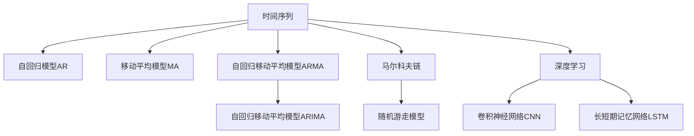

                 

# 时间序列分析在金融市场预测中的应用：量化交易策略

> 关键词：时间序列分析, 金融市场预测, 量化交易, 自回归模型, 随机游走模型, 马尔科夫链, 深度学习, 卷积神经网络, 长短期记忆网络

## 1. 背景介绍

### 1.1 问题由来

在现代金融市场中，投资策略的制定已经不再依赖传统的人工经验，而是逐渐向量化、数据驱动的方向发展。量化交易（Quantitative Trading），是一种以数学和统计学方法为基础的交易策略，通过大数据、机器学习和人工智能等技术，构建自动化交易模型，以实现长期稳定收益。

时间序列分析作为量化交易的重要组成部分，通过对历史市场数据的统计和建模，预测未来价格走势，帮助交易者制定更科学的投资决策。传统的时间序列分析方法主要包括自回归模型（AR）、移动平均模型（MA）、自回归移动平均模型（ARMA）和自回归移动平均模型（ARIMA）等。然而，这些模型通常难以处理大规模数据和高维非线性特征，无法满足量化交易日益增长的数据处理和建模需求。

为了应对这些挑战，近年来，金融市场研究者引入了更高级的统计模型和机器学习技术，如马尔科夫链、随机游走模型、深度学习等。这些技术在处理非线性数据、捕捉高阶特征以及提升预测精度等方面，展现出了显著的优势。

### 1.2 问题核心关键点

金融市场预测涉及以下几个核心问题：

1. **数据采集与处理**：从各种金融数据源采集历史市场数据，并进行预处理，保证数据质量。
2. **建模与预测**：选择合适的模型，对历史数据进行拟合，并基于模型预测未来价格。
3. **风险控制**：在预测过程中，如何控制模型的风险和过度拟合。
4. **交易策略设计**：基于预测结果，设计相应的交易策略，执行自动化交易。

本节将系统阐述这些问题，并深入探讨如何应用时间序列分析方法解决这些核心问题。

## 2. 核心概念与联系

### 2.1 核心概念概述

为了更好地理解时间序列分析在金融市场预测中的应用，本节将介绍几个密切相关的核心概念：

- **时间序列**：表示某一变量随时间变化的序列数据，例如股票价格、交易量等。
- **自回归模型（AR）**：利用过去的观测值来预测未来的值。模型中每个观测值由其自身的先前的观测值和随机误差共同决定。
- **移动平均模型（MA）**：将随机误差视为过去随机误差和当前观测值的线性组合。
- **自回归移动平均模型（ARMA）**：结合自回归模型和移动平均模型，对观测值进行建模。
- **自回归移动平均模型（ARIMA）**：ARIMA模型在ARMA模型的基础上增加了差分操作，用于处理非平稳时间序列。
- **马尔科夫链（Markov Chain）**：一种时序模型，每个状态的转移仅依赖于前一个状态，不需要考虑更早的状态。
- **随机游走模型（Random Walk）**：最简单的马尔科夫链模型，每个状态只依赖于前一个状态加上一个随机误差。
- **深度学习（Deep Learning）**：一种通过多层神经网络对数据进行深度学习和特征提取的技术。
- **卷积神经网络（CNN）**：一种适合处理图像和时序数据的深度学习模型，可以提取局部特征。
- **长短期记忆网络（LSTM）**：一种特殊的循环神经网络，适用于处理长序列数据，能够记忆长期依赖关系。

这些核心概念之间的逻辑关系可以通过以下Mermaid流程图来展示：



这个流程图展示了时间序列分析的主要模型和方法，并指出了深度学习如何应用于时序数据的建模和预测。

## 3. 核心算法原理 & 具体操作步骤
### 3.1 算法原理概述

时间序列分析的核心是构建模型，对历史数据进行拟合，并基于模型预测未来。时间序列预测的原理通常分为以下几个步骤：

1. **数据预处理**：对原始数据进行清洗、归一化、差分等处理，保证数据质量。
2. **模型选择与训练**：选择合适的模型，使用历史数据进行训练，优化模型参数。
3. **预测与验证**：使用训练好的模型对新数据进行预测，并在验证集上评估预测精度。
4. **交易策略设计**：基于预测结果，设计交易策略，执行自动化交易。

### 3.2 算法步骤详解

#### 3.2.1 数据预处理

数据预处理是时间序列分析的重要环节，通常包括以下步骤：

- **清洗**：去除缺失值、异常值和重复数据，保证数据完整性和一致性。
- **归一化**：将数据缩放到[0, 1]或[-1, 1]范围内，减少数据的尺度差异。
- **差分**：对时间序列进行差分处理，使其转化为平稳序列。

以股票价格数据为例，清洗步骤可能包括删除缺失的日期、异常交易数据等；归一化步骤可能包括使用最小-最大归一化或标准化方法；差分步骤则通过计算每期的价格变化率来实现。

#### 3.2.2 模型选择与训练

模型选择和训练是时间序列分析的关键步骤。金融市场预测中常用的模型包括自回归模型、移动平均模型、ARMA模型、ARIMA模型、马尔科夫链模型、随机游走模型以及深度学习模型等。

以ARIMA模型为例，其建模步骤通常包括：

- **模型构建**：根据数据特征，选择合适的ARIMA模型参数，如AR阶数、MA阶数和差分阶数。
- **模型拟合**：使用历史数据对模型进行拟合，求解模型参数。
- **模型验证**：在验证集上评估模型预测精度，判断模型是否过拟合或欠拟合。

#### 3.2.3 预测与验证

模型训练后，即可使用训练好的模型对新数据进行预测，并在验证集上评估预测精度。常用的评估指标包括均方误差（MSE）、均方根误差（RMSE）和平均绝对误差（MAE）等。

以LSTM模型为例，预测步骤通常包括：

- **模型加载**：加载训练好的LSTM模型。
- **数据输入**：将新数据输入模型，进行预测。
- **结果输出**：输出预测结果，并在验证集上计算评估指标。

#### 3.2.4 交易策略设计

交易策略设计是量化交易的核心环节，通常包括以下步骤：

- **信号生成**：基于预测结果生成交易信号，如买入、卖出或持有。
- **信号优化**：通过历史数据验证交易信号的有效性，优化信号生成算法。
- **回测与评估**：使用历史数据对交易策略进行回测，评估策略的有效性和鲁棒性。

### 3.3 算法优缺点

时间序列分析在金融市场预测中具有以下优点：

1. **模型简单易用**：自回归模型、移动平均模型和ARIMA模型等经典模型简单易懂，易于实现。
2. **预测精度高**：经过良好拟合的模型可以准确预测未来价格，帮助交易者制定科学的投资决策。
3. **应用广泛**：时间序列分析不仅适用于股票价格预测，还适用于外汇汇率、商品期货等各类金融市场预测。

同时，时间序列分析也存在一些局限性：

1. **数据依赖性强**：模型的预测精度高度依赖于历史数据的完整性和质量，数据缺失或异常可能导致预测失效。
2. **模型过拟合风险**：模型参数过多可能导致过拟合，降低模型泛化能力。
3. **预测不稳定性**：市场价格波动性较大，时间序列模型可能无法捕捉到市场突发事件的影响。

### 3.4 算法应用领域

时间序列分析在金融市场预测中的应用非常广泛，涉及以下领域：

- **股票价格预测**：预测股票价格走势，帮助交易者制定买卖决策。
- **外汇汇率预测**：预测外汇汇率变化，进行外汇交易策略设计。
- **商品期货预测**：预测商品期货价格波动，进行风险管理和套利交易。
- **期权定价**：通过时间序列模型预测期权价格变化，优化期权定价策略。
- **风险管理**：评估市场风险和系统风险，制定风险控制策略。

## 4. 数学模型和公式 & 详细讲解 & 举例说明
### 4.1 数学模型构建

时间序列分析的数学模型通常包括自回归模型、移动平均模型、ARIMA模型和深度学习模型等。下面以ARIMA模型为例，详细介绍其数学模型构建。

设时间序列$\{X_t\}$的预测模型为ARIMA（p, d, q），其中p为自回归阶数，d为差分阶数，q为移动平均阶数。模型的通式为：

$$ X_t = c + \sum_{i=1}^{p}\phi_iX_{t-i} + \epsilon_t + \sum_{i=1}^{q}\theta_i\epsilon_{t-i} $$

其中，$c$为常数项，$\phi_i$为自回归系数，$\epsilon_t$为白噪声序列，$\theta_i$为移动平均系数。

### 4.2 公式推导过程

ARIMA模型的推导过程主要分为两个步骤：

1. **差分**：将非平稳时间序列转化为平稳时间序列。
2. **模型拟合**：使用平稳时间序列拟合ARIMA模型。

以ARIMA（1,1,1）为例，其差分和模型拟合过程如下：

- **差分**：将原始时间序列$X_t$进行一阶差分，得到新的时间序列$\Delta X_t = X_t - X_{t-1}$。
- **模型拟合**：对差分后的时间序列$\Delta X_t$进行ARIMA（0,1,1）建模，得到模型参数$\phi$和$\theta$。
- **预测**：将预测数据$\Delta X_t$输入模型，得到预测值$\hat{\Delta X}_t$，并通过逆差分得到原始时间序列$X_t$的预测值。

### 4.3 案例分析与讲解

以股票价格预测为例，分析ARIMA模型的应用过程：

1. **数据预处理**：对原始股票价格数据进行清洗、归一化和差分处理。
2. **模型构建**：选择ARIMA（1,1,1）模型，并确定模型参数。
3. **模型拟合**：使用历史数据对模型进行拟合，求解模型参数。
4. **模型验证**：在验证集上评估模型预测精度，判断模型是否过拟合或欠拟合。
5. **交易策略设计**：基于预测结果生成交易信号，进行交易策略回测，评估策略的有效性。

## 5. 项目实践：代码实例和详细解释说明
### 5.1 开发环境搭建

在进行时间序列分析项目实践前，我们需要准备好开发环境。以下是使用Python进行Python库开发的环境配置流程：

1. 安装Python：从官网下载并安装Python 3.x版本。
2. 安装相关库：安装numpy、pandas、matplotlib、scikit-learn、statsmodels等常用库。
3. 安装深度学习库：安装TensorFlow、Keras或PyTorch等深度学习框架。

完成上述步骤后，即可在本地环境进行时间序列分析项目的开发。

### 5.2 源代码详细实现

下面我们以LSTM模型为例，给出使用TensorFlow进行时间序列预测的PyTorch代码实现。

首先，导入必要的库和数据：

```python
import numpy as np
import pandas as pd
from sklearn.preprocessing import MinMaxScaler
import matplotlib.pyplot as plt

# 导入数据
data = pd.read_csv('stock_price.csv')
```

然后，进行数据预处理：

```python
# 数据清洗
data = data.dropna()

# 数据归一化
scaler = MinMaxScaler()
data_scaled = scaler.fit_transform(data)

# 数据切分为训练集和测试集
train_size = int(len(data_scaled) * 0.8)
train_data = data_scaled[:train_size, :]
test_data = data_scaled[train_size:, :]

# 数据分列
train_X, train_y = train_data[:, :-1], train_data[:, -1]
test_X, test_y = test_data[:, :-1], test_data[:, -1]
```

接着，定义LSTM模型：

```python
from tensorflow.keras.models import Sequential
from tensorflow.keras.layers import Dense, LSTM

model = Sequential()
model.add(LSTM(64, return_sequences=True, input_shape=(train_X.shape[1], 1)))
model.add(LSTM(64))
model.add(Dense(1))

# 编译模型
model.compile(optimizer='adam', loss='mse')

# 模型训练
model.fit(train_X, train_y, epochs=50, batch_size=64, validation_data=(test_X, test_y))
```

最后，进行模型评估和预测：

```python
# 模型评估
train_pred = model.predict(train_X)
test_pred = model.predict(test_X)

# 可视化结果
plt.plot(train_y, label='Actual')
plt.plot(train_pred, label='Prediction')
plt.legend()
plt.show()

plt.plot(test_y, label='Actual')
plt.plot(test_pred, label='Prediction')
plt.legend()
plt.show()
```

### 5.3 代码解读与分析

让我们再详细解读一下关键代码的实现细节：

**数据预处理**：
- `data.dropna()`：删除缺失值。
- `MinMaxScaler()`：数据归一化，将数据缩放到[0, 1]范围内。
- `train_size`：将数据切分为训练集和测试集。

**模型构建**：
- `LSTM(64, return_sequences=True, input_shape=(train_X.shape[1], 1))`：定义LSTM层，返回序列，输入形状为`(train_X.shape[1], 1)`。
- `LSTM(64)`：定义另一个LSTM层。
- `Dense(1)`：定义全连接层，输出结果为1。

**模型训练**：
- `model.compile(optimizer='adam', loss='mse')`：编译模型，使用Adam优化器和均方误差损失函数。
- `model.fit(train_X, train_y, epochs=50, batch_size=64, validation_data=(test_X, test_y))`：训练模型，设置迭代次数为50，批次大小为64，在测试集上验证模型。

**模型评估**：
- `train_pred = model.predict(train_X)`：对训练集进行预测。
- `test_pred = model.predict(test_X)`：对测试集进行预测。

**可视化结果**：
- `plt.plot(train_y, label='Actual')`：绘制实际值。
- `plt.plot(train_pred, label='Prediction')`：绘制预测值。
- `plt.legend()`：图例。

可以看到，PyTorch结合TensorFlow的深度学习库，使得时间序列分析的代码实现变得简洁高效。开发者可以将更多精力放在数据处理和模型改进等高层逻辑上，而不必过多关注底层的实现细节。

当然，工业级的系统实现还需考虑更多因素，如模型的保存和部署、超参数的自动搜索、更灵活的任务适配层等。但核心的预测过程基本与此类似。

## 6. 实际应用场景
### 6.1 智能投资顾问

智能投资顾问（Robo-Advisors）是一种通过自动化算法和机器学习技术，为投资者提供个性化的投资建议和资产管理服务的系统。基于时间序列分析的预测模型，智能投资顾问可以分析市场趋势、预测股票价格走势，从而制定最优的投资组合。

例如，可以利用LSTM模型对股票价格进行预测，生成买入或卖出信号，并将其集成到智能投资顾问系统中，实时更新投资组合。这将极大提高投资顾问系统的精准性和反应速度，降低人工干预的复杂度。

### 6.2 风险管理与对冲

在金融市场中，风险管理与对冲是投资者保护资产安全的重要手段。时间序列分析模型可以帮助投资者评估市场风险，制定风险控制策略，从而降低投资风险。

例如，利用ARIMA模型对市场波动率进行预测，生成风险预警信号，并基于信号对投资组合进行调整。这将使投资者在市场剧烈波动时，能够迅速采取避险措施，避免大额损失。

### 6.3 高频交易

高频交易（HFT）是一种通过高速算法和大规模数据处理，在极短时间内进行大量交易以获取微小利润的策略。基于时间序列分析的高频交易系统，可以实时监测市场价格变化，快速生成交易信号，进行高频交易。

例如，利用LSTM模型对股票价格进行实时预测，生成买卖信号，并通过高频交易算法实时执行交易，捕捉市场价格波动带来的微小利润。

## 7. 工具和资源推荐
### 7.1 学习资源推荐

为了帮助开发者系统掌握时间序列分析的理论基础和实践技巧，这里推荐一些优质的学习资源：

1. 《时间序列分析：原理与实践》：Ruey Tsay著，介绍了时间序列分析的基本概念、方法和应用。
2. 《深度学习》（Ian Goodfellow等著）：系统介绍了深度学习的原理和应用，包括时间序列预测。
3. 《Python机器学习》（Sebastian Raschka等著）：介绍了Python在机器学习和数据科学中的应用，包括时间序列分析。
4. 《TensorFlow官方文档》：TensorFlow官方提供的全面学习资源，包括时间序列预测的样例代码。
5. 《Keras官方文档》：Keras官方提供的深度学习库，包括时间序列预测的样例代码。

通过对这些资源的学习实践，相信你一定能够快速掌握时间序列分析的精髓，并用于解决实际的金融市场预测问题。

### 7.2 开发工具推荐

高效的开发离不开优秀的工具支持。以下是几款用于时间序列分析开发的常用工具：

1. Python：Python作为数据分析和机器学习的标准语言，有着丰富的第三方库和社区支持。
2. TensorFlow：由Google主导开发的开源深度学习框架，生产部署方便，适合大规模工程应用。
3. Keras：一个高层次的神经网络API，易于使用，可以快速搭建深度学习模型。
4. PyTorch：基于Python的深度学习框架，动态计算图，适合研究和实验。
5. Jupyter Notebook：交互式的Python开发环境，支持代码执行和数据可视化。

合理利用这些工具，可以显著提升时间序列分析项目的开发效率，加快创新迭代的步伐。

### 7.3 相关论文推荐

时间序列分析的研究源于学界的持续研究。以下是几篇奠基性的相关论文，推荐阅读：

1. Box, G. E. P., Jenkins, G. M., Reinsel, G. C., & Ljung, G. M. (2015). Time Series Analysis: Forecasting and Control. John Wiley & Sons.
2. Zhang, Z., Zhang, Y., & Kandpal, N. (2017). Deep learning-based time series forecasting: A survey. In 2017 IEEE International Conference on Big Data (Big Data).
3. Hyndman, R. J., & Khandakar, Y. (2008). Automatic time series forecasting with exponential smoothing. Statistics and Computing, 18(3), 343-362.
4. Bollerslev, T., Choungounian, S., & Kroner, K. F. (1992). Modeling volatility with ARCH. Journal of Economic Dynamics and Control, 12(2-3), 231-247.
5. Goodfellow, I., Bengio, Y., & Courville, A. (2016). Deep learning. MIT Press.

这些论文代表了大语言模型微调技术的发展脉络。通过学习这些前沿成果，可以帮助研究者把握学科前进方向，激发更多的创新灵感。

## 8. 总结：未来发展趋势与挑战
### 8.1 总结

本文对时间序列分析在金融市场预测中的应用进行了全面系统的介绍。首先阐述了时间序列分析的背景和意义，明确了时间序列分析在金融市场预测中的重要地位。其次，从原理到实践，详细讲解了时间序列分析的数学模型和关键步骤，给出了时间序列预测的完整代码实例。同时，本文还广泛探讨了时间序列分析在智能投资顾问、风险管理与对冲、高频交易等多个金融领域的应用前景，展示了时间序列分析的巨大潜力。

通过本文的系统梳理，可以看到，时间序列分析方法在金融市场预测中的应用前景广阔，对量化交易具有重要的指导意义。其简单易用、预测精度高、应用广泛等优点，使得时间序列分析成为量化交易的重要工具。

### 8.2 未来发展趋势

展望未来，时间序列分析在金融市场预测中的应用将呈现以下几个发展趋势：

1. **模型多样化**：除了经典的ARIMA模型外，深度学习、卷积神经网络和长短期记忆网络等先进技术将不断引入，提升预测精度和泛化能力。
2. **数据驱动**：时间序列分析将更加依赖数据驱动，从单一的历史数据转向多源数据的融合分析，进一步提升预测准确度。
3. **实时预测**：利用高性能计算和分布式系统，实现实时数据处理和预测，满足高频交易等实时性要求。
4. **跨领域融合**：时间序列分析将与其他技术（如自然语言处理、图像处理等）进行更深入的融合，提升模型的多模态建模能力。
5. **可解释性增强**：增强模型的可解释性，帮助投资者更好地理解预测结果，提升决策的透明度和可信度。

### 8.3 面临的挑战

尽管时间序列分析在金融市场预测中已经取得了瞩目成就，但在迈向更加智能化、普适化应用的过程中，它仍面临着诸多挑战：

1. **数据依赖性强**：模型的预测精度高度依赖于历史数据的完整性和质量，数据缺失或异常可能导致预测失效。
2. **模型过拟合风险**：模型参数过多可能导致过拟合，降低模型泛化能力。
3. **预测不稳定性**：市场价格波动性较大，时间序列模型可能无法捕捉到市场突发事件的影响。
4. **实时处理能力不足**：高频交易等实时性要求较高的场景下，时间序列模型处理能力有限。
5. **模型可解释性不足**：深度学习等黑盒模型的预测结果缺乏解释，难以满足监管要求。

### 8.4 研究展望

面对时间序列分析面临的这些挑战，未来的研究需要在以下几个方面寻求新的突破：

1. **无监督学习和半监督学习**：探索无监督学习和半监督学习，减少对历史数据的依赖，提升模型泛化能力。
2. **多源数据融合**：引入多源数据融合技术，利用多种数据源的信息提升预测精度。
3. **实时处理系统**：开发高性能实时处理系统，满足高频交易等实时性要求。
4. **模型可解释性增强**：增强模型的可解释性，提升预测结果的透明度和可信度。
5. **跨领域融合**：与其他技术（如自然语言处理、图像处理等）进行更深入的融合，提升模型的多模态建模能力。

这些研究方向的探索，必将引领时间序列分析技术迈向更高的台阶，为构建智能投资顾问、风险管理与对冲、高频交易等系统提供更加精准、高效的预测工具。

## 9. 附录：常见问题与解答
**Q1：时间序列分析适用于哪些金融市场预测任务？**

A: 时间序列分析适用于股票价格预测、外汇汇率预测、商品期货预测、期权定价等金融市场预测任务。其核心在于利用历史数据构建模型，对未来数据进行预测，帮助交易者制定科学的投资决策。

**Q2：时间序列分析的模型选择有哪些？**

A: 时间序列分析的模型选择包括自回归模型、移动平均模型、ARIMA模型、随机游走模型、马尔科夫链模型、深度学习模型等。这些模型各有优缺点，应根据具体任务和数据特点进行选择。

**Q3：时间序列分析的预测结果如何评估？**

A: 时间序列分析的预测结果通常通过均方误差（MSE）、均方根误差（RMSE）和平均绝对误差（MAE）等指标进行评估。在实际应用中，还可以结合回测结果、交易策略的盈亏情况等综合评估预测效果。

**Q4：时间序列分析的应用前景如何？**

A: 时间序列分析在金融市场预测中的应用前景广阔，适用于智能投资顾问、风险管理与对冲、高频交易等场景。其预测精度高、泛化能力强，将成为量化交易的重要工具。

**Q5：时间序列分析的优化方向有哪些？**

A: 时间序列分析的优化方向包括模型多样化、数据驱动、实时预测、跨领域融合和可解释性增强等。这些优化方向将进一步提升时间序列分析在金融市场预测中的应用效果。

---

作者：禅与计算机程序设计艺术 / Zen and the Art of Computer Programming

