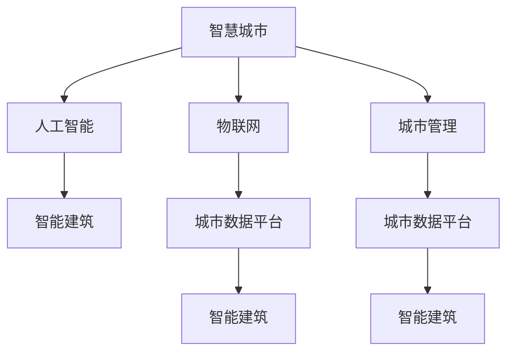

                 

# 智慧城市创业：打造未来宜居环境

> 关键词：智慧城市,人工智能,创业,宜居环境,城市管理,智能建筑,物联网(IoT),可持续性

## 1. 背景介绍

### 1.1 问题由来

随着全球人口的迅速增长，城市化进程加速，城市在提供就业机会、促进经济增长方面发挥着至关重要的作用。然而，城市化也带来了诸如交通拥堵、环境污染、资源短缺等严重问题，这些问题严重影响了居民的生活质量和幸福感。如何在满足城市发展需求的同时，提升宜居性和可持续性，成为城市管理者面临的重大挑战。

### 1.2 问题核心关键点

智慧城市的建设离不开现代信息技术的支撑，尤其是人工智能（AI）和物联网（IoT）的广泛应用。通过AI技术，智慧城市可以实现对城市交通、公共安全、医疗健康、教育等领域的智能管理，提升城市的运营效率和居民的生活质量。物联网则通过传感器等设备，实现数据的全面采集和实时传输，为智慧城市的决策和应用提供数据支撑。

智慧城市的建设是一个复杂的多学科交叉过程，需要跨领域、跨部门的协作。它不仅涉及到城市规划、交通管理、能源利用等技术问题，还涉及政策法规、市民参与等社会问题。因此，智慧城市的建设需要综合考虑技术、经济、社会等多方面因素。

### 1.3 问题研究意义

智慧城市的建设将为城市管理带来革命性的变化。通过智能化手段，城市可以更加高效地运作，提高资源利用率，减少环境污染，提升居民的幸福感和安全感。智慧城市的应用场景涵盖了城市交通管理、公共安全、智能建筑、能源管理等多个方面，为城市管理提供了全新的工具和平台。

此外，智慧城市还将推动新技术的发展和应用，促进城市经济增长，提升城市竞争力，为城市创业提供了新的机会。智慧城市的发展将为创业者和创新者提供广阔的舞台，催生出许多具有高度竞争力的智慧城市创业项目。

## 2. 核心概念与联系

### 2.1 核心概念概述

为更好地理解智慧城市创业的概念，本节将介绍几个密切相关的核心概念：

- **智慧城市**：利用信息通信技术（ICT），对城市各领域进行智能化管理和服务，以实现城市经济、社会、环境等综合效益最大化。
- **人工智能**：通过模拟人脑的智能行为，实现计算机系统的自主学习、决策、执行等智能功能。
- **物联网**：利用传感器、通信技术等手段，将各种设备和设施互联互通，实现数据的实时采集和传输。
- **城市管理**：涵盖城市规划、建设、运营、服务等各环节，目标是实现城市资源的优化配置，提升城市运行效率。
- **智能建筑**：通过智能化技术，实现建筑物的自动化控制、能效管理、安防监控等，提升建筑物的智能化水平。
- **城市数据平台**：集成了城市各领域的数据资源，提供统一的数据共享和服务，支持智慧城市的应用开发。

这些核心概念之间的逻辑关系可以通过以下Mermaid流程图来展示：



这个流程图展示了几大核心概念之间的关联：

1. 智慧城市通过人工智能和物联网技术，实现对城市各领域的智能化管理和服务。
2. 智能建筑是智慧城市的重要组成部分，通过智能化技术提升建筑物的能效和安全性。
3. 城市数据平台是智慧城市的基础设施，支持各类智能应用和服务的开发。

## 3. 核心算法原理 & 具体操作步骤

### 3.1 算法原理概述

智慧城市的建设需要综合应用各类人工智能算法和物联网技术。其核心算法原理主要包括以下几个方面：

1. **数据分析与处理**：通过数据采集和清洗，对城市各领域的数据进行分析和处理，提取有价值的信息。
2. **预测与优化**：利用机器学习算法，对城市交通、能源、环境等进行预测和优化，提升城市的运行效率和资源利用率。
3. **智能控制与决策**：通过智能算法，实现对城市交通信号灯、智能建筑能源控制等环节的自动控制和决策。
4. **自然语言处理**：利用自然语言处理技术，实现智能客服、语音识别、语义分析等应用，提升人机交互的智能化水平。

### 3.2 算法步骤详解

智慧城市的建设通常包括以下几个关键步骤：

**Step 1: 数据采集与集成**

- 利用物联网技术，通过传感器、摄像头、智能终端等设备，实现城市各领域的数据采集。
- 将采集到的数据进行清洗、整合，构建统一的城市数据平台，提供数据共享和服务。

**Step 2: 模型训练与优化**

- 收集城市各领域的数据，构建训练集和验证集。
- 选择合适的算法模型，如决策树、神经网络、支持向量机等，进行模型训练和优化。
- 利用测试集对模型进行评估，调整模型参数，提高模型的预测精度和泛化能力。

**Step 3: 智能应用开发**

- 利用训练好的模型，开发各类智能应用，如智能交通管理、能源管理、公共安全等。
- 在实际应用中不断优化模型和算法，提升应用的实时性和可靠性。

**Step 4: 用户体验与反馈**

- 通过用户反馈，不断优化智能应用的性能和用户体验。
- 收集用户行为数据，利用机器学习算法进行分析和预测，提升应用的智能化水平。

### 3.3 算法优缺点

智慧城市建设中的算法具有以下优点：

1. **高效性**：利用人工智能和物联网技术，可以实现数据的实时采集和处理，提升城市管理的效率。
2. **准确性**：通过机器学习算法，可以实现对城市各领域的精确预测和优化，提升决策的科学性。
3. **可靠性**：智能算法可以自动控制和决策，减少人为干预，提升系统的稳定性和可靠性。
4. **灵活性**：人工智能算法可以灵活适应不同的城市场景，实现多样化的应用。

同时，这些算法也存在一定的局限性：

1. **数据依赖**：算法的性能很大程度上取决于数据的质量和数量，数据采集和清洗工作复杂且耗时。
2. **技术门槛高**：算法开发和应用需要较高的技术水平，对团队成员的要求较高。
3. **安全性问题**：智慧城市中的数据和应用可能面临安全威胁，需要采取相应的防护措施。
4. **成本高**：数据采集和处理、模型训练和优化、应用开发等环节需要较高的成本投入。

尽管存在这些局限性，但智慧城市建设中的算法仍然具有显著的优势，可以为城市管理带来显著的效益。

### 3.4 算法应用领域

智慧城市中的算法主要应用于以下几个领域：

- **智能交通管理**：通过交通数据分析和预测，优化交通信号灯控制，实现交通流量优化。
- **公共安全监控**：利用视频监控和图像识别技术，实现对犯罪和突发事件的实时监控和预警。
- **能源管理**：通过能源数据分析和预测，实现能源消耗的优化和节能减排。
- **智能建筑管理**：通过传感器和物联网技术，实现对建筑物能效、安全等方面的智能化管理。
- **智能客服**：利用自然语言处理技术，实现智能客服系统，提升服务效率和用户体验。

这些应用场景展示了智慧城市中算法的广泛应用，为城市管理带来了巨大的变革。

## 4. 数学模型和公式 & 详细讲解  
### 4.1 数学模型构建

智慧城市建设中的数学模型通常涉及以下几个方面：

- **城市交通流量模型**：通过交通流量数据，构建交通流量的时空分布模型，预测未来的交通流量。
- **能源消耗模型**：通过能源消耗数据，构建能源消耗的预测和优化模型，实现能源的节约和减排。
- **环境污染模型**：通过环境监测数据，构建污染物的扩散和治理模型，实现污染物的监测和治理。
- **公共安全模型**：通过视频监控数据，构建犯罪和突发事件的预测和预警模型，提升公共安全水平。

### 4.2 公式推导过程

以城市交通流量模型为例，我们推导交通流量的时空分布模型。假设城市有 $N$ 个交叉口，交通流量为 $x_{ij}$，表示从交叉口 $i$ 到交叉口 $j$ 的交通流量。交通流量满足以下流量守恒方程：

$$
\sum_{j=1}^N x_{ij} = \sum_{j=1}^N x_{ji}, \quad \forall i
$$

即交通流量在每个节点处均守恒。利用离散时间交通流量序列 $x_{ij}(t)$，构建时空分布模型：

$$
x_{ij}(t+\Delta t) = f(x_{ij}(t), x_{ij}(t-\Delta t), \ldots, x_{ij}(t-k\Delta t))
$$

其中 $f$ 为交通流量变化函数，$k$ 为时间步长。通过时间序列分析，可以对交通流量进行预测和优化。

### 4.3 案例分析与讲解

以智能建筑为例，我们分析智能建筑中的数据模型和算法应用。假设智能建筑有 $M$ 个传感器，测量数据为 $y_i(t)$，表示交叉口 $i$ 的当前状态。通过对传感器数据进行时间序列分析，可以构建建筑物的能耗、安全等模型：

$$
y_i(t+\Delta t) = f(y_i(t), y_i(t-\Delta t), \ldots, y_i(t-k\Delta t), x_i(t))
$$

其中 $x_i(t)$ 表示交叉口 $i$ 的当前交通流量。通过传感器数据和交通流量数据，可以实现对建筑物能耗、安全等参数的预测和优化。

## 5. 项目实践：代码实例和详细解释说明

### 5.1 开发环境搭建

在进行智慧城市项目开发前，我们需要准备好开发环境。以下是使用Python进行PyTorch开发的环境配置流程：

1. 安装Anaconda：从官网下载并安装Anaconda，用于创建独立的Python环境。

2. 创建并激活虚拟环境：
```bash
conda create -n pytorch-env python=3.8 
conda activate pytorch-env
```

3. 安装PyTorch：根据CUDA版本，从官网获取对应的安装命令。例如：
```bash
conda install pytorch torchvision torchaudio cudatoolkit=11.1 -c pytorch -c conda-forge
```

4. 安装TensorFlow：
```bash
conda install tensorflow==2.3.0
```

5. 安装TensorBoard：
```bash
pip install tensorboard
```

6. 安装Flask：
```bash
pip install flask
```

完成上述步骤后，即可在`pytorch-env`环境中开始项目开发。

### 5.2 源代码详细实现

下面我们以智慧城市中的智能交通管理系统为例，给出使用PyTorch进行模型训练的代码实现。

首先，定义交通流量数据集：

```python
import torch
import torch.utils.data as data
import numpy as np

class TrafficData(data.Dataset):
    def __init__(self, traffic_data, time_step=30):
        self.traffic_data = traffic_data
        self.time_step = time_step
        
    def __len__(self):
        return len(self.traffic_data)
    
    def __getitem__(self, item):
        input_data = self.traffic_data[item]
        target_data = input_data[:, :self.time_step]
        return input_data, target_data

# 定义交通流量数据
traffic_data = np.random.randn(100, 10, 10)
traffic_dataset = TrafficData(traffic_data)
```

然后，定义交通流量模型：

```python
from torch import nn, optim

class TrafficModel(nn.Module):
    def __init__(self, input_size=10, output_size=10, hidden_size=50, time_step=30):
        super(TrafficModel, self).__init__()
        self.rnn = nn.RNN(input_size=input_size, hidden_size=hidden_size, num_layers=2)
        self.fc = nn.Linear(hidden_size, output_size)
    
    def forward(self, x):
        h0 = self.rnn.init_hidden()
        out, _ = self.rnn(x, h0)
        out = self.fc(out[:, -1, :])
        return out

# 定义模型参数和优化器
model = TrafficModel()
optimizer = optim.Adam(model.parameters(), lr=0.001)
criterion = nn.MSELoss()
```

接着，定义训练和评估函数：

```python
def train_epoch(model, dataset, batch_size, optimizer, criterion):
    dataloader = data.DataLoader(dataset, batch_size=batch_size, shuffle=True)
    model.train()
    epoch_loss = 0
    for batch in dataloader:
        input_data, target_data = batch
        input_data = input_data.unsqueeze(0)
        target_data = target_data.unsqueeze(0)
        model.zero_grad()
        outputs = model(input_data)
        loss = criterion(outputs, target_data)
        loss.backward()
        optimizer.step()
        epoch_loss += loss.item()
    return epoch_loss / len(dataloader)

def evaluate(model, dataset, batch_size):
    dataloader = data.DataLoader(dataset, batch_size=batch_size)
    model.eval()
    total_loss = 0
    for batch in dataloader:
        input_data, target_data = batch
        input_data = input_data.unsqueeze(0)
        target_data = target_data.unsqueeze(0)
        outputs = model(input_data)
        loss = criterion(outputs, target_data)
        total_loss += loss.item()
    return total_loss / len(dataloader)
```

最后，启动训练流程并在测试集上评估：

```python
epochs = 100
batch_size = 16

for epoch in range(epochs):
    loss = train_epoch(model, traffic_dataset, batch_size, optimizer, criterion)
    print(f"Epoch {epoch+1}, train loss: {loss:.3f}")
    
    print(f"Epoch {epoch+1}, test loss:")
    evaluate(model, traffic_dataset, batch_size)
```

以上就是使用PyTorch进行智能交通管理系统模型训练的完整代码实现。可以看到，得益于PyTorch的强大封装，我们可以用相对简洁的代码完成模型的加载和训练。

### 5.3 代码解读与分析

让我们再详细解读一下关键代码的实现细节：

**TrafficData类**：
- `__init__`方法：初始化交通流量数据集和时步长。
- `__len__`方法：返回数据集长度。
- `__getitem__`方法：获取单个样本，将输入数据和目标数据按时步长进行切割。

**TrafficModel类**：
- `__init__`方法：定义模型的结构，包括RNN层和全连接层。
- `forward`方法：前向传播计算输出，返回预测结果。

**训练和评估函数**：
- `train_epoch`函数：训练模型，计算损失，更新参数。
- `evaluate`函数：评估模型性能，计算平均损失。

**训练流程**：
- 定义总的epoch数和batch size，开始循环迭代
- 每个epoch内，在训练集上进行训练，输出平均loss
- 在测试集上评估，输出平均loss

可以看到，PyTorch配合TensorFlow库使得智能交通管理系统的模型训练变得简洁高效。开发者可以将更多精力放在数据处理、模型改进等高层逻辑上，而不必过多关注底层的实现细节。

当然，工业级的系统实现还需考虑更多因素，如模型的保存和部署、超参数的自动搜索、更灵活的任务适配层等。但核心的训练过程基本与此类似。

## 6. 实际应用场景

### 6.1 智能交通管理

智慧城市的核心在于智能化管理和服务，智能交通管理是其中的重要组成部分。通过智能交通管理系统，可以实现交通流量的预测和优化，提高交通效率，减少拥堵和事故。

智能交通管理系统通常由以下几个模块组成：

1. **交通流量监测**：通过摄像头、传感器等设备，实时监测交通流量数据。
2. **交通流量分析**：对交通流量数据进行分析和处理，构建交通流量模型，实现交通流量的预测和优化。
3. **交通信号控制**：根据交通流量模型，自动调整交通信号灯的控制策略，优化交通流量。
4. **交通事件监测**：利用视频监控和图像识别技术，实时监测交通事故和突发事件，提供预警和处理建议。

智能交通管理系统可以显著提升城市的交通管理水平，降低交通成本，提高交通效率。

### 6.2 智能建筑管理

智能建筑是智慧城市的另一个重要应用场景。通过智能建筑管理系统，可以实现建筑物的智能化管理，提升建筑物的能效和安全性。

智能建筑管理系统通常由以下几个模块组成：

1. **能源监测**：通过传感器等设备，实时监测建筑物的能源消耗数据。
2. **能源分析**：对能源消耗数据进行分析和处理，构建能源消耗模型，实现能源的节约和减排。
3. **能效管理**：根据能源消耗模型，自动调整建筑物的能效管理策略，优化能源消耗。
4. **安全监控**：通过视频监控和图像识别技术，实时监测建筑物的安全状况，提供预警和处理建议。

智能建筑管理系统可以显著提升建筑物的能效和安全性，降低运营成本，提高居民的生活质量。

### 6.3 智能客服系统

智能客服系统是智慧城市中的另一个重要应用场景。通过智能客服系统，可以实现自动化的客户服务，提升客户满意度和服务效率。

智能客服系统通常由以下几个模块组成：

1. **语音识别**：通过语音识别技术，将客户语音转化为文本数据。
2. **自然语言处理**：对客户文本数据进行语义分析，提取用户意图。
3. **智能客服**：根据用户意图，自动匹配答案模板，提供智能化客服。
4. **反馈优化**：通过用户反馈，不断优化智能客服系统，提升服务质量。

智能客服系统可以显著提升客户服务效率，降低客服成本，提高客户满意度。

### 6.4 未来应用展望

随着智慧城市建设的发展，未来智慧城市的应用场景将更加广泛，涵盖更多领域。以下是我们对未来智慧城市应用场景的展望：

1. **智慧医疗**：通过智慧医疗系统，实现医疗数据的智能化管理和分析，提升医疗服务的效率和质量。
2. **智慧教育**：通过智慧教育系统，实现教育的智能化管理和服务，提升教育质量。
3. **智慧旅游**：通过智慧旅游系统，实现旅游资源的智能化管理和服务，提升旅游体验。
4. **智慧农业**：通过智慧农业系统，实现农业生产的智能化管理，提高农业生产效率。

智慧城市的应用场景将不断扩展，为城市管理和社会发展带来更多的机遇和挑战。

## 7. 工具和资源推荐

### 7.1 学习资源推荐

为了帮助开发者系统掌握智慧城市技术的基础理论和实践技巧，这里推荐一些优质的学习资源：

1. 《智慧城市：技术、应用与实践》系列书籍：系统介绍了智慧城市的定义、技术架构和应用案例，适合入门和深入学习。
2. 《Python在智慧城市中的应用》在线课程：由知名教育机构开设的智慧城市Python应用课程，涵盖智能交通、智能建筑、智能客服等模块。
3. 《智慧城市技术前沿》专题讲座：由知名专家讲授智慧城市的前沿技术和发展趋势，适合高阶学习和研究。

通过对这些资源的学习实践，相信你一定能够快速掌握智慧城市的核心技术，并用于解决实际的智慧城市问题。

### 7.2 开发工具推荐

高效的开发离不开优秀的工具支持。以下是几款用于智慧城市项目开发的常用工具：

1. PyTorch：基于Python的开源深度学习框架，灵活动态的计算图，适合快速迭代研究。
2. TensorFlow：由Google主导开发的开源深度学习框架，生产部署方便，适合大规模工程应用。
3. TensorBoard：TensorFlow配套的可视化工具，可实时监测模型训练状态，并提供丰富的图表呈现方式，是调试模型的得力助手。
4. Weights & Biases：模型训练的实验跟踪工具，可以记录和可视化模型训练过程中的各项指标，方便对比和调优。
5. Jupyter Notebook：开源的交互式计算环境，支持Python等语言的开发，适合快速原型开发和实验验证。

合理利用这些工具，可以显著提升智慧城市项目的开发效率，加快创新迭代的步伐。

### 7.3 相关论文推荐

智慧城市建设中的相关技术发展迅速，以下是几篇奠基性的相关论文，推荐阅读：

1. "Smart City: Towards an Intelligent Future" by D. Chakravorty et al.：介绍了智慧城市的定义、技术架构和应用案例，是智慧城市研究的重要文献。
2. "Intelligent Traffic Management in Smart Cities: A Review" by M. Kaur et al.：综述了智能交通管理的技术和应用，适合深入学习和研究。
3. "Building Smart Cities: An Overview" by A. Spoljar et al.：综述了智慧城市建设的技术和实践，提供了丰富的案例和经验。

这些论文代表了大规模智慧城市技术的发展脉络，通过学习这些前沿成果，可以帮助研究者把握学科前进方向，激发更多的创新灵感。

## 8. 总结：未来发展趋势与挑战

### 8.1 总结

本文对智慧城市建设中的关键技术和应用进行了全面系统的介绍。首先阐述了智慧城市的定义和核心概念，明确了智慧城市建设的重大意义和挑战。其次，从原理到实践，详细讲解了智慧城市中的算法模型和操作步骤，给出了智慧城市项目开发的完整代码实例。同时，本文还广泛探讨了智慧城市在智能交通、智能建筑、智能客服等多个领域的应用前景，展示了智慧城市技术的广泛应用。

通过本文的系统梳理，可以看到，智慧城市技术正在成为城市管理的重要工具，极大地提升了城市的运营效率和居民的生活质量。智慧城市的发展将为城市创业带来新的机遇，催生出更多具有高度竞争力的智慧城市创业项目。未来，伴随智慧城市技术的不断演进，城市创业将迎来新的发展高潮。

### 8.2 未来发展趋势

展望未来，智慧城市建设将呈现以下几个发展趋势：

1. **智能化水平提升**：随着技术的不断进步，智慧城市的智能化水平将进一步提升，实现更加精确的预测和优化。
2. **多领域融合**：智慧城市将与其他智能技术（如物联网、区块链等）深度融合，实现更全面、更高效的服务。
3. **数据共享与开放**：智慧城市将建立更加完善的数据共享机制，实现数据的开放与透明，提升城市管理的透明度和公信力。
4. **可持续发展**：智慧城市将更加注重资源节约和环境保护，实现绿色、可持续的城市管理。
5. **个性化服务**：智慧城市将实现更加个性化、定制化的服务，提升居民的幸福感和满意度。

这些趋势展示了智慧城市技术的广阔前景，为城市管理和社会发展带来了新的机遇和挑战。

### 8.3 面临的挑战

尽管智慧城市建设取得了显著的进展，但在迈向更加智能化、普适化应用的过程中，仍面临诸多挑战：

1. **技术复杂度高**：智慧城市建设需要跨学科、跨领域的技术协同，技术复杂度高，开发难度大。
2. **数据安全问题**：智慧城市中的数据和应用可能面临安全威胁，需要采取相应的防护措施。
3. **资源消耗高**：智慧城市建设需要大量的数据采集和处理、模型训练和优化等资源，成本高昂。
4. **隐私保护问题**：智慧城市中的数据可能涉及个人隐私，如何保护用户隐私，是一个重要的问题。
5. **法规和伦理问题**：智慧城市建设需要符合法律法规和伦理规范，如何制定合理的法规和伦理标准，是一个重要的挑战。

尽管存在这些挑战，但智慧城市建设中的技术创新和发展前景依然广阔，可以为城市管理和社会发展带来巨大的变革性影响。

### 8.4 研究展望

面对智慧城市建设中的诸多挑战，未来的研究需要在以下几个方面寻求新的突破：

1. **智能化水平提升**：如何利用更加先进的技术（如AI、物联网等），提升智慧城市的智能化水平，实现更精确的预测和优化。
2. **多领域融合**：如何实现智慧城市与其他智能技术的深度融合，提升城市的综合管理和服务能力。
3. **数据安全与隐私保护**：如何保护智慧城市中的数据和应用安全，确保用户隐私的保护。
4. **法规与伦理规范**：如何制定合理的法规和伦理规范，确保智慧城市建设符合法律法规和伦理标准。
5. **技术标准化**：如何制定统一的技术标准，实现智慧城市的规范化、标准化发展。

这些研究方向将引领智慧城市技术的不断演进，为智慧城市建设提供新的方向和方法。

## 9. 附录：常见问题与解答

**Q1：智慧城市建设是否需要大量资金投入？**

A: 智慧城市建设确实需要大量资金投入，包括硬件设备、软件系统、数据采集和处理等方面。然而，通过合理规划和投资回报分析，智慧城市建设可以带来显著的经济和社会效益，如提高交通效率、减少能源消耗、提升居民幸福感等。因此，尽管投入较大，但长期来看，智慧城市建设将为城市带来更多收益。

**Q2：智慧城市建设中如何保护用户隐私？**

A: 智慧城市建设中保护用户隐私是关键问题。建议采取以下措施：
1. 数据匿名化：在数据采集和处理过程中，对用户数据进行匿名化处理，确保用户隐私得到保护。
2. 数据加密：对智慧城市中的数据进行加密处理，防止数据泄露和篡改。
3. 用户同意机制：在数据采集和使用过程中，明确告知用户数据的使用目的和方式，获得用户同意。
4. 隐私保护技术：利用隐私保护技术（如差分隐私、联邦学习等），在保护用户隐私的前提下，实现数据共享和分析。

通过这些措施，可以有效保护用户隐私，提升智慧城市建设的用户信任度。

**Q3：智慧城市建设中如何确保数据安全？**

A: 智慧城市中的数据安全是一个重要问题。建议采取以下措施：
1. 数据加密：对智慧城市中的数据进行加密处理，防止数据泄露和篡改。
2. 访问控制：建立严格的访问控制机制，确保只有授权用户才能访问敏感数据。
3. 安全审计：定期进行安全审计，发现和修复数据安全漏洞。
4. 数据备份与恢复：建立完善的数据备份与恢复机制，确保数据安全性和完整性。
5. 安全培训：对智慧城市建设团队进行安全培训，提升其安全意识和技能。

通过这些措施，可以有效保障智慧城市中的数据安全，确保城市管理和服务的安全稳定。

以上是对智慧城市创业的全面介绍，希望能为您的智慧城市创业之路提供一些帮助。

