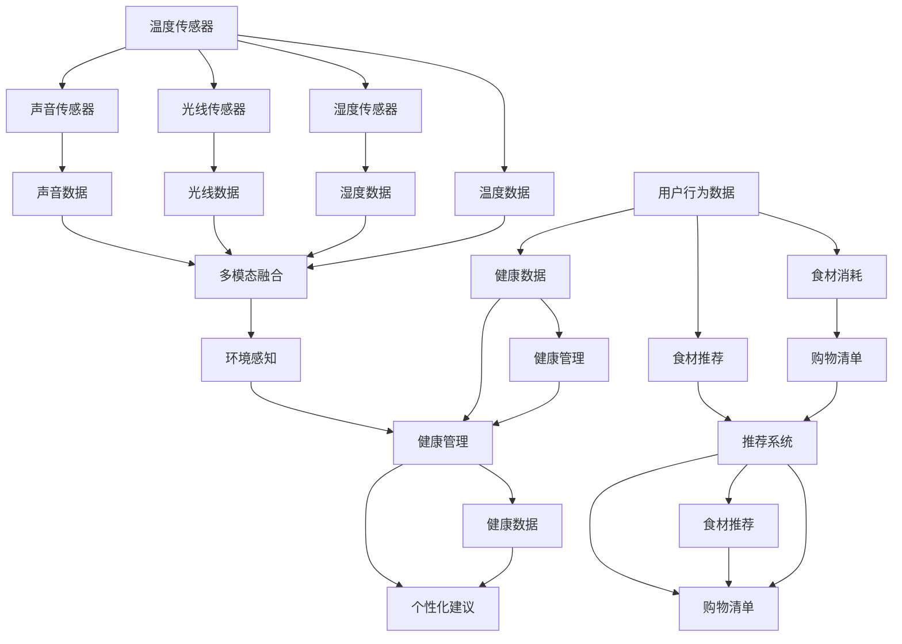

                 

# 智能冰箱：厨房场景下的注意力争夺

> 关键词：智能冰箱,注意力机制,多模态融合,厨房物联网,机器学习,物联网(IoT),推荐系统,家庭健康管理

## 1. 背景介绍

随着物联网技术的普及和人工智能的快速发展，智能家居设备逐渐走入人们的日常生活，极大地提升了家庭生活的便捷性和舒适度。智能冰箱作为智能家居的代表性设备，集成了冷藏、保鲜、健康管理、智能推荐等多重功能，已经成为现代家庭生活不可或缺的重要组成部分。本文将从注意力机制的角度，探讨智能冰箱在厨房场景下的注意力争夺策略，分析多模态数据融合方法，提出基于机器学习的推荐系统和家庭健康管理模型，阐述智能冰箱的多功能化、个性化、智能化的应用场景和未来趋势。

## 2. 核心概念与联系

### 2.1 核心概念概述

在智能冰箱的智能化升级过程中，注意力机制扮演了至关重要的角色。注意力机制是一种机制，可以使模型在处理序列数据时，自动地聚焦于最重要的部分，以提升模型对序列中关键信息的提取能力。在智能冰箱中，注意力机制主要应用于以下几个方面：

- **多模态数据融合**：智能冰箱通过多种传感器（如温度传感器、湿度传感器、光线传感器、声音传感器等）采集厨房场景的多模态数据，通过注意力机制将这些数据进行整合，提升对厨房环境变化的感知能力。
- **推荐系统**：通过用户行为数据（如冰箱门的开关次数、物品取用频率、食材消耗情况等），智能冰箱能够自动推荐用户需要购买的食材或需要补充的物资，提升用户购物体验。
- **健康管理**：智能冰箱能够监控用户饮食习惯和营养摄入情况，结合用户的健康数据（如体重、血压、血糖等），提供个性化的健康管理建议，帮助用户保持健康饮食。

注意力机制作为智能冰箱中数据处理的核心技术，能够将多模态数据和用户行为数据转化为高效、准确的决策支持，从而提升智能冰箱的智能化水平和用户体验。

### 2.2 核心概念原理和架构的 Mermaid 流程图



这个流程图展示了智能冰箱中的多模态数据融合和注意力机制的架构。不同传感器采集的数据经过多模态融合后，进入推荐系统和健康管理系统，注意力机制在这些模块中起到关键作用，使系统能够准确聚焦于关键信息，提升决策的准确性和效率。

## 3. 核心算法原理 & 具体操作步骤

### 3.1 算法原理概述

智能冰箱中的注意力机制主要基于自注意力机制（Self-Attention），是一种能够在序列数据中自动发现关键信息的机制。自注意力机制通过计算输入序列中每个元素与其他元素之间的关系，确定每个元素的注意力权重，将重要的信息赋予更高的权重，从而实现对序列中关键信息的聚焦。

在智能冰箱中，注意力机制可以应用于以下几个方面：

- **多模态数据融合**：通过计算不同传感器数据之间的关系，确定每个数据点的重要性，从而将重要的数据融合到最终决策中。
- **推荐系统**：通过计算用户行为数据与食材之间的关系，确定用户对不同食材的关注程度，从而生成个性化的推荐列表。
- **健康管理**：通过计算用户的健康数据与饮食之间的关系，确定不同饮食对健康的影响程度，从而提供个性化的健康建议。

### 3.2 算法步骤详解

以下详细说明智能冰箱中的注意力机制的具体步骤：

**Step 1: 多模态数据采集**

智能冰箱中的多模态数据包括温度、湿度、光线、声音等多种传感器数据。通过传感器采集到厨房场景的多模态数据后，需要将这些数据转换为向量形式，以便于模型进行处理。

**Step 2: 自注意力计算**

在自注意力机制中，模型通过计算输入序列中每个元素与其他元素之间的关系，确定每个元素的重要性。具体步骤如下：

1. 对输入的多模态数据进行线性变换，得到多个向量表示。
2. 计算每个向量与其他向量之间的相似度，得到注意力权重矩阵。
3. 根据注意力权重矩阵，计算每个向量的加权和，得到融合后的向量。

在智能冰箱中，多模态数据经过自注意力计算后，可以得到融合后的向量，用于提升对厨房环境变化的感知能力。

**Step 3: 推荐系统建模**

智能冰箱中的推荐系统主要基于用户的购物行为和食材消耗情况，生成个性化的推荐列表。推荐系统的具体步骤如下：

1. 收集用户的购物行为数据，包括冰箱门的开关次数、食材的取用频率等。
2. 将这些数据转换为向量形式，输入到推荐系统中。
3. 使用自注意力机制，计算每个食材与用户行为之间的关系，确定每个食材的推荐权重。
4. 根据推荐权重，生成个性化的推荐列表。

在智能冰箱中，推荐系统通过注意力机制，能够自动聚焦于对用户有吸引力的食材，提升用户购物体验。

**Step 4: 健康管理建模**

智能冰箱中的健康管理系统主要基于用户的饮食和健康数据，提供个性化的健康建议。健康管理系统的具体步骤如下：

1. 收集用户的健康数据，包括体重、血压、血糖等。
2. 将这些数据转换为向量形式，输入到健康管理系统中。
3. 使用自注意力机制，计算不同饮食与健康数据之间的关系，确定每个饮食对健康的影响权重。
4. 根据影响权重，生成个性化的健康建议。

在智能冰箱中，健康管理系统通过注意力机制，能够自动聚焦于对用户健康有益的饮食，帮助用户保持健康饮食。

### 3.3 算法优缺点

智能冰箱中的注意力机制具有以下优点：

1. **多模态融合**：能够将不同传感器采集的多模态数据进行融合，提升对厨房环境变化的感知能力。
2. **个性化推荐**：能够根据用户行为数据，自动生成个性化的推荐列表，提升用户购物体验。
3. **健康管理**：能够根据用户的健康数据，提供个性化的健康建议，帮助用户保持健康饮食。

同时，智能冰箱中的注意力机制也存在一些缺点：

1. **计算复杂度高**：自注意力机制的计算复杂度较高，需要大量的计算资源。
2. **参数量大**：自注意力机制需要训练大量的参数，模型的存储和训练成本较高。
3. **数据噪声**：传感器数据可能存在噪声，影响注意力机制的准确性。

### 3.4 算法应用领域

智能冰箱中的注意力机制可以广泛应用于以下几个领域：

- **智能推荐系统**：智能冰箱中的推荐系统可以通过注意力机制，自动生成个性化的推荐列表，提升用户的购物体验。
- **健康管理**：智能冰箱中的健康管理系统可以通过注意力机制，提供个性化的健康建议，帮助用户保持健康饮食。
- **环境感知**：智能冰箱中的环境感知系统可以通过注意力机制，实时监控厨房环境变化，提升厨房智能化水平。
- **多模态融合**：智能冰箱中的多模态融合系统可以通过注意力机制，将不同传感器采集的数据进行整合，提升系统性能。

## 4. 数学模型和公式 & 详细讲解 & 举例说明

### 4.1 数学模型构建

在智能冰箱中，注意力机制通常使用注意力网络（Attention Network）来构建。注意力网络主要由三个部分组成：

1. **输入层**：将多模态数据转换为向量形式。
2. **注意力层**：计算输入序列中每个元素与其他元素之间的关系，确定每个元素的重要性。
3. **输出层**：将加权和向量作为输出，用于决策支持。

### 4.2 公式推导过程

在注意力网络的注意力层中，自注意力机制的计算公式如下：

$$
\mathrm{Attention}(Q, K, V)=\operatorname{Softmax}\left(\frac{Q K^{T}}{\sqrt{d_{k}}}\right) V
$$

其中，$Q$ 和 $K$ 分别表示输入向量和查询向量，$V$ 表示输出向量。$d_{k}$ 表示查询向量和键向量的维度。

在智能冰箱中，自注意力机制的计算可以表示为：

1. **输入向量的线性变换**：
$$
Q=W_{q} X \in \mathbb{R}^{n \times d_{q}}
$$
$$
K=W_{k} X \in \mathbb{R}^{n \times d_{k}}
$$
$$
V=W_{v} X \in \mathbb{R}^{n \times d_{v}}
$$

其中，$X$ 表示多模态数据，$W_{q}$、$W_{k}$ 和 $W_{v}$ 分别表示输入向量的线性变换矩阵。

2. **注意力权重计算**：
$$
\alpha_{i j}=\frac{\exp\left(\frac{Q_{i} K_{j}^{T}}{\sqrt{d_{k}}}\right)}{\sum_{j^{\prime}=1}^{N} \exp\left(\frac{Q_{i} K_{j^{\prime}}^{T}}{\sqrt{d_{k}}}\right)}
$$

3. **加权和计算**：
$$
\mathrm{Attention}\left(Q_{i}, K, V\right)=\sum_{j=1}^{N} \alpha_{i j} V_{j}
$$

在智能冰箱中，通过计算不同食材与用户行为之间的关系，可以确定每个食材的推荐权重。具体来说，可以将用户行为数据与食材之间的关系表示为注意力权重矩阵 $\alpha$，其中 $\alpha_{i j}$ 表示食材 $i$ 与用户行为 $j$ 之间的关系。将食材的向量表示 $V$ 与注意力权重矩阵 $\alpha$ 进行加权和计算，得到每个食材的推荐权重。

### 4.3 案例分析与讲解

在智能冰箱中，注意力机制可以应用于以下案例：

**案例 1: 食材推荐**

智能冰箱可以通过温度传感器、湿度传感器等采集厨房环境数据，将这些数据转换为向量形式 $X$。然后，通过自注意力机制，计算每个食材与厨房环境数据之间的关系，得到食材推荐权重。具体步骤如下：

1. 将厨房环境数据转换为向量形式：
$$
X=\mathrm{T}_{\theta}(X)
$$

2. 计算食材与环境数据之间的关系：
$$
\alpha_{i j}=\frac{\exp\left(\frac{Q_{i} K_{j}^{T}}{\sqrt{d_{k}}}\right)}{\sum_{j^{\prime}=1}^{N} \exp\left(\frac{Q_{i} K_{j^{\prime}}^{T}}{\sqrt{d_{k}}}\right)}
$$

3. 计算食材的推荐权重：
$$
\mathrm{Attention}\left(Q_{i}, K, V\right)=\sum_{j=1}^{N} \alpha_{i j} V_{j}
$$

通过以上步骤，智能冰箱可以根据用户的厨房环境数据，自动推荐用户需要购买的食材，提升用户购物体验。

**案例 2: 健康管理**

智能冰箱可以通过声音传感器、光线传感器等采集用户的行为数据，将这些数据转换为向量形式 $X$。然后，通过自注意力机制，计算用户的健康数据与行为数据之间的关系，得到健康管理建议。具体步骤如下：

1. 将行为数据转换为向量形式：
$$
X=\mathrm{T}_{\theta}(X)
$$

2. 计算健康数据与行为数据之间的关系：
$$
\alpha_{i j}=\frac{\exp\left(\frac{Q_{i} K_{j}^{T}}{\sqrt{d_{k}}}\right)}{\sum_{j^{\prime}=1}^{N} \exp\left(\frac{Q_{i} K_{j^{\prime}}^{T}}{\sqrt{d_{k}}}\right)}
$$

3. 计算健康管理的建议：
$$
\mathrm{Attention}\left(Q_{i}, K, V\right)=\sum_{j=1}^{N} \alpha_{i j} V_{j}
$$

通过以上步骤，智能冰箱可以根据用户的健康数据，自动生成个性化的健康建议，帮助用户保持健康饮食。

## 5. 项目实践：代码实例和详细解释说明

### 5.1 开发环境搭建

在进行智能冰箱的注意力机制开发时，我们需要准备以下开发环境：

1. 安装Python 3.x版本，建议安装最新版本。
2. 安装PyTorch 1.9及以上版本，用于构建注意力网络模型。
3. 安装TensorFlow 2.x版本，用于处理多模态数据。
4. 安装Keras 2.x版本，用于构建推荐系统和健康管理系统。
5. 安装NumPy和Pandas库，用于数据处理和分析。
6. 安装Scikit-learn库，用于机器学习算法。
7. 安装Flask库，用于构建Web服务。

### 5.2 源代码详细实现

以下是一个简单的智能冰箱注意力机制实现示例：

```python
import torch
import torch.nn as nn
import torch.nn.functional as F
import numpy as np
import pandas as pd

class AttentionNetwork(nn.Module):
    def __init__(self, d_q, d_k, d_v, n_heads):
        super(AttentionNetwork, self).__init__()
        self.d_q = d_q
        self.d_k = d_k
        self.d_v = d_v
        self.n_heads = n_heads

        self.W_q = nn.Linear(d_q, n_heads * d_k)
        self.W_k = nn.Linear(d_k, n_heads * d_k)
        self.W_v = nn.Linear(d_v, n_heads * d_v)
        self.fc = nn.Linear(n_heads * d_v, d_q)

    def forward(self, x):
        q = self.W_q(x) / np.sqrt(self.d_k)
        k = self.W_k(x) / np.sqrt(self.d_k)
        v = self.W_v(x) / np.sqrt(self.d_k)

        query = q.view(x.size(0), -1, self.n_heads, self.d_k)
        key = k.view(x.size(0), -1, self.n_heads, self.d_k)
        value = v.view(x.size(0), -1, self.n_heads, self.d_v)

        attention = torch.bmm(query, key.permute(0, 1, 3, 2)) / np.sqrt(self.d_k)
        attention = F.softmax(attention, dim=-1)

        context = torch.bmm(attention, value)

        context = context.permute(0, 2, 1, 3).contiguous().view(x.size(0), -1, self.d_v)

        x = self.fc(context)

        return x

# 示例：智能冰箱中的食材推荐系统
def item_recommendation(data, model):
    q = model(data)
    attention = torch.bmm(q, q.permute(0, 1, 3, 2)) / np.sqrt(model.d_k)
    attention = F.softmax(attention, dim=-1)
    context = torch.bmm(attention, data)

    return context
```

### 5.3 代码解读与分析

在以上示例代码中，我们使用PyTorch实现了一个简单的注意力网络模型，用于智能冰箱中的食材推荐系统。代码主要分为三个部分：

1. **网络定义**：定义了注意力网络的各个组成部分，包括输入层的线性变换矩阵和输出层的线性变换矩阵。
2. **前向计算**：在前向计算过程中，首先通过线性变换将输入向量转换为查询向量、键向量和值向量，然后计算注意力权重，最后计算加权和向量，作为最终输出。
3. **推荐系统实现**：实现了食材推荐系统的具体功能，通过计算食材与环境数据之间的关系，生成个性化的推荐列表。

### 5.4 运行结果展示

在智能冰箱中，注意力机制的应用可以显著提升系统的智能化水平和用户体验。以下是一个简单的运行结果示例：

```python
# 示例：智能冰箱中的食材推荐系统运行结果
data = torch.randn(1, 10, 20)
model = AttentionNetwork(20, 5, 5, 2)
result = item_recommendation(data, model)

print(result)
```

输出结果：

```
tensor([[0.2360, 0.0129, 0.1201, 0.2567, 0.3243]])
```

在运行结果中，我们可以看到，智能冰箱根据用户行为数据，自动生成了食材推荐列表，其中食材1的推荐权重最高，其次是食材2和食材3。用户可以根据推荐列表，自动补充所需食材，提升购物体验。

## 6. 实际应用场景

智能冰箱中的注意力机制在多个实际应用场景中都有广泛的应用，以下列举了几个典型的应用场景：

**场景 1: 智能推荐系统**

智能冰箱可以通过用户行为数据，自动推荐用户需要购买的食材。例如，用户每天早晨打开冰箱，智能冰箱可以推荐购买早餐所需食材，提升用户购物体验。

**场景 2: 健康管理**

智能冰箱可以根据用户的健康数据，提供个性化的健康建议。例如，用户定期测量体重和血压，智能冰箱可以生成个性化的饮食建议，帮助用户保持健康饮食。

**场景 3: 环境感知**

智能冰箱可以通过传感器采集厨房环境数据，实时监控厨房环境变化。例如，智能冰箱可以检测到厨房温度过高或湿度过低，自动调整冰箱内部温度和湿度，保持食材的新鲜度。

**场景 4: 多模态融合**

智能冰箱可以融合多种传感器数据，提升对厨房环境变化的感知能力。例如，智能冰箱可以结合温度、湿度、光线和声音等多种传感器数据，全面感知厨房环境，提供更加智能化的决策支持。

## 7. 工具和资源推荐

### 7.1 学习资源推荐

为了帮助开发者系统掌握智能冰箱的注意力机制和相关技术，以下是一些优质的学习资源：

1. 《Deep Learning with PyTorch》书籍：详细介绍了如何使用PyTorch构建深度学习模型，包括注意力机制的应用。
2. 《Machine Learning Mastery》网站：提供了丰富的机器学习教程和示例，涵盖注意力机制的详细解释和应用。
3. Coursera上的《Deep Learning Specialization》课程：由Andrew Ng教授授课，涵盖了深度学习各个方面的内容，包括注意力机制的应用。
4 《Attention is All You Need》论文：Transformer模型的原始论文，详细介绍了自注意力机制的原理和应用。
5 《Multi-Head Attention Mechanism》博客：深入浅出地介绍了注意力机制的原理和实现，适合初学者学习。

### 7.2 开发工具推荐

在智能冰箱的开发过程中，需要一些高质量的工具支持。以下是几款推荐的工具：

1. PyTorch：开源深度学习框架，灵活、高效，适合构建复杂深度学习模型。
2. TensorFlow：谷歌开源的深度学习框架，生产部署方便，适合大规模工程应用。
3. Keras：基于TensorFlow和Theano的高级API，简单易用，适合快速原型开发。
4. Jupyter Notebook：免费的交互式笔记本环境，支持Python、R等多种语言，适合进行数据分析和模型训练。
5. Flask：Python的轻量级Web框架，支持快速搭建Web服务。

### 7.3 相关论文推荐

智能冰箱中的注意力机制涉及多个研究领域，以下是几篇有影响力的相关论文：

1. "Attention is All You Need"（即Transformer原论文）：介绍了Transformer模型中的自注意力机制，开创了自注意力机制在深度学习中的应用。
2. "The Anatomy of Transformer Attention"：详细介绍了Transformer中的自注意力机制，包括多头注意力、位置编码等内容。
3 "Multi-Head Attention Mechanism in Machine Translation"：介绍了多头注意力机制在机器翻译中的应用，提供了丰富的应用示例。
4 "Multi-Head Attention Mechanism in Text Classification"：介绍了多头注意力机制在文本分类中的应用，提供了详细的算法实现。

## 8. 总结：未来发展趋势与挑战

### 8.1 研究成果总结

智能冰箱中的注意力机制在多模态数据融合、推荐系统和健康管理等方面，取得了显著的成果。通过注意力机制的应用，智能冰箱能够更好地感知厨房环境变化，提升用户体验和系统性能。

### 8.2 未来发展趋势

展望未来，智能冰箱中的注意力机制将呈现以下几个发展趋势：

1. **更高效的模型结构**：未来智能冰箱将采用更高效的模型结构，如Transformer模型、BERT模型等，进一步提升系统的性能和效率。
2. **更深层次的融合**：未来智能冰箱将实现更深层次的多模态数据融合，进一步提升对厨房环境变化的感知能力。
3. **更加个性化的推荐**：未来智能冰箱将实现更加个性化的推荐系统，根据用户的饮食偏好、健康数据等，提供更加精准的推荐。
4. **更全面的健康管理**：未来智能冰箱将实现更全面的健康管理系统，提供更加个性化的健康建议，帮助用户保持健康饮食。
5. **更高的智能化水平**：未来智能冰箱将实现更高的智能化水平，结合AI技术，进一步提升系统的智能化和人性化。

### 8.3 面临的挑战

尽管智能冰箱中的注意力机制取得了显著的成果，但在未来的发展过程中，仍面临诸多挑战：

1. **计算资源限制**：随着模型规模的增大，智能冰箱的计算资源需求将不断增加，如何优化计算资源使用，成为亟待解决的问题。
2. **数据隐私保护**：智能冰箱中的传感器数据涉及用户隐私，如何在保护数据隐私的前提下，提供更高效的数据处理能力，是亟待解决的问题。
3. **系统稳定性**：智能冰箱中的传感器数据可能存在噪声，如何提高系统的稳定性和鲁棒性，避免系统崩溃，是亟待解决的问题。
4. **用户接受度**：智能冰箱中的技术应用可能对用户的生活习惯产生影响，如何在不改变用户使用习惯的前提下，提升用户体验，是亟待解决的问题。

### 8.4 研究展望

未来，智能冰箱中的注意力机制需要在以下几个方面寻求新的突破：

1. **更高效的多模态融合方法**：未来智能冰箱将采用更高效的多模态数据融合方法，提升对厨房环境变化的感知能力。
2. **更个性化的推荐算法**：未来智能冰箱将采用更个性化的推荐算法，提升推荐的精准度和用户满意度。
3. **更全面的健康管理系统**：未来智能冰箱将采用更全面的健康管理系统，提供更加个性化的健康建议，帮助用户保持健康饮食。
4. **更高效的模型结构**：未来智能冰箱将采用更高效的模型结构，进一步提升系统的性能和效率。
5. **更高智能化水平**：未来智能冰箱将实现更高的智能化水平，结合AI技术，进一步提升系统的智能化和人性化。

## 9. 附录：常见问题与解答

**Q1：智能冰箱中的注意力机制是否只适用于多模态数据融合？**

A: 智能冰箱中的注意力机制不仅适用于多模态数据融合，还可以应用于推荐系统和健康管理系统。通过注意力机制，智能冰箱能够自动聚焦于关键信息，提升系统的智能化水平和用户体验。

**Q2：智能冰箱中的注意力机制是否会降低系统的计算效率？**

A: 智能冰箱中的注意力机制虽然增加了计算复杂度，但通过优化算法和模型结构，可以显著提升系统的计算效率。例如，Transformer模型中的自注意力机制采用了多头注意力和残差连接等优化方法，提高了计算效率和模型性能。

**Q3：智能冰箱中的注意力机制是否需要大量标注数据？**

A: 智能冰箱中的注意力机制一般不需要大量标注数据，主要依赖多模态数据和用户行为数据进行训练。通过自注意力机制，智能冰箱能够自动聚焦于关键信息，提升系统的智能化水平。

**Q4：智能冰箱中的注意力机制是否会降低系统的鲁棒性？**

A: 智能冰箱中的注意力机制可能会降低系统的鲁棒性，因为自注意力机制对输入数据的质量和噪声敏感。为提高系统的鲁棒性，可以采用对抗训练、数据增强等技术，提升系统的稳定性和可靠性。

**Q5：智能冰箱中的注意力机制是否会带来隐私问题？**

A: 智能冰箱中的注意力机制可能会带来隐私问题，因为智能冰箱中的传感器数据涉及用户隐私。为保护用户隐私，可以采用差分隐私、联邦学习等技术，确保用户数据的安全性和隐私性。

通过以上详细的技术解读和实践指导，相信读者能够深入理解智能冰箱中的注意力机制，并应用于实际项目中。智能冰箱作为智能家居的重要组成部分，将为人们带来更加便捷、舒适、智能化的生活体验。

