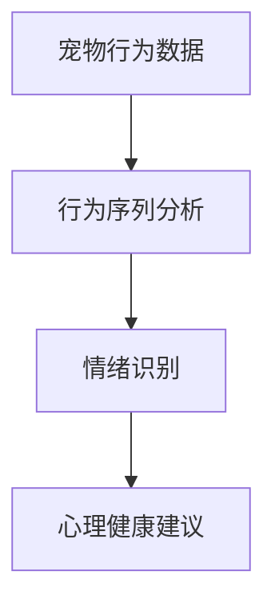

                 

## 1. 背景介绍

### 1.1 问题由来

随着现代社会节奏的加快，宠物成为越来越多家庭的陪伴。然而，宠物也面临着环境变化、孤独、分离焦虑等情绪问题，这些问题不仅影响宠物的健康和幸福感，也对宠物主人的情感生活造成困扰。如何有效地识别和缓解宠物的情绪问题，成为一个亟待解决的问题。

### 1.2 问题核心关键点

目前，识别和缓解宠物情绪问题的方法主要包括以下几种：

1. **环境监测**：通过传感器监测宠物的活动量、饮食习惯等，了解宠物的健康状况。
2. **行为观察**：通过摄像头、行为分析等技术，观察宠物的行为模式，识别其情绪状态。
3. **交互反馈**：利用智能玩具、交互系统等，与宠物互动，收集其反应，调整互动方式。
4. **数据分析**：收集大量的宠物行为数据，使用机器学习算法进行情绪识别和分类，并提供相应的疗愈建议。

其中，基于数据的宠物心理健康方法近年来引起了广泛关注。这种方法通过分析宠物的行为数据，使用机器学习算法识别其情绪状态，并给出相应的心理健康建议，有助于宠物主人更好地理解和照顾他们的宠物。

## 2. 核心概念与联系

### 2.1 核心概念概述

为更好地理解基于数据的宠物心理健康方法，本节将介绍几个密切相关的核心概念：

- **宠物行为数据**：指通过传感器、摄像头等设备收集到的关于宠物活动、行为、生理状态的数据。
- **行为序列分析**：将宠物的行为序列转化为数值特征，用于机器学习模型的输入。
- **情绪识别**：通过机器学习算法，将宠物的行为序列映射到情绪状态，如快乐、悲伤、焦虑等。
- **心理健康建议**：根据识别出的情绪状态，给出相应的心理健康建议，如增加互动、调整环境等。

这些核心概念之间的逻辑关系可以通过以下Mermaid流程图来展示：



这个流程图展示了大数据驱动的宠物心理健康方法的核心过程：

1. 通过传感器、摄像头等设备收集宠物的行为数据。
2. 将行为数据转化为数值特征，输入到机器学习模型。
3. 使用情绪识别算法，将行为序列映射到情绪状态。
4. 根据情绪状态，给出相应的心理健康建议。

这些核心概念共同构成了基于数据的宠物心理健康方法的理论基础，帮助宠物主人更好地理解和管理宠物的情绪健康。

## 3. 核心算法原理 & 具体操作步骤

### 3.1 算法原理概述

基于数据的宠物心理健康方法，本质上是一个监督学习问题。其核心思想是：使用历史行为数据集，训练一个监督学习模型，该模型能够将宠物的行为序列映射到情绪状态。

假设训练集为 $D=\{(x_i, y_i)\}_{i=1}^N$，其中 $x_i$ 为宠物的行为序列，$y_i$ 为对应的情绪状态标签。定义一个监督学习模型 $M_{\theta}$，其中 $\theta$ 为模型的参数。

模型的训练目标是最小化损失函数 $\mathcal{L}(\theta)$，使得模型输出的情绪状态与真实标签 $y_i$ 尽量接近。常见的损失函数包括交叉熵损失、均方误差损失等。

### 3.2 算法步骤详解

基于数据的宠物心理健康方法一般包括以下几个关键步骤：

**Step 1: 数据收集与预处理**
- 使用传感器、摄像头等设备，收集宠物的行为数据。
- 对数据进行清洗和标注，确保数据质量。
- 将数据划分为训练集、验证集和测试集。

**Step 2: 特征提取**
- 将行为数据转化为数值特征，如速度、角度、时间等。
- 使用统计方法、时序分析方法等提取特征。

**Step 3: 模型选择与训练**
- 选择合适的监督学习模型，如卷积神经网络、递归神经网络等。
- 设置模型的超参数，如学习率、批大小、迭代轮数等。
- 使用监督学习算法进行训练，最小化损失函数 $\mathcal{L}(\theta)$。

**Step 4: 模型评估与优化**
- 在验证集上评估模型性能，选择最优模型。
- 使用测试集对模型进行最终评估，确保模型的泛化能力。
- 调整模型超参数，进一步优化模型性能。

**Step 5: 心理健康建议**
- 根据模型的情绪预测结果，给出相应的心理健康建议。
- 提供具体的行为指导、互动策略等。

以上是基于数据的宠物心理健康方法的一般流程。在实际应用中，还需要针对具体任务的特点，对模型训练和心理健康建议的生成进行优化设计。

### 3.3 算法优缺点

基于数据的宠物心理健康方法具有以下优点：

1. **准确度高**：利用大量的行为数据进行训练，能够更准确地识别宠物的情绪状态。
2. **可解释性强**：通过特征提取和模型训练，能够明确了解哪些行为特征对情绪状态的影响较大，从而提供更有针对性的心理健康建议。
3. **泛化能力强**：通过合理的特征提取和模型训练，能够较好地应对新数据和新环境的变化。

同时，该方法也存在一定的局限性：

1. **数据获取难度大**：需要大量高质量的行为数据，获取难度较大。
2. **模型训练复杂**：特征提取和模型训练过程复杂，需要一定的技术积累。
3. **动态环境适应性差**：对于环境的动态变化，如宠物主人换班、搬家等，模型可能无法快速适应。
4. **隐私保护问题**：宠物行为数据可能包含敏感信息，需要特别注意隐私保护。

尽管存在这些局限性，但就目前而言，基于数据的宠物心理健康方法仍是一种非常有效和实用的技术。未来相关研究的重点在于如何进一步降低数据获取难度，提高模型的训练效率，同时兼顾隐私保护和动态环境适应性等因素。

### 3.4 算法应用领域

基于数据的宠物心理健康方法在宠物行为分析、情绪识别、心理健康管理等领域有广泛的应用：

1. **宠物行为分析**：通过对宠物的行为数据进行分析，识别宠物的活动规律、情绪状态等，帮助宠物主人更好地理解和管理宠物的行为。
2. **情绪识别**：使用机器学习算法，将宠物的行为序列映射到情绪状态，如快乐、悲伤、焦虑等，帮助宠物主人及时了解宠物的情绪变化。
3. **心理健康管理**：根据识别出的情绪状态，提供相应的心理健康建议，如增加互动、调整环境等，帮助宠物保持良好的心理健康状态。
4. **智能玩具开发**：结合智能玩具与基于数据的宠物心理健康方法，开发能够实时监测宠物情绪状态，并给出相应反馈的智能玩具。
5. **远程监护**：利用互联网技术，通过摄像头、传感器等设备远程监护宠物的行为和情绪状态，帮助宠物主人更好地照顾宠物。

除了这些常见的应用外，基于数据的宠物心理健康方法还将在宠物医疗、宠物教育、宠物行为科学研究等领域发挥重要作用。

## 4. 数学模型和公式 & 详细讲解

### 4.1 数学模型构建

本节将使用数学语言对基于数据的宠物心理健康方法进行更加严格的刻画。

记宠物的行为序列为 $x \in \mathbb{R}^n$，其中 $n$ 为行为序列的长度。假设情绪状态的标签集合为 $\mathcal{Y}=\{1, 2, \ldots, K\}$，其中 $K$ 为情绪状态的种类数。定义情绪识别模型为 $M_{\theta}:\mathbb{R}^n \rightarrow \mathcal{Y}$，其中 $\theta$ 为模型的参数。

假设训练集为 $D=\{(x_i, y_i)\}_{i=1}^N$，其中 $x_i \in \mathbb{R}^n$ 为宠物的行为序列，$y_i \in \mathcal{Y}$ 为对应的情绪状态标签。模型的训练目标是最小化损失函数 $\mathcal{L}(\theta)$，使得模型输出的情绪状态与真实标签尽量接近。常见的损失函数包括交叉熵损失、均方误差损失等。

### 4.2 公式推导过程

以下我们以二分类任务为例，推导交叉熵损失函数及其梯度的计算公式。

假设模型 $M_{\theta}$ 在输入 $x$ 上的输出为 $\hat{y}=M_{\theta}(x) \in [0,1]$，表示预测情绪状态为标签 $y$ 的概率。真实标签 $y \in \{1, 2\}$。则二分类交叉熵损失函数定义为：

$$
\ell(M_{\theta}(x),y) = -[y\log \hat{y} + (1-y)\log (1-\hat{y})]
$$

将其代入经验风险公式，得：

$$
\mathcal{L}(\theta) = -\frac{1}{N}\sum_{i=1}^N [y_i\log M_{\theta}(x_i)+(1-y_i)\log(1-M_{\theta}(x_i))]
$$

根据链式法则，损失函数对参数 $\theta_k$ 的梯度为：

$$
\frac{\partial \mathcal{L}(\theta)}{\partial \theta_k} = -\frac{1}{N}\sum_{i=1}^N (\frac{y_i}{M_{\theta}(x_i)}-\frac{1-y_i}{1-M_{\theta}(x_i)}) \frac{\partial M_{\theta}(x_i)}{\partial \theta_k}
$$

其中 $\frac{\partial M_{\theta}(x_i)}{\partial \theta_k}$ 可进一步递归展开，利用自动微分技术完成计算。

### 4.3 案例分析与讲解

在实际应用中，基于数据的宠物心理健康方法可以使用多种机器学习算法进行训练，如卷积神经网络、递归神经网络等。这里以递归神经网络为例，给出一个简单的案例分析。

假设我们使用LSTM模型进行训练，其结构如图1所示。


其中，输入层将宠物的行为数据转化为数值特征，LSTM层进行特征提取，输出层将特征映射到情绪状态。

图1：LSTM模型结构示意图

在训练过程中，我们首先定义交叉熵损失函数：

$$
\mathcal{L}(\theta) = -\frac{1}{N}\sum_{i=1}^N \sum_{j=1}^K \mathbb{I}(y_i = j) \log M_{\theta}(x_i, j)
$$

其中 $\mathbb{I}(y_i = j)$ 为示性函数，表示是否为标签 $j$。

然后，定义LSTM模型的前向传播公式：

$$
h_t = f(W_1x_t + b_1h_{t-1} + W_2h_{t-1})
$$

$$
\hat{y} = g(W_3h_t + b_3)
$$

其中 $h_t$ 为LSTM层的隐藏状态，$\hat{y}$ 为输出层的预测结果。

最后，定义模型参数 $\theta$ 的梯度更新公式：

$$
\theta \leftarrow \theta - \eta \nabla_{\theta}\mathcal{L}(\theta)
$$

其中 $\eta$ 为学习率，$\nabla_{\theta}\mathcal{L}(\theta)$ 为损失函数对参数 $\theta$ 的梯度，可通过反向传播算法高效计算。

通过上述公式，我们可以对LSTM模型进行训练，得到最优的参数 $\theta^*$。

## 5. 项目实践：代码实例和详细解释说明

### 5.1 开发环境搭建

在进行项目实践前，我们需要准备好开发环境。以下是使用Python进行TensorFlow开发的环境配置流程：

1. 安装Anaconda：从官网下载并安装Anaconda，用于创建独立的Python环境。

2. 创建并激活虚拟环境：
```bash
conda create -n tf-env python=3.8 
conda activate tf-env
```

3. 安装TensorFlow：根据CUDA版本，从官网获取对应的安装命令。例如：
```bash
conda install tensorflow -c conda-forge
```

4. 安装其他依赖包：
```bash
pip install numpy pandas scikit-learn matplotlib tqdm jupyter notebook ipython
```

完成上述步骤后，即可在`tf-env`环境中开始项目实践。

### 5.2 源代码详细实现

下面我们以LSTM模型为例，给出一个基于数据的宠物心理健康方法的Python代码实现。

首先，定义数据处理函数：

```python
import tensorflow as tf
import numpy as np

def load_data():
    # 从文件中加载数据
    train_data = np.loadtxt('train_data.csv', delimiter=',', skiprows=1)
    train_labels = np.loadtxt('train_labels.csv', delimiter=',', skiprows=1)
    
    # 将标签转化为独热编码
    train_labels = tf.keras.utils.to_categorical(train_labels, num_classes=2)
    
    return train_data, train_labels

def preprocess_data(data):
    # 对数据进行归一化处理
    mean = np.mean(data, axis=0)
    std = np.std(data, axis=0)
    data = (data - mean) / std
    
    return data

def create_model(input_dim):
    # 定义LSTM模型
    model = tf.keras.Sequential([
        tf.keras.layers.LSTM(32, input_shape=(input_dim,)),
        tf.keras.layers.Dense(2, activation='softmax')
    ])
    
    # 编译模型
    model.compile(optimizer='adam', loss='categorical_crossentropy', metrics=['accuracy'])
    
    return model
```

然后，加载和预处理数据：

```python
input_dim = 10 # 假设输入维度为10
train_data, train_labels = load_data()
train_data = preprocess_data(train_data)
```

接着，训练模型：

```python
model = create_model(input_dim)
model.fit(train_data, train_labels, epochs=10, batch_size=32)
```

最后，评估模型：

```python
test_data = np.loadtxt('test_data.csv', delimiter=',', skiprows=1)
test_labels = np.loadtxt('test_labels.csv', delimiter=',', skiprows=1)
test_labels = tf.keras.utils.to_categorical(test_labels, num_classes=2)
test_data = preprocess_data(test_data)

test_loss, test_acc = model.evaluate(test_data, test_labels)
print(f'Test loss: {test_loss:.4f}')
print(f'Test accuracy: {test_acc:.4f}')
```

以上就是使用TensorFlow对LSTM模型进行基于数据的宠物心理健康方法训练的完整代码实现。可以看到，TensorFlow提供了方便的高级API，可以大大简化模型的训练和评估过程。

### 5.3 代码解读与分析

让我们再详细解读一下关键代码的实现细节：

**load_data函数**：
- 定义了数据加载和预处理的函数。首先从文件中加载训练数据和标签，使用`to_categorical`函数将标签转化为独热编码。

**preprocess_data函数**：
- 对数据进行归一化处理，使用均值和标准差对数据进行归一化，以提高模型的训练速度和稳定性。

**create_model函数**：
- 定义了LSTM模型的结构。使用`Sequential`模型容器，添加LSTM层和全连接层。使用`compile`函数编译模型，设置优化器、损失函数和评估指标。

**fit函数**：
- 使用`fit`函数训练模型。设置训练轮数和批次大小，使用训练集进行模型训练。

**evaluate函数**：
- 使用`evaluate`函数在测试集上评估模型。使用测试集进行模型评估，输出测试集上的损失和准确率。

可以看到，TensorFlow的高级API使得模型训练和评估过程变得非常简洁高效。开发者可以更加专注于模型的优化和调参，而不必过多关注底层实现的细节。

## 6. 实际应用场景

### 6.1 智能宠物监护系统

基于数据的宠物心理健康方法可以应用于智能宠物监护系统的构建。智能宠物监护系统通过摄像头、传感器等设备，实时监测宠物的行为和情绪状态，及时向宠物主人提供报警和建议。

在技术实现上，可以收集大量的宠物行为数据，使用机器学习算法进行情绪识别和分类。当系统检测到宠物出现异常情绪时，会自动向宠物主人发送警报，并提供相应的心理健康建议，如调整饮食、增加互动等。

### 6.2 宠物医院心理健康服务

宠物医院可以利用基于数据的宠物心理健康方法，为宠物提供心理健康服务。医院可以收集宠物在诊疗过程中的行为数据，使用机器学习算法进行情绪识别，提供相应的心理健康建议。

在实际操作中，医院可以为宠物进行情绪评估，根据评估结果提供相应的治疗方案和心理健康建议，如增加锻炼、调整饮食等。

### 6.3 宠物行为科学研究

基于数据的宠物心理健康方法可以应用于宠物行为科学研究。科学家可以收集大量的宠物行为数据，使用机器学习算法进行情绪识别和行为分析，探索宠物行为和情绪的规律。

在研究过程中，科学家可以使用基于数据的宠物心理健康方法，分析不同品种、不同年龄、不同生活环境下的宠物行为特征，探索宠物情绪变化的影响因素。

### 6.4 未来应用展望

随着宠物行为数据收集和处理技术的进步，基于数据的宠物心理健康方法将在更多领域得到应用，为宠物主人和宠物提供更好的心理健康服务。

在智慧宠物家庭中，智能宠物监护系统将更加普及，宠物主人可以随时随地通过手机App监测宠物的行为和情绪状态，获取相应的心理健康建议。

在宠物教育领域，基于数据的宠物心理健康方法可以应用于宠物教育系统，根据宠物的情绪状态，动态调整教学内容和难度，提高宠物的训练效果和学习体验。

在宠物福利组织中，基于数据的宠物心理健康方法可以应用于宠物行为分析，评估宠物的心理健康状态，提供相应的救助建议，减少宠物的心理创伤和行为问题。

总之，基于数据的宠物心理健康方法将为宠物主人和宠物提供更好的心理健康服务，提升宠物的生活质量和幸福感。

## 7. 工具和资源推荐

### 7.1 学习资源推荐

为了帮助开发者系统掌握基于数据的宠物心理健康技术，这里推荐一些优质的学习资源：

1. 《深度学习基础》系列博文：由大模型技术专家撰写，深入浅出地介绍了深度学习基础和常见模型，包括LSTM等。

2. TensorFlow官方文档：提供了TensorFlow的详细文档和示例代码，适合快速上手。

3. Coursera《深度学习专项课程》：由斯坦福大学教授Andrew Ng主讲，系统讲解深度学习的理论基础和实践技巧，包括TensorFlow等。

4. Udacity《深度学习纳米学位》：通过实际项目，带你深入理解深度学习的原理和应用，包括LSTM等。

5. Kaggle：提供了丰富的宠物行为数据集和竞赛项目，适合实践和验证算法。

通过对这些资源的学习实践，相信你一定能够快速掌握基于数据的宠物心理健康方法的精髓，并用于解决实际的宠物行为问题。

### 7.2 开发工具推荐

高效的开发离不开优秀的工具支持。以下是几款用于基于数据的宠物心理健康方法开发的常用工具：

1. TensorFlow：基于Python的开源深度学习框架，生产部署方便，适合大规模工程应用。

2. Keras：基于TensorFlow的高层API，提供便捷的模型定义和训练接口，适合快速实验和原型开发。

3. Jupyter Notebook：交互式的编程环境，支持多语言和多种库，适合数据处理和模型训练。

4. Scikit-learn：Python的机器学习库，提供了丰富的算法和工具，适合数据预处理和模型评估。

5. OpenCV：开源的计算机视觉库，支持图像处理和行为分析，适合宠物行为数据处理。

6. Arduino：开源的微控制器平台，适合开发智能宠物监护系统等硬件项目。

合理利用这些工具，可以显著提升基于数据的宠物心理健康方法开发的效率，加快创新迭代的步伐。

### 7.3 相关论文推荐

基于数据的宠物心理健康方法的研究近年来得到了学界的广泛关注。以下是几篇奠基性的相关论文，推荐阅读：

1. RNN for Sequential Data：介绍递归神经网络在序列数据处理中的应用，包括情绪识别等。

2. Emotion Recognition with Deep Neural Networks：综述深度学习在情绪识别中的应用，包括LSTM等。

3. Behavioral Data Analysis for Animal Welfare：介绍行为数据分析在宠物福利中的应用，包括情绪识别等。

4. Deep Learning for Animal Behavior Analysis：综述深度学习在动物行为分析中的应用，包括LSTM等。

5. Machine Learning for Pet Behavior Prediction：介绍机器学习在宠物行为预测中的应用，包括情绪识别等。

这些论文代表了大数据驱动的宠物心理健康方法的研究进展，通过学习这些前沿成果，可以帮助研究者把握学科前进方向，激发更多的创新灵感。

## 8. 总结：未来发展趋势与挑战

### 8.1 总结

本文对基于数据的宠物心理健康方法进行了全面系统的介绍。首先阐述了该方法的背景和意义，明确了其在宠物心理健康监测和管理系统中的重要作用。其次，从原理到实践，详细讲解了基于数据的宠物心理健康方法的数学原理和关键步骤，给出了模型训练和心理健康建议生成的代码实现。同时，本文还广泛探讨了基于数据的宠物心理健康方法在智能宠物监护系统、宠物医院心理健康服务、宠物行为科学研究等多个行业领域的应用前景，展示了其巨大的应用潜力。此外，本文精选了基于数据的宠物心理健康方法的各类学习资源，力求为读者提供全方位的技术指引。

通过本文的系统梳理，可以看到，基于数据的宠物心理健康方法正在成为宠物心理健康管理的重要范式，极大地拓展了宠物行为分析的应用边界，为宠物主人和宠物提供了更好的心理健康服务。未来，伴随技术进步和数据积累，基于数据的宠物心理健康方法必将带来更多创新的应用场景，推动宠物心理健康管理的进一步发展。

### 8.2 未来发展趋势

展望未来，基于数据的宠物心理健康方法将呈现以下几个发展趋势：

1. **多模态数据融合**：未来宠物行为数据将不仅仅是单一的行为数据，还将包括图像、声音、生理数据等，利用多模态数据进行情绪识别和行为分析，提升识别准确率。

2. **实时数据分析**：随着物联网技术的发展，宠物行为数据将实时采集和传输，实现实时数据分析和反馈，及时调整宠物的心理健康状态。

3. **个性化心理健康建议**：利用机器学习算法，根据宠物的具体行为特征和情绪状态，生成个性化的心理健康建议，提升服务质量。

4. **跨平台协同**：不同平台和设备之间将实现数据共享和协同，实现跨平台、跨设备的宠物心理健康管理。

5. **数据隐私保护**：宠物行为数据包含大量敏感信息，如何确保数据隐私和安全，将是未来的一个重要研究方向。

6. **情感计算与交互**：未来宠物行为数据将不仅仅用于情绪识别，还将用于情感计算和智能交互，实现更加人性化的宠物心理健康服务。

以上趋势凸显了基于数据的宠物心理健康方法的发展方向，这些方向的探索发展，必将进一步提升宠物心理健康管理的精度和效率，为宠物主人和宠物提供更好的心理健康服务。

### 8.3 面临的挑战

尽管基于数据的宠物心理健康方法已经取得了瞩目成就，但在迈向更加智能化、普适化应用的过程中，它仍面临着诸多挑战：

1. **数据获取难度大**：需要大量高质量的宠物行为数据，获取难度较大。如何提升数据获取效率和质量，将是未来的一个重要课题。

2. **模型复杂度高**：基于数据的宠物心理健康方法需要处理多模态数据，模型复杂度较高，需要更多的计算资源和技术积累。

3. **动态环境适应性差**：对于环境的动态变化，如宠物主人换班、搬家等，模型可能无法快速适应。如何增强模型的动态适应性，将是未来的一个重要研究方向。

4. **隐私保护问题**：宠物行为数据包含大量敏感信息，如何确保数据隐私和安全，将是未来的一个重要研究方向。

5. **跨平台协同难**：不同平台和设备之间将实现数据共享和协同，但数据格式和协议的统一将是一个复杂问题。

6. **用户接受度低**：如何提升用户对基于数据的宠物心理健康方法的接受度，让用户愿意使用和分享数据，将是未来的一个重要课题。

这些挑战需要跨学科的协同合作，共同努力才能解决。相信随着技术的进步和研究的深入，基于数据的宠物心理健康方法将克服这些难题，带来更加智能化、普适化的宠物心理健康服务。

### 8.4 研究展望

面对基于数据的宠物心理健康方法所面临的种种挑战，未来的研究需要在以下几个方面寻求新的突破：

1. **无监督学习和半监督学习**：探索无监督和半监督学习范式，降低对标注数据的依赖，提升数据获取效率和模型泛化能力。

2. **多模态数据融合**：结合图像、声音、生理数据等，提升模型对多模态数据的处理能力，提高情绪识别的准确率。

3. **实时数据分析**：研究实时数据分析和反馈技术，实现宠物行为数据的实时采集和分析，及时调整宠物的心理健康状态。

4. **个性化心理健康建议**：开发个性化心理健康建议生成算法，根据宠物的具体行为特征和情绪状态，生成个性化的心理健康建议。

5. **跨平台协同**：研究数据共享和协同技术，实现不同平台和设备之间的数据共享和协同，提升宠物心理健康管理的效率和效果。

6. **数据隐私保护**：研究数据隐私保护技术，确保宠物行为数据的隐私和安全，提升用户对基于数据的宠物心理健康方法的信任度。

这些研究方向的探索，必将引领基于数据的宠物心理健康方法迈向更高的台阶，为构建安全、可靠、可解释、可控的宠物心理健康系统铺平道路。面向未来，基于数据的宠物心理健康方法需要与其他人工智能技术进行更深入的融合，如知识表示、因果推理、强化学习等，多路径协同发力，共同推动宠物心理健康管理的进步。只有勇于创新、敢于突破，才能不断拓展宠物心理健康管理的边界，让智能技术更好地造福宠物主人和宠物。

## 9. 附录：常见问题与解答

**Q1：数据预处理中归一化的作用是什么？**

A: 数据预处理中的归一化是为了提高模型的训练速度和稳定性。通过归一化，将数据的均值和方差转化为零均值和单位方差，可以减少数据的范围差异，使得模型更容易优化。

**Q2：选择合适的网络结构有哪些考虑因素？**

A: 选择合适的网络结构需要考虑以下几个因素：

1. 任务的复杂度：对于简单的任务，可以选择较浅的网络结构；对于复杂的任务，需要选择更深的网络结构。
2. 数据量大小：数据量较小的情况下，可以选择参数较少的模型；数据量较大的情况下，可以选择参数较多的模型。
3. 计算资源：计算资源有限的情况下，可以选择参数较少的模型；计算资源充足的情况下，可以选择参数较多的模型。
4. 训练时间和效率：训练时间较短的情况下，可以选择训练速度较快的模型；训练时间较长的情况下，可以选择训练速度较慢但效果更好的模型。

**Q3：如何评估基于数据的宠物心理健康方法的效果？**

A: 基于数据的宠物心理健康方法的效果可以通过以下几个指标进行评估：

1. 准确率：预测的情绪状态与真实标签的匹配度，越接近1表示效果越好。
2. 召回率：真实标签在预测结果中的比例，越接近1表示模型能够识别更多的真实情绪状态。
3. F1-score：准确率和召回率的调和平均数，综合考虑了模型的准确性和完整性。
4. ROC曲线：绘制真正例率(TPR)和假正例率(FPR)的关系曲线，用于评估模型在不同阈值下的性能。

通过对这些指标的评估，可以全面了解基于数据的宠物心理健康方法的效果，并进行优化改进。

---

作者：禅与计算机程序设计艺术 / Zen and the Art of Computer Programming

