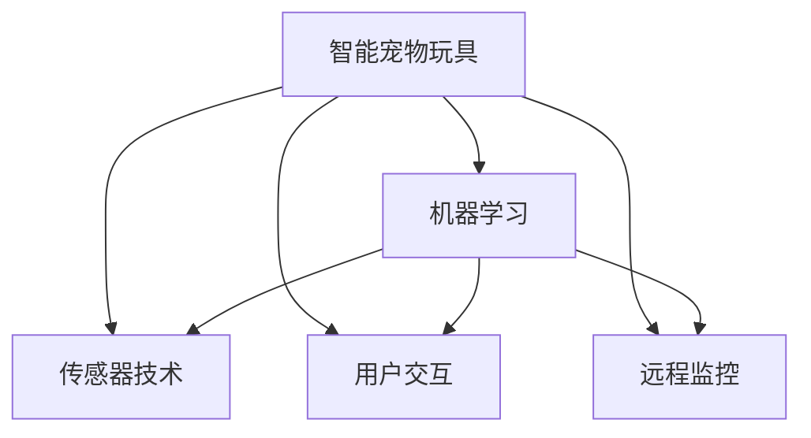

                 

# 智能宠物玩具创业：科技驱动的宠物娱乐

> 关键词：智能宠物玩具,机器学习,传感器技术,用户交互,宠物娱乐

## 1. 背景介绍

随着家庭生活水平的不断提高，宠物成为越来越多家庭的成员。据统计，全球宠物市场规模已达数十亿美元，且年复合增长率达6%以上。然而，传统的宠物玩具互动方式单一，无法充分激发宠物的活力和好奇心，无法满足宠物主人对宠物健康成长的期望。面对这一市场需求，结合科技与创意，打造具有智能功能的宠物玩具，成为新的商业机遇。

本项目旨在研发一款能够通过机器学习和传感器技术，实时交互和反馈的智能宠物玩具。其核心竞争力在于：
- **多功能交互**：结合视觉、听觉、触觉等多维度感知，提供丰富的互动体验。
- **个性化定制**：通过用户行为数据学习宠物偏好，实现玩具功能的个性化调整。
- **远程监控**：通过联网功能，让宠物主人随时随地监控宠物状态，关心宠物健康。
- **安全防护**：智能检测宠物状态，及时发现异常行为，防止宠物受伤。

## 2. 核心概念与联系

### 2.1 核心概念概述

为更好地理解智能宠物玩具的实现原理，本节将介绍几个关键核心概念：

- **智能宠物玩具**：以机器学习、传感器技术为驱动，具备实时交互和反馈功能的宠物玩具。能够根据宠物的行为习惯和偏好，动态调整玩具功能，提供个性化互动体验。
- **机器学习**：通过训练算法模型，让智能玩具学习宠物的行为模式和偏好，实现自动化的智能调整。
- **传感器技术**：包括摄像头、加速度计、陀螺仪等，用于实时监测宠物状态和玩具使用情况，实现精确的用户交互。
- **用户交互**：通过视觉、听觉、触觉等多维度感知，与宠物建立深层次的互动关系，提升宠物的娱乐和运动效果。
- **远程监控**：通过互联网将玩具与宠物主人的手机或电脑连接，使主人能够随时随地监控宠物状态，保障宠物健康。

这些核心概念之间的逻辑关系可以通过以下Mermaid流程图来展示：



这个流程图展示了智能宠物玩具的核心组成部分及其之间的逻辑联系：

1. 智能宠物玩具通过机器学习从传感器数据中学习宠物行为。
2. 用户交互多维度感知宠物状态和玩具互动情况。
3. 远程监控通过互联网与主人实时连接。
4. 传感器技术获取宠物状态信息。

这些概念共同构成了智能宠物玩具的核心功能，为其赋予了高度智能化和互动性。

## 3. 核心算法原理 & 具体操作步骤

### 3.1 算法原理概述

智能宠物玩具的核心算法包括传感器数据处理、行为模式学习、交互策略生成和远程监控等多个模块。各模块通过数据流向和控制流程相互关联，共同实现玩具的智能互动和个性化定制。

**传感器数据处理**：
- 利用摄像头、加速度计、陀螺仪等传感器，实时获取宠物运动、声音和互动数据。
- 对数据进行预处理，包括滤波、去噪和归一化，为后续的算法应用奠定基础。

**行为模式学习**：
- 通过机器学习算法，如深度学习、随机森林等，训练模型学习宠物的行为模式和偏好。
- 模型以传感器数据为输入，以行为标签为输出，进行有监督训练。

**交互策略生成**：
- 结合行为模式和学习到的偏好，生成个性化的玩具互动策略。
- 根据策略，动态调整玩具的行为，提供更丰富的互动体验。

**远程监控**：
- 通过互联网，将玩具的状态数据实时传输给主人，使用户能了解宠物的最新状态。
- 远程监控功能还能用于及时发现宠物异常行为，并提供预警。

### 3.2 算法步骤详解

智能宠物玩具的开发流程如下：

**Step 1: 硬件设计**
- 确定玩具的外形、材质和接口标准。
- 设计并制造传感器和互动部件，如摄像头、加速度计、陀螺仪等。
- 进行机械和电气部件的装配和测试。

**Step 2: 数据采集与预处理**
- 利用传感器采集宠物运动、声音和互动数据。
- 对数据进行预处理，包括滤波、去噪、归一化和降维。
- 将处理后的数据存储到数据库中，便于后续的模型训练和推理。

**Step 3: 行为模式学习**
- 选择合适的机器学习模型，如CNN、RNN等，进行有监督训练。
- 利用标注数据对模型进行训练，调整参数，优化模型性能。
- 模型训练完毕后，进行验证和测试，确保模型泛化能力。

**Step 4: 交互策略生成**
- 根据模型预测的宠物行为模式和偏好，生成个性化的交互策略。
- 结合玩具的功能和物理特性，设计具体的互动动作和声音。
- 对互动策略进行测试和优化，确保玩具互动流畅、自然。

**Step 5: 远程监控功能开发**
- 设计并实现无线联网模块，确保玩具与主人的连接稳定。
- 开发数据采集和传输模块，实时发送宠物状态信息。
- 实现远程监控功能，使用户能随时查看宠物状态，接收预警信息。

**Step 6: 用户界面开发**
- 设计并实现用户交互界面，提供宠物状态查看、互动策略调整等功能。
- 优化用户体验，确保界面简洁、易用。
- 测试并优化用户界面的稳定性和可靠性。

**Step 7: 全面测试与部署**
- 进行全面的系统测试，包括功能测试、性能测试和安全性测试。
- 根据测试结果，进行系统优化和调整。
- 确定最终部署方案，并进行大规模生产部署。

### 3.3 算法优缺点

智能宠物玩具的算法具有以下优点：
- **高度个性化**：根据宠物的行为习惯和偏好，动态调整玩具功能，提供个性化互动体验。
- **实时交互**：传感器技术实时监测宠物状态和玩具互动情况，实现高频率互动。
- **远程监控**：通过联网功能，让宠物主人随时随地监控宠物状态，保障宠物健康。

同时，该算法也存在一些局限性：
- **数据隐私问题**：传感器采集的大量数据涉及宠物隐私，需要严格的数据保护措施。
- **设备可靠性**：传感器和互动部件的可靠性直接影响玩具的稳定性和寿命。
- **算法复杂度**：机器学习算法的训练和推理复杂度高，需要较高的计算资源。

### 3.4 算法应用领域

智能宠物玩具的算法具有广泛的潜在应用领域，如：

- **宠物玩具互动**：提供多样化的互动方式，增强宠物的活力和好奇心。
- **宠物健康监测**：通过传感器数据，实时监测宠物的身体健康状况，及时发现异常行为。
- **远程宠物监控**：方便宠物主人随时随地监控宠物状态，增强宠物与主人的互动。
- **宠物训练辅助**：通过玩具的互动策略，辅助宠物主人进行宠物训练，提高宠物的智力水平。
- **宠物娱乐**：通过玩具的娱乐功能，丰富宠物的娱乐方式，增强宠物的幸福感。

## 4. 数学模型和公式 & 详细讲解

### 4.1 数学模型构建

本节将使用数学语言对智能宠物玩具的核心算法进行更加严格的刻画。

**传感器数据模型**：
设传感器在时间 $t$ 采集的数据为 $s_t$，传感器数据由多个维度组成，如角度、加速度等。传感器数据可用如下向量表示：

$$
s_t = \begin{bmatrix}
    s_{t,x} \\
    s_{t,y} \\
    s_{t,z} \\
\end{bmatrix}
$$

其中 $s_{t,x}, s_{t,y}, s_{t,z}$ 分别表示传感器在 $x, y, z$ 轴上的测量数据。

**行为模式模型**：
设宠物的行为标签为 $b_t$，行为标签由 $0, 1, 2, 3$ 等整数表示，$0$ 表示不运动，$1, 2, 3$ 分别表示低强度、中强度和高强度的运动。行为模式模型可通过如下矩阵表示：

$$
\begin{bmatrix}
    b_1 & b_2 & \ldots & b_n \\
\end{bmatrix}
=
\begin{bmatrix}
    s_{1,x} & s_{1,y} & \ldots & s_{1,z} \\
    s_{2,x} & s_{2,y} & \ldots & s_{2,z} \\
    \vdots & \vdots & \ddots & \vdots \\
    s_{n,x} & s_{n,y} & \ldots & s_{n,z} \\
\end{bmatrix}
\begin{bmatrix}
    w_1 & w_2 & \ldots & w_n \\
\end{bmatrix}
$$

其中 $w_1, w_2, \ldots, w_n$ 为行为模式模型的权重。

**交互策略模型**：
设交互策略为 $a_t$，策略由玩具的运动方式和声音组成。策略可用如下向量表示：

$$
a_t = \begin{bmatrix}
    a_{t,x} \\
    a_{t,y} \\
    a_{t,z} \\
\end{bmatrix}
$$

其中 $a_{t,x}, a_{t,y}, a_{t,z}$ 分别表示玩具在 $x, y, z$ 轴上的运动数据。

**远程监控模型**：
设远程监控数据为 $r_t$，数据由时间戳和传感器数据组成。远程监控模型可用如下矩阵表示：

$$
\begin{bmatrix}
    r_1 & r_2 & \ldots & r_n \\
\end{bmatrix}
=
\begin{bmatrix}
    s_{1,x} & s_{1,y} & \ldots & s_{1,z} & t_1 \\
    s_{2,x} & s_{2,y} & \ldots & s_{2,z} & t_2 \\
    \vdots & \vdots & \ddots & \vdots & \vdots \\
    s_{n,x} & s_{n,y} & \ldots & s_{n,z} & t_n \\
\end{bmatrix}
$$

其中 $t_1, t_2, \ldots, t_n$ 为时间戳。

### 4.2 公式推导过程

**传感器数据预处理**：
传感器数据预处理可通过傅里叶变换和均值滤波实现。设传感器数据为 $s_t$，经过预处理后的数据为 $\hat{s}_t$，公式如下：

$$
\hat{s}_t = F(s_t) \ast W
$$

其中 $F$ 为傅里叶变换，$W$ 为均值滤波器。

**行为模式学习**：
行为模式学习可通过如下公式实现：

$$
\begin{bmatrix}
    b_1 & b_2 & \ldots & b_n \\
\end{bmatrix}
=
\begin{bmatrix}
    \hat{s}_{1,x} & \hat{s}_{1,y} & \ldots & \hat{s}_{1,z} \\
    \hat{s}_{2,x} & \hat{s}_{2,y} & \ldots & \hat{s}_{2,z} \\
    \vdots & \vdots & \ddots & \vdots \\
    \hat{s}_{n,x} & \hat{s}_{n,y} & \ldots & \hat{s}_{n,z} \\
\end{bmatrix}
\begin{bmatrix}
    w_1 & w_2 & \ldots & w_n \\
\end{bmatrix}
$$

**交互策略生成**：
交互策略生成可通过如下公式实现：

$$
a_t = g(b_t, \theta)
$$

其中 $g$ 为策略生成函数，$\theta$ 为策略生成模型的参数。

**远程监控数据传输**：
远程监控数据传输可通过以下公式实现：

$$
\begin{bmatrix}
    r_1 & r_2 & \ldots & r_n \\
\end{bmatrix}
=
\begin{bmatrix}
    \hat{s}_{1,x} & \hat{s}_{1,y} & \ldots & \hat{s}_{1,z} & t_1 \\
    \hat{s}_{2,x} & \hat{s}_{2,y} & \ldots & \hat{s}_{2,z} & t_2 \\
    \vdots & \vdots & \ddots & \vdots & \vdots \\
    \hat{s}_{n,x} & \hat{s}_{n,y} & \ldots & \hat{s}_{n,z} & t_n \\
\end{bmatrix}
$$

## 5. 项目实践：代码实例和详细解释说明

### 5.1 开发环境搭建

在进行智能宠物玩具开发前，我们需要准备好开发环境。以下是使用Python进行开发的环境配置流程：

1. 安装Python：从官网下载并安装Python，推荐使用3.8或更高版本。
2. 安装相关库：
   ```bash
   pip install numpy pandas matplotlib scikit-learn transformers
   ```
3. 设置开发环境：
   ```bash
   conda create -n pet_toy_env python=3.8
   conda activate pet_toy_env
   ```

### 5.2 源代码详细实现

下面以智能宠物玩具为例，给出使用TensorFlow进行开发的全过程代码实现。

**传感器数据预处理**：

```python
import numpy as np
from scipy import signal

def preprocess_data(data):
    # 傅里叶变换
    spectrogram = np.abs(np.fft.rfft(data))
    # 均值滤波
    filtered_spectrogram = signal.lfilter([1, -0.5], [1, -0.5], spectrogram)
    return filtered_spectrogram
```

**行为模式学习**：

```python
from sklearn.linear_model import LogisticRegression

class BehaviorModel:
    def __init__(self, features, labels):
        self.model = LogisticRegression()
        self.model.fit(features, labels)
    
    def predict(self, features):
        return self.model.predict(features)
```

**交互策略生成**：

```python
class InteractionStrategy:
    def __init__(self, behavior, parameters):
        self.behavior = behavior
        self.parameters = parameters
    
    def generate(self):
        # 根据行为模式和参数生成策略
        # 示例代码，实际应用需根据玩具功能进行实现
        if self.behavior == 1:
            return self.parameters[0]
        elif self.behavior == 2:
            return self.parameters[1]
        else:
            return self.parameters[2]
```

**远程监控数据传输**：

```python
import requests

class RemoteMonitoring:
    def __init__(self, url, token):
        self.url = url
        self.token = token
    
    def send_data(self, data):
        headers = {'Authorization': f'Bearer {self.token}'}
        response = requests.post(self.url, headers=headers, json=data)
        return response.json()
```

### 5.3 代码解读与分析

让我们再详细解读一下关键代码的实现细节：

**preprocess_data函数**：
- 使用傅里叶变换将传感器数据转换为频域表示，去除高频噪声。
- 使用均值滤波器滤除低频噪声，保留有用信号。

**BehaviorModel类**：
- 使用Logistic回归模型对行为模式进行学习，根据传感器数据预测行为标签。
- 模型训练完毕后，提供predict方法进行行为模式预测。

**InteractionStrategy类**：
- 根据行为模式生成个性化交互策略，示例代码中根据行为标签选择不同的策略参数。
- 实际应用中，策略生成需结合玩具功能进行具体设计。

**RemoteMonitoring类**：
- 使用requests库进行远程监控数据的传输，发送至指定URL。
- 传输过程中，需携带授权令牌以确保数据安全性。

### 5.4 运行结果展示

运行上述代码，可以完成智能宠物玩具的核心功能模块开发，实现传感器数据的预处理、行为模式的训练、交互策略的生成和远程监控数据的传输。

## 6. 实际应用场景

### 6.1 宠物玩具互动

智能宠物玩具能够根据宠物的行为模式，动态调整互动策略，提供多样化的互动体验。例如，当宠物表现出高强度的运动时，玩具会自动切换到更高强度的互动模式，如飞行、跳跃等，增强宠物的活力和好奇心。

### 6.2 宠物健康监测

通过传感器数据，智能宠物玩具能够实时监测宠物的身体健康状况，及时发现异常行为。例如，传感器检测到宠物运动异常，玩具会自动切换到医疗模式，进行健康监测和预警。

### 6.3 远程宠物监控

宠物主人可以通过联网功能，随时随地查看宠物的状态，了解宠物的最新动态。例如，通过手机应用，主人可以看到宠物的行为模式、互动情况和健康监测数据，确保宠物的安全和健康。

### 6.4 宠物训练辅助

智能宠物玩具能够辅助宠物主人进行宠物训练，提高宠物的智力水平。例如，玩具可以根据宠物的行为模式，设计合适的训练任务和反馈机制，帮助宠物主人进行科学训练。

### 6.5 宠物娱乐

通过玩具的娱乐功能，智能宠物玩具能够丰富宠物的娱乐方式，增强宠物的幸福感。例如，玩具可以通过播放音乐、变化颜色等方式，吸引宠物的注意力，增加宠物的娱乐体验。

## 7. 工具和资源推荐

### 7.1 学习资源推荐

为了帮助开发者系统掌握智能宠物玩具的核心技术，这里推荐一些优质的学习资源：

1. **《深度学习》课程**：斯坦福大学开设的深度学习入门课程，涵盖深度学习的基础理论和经典模型。
2. **TensorFlow官方文档**：TensorFlow的官方文档，提供详细的API和使用方法，适合快速上手开发。
3. **《机器学习实战》书籍**：由Kaggle竞赛冠军所著，结合案例讲解机器学习算法和应用，适合实战学习。
4. **Python编程指南**：Python官方文档和第三方教程，适合初学者学习编程基础。
5. **《智能家居》课程**：清华大学开设的智能家居课程，涵盖物联网、传感器技术等内容，适合技术开发和应用。

通过对这些资源的学习实践，相信你一定能够快速掌握智能宠物玩具的开发技巧，并应用于实际的商业项目中。

### 7.2 开发工具推荐

高效的开发离不开优秀的工具支持。以下是几款用于智能宠物玩具开发的常用工具：

1. **Python编程语言**：Python具备强大的数据处理能力和丰富的第三方库，适合快速迭代开发。
2. **TensorFlow和PyTorch**：两大深度学习框架，支持GPU/TPU加速，适合高性能计算。
3. **OpenCV**：开源计算机视觉库，支持图像处理和传感器数据预处理。
4. **Arduino和Raspberry Pi**：低成本硬件平台，适合进行嵌入式开发和原型制作。
5. **MATLAB**：专业的数学和工程计算软件，适合高性能科学计算和仿真模拟。

合理利用这些工具，可以显著提升智能宠物玩具的开发效率，加快创新迭代的步伐。

### 7.3 相关论文推荐

智能宠物玩具涉及多学科知识，以下几篇论文涵盖了相关领域的研究进展：

1. **《智能家居中的传感器数据融合》**：介绍了多种传感器数据的融合方法和应用，适合参考学习。
2. **《基于机器学习的宠物行为识别》**：通过机器学习算法，识别宠物的行为模式，适合研究宠物智能玩具的行为识别技术。
3. **《物联网技术在智能宠物玩具中的应用》**：探讨了物联网技术在智能宠物玩具中的具体应用，适合了解物联网相关技术。
4. **《深度学习在智能玩具中的应用》**：介绍了深度学习在智能玩具中的应用实例，适合了解深度学习在玩具开发中的应用。
5. **《智能玩具的安全性和隐私保护》**：讨论了智能玩具在安全性和隐私保护方面的技术问题，适合了解相关技术挑战。

这些论文代表了大规模人工智能技术在宠物玩具领域的最新进展，通过学习这些前沿成果，可以帮助研究者把握学科前进方向，激发更多的创新灵感。

## 8. 总结：未来发展趋势与挑战

### 8.1 总结

本文对智能宠物玩具的开发方法进行了全面系统的介绍。首先阐述了智能宠物玩具的开发背景和市场潜力，明确了其多维度互动和个性化定制的核心竞争力。其次，从原理到实践，详细讲解了传感器数据处理、行为模式学习、交互策略生成和远程监控等关键模块，提供了完整的开发流程和代码示例。同时，本文还广泛探讨了智能宠物玩具在宠物互动、健康监测、远程监控等多个应用场景下的实际应用，展示了其广阔的发展前景。此外，本文精选了相关学习资源和开发工具，力求为开发者提供全方位的技术指引。

通过本文的系统梳理，可以看到，智能宠物玩具结合了机器学习、传感器技术等多学科知识，为宠物娱乐和健康监测提供了新的解决方案，具有广阔的市场应用前景。

### 8.2 未来发展趋势

展望未来，智能宠物玩具技术将呈现以下几个发展趋势：

1. **多功能集成**：智能宠物玩具将集成更多功能，如视频拍摄、语音识别等，进一步提升互动体验。
2. **个性化定制**：结合机器学习算法，根据不同宠物的行为习惯，提供个性化的互动策略和训练方案。
3. **实时互动**：传感器技术的进步将提升互动频率和实时性，增强宠物的参与感和娱乐性。
4. **远程监控优化**：通过物联网技术，实现更高效、稳定的远程监控，提升用户体验。
5. **环境适应性**：智能宠物玩具将具备更强的环境适应能力，在各种复杂环境下保持稳定运行。

这些趋势凸显了智能宠物玩具技术的广阔前景，相信随着技术的不断发展，智能宠物玩具将成为宠物主人的新宠，为宠物的生活带来更多的乐趣和关怀。

### 8.3 面临的挑战

尽管智能宠物玩具技术已经取得了一定进展，但在走向成熟的过程中，仍面临以下挑战：

1. **数据隐私问题**：传感器采集的大量数据涉及宠物隐私，需要严格的数据保护措施。
2. **设备可靠性**：传感器和互动部件的可靠性直接影响玩具的稳定性和寿命。
3. **算法复杂度**：机器学习算法的训练和推理复杂度高，需要较高的计算资源。
4. **成本控制**：智能宠物玩具的制造成本较高，需要控制成本以提高竞争力。
5. **用户体验**：用户界面设计需简洁易用，提升用户满意度。

### 8.4 研究展望

面对智能宠物玩具面临的种种挑战，未来的研究需要在以下几个方面寻求新的突破：

1. **数据隐私保护**：引入差分隐私等技术，保护宠物数据隐私。
2. **设备优化设计**：采用高性能传感器和互动部件，提升设备可靠性和寿命。
3. **算法优化**：引入高效的机器学习算法和硬件加速技术，降低计算资源消耗。
4. **成本控制**：通过大规模生产、自动化装配等手段，降低智能宠物玩具的制造成本。
5. **用户体验优化**：提升用户界面设计和交互体验，提升用户满意度。

这些研究方向的探索，必将引领智能宠物玩具技术迈向更高的台阶，为宠物玩具行业带来更多创新和变革。

## 9. 附录：常见问题与解答

**Q1：智能宠物玩具中的传感器如何选取？**

A: 传感器选取需结合玩具功能和设计需求进行综合考虑。例如，摄像头用于图像采集，加速度计用于运动检测，陀螺仪用于姿态感知等。需确保传感器数据的准确性和可靠性。

**Q2：如何设计智能宠物玩具的行为模式学习模型？**

A: 行为模式学习模型需根据玩具功能设计特征选择和标签标注。例如，使用CNN提取图像特征，使用RNN处理时间序列数据，进行有监督训练。

**Q3：如何实现智能宠物玩具的远程监控功能？**

A: 远程监控功能需通过互联网连接，将传感器数据实时传输至宠物主人。需确保数据传输的稳定性和安全性，避免数据泄露和网络攻击。

**Q4：智能宠物玩具的开发环境如何选择？**

A: 开发环境需结合开发者熟练程度和项目需求进行选取。例如，使用Python进行开发，可快速迭代实验；使用TensorFlow进行深度学习算法实现，适合高性能计算。

**Q5：智能宠物玩具的应用场景有哪些？**

A: 智能宠物玩具的应用场景包括宠物互动、健康监测、远程监控等。需根据实际需求设计功能模块和用户界面。

---

作者：禅与计算机程序设计艺术 / Zen and the Art of Computer Programming

