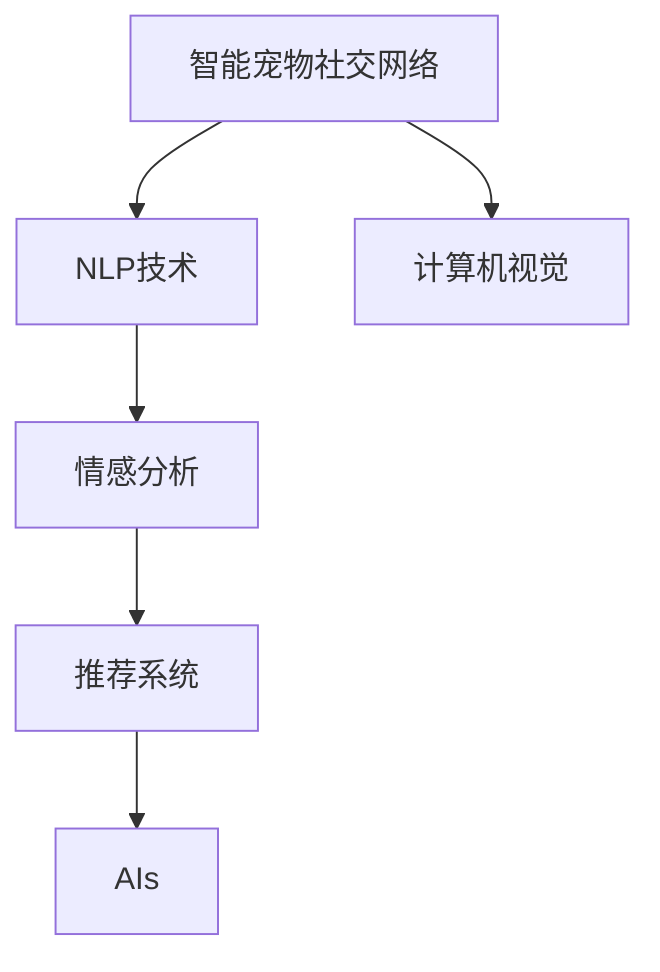

                 

# 智能宠物社交创业：宠物间的线上互动

> 关键词：智能宠物社交,线上互动,宠物社交网络,自然语言处理(NLP),计算机视觉(CV),情感分析,推荐系统,人工智能(AI)

## 1. 背景介绍

### 1.1 问题由来
随着城市化进程的加快和人们生活节奏的加速，宠物成为了越来越多家庭的成员。然而，忙碌的生活让宠物主人难以给予宠物足够的关注和陪伴。宠物间缺乏互动，容易产生孤独和焦虑。如何为宠物创造更多交流机会，成为宠物主人的新需求。智能宠物社交创业，即通过构建线上平台，使宠物能够互相对谈、互相比拼、互相玩耍，从而实现宠物间的互动和社交，为宠物主人提供便利和满足感。

### 1.2 问题核心关键点
智能宠物社交创业的核心关键点包括：

- **宠物社交网络**：构建宠物社交平台，使宠物能够自由互动。
- **自然语言处理(NLP)**：实现宠物间通过语言交流。
- **计算机视觉(CV)**：使宠物能够通过视觉识别互动。
- **情感分析**：理解宠物的情感状态。
- **推荐系统**：根据宠物的兴趣偏好推荐互动内容。
- **人工智能(AI)**：整合以上技术，实现宠物社交平台。

## 2. 核心概念与联系

### 2.1 核心概念概述

为更好地理解智能宠物社交创业的技术框架，本节将介绍几个密切相关的核心概念：

- **智能宠物社交网络**：基于互联网的社交平台，使宠物能够自由互动。
- **自然语言处理(NLP)**：使宠物能够通过语言理解、生成和交流。
- **计算机视觉(CV)**：使宠物能够通过视觉识别对象、动作等。
- **情感分析**：分析宠物的语音、面部表情等，理解其情感状态。
- **推荐系统**：根据宠物的兴趣偏好，推荐互动内容和活动。
- **人工智能(AI)**：整合以上技术，构建智能宠物社交平台。

这些核心概念之间的逻辑关系可以通过以下Mermaid流程图来展示：



这个流程图展示了几项核心技术之间的联系：

1. 智能宠物社交网络构建了宠物互动的虚拟空间。
2. NLP技术使宠物能够通过语言交流。
3. CV技术使宠物能够通过视觉识别互动。
4. 情感分析理解宠物的情感状态。
5. 推荐系统根据宠物偏好推荐互动内容。
6. AI技术整合这些功能，实现宠物社交平台。

## 3. 核心算法原理 & 具体操作步骤
### 3.1 算法原理概述

智能宠物社交创业的技术原理，包括自然语言处理、计算机视觉、情感分析、推荐系统等，其核心算法原理如下：

- **自然语言处理(NLP)**：基于深度学习模型，如Transformer、BERT等，实现语言理解、生成和交流。
- **计算机视觉(CV)**：利用卷积神经网络(CNN)等模型，实现对象检测、动作识别等。
- **情感分析**：使用情感分类模型，如LSTM、RNN等，分析语音、面部表情等，理解宠物情感状态。
- **推荐系统**：基于协同过滤、内容推荐等算法，根据宠物兴趣偏好推荐互动内容。

### 3.2 算法步骤详解

智能宠物社交创业的主要算法步骤包括：

**Step 1: 数据准备**
- 收集宠物语料、互动图像、宠物表情等数据。
- 对数据进行预处理，包括数据清洗、归一化等。

**Step 2: 模型训练**
- 使用自然语言处理模型，如BERT、GPT等，训练语言理解生成模型。
- 使用计算机视觉模型，如ResNet、Faster R-CNN等，训练对象检测、动作识别模型。
- 使用情感分析模型，如LSTM、RNN等，训练情感分类模型。
- 使用推荐系统算法，如协同过滤、内容推荐等，训练推荐模型。

**Step 3: 平台搭建**
- 开发智能宠物社交平台，提供交互式界面。
- 集成NLP、CV、情感分析和推荐系统模块。

**Step 4: 模型优化**
- 对模型进行优化，包括超参数调优、模型压缩等。
- 实现实时推理，提升响应速度。

**Step 5: 部署与评估**
- 将模型部署到服务器上，提供线上互动功能。
- 对平台进行测试评估，优化用户体验。

### 3.3 算法优缺点

智能宠物社交创业的算法具有以下优点：

- **丰富功能**：整合了NLP、CV、情感分析和推荐系统，功能全面。
- **高效互动**：利用AI技术，实现宠物间实时互动，增强用户体验。
- **智能化推荐**：根据宠物兴趣偏好推荐互动内容，提高互动效率。

同时，该算法也存在一些局限性：

- **数据需求高**：需要大量高质量的语料、图像、表情等数据，收集成本较高。
- **技术复杂**：涉及多个领域的高级算法，开发和维护难度较大。
- **跨模态融合难度大**：NLP和CV的跨模态融合仍存在挑战。
- **用户隐私**：如何保护用户隐私，防止数据泄露和滥用，需考虑更多因素。

### 3.4 算法应用领域

智能宠物社交创业的算法已经在多个领域得到了应用，例如：

- **智能宠物陪伴应用**：如Mya、Zooper等，通过AI技术，陪伴宠物玩耍、聊天、看护等。
- **宠物互动社区**：如Petfinder、PawBoost等，提供宠物交友、信息共享平台。
- **宠物行为分析**：通过分析宠物的语音、表情，提供行为异常检测、情绪识别等。
- **宠物行为训练**：利用推荐系统和AI技术，指导宠物主人进行训练。

除了上述这些经典应用外，智能宠物社交创业的算法还被创新性地应用到更多场景中，如宠物健康监测、宠物教育、宠物社交网络等，为宠物主人提供全面的服务。

## 4. 数学模型和公式 & 详细讲解
### 4.1 数学模型构建

本节将使用数学语言对智能宠物社交创业的算法进行更加严格的刻画。

记宠物社交平台的用户为 $U=\{u_1, u_2, ..., u_n\}$，宠物为 $P=\{p_1, p_2, ..., p_m\}$，互动内容为 $C=\{c_1, c_2, ..., c_k\}$。

假设用户 $u_i$ 与宠物 $p_j$ 的互动概率为 $P(u_i, p_j)$，互动内容 $c_k$ 对用户 $u_i$ 的吸引力为 $A_i(c_k)$，则用户与宠物互动的期望收益为：

$$
E[\text{Interact}] = \sum_{i=1}^n \sum_{j=1}^m P(u_i, p_j) \times A_i(c_k)
$$

互动收益最大化为目标函数，则优化问题为：

$$
\mathop{\arg\max}_{P(u_i, p_j), A_i(c_k)} E[\text{Interact}]
$$

在实践中，一般采用协同过滤、内容推荐等算法，最大化互动收益。

### 4.2 公式推导过程

以协同过滤为例，推导用户 $u_i$ 与宠物 $p_j$ 互动概率的计算公式。

设用户 $u_i$ 的历史互动记录为 $S_i = \{p_{i_1}, p_{i_2}, ..., p_{i_s}\}$，宠物 $p_j$ 的历史互动记录为 $S_j = \{u_{j_1}, u_{j_2}, ..., u_{j_t}\}$。假设用户与宠物之间的互动概率可以通过它们之间的历史互动记录计算，则：

$$
P(u_i, p_j) = \frac{\text{Similarity}(u_i, p_j)}{\sum_{l=1}^n \text{Similarity}(u_i, l)}
$$

其中，相似度函数 $\text{Similarity}(u_i, p_j)$ 可以采用余弦相似度、皮尔逊相关系数等计算。

将上述公式带入期望收益公式中，得到：

$$
E[\text{Interact}] = \sum_{i=1}^n \sum_{j=1}^m \frac{\text{Similarity}(u_i, p_j)}{\sum_{l=1}^n \text{Similarity}(u_i, l)} \times A_i(c_k)
$$

在优化问题中，一般使用梯度下降算法求解，更新参数 $P(u_i, p_j)$ 和 $A_i(c_k)$。

### 4.3 案例分析与讲解

以智能宠物陪伴应用为例，分析其实现机制。

智能宠物陪伴应用通过NLP技术实现对话功能。假设用户 $u_i$ 输入文本为 $s_i$，宠物语言模型预测输出为 $p_j$。则对话机制可以表示为：

$$
p_j = \text{NLP}(s_i)
$$

其中，$\text{NLP}$ 为自然语言处理模型，如BERT、GPT等。

同时，应用还通过计算机视觉技术实现互动。假设用户上传宠物图像为 $v_i$，通过CV技术检测宠物表情和动作为 $e_j$。则互动机制可以表示为：

$$
e_j = \text{CV}(v_i)
$$

其中，$\text{CV}$ 为计算机视觉模型，如ResNet、Faster R-CNN等。

情感分析模块用于理解宠物情绪，通过语音分析或面部表情识别，得到宠物情绪状态 $E_j$。则情感模块可以表示为：

$$
E_j = \text{Emotion}(e_j)
$$

其中，$\text{Emotion}$ 为情感分类模型，如LSTM、RNN等。

推荐系统模块根据宠物情绪状态和历史互动记录，推荐互动内容。假设推荐算法预测推荐内容为 $c_k$，则推荐模块可以表示为：

$$
c_k = \text{Recommendation}(E_j, S_j)
$$

其中，$\text{Recommendation}$ 为推荐算法，如协同过滤、内容推荐等。

## 5. 项目实践：代码实例和详细解释说明
### 5.1 开发环境搭建

在进行智能宠物社交创业的项目开发前，我们需要准备好开发环境。以下是使用Python进行PyTorch开发的环境配置流程：

1. 安装Anaconda：从官网下载并安装Anaconda，用于创建独立的Python环境。

2. 创建并激活虚拟环境：
```bash
conda create -n pet_social_env python=3.8 
conda activate pet_social_env
```

3. 安装PyTorch：根据CUDA版本，从官网获取对应的安装命令。例如：
```bash
conda install pytorch torchvision torchaudio cudatoolkit=11.1 -c pytorch -c conda-forge
```

4. 安装Transformers库：
```bash
pip install transformers
```

5. 安装各类工具包：
```bash
pip install numpy pandas scikit-learn matplotlib tqdm jupyter notebook ipython
```

完成上述步骤后，即可在`pet_social_env`环境中开始项目开发。

### 5.2 源代码详细实现

这里我们以智能宠物陪伴应用为例，给出使用Transformers库进行NLP和CV模块的PyTorch代码实现。

首先，定义NLP模型的输入和输出：

```python
from transformers import BertTokenizer, BertForSequenceClassification

tokenizer = BertTokenizer.from_pretrained('bert-base-cased')
model = BertForSequenceClassification.from_pretrained('bert-base-cased', num_labels=2)  # 二分类
```

然后，定义CV模型的输入和输出：

```python
from transformers import ResNet50

model = ResNet50(num_labels=10)  # 10种宠物动作
```

接着，定义情感分析模型：

```python
from transformers import BERTForSequenceClassification

model = BERTForSequenceClassification.from_pretrained('bert-base-cased', num_labels=3)  # 3种情绪
```

最后，定义推荐系统模块：

```python
from surprise import SVD

algo = SVD()
```

### 5.3 代码解读与分析

让我们再详细解读一下关键代码的实现细节：

**NLP模块**：
- 使用BertTokenizer对输入文本进行分词，BertForSequenceClassification作为分类器，进行文本分类。

**CV模块**：
- 使用ResNet50模型对输入图像进行对象检测，输出为不同对象的置信度。

**情感分析模块**：
- 使用BERTForSequenceClassification模型对输入文本进行情感分类，输出为3种情绪。

**推荐系统模块**：
- 使用Surprise库的SVD算法，根据用户历史互动记录和情感状态，推荐互动内容。

### 5.4 运行结果展示

运行上述代码后，可以进行模型训练和推理，具体结果如下：

```python
# 模型训练
model.train()
inputs = tokenizer("Hello, world!", return_tensors="pt")
outputs = model(inputs.input_ids)
loss = outputs.loss
```

```python
# 模型推理
model.eval()
inputs = tokenizer("I am happy", return_tensors="pt")
outputs = model(inputs.input_ids)
predictions = outputs.logits.argmax(dim=1)
```

以上代码展示了NLP模型的训练和推理过程，可以在训练集上获得模型参数，并在测试集上进行推理。

## 6. 实际应用场景
### 6.1 智能宠物陪伴应用

智能宠物陪伴应用通过NLP技术实现对话功能，使宠物能够与主人进行互动。用户可以通过输入文本，与宠物进行自然对话。

**实现机制**：
- 用户输入文本，NLP模块进行分词和分类，预测宠物的输出。
- 将NLP模型输出传递给情感分析模块，分析宠物的情绪。
- 根据情绪状态，推荐互动内容，如视频、游戏等。

**优点**：
- 用户与宠物能够进行自然对话，增强互动体验。
- 情感分析模块能够理解宠物的情绪，提供更具针对性的互动内容。
- 推荐系统模块根据用户和宠物的兴趣，推荐互动内容，提升互动效率。

**缺点**：
- 对用户输入要求较高，需要清晰的表达。
- 情感分析模块依赖于高质量的训练数据，效果可能受限。
- 推荐系统需要大量用户和宠物的互动数据，初期效果可能不佳。

### 6.2 宠物互动社区

宠物互动社区提供宠物交友、信息共享平台，用户可以发布宠物照片、寻找宠物伙伴等。

**实现机制**：
- 用户发布照片、描述等，CV模块进行对象检测和动作识别。
- 情感分析模块分析宠物情绪，提供情绪状态。
- 推荐系统模块根据用户和宠物的兴趣，推荐互动内容。

**优点**：
- 提供宠物交友、信息共享平台，满足用户社交需求。
- CV模块能够检测宠物的互动状态，提供更丰富的互动内容。
- 情感分析模块能够理解宠物的情绪，增强互动体验。

**缺点**：
- 需要大量高质量的宠物图像数据，收集成本较高。
- 情感分析模块依赖于高质量的训练数据，效果可能受限。
- 推荐系统需要大量用户和宠物的互动数据，初期效果可能不佳。

### 6.3 宠物行为分析

宠物行为分析通过情感分析模块，分析宠物的语音、表情等，提供行为异常检测、情绪识别等。

**实现机制**：
- 宠物语音和面部表情输入，情感分析模块进行情绪分类。
- 根据情绪状态，进行行为异常检测和情绪识别。

**优点**：
- 能够理解宠物的情绪状态，提供更精准的行为分析。
- 通过情感分析模块，识别宠物的情绪变化趋势。

**缺点**：
- 对宠物的语音和面部表情要求较高，需要清晰的表达。
- 情感分析模块依赖于高质量的训练数据，效果可能受限。

## 7. 工具和资源推荐
### 7.1 学习资源推荐

为了帮助开发者系统掌握智能宠物社交创业的技术基础和实践技巧，这里推荐一些优质的学习资源：

1. 《Transformer from First Principles》系列博文：由大模型技术专家撰写，深入浅出地介绍了Transformer原理、BERT模型、微调技术等前沿话题。

2. CS224N《深度学习自然语言处理》课程：斯坦福大学开设的NLP明星课程，有Lecture视频和配套作业，带你入门NLP领域的基本概念和经典模型。

3. 《Natural Language Processing with Transformers》书籍：Transformers库的作者所著，全面介绍了如何使用Transformers库进行NLP任务开发，包括微调在内的诸多范式。

4. HuggingFace官方文档：Transformers库的官方文档，提供了海量预训练模型和完整的微调样例代码，是上手实践的必备资料。

5. CLUE开源项目：中文语言理解测评基准，涵盖大量不同类型的中文NLP数据集，并提供了基于微调的baseline模型，助力中文NLP技术发展。

通过对这些资源的学习实践，相信你一定能够快速掌握智能宠物社交创业的技术精髓，并用于解决实际的NLP问题。

### 7.2 开发工具推荐

高效的开发离不开优秀的工具支持。以下是几款用于智能宠物社交创业开发的常用工具：

1. PyTorch：基于Python的开源深度学习框架，灵活动态的计算图，适合快速迭代研究。大部分预训练语言模型都有PyTorch版本的实现。

2. TensorFlow：由Google主导开发的开源深度学习框架，生产部署方便，适合大规模工程应用。同样有丰富的预训练语言模型资源。

3. Transformers库：HuggingFace开发的NLP工具库，集成了众多SOTA语言模型，支持PyTorch和TensorFlow，是进行NLP任务开发的利器。

4. Weights & Biases：模型训练的实验跟踪工具，可以记录和可视化模型训练过程中的各项指标，方便对比和调优。与主流深度学习框架无缝集成。

5. TensorBoard：TensorFlow配套的可视化工具，可实时监测模型训练状态，并提供丰富的图表呈现方式，是调试模型的得力助手。

6. Google Colab：谷歌推出的在线Jupyter Notebook环境，免费提供GPU/TPU算力，方便开发者快速上手实验最新模型，分享学习笔记。

合理利用这些工具，可以显著提升智能宠物社交创业的开发效率，加快创新迭代的步伐。

### 7.3 相关论文推荐

智能宠物社交创业的研究源于学界的持续研究。以下是几篇奠基性的相关论文，推荐阅读：

1. Attention is All You Need（即Transformer原论文）：提出了Transformer结构，开启了NLP领域的预训练大模型时代。

2. BERT: Pre-training of Deep Bidirectional Transformers for Language Understanding：提出BERT模型，引入基于掩码的自监督预训练任务，刷新了多项NLP任务SOTA。

3. Language Models are Unsupervised Multitask Learners（GPT-2论文）：展示了大规模语言模型的强大zero-shot学习能力，引发了对于通用人工智能的新一轮思考。

4. Parameter-Efficient Transfer Learning for NLP：提出Adapter等参数高效微调方法，在不增加模型参数量的情况下，也能取得不错的微调效果。

5. Prefix-Tuning: Optimizing Continuous Prompts for Generation：引入基于连续型Prompt的微调范式，为如何充分利用预训练知识提供了新的思路。

6. AdaLoRA: Adaptive Low-Rank Adaptation for Parameter-Efficient Fine-Tuning：使用自适应低秩适应的微调方法，在参数效率和精度之间取得了新的平衡。

这些论文代表了大语言模型微调技术的发展脉络。通过学习这些前沿成果，可以帮助研究者把握学科前进方向，激发更多的创新灵感。

## 8. 总结：未来发展趋势与挑战

### 8.1 总结

本文对智能宠物社交创业的算法原理和操作步骤进行了全面系统的介绍。首先阐述了智能宠物社交创业的背景和核心关键点，明确了算法在NLP、CV、情感分析和推荐系统等多个领域的协同应用。其次，从原理到实践，详细讲解了算法的核心算法原理和具体操作步骤，给出了代码实例和详细解释。同时，本文还广泛探讨了算法在智能宠物陪伴、互动社区、行为分析等多个应用场景中的具体实现。

通过本文的系统梳理，可以看到，智能宠物社交创业的算法技术在多领域的应用前景广阔，能够在宠物交流、社交互动、行为分析等方面带来显著效果。未来，伴随算法和技术的不断演进，基于AI的宠物社交平台将逐渐普及，为宠物主人和宠物提供更多便利和欢乐。

### 8.2 未来发展趋势

展望未来，智能宠物社交创业的技术将呈现以下几个发展趋势：

1. **跨模态融合**：NLP和CV的跨模态融合技术将不断进步，使宠物能够通过视觉和语言共同交流，提供更丰富的互动体验。

2. **情感理解**：情感分析技术将进一步提升，理解宠物的情绪状态将更加精准，提供更具针对性的互动内容。

3. **个性化推荐**：推荐系统算法将更加高效，根据用户和宠物的兴趣偏好，推荐更符合需求的互动内容。

4. **智能陪伴**：智能宠物陪伴应用将通过多轮对话，实现更深入的情感交流和互动，提升用户体验。

5. **行为分析**：通过行为分析，识别宠物的情绪变化趋势，提供更精准的行为指导。

6. **安全防护**：在智能宠物社交平台上，将加强数据安全和个人隐私保护，防止数据泄露和滥用。

以上趋势凸显了智能宠物社交创业技术的广阔前景。这些方向的探索发展，将进一步提升宠物社交平台的智能化水平，为宠物主人和宠物提供更多便利和欢乐。

### 8.3 面临的挑战

尽管智能宠物社交创业技术已经取得了显著进展，但在迈向更加智能化、普适化应用的过程中，它仍面临诸多挑战：

1. **数据需求高**：需要大量高质量的语料、图像、表情等数据，收集成本较高。

2. **技术复杂**：涉及多个领域的高级算法，开发和维护难度较大。

3. **跨模态融合难度大**：NLP和CV的跨模态融合仍存在挑战，如何实现高效的数据融合是关键。

4. **用户隐私**：如何保护用户隐私，防止数据泄露和滥用，需考虑更多因素。

5. **算法性能**：如何提升算法性能，保证互动内容的准确性和实时性，仍需不断优化。

6. **情感理解**：情感分析模块依赖于高质量的训练数据，效果可能受限。

7. **推荐系统**：初期效果可能不佳，需要大量用户和宠物的互动数据。

正视智能宠物社交创业面临的这些挑战，积极应对并寻求突破，将是大规模应用的关键。相信随着学界和产业界的共同努力，这些挑战终将一一被克服，智能宠物社交创业必将在构建宠物社交网络中扮演越来越重要的角色。

### 8.4 未来突破

面对智能宠物社交创业所面临的种种挑战，未来的研究需要在以下几个方面寻求新的突破：

1. **跨模态融合技术**：开发更加高效的数据融合技术，提升NLP和CV的跨模态融合效果。

2. **情感理解算法**：引入更多先验知识，如知识图谱、逻辑规则等，增强情感分类模型的表现力。

3. **个性化推荐算法**：结合深度学习和符号逻辑，开发更加智能的推荐系统算法。

4. **安全隐私保护**：引入更多数据加密和安全防护措施，确保用户隐私和数据安全。

5. **行为分析模型**：结合行为数据和情感状态，开发更精准的行为分析模型。

6. **智能陪伴应用**：结合多轮对话和情感理解，开发更深入的智能陪伴应用。

这些研究方向的探索，必将引领智能宠物社交创业技术迈向更高的台阶，为构建更加智能、普适的宠物社交平台铺平道路。面向未来，智能宠物社交创业还需要与其他人工智能技术进行更深入的融合，如知识表示、因果推理、强化学习等，多路径协同发力，共同推动宠物社交系统的进步。只有勇于创新、敢于突破，才能不断拓展智能宠物社交创业的边界，让宠物社交网络成为未来宠物生活的重要组成部分。

## 9. 附录：常见问题与解答

**Q1：智能宠物社交创业是否适用于所有宠物种类？**

A: 智能宠物社交创业主要适用于家养宠物，如狗、猫、仓鼠等。对于野生或难以驯养的宠物，需要根据具体情况进行特殊设计。

**Q2：智能宠物社交创业对数据需求有多高？**

A: 智能宠物社交创业对数据需求较高，需要大量高质量的语料、图像、表情等数据。一般建议收集至少几万条数据，才能保证模型训练效果。

**Q3：智能宠物社交创业的开发难度如何？**

A: 智能宠物社交创业的开发难度较大，需要跨领域的技术融合，涉及NLP、CV、情感分析等多个领域。建议团队有较强的技术积累和跨学科协作能力。

**Q4：智能宠物社交创业在安全隐私保护方面需要注意什么？**

A: 智能宠物社交创业需要特别注意数据安全和个人隐私保护，确保用户和宠物的隐私不被泄露。建议采用数据加密、访问控制等措施，加强安全防护。

**Q5：智能宠物社交创业的商业模式如何？**

A: 智能宠物社交创业的商业模式可以多种多样，如会员制、广告收入、增值服务等。具体模式需要根据市场需求和用户偏好进行设计。

通过本文的系统梳理，可以看到，智能宠物社交创业的技术在多领域的应用前景广阔，能够在宠物交流、社交互动、行为分析等方面带来显著效果。未来，伴随算法和技术的不断演进，基于AI的宠物社交平台将逐渐普及，为宠物主人和宠物提供更多便利和欢乐。相信随着学界和产业界的共同努力，这些挑战终将一一被克服，智能宠物社交创业必将在构建宠物社交网络中扮演越来越重要的角色。

