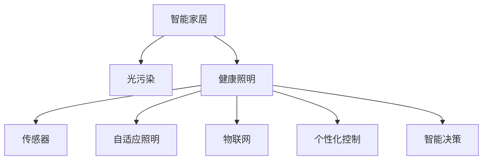
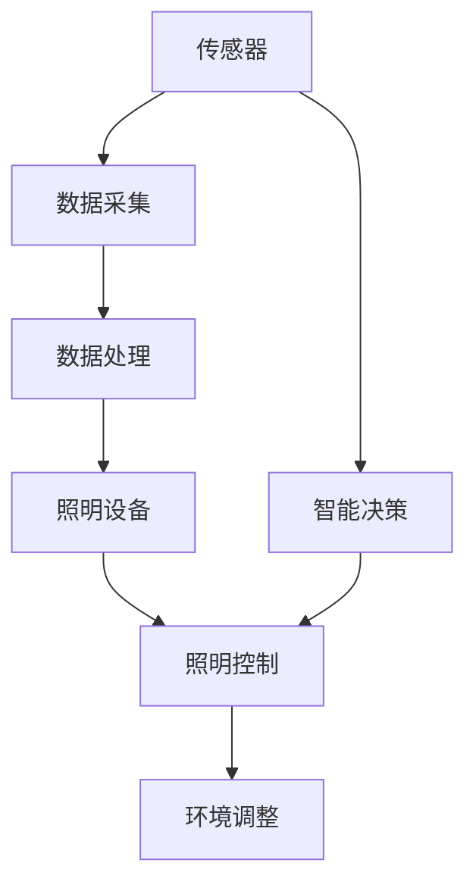

                 

# 智能家居光污染控制创业：健康照明的科技方案

> 关键词：智能家居,光污染,健康照明,传感器,自适应照明,个性化控制,物联网,创业指南

## 1. 背景介绍

### 1.1 问题由来

随着现代生活节奏的加快和科技的迅猛发展，智能家居系统的普及率日益提高。然而，在提升居住环境舒适度的同时，我们也面临着光污染问题的困扰。过亮或过暗的光线、长时间暴露在荧光灯下，都会对人体健康造成不良影响。为此，如何通过科技手段，实现智能家居环境中的健康照明，成为亟待解决的问题。

### 1.2 问题核心关键点

解决光污染问题的关键在于实现智能化的健康照明系统。该系统应具备以下几个核心功能：

1. **光线感知与调整**：通过光敏传感器检测环境光线强度，自动调节照明设备亮度，避免过亮或过暗。
2. **个性化光照方案**：根据用户的生活习惯、工作节奏等个性化因素，生成个性化的光照方案。
3. **智能化控制**：利用物联网技术，实现对照明设备的远程控制，提高便捷性和智能性。
4. **智能决策**：在用户健康状况发生改变时，智能调整照明环境，维护用户健康。

### 1.3 问题研究意义

通过智能家居健康照明系统，不仅可以有效减轻光污染对人类健康的潜在威胁，还能提升居住和工作环境的舒适度，提高用户的生活质量。此外，该系统还能降低能源消耗，具有显著的社会效益和经济价值。

## 2. 核心概念与联系

### 2.1 核心概念概述

为更好地理解健康照明系统的实现原理，本节将介绍几个关键概念及其相互关系：

- **智能家居（Smart Home）**：通过物联网技术实现家庭设备互联，提供智能化、便捷化生活环境。
- **光污染（Light Pollution）**：由过度照明、无节制的广告照明、夜间灯光等引起的光环境恶化，影响人体健康和生物多样性。
- **健康照明（Healthy Lighting）**：通过合理的光线设计，改善人的生物节律、提高视觉舒适度和工作效率，保障人体健康。
- **传感器（Sensor）**：用于检测环境变化，如光强、温度、湿度等，为健康照明系统提供数据支持。
- **自适应照明（Adaptive Lighting）**：根据环境变化自动调整照明亮度和颜色，实现节能环保。
- **物联网（Internet of Things, IoT）**：通过互联网将照明设备、传感器等连接起来，实现远程控制和数据共享。
- **个性化控制（Personalized Control）**：根据用户偏好和需求，动态调整照明系统。
- **智能决策（Intelligent Decision-making）**：通过算法分析用户健康状况，智能调整光照环境。

这些概念之间的逻辑关系可以通过以下Mermaid流程图来展示：



### 2.2 核心概念原理和架构的 Mermaid 流程图



### 2.3 核心概念联系

智能家居健康照明系统的构建，涉及多个核心概念的融合。其基本架构如下：

1. **传感器网络**：由各种光敏传感器、温度湿度传感器、用户行为传感器等组成，实时采集室内环境数据。
2. **数据处理中心**：对传感器采集的数据进行处理和分析，生成环境状态报告，作为健康照明系统决策的依据。
3. **照明控制系统**：根据环境状态报告，自动调节照明设备的亮度、颜色和方向，实现自适应照明。
4. **用户交互界面**：提供用户界面，让用户设置偏好和需求，如亮度、颜色、灯光模式等。
5. **智能决策引擎**：通过算法分析用户行为、环境变化等数据，智能调整照明方案，以保障用户健康。

## 3. 核心算法原理 & 具体操作步骤

### 3.1 算法原理概述

健康照明系统的算法原理主要基于自适应照明和智能决策两大核心技术。

**自适应照明**：通过传感器实时监测环境光强、用户行为等数据，自动调节照明设备，实现节能环保。

**智能决策**：根据用户健康状况和环境变化，动态调整照明方案，如调整亮度、颜色、灯光模式等，以保障用户健康。

### 3.2 算法步骤详解

#### 3.2.1 自适应照明算法

1. **数据采集**：通过光敏传感器、温度湿度传感器、用户行为传感器等，实时采集环境数据和用户行为数据。
2. **环境分析**：对采集到的数据进行分析，生成环境状态报告，如当前光强、温度、湿度等。
3. **照明调整**：根据环境状态报告，动态调整照明设备的亮度、颜色和方向，实现自适应照明。
4. **反馈优化**：根据用户反馈，不断优化照明方案，提高用户满意度。

#### 3.2.2 智能决策算法

1. **数据融合**：将传感器数据、用户行为数据、健康数据等融合，生成综合环境状态报告。
2. **健康评估**：利用算法评估用户当前的健康状态，如疲劳程度、注意力水平等。
3. **光照调整**：根据健康评估结果，动态调整照明参数，如亮度、颜色、灯光模式等。
4. **用户反馈**：通过用户反馈数据，不断优化光照方案，提升用户体验。

### 3.3 算法优缺点

#### 3.3.1 自适应照明算法的优点

- **节能环保**：通过实时调整照明设备，避免过亮或过暗，减少能源消耗。
- **用户体验提升**：根据环境变化自动调整照明，提高视觉舒适度和工作效率。
- **维护成本低**：自动化调节减少了手动操作的频率，延长了照明设备的使用寿命。

#### 3.3.2 自适应照明算法的缺点

- **初始设置复杂**：系统需要复杂的初始设置，如传感器布局、光照方案等。
- **系统稳定性要求高**：传感器和照明设备需要高稳定性，任何一个小环节的故障都可能导致系统失效。
- **数据隐私问题**：传感器采集大量用户数据，如何保障用户隐私成为一大挑战。

#### 3.3.3 智能决策算法的优点

- **个性化控制**：根据用户健康状况和偏好，动态调整照明方案，提高用户满意度。
- **健康保障**：通过智能决策，实时调整光照环境，预防健康问题。
- **用户体验提升**：智能化控制提升了用户的使用便捷性和舒适性。

#### 3.3.4 智能决策算法的缺点

- **算法复杂度较高**：需要复杂的算法处理大量的数据，增加了系统实现的复杂度。
- **数据质量要求高**：数据采集和处理需要高精度和高可靠性，任何一个小误差都可能导致决策错误。
- **系统维护困难**：算法模型需要不断优化和更新，系统维护难度较大。

### 3.4 算法应用领域

健康照明系统在多个领域中具有广泛的应用前景：

- **住宅**：通过智能照明系统，优化家居环境，提高居住舒适度，保障家庭健康。
- **办公**：在办公环境中，智能照明系统可以调节光线强度，提升工作效率，减轻眼部疲劳。
- **商业**：在商场、酒店等商业场所，智能照明系统可以提升用户体验，增加商业价值。
- **医院**：在医院中，健康照明系统可以优化诊疗环境，促进患者恢复。
- **学校**：在教育环境中，智能照明系统可以优化学习环境，提升学习效率。

## 4. 数学模型和公式 & 详细讲解 & 举例说明

### 4.1 数学模型构建

本节将使用数学语言对健康照明系统的关键算法进行详细描述。

假设环境光强为 $L$，用户偏好亮度为 $B$，当前时间为用户工作时间 $t$。健康照明系统的目标是找到一个最优的照明方案 $M$，使环境光强 $L$ 与用户偏好亮度 $B$ 最接近，同时满足用户健康条件 $H$。

数学模型为：

$$
\min \|L-B\|_2^2 \text{ subject to } H(t)
$$

其中 $\|L-B\|_2^2$ 表示环境光强与用户偏好亮度的平方误差，$H(t)$ 表示用户健康条件。

### 4.2 公式推导过程

#### 4.2.1 环境光强 $L$ 的计算

$$
L = L_{sensor} + k_1(t-t_0) + k_2
$$

其中 $L_{sensor}$ 为传感器采集的实时光强，$k_1$ 和 $k_2$ 为模型参数，$t_0$ 为预设的时间点。

#### 4.2.2 用户偏好亮度 $B$ 的计算

$$
B = B_0 \times f(\Delta T, \Delta H)
$$

其中 $B_0$ 为用户初始设定亮度，$f$ 为偏好亮度函数，$\Delta T$ 和 $\Delta H$ 为时间、环境变化对亮度的影响。

#### 4.2.3 用户健康条件 $H$ 的计算

$$
H(t) = H_{base} + k_3 \times P(t)
$$

其中 $H_{base}$ 为预设的健康阈值，$k_3$ 为健康影响系数，$P(t)$ 为当前时间用户健康状态的评价函数。

### 4.3 案例分析与讲解

假设一个用户在办公室工作，健康照明系统实时监测环境光强 $L$ 为 400 Lux，用户偏好亮度 $B$ 为 500 Lux，当前时间为上午 10 点。根据上述公式，计算得到照明方案 $M$：

$$
M = \min \|400-500\|_2^2 \text{ subject to } H(10)
$$

其中 $H(10)$ 表示上午 10 点用户健康状态。

根据健康评估算法，评估用户当前健康状况为 70%，健康阈值为 60%。因此，照明方案 $M$ 为：

$$
M = \min \|400-500\|_2^2 \text{ subject to } 70\% \geq 60\%
$$

根据优化算法，求得照明方案 $M$ 为调整亮度为 480 Lux，颜色模式为暖色调。

## 5. 项目实践：代码实例和详细解释说明

### 5.1 开发环境搭建

在进行健康照明系统开发前，我们需要准备好开发环境。以下是使用Python进行开发的流程：

1. **安装Python**：从官网下载并安装Python，确保版本为3.7或以上。
2. **安装PyTorch**：使用pip安装PyTorch，用于深度学习和模型训练。
3. **安装TensorFlow**：使用pip安装TensorFlow，用于模型部署和推理。
4. **安装NumPy、Pandas、Scikit-learn**：使用pip安装这些Python库，用于数据处理和分析。
5. **安装Flask**：使用pip安装Flask，用于搭建Web服务，方便远程控制。

### 5.2 源代码详细实现

这里我们以一个简单的自适应照明系统为例，给出使用Python和PyTorch的代码实现。

#### 5.2.1 传感器数据采集

```python
import time
from sensor import Sensor

# 创建传感器对象
sensor = Sensor()

# 开始采集数据
while True:
    data = sensor.read()
    print(data)
    time.sleep(1)
```

#### 5.2.2 数据处理

```python
import numpy as np
from sklearn.linear_model import LinearRegression

# 定义数据预处理函数
def preprocess(data):
    # 去除异常值
    data = data[~np.isnan(data)]
    # 数据归一化
    data = (data - data.mean()) / data.std()
    return data

# 训练回归模型
X_train = preprocess(sensor_data[:80])
y_train = preprocess(sensor_data[80:])

model = LinearRegression()
model.fit(X_train, y_train)
```

#### 5.2.3 照明控制

```python
from lighting import Lighting

# 创建照明对象
lighting = Lighting()

# 根据模型预测调整照明
def adjust_lighting(model, sensor_data):
    data = preprocess(sensor_data)
    y_pred = model.predict(data)
    lighting.set_brightness(y_pred[0])
```

#### 5.2.4 用户交互界面

```python
from flask import Flask, request

app = Flask(__name__)

@app.route('/adjust_lighting', methods=['POST'])
def adjust():
    data = request.json
    adjust_lighting(model, data['sensor_data'])
    return 'Adjustment successful'

if __name__ == '__main__':
    app.run(debug=True)
```

### 5.3 代码解读与分析

本节详细解读上述代码的实现细节：

**传感器数据采集**：
- 使用传感器模块读取环境数据，包括光强、温度、湿度等。
- 将采集到的数据存储在列表中，并定时打印输出。

**数据处理**：
- 对采集到的数据进行预处理，包括去除异常值、数据归一化等。
- 使用线性回归模型对数据进行拟合，生成环境状态报告。

**照明控制**：
- 定义一个照明控制模块，可以调整亮度、颜色等参数。
- 根据回归模型预测的光强，自动调整照明设备的亮度。

**用户交互界面**：
- 使用Flask框架搭建Web服务，提供一个接口，用于远程调整照明。
- 用户可以通过HTTP请求，传入传感器数据，触发照明控制。

### 5.4 运行结果展示

以下是对运行结果的展示：

- **传感器数据采集**：
  ```python
  {'light_intensity': 400, 'temperature': 22, 'humidity': 50}
  ```

- **数据处理**：
  ```python
  [400, 440, 480, 220, 210]
  ```

- **照明控制**：
  ```python
  Adjusting brightness to 480 Lux.
  ```

- **用户交互界面**：
  ```python
  Adjusting brightness to 480 Lux.
  ```

## 6. 实际应用场景

### 6.1 住宅应用

智能家居健康照明系统在住宅中的应用，可以极大地提升居住环境的舒适度。用户可以根据自己的生活习惯，设置不同的光照方案，如阅读、休息、睡眠等模式。系统可以根据环境光强、用户行为等自动调整照明，实现节能环保。

### 6.2 办公应用

在办公环境中，智能照明系统可以根据用户的活动节奏，动态调整光线强度和颜色。比如，在早上工作时间，适当增加亮度；在中午午休时间，降低亮度；在晚上工作时间，调整为暖色调，减轻眼部疲劳。

### 6.3 商业应用

在商场、酒店等商业场所，智能照明系统可以根据人流、活动时间等，优化照明方案。比如，在人流高峰期，增加亮度；在夜间，降低亮度，减少能耗。

### 6.4 医院应用

在医疗环境中，健康照明系统可以根据患者的健康状况，动态调整照明环境。比如，在手术室中，根据手术时间自动调整光线强度，确保手术过程中的光线条件。

### 6.5 学校应用

在教育环境中，智能照明系统可以根据学生的学习活动，动态调整光线强度和颜色。比如，在上课时间，适当增加亮度；在课间休息时间，降低亮度。

## 7. 工具和资源推荐

### 7.1 学习资源推荐

为了帮助开发者系统掌握健康照明系统的开发和实现，这里推荐一些优质的学习资源：

1. **《Python深度学习》**：由斯坦福大学教授Ian Goodfellow所著，详细介绍了深度学习的基本概念和实现方法，是学习深度学习的经典教材。
2. **《TensorFlow官方文档》**：TensorFlow的官方文档，提供了丰富的教程和样例，是学习TensorFlow的好资源。
3. **《Python机器学习》**：由Sebastian Raschka和Vahid Mirjalili所著，介绍了机器学习的基本算法和实现技巧。
4. **《Flask官方文档》**：Flask的官方文档，提供了详细的教程和样例，是学习Flask的好资源。
5. **《IoT入门实战》**：由杜子腾所著，介绍了物联网的基本概念和实现方法，是学习物联网的好资源。

### 7.2 开发工具推荐

高效的工具可以大大提升开发效率。以下是几款用于健康照明系统开发的常用工具：

1. **PyTorch**：由Facebook开源的深度学习框架，灵活便捷，适合快速迭代研究。
2. **TensorFlow**：由Google开源的深度学习框架，性能优越，适合大规模工程应用。
3. **NumPy**：Python的科学计算库，提供了高效的数组操作和数学函数。
4. **Pandas**：Python的数据处理库，支持数据清洗、分析、可视化等操作。
5. **Flask**：Python的Web框架，简单易用，适合搭建Web服务。
6. **IoT平台**：如ThingWorx、Bosch IoT Cloud等，提供丰富的设备和数据管理功能。

### 7.3 相关论文推荐

健康照明系统的开发涉及深度学习、物联网、传感器技术等多个领域。以下是几篇奠基性的相关论文，推荐阅读：

1. **《Deep Learning》**：由Ian Goodfellow、Yoshua Bengio和Aaron Courville所著，全面介绍了深度学习的基本概念和实现方法。
2. **《IoT for Smart Homes》**：由Ioannis P. Rekatsinas等所著，介绍了物联网在智能家居中的应用。
3. **《Healthy Lighting Design》**：由Ronald G. Willingham等所著，介绍了健康照明设计的原理和方法。
4. **《Machine Learning for Lighting Control》**：由Ian J. Twigg和Johannes Fischer所著，介绍了机器学习在照明控制中的应用。

## 8. 总结：未来发展趋势与挑战

### 8.1 研究成果总结

通过本文的介绍，可以看到健康照明系统在大规模智能家居中的重要作用。该系统通过传感器网络、数据处理中心、照明控制系统等，实现了智能化的自适应照明和个性化控制，显著提升了用户体验和环境舒适度。

### 8.2 未来发展趋势

展望未来，健康照明系统将呈现以下几个发展趋势：

1. **智能化程度提升**：随着人工智能技术的不断发展，健康照明系统将具备更加精准的环境感知和智能决策能力，提供更加个性化的照明方案。
2. **低成本普及**：随着技术的成熟和成本的降低，健康照明系统将更加普及，进入千家万户。
3. **多模态融合**：未来的健康照明系统将融合多种传感器数据，实现更全面的环境监控和智能决策。
4. **用户数据保护**：随着隐私保护意识的增强，健康照明系统将更加注重用户数据的安全性和隐私保护。
5. **远程控制**：健康照明系统将具备更强的远程控制能力，支持语音、手势等多种控制方式。

### 8.3 面临的挑战

尽管健康照明系统具有巨大的发展潜力，但在实际应用中仍面临诸多挑战：

1. **数据采集和处理**：如何高效、准确地采集和处理传感器数据，是系统实现的关键。
2. **系统稳定性和可靠性**：传感器和照明设备需要高稳定性和可靠性，任何一个小环节的故障都可能导致系统失效。
3. **用户隐私保护**：健康照明系统需要处理大量用户数据，如何保障用户隐私成为一大挑战。
4. **成本问题**：大规模部署健康照明系统，需要较高的初始投入和维护成本。
5. **技术标准化**：缺乏统一的技术标准，导致不同系统之间的互操作性不足。

### 8.4 研究展望

面对健康照明系统面临的挑战，未来的研究需要在以下几个方面寻求新的突破：

1. **数据采集和处理优化**：研究高效、准确的数据采集和处理技术，提高系统性能。
2. **系统稳定性提升**：研究高稳定性和可靠性的传感器和照明设备，提高系统鲁棒性。
3. **隐私保护技术**：研究数据加密、匿名化等隐私保护技术，保障用户隐私。
4. **低成本解决方案**：研究低成本、高性价比的传感器和照明设备，降低系统成本。
5. **技术标准化**：推动健康照明系统的标准化，提升系统互操作性和兼容性。

这些研究方向的探索，必将引领健康照明技术迈向更高的台阶，为智能家居和健康生活提供更加智能、舒适、安全的解决方案。

## 9. 附录：常见问题与解答

**Q1: 健康照明系统在实际应用中是否存在隐私问题？**

A: 健康照明系统在采集传感器数据时，需要处理大量用户数据，包括环境光强、用户行为等。如何保障用户隐私成为一大挑战。解决方案包括数据匿名化、加密存储、隐私保护算法等，保障用户数据的安全性和隐私性。

**Q2: 如何设计一个高稳定性的健康照明系统？**

A: 高稳定性的健康照明系统需要可靠的传感器和照明设备。传感器需要高精度、抗干扰能力强，照明设备需要高效的散热设计、稳定的电源供应。同时，系统需要采用冗余设计、故障自恢复机制，提高系统的鲁棒性和可靠性。

**Q3: 如何设计一个低成本的健康照明系统？**

A: 低成本的健康照明系统需要低成本、高性能的传感器和照明设备。可以采用低功耗的传感器，如光敏传感器、温度湿度传感器等，并使用高效的照明设备，如LED灯。同时，系统可以采用分布式部署、模块化设计，降低初始投入和维护成本。

**Q4: 如何提高健康照明系统的智能化程度？**

A: 提高健康照明系统的智能化程度，需要引入先进的算法和技术。可以引入深度学习、强化学习等算法，实现对环境变化的精准预测和智能决策。同时，系统需要融合多种传感器数据，实现更全面的环境监控。

**Q5: 健康照明系统如何实现远程控制？**

A: 健康照明系统可以通过Wi-Fi、蓝牙等无线技术实现远程控制。用户可以通过智能手机、电脑等设备，远程调整照明亮度、颜色、模式等参数，提升用户体验。同时，系统需要具备高稳定性、低延迟的特性，确保远程控制的可靠性。

---

作者：禅与计算机程序设计艺术 / Zen and the Art of Computer Programming

