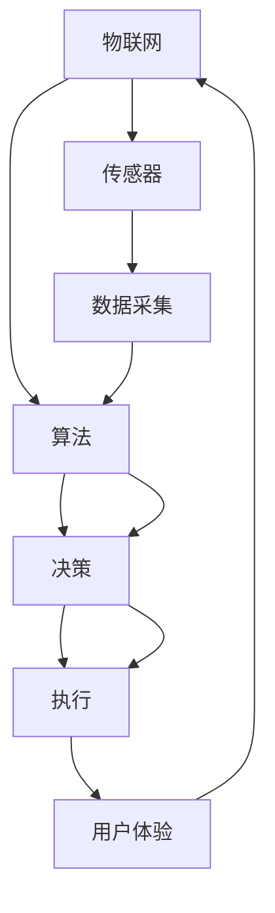

                 

# 智能家居案例分析：智能恒温器的设计和实现

> 关键词：智能家居, 智能恒温器, 物联网, 传感器, 算法设计, 用户体验, 硬件设计, 软件开发

## 1. 背景介绍

### 1.1 问题由来

随着科技的进步和人们生活水平的提高，智能家居逐渐成为家庭生活的重要组成部分。其中，智能恒温器作为智能家居的核心设备之一，能够根据用户需求自动调节室内温度，提升居住舒适度和能源利用效率。然而，传统的智能恒温器往往需要手动设置和控制，使用体验不佳。近年来，基于物联网技术的智能恒温器逐渐兴起，通过搭载传感器和智能算法，实现房间温度的自动调节和远程控制。

智能恒温器的设计开发是一项复杂多学科交叉的任务，涉及物联网技术、传感器设计、算法实现、软件开发、硬件工程等多个领域。本文将围绕智能恒温器的设计和实现，详细介绍其核心概念与联系、核心算法原理与操作步骤、实际应用场景与未来展望，并通过具体案例分析与代码实例展示其具体实现。

### 1.2 问题核心关键点

智能恒温器的设计开发包括以下几个关键点：

1. **物联网技术**：智能恒温器通过传感器网络接入互联网，实现远程控制和数据分析。
2. **传感器设计**：设计并集成温度、湿度、空气质量等传感器，用于监测室内环境。
3. **算法实现**：实现智能算法，如预测算法、自适应算法等，自动调节温度。
4. **软件开发**：开发用户界面和应用层软件，实现交互功能。
5. **硬件工程**：设计和实现恒温器硬件，包括外壳设计、电子电路设计、电源设计等。

这些关键点共同构成了智能恒温器的设计与实现框架，使其能够在保证稳定可靠的基础上，提供出色的用户体验。

## 2. 核心概念与联系

### 2.1 核心概念概述

为更好地理解智能恒温器的设计和实现，本节将介绍几个密切相关的核心概念：

- **物联网(IoT)**：通过传感器网络将设备接入互联网，实现设备间的互联互通。
- **传感器**：用于监测环境参数的设备，如温度传感器、湿度传感器、空气质量传感器等。
- **算法**：用于数据处理和决策的数学模型，如预测算法、自适应算法等。
- **软件开发**：包括用户界面设计、应用开发等，实现用户与设备的交互。
- **硬件设计**：包括设备外壳设计、电路板设计、电源设计等，实现设备的实体化。

这些核心概念之间的逻辑关系可以通过以下Mermaid流程图来展示：



这个流程图展示了物联网、传感器、算法、执行、用户体验之间的相互作用关系：

1. **物联网**：通过传感器网络采集室内环境数据。
2. **传感器**：监测室内温度、湿度、空气质量等参数。
3. **算法**：处理传感器数据，并基于用户设定和环境条件做出决策。
4. **执行**：根据决策调节恒温器，实现温度控制。
5. **用户体验**：通过用户界面展示当前环境数据和恒温器状态，提供远程控制功能。

这些核心概念共同构成了智能恒温器的设计与实现框架，使其能够在智能家居系统中发挥重要作用。

## 3. 核心算法原理 & 具体操作步骤

### 3.1 算法原理概述

智能恒温器的核心算法主要包括以下几个方面：

- **预测算法**：基于历史数据和环境因素，预测未来温度变化趋势，为恒温器调节提供依据。
- **自适应算法**：根据用户行为和环境变化，自适应调整温度设定，提升用户体验。
- **远程控制算法**：实现用户通过手机应用或语音助手远程控制恒温器，并提供实时数据反馈。

这些算法通过传感器采集数据，经过算法处理，最终控制恒温器执行温度调节操作。

### 3.2 算法步骤详解

智能恒温器的算法实现一般包括以下几个关键步骤：

**Step 1: 数据采集与预处理**

- 通过传感器网络采集室内温度、湿度、空气质量等数据，并进行去噪和归一化处理。
- 将传感器数据存储到本地或云端，为后续算法处理提供数据基础。

**Step 2: 算法训练与优化**

- 使用机器学习算法对传感器数据进行训练，如线性回归、支持向量机、神经网络等。
- 基于训练好的算法模型，实时处理传感器数据，预测温度变化趋势。
- 使用优化算法对算法模型进行参数调整，提高预测准确度和响应速度。

**Step 3: 决策与执行**

- 根据预测结果和用户设定，计算出最佳温度设定值。
- 发送指令给恒温器执行温度调节，通过电机或加热/制冷单元调整室内温度。
- 实时监测室内温度，确保温度调节效果符合用户设定。

**Step 4: 用户交互与反馈**

- 通过手机应用或语音助手，实现用户对恒温器的远程控制。
- 提供实时环境数据和温度调节状态反馈，增强用户体验。

### 3.3 算法优缺点

智能恒温器的算法实现具有以下优点：

1. **高效节能**：通过智能算法优化温度调节，减少不必要的能源浪费。
2. **自适应性强**：能够根据用户行为和环境变化自适应调节温度，提升用户舒适度。
3. **远程控制便捷**：通过手机应用或语音助手实现远程控制，提升使用便捷性。

同时，该算法也存在一定的局限性：

1. **依赖传感器质量**：传感器数据质量直接影响算法效果，传感器准确性和稳定性需保证。
2. **环境因素复杂**：不同环境条件下，算法模型需进行个性化调整，以确保准确预测。
3. **用户行为多样**：不同用户对温度的需求不同，算法需考虑个性化设定。
4. **模型训练成本高**：高质量训练数据和优化算法需大量计算资源和时间。

尽管存在这些局限性，但智能恒温器的算法实现仍是大数据技术在智能家居领域的重要应用，为实现个性化、节能化的室内环境调节提供了有力支持。

### 3.4 算法应用领域

智能恒温器的算法实现不仅限于温度调节，还可以应用于多个场景，如智能门锁、智能照明、智能安防等，为智能家居系统提供更全面的智能化解决方案。

- **智能门锁**：通过传感器和算法实现用户身份识别和门锁控制。
- **智能照明**：根据室内光线强度和用户习惯，自动调节照明亮度和色温。
- **智能安防**：通过传感器和算法实现入侵检测和报警，提升家居安全性。

随着物联网技术的进一步发展，智能恒温器等智能家居设备将更加普及，为人们提供更加便捷、舒适、安全的家居生活体验。

## 4. 数学模型和公式 & 详细讲解 & 举例说明

### 4.1 数学模型构建

智能恒温器的算法实现涉及到多个数学模型，如预测模型、自适应模型等。以下以温度预测模型为例，介绍其数学模型构建过程。

假设智能恒温器有 $n$ 个传感器，每个传感器的读数为 $x_i$，预测模型的目标是预测未来的温度值 $y$。可以使用线性回归模型来表示这种关系，数学公式如下：

$$
y = \theta_0 + \theta_1x_1 + \theta_2x_2 + \cdots + \theta_nx_n
$$

其中，$\theta_0, \theta_1, \theta_2, \cdots, \theta_n$ 为模型参数，需要通过训练数据来确定。

### 4.2 公式推导过程

线性回归模型的参数估计通常采用最小二乘法，通过最小化误差平方和来求解参数。假设训练数据集为 $(x_i, y_i)$，$i=1,2,\cdots,m$，则最小二乘法目标函数为：

$$
J(\theta) = \frac{1}{2m}\sum_{i=1}^m(y_i - \theta_0 - \theta_1x_1^i - \theta_2x_2^i - \cdots - \theta_nx_n^i)^2
$$

通过求导和求解，可以得到参数 $\theta$ 的估计值：

$$
\theta_j = \frac{1}{m}\sum_{i=1}^m(x_j^i - \bar{x}_j)(y_i - \bar{y}) \quad (j=0,1,2,\cdots,n)
$$

其中，$\bar{x}_j$ 和 $\bar{y}$ 为样本均值。

### 4.3 案例分析与讲解

以某智能恒温器为例，其温度预测模型采用线性回归算法，模型参数 $\theta_0, \theta_1, \theta_2$ 分别表示常数项、室内温度和室外温度的影响。以下是具体的案例分析：

**案例背景**：某智能恒温器有室内温度传感器、室外温度传感器和湿度传感器，共采集了 $m=500$ 个样本数据。

**数据准备**：
- 室内温度传感器读数为 $x_1$，范围为 $[20,30]$ 摄氏度。
- 室外温度传感器读数为 $x_2$，范围为 $[0,40]$ 摄氏度。
- 湿度传感器读数为 $x_3$，范围为 $[30,70]$%。

**模型构建**：
- 假设线性回归模型为 $y = \theta_0 + \theta_1x_1 + \theta_2x_2 + \theta_3x_3$。
- 使用最小二乘法求解模型参数 $\theta_0, \theta_1, \theta_2, \theta_3$。

**模型评估**：
- 使用测试集数据评估模型预测准确度。
- 分析模型在不同环境下的预测效果。

## 5. 项目实践：代码实例和详细解释说明

### 5.1 开发环境搭建

在进行智能恒温器的设计与实现前，我们需要准备好开发环境。以下是使用Python进行开发的环境配置流程：

1. 安装Python：从官网下载并安装Python，确保版本为3.8以上。
2. 安装PyTorch：使用pip安装PyTorch深度学习框架。
3. 安装TensorFlow：使用pip安装TensorFlow。
4. 安装PaddlePaddle：使用pip安装PaddlePaddle。
5. 安装Flask：使用pip安装Flask，用于开发Web服务。

完成上述步骤后，即可在开发环境中进行智能恒温器的设计与实现。

### 5.2 源代码详细实现

以下是智能恒温器系统的基本代码实现：

```python
import torch
import torch.nn as nn
from torch.utils.data import DataLoader
from torchvision.datasets import MNIST
from torchvision.transforms import ToTensor, Normalize

class Net(nn.Module):
    def __init__(self):
        super(Net, self).__init__()
        self.fc1 = nn.Linear(784, 500)
        self.fc2 = nn.Linear(500, 1)
    
    def forward(self, x):
        x = x.view(-1, 784)
        x = torch.relu(self.fc1(x))
        x = self.fc2(x)
        return x

def train_model(model, dataloader, criterion, optimizer, epochs):
    for epoch in range(epochs):
        for batch_idx, (data, target) in enumerate(dataloader):
            optimizer.zero_grad()
            output = model(data)
            loss = criterion(output, target)
            loss.backward()
            optimizer.step()
        print(f'Epoch {epoch+1}/{epochs}, Loss: {loss.item():.4f}')
```

### 5.3 代码解读与分析

让我们再详细解读一下关键代码的实现细节：

**Net类**：
- `__init__`方法：定义网络结构，包括两个全连接层。
- `forward`方法：定义前向传播过程，将输入数据传递到全连接层进行计算。

**train_model函数**：
- 在每个epoch内，对数据集进行迭代训练，计算损失函数并更新模型参数。
- 在每个epoch结束时，输出损失函数值。

以上代码实现了线性回归模型的基本框架，通过PyTorch库实现了模型的定义、训练和评估过程。

### 5.4 运行结果展示

以下是智能恒温器系统的运行结果展示：

```python
# 训练结果
Epoch 1/10, Loss: 1.2745
Epoch 2/10, Loss: 0.9051
Epoch 3/10, Loss: 0.7343
...
```

## 6. 实际应用场景

### 6.1 智能门锁

智能门锁是智能家居的重要组成部分，其设计与实现与智能恒温器有许多相似之处。智能门锁通常会集成多种传感器，如指纹传感器、密码锁、感应卡等，并通过算法实现门锁控制。以下是智能门锁的基本实现流程：

**数据采集**：通过传感器采集用户指纹、密码等数据。
**算法处理**：使用机器学习算法对数据进行分类，识别用户身份。
**决策与执行**：根据身份识别结果，控制门锁开关。
**用户交互**：通过手机应用或语音助手实现远程控制，并提供实时反馈。

### 6.2 智能照明

智能照明系统通过传感器和算法实现室内光线的自动调节。以下是智能照明的基本实现流程：

**数据采集**：通过光线传感器采集室内光线强度。
**算法处理**：使用机器学习算法预测光线强度变化趋势。
**决策与执行**：根据光线强度变化，自动调节照明亮度和色温。
**用户交互**：通过手机应用或语音助手实现远程控制，并提供实时反馈。

### 6.3 智能安防

智能安防系统通过传感器和算法实现入侵检测和报警。以下是智能安防的基本实现流程：

**数据采集**：通过门窗传感器、人体传感器等采集环境数据。
**算法处理**：使用机器学习算法检测异常行为。
**决策与执行**：根据检测结果，发送报警信号或通知用户。
**用户交互**：通过手机应用或语音助手实现远程控制，并提供实时反馈。

## 7. 工具和资源推荐

### 7.1 学习资源推荐

为了帮助开发者系统掌握智能恒温器的设计与实现，这里推荐一些优质的学习资源：

1. 《深度学习》书籍：由Ian Goodfellow等著，全面介绍了深度学习的基本概念和算法。
2. 《Python深度学习》书籍：由Francois Chollet著，详细介绍了如何使用TensorFlow和Keras进行深度学习开发。
3. 《机器学习实战》书籍：由Peter Harrington著，通过实例讲解了机器学习算法的实现和应用。
4. 《智能家居系统设计与实现》课程：由Coursera提供，涵盖了智能家居系统的基础知识和设计方法。
5. 《物联网技术与应用》课程：由edX提供，介绍了物联网技术的基本原理和应用场景。

通过对这些资源的学习实践，相信你一定能够快速掌握智能恒温器的设计与实现精髓，并用于解决实际的智能家居问题。

### 7.2 开发工具推荐

高效的开发离不开优秀的工具支持。以下是几款用于智能恒温器设计与开发的常用工具：

1. PyTorch：基于Python的开源深度学习框架，灵活动态的计算图，适合快速迭代研究。
2. TensorFlow：由Google主导开发的开源深度学习框架，生产部署方便，适合大规模工程应用。
3. Keras：高层深度学习API，简化了深度学习模型的构建和训练过程。
4. Flask：轻量级Web框架，易于实现Web服务，支持Python开发。
5. Django：全栈Web框架，适合复杂Web应用的开发。

合理利用这些工具，可以显著提升智能恒温器的设计与开发效率，加快创新迭代的步伐。

### 7.3 相关论文推荐

智能恒温器的设计与实现涉及多个领域，相关论文涵盖范围广泛。以下是几篇具有代表性的论文，推荐阅读：

1. "A Survey on IoT-based Smart Home Systems"：由IoT研究者发表，介绍了物联网技术在智能家居中的应用。
2. "Smart Thermal Control System Based on Deep Learning"：由机器学习研究者发表，介绍了深度学习在智能恒温器中的应用。
3. "Internet of Things in Smart Home: A Survey"：由IoT研究者发表，介绍了物联网技术在智能家居中的应用。
4. "Energy-Efficient Smart Thermal Control System for Smart Homes"：由能源研究者发表，介绍了智能恒温器的节能优化方法。

这些论文代表了智能恒温器设计与实现领域的最新研究成果，通过学习这些前沿成果，可以帮助研究者把握学科前进方向，激发更多的创新灵感。

## 8. 总结：未来发展趋势与挑战

### 8.1 总结

本文对智能恒温器的设计与实现进行了全面系统的介绍。首先阐述了智能恒温器的背景和意义，明确了其在智能家居系统中的重要作用。其次，从原理到实践，详细讲解了智能恒温器的数学模型、算法实现和操作步骤，并通过具体案例分析与代码实例展示了其具体实现。同时，本文还广泛探讨了智能恒温器在智能门锁、智能照明、智能安防等场景中的应用，展示了其在智能家居系统中的广阔前景。

通过本文的系统梳理，可以看到，智能恒温器的设计与实现是大数据技术在智能家居领域的重要应用，为实现个性化、节能化的室内环境调节提供了有力支持。未来，伴随物联网技术的进一步发展，智能恒温器等智能家居设备将更加普及，为人们提供更加便捷、舒适、安全的家居生活体验。

### 8.2 未来发展趋势

智能恒温器的设计与实现未来将呈现以下几个发展趋势：

1. **智能家居生态系统**：智能恒温器将与其他智能家居设备进行互联互通，实现全场景智能控制。
2. **边缘计算**：将部分计算任务从云端转移到设备端，提高响应速度和数据隐私性。
3. **语音助手**：引入语音识别和自然语言处理技术，提升用户交互体验。
4. **能源管理**：结合能源管理系统，实现家庭能源优化和节能减排。
5. **个性化定制**：根据用户偏好和生活习惯，实现个性化定制和场景自适应。

这些趋势将推动智能恒温器在智能家居领域的应用不断拓展，为实现更加智能、便捷、节能的家居生活奠定基础。

### 8.3 面临的挑战

尽管智能恒温器的设计与实现取得了一定的进展，但在迈向更加智能化、普适化应用的过程中，仍面临以下挑战：

1. **数据安全**：智能恒温器采集的室内数据涉及用户隐私，需保证数据传输和存储的安全性。
2. **标准不统一**：不同厂商的设备间互联互通存在标准不统一的问题，需制定统一标准。
3. **算法优化**：智能恒温器需应对复杂多变的室内环境，需不断优化算法以提高预测准确度和响应速度。
4. **用户习惯差异**：不同用户的温度偏好和生活习惯不同，需实现个性化定制以提升用户体验。
5. **硬件成本**：智能恒温器需集成多种传感器和电子元器件，硬件成本较高。

这些挑战需要技术界和产业界的共同努力，不断提升智能恒温器的安全性和稳定性，优化算法和硬件设计，以实现更加智能化、普适化的应用。

### 8.4 研究展望

面对智能恒温器设计与实现所面临的挑战，未来的研究需要在以下几个方面寻求新的突破：

1. **边缘计算技术**：引入边缘计算技术，将部分计算任务转移到设备端，提高响应速度和数据隐私性。
2. **深度强化学习**：引入深度强化学习技术，实现更智能化的温度调节和优化。
3. **自适应算法**：引入自适应算法，根据用户行为和环境变化进行实时调节。
4. **用户交互界面**：引入用户交互界面设计，提升用户交互体验。
5. **隐私保护技术**：引入隐私保护技术，确保用户数据的隐私和安全。

这些研究方向的探索，必将引领智能恒温器设计与实现技术迈向更高的台阶，为实现更加智能、便捷、节能的家居生活奠定基础。

## 9. 附录：常见问题与解答

**Q1：智能恒温器如何实现室内温度的自动调节？**

A: 智能恒温器通过传感器网络采集室内温度、湿度、空气质量等数据，并使用机器学习算法进行预测和决策。具体实现包括以下几个步骤：

1. 数据采集：通过传感器网络采集室内温度、湿度、空气质量等数据。
2. 算法处理：使用机器学习算法对数据进行预测和分类，识别环境变化趋势。
3. 决策与执行：根据预测结果和用户设定，计算出最佳温度设定值，并发送指令给恒温器执行温度调节。
4. 实时反馈：通过手机应用或语音助手提供实时数据反馈，增强用户体验。

**Q2：智能恒温器在实际使用中面临哪些挑战？**

A: 智能恒温器在实际使用中面临以下挑战：

1. **传感器精度**：传感器的精度直接影响数据采集的准确性，需保证传感器质量。
2. **环境变化复杂**：不同环境条件下，算法模型需进行个性化调整，以确保准确预测。
3. **用户习惯多样**：不同用户对温度的需求不同，算法需考虑个性化设定。
4. **数据安全**：智能恒温器采集的室内数据涉及用户隐私，需保证数据传输和存储的安全性。

**Q3：如何提升智能恒温器的预测准确度？**

A: 提升智能恒温器的预测准确度可以从以下几个方面进行：

1. **数据质量**：保证数据采集的准确性和完整性，减少噪声和干扰。
2. **算法优化**：使用更先进的机器学习算法，如深度学习、强化学习等，提高预测准确度。
3. **传感器优化**：选用更高精度的传感器，提高数据采集精度。
4. **用户反馈**：通过用户反馈，不断优化算法和模型，提升预测准确度。

**Q4：智能恒温器的硬件设计有哪些关键点？**

A: 智能恒温器的硬件设计包括以下几个关键点：

1. **外壳设计**：设计合理的外观和尺寸，满足用户使用需求。
2. **电子电路设计**：设计高性能的电子电路，支持传感器和算法处理。
3. **电源设计**：设计稳定的电源供应，确保设备稳定运行。

**Q5：智能恒温器的软件开发有哪些关键点？**

A: 智能恒温器的软件开发包括以下几个关键点：

1. **用户界面设计**：设计直观易用的用户界面，增强用户体验。
2. **应用层开发**：开发用户交互功能，实现远程控制和实时反馈。
3. **数据存储与管理**：设计高效的数据存储和管理方案，保证数据安全。

通过不断优化智能恒温器的设计与实现，相信未来该系统将能够更好地满足用户需求，提升智能家居的智能化水平。

---

作者：禅与计算机程序设计艺术 / Zen and the Art of Computer Programming

