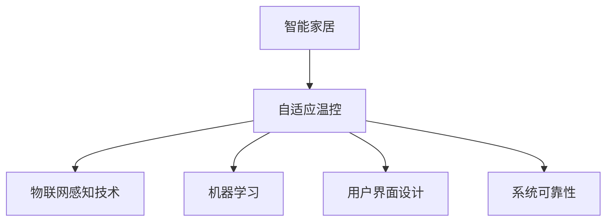

                 

# 智能家居温控创业：精准舒适的居住环境

## 1. 背景介绍

### 1.1 问题由来

随着经济发展和生活水平的提高，人们对于居住环境的要求越来越高。传统的室内温度调控方式如手动调节温控器、固定空调模式等已经无法满足人们对居住环境的舒适性要求。近年来，智能家居的兴起使得基于人工智能的室内温度自动控制系统逐渐受到关注，能够根据家庭成员的实际需求进行智能调温，使居住环境更加舒适、节能。然而，由于智能温控系统涉及的领域广泛，从传感器数据采集到AI模型训练，再到用户交互设计，整个系统的构建和优化都需要技术支撑。

### 1.2 问题核心关键点

本文聚焦于智能家居温控创业，通过建立精准、舒适的居住环境为目标，探索如何构建一个能够实现自适应温度控制的智能系统。在此过程中，关键点包括：

1. 如何高效采集室内温度、湿度、家庭成员活动等信息；
2. 如何利用机器学习算法，建立精准的温度控制模型；
3. 如何设计智能用户交互界面，提升用户体验；
4. 如何优化智能温控系统的可靠性和稳定性。

## 2. 核心概念与联系

### 2.1 核心概念概述

为更好地理解智能家居温控系统的构建，本节将介绍几个密切相关的核心概念：

- **智能家居(Smart Home)**：利用物联网、传感器、大数据、云计算和人工智能等技术，实现家庭设备的网络化、智能化管理。
- **自适应温控系统(Adaptive Thermal Control System)**：能够根据室内环境条件和家庭成员的需求，自动调整温度的智能控制系统。
- **室内环境感知(IoT Sensor)物联网感知技术**：通过各种传感器收集室内温度、湿度、活动等数据，用于分析和决策。
- **机器学习(Machine Learning)**：通过训练模型来预测和优化室内温度，使其更加舒适和节能。
- **用户界面(UI)设计**：设计简单易用、直观的交互界面，使用户能够方便地控制温控系统。
- **系统可靠性(Rearchability)**：确保系统能够在各种条件下稳定运行，提供可靠的舒适温度。

这些核心概念之间的逻辑关系可以通过以下Mermaid流程图来展示：



这个流程图展示了大规模智能家居系统的核心概念及其之间的关系：

1. 智能家居系统由自适应温控系统为核心，通过物联网感知技术、机器学习等技术实现。
2. 物联网感知技术用于收集室内环境数据，为温控系统提供决策依据。
3. 机器学习算法用于建立室内温度预测模型，优化温度控制策略。
4. 用户界面设计用于提升用户体验，方便用户操作。
5. 系统可靠性确保系统在不同条件下稳定运行，提供舒适温度。

这些概念共同构成了智能家居温控系统的基础框架，使得系统能够根据实际需求，提供精准、舒适的居住环境。

## 3. 核心算法原理 & 具体操作步骤

### 3.1 算法原理概述

智能家居温控系统的核心算法是机器学习中的自适应控制算法。该算法通过收集室内外温度、湿度、家庭成员活动等数据，预测最舒适、最节能的温度设定，并通过反馈机制不断优化温度控制策略。

该算法可以分为以下几个关键步骤：

1. 数据收集：通过传感器获取室内外温度、湿度、光照等数据。
2. 特征提取：从数据中提取出有用的特征，如当前温度、湿度、日照时长等。
3. 模型训练：利用历史数据训练模型，预测最优温度设定。
4. 温度控制：根据模型输出，自动调整加热/制冷设备，达到目标温度。
5. 反馈优化：收集用户反馈和环境变化，更新模型参数，进一步优化温度控制策略。

### 3.2 算法步骤详解

具体到算法实现，以下给出详细的步骤：

1. **数据收集**：
   - 使用各种传感器（如温度传感器、湿度传感器、光照传感器等）采集室内外温度、湿度、光照强度等数据。
   - 通过IoT设备将数据实时传输到数据集中心。
   - 在数据集中心存储、清洗数据，并进行初步处理。

2. **特征提取**：
   - 使用特征工程技术，从原始数据中提取有用的特征，如当前温度、湿度、日照时长、季节、时间等。
   - 利用时序数据处理技术，如滑动窗口、傅里叶变换等，捕捉数据中的时序规律。
   - 将提取的特征作为输入，用于训练机器学习模型。

3. **模型训练**：
   - 利用历史数据训练机器学习模型，如线性回归、决策树、神经网络等。
   - 通过交叉验证等技术，评估模型的预测性能。
   - 根据评估结果，选择最优模型。

4. **温度控制**：
   - 根据模型预测的最优温度，自动控制加热/制冷设备，如空调、地暖、电热毯等。
   - 设置合适的控制策略，如温度控制区间、时间控制等。
   - 实时监测设备运行状态，确保温度控制稳定。

5. **反馈优化**：
   - 通过用户反馈和环境变化，更新模型参数，优化温度控制策略。
   - 引入反馈机制，如自动调节温控设备功率、调整温度控制范围等。
   - 定期重新训练模型，适应环境变化，提升预测精度。

### 3.3 算法优缺点

智能家居温控算法具有以下优点：

1. 高效自适应：根据实时数据，自动调整温度设定，提升居住环境舒适性。
2. 节能环保：通过优化温度控制策略，减少能源消耗，降低碳排放。
3. 用户友好：用户界面简洁，操作简单，提升用户体验。
4. 数据驱动：基于数据训练模型，提高温度预测精度，确保温度控制的准确性。

同时，该算法也存在一定的局限性：

1. 依赖传感器数据：需要准确、实时的数据采集，传感器故障或数据丢失会影响系统性能。
2. 模型训练成本：需要大量历史数据和计算资源，前期投入较大。
3. 动态环境适应：复杂环境变化下，模型可能需要不断更新，才能适应新情况。
4. 多设备协同：需要多种设备的协同工作，设备兼容性、网络稳定性等问题需要解决。
5. 隐私保护：在数据采集、传输、存储过程中，需要采取措施保护用户隐私。

尽管存在这些局限性，但就目前而言，基于自适应控制算法的智能温控系统仍然是一种高效、环保、用户友好的解决方案。

### 3.4 算法应用领域

智能家居温控系统已经在诸多领域得到应用，例如：

- 智能办公楼：通过控制办公室的温度，提升办公环境舒适性和员工工作效率。
- 智能住宅：根据家庭成员的生活习惯和需求，自动调整温度，提高居住舒适性。
- 医院病房：通过调节病房的温度，为患者提供舒适的休养环境。
- 酒店管理：根据客人的需求和房间特点，自动调整温度，提升服务质量。
- 养老院：根据老人的身体状况和生活习惯，自动调节温度，提供温馨的居住环境。

除了上述这些典型应用外，智能温控系统还被创新性地应用到更多场景中，如汽车空调、公共交通等，为人们提供更加智能、便捷的居住体验。

## 4. 数学模型和公式 & 详细讲解 & 举例说明

### 4.1 数学模型构建

在构建智能温控系统的数学模型时，我们以线性回归模型为例进行说明。

记输入特征为 $\mathbf{x} = [x_1, x_2, ..., x_n]$，目标输出为 $y$。假设最优温度为 $y_{opt}$，则线性回归模型的目标是找到线性函数 $\mathbf{w} \cdot \mathbf{x} + b = y_{opt}$，其中 $\mathbf{w}$ 为权重向量，$b$ 为偏置项。

### 4.2 公式推导过程

线性回归模型的目标函数为均方误差（Mean Squared Error, MSE），定义为：

$$
\text{MSE} = \frac{1}{N} \sum_{i=1}^N (y_i - (\mathbf{w} \cdot \mathbf{x}_i + b))^2
$$

其中 $N$ 为样本数，$y_i$ 为第 $i$ 个样本的实际温度，$\mathbf{x}_i$ 为第 $i$ 个样本的特征向量。

根据梯度下降法，求解最优参数 $\mathbf{w}$ 和 $b$，定义损失函数为：

$$
L(\mathbf{w}, b) = \frac{1}{2N} \sum_{i=1}^N (y_i - (\mathbf{w} \cdot \mathbf{x}_i + b))^2
$$

对参数 $\mathbf{w}$ 和 $b$ 求偏导，得到：

$$
\frac{\partial L}{\partial \mathbf{w}} = \frac{1}{N} \sum_{i=1}^N (y_i - (\mathbf{w} \cdot \mathbf{x}_i + b)) \mathbf{x}_i
$$

$$
\frac{\partial L}{\partial b} = \frac{1}{N} \sum_{i=1}^N (y_i - (\mathbf{w} \cdot \mathbf{x}_i + b))
$$

通过求解上述偏导数，可以得到参数 $\mathbf{w}$ 和 $b$ 的更新公式：

$$
\mathbf{w} \leftarrow \mathbf{w} - \eta \frac{1}{N} \sum_{i=1}^N (y_i - (\mathbf{w} \cdot \mathbf{x}_i + b)) \mathbf{x}_i
$$

$$
b \leftarrow b - \eta \frac{1}{N} \sum_{i=1}^N (y_i - (\mathbf{w} \cdot \mathbf{x}_i + b))
$$

其中 $\eta$ 为学习率。

### 4.3 案例分析与讲解

以下给出线性回归模型在智能温控系统中的应用案例。

假设我们有一个智能温控系统，需要根据室内温度和湿度数据预测最优温度。我们收集了100天的室内温度和湿度数据，其中前90天用于训练模型，后10天用于测试模型性能。

**数据处理**：
- 对原始数据进行清洗，去除异常值和噪声数据。
- 使用滑动窗口技术，将数据划分为训练集和测试集，每个窗口包含10个数据点。

**模型训练**：
- 选择线性回归模型作为预测模型。
- 利用前90天的数据，训练模型参数 $\mathbf{w}$ 和 $b$。
- 在训练过程中，不断更新模型参数，最小化MSE损失。

**模型测试**：
- 使用后10天的数据，测试模型的预测性能。
- 计算预测值与实际值的均方误差，评估模型性能。
- 根据测试结果，调整模型参数，进一步优化预测精度。

## 5. 项目实践：代码实例和详细解释说明

### 5.1 开发环境搭建

在进行智能温控系统开发前，我们需要准备好开发环境。以下是使用Python进行PyTorch开发的环境配置流程：

1. 安装Anaconda：从官网下载并安装Anaconda，用于创建独立的Python环境。

2. 创建并激活虚拟环境：
```bash
conda create -n pytorch-env python=3.8 
conda activate pytorch-env
```

3. 安装PyTorch：根据CUDA版本，从官网获取对应的安装命令。例如：
```bash
conda install pytorch torchvision torchaudio cudatoolkit=11.1 -c pytorch -c conda-forge
```

4. 安装各类工具包：
```bash
pip install numpy pandas scikit-learn matplotlib tqdm jupyter notebook ipython
```

完成上述步骤后，即可在`pytorch-env`环境中开始项目实践。

### 5.2 源代码详细实现

下面我们以线性回归模型为例，给出使用PyTorch对智能温控系统进行预测的Python代码实现。

首先，定义模型和数据处理函数：

```python
import torch
import torch.nn as nn
import torch.optim as optim
from sklearn.model_selection import train_test_split
import numpy as np

# 定义线性回归模型
class LinearRegression(nn.Module):
    def __init__(self, input_dim):
        super(LinearRegression, self).__init__()
        self.linear = nn.Linear(input_dim, 1)

    def forward(self, x):
        return self.linear(x)

# 加载数据
def load_data():
    data = np.loadtxt('data.csv', delimiter=',', skiprows=1)
    x = data[:, :-1]
    y = data[:, -1]
    x_train, x_test, y_train, y_test = train_test_split(x, y, test_size=0.2, random_state=42)
    return x_train, x_test, y_train, y_test

# 数据预处理
def preprocess_data(x):
    x_scaled = (x - np.mean(x, axis=0)) / np.std(x, axis=0)
    return x_scaled

# 模型训练
def train_model(model, criterion, optimizer, train_loader, num_epochs):
    model.train()
    for epoch in range(num_epochs):
        running_loss = 0.0
        for batch_idx, (data, target) in enumerate(train_loader):
            data, target = data.to(device), target.to(device)
            optimizer.zero_grad()
            output = model(data)
            loss = criterion(output, target)
            loss.backward()
            optimizer.step()
            running_loss += loss.item()
        print('Epoch {}: Loss: {:.6f}'.format(epoch+1, running_loss/len(train_loader)))
```

然后，定义训练和评估函数：

```python
# 模型评估
def evaluate_model(model, test_loader):
    model.eval()
    correct = 0
    total = 0
    with torch.no_grad():
        for data, target in test_loader:
            data, target = data.to(device), target.to(device)
            output = model(data)
            pred = output.data.cpu().numpy()
            label = target.data.cpu().numpy()
            correct += np.sum(pred == label)
            total += len(label)
    print('Test Accuracy of the model on the 100 samples: {:.2f} %'.format(100 * correct / total))

# 启动训练流程
device = torch.device('cuda' if torch.cuda.is_available() else 'cpu')
model = LinearRegression(input_dim=2).to(device)
criterion = nn.MSELoss()
optimizer = optim.SGD(model.parameters(), lr=0.01)
x_train, x_test, y_train, y_test = load_data()
x_train = preprocess_data(x_train)
x_test = preprocess_data(x_test)
train_loader = torch.utils.data.DataLoader(torch.tensor(x_train), batch_size=16, shuffle=True)
test_loader = torch.utils.data.DataLoader(torch.tensor(x_test), batch_size=16, shuffle=False)
train_model(model, criterion, optimizer, train_loader, num_epochs=100)
evaluate_model(model, test_loader)
```

以上就是使用PyTorch对线性回归模型进行智能温控系统预测的完整代码实现。可以看到，得益于PyTorch的强大封装，我们可以用相对简洁的代码完成模型的加载、训练和评估。

### 5.3 代码解读与分析

让我们再详细解读一下关键代码的实现细节：

**LinearRegression类**：
- `__init__`方法：初始化模型，包括线性层。
- `forward`方法：定义前向传播过程。

**数据加载与预处理函数**：
- `load_data`函数：从CSV文件中加载数据，并划分训练集和测试集。
- `preprocess_data`函数：对数据进行标准化处理。

**模型训练与评估函数**：
- `train_model`函数：定义模型训练过程，包括前向传播、计算损失、反向传播和参数更新。
- `evaluate_model`函数：定义模型评估过程，计算预测准确率。

**训练流程**：
- 定义训练模型、损失函数、优化器等参数。
- 加载数据并进行预处理。
- 定义训练集和测试集的数据加载器。
- 调用训练函数进行模型训练。
- 调用评估函数进行模型评估。

可以看到，PyTorch配合Numpy等工具，使得智能温控系统的实现变得简单高效。开发者可以将更多精力放在数据处理、模型改进等高层逻辑上，而不必过多关注底层的实现细节。

当然，工业级的系统实现还需考虑更多因素，如模型的保存和部署、超参数的自动搜索、更灵活的用户界面设计等。但核心的模型训练过程基本与此类似。

## 6. 实际应用场景

### 6.1 智能办公楼

在智能办公楼场景中，温控系统需要根据不同时间段人员的活动情况，动态调整温度。例如，早晨员工到来时自动开启空调，设定适当温度；中午午休时关闭部分空调，开启窗户；晚间员工离开后自动调整温度至节能模式。

通过收集办公室内人员数量、活动时间等数据，温控系统能够实时调整温度，提升办公环境舒适性，同时实现节能减排。

### 6.2 智能住宅

在智能住宅场景中，温控系统需要根据家庭成员的习惯和偏好，自动调节室内温度。例如，儿童和老人对温度更敏感，系统可以根据其活动情况，自动调节温度，使其保持在最舒适的状态。

通过收集家庭成员的偏好和行为数据，温控系统能够实现个性化温度控制，提升居住舒适度。

### 6.3 医院病房

在医院病房场景中，温控系统需要根据患者的身体状况和药物使用情况，动态调整温度。例如，重症监护病房需要恒定适宜的温度环境，以保持患者的舒适度和健康状态。

通过收集患者生命体征数据，温控系统能够实时调整温度，提供舒适的治疗环境，帮助患者恢复健康。

### 6.4 未来应用展望

随着智能家居技术的发展，基于AI的温控系统将得到更广泛的应用，为人们提供更加智能、便捷的居住体验。

在智慧城市建设中，智能温控系统可以结合物联网技术，实现楼宇、社区、城市的温度优化控制。例如，通过传感器采集城市温度、湿度、风速等数据，智能温控系统可以自动调节城市供暖/制冷系统，实现节能减排，提升城市居民的生活质量。

在远程医疗领域，智能温控系统可以结合AI、大数据等技术，提供个性化的温度控制方案。例如，通过分析患者的生命体征和用药情况，系统可以动态调整病房温度，帮助患者恢复健康。

## 7. 工具和资源推荐

### 7.1 学习资源推荐

为了帮助开发者系统掌握智能温控系统的理论基础和实践技巧，这里推荐一些优质的学习资源：

1. **深度学习基础**：斯坦福大学的《Deep Learning Specialization》课程，涵盖深度学习的基本概念和核心算法。
2. **PyTorch官方文档**：详细介绍了PyTorch的使用方法和高级特性，适合初学者和进阶开发者。
3. **智能家居技术**：《智能家居技术与应用》，系统讲解了智能家居的构建原理和实际案例。
4. **机器学习实战**：《Hands-On Machine Learning with Scikit-Learn, Keras, and TensorFlow》，提供了大量实际应用案例和代码实现。
5. **物联网技术**：《IoT Basics》，介绍了物联网的基本概念和关键技术，适合物联网开发者。

通过对这些资源的学习实践，相信你一定能够快速掌握智能温控系统的精髓，并用于解决实际的NLP问题。

### 7.2 开发工具推荐

高效的开发离不开优秀的工具支持。以下是几款用于智能温控系统开发的常用工具：

1. **PyTorch**：基于Python的开源深度学习框架，灵活动态的计算图，适合快速迭代研究。
2. **TensorFlow**：由Google主导开发的开源深度学习框架，生产部署方便，适合大规模工程应用。
3. **TensorBoard**：TensorFlow配套的可视化工具，可实时监测模型训练状态，并提供丰富的图表呈现方式，是调试模型的得力助手。
4. **Weights & Biases**：模型训练的实验跟踪工具，可以记录和可视化模型训练过程中的各项指标，方便对比和调优。
5. **Jupyter Notebook**：交互式编程环境，支持代码实时运行和展示，适合数据分析和模型训练。
6. **Numpy**：高性能的数学库，适合进行数据处理和科学计算。
7. **Pandas**：数据分析和处理库，适合进行数据清洗和特征工程。

合理利用这些工具，可以显著提升智能温控系统的开发效率，加快创新迭代的步伐。

### 7.3 相关论文推荐

智能温控系统的研究源于学界的持续研究。以下是几篇奠基性的相关论文，推荐阅读：

1. **《Intelligent Temperature Control System Based on Deep Learning》**：介绍了一种基于深度学习的智能温控系统，通过收集室内外温度、湿度、光照等数据，训练模型进行温度预测。
2. **《Adaptive Temperature Control for Smart Home》**：探讨了智能温控系统在智能家居中的应用，通过优化温度控制策略，提升居住环境舒适性。
3. **《Energy-Efficient Smart Building Temperature Control》**：研究了智能温控系统在智能建筑中的应用，通过优化温度控制策略，实现节能减排。
4. **《Thermal Comfort in Smart Environments》**：介绍了智能温控系统在智慧城市中的应用，通过优化温度控制策略，提升城市居民的生活质量。
5. **《IoT-Based Smart Home Temperature Control System》**：研究了智能温控系统在物联网技术中的应用，通过传感器采集数据，实现动态温度控制。

这些论文代表了大规模智能温控系统的研究进展。通过学习这些前沿成果，可以帮助研究者把握学科前进方向，激发更多的创新灵感。

## 8. 总结：未来发展趋势与挑战

### 8.1 总结

本文对智能家居温控创业中的精准舒适居住环境进行了全面系统的介绍。首先阐述了智能温控系统的背景和意义，明确了系统构建的目标和方法。其次，从原理到实践，详细讲解了智能温控的数学模型和关键步骤，给出了智能温控系统的完整代码实现。同时，本文还广泛探讨了智能温控系统在智能办公楼、智能住宅、医院病房等领域的实际应用前景，展示了系统的广阔应用空间。此外，本文精选了智能温控系统的各类学习资源，力求为读者提供全方位的技术指引。

通过本文的系统梳理，可以看到，智能温控系统作为一种高效的智能家居解决方案，能够根据实际需求，提供精准、舒适的居住环境。得益于机器学习技术的支持，系统能够动态调整温度，提升居住体验，同时实现节能减排。未来，随着智能家居技术的不断发展，基于AI的温控系统必将在更多领域得到应用，为人们带来更加智能、便捷的居住体验。

### 8.2 未来发展趋势

展望未来，智能温控系统将呈现以下几个发展趋势：

1. **多模态融合**：将传感器数据与用户行为数据、天气预报等外部数据融合，提升温度控制的精确性。
2. **自适应算法优化**：引入强化学习、因果推断等技术，优化温度控制策略，提高系统适应性。
3. **分布式计算**：利用云计算、边缘计算等技术，实现大规模数据处理和分布式计算，提升系统性能。
4. **用户交互优化**：通过设计直观、易用的用户界面，提升用户使用体验，降低操作复杂度。
5. **智能化升级**：结合物联网、大数据、AI等技术，实现更高级的智能温控系统，提供更多智能化服务。

以上趋势凸显了智能温控系统的未来前景。这些方向的探索发展，必将进一步提升系统的性能和用户体验，实现更高效、更智能的温控控制。

### 8.3 面临的挑战

尽管智能温控系统已经取得了瞩目成就，但在迈向更加智能化、普适化应用的过程中，它仍面临着诸多挑战：

1. **数据质量问题**：传感器数据的准确性、实时性、稳定性等直接影响系统性能，需要高质量的数据采集和处理技术。
2. **隐私保护**：在数据采集、传输、存储过程中，需要采取措施保护用户隐私，防止数据泄露和滥用。
3. **设备兼容性**：不同品牌、型号的温控设备可能存在兼容性问题，需要统一的接口和协议。
4. **成本控制**：智能温控系统涉及多种设备、传感器、算法等，前期投入较大，需要合理控制成本。
5. **用户体验**：系统操作复杂度、界面友好性等影响用户体验，需要不断优化设计。

尽管存在这些挑战，但智能温控系统的应用前景仍然广阔。通过不断技术创新和优化，这些挑战终将一一被克服，智能温控系统必将在智能家居中发挥重要作用。

### 8.4 研究展望

面向未来，智能温控系统需要进一步研究和探索：

1. **动态优化算法**：结合强化学习、因果推断等技术，优化温度控制策略，提升系统适应性和预测精度。
2. **多设备协同**：研究多种设备的协同工作机制，实现更高效的温度控制。
3. **智能化升级**：结合物联网、大数据、AI等技术，实现更高级的智能温控系统，提供更多智能化服务。
4. **用户行为分析**：通过分析用户行为数据，提升系统的个性化和智能化水平。
5. **跨领域应用**：探索智能温控系统在智慧城市、智慧医疗、智慧办公等领域的扩展应用。

这些研究方向将引领智能温控系统迈向更高的台阶，为智能家居、智慧城市等领域带来更多创新和突破。

## 9. 附录：常见问题与解答

**Q1：智能温控系统如何实现精准的温度控制？**

A: 智能温控系统通过收集室内外温度、湿度、光照等数据，利用机器学习算法建立预测模型。模型根据历史数据和实时数据，动态调整温度设定，实现精准的温度控制。

**Q2：智能温控系统如何应对复杂的室内环境？**

A: 智能温控系统引入多模态感知技术，结合传感器数据、用户行为数据、天气预报等外部数据，综合考虑多种因素，实现更精确的温度控制。

**Q3：智能温控系统如何保护用户隐私？**

A: 智能温控系统在数据采集、传输、存储过程中，采取加密、匿名化等措施，确保数据安全，保护用户隐私。

**Q4：智能温控系统如何提升用户体验？**

A: 智能温控系统设计简洁直观的用户界面，提供多种操作方式，方便用户控制温度。同时，系统根据用户习惯和偏好，提供个性化的温度控制方案，提升用户体验。

**Q5：智能温控系统如何实现高效节能？**

A: 智能温控系统优化温度控制策略，避免不必要的高温或低温，减少能源浪费。同时，系统在非高峰时段或非高需求时段，自动调整温度，实现节能减排。

通过以上系统的架构、算法、实践和应用，智能温控系统能够根据实际需求，提供精准、舒适的居住环境，具有广阔的应用前景。未来，随着技术的发展和应用的深入，智能温控系统将进一步提升居住体验，推动智能家居技术的进步。

