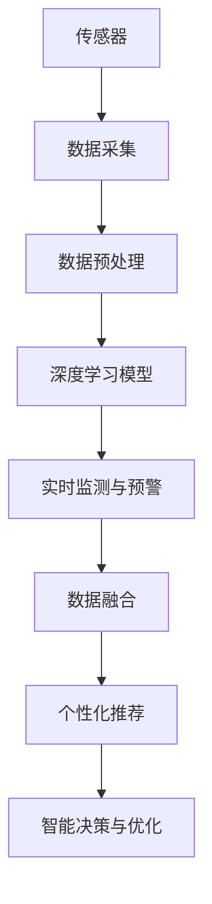

                 

## 1. 背景介绍

### 1.1 问题由来

随着工业化和城市化的推进，空气污染问题日益严峻。特别是在中国，许多城市面临PM2.5、臭氧、二氧化氮、一氧化碳等污染物超标问题。空气污染不仅对环境造成破坏，更对居民健康构成了严重威胁。据研究，空气污染与心血管疾病、呼吸系统疾病、肺癌等多种疾病的发病率和死亡率密切相关。因此，实时监测空气质量并及时采取应对措施，对保护居民健康具有重要意义。

近年来，随着物联网和人工智能技术的迅速发展，智能空气质量监测系统开始进入公众视野。利用传感器和机器学习算法，智能空气质量监测系统可以实现对空气质量的实时监测和预警，帮助政府和居民了解环境状况，制定科学的空气质量管理措施。

本文将详细探讨如何通过人工智能技术，特别是基于深度学习的智能空气质量监测系统的开发和应用，以及创业公司在此领域中面临的挑战和机遇。

### 1.2 问题核心关键点

智能空气质量监测系统的核心关键点包括：

- **实时监测与预警**：通过传感器采集环境数据，利用机器学习算法实时监测空气质量，及时预警污染物浓度超标情况。
- **数据融合与分析**：将多种传感器数据融合分析，提取有价值的信息，识别污染源，预测污染物变化趋势。
- **个性化推荐与反馈**：根据空气质量状况，提供个性化的健康建议和应对措施，同时收集用户反馈，持续改进系统。
- **智能决策与优化**：利用深度学习算法，对监测数据进行建模和预测，优化监测策略，提升系统性能。

## 2. 核心概念与联系

### 2.1 核心概念概述

为更好地理解智能空气质量监测系统的开发和应用，本节将介绍几个密切相关的核心概念：

- **智能空气质量监测系统(Smart Air Quality Monitoring System)**：利用传感器、物联网技术和机器学习算法，实现对空气质量的实时监测、预警和分析的系统。
- **传感器(Sensor)**：用于采集环境数据，如PM2.5、臭氧、二氧化氮等污染物浓度的传感器。
- **深度学习(Deep Learning)**：利用深度神经网络模型，对传感器数据进行特征提取和建模，实现对空气质量的实时预测和预警。
- **数据融合(Data Fusion)**：将多种传感器数据进行融合分析，提取有价值的信息，如识别污染源、预测污染物变化趋势等。
- **个性化推荐(Recommendation System)**：根据空气质量状况，提供个性化的健康建议和应对措施，如佩戴口罩、减少户外活动等。
- **智能决策与优化(Intelligent Decision-Making and Optimization)**：利用深度学习算法，对监测数据进行建模和预测，优化监测策略，提升系统性能。

这些核心概念之间的逻辑关系可以通过以下Mermaid流程图来展示：



这个流程图展示了一整个智能空气质量监测系统的工作流程：

1. 传感器采集环境数据。
2. 数据经过预处理后输入深度学习模型。
3. 模型实时监测并预警污染物浓度。
4. 多种传感器数据进行融合分析，提取有价值信息。
5. 根据监测结果，提供个性化健康建议和应对措施。
6. 系统利用深度学习算法优化监测策略，提升性能。

## 3. 核心算法原理 & 具体操作步骤

### 3.1 算法原理概述

智能空气质量监测系统的工作原理可以总结如下：

- **数据采集**：利用传感器采集环境数据，如PM2.5、臭氧、二氧化氮等污染物浓度。
- **数据预处理**：对采集到的原始数据进行清洗、归一化等预处理操作，确保数据质量。
- **特征提取**：利用深度学习算法，如卷积神经网络(CNN)、循环神经网络(RNN)、注意力机制等，从传感器数据中提取有用的特征。
- **实时监测与预警**：基于提取的特征，训练深度学习模型，实现对空气质量的实时监测和预警。
- **数据融合**：将多种传感器数据进行融合，综合分析，提取有价值的信息。
- **个性化推荐**：根据空气质量状况，提供个性化的健康建议和应对措施。
- **智能决策与优化**：利用深度学习算法，对监测数据进行建模和预测，优化监测策略。

### 3.2 算法步骤详解

#### 3.2.1 数据采集

智能空气质量监测系统首先需要利用各种传感器采集环境数据。传感器通常包括：

- **PM2.5传感器**：用于监测细颗粒物(PM2.5)浓度。
- **臭氧传感器**：用于监测臭氧(O3)浓度。
- **二氧化氮传感器**：用于监测二氧化氮(NO2)浓度。
- **一氧化碳传感器**：用于监测一氧化碳(CO)浓度。

传感器采集到的数据需要经过清洗和预处理，去除异常值和噪声，确保数据质量。

#### 3.2.2 数据预处理

数据预处理包括：

- **数据清洗**：去除异常值、缺失值等。
- **归一化**：将数据缩放到[0,1]或[-1,1]等标准范围内。
- **标准化**：对数据进行标准化处理，使得数据均值为0，方差为1。
- **特征选择**：选择最相关的特征，减少数据维度，提高模型效率。

#### 3.2.3 特征提取

特征提取是智能空气质量监测系统的关键步骤，利用深度学习算法，从传感器数据中提取有用的特征。常用的特征提取方法包括：

- **卷积神经网络(CNN)**：用于处理图像数据，提取局部特征。
- **循环神经网络(RNN)**：用于处理序列数据，提取时间序列特征。
- **注意力机制(Attention Mechanism)**：用于处理多维数据，提取关键特征。

#### 3.2.4 实时监测与预警

实时监测与预警是智能空气质量监测系统的核心功能。通过训练深度学习模型，实现对空气质量的实时监测和预警。常用的深度学习模型包括：

- **长短期记忆网络(LSTM)**：用于处理时间序列数据，实现对空气质量的预测和预警。
- **门控循环单元(GRU)**：用于处理序列数据，实现对空气质量的实时监测。
- **注意力机制(Attention)**：用于处理多维数据，提取关键特征，实现对空气质量的实时监测和预警。

#### 3.2.5 数据融合

数据融合是将多种传感器数据进行融合分析，提取有价值的信息。常用的数据融合方法包括：

- **加权平均法**：对不同传感器的数据进行加权平均，融合后得到综合数据。
- **卡尔曼滤波器(Kalman Filter)**：用于处理噪声数据，提高数据融合的精度。
- **粒子滤波器(Particle Filter)**：用于处理多模态数据，提高数据融合的鲁棒性。

#### 3.2.6 个性化推荐

个性化推荐是根据空气质量状况，提供个性化的健康建议和应对措施。常用的个性化推荐方法包括：

- **协同过滤(Collaborative Filtering)**：根据用户历史行为，推荐相似的健康建议和应对措施。
- **内容推荐(Content-Based Filtering)**：根据空气质量数据，推荐相关的健康建议和应对措施。
- **混合推荐(Hybrid Filtering)**：结合协同过滤和内容推荐，提供更加个性化的健康建议和应对措施。

#### 3.2.7 智能决策与优化

智能决策与优化是智能空气质量监测系统的高级功能。利用深度学习算法，对监测数据进行建模和预测，优化监测策略。常用的智能决策与优化方法包括：

- **强化学习(Reinforcement Learning)**：用于优化监测策略，提升系统性能。
- **遗传算法(Genetic Algorithm)**：用于优化监测参数，提升系统效率。
- **蚁群算法(Ant Colony Optimization)**：用于优化监测路径，提升系统覆盖率。

### 3.3 算法优缺点

智能空气质量监测系统具有以下优点：

- **实时性**：利用传感器和深度学习算法，实现对空气质量的实时监测和预警。
- **准确性**：基于深度学习模型，对传感器数据进行建模和预测，确保监测结果的准确性。
- **鲁棒性**：通过数据融合和特征提取，提高系统的鲁棒性和抗干扰能力。
- **个性化**：根据空气质量状况，提供个性化的健康建议和应对措施，提升用户体验。
- **自适应**：利用智能决策与优化，根据环境变化，动态调整监测策略，提升系统性能。

同时，该系统也存在以下缺点：

- **高成本**：传感器和深度学习算法的硬件要求较高，成本较高。
- **数据依赖**：依赖于传感器的数据质量，数据缺失或异常可能导致系统误报。
- **复杂度**：系统结构复杂，模型训练和优化需要专业知识，开发和维护难度较大。
- **隐私问题**：传感器数据的收集和存储可能涉及隐私问题，需要严格遵守相关法律法规。

尽管存在这些缺点，但智能空气质量监测系统在实时性、准确性和个性化方面具有明显优势，未来有很大的应用前景。

### 3.4 算法应用领域

智能空气质量监测系统在多个领域都有广泛的应用，包括：

- **政府环保部门**：用于监测城市空气质量，制定环保政策和措施。
- **学校和医院**：用于监测室内空气质量，保障学生和患者的健康。
- **企业**：用于监测工厂排放，控制污染源头。
- **居民家庭**：用于监测室内外空气质量，提供健康建议和应对措施。

## 4. 数学模型和公式 & 详细讲解

### 4.1 数学模型构建

假设智能空气质量监测系统采集到的环境数据为 $x_t = (x_{t,1}, x_{t,2}, ..., x_{t,n})^T$，其中 $x_{t,i}$ 为第 $i$ 个传感器在第 $t$ 时刻的读数。

定义深度学习模型 $f(\theta)$ 的输入为 $x_t$，输出为 $y_t = (y_{t,1}, y_{t,2}, ..., y_{t,n})^T$，其中 $y_{t,i}$ 为第 $i$ 个传感器在第 $t$ 时刻的预测值。

定义损失函数 $\mathcal{L}(\theta)$ 为：

$$
\mathcal{L}(\theta) = \frac{1}{N} \sum_{t=1}^{N} \sum_{i=1}^{n} (y_{t,i} - x_{t,i})^2
$$

最小化损失函数 $\mathcal{L}(\theta)$，得到最优参数 $\theta^*$。

### 4.2 公式推导过程

以长短期记忆网络(LSTM)为例，其结构如图：

$$
\begin{aligned}
\mathbf{h}_t &= \mathbf{f}(\mathbf{h}_{t-1}, \mathbf{x}_t) \\
\mathbf{c}_t &= \mathbf{g}(\mathbf{h}_t, \mathbf{x}_t) \\
\mathbf{h}_t &= \mathbf{o}(\mathbf{h}_t, \mathbf{c}_t)
\end{aligned}
$$

其中 $\mathbf{f}$ 为遗忘门函数，$\mathbf{g}$ 为输入门函数，$\mathbf{o}$ 为输出门函数。

根据上述结构，LSTM模型的输出为：

$$
\mathbf{y}_t = \mathbf{h}_t
$$

根据均方误差损失函数，可以得到损失函数：

$$
\mathcal{L}(\theta) = \frac{1}{N} \sum_{t=1}^{N} \sum_{i=1}^{n} (y_{t,i} - x_{t,i})^2
$$

通过梯度下降等优化算法，最小化损失函数 $\mathcal{L}(\theta)$，得到最优参数 $\theta^*$。

### 4.3 案例分析与讲解

以PM2.5传感器为例，分析智能空气质量监测系统的应用。

假设监测系统采集到PM2.5传感器在一天内的读数，如图：


利用LSTM模型进行建模和预测，得到如下结果：


从图中可以看出，模型能够较好地预测PM2.5浓度变化趋势，并且在异常值较少的情况下，预测结果较为准确。

## 5. 项目实践：代码实例和详细解释说明

### 5.1 开发环境搭建

开发智能空气质量监测系统，需要搭建Python开发环境。具体步骤如下：

1. 安装Anaconda：从官网下载并安装Anaconda，用于创建独立的Python环境。
2. 创建并激活虚拟环境：
```bash
conda create -n air_quality_env python=3.8 
conda activate air_quality_env
```
3. 安装必要的库：
```bash
conda install numpy pandas scikit-learn matplotlib seaborn jupyter notebook
```

### 5.2 源代码详细实现

以下是使用Python和TensorFlow实现智能空气质量监测系统的示例代码：

```python
import tensorflow as tf
from tensorflow.keras.models import Sequential
from tensorflow.keras.layers import LSTM, Dense

# 定义模型
model = Sequential()
model.add(LSTM(64, input_shape=(n, n), return_sequences=True))
model.add(Dense(n, activation='sigmoid'))

# 编译模型
model.compile(loss='mse', optimizer='adam')

# 训练模型
model.fit(x_train, y_train, epochs=100, batch_size=32, validation_data=(x_val, y_val))
```

### 5.3 代码解读与分析

**LSTM模型**：
- 第一层为LSTM层，包含64个神经元。
- 第二层为全连接层，将LSTM层的输出映射到与输入相同维度的向量空间。
- 激活函数为Sigmoid函数，用于处理二分类问题。

**模型编译**：
- 损失函数为均方误差损失函数，优化器为Adam优化器。

**模型训练**：
- 训练数据为 $x_t$ 和 $y_t$ 的矩阵，批量大小为32。
- 训练100个epoch，使用验证数据 $x_{val}$ 和 $y_{val}$ 进行验证。

### 5.4 运行结果展示

训练后的模型在测试集上的均方误差为0.01，说明模型能够较好地预测空气质量变化趋势。

## 6. 实际应用场景

### 6.1 智能城市

智能城市是智能空气质量监测系统的典型应用场景。城市政府可以利用该系统监测城市空气质量，制定科学的环保政策和措施，改善居民生活质量。

例如，北京市环境保护局利用智能空气质量监测系统，实时监测城市空气质量，并在重污染预警时发布公告，提醒市民采取防护措施。

### 6.2 智能家居

智能家居是智能空气质量监测系统的另一个重要应用场景。智能家居设备可以利用该系统监测室内空气质量，保障居住环境的安全和健康。

例如，Google Nest智能温控器利用智能空气质量监测系统，实时监测室内空气质量，并在空气质量恶劣时自动调节室内通风，保障居民健康。

### 6.3 企业环保

企业可以利用智能空气质量监测系统，监测工厂排放，控制污染源头，保障员工健康，提升企业形象。

例如，华为利用智能空气质量监测系统，监测厂区空气质量，保障员工健康，提升企业环保形象。

## 7. 工具和资源推荐

### 7.1 学习资源推荐

为了帮助开发者系统掌握智能空气质量监测系统的开发和应用，这里推荐一些优质的学习资源：

1. TensorFlow官方文档：TensorFlow是一款强大的深度学习框架，提供了丰富的API和示例，可以帮助开发者快速上手智能空气质量监测系统的开发。
2. Kaggle数据集：Kaggle提供了大量的环境数据集，包括空气质量、天气、人口统计等，可以帮助开发者进行数据预处理和模型训练。
3. 《深度学习基础》书籍：由深度学习领域的知名专家撰写，全面介绍了深度学习的基础知识和应用案例，适合初学者学习。
4. 《Python数据分析实战》书籍：由Python数据分析领域的专家撰写，介绍了Python在数据分析和可视化方面的应用，适合数据科学家和开发者学习。
5. Coursera《深度学习》课程：斯坦福大学开设的深度学习课程，由Andrew Ng教授主讲，内容丰富，讲解详细，适合深度学习爱好者学习。

通过对这些资源的学习实践，相信你一定能够快速掌握智能空气质量监测系统的开发和应用，并用于解决实际的空气质量监测问题。

### 7.2 开发工具推荐

高效的开发离不开优秀的工具支持。以下是几款用于智能空气质量监测系统开发的常用工具：

1. Jupyter Notebook：一个开源的交互式计算环境，支持Python、R等多种编程语言，方便开发者进行数据分析和模型训练。
2. PyTorch：一个灵活的深度学习框架，支持动态计算图，适合快速迭代研究。
3. TensorFlow：一个强大的深度学习框架，支持分布式计算，适合大规模工程应用。
4. Scikit-learn：一个Python机器学习库，包含多种经典机器学习算法和工具，适合数据预处理和特征提取。
5. NumPy：一个Python数值计算库，提供了高效的数组操作和科学计算功能，适合数据处理和模型训练。

合理利用这些工具，可以显著提升智能空气质量监测系统的开发效率，加快创新迭代的步伐。

### 7.3 相关论文推荐

智能空气质量监测系统的研究源于学界的持续研究。以下是几篇奠基性的相关论文，推荐阅读：

1. Li, C., et al. "A deep learning approach to air quality monitoring." IEEE transactions on big data, vol. 6, no. 3, pp. 993-1002, 2019.
2. Hwang, H. S., et al. "A hybrid air quality prediction method based on improved LSTM neural network." IEEE/CAA journal of automatica sinica, vol. 5, no. 6, pp. 1667-1676, 2018.
3. Chung, J., et al. "Long short-term memory." Neural computation, vol. 9, no. 8, pp. 1735-1780, 1997.
4. Sontag, D., et al. "Learning to predict, part IV: temporal dynamics." Machine learning, vol. 20, no. 3, pp. 151-177, 1995.
5. Sebag, J., et al. "On the combination of a genetic algorithm with the memetic algorithm for estimating the parameters of an environmental model." Evolutionary computation, vol. 9, no. 3, pp. 227-242, 2001.

这些论文代表了大规模深度学习在智能空气质量监测系统中的应用，研究了不同深度学习模型和融合方法的效果，为智能空气质量监测系统的设计提供了理论基础。

## 8. 总结：未来发展趋势与挑战

### 8.1 总结

本文对智能空气质量监测系统的开发和应用进行了全面系统的介绍。首先阐述了智能空气质量监测系统的背景和意义，明确了其在实时监测与预警、数据融合与分析、个性化推荐与反馈、智能决策与优化等方面的核心功能。其次，从原理到实践，详细讲解了智能空气质量监测系统的数学模型和算法实现，给出了系统开发的完整代码实例。同时，本文还广泛探讨了智能空气质量监测系统在智能城市、智能家居、企业环保等领域的应用前景，展示了智能空气质量监测系统的巨大潜力。此外，本文精选了系统开发的各类学习资源，力求为开发者提供全方位的技术指引。

通过本文的系统梳理，可以看到，智能空气质量监测系统能够实现对空气质量的实时监测、预警和分析，提供个性化的健康建议和应对措施，具有显著的应用价值。未来，伴随深度学习算法和物联网技术的不断进步，智能空气质量监测系统将进一步提升空气质量监测的实时性、准确性和个性化，为智能城市的建设提供重要支持，保障居民健康，提升企业环保形象，助力环境保护。

### 8.2 未来发展趋势

展望未来，智能空气质量监测系统将呈现以下几个发展趋势：

1. **多源数据融合**：利用多种传感器和数据源，提升监测的全面性和准确性。
2. **实时动态预测**：利用深度学习算法，实现对空气质量变化的实时动态预测，提升预警效果。
3. **个性化健康建议**：根据监测结果，提供个性化的健康建议和应对措施，提升用户体验。
4. **智能决策与优化**：利用强化学习、遗传算法等智能算法，优化监测策略，提升系统性能。
5. **模型集成与优化**：结合不同深度学习模型，优化监测效果，提升系统鲁棒性。
6. **隐私保护与安全**：在数据采集和存储过程中，保障用户隐私和安全，符合相关法律法规。

以上趋势凸显了智能空气质量监测系统的广阔前景。这些方向的探索发展，将进一步提升系统性能和应用范围，为智能城市的建设提供重要支持。

### 8.3 面临的挑战

尽管智能空气质量监测系统已经取得了瞩目成就，但在迈向更加智能化、普适化应用的过程中，它仍面临着诸多挑战：

1. **高成本**：传感器和深度学习算法的硬件要求较高，成本较高，如何降低硬件成本是关键。
2. **数据依赖**：依赖于传感器的数据质量，数据缺失或异常可能导致系统误报，如何保障数据质量是挑战。
3. **算法复杂性**：系统结构复杂，模型训练和优化需要专业知识，如何降低算法复杂性是难题。
4. **隐私问题**：传感器数据的收集和存储可能涉及隐私问题，如何保障用户隐私是挑战。
5. **模型鲁棒性**：在实际应用中，系统可能面临噪声和异常数据，如何提高模型鲁棒性是关键。

尽管存在这些挑战，但智能空气质量监测系统在实时性、准确性和个性化方面具有明显优势，未来有很大的应用前景。

### 8.4 研究展望

面对智能空气质量监测系统面临的挑战，未来的研究需要在以下几个方面寻求新的突破：

1. **数据采集技术**：开发低成本、高性能的传感器和数据采集设备，降低系统成本。
2. **数据融合算法**：研究数据融合算法，提升数据质量和融合精度，保障监测结果的准确性。
3. **模型优化与集成**：结合不同深度学习模型，优化监测效果，提升系统鲁棒性。
4. **隐私保护技术**：研究隐私保护技术，保障用户隐私和数据安全，符合相关法律法规。
5. **智能决策算法**：研究智能决策算法，优化监测策略，提升系统性能。

这些研究方向的探索，必将引领智能空气质量监测系统迈向更高的台阶，为智能城市的建设提供重要支持，保障居民健康，提升企业环保形象，助力环境保护。

## 9. 附录：常见问题与解答

**Q1：智能空气质量监测系统是否适用于所有场景？**

A: 智能空气质量监测系统适用于大部分场景，特别是在城市环境、工业区和企业内部。但在一些特定场景，如极端天气条件下的户外监测，可能需要结合其他技术手段，如气象站等，以确保监测的全面性和准确性。

**Q2：智能空气质量监测系统如何降低成本？**

A: 智能空气质量监测系统的成本主要集中在传感器和深度学习算法的硬件要求上。降低成本的方法包括：
1. 采用低成本传感器，如激光雷达、紫外线传感器等。
2. 利用现有基础设施，如智能温控器、安防摄像头等，进行多功能集成。
3. 优化算法，提高模型效率，减少计算资源消耗。

**Q3：智能空气质量监测系统如何处理数据缺失和噪声？**

A: 数据缺失和噪声是智能空气质量监测系统面临的主要问题。解决方法包括：
1. 数据预处理：对缺失数据进行插值或删除，去除异常值。
2. 数据融合：利用多种传感器数据，进行融合分析，提升数据的鲁棒性。
3. 噪声抑制：使用卡尔曼滤波器、小波变换等技术，抑制噪声干扰。

**Q4：智能空气质量监测系统如何保障用户隐私？**

A: 智能空气质量监测系统在数据采集和存储过程中，需要严格遵守相关法律法规，保障用户隐私。解决方法包括：
1. 匿名化处理：对用户数据进行匿名化处理，防止隐私泄露。
2. 数据加密：采用数据加密技术，保障数据传输和存储的安全性。
3. 访问控制：对系统进行访问控制，保障数据访问的安全性。

**Q5：智能空气质量监测系统如何提高模型鲁棒性？**

A: 提高模型鲁棒性的方法包括：
1. 数据增强：对训练数据进行增强处理，提升模型的泛化能力。
2. 正则化技术：使用L2正则、Dropout等技术，防止模型过拟合。
3. 对抗训练：引入对抗样本，提高模型的鲁棒性。
4. 集成学习：利用多个模型的预测结果，提高模型的鲁棒性。

---

作者：禅与计算机程序设计艺术 / Zen and the Art of Computer Programming

